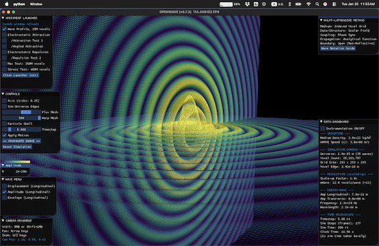

# M4 EWT (Energy Wave Theory): Model Briefing

> **What M4 brings.** Jeff Yee's Energy Wave Theory as a live vector-field non-linear PDE
> engine: the successor to M3's scalar core, carrying EWT's analytic wave constants +
> equations into a time-integrated solver. The substrate upgrade is complete; the
> electron-soliton search is the live open work. It shares the "EWT (M4)"
> [`MODELS.md`](../../../MODELS.md) column with M3.

## Identity

| Field | Value |
| --- | --- |
| Model ID | M4 |
| Name | EWT (Energy Wave Theory) |
| Author | Jeff Yee, built on Milo Wolff + Gabriel LaFreniere pioneer work |
| Extension | Łukasz Smoliński (ψ³ soliton stabilizer, the 1-3-6 arrangement) |
| Relationship | the vector-PDE successor to M3 (Wolff-LaFreniere scalar); same EWT family, shares the coverage column (see [`../m3_wolff_lafreniere/__M3_model_briefing.md`](../m3_wolff_lafreniere/__M3_model_briefing.md)) |
| Primary sources | Yee energywavetheory.com papers (01-10 + supplements); Smoliński soliton paper (`theory/`) |
| In-repo | `medium.py` + `particle.py` + `wave_engine.py` + `force_motion.py` + `_launcher.py`; `research/M4_engine_upgrade.md`; validation record under `../m3_wolff_lafreniere/research/` |

## Model Profile (what it brings, short form)

| Attribute | M4 |
| --- | --- |
| Substrate | indexed cubic voxel grid (attometer f32); 3-component displacement field ψ (triple-buffer leapfrog) |
| Particle | a WaveCenter: a localized wave-deflector that emits spherical waves and responds to energy gradients; neutrino = K = 1 seed |
| Approach | EWT wave constants + equations: non-linear vector wave PDE `∂²ψ/∂t² = c²∇²ψ − dV(ψ)`; energy `E = ρV(fA)²`; force `F = −∇E` |
| Charge | phase offset (0 = electron, π = positron), imposed not emergent |
| V(ψ) modes | linear / cubic / saturating / double-well (swappable) |
| Free parameters | EWT analytic wave constants (A, λ, f, ρ, c) + electron K = 10, outer-shell Oe, orbital gλ |
| Anchor | electron (K = 10 tetrahedron), neutrino (K = 1 seed); constants calibrated to measured electron radius / energy / mass |

## Decision-Relevant Attributes

Model-level attributes to weigh the column: parameter economy, the formal artifacts that
back the claims, and what would falsify the model next. The EWT record lives on the M3
scalar engine, so these link into `m3_wolff_lafreniere/`. (Held here for now; a consolidated
cross-model version may return to `MODELS.md` later.)

| Attribute | M4 (EWT) |
| --- | --- |
| Free parameters | EWT's analytic wave constants (amplitude, wavelength, density); in-sim runs add documented envelope/threshold choices per script [`../m3_wolff_lafreniere/research/0a_equations.md`](../m3_wolff_lafreniere/research/0a_equations.md) |
| Formal artifacts | Runnable scripts + an explicit honest-blockers status doc [`../m3_wolff_lafreniere/research/0_STATUS.md`](../m3_wolff_lafreniere/research/0_STATUS.md) |
| Falsifiable near-term tests | K-selectivity under perturbation (currently failing, and documented as such) [`../m3_wolff_lafreniere/research/0_STATUS.md`](../m3_wolff_lafreniere/research/0_STATUS.md) |

## Field Configuration of Particles

Same particle picture as M3 (the EWT family), now on a vector substrate. All configurations
use **standing-wave interference, not topology** (no winding number, no vortex):

| Particle | Field configuration in M4 | Topological vortex? |
| --- | --- | --- |
| Electron / positron | K = 10 "1-3-6 tetrahedron" of in-phase wave-centers; positron = phase π | ❌ standing wave |
| Electron neutrino | K = 1 fundamental wave-center seed | ❌ standing wave |
| Annihilation pair | two opposite-phase WCs, head-on | ❌ |

The vector engine adds the machinery (L / T split, swappable `V(ψ)`) intended to make
selectivity and far-field EM *emerge*, but the electron-soliton core is not yet obtained.

## Implementation Status

The EWT family shares one MODELS.md column, "EWT (M4)": **0 ✅, 8 ⚠️, 3 ❌, 10 🚧** (of 21).
The validation record is authored on the M3 scalar engine; M4 is the vector-PDE successor
whose in-sim validation is in progress. The engine substrate upgrade (P0-P4) is complete;
zero cells are yet fully validated in-platform.

| Sector | Status |
| --- | --- |
| Vector-PDE substrate | ✅ built + runs (medium, leapfrog PDE, swappable `V(ψ)`, WC modes, `F = −∇E`, annihilation detection) |
| Electron mass | ⚠️ analytic EWT values, not in-sim dynamics |
| Charge quantization | ❌ imposed via `cos(offset)` (#203) |
| Lepton K-selectivity | ❌ all K = 2..10 equally stable at perfect placement (#201) |
| Coulomb far-field | ❌ needs the L / T divergence-curl split (#202) |
| Soliton core / oscillon | 🚧 not yet obtained (pure cubic collapses; saturating quintic does not arrest at CFL dt) |

Deep dives: [`research/M4_engine_upgrade.md`](research/M4_engine_upgrade.md); the shared EWT
record under
[`../m3_wolff_lafreniere/research/0_STATUS.md`](../m3_wolff_lafreniere/research/0_STATUS.md).

## Roadmap

| Next | What lands |
| --- | --- |
| Electron soliton (#201) | the oscillon route: localized seed + sub-CFL dt + mass term |
| Smoliński ψ³ stabilizer | coupling γ ≈ 2.41e4 from BCC geometry (γ = 8π⁷); verify the 1-3-6 stability postulate numerically |
| Emergent Coulomb (#202) | add the L / T divergence-curl split for far-field EM |
| Absorbing boundary | replace the Dirichlet reflections that pollute the soliton search |

## Help Wanted

| You can contribute | How |
| --- | --- |
| Land the electron oscillon | find a localized, stable soliton core in the vector PDE (the headline open problem) |
| Implement the L / T split | unlock emergent Coulomb (#202) |
| Verify the Smoliński stabilizer | test whether ψ³ with γ = 8π⁷ holds the 1-3-6 arrangement |
| A documented negative | a runnable "this does not work, here is why" counts as much as a positive |

Flow: open an issue or discussion → fork → branch → PR with a DCO sign-off
(`git commit -s`), under Apache 2.0. See [`../../../MODELS.md`](../../../MODELS.md)
§ Contributing, [`../../../ONBOARDING_MODELS.md`](../../../ONBOARDING_MODELS.md),
[`../../../CONTRIBUTING.md`](../../../CONTRIBUTING.md). Model discussion runs in the
Models-of-Particles group.

## Rich Context for Deep Reader

This is a top level documentation and orientation content. For additional context on this model, a detailed read in the /theory and /research folders is recommended, as well as the production files in this model root folder, that may contain the canonical full PDE implementation of the theory.
