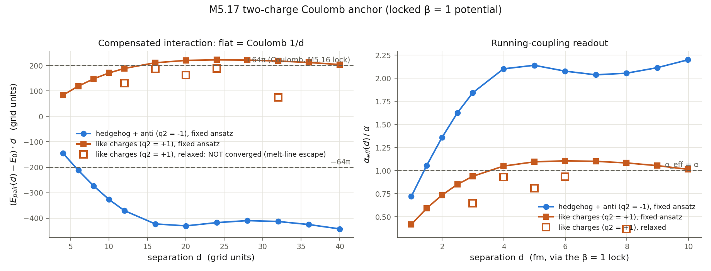

# M5 static electron sector: METHODS NOTE (the audit page)

> Equations first; every term then mapped to the exact code line. This page answers "what does it calculate": the functional being minimized, the potential, the reduction, the discretization, and the definition of every reported observable, each with a one-click link into the code. Results live in [`m5_16_report.md`](m5_16_report.md) (the parameter lock) and § 8 below (the two-charge run); this page is the method. Code links are COMMIT-PINNED to `0465975` (the M5.17 delivery commit) so line anchors never drift; every anchor was verified against that commit before sending.

## 1. The field and the convention

`M(x)` is a real symmetric 4×4 tensor field,

```text
M = O D O^T ,   D = diag(g, 1, delta, 0) ,   eta = diag(-1, 1, 1, 1)
```

with the time/g axis at index 0 and the spatial block at indices 1..3 (Duda index-0 convention). The static sector below acts on the spatial block `M_sp` (spectrum `s.(1, delta, 0)` with melt amplitude `s(x)`); the g axis rides along frozen and is MEASURED to decouple exactly from the statics (gate G8: `E(g = 8) == E(g = 1e10)`, relative difference 0.0).

## 2. The energy functional (what is minimized)

The static energy (the spatial integral of the static Hamiltonian density; no time derivatives in this sector) is

```text
E[M] = INT d^3x  [ u_curv(x)  +  ( V(M_sp(x)) - V_vac ) ]

u_curv = c2 . 4 . SUM_{mu<nu} || [ d_mu M , d_nu M ] ||_F^2 ,    mu,nu in {x,y,z}

V(M_sp) = a Tr(M_sp^2)  -  b Tr(M_sp^3)  +  c (Tr M_sp^2)^2
```

`[A,B] = AB - BA`, `||.||_F` = Frobenius norm. `V_vac = V(diag(1,0,0)) = a - b + c` so the uniaxial vacuum has zero energy density. This quartic trace Landau-de Gennes form is the Eq. 13 family of arXiv:2108.07896; the commutator curvature term is the `F_munu = [d_mu M, d_nu M]` sector of its Eq. 18-20 Lagrangian restricted to statics.

## 3. Vacuum structure: what fixes the coefficients

Requiring `V` stationary at the uniaxial vacuum spectrum `(1, 0, 0)` (zero forcing) and a positive melt cost:

```text
a = (3b - 4c) / 2 ,      melt cost  V(0) - V(1) = c - b/2 > 0  =>  beta = b/c in (0, 2)
```

One shape ratio `beta = b/c` survives; the electron sector cannot pin it (the size prediction is beta-flat), and its physical meaning is the delta-axis stiffness `kappa_delta = (3/2) b` (the cubic term alone restores the delta eigenvalue). The remaining scale is fixed by the two anchors of § 6.

## 4. The axisymmetric reduction (exact, not an approximation)

Equivariant ansatz (cylindrical symmetry along the spin axis):

```text
M(rho, phi, z) = R12(phi) . Mt(rho, z) . R12(phi)^T
```

`R12` = rotation in the spatial (1,2) plane. At `phi = 0` the three derivative channels are

```text
M_x = d_rho Mt ,     M_y = (1/rho) [ J , Mt ] ,     M_z = d_z Mt
```

with `J = dR12/dphi|_0` (`J[1,2] = -1`, `J[2,1] = +1`); the 3D integral reduces EXACTLY to the (rho, z) half-plane with volume weight `2 pi rho drho dz`. The axis is handled by a cell-centered rho grid (`rho_i = (i + 1/2) h`) plus the mirror ghost `Mt(-rho, z) = P Mt(rho, z) P`, `P = diag(1, -1, -1, 1)` (the `phi = pi` image): no one-sided bias at `rho = 0`. Gate G6 checks the reduced 2D energy against a direct 3D evaluation of the same field, converging at `h^2` order.

## 5. Discretization, gradient, minimizers

Central differences on the cell-centered grid; the energy is the Riemann sum of § 2 with weight `2 pi rho h^2`. The production gradient is ANALYTIC (no autodiff on the calibration path): for `C = [A,B]` with `A,B` symmetric,

```text
d||C||^2/dA = 2 [C, B] ,    d||C||^2/dB = -2 [C, A] ,
azimuthal adjoint:  A_phi = [J, Mt]/rho   ->   -[J, G]/rho ,
dV/dM_sp = 2a M_sp - 3b M_sp^2 + 4c Tr(M_sp^2) M_sp
```

validated against central finite differences to 3.6e-7 (gate G2). Minimizers: mass-preconditioned FIRE and nonlinear conjugate gradient (Polak-Ribiere + bracketing/golden-section line search, the Faber-group recipe), run as independent cross-checks.

## 6. Anchors and observable definitions

```text
Analytic anchor:  pure director hedgehog M_sp = rhat rhat^T  =>  u_curv = 8 c2 / r^4  exactly,
                  spherical shell integral = 32 pi c2 (1/r1 - 1/r2)          (gates G3, G4)
Coulomb (M5.16):  32 pi c2 / r  ==  alpha hbar c / 2r   =>   c2 = alpha hbar c / (64 pi)
Mass:             E[M] = m_e c^2 at the minimum  =>  the grid length unit (0.2495 fm at beta = 1)
```

Observables: `r_half` = the radius of the sphere enclosing HALF the total energy (numeric interior + the exact exterior-tail quadrature of the `8 c2 / r^4` density outside the box); the Derrick virial check `E_curv = 3 E_pot` at any minimum; the melt profile `s(r)` = largest eigenvalue of `M_sp`, radially binned. The Faber reference value uses the SAME `r_half` observable evaluated on the arctan profile of the SU(2) soliton.

## 7. THE EQUATION-TO-CODE MAP

The physics lives in ONE module, [`m5_17_energy.py`](../scripts/m5_17_energy.py) (~240 lines, docstring = the equations above); drivers import it and add CLI/minimizers/gates. Base URL `https://github.com/openwave-labs/openwave/blob/04659750c3a12f5950ffe41851bfdd7fc177c0b8/openwave/xperiments/m5_liquid_crystal/research/scripts/`:

| Equation (§ above) | Function | Code |
| --- | --- | --- |
| `u_curv = c2 . 4 . Σ ‖[d_mu M, d_nu M]‖²` (§ 2) | `curvature_density_np` | [`m5_17_energy.py:115`](https://github.com/openwave-labs/openwave/blob/04659750c3a12f5950ffe41851bfdd7fc177c0b8/openwave/xperiments/m5_liquid_crystal/research/scripts/m5_17_energy.py#L115-L131) |
| `V = a Tr(M²) − b Tr(M³) + c (Tr M²)² − V_vac` (§ 2) | `potential_density_np` | [`m5_17_energy.py:133`](https://github.com/openwave-labs/openwave/blob/04659750c3a12f5950ffe41851bfdd7fc177c0b8/openwave/xperiments/m5_liquid_crystal/research/scripts/m5_17_energy.py#L133-L138) |
| `E[M]` = weighted sum of the two densities (§ 2, § 5) | `total_energy_np` | [`m5_17_energy.py:194`](https://github.com/openwave-labs/openwave/blob/04659750c3a12f5950ffe41851bfdd7fc177c0b8/openwave/xperiments/m5_liquid_crystal/research/scripts/m5_17_energy.py#L194-L197) |
| `a = (3b − 4c)/2`, `V_vac`, `beta` window (§ 3) | `ldg_coeffs` | [`m5_17_energy.py:97`](https://github.com/openwave-labs/openwave/blob/04659750c3a12f5950ffe41851bfdd7fc177c0b8/openwave/xperiments/m5_liquid_crystal/research/scripts/m5_17_energy.py#L97-L104) |
| azimuthal channel `(1/rho)[J, Mt]` + axis mirror ghost (§ 4) | inside `curvature_density_np` (`J4`, `MIR`) | [`m5_17_energy.py:89`](https://github.com/openwave-labs/openwave/blob/04659750c3a12f5950ffe41851bfdd7fc177c0b8/openwave/xperiments/m5_liquid_crystal/research/scripts/m5_17_energy.py#L89-L94) + [`:115`](https://github.com/openwave-labs/openwave/blob/04659750c3a12f5950ffe41851bfdd7fc177c0b8/openwave/xperiments/m5_liquid_crystal/research/scripts/m5_17_energy.py#L115-L131) |
| volume weight `2 pi rho h²` (§ 4) | `cell_weights` | [`m5_17_energy.py:141`](https://github.com/openwave-labs/openwave/blob/04659750c3a12f5950ffe41851bfdd7fc177c0b8/openwave/xperiments/m5_liquid_crystal/research/scripts/m5_17_energy.py#L141-L144) |
| the analytic gradient adjoints (§ 5) | `energy_gradient_np` | [`m5_17_energy.py:147`](https://github.com/openwave-labs/openwave/blob/04659750c3a12f5950ffe41851bfdd7fc177c0b8/openwave/xperiments/m5_liquid_crystal/research/scripts/m5_17_energy.py#L147-L192) |
| exterior tail of `8 c2 / r⁴` (§ 6) | `ext_tail` | [`m5_17_energy.py:200`](https://github.com/openwave-labs/openwave/blob/04659750c3a12f5950ffe41851bfdd7fc177c0b8/openwave/xperiments/m5_liquid_crystal/research/scripts/m5_17_energy.py#L200-L208) |
| melted hedgehog seed `M_sp = s(r) n nᵀ` (§ 1, § 4) | `hedgehog_field` / `hedgehog_3d` | [`m5_17_energy.py:217`](https://github.com/openwave-labs/openwave/blob/04659750c3a12f5950ffe41851bfdd7fc177c0b8/openwave/xperiments/m5_liquid_crystal/research/scripts/m5_17_energy.py#L217-L233) |
| FIRE + conjugate-gradient minimizers (§ 5) | `fire_relax` / `prcg_relax` | [`m5_16_axisym.py:217`](https://github.com/openwave-labs/openwave/blob/04659750c3a12f5950ffe41851bfdd7fc177c0b8/openwave/xperiments/m5_liquid_crystal/research/scripts/m5_16_axisym.py#L217-L261) / [`:294`](https://github.com/openwave-labs/openwave/blob/04659750c3a12f5950ffe41851bfdd7fc177c0b8/openwave/xperiments/m5_liquid_crystal/research/scripts/m5_16_axisym.py#L294-L337) |
| `r_half`, virial, `s(r)` definitions (§ 6) | `observables` | [`m5_16_axisym.py:341`](https://github.com/openwave-labs/openwave/blob/04659750c3a12f5950ffe41851bfdd7fc177c0b8/openwave/xperiments/m5_liquid_crystal/research/scripts/m5_16_axisym.py#L341-L402) |
| spherically-constrained radial solve (the calibration class) | `run_radial` (exact chain rule `dE/ds_k`) | [`m5_16_axisym.py:640`](https://github.com/openwave-labs/openwave/blob/04659750c3a12f5950ffe41851bfdd7fc177c0b8/openwave/xperiments/m5_liquid_crystal/research/scripts/m5_16_axisym.py#L640-L793) |
| Coulomb + m_e anchor chain, Faber reference (§ 6) | `do_lock` / `faber_r_half` | [`m5_16_calibrate.py:122`](https://github.com/openwave-labs/openwave/blob/04659750c3a12f5950ffe41851bfdd7fc177c0b8/openwave/xperiments/m5_liquid_crystal/research/scripts/m5_16_calibrate.py#L122) / [`:84`](https://github.com/openwave-labs/openwave/blob/04659750c3a12f5950ffe41851bfdd7fc177c0b8/openwave/xperiments/m5_liquid_crystal/research/scripts/m5_16_calibrate.py#L84-L93) |
| two-charge pair ansatz + Coulomb fit (§ 8) | `pair_field` / `coulomb_fit` | [`m5_17_two_charge.py:100`](https://github.com/openwave-labs/openwave/blob/04659750c3a12f5950ffe41851bfdd7fc177c0b8/openwave/xperiments/m5_liquid_crystal/research/scripts/m5_17_two_charge.py#L100-L121) / [`:134`](https://github.com/openwave-labs/openwave/blob/04659750c3a12f5950ffe41851bfdd7fc177c0b8/openwave/xperiments/m5_liquid_crystal/research/scripts/m5_17_two_charge.py#L134-L142) |

Every claim in the results pages traces to a pre-registered gate: G2 gradient vs finite differences; G3/G4 the analytic hedgehog closed forms; G5 formula-equivalence to the validated 3D lineage; G6 2D==3D at h² order; G7 frame invariance; G8 g-decoupling. Gate code: [`m5_16_axisym.py:406-601`](https://github.com/openwave-labs/openwave/blob/04659750c3a12f5950ffe41851bfdd7fc177c0b8/openwave/xperiments/m5_liquid_crystal/research/scripts/m5_16_axisym.py#L406-L601); latest run: all pass, [`m5_16_axisym_gates.json`](../data/m5_16_axisym_gates.json).

## 8. The two-charge Coulomb configuration (the 2026-07-03 prescription)

Two hedgehog cores on the z-axis at `z = ±d/2` (still exactly axisymmetric), uniaxial tilt-angle ansatz:

```text
Theta(rho, z) = theta_1 + q2 . theta_2 ,   theta_i = atan2(rho, z - z_i) ,   q2 = ±1
n = (sin Theta, 0, cos Theta) ,   M_sp = s(r_1) s(r_2) . n n^T
```

`q2 = -1` (hedgehog/anti-hedgehog): far field is the uniform vacuum; `q2 = +1`: total degree 2. Under the § 6 lock the prediction is `E_int(d) = q2 . 64 pi c2 / d` (the grid form of `± alpha hbar c / d`). Protocol: `E_pair(d)` on a fixed grid, large-d fit `E0 + A/d` (E0 absorbs the d-independent self-energies), `A` compared to `q2 . 64 pi`; the small-d branch `|E_pair(d) - E0| . d / (64 pi)` is the running-coupling readout `alpha_eff(d)/alpha`. Both a fixed-ansatz curve and pinned-core relaxed energies are reported: data `m5_17_two_charge_*.json`, plot `../plots/m5_17_two_charge.png`, numbers in the results section of [`m5_17` task record](../tasks/m5_17_task_details.md).

Topology note (measured): under FULL relaxation with pinned core disks NEITHER sign settles into a two-defect equilibrium at the locked parameters. The `q2 = -1` pair is topologically trivial and ANNIHILATES through a melt bridge on the axis (energy drops to the vacuum residual at every d); the `q2 = +1` pair conserves its total degree 2 but RESTRUCTURES through the same melt channel without converging. Root cause, quantified: the locked melt cost `c - b/2 = 1.9e-3` per cell makes a unit-radius melt line of length 32 cost ~0.19 while the escapes release 16-32 energy units: thin melt lines are essentially free in the quartic trace-LdG at these coefficients. The Coulomb anchor cross-check therefore stands at the ansatz level (the large-d fixed-ansatz fit, the "uniaxial should suffice" regime), and the open melt channel is the same mechanism as the hedgehog point-vs-ring saddle: the terms that would close it are precisely the open questions Q13 (chiral + Frank pair) / Q14 (what holds the point defect) / Q15 (sixth-order pinning).



## 9. Fig. 9 conformance (the prescribed starting ansatz)

| Fig. 9 element (arXiv:2108.07896, p. 10) | This implementation |
| --- | --- |
| `M = O D O^T`, spatial `D = diag(1, delta, 0)` | same convention (§ 1), spectrum `s.(1, delta, 0)` with melt `s(r)` |
| Radial major axis (hedgehog: `O` maps `zhat` to `rhat`) | identical: `n = (rho, 0, z)/r` at `phi = 0` + the § 4 equivariant rotation |
| Twist phase `psi` (delta-axis orientation about `n`; `Psi = exp(i psi)` = the clock) | static sector: the two axisymmetric `psi = const` textures (delta axis along `phi-hat` / `theta-hat`) are graded EXACTLY in delta (quartic-polynomial extraction; they differ by 0.27% at first order); the DYNAMICAL `psi(x,t)` is the clock sector, out of scope here (§ 10) |
| No core regularization in the figure (singular director) | the melt `s(r) -> 0` at the core IS the "activate potential to avoid singularity" step; its calibrated form is the M5.16 deliverable |
| 4×4 extension with `g` (gravitoelectromagnetism) | carried frozen at index 0; measured exactly decoupled from statics (G8) |

## 10. Not computed here (scope honesty)

| Not computed | Where it lives |
| --- | --- |
| clock frequency, angular momentum, magnetic dipole (the other 3 electron observables) | the DYNAMICAL sector: requires the time axis live, not the static functional; planned on the calibrated solution (roadmap M5.12 phase D / M5.9) |
| a chiral (Lifshitz) term in the free energy | not present; whether the substrate is chiral is open question Q13 |
| sixth-order LdG invariants | not present; the quartic form cannot be exactly stationary at `(1, delta, 0)` (residual force `3 b delta` on the delta axis), open question Q15 |
| dynamical delta | delta enters as an exact polynomial grading of the static energy, not a relaxing degree of freedom (Duda 2026-06: "delta is dynamical" remains the open intent question) |
| the unconstrained ground state | the spherical hedgehog is measured to be a SADDLE of the unconstrained axisymmetric functional (the point-vs-ring escape); the calibration runs in the spherically-constrained class, open question Q14 |
| the 4D (clock + gravity) extension | owner spec received 2026-07-05 (Duda's reply to this note): the potential must have minimum `(g, 1, delta, 0)` and the curvature commutator becomes `[A,B] = A xi B - B xi A`, `xi = diag(-1,1,1,1)`; static fields here are xi-blind (every dM has a zero time block), so nothing above changes; the spec routes to the dynamical sector ([`../tasks/m5_17_convo.md`](../tasks/m5_17_convo.md)) |
