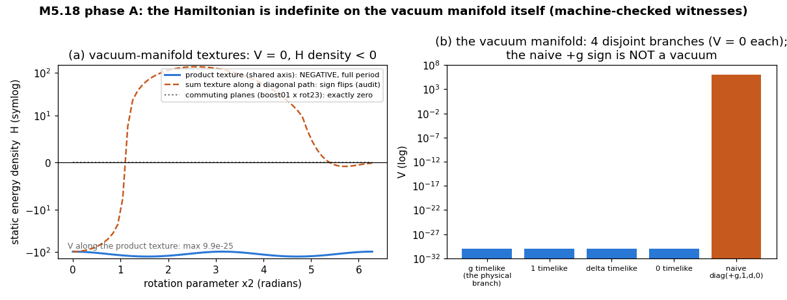

# M5.18 VERIFICATION NOTE: the 4D Lagrangian, its Hamiltonian, and what they imply

> Verification requested by Jarek Duda (2026-07-05: "maybe Fable5 could verify that this Lagrangian is Lorentz-invariant, and derived from it Hamiltonian is right (by Legendre transform)? I think it is, but nobody else has checked it. Should be used if it is right."). Equations first; every claim then mapped to a machine check in [`m5_18_lorentz_check.py`](../scripts/m5_18_lorentz_check.py) (all 15 checks PASS, residuals in [`m5_18_lorentz_check.json`](../data/m5_18_lorentz_check.json)). Exchange record: [`m5_17_convo.md`](../tasks/m5_17_convo.md) entry 2. Code links point at `main` with file:line anchors (task-scoped scripts are FROZEN after delivery, so the anchors are stable; method-note standard, [`dev_docs/METHOD_NOTE.md`](../../../../dev_docs/METHOD_NOTE.md)).

## VERDICT (one paragraph)

Both claims are RIGHT: the Lagrangian is Lorentz-invariant (§ 2), and the boxed Hamiltonian is exactly what the Legendre transform gives (§ 3). Three qualifications matter before "should be used": (a) the Legendre map is DEGENERATE, so the theory is constrained (§ 4); (b) with η-traces the covariant vacuum is `M_vac = diag(−g, 1, δ, 0)`, time-time component negative: the preferred spectrum `(g, 1, δ, 0)` belongs to the mixed tensor `η·M` (§ 5); (c) the Hamiltonian is INDEFINITE, and not just formally: an explicit boost-rotation texture lying entirely ON the vacuum manifold (`V = 0` exactly) has strictly negative energy density, so H is unbounded below unless the boost-texture sector is constrained, gauged away, or physically reinterpreted (§ 6). None of this touches the 3D static sector: every published static number is exactly unchanged (§ 7).

## 1. Objects and conventions

```text
M(x): real symmetric 4x4 tensor field on R^{1,3},  eta = diag(-1,1,1,1)

transformation law (rank-2 covariant tensor), x' = Lam x, Lam^T eta Lam = eta:
    M'(x') = Lam^{-T} M(x) Lam^{-1}

eta-commutator (Duda 2026-07-05):   [A,B]_eta = A.eta.B - B.eta.A
curvature:                          F_{mu nu} = [d_mu M, d_nu M]_eta
    (antisymmetric in mu,nu AND in the internal index pair, since A,B symmetric)

eta-trace (mixed-tensor trace):     Tr_eta(M^p) = trace((eta.M)^p)

Lagrangian density:
    L = - SUM_{mu<nu} F_{mu nu alpha beta} F^{mu nu alpha beta} - V(M)
        (ALL four indexes raised with eta)
potential (Duda's universal spectral form):
    V(M) = SUM_{p=1..4} (Tr_eta(M^p) - c_p)^2 ,   c_p = SUM_i Lambda_i^p ,
    Lambda = (g, 1, delta, 0)

claimed Hamiltonian (the slide):
    H = SUM_{0<=mu<nu<=3} F_{mu nu alpha beta} F_{mu nu}^{alpha beta} + V(M)
      = 2 SUM_{mu<nu} [ SUM_{1<=a<b<=3} (F_{mu nu a b})^2
                        - SUM_{a=1..3} (F_{mu nu a 0})^2 ] + V(M)
        (INTERNAL indexes raised with eta; spacetime indexes NOT raised)
```

The useful algebraic fact behind everything: with hatted (mixed) forms `X^ = eta.X`, the eta-commutator is the ordinary commutator, `eta.[A,B]_eta = [A^, B^]`, and mixed forms transform by similarity, `M^' = Lam M^ Lam^{-1}`. So every eta-contraction is an ordinary matrix-algebra statement about similarity-covariant objects.

## 2. Lorentz invariance: CONFIRMED ✅

Under `M'(x') = Lam^{-T} M(x) Lam^{-1}`:

```text
d'_mu M'(x') = (Lam^{-1})^rho_mu . Lam^{-T} (d_rho M)(x) Lam^{-1}
```

The internal eta-sandwich reproduces itself: for A, B transforming as `Lam^{-T}(.)Lam^{-1}`, using `Lam^{-1} eta Lam^{-T} = eta` (the defining property rearranged),

```text
[Lam^{-T} A Lam^{-1}, Lam^{-T} B Lam^{-1}]_eta = Lam^{-T} [A,B]_eta Lam^{-1}
```

so `F'_{mu nu}(x') = (Lam^{-1})^rho_mu (Lam^{-1})^sigma_nu Lam^{-T} F_{rho sigma}(x) Lam^{-1}`: F is a fully covariant rank-4 tensor. The Lagrangian contracts every index with eta, hence is a scalar. Same for the potential: `Tr_eta((M')^p) = trace((Lam (eta M) Lam^{-1})^p) = Tr_eta(M^p)`.

| Machine check | Result |
| --- | --- |
| L_curv scalar under 20 random boosts+rotations (rapidity ~0.5), random quadratic field | relative drift 1.3e-11 ✅ |
| V scalar under the same transforms | 2.0e-14 ✅ |
| NEGATIVE CONTROL: plain commutator + plain Frobenius, no eta | drift 3.1e+4 ❌ as it must: the eta insertions are exactly what invariance requires |

## 3. The Hamiltonian: CONFIRMED as the Legendre transform ✅

Because eta is diagonal, raising the two spacetime indexes gives a sign `eta^{mumu} eta^{nunu}`: +1 for spatial pairs (ij), −1 for time pairs (0i). Writing `S_{mu nu} = F_{mu nu alpha beta} F_{mu nu}^{alpha beta}` (internal raising only),

```text
L = SUM_i S_{0i}  -  SUM_{i<j} S_{ij}  -  V(M)     =:  T - U
```

`F_{0i} = [Mdot, d_i M]_eta` is LINEAR in the velocity `Mdot`, so `T = SUM_i S_{0i}` is a QUADRATIC form in `Mdot` and `U` is velocity-independent. For any Lagrangian of the form `L = T(quadratic in velocity) - U`, Euler's identity gives `pi : Mdot = 2T`, hence

```text
H = pi : Mdot - L = 2T - (T - U) = T + U = SUM_{0<=mu<nu<=3} S_{mu nu} + V(M)
```

which is EXACTLY the boxed formula. It is also the Noether energy `T^0_0` of the time-translation symmetry, so the same expression is the conserved energy regardless of the phase-space subtleties in § 4. The slide's ± expansion is the internal raising written out: `S_{mu nu} = 2[ SUM_{spatial a<b} (F_{mu nu a b})^2 - SUM_a (F_{mu nu a 0})^2 ]` (each internal 0 index contributes one factor `eta^{00} = −1`; `F_{mu nu 0 0} = 0` by antisymmetry).

| Machine check | Result |
| --- | --- |
| `H = L(Mdot) − 2 L(0)` (exact consequence of T-quadraticity) == boxed formula, 10 random velocity fields | 3.6e-16 ✅ |
| T exactly quadratic: `T(lam Mdot) = lam² T(Mdot)` | machine-exact ✅ |
| the slide's ± expansion vs the full eta-contraction | 1.8e-15 ✅ |

## 4. Qualification (a): the Legendre map is degenerate (constraints exist)

The momentum `pi = 2 K(grad M) Mdot` cannot be inverted for `Mdot`: the kinetic quadratic form K has a kernel. At minimum, the direction `Mdot ∝ eta` is ALWAYS silent, because

```text
[eta, B]_eta = eta.eta.B - B.eta.eta = B - B = 0   for every symmetric B,
```

so that velocity component never enters L and its conjugate momentum vanishes identically: a primary constraint. (Generic further kernel: any `Mdot` in the eta-commutant of `{d_i M}`.) Machine check: `[eta,B]_eta = 0` exact; `L(Mdot + 0.37 eta) = L(Mdot)` exact. Consequence: the (M, pi) canonical formulation needs a Dirac constraint analysis (out of scope here); the ENERGY FUNCTION `H(M, Mdot)` of § 3 is correct and conserved regardless. This mirrors gauge theory (EM's `A_0` has no momentum) and is not a defect, just work that remains.

## 5. Qualification (b): the covariant vacuum is `diag(−g, 1, δ, 0)`

With eta-traces, the condition `Tr_eta(M^p) = c_p = g^p + 1 + delta^p` is met by the MIXED tensor `eta.M` having spectrum `(g, 1, delta, 0)`. In covariant components that is

```text
M_vac = diag(-g, 1, delta, 0)      (time-time component NEGATIVE)
```

Machine check: `V(diag(-g,1,delta,0)) = 0` exactly; `V(diag(+g,1,delta,0)) ≈ 1.05e6` at g = 8 (not a vacuum at all). This is a pure convention statement, but it must be fixed once and used consistently: the 3D static code (time row frozen, plain traces on the spatial block) is unaffected, and the natural reading of ALL spectrum statements in the 4D model is "spectrum of `eta.M`".

## 6. Qualification (c): H is indefinite, and the vacuum manifold itself carries negative-energy textures

The blue-boxed `−SUM_a (F_{mu nu a 0})^2` terms are not exotic corners; they activate for ordinary-looking static textures. Three measured facts (machine checks, exact):

| Configuration (static, `Mdot = 0`) | Energy density |
| --- | --- |
| spatial-block gradient × time-mixing gradient: `F` is purely internal-(a0), `S = −2\|v\|²` | **−2.6** (negative) |
| time-mixing × time-mixing (boost × boost): `F` is purely internal-spatial | +2.0 (positive: the sign is channel-specific) |
| **boost-gradient × rotation-gradient ON THE VACUUM MANIFOLD**, the PRODUCT texture `Lam(x) = expm(x1 eta W_boost01) expm(x2 eta W_rot12)`, boost and rotation planes SHARING axis 1; `M(x) = Lam(x)^{-T} M_vac Lam(x)^{-1}` (Lorentz conjugation preserves every `Tr_eta` invariant, so `V = 0` along the whole texture; measured 2e-23) | **−97.8 to −127.7 over the FULL rotation period in x2**, exactly x1-independent (simultaneous conjugation): negative EVERYWHERE at ZERO potential cost |

The third row is the load-bearing one: a texture that winds a boost gradient against a rotation gradient (in planes sharing an axis) has negative curvature density along its whole extent while staying exactly on the vacuum manifold, and the density is exactly invariant under x1-translations, so the total energy falls linearly with the occupied volume:

```text
H_total ~ -(const) x Volume  ->  unbounded below,
```

unless the boost-texture sector is (i) removed by a constraint (the § 4 Dirac analysis is the natural place), (ii) declared gauge (but gauge directions give ZERO energy, not negative, so this needs care), or (iii) physically reinterpreted: a negative-energy channel sourced by boost textures is suggestively gravity-shaped (attraction; the g-axis lives on the boost sector in the model's own mapping), and may be intended rather than pathological. Which of (i)-(iii) is the model's intent is a question for the owner, not something verification can decide.

Two sharpenings from the adversarial audit (§ 10): the construction is generator-specific: COMMUTING planes (boost01 × rot23) give exactly zero density, and the naive `expm(x1 W_b + x2 W_r)` sum-texture is negative only near the origin (+4407 at (1.5, −0.8)): the product texture above is the correct witness. And the vacuum manifold is NOT one orbit: V = 0 fixes only the SPECTRUM of `eta.M`, so the manifold is a UNION of 4 disjoint Lorentz orbits labeled by which preferred eigenvalue (g, 1, delta, or 0) rides the timelike eigenvector (all four branch representatives measured V = 0 exactly). Whether the g-branch is the physical one everywhere, and whether domain walls between branches are meaningful objects, are further owner-intent questions.



Figure: (a) static energy density along the three textures (symlog): the shared-axis product texture (blue) is negative over its FULL rotation period at V ≤ 1e-24; the audit's sum-texture contrast (orange, dashed) flips sign; commuting planes (gray, dotted) sit exactly at zero. (b) the 4 vacuum branches all at V = 0 (fp floor on the log axis) vs the naive `diag(+g, 1, delta, 0)`, which is not a vacuum at all. Rendered by [`m5_18_plot.py`](../scripts/m5_18_plot.py) from the same construction as checks 4b/4c.

## 7. What is NOT affected: the entire 3D static sector (and the potential, implemented)

For every field in the M5.16/M5.17 class (time row uniform, zero time block in every `d_mu M`), the eta-commutator equals the plain commutator and the eta-contraction equals the plain Frobenius norm, term by term (machine check: 1.4e-14). The Coulomb lock `c2 = alpha hbar c / (64 pi)`, `r_half = 2.926 fm`, the two-charge curve, and the melt-channel measurement all carry over EXACTLY. The signature enters only when time derivatives or time-mixing textures do.

The universal spectral potential itself was implemented and run on the calibrated static instrument the same day ([`m5_18_spectral.py`](../scripts/m5_18_spectral.py); full record [`m5_18_task_details.md`](../tasks/m5_18_task_details.md)):


Figure: (a) at the calibrated scales the two potentials nearly coincide along the uniaxial melt path (spectral melt cost 2.17e-3 vs LdG 1.89e-3 per cell); (b) the relaxed hedgehog melt profiles coincide; (c) the electron-size prediction is potential-shape ROBUST: `r_half = 2.935 fm` h-converged (NR 64/96/128) vs the quartic-LdG 2.926 and Faber's 3.075. Consequences measured, not assumed: the biaxial `(1, delta, 0)` spectrum is pinned EXACTLY (the quartic could not), and the melt channel (hedgehog escape, antipair annihilation) SURVIVES the potential swap in both routes, so what holds point defects must be a gradient-order term (the chiral + Frank pair) or the clock dressing, not the potential shape.

## 8. THE EQUATION-TO-CODE MAP

All in [`m5_18_lorentz_check.py`](../scripts/m5_18_lorentz_check.py) (checks run headless; JSON = [`m5_18_lorentz_check.json`](../data/m5_18_lorentz_check.json)):

| Equation / claim (§ above) | Function / check | Code |
| --- | --- | --- |
| `[A,B]_eta = A.eta.B − B.eta.A` (§ 1) | `comm_eta` | [`m5_18_lorentz_check.py:79`](https://github.com/openwave-labs/openwave/blob/main/openwave/xperiments/m5_liquid_crystal/research/scripts/m5_18_lorentz_check.py#L79) |
| internal raising `F_{ab}F^{ab}` (§ 1) | `inner_eta` | [`m5_18_lorentz_check.py:87`](https://github.com/openwave-labs/openwave/blob/main/openwave/xperiments/m5_liquid_crystal/research/scripts/m5_18_lorentz_check.py#L87) |
| `Tr_eta(M^p) = trace((eta.M)^p)` (§ 1) | `tr_eta_p` | [`m5_18_lorentz_check.py:96`](https://github.com/openwave-labs/openwave/blob/main/openwave/xperiments/m5_liquid_crystal/research/scripts/m5_18_lorentz_check.py#L96) |
| `V(M) = Σ_p (Tr_eta(M^p) − c_p)²` (§ 1) | `v_spec` | [`m5_18_lorentz_check.py:100`](https://github.com/openwave-labs/openwave/blob/main/openwave/xperiments/m5_liquid_crystal/research/scripts/m5_18_lorentz_check.py#L100) |
| `L = −Σ_{mu<nu} F F^{...}` with spacetime signs (§ 3) | `l_curv` | [`m5_18_lorentz_check.py:109`](https://github.com/openwave-labs/openwave/blob/main/openwave/xperiments/m5_liquid_crystal/research/scripts/m5_18_lorentz_check.py#L109) |
| `S_{mu nu}` per ordered pair (§ 3) | `s_munu` | [`m5_18_lorentz_check.py:126`](https://github.com/openwave-labs/openwave/blob/main/openwave/xperiments/m5_liquid_crystal/research/scripts/m5_18_lorentz_check.py#L126) |
| `H` claimed formula (§ 3) | `h_claim` | [`m5_18_lorentz_check.py:137`](https://github.com/openwave-labs/openwave/blob/main/openwave/xperiments/m5_liquid_crystal/research/scripts/m5_18_lorentz_check.py#L137) |
| random Lorentz `Lam = expm(eta.W)`, W antisym (§ 2) | `random_lorentz` | [`m5_18_lorentz_check.py:141`](https://github.com/openwave-labs/openwave/blob/main/openwave/xperiments/m5_liquid_crystal/research/scripts/m5_18_lorentz_check.py#L141) |
| tensor transformation law (§ 2) | `transform_derivs` | [`m5_18_lorentz_check.py:148`](https://github.com/openwave-labs/openwave/blob/main/openwave/xperiments/m5_liquid_crystal/research/scripts/m5_18_lorentz_check.py#L148) |
| invariance checks + negative control (§ 2) | main, checks 1/1b | [`m5_18_lorentz_check.py:166`](https://github.com/openwave-labs/openwave/blob/main/openwave/xperiments/m5_liquid_crystal/research/scripts/m5_18_lorentz_check.py#L166) |
| Legendre identity `H = L(Mdot) − 2L(0)` (§ 3) | main, check 2 | [`m5_18_lorentz_check.py:187`](https://github.com/openwave-labs/openwave/blob/main/openwave/xperiments/m5_liquid_crystal/research/scripts/m5_18_lorentz_check.py#L187) |
| primary constraint (§ 4) | main, check 3 | [`m5_18_lorentz_check.py:211`](https://github.com/openwave-labs/openwave/blob/main/openwave/xperiments/m5_liquid_crystal/research/scripts/m5_18_lorentz_check.py#L211) |
| covariant vacuum + witnesses A/contrast (§ 5, § 6) | main, check 4 | [`m5_18_lorentz_check.py:221`](https://github.com/openwave-labs/openwave/blob/main/openwave/xperiments/m5_liquid_crystal/research/scripts/m5_18_lorentz_check.py#L221) |
| vacuum-manifold product-texture negative density + audit contrasts (§ 6) | main, check 4b | [`m5_18_lorentz_check.py:241`](https://github.com/openwave-labs/openwave/blob/main/openwave/xperiments/m5_liquid_crystal/research/scripts/m5_18_lorentz_check.py#L241) |
| vacuum manifold = 4 disjoint orbit branches (§ 6) | main, check 4c | [`m5_18_lorentz_check.py:295`](https://github.com/openwave-labs/openwave/blob/main/openwave/xperiments/m5_liquid_crystal/research/scripts/m5_18_lorentz_check.py#L295) |
| slide ± expansion (§ 3) | main, check 5 | [`m5_18_lorentz_check.py:305`](https://github.com/openwave-labs/openwave/blob/main/openwave/xperiments/m5_liquid_crystal/research/scripts/m5_18_lorentz_check.py#L305) |
| static-sector blindness (§ 7) | main, check 6 | [`m5_18_lorentz_check.py:316`](https://github.com/openwave-labs/openwave/blob/main/openwave/xperiments/m5_liquid_crystal/research/scripts/m5_18_lorentz_check.py#L316) |

## 9. Not verified here (scope honesty)

| Not done | Why / where it lives |
| --- | --- |
| Dirac constraint analysis of the degenerate kinetic form | § 4 flags it; needed before a canonical (M, pi) quantization-grade Hamiltonian formulation; follow-up task candidate |
| whether the negative boost-texture channel is constrained, gauge, or intended (gravity-shaped) | owner-intent question (§ 6); goes in the reply email |
| equations of motion / well-posedness of the 4D evolution | M5.12 phase D territory, on top of this verification |
| the 4D potential's coefficient freedom (per-p weights) | Duda: "there is freedom to choose this potential"; the equal-weight form is what was checked; weights do not affect § 2-§ 6 conclusions (each trace is separately invariant) |

## 10. Independent adversarial audit (2026-07-05)

Per the multi-agent verification rule (Duda 2026-07-03: "careful small steps, maybe multiple agents verifying each other"), a second agent audited this note adversarially: own script (different seed, wave-mode field construction, finite-difference Legendre momenta over all 10 symmetric components instead of the exact-quadratic shortcut), hand re-derivations of § 3-§ 5.

| Audit outcome | Detail |
| --- | --- |
| Claims of § 2, § 3, § 4, § 5, witness A of § 6, § 7 | CONFIRMED independently (its own numbers: invariance drift 1.3e-12 / 2.1e-14; FD-Legendre 1.9e-11; witness A matched its hand formula) |
| Original § 6 orbit witness | REFUTED as stated: the first construction (`expm` of the SUM of generators) is negative only near the origin (+4407 at (1.5, −0.8)). The audit supplied the corrected PRODUCT texture with the shared-axis requirement; adopted above, re-verified over the full rotation period (check 4b), conclusion (unbounded below) unchanged |
| New finding | The vacuum manifold is a union of 4 disjoint Lorentz orbits (the timelike-eigenvalue label), § 6 last paragraph + check 4c |

The audit changed the note (this section is the record); the machine-check suite gained 5 checks (audit contrasts + branch structure), all green.
