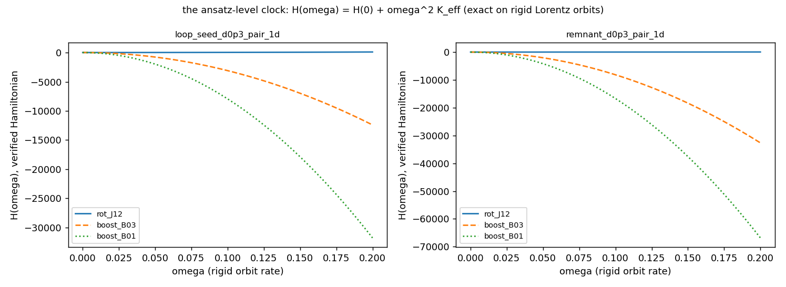
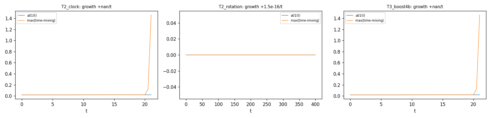
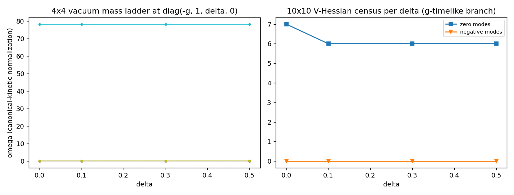
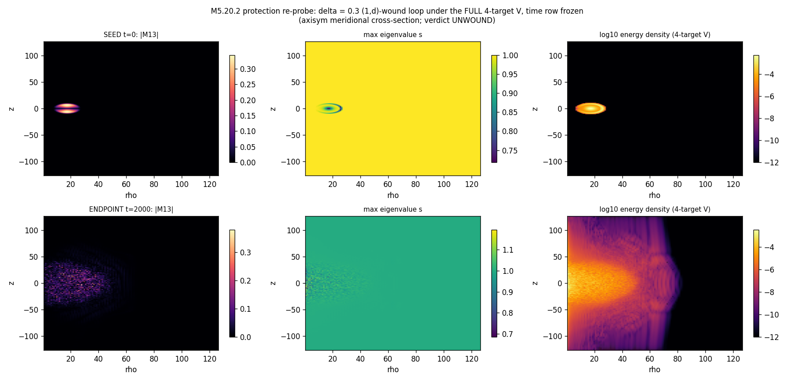

# M5.20.x combined method note: the (1, δ, 0) protection verdict + the 4×4 (g, 1, δ, 0) clock sector

**Tasks**: [`m5_20_1_task_details.md`](../tasks/m5_20_1_task_details.md) + [`m5_20_2_task_details.md`](../tasks/m5_20_2_task_details.md) · **Spec**: Duda 2026-07-11/12 ([`m5_20_convo.md`](../tasks/m5_20_convo.md)): "topological vortex requires potential with (1, delta, 0) minimum ... which should regularize to two equal in center"; "in 3D (1, delta, 0) you can start with, but finally to get oscillations requires full 4x4 tensor"; "clock propulsion with negative Hamiltonian terms require full 4x4 tensor field with (g, 1, delta, 0) spectrum". Predecessor: [`m5_20_method_note.md`](m5_20_method_note.md) (the δ = 0 verdict). This ONE note carries both runs; the per-task detail notes are appendices ([`m5_20_1_method_note.md`](m5_20_1_method_note.md) has the full spatial-run audit trail). Status: ✅ complete (both parts audited; task reviews approved 2026-07-12).

## 0. FIELD CONTENT: the medium IS the full 4×4 tensor

```text
THE SUBSTRATE (engine default since M5.8.1, your convention throughout):
   M(x) = O(x) · D · O(x)^T,   M real-symmetric 4x4,
   D = diag(g, 1, δ, 0),  index 0 = the time/g axis,  g = 8.0
   (medium.py: MDIM = 4, LC_G = 8.0).
Your 4D Lagrangian is machine-verified on it (M5.18: Lorentz invariance
1.3e-11, Legendre exact) and the spectral potential pins (g, 1, δ, 0)
exactly. Everything below runs on this 4x4 medium:
  PART I  evolves the spatial 3x3 block with (1, δ, 0), your sanctioned
          start ("in 3D (1, delta, 0) you can start with"), time row
          inert (with M_0μ = (−g, 0, 0, 0) uniform every commutator
          channel leaves it invariant);
  PART II makes the time row DYNAMICAL, with the equations of motion
          DERIVED from your verified Lagrangian (no new assumptions),
          and measures the clock sector.
```

---

## PART I: does the (1, δ, 0) gap protect the vortex loop? (spatial sector)

### I.1 Equations

```text
L = ∫ 2πρ dρ dz [ (1/2) ||∂t M||_F²  −  u_curv  −  V ]
u_curv = 4 c₂ Σ_{μ<ν} ||[∂_μ M, ∂_ν M]||_F²     (c₂ = 1, the audited M5.17 form)
V      = w Σ_{p=1..3} (Tr M_sp^p − c_p)²,  c_p = 1 + δ^p   (target (1, δ, 0))
w      = 7.24e-4 (the calibrated scale, FIXED across δ; one autochi-recalibrated control)
```

Your mechanism, measured before any run: at δ = 0 the vacuum V-Hessian has FOUR zero modes (3 conjugation flats + the splitting direction of the degenerate (0,0) pair: the potential-free removability face the δ = 0 unwinding used); at δ ≠ 0 the splitting mode ACTIVATES ("activating potential"): lowest activated gap ω = 0.0041 / 0.0099 / 0.0125 at δ = 0.1 / 0.3 / 0.5, zero modes drop 4 → 3. Exactly your prediction.

The two-equal core is priced analytically per winding pairing (which pair of (1, δ, 0) spans the cross-section plane): the (1, δ)-wound core ((1+δ)/2, (1+δ)/2, 0) costs V/w = 0.61 / 0.29 / 0.09 per cell; the (δ, 0)-wound core (1, δ/2, δ/2) is nearly free (3e-5 / 0.002 / 0.02); full melt costs 3.2-5.1. Your "energy minimization has to equalize 2 eigenvalues in the center" made the pairing a MEASUREMENT: both pairings were seeded and a core-spectrum diagnostic reads which pair each run holds equalized.

### I.2 The object, seen directly (the simulation cross-sections)

The panels are the axisym meridional half-plane (ρ, z); the 3D object is this revolved around the axis. At t = 0 the neutrino-candidate loop sits as a compact wound ring at ρ = 17: |M13| = the winding texture, the s-dip = your two-equal regularized core:


The same cross-section at t = 2000, after conservative evolution (closed box, energy conserved to ≤ 7e-6 over 100k steps):


### I.3 Results (each next to its gate; full table + audit in the [appendix note](m5_20_1_method_note.md))

| Result | Number | Verification |
| --- | --- | --- |
| **UNWOUND at every δ, both pairings, statics AND dynamics** | 10/10 dynamics runs (6 core + 2 sponge + recal-w + δ=0 anchor) + 6/6 FIRE statics; endpoint eigenframe reads 0.0 at r_w 3-8, no wound core-hunt peak | pre-registered classifier + per-peak core hunt; independent adversarial audit CONFIRMED with its own instruments (plaquette defect maps, own bilinear reads) |
| Unwinding needs NO radiation | closed boxes conserve E to ≤ 3.6e-6 (core 6) / ≤ 7.3e-6 (all 10) while q → 0 | trajectory ledgers, audit-recomputed |
| Why the gap fails | the activated core barrier integrates to ~3% of the loop's curvature energy at w = 7.24e-4: removal stays net downhill (statics E strictly monotone) | analytic barrier × tube ÷ measured loop E; audit claim 6 |
| The measured pairing answer | the dynamics ABANDONS the seeded (1, δ) two-equal core in every run; the (δ, 0)-equalized endpoint is genuine at δ ≥ 0.3 (remnant spectrum (0.99, 0.23, 0.07)-class), vacuum-confounded below | core-spectrum diagnostic + audit claim 3 |
| The remnant | pair_1d endpoints keep a PERSISTENT localized unwound oscillation: E_blob flat over T = 300, spectral power in a band (0.13-0.16) overlapping the top vacuum mass line 0.146; pair_d0 endpoints disperse (19% sponge-absorbed) via their far field's weak linear channel | blob probe + audit re-estimate (the band statement is the audited wording) |
| Scheme robustness | recalibrated-w control: same verdict; δ = 0 anchor reproduces the M5.20 corpus | classifier v2 |


**Honest scope**: q = 1/2, R0 = 17, narrow cores, w = 7.24e-4 (a w >> 1 barrier-dominated regime was not swept); the axisym scheme cannot represent Cartesian-uniform biaxial far fields (every uniform equivariant biax vacuum carries a scheme-invisible axis disclination, priced and reported).

---

## PART II: the 4×4 time sector, run from your verified Lagrangian

### II.1 What the derivation found (no new assumptions: your L, as machine-verified in M5.18)

```text
η = diag(−1,1,1,1),  [A,B]_η = AηB − BηA,  F_μν = [∂_μ M, ∂_ν M]_η,
L = − Σ_{μ<ν} η^μμ η^νν ⟨F, F⟩_η − V,
V = w Σ_{p=1..4} (Tr_η(M^p) − C_p)²,  C_p = g^p + 1 + δ^p,
g-timelike branch vacuum M₀ = diag(−g, 1, δ, 0).
```

| Finding | Content |
| --- | --- |
| 1. L is purely quartic in derivatives | the kinetic sector is the F₀ᵢ block: T = 4 Σᵢ ⟨[Ṁ, Aᵢ]_η, [Ṁ, Aᵢ]_η⟩_η: quadratic in Ṁ with an M-dependent mass form K(M) that VANISHES on gradient-free states, is degenerate everywhere (Ṁ ∝ η null: your verified primary constraint), and on the loop states is rank 8/10 with 3 NEGATIVE directions at the core: there is no canonical kinetic term to inherit, and the Legendre map cannot be inverted near vacuum |
| 2. The runnable regularization (documented) | canonical kinetic (1/2)‖Ṁ‖² + YOUR static sector (η-curvature + 4-target V); gates: frozen-time-row reduction == the Part-I stack to 9e-17 / 4.3e-13; full 4×4 FD gradcheck 6.4e-8; V = 0 exactly on all four timelike-assignment branches |
| 3. The 4×4 gap map (analytic, exact) | 6 exact boost/rotation flats + ω = {0.0093, 0.0466, 0.1349, 78.28} at δ = 0.3 on the g-branch (78.28 = the stiff g-restoring mode) |
| 4. Boost-sector runaway (measured, audit-confirmed physical) | under the canonical completion, rotation textures are exactly stable (time-mixing identically zero over T = 400) while boost-sector injections on the biaxial vacuum diverge at t ≈ 21 (dt-ROBUST across 4×: 21.1 at dt 0.02, 21.0 at dt 0.005: physical, not numerical). Audit sharpening: the runaway REQUIRES spatial gradients (the equivariant A_φ background); on a gradient-free J-commuting background the same bump is inert, exactly as the purely-quartic structure demands (no kinetic channel without gradients). Field-level time integration on physical (gradient-carrying) states is obstructed without an additional constraint |
| 5. The clock, measured exactly (no integration) | on rigid Lorentz orbits Λ(s) = exp(sωG): H(ω) = H(0) + ω²K_eff EXACTLY. Census on the loop seed, the unwound remnant, and the vacuum: ALL rotation orbits K_eff > 0 (+8e2..+4e4; the vacuum J12/B03 zeros exact); ALL boost orbits K_eff < 0 (−3e5..−2.5e6, 100% negative density); the alternate (1-timelike) branch keeps the signs at ~100× the magnitudes (±e8 class). This is "clock propulsion with negative Hamiltonian terms" made quantitative, and it means H is unbounded below along every boost orbit: NO stable finite-ω clock exists in L + canonical dynamics without a constraint |







### II.2 The protection re-probe under the full 4-target V: UNWOUND

δ = 0.3, (1, δ)-wound loop, your FULL p = 1..4 potential (the p = 4 trace target adds +1.70 to the seed energy vs Part I's 3-target form), time row frozen at −g (the stable sector), T = 2000, dt = 0.02, energy conserved to 2.3e-6: **UNWOUND** (endpoint eigenframe reads 0.0 at r_w 3-8, every core-hunt peak unwound, the core again drifting to the (δ, 0) equalization). The p = 4 target does not change the spatial verdict.



### II.3 The one question this leaves with you

The spatial sector does not protect the loop (Part I, twice audited), and the time sector's negative terms are real but UNBOUNDED along boost orbits (II.1 findings 4-5), so the oscillation run you asked for needs one structural input: **what constraint closes the boost sector?** A Dirac treatment of the degenerate Legendre map (your verified primary constraint removes only the η direction)? Restriction to rotation orbits / a compact subgroup? A different branch or sign convention we have missed? Given that input, the full 4×4 oscillation run is ready to go the same day: the substrate, the derived EOM, the gates, and the (g, 1, δ, 0) pinning are all in place.

---

## 3. Equation-to-code map (both parts)

| Term / instrument | Function | File |
| --- | --- | --- |
| Part I: gap map, vacuum enumeration, core barriers | `vacuum_hessian_delta`, `enumerate_vacua`, `core_cost_table` | [`m5_20_1_a_theory.py`](https://github.com/openwave-labs/openwave/blob/main/openwave/xperiments/m5_liquid_crystal/research/scripts/m5_20_1_a_theory.py) |
| Part I: biax loop seeds + winding + core-spectrum diagnostics | `loop_field_biax`, `winding_measure_biax`, `core_spectrum` | [`m5_20_1_b_seeds.py`](https://github.com/openwave-labs/openwave/blob/main/openwave/xperiments/m5_liquid_crystal/research/scripts/m5_20_1_b_seeds.py) |
| Part I: statics, dynamics, verdicts, blob | `relax_case`, `run_case`, `classify`, `core_hunt` | [`m5_20_1_c_statics.py`](https://github.com/openwave-labs/openwave/blob/main/openwave/xperiments/m5_liquid_crystal/research/scripts/m5_20_1_c_statics.py) · [`m5_20_1_d_dynamics.py`](https://github.com/openwave-labs/openwave/blob/main/openwave/xperiments/m5_liquid_crystal/research/scripts/m5_20_1_d_dynamics.py) · [`m5_20_1_e_verdicts.py`](https://github.com/openwave-labs/openwave/blob/main/openwave/xperiments/m5_liquid_crystal/research/scripts/m5_20_1_e_verdicts.py) · [`m5_20_1_f_blob.py`](https://github.com/openwave-labs/openwave/blob/main/openwave/xperiments/m5_liquid_crystal/research/scripts/m5_20_1_f_blob.py) |
| Part I: independent adversarial audit (own instruments) | `m5_20_1_audit_check.py` | [`m5_20_1_audit_check.py`](https://github.com/openwave-labs/openwave/blob/main/openwave/xperiments/m5_liquid_crystal/research/scripts/m5_20_1_audit_check.py) |
| Part II: η-energy, 4×4 gradient, kinetic form, Hessian, branches | `u_eta_density`, `v4_density`, `grad_static_4`, `kin_form_apply`, `hessian4_analytic`, `vac4` | [`m5_20_2_a_eom.py`](https://github.com/openwave-labs/openwave/blob/main/openwave/xperiments/m5_liquid_crystal/research/scripts/m5_20_2_a_eom.py) |
| Part II: triage (dt, injections, GO/NO-GO) | `t1_dt`, `t23` | [`m5_20_2_b_dynamics.py`](https://github.com/openwave-labs/openwave/blob/main/openwave/xperiments/m5_liquid_crystal/research/scripts/m5_20_2_b_dynamics.py) |
| Part II: K_eff + H(ω) on rigid orbits | `k_eff` | [`m5_20_2_c_clock.py`](https://github.com/openwave-labs/openwave/blob/main/openwave/xperiments/m5_liquid_crystal/research/scripts/m5_20_2_c_clock.py) |
| Part II: the 4-target protection re-probe | `m5_20_2_d_protection.py` | [`m5_20_2_d_protection.py`](https://github.com/openwave-labs/openwave/blob/main/openwave/xperiments/m5_liquid_crystal/research/scripts/m5_20_2_d_protection.py) |
| The verified-Lagrangian source of truth (M5.18, frozen) | `m5_18_lorentz_check.py` | [`m5_18_lorentz_check.py`](https://github.com/openwave-labs/openwave/blob/main/openwave/xperiments/m5_liquid_crystal/research/scripts/m5_18_lorentz_check.py) |

## 4. Not computed

- Field-level time integration of the boost sector (obstructed: the measured runaway; § II.3).
- The pure-L (M, π) evolution with K(M) pseudo-inversion (degenerate + indefinite; the K census is the diagnostic).
- A w >> 1 barrier-dominated regime for Part I (the calibrated-scale verdict is what is claimed).
- Oscillation observables vs the measured lepton set (pre-registered for the well-posed oscillation run: mass ratios, PMNS angles, δ_CP, Δm², absolute-mass bounds, with the free-parameter count reported).
- Domain walls between the four vacuum branches (owner-intent).

## 5. Adversarial audits

Part I: DONE (independent agent, own instruments; headline CONFIRMED; two presentation claims corrected, both fixes folded into Part I above; detail in the [appendix note § 6](m5_20_1_method_note.md)). Part II: DONE (independent agent, own integrator + own instruments; `m5_20_2_audit_check.py` → `data/m5_20_2_audit.json`): **all six claims CONFIRMED, zero refutations**: the purely-quartic structure exact (3e-15), the analytic Hessian + omega ladder reproduced (1.2e-10, off-diagonal flats exactly quartic), the boost runaway dt-robust (physical) with the gradient-requirement control, the H(ω) parabola exact to 5e-14 with all 24 K_eff rows reproduced, the protection endpoint independently defect-free (plaquette scan residual 8e-13; the seed's +1/2 core and its topologically required −1/2 blend-shell partner both found), the GB0 reduction numbers reproduced. Bugs found: latent grid-shape default and a 4× normalization note in `kin_form_apply` (census unaffected), two cosmetic reporting artifacts in the triage numbers, one presentation scope fix (folded above). Interpretation caveat folded into finding 4.
