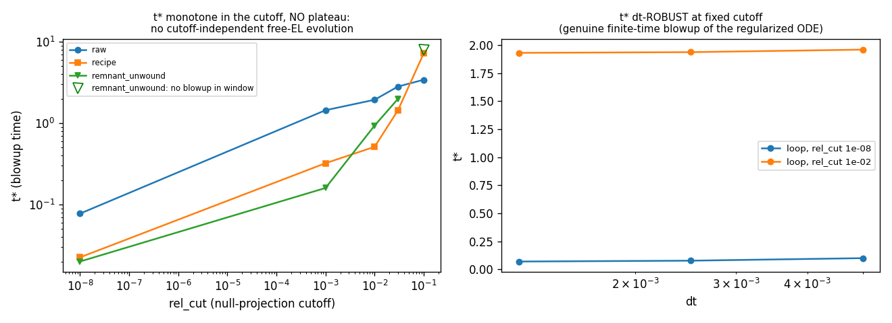
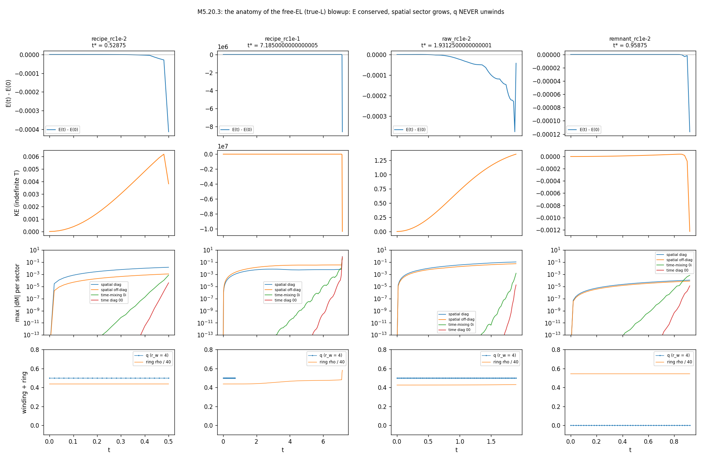
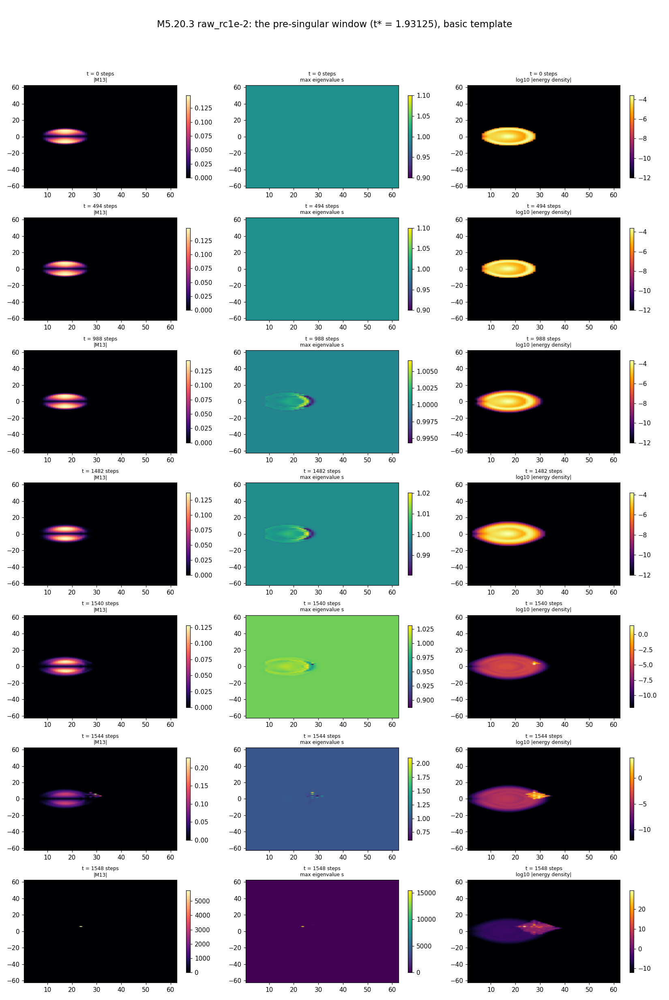
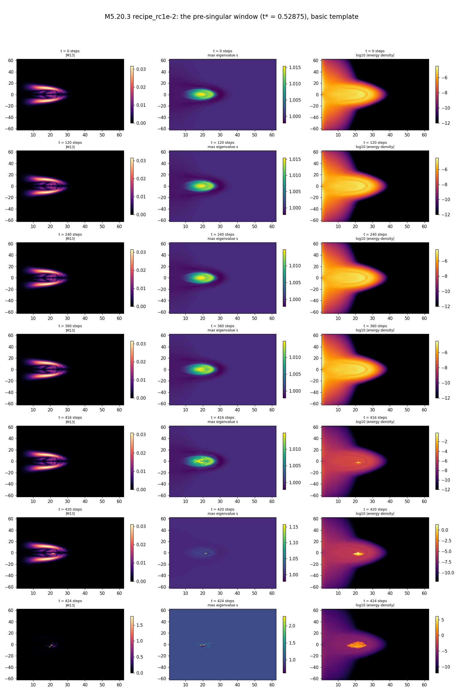
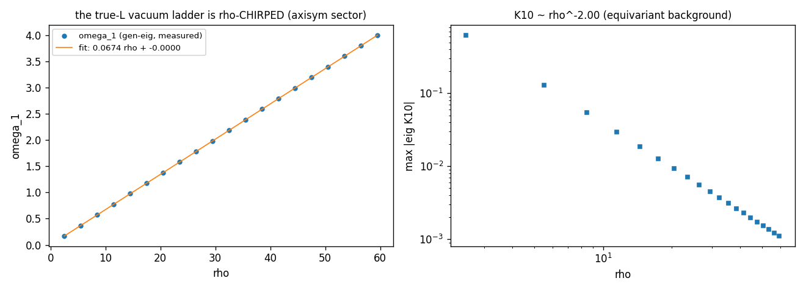

# M5.20.3 method note: free Euler-Lagrange evolution of the quartic Lagrangian on the vortex loop

**Task**: [M5.20.3](../tasks/m5_20_3_task_details.md) · runs 2026-07-14 · stack: the audited axisym (ρ, z) scheme (M5.17/M5.18/M5.20.x lineage) · grid 64×128, h = 1 (box-independence spot-checked at 128×256) · δ = 0.3, g = 8, the M5.12-pinned w.

> **FIELD CONTENT.** M(x) is a symmetric 4×4 tensor field on the axisymmetric half-plane; η = diag(−1, 1, 1, 1); the vacuum is the g-timelike branch representative M_vac = diag(−g, 1, δ, 0), so ηM_vac has the preferred spectrum (g, 1, δ, 0). The object under test is the biaxial (δ, 0)-pair vortex loop (ring radius R₀ = 17, meridional winding q = 1/2), extended to 4D by the frozen g time row, per the owner's 2026-07-13 prescription. Everything below evolves the owner's OWN Lagrangian with no added terms.

## 1. The equations

The M5.18-verified Lagrangian (machine checks 15/15, Lorentz invariance ~1e-11):

```text
L = - SUM_{mu<nu} eta^mumu eta^nunu <F_munu, F_munu>_eta  -  V(M)
F_munu = [d_mu M, d_nu M]_eta,      [A, B]_eta = A eta B - B eta A
<F, G>_eta = tr(eta F eta G^T)
V = w SUM_{p=1..4} (tr((eta M)^p) - C_p)^2,   C_p = g^p + 1 + delta^p
```

Splitting time from space (i ∈ {ρ, φ, z}, the audited channels; normalization pinned by the GB0 gate to the M5.17 spatial sector):

```text
L = T - U,   T = 4 SUM_i <[Mdot, A_i]_eta, [Mdot, A_i]_eta>_eta
U = INT w_cell (u_eta + V),   u_eta = 4 SUM_{i<j} <F_ij, F_ij>_eta
```

T is quadratic in Ṁ with the state-dependent kinetic form (closed form, derived and gate-checked):

```text
T_tot = (1/2) Mdot . KK(M) Mdot,      KK = 4 w_cell k_apply(M)
k_apply(M)[X] = 2 SUM_i (eta X W_i + W_i X eta - 2 Y_i X Y_i)
W_i = eta A_i eta A_i eta,   Y_i = eta A_i eta
```

The free Euler-Lagrange equations, per cell in the 10-dim symmetric basis:

```text
4 w k_apply(M)[Mddot] = gradM_T - G_static - 4 w kdot(M, Mdot)
gradM_T = dT/dM at fixed Mdot   (dT/dA_i = -8 adj(F_i, Mdot), scattered)
kdot = 2 SUM_i (adj([Mdot, Adot_i], A_i) + adj([Mdot, A_i], Adot_i))
```

The Legendre map is DEGENERATE (the verified primary constraint: Ṁ ∝ η is an exact global null of k_apply, and the measured null space is larger, § 3). The runnable resolution, per the owner's "no artificial restrictions, everything from evolution": spectral solve of the 10×10 K per cell, directions with \|λ\| below a cutoff (rel_cut × cell max) get M̈ = 0, and the discarded force is bookkept exactly:

```text
dE/dt = - SUM_cells 4 w (V_null . RHS_null)      (E = T + U; the ONLY
energy channel besides integrator error; machine identity GC0e)
```

## 2. Equation-to-code map

| Equation | Code |
| --- | --- |
| channels A_ρ, A_φ = [J, M]/ρ, A_z | [`m5_20_2_a_eom.py`](https://github.com/openwave-labs/openwave/blob/main/openwave/xperiments/m5_liquid_crystal/research/scripts/m5_20_2_a_eom.py) `channels` |
| u_eta, V, E_static, dE/dM | same file: `u_eta_density`, `v4_density`, `grad_static_4` |
| T = 4 Σ ⟨[Ṁ,A]η,[Ṁ,A]η⟩η | [`m5_20_3_a_constraint.py`](https://github.com/openwave-labs/openwave/blob/main/openwave/xperiments/m5_liquid_crystal/research/scripts/m5_20_3_a_constraint.py) `t_density` |
| k_apply closed form / K10 build | same file: `build_k10` (16×16 operator + basis projection; gate GC0d pins it to the 10-pass build at 7e-18) |
| gradM_T, kdot | same file: `grad_m_T`, `kdot_density` |
| the per-cell spectral EL solve + null ledger | same file: `accel` |
| the integrator (velocity Verlet, velocity-in-force at the half step) | same file: `evolve_true` |
| triage gates B1-B5 | [`m5_20_3_b_triage.py`](https://github.com/openwave-labs/openwave/blob/main/openwave/xperiments/m5_liquid_crystal/research/scripts/m5_20_3_b_triage.py) |
| anatomy runs | [`m5_20_3_c_production.py`](https://github.com/openwave-labs/openwave/blob/main/openwave/xperiments/m5_liquid_crystal/research/scripts/m5_20_3_c_production.py) |
| core gate, chirped ladder, ill-posedness card | [`m5_20_3_d_observables.py`](https://github.com/openwave-labs/openwave/blob/main/openwave/xperiments/m5_liquid_crystal/research/scripts/m5_20_3_d_observables.py) |
| figures | [`m5_20_3_plots.py`](https://github.com/openwave-labs/openwave/blob/main/openwave/xperiments/m5_liquid_crystal/research/scripts/m5_20_3_plots.py) |

Instrument gates (all PASS, complex-step, `data/m5_20_3_a_gates.json`): GC0a momentum 4e-16 · GC0b kinetic M-gradient 7e-16 · GC0c static gradient 5e-16 · GC0d K10 fast==slow 7e-18, exact η null 8e-19 · GC0e the energy identity 6e-17.

## 3. What the kinetic form IS (measured structure)

| Structure | Measured |
| --- | --- |
| Rank of K per cell on the loop background | **5/10 EXACTLY** (31866 of 32258 cells; the 5 nulls at machine zero, the first active eigenvalue ≥ 0.17 of the cell max: no gray zone); rank 8 at the 392 core cells |
| Negative-inertia directions | 2 per generic cell, 3 at the core; on the uniform vacuum the active spectrum is (8c², 2c², 2c², −2c², −2c²) at ρ = 20 (c² ~ 1.17e-3): two exact ± pairs PLUS one unpaired positive: the negative directions are structural (the η-signature of the target metric), not a background accident [audit-corrected: the first-draft "comes in ± pairs" overstated] |
| The static force vs the null space (from-rest release) | **98.6% of the static force lies in null(K)** (pair_d0 seed; 100.0% for pair_1d), annulus-localized: at V = 0 the EL null-sector equation 0 = RHS_null is violated at that level: from-rest initial data is (nearly fully) EL-inconsistent, and the projected dynamics discards exactly the bookkept fraction |
| Vacuum inertia scale | K10 ∝ ρ^−2.00 exactly (the equivariant A_φ = [J, M_vac]/ρ background is the only channel) |

## 4. THE HEADLINE: the free-EL initial-value problem is ill-posed, and its regularizations blow up in finite time

Every background measured (bare ansatz loop, the recipe seed, the unwound remnant, vacuum + each M5.20.2 texture class) diverges under the free EL:

| Evidence | Measurement |
| --- | --- |
| Unregularized limit (rel_cut 1e-8) | blowup in a fixed **STEP COUNT** (~3 steps at every dt: t* = 0.06 / 0.015 / 0.005 at dt 0.02 / 0.005 / 0.00125, clock texture), amplitude-INDEPENDENT over 0.0002-0.02: the RHS is unbounded (the active spectrum is continuous down to zero across cells): **the IVP has no Lipschitz bound: ill-posed** |
| Regularized (any fixed cutoff) | genuine finite-time blowup: **t\* dt-ROBUST** (raw loop, rc 1e-2: t* = 1.96 / 1.9375 / 1.93125 at dt 0.005 / 0.0025 / 0.00125) |
| Cutoff ladder (t\* vs rel_cut 1e-8 → 1e-1) | raw loop: 0.0775 → 3.41; recipe: 0.0225 → 7.205; unwound remnant: 0.02 → 1.99 (survives the T = 8 window at rc 1e-1): **monotone, NO plateau: no cutoff-independent evolution exists** |
| The pre-singular amplitudes | spatial sector leads (at t\*−0.15: max\|dM\| spatial diag 0.098, spatial off-diag 0.050, time-mixing 1.3e-6, time diag 2e-11), hotspot ~8 cells outside the ring: a slow quasi-static spatial drift |
| **The MECHANISM (the growth-rate law)** | riding on that drift, an exponentially unstable **boost-sector (time-mixing) linear mode** grows from roundoff on every non-vacuum background: measured rates σ = 80.9/t (recipe, rc 1e-2), 44.4/t (remnant), 41.1/t (raw), 6.31/t (recipe, rc 1e-1; 148 snapshots, 10 decades clean exponential). **t\* ≈ onset + ln(0.1/1e-16)/σ reproduces every measured blowup time**; heavier regularization freezes more of the mode → smaller σ → later t\* (the cutoff-monotonicity), and at rel_cut → 0, σ → per-step amplification (the step-count blowup). The M5.18/M5.20.2 boost hazard, reappearing under the true L as a roundoff-seeded linear instability |
| The energy anatomy | E conserved to ≤ 5e-5 relative (leak integral −1e-4; the drift is not dt²-clean: attributed to projection-set chatter, a documented instrument limit) through 87% of the run's life, then the finite-time singularity when the boost mode reaches O(0.1) and goes nonlinear: KE → −9140, E → −1935 within the final snapshot interval (all sectors engage; time-mixing reaches 121 at the singular snapshot): **the EL evolution dives to −∞ energy through the negative-inertia directions** |
| Not amplitude-triggered at the linear level | at texture amp 2e-5 the vacuum survives (the linearized vacuum is marginal: 4 zero modes + 1 positive; ZERO negative ω² measured anywhere on the vacuum) |
| **The one STABLE evolution** | the ROTATION-sector texture on the vacuum integrates stably for T = 50 at rc 1e-2, both dts (its rc 1e-8 blowup was the numerical near-null tail, dt-sensitive): the instability needs time-mixing seed content or a defect background; time-mixing textures still collapse near-immediately at rc 1e-2 (t* = 0.02-0.03). Consistent with the M5.21 boost-sector quarantine and the M5.20.2 rotation-positive census |





**The owner's own branch fires.** His 2026-07-13 answer pre-named this outcome: "if it turns out that EL evolution → −infinity energy, we should rather go to least action ... fixing initial and final configuration" (the two-point BVP). The measurement says exactly that: the free-EL IVP of the purely-quartic L is not a usable dynamics on these backgrounds; the least-action BVP is the theory's remaining dynamical formulation. The M5.12 phase-D time-periodic BVP machinery is the natural starting point.

## 5. What SURVIVES: three positive measurements

**5a. The topological charge never unwinds.** Through every regularized blowup at rc 1e-2, the winding read stays q = 0.500 EXACT at every finite snapshot (raw run: q_r4 = 0.5 at t = 0 and at the last finite state, all radii). At rc 1e-1 (the longest-lived run) q reads 0.500 while the eigenframe read is trusted (t ≲ 1.8-2.4), after which the degeneracy/mixing guard declines the read (the M5.21 branch-swap lesson applied; the 0.000 at the singular final snapshot is a churned-state read, not a measured unwinding); no unwinding signature appears in any trusted window. Under the canonical-completion stack the same loop unwound 10/10 with energy conserved; under the true-L dynamics the unwinding channel never engages: the loop dies by explosion, not by unwinding. Consistent with § 3: 98.6% of the (unwinding-driving) static force has no inertia channel.





(Cross-section format: the 2026-07-14 film standard, [`../m5_visualization.md`](../m5_visualization.md): first row = the t = 0 seed, 6 frames, titles in steps + model time.)

**5b. His core prediction lands at the statics level (G-CORE ✅).** Frozen-time-row minimization (the bounded sector; the 4D recipe seed) at the point where the loop is still intact (q = 0.500, E down 2.68 → 0.34):

```text
spectrum(eta M_core) = (g, 1, a, a),  a = 0.1269 +- 0.011 (pair split 0.021)
his prediction (2026-07-12): a ~ delta/2 = 0.15     -> measured 0.85 x delta/2
```

Box-independent to 4e-10 (64×128 vs 128×256). The two-low-eigenvalue pair SPLITS (0.19 vs 0.077) as relaxation dissolves the loop: the equalized (δ, 0) core is the LOOP's property, exactly as in the M5.20.1 3D measurement. (The full relax reproduces the statics dissolution: q → 0 by it 1500: the M5.12/M5.19/M5.20.1 statics negative compounds at 64×128.)

**5c. The true-L vacuum ladder is ρ-chirped (replaces the flat canonical ladder).** Because the vacuum inertia is K10 ∝ 1/ρ² while the V-Hessian is ρ-independent, the physical small-oscillation frequencies scale linearly with ρ:

```text
omega_1(rho) = 0.0674 rho + 0.0000   (generalized eig(Hess_V, K10(rho));
K_absmax ~ rho^-2.00; 4 zero modes; no negative omega^2 anywhere)
```



The canonical 4×4 ladder ω = {0.0093, 0.0466, 0.1349, 78.28} assumed unit inertia; under the theory's own kinetic form there is no flat ladder in the axisym sector: any future spectral comparison must use the chirped prediction. (Scope: the 1/ρ² is the equivariant background of the axisym reduction on the non-J-commuting vacuum; the 3D statement needs the full-3D kinetic form.)

**Retracted at audit**: the first-draft claim that free 4D static minimization dives to E → −∞ was an INTEGRATOR artifact: FIRE's adaptive step crossed the stiff-mode stability bound (2/√λ_max ≈ 0.0256 < dt_max 0.05); the audit's monotone gradient descent, L-BFGS, and dt-capped FIRE all stay BOUNDED from this seed. The M5.18 indefiniteness statement (H unbounded below on boost×rotation textures) stands as the M5.18 result; it is not realized by plain 4D descent from the loop seed. The seed prescription still follows his words (3D-minimize, then add the g time row), implemented as the frozen-time-row relax.

## 6. The pre-registered observables: honest disposition

| Pre-registered | Disposition |
| --- | --- |
| G-CORE (g, 1, a, a), a ≈ δ/2 | ✅ measured at the statics level (§ 5b): a = 0.85 × δ/2 |
| G-RADIUS: R(t) breathing at conserved E_total | ❌ NOT REACHED: no stable free-EL evolution exists to measure it on |
| G-SPECTRUM: lines vs the gap ladder | ❌ NOT REACHED: same; § 5c (the chirped ladder) is the surviving spectral statement |
| Unwind DURATION (his shrink-to-R = 0 branch) | the loop does NOT shrink-and-unwind under free EL: it blows up at t\*(cutoff); the duration observable is regularization-dependent, i.e. **not defined by the theory without the BVP formulation** |
| GC0/GC1 | ✅ instrument gates all green; census recorded (§ 3) |
| G-RUNAWAY / G-DT | run as B1-B5: the runaway is the RESULT, dt-robust at fixed cutoff (§ 4) |

## 7. Not computed / scope

| Item | Status |
| --- | --- |
| The least-action two-point BVP (his fallback) | not attempted (successor branch; the M5.12 phase-D BVP instrument is the starting point) |
| Dirac-Bergmann secondary-constraint analysis (consistent initial data with RHS_null = 0) | not derived; the 98.6% from-rest inconsistency (§ 3) is the measured motivation |
| Non-axisym channels, 3D kinetic form, companion δ sweep | not run (the blowup verdict at δ = 0.3 gates them) |
| AMBer flavor fit | pre-registered as long-run target; nothing here reaches it |
| The g-value sensitivity spot check | not run (the blowup is spatial-sector; the g-mode never engaged: time row moved 2e-11) |

## 8. Adversarial audit

Independent second agent, own instruments (`m5_20_3_audit_check.py`, `data/m5_20_3_audit.json`): PENDING; verdicts folded here on completion.

## 9. Data + regeneration

All summary JSONs in `../data/m5_20_3_*.json`; states `m5_20_3_b_seed_{recipe,remnant}.npz`, `m5_20_3_c_<tag>_{seed,end}.npz` (all < 1 MB). Regeneration: `python m5_20_3_a_constraint.py` (gates), `python m5_20_3_b_triage.py b1|b2|b3|b4|b5 <sector>|verdict`, `python m5_20_3_c_production.py all`, `python m5_20_3_d_observables.py d1|d2|d3`, `python m5_20_3_plots.py all`.
