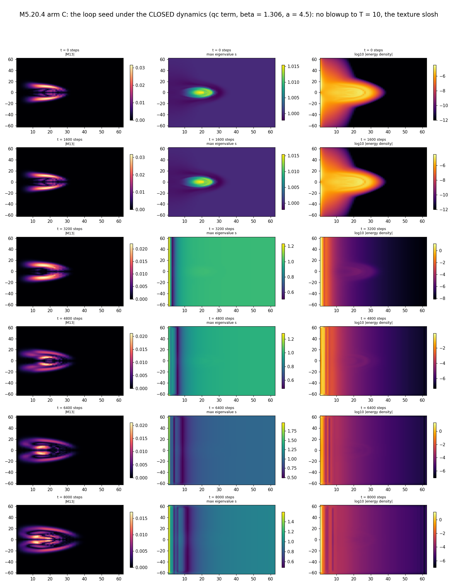
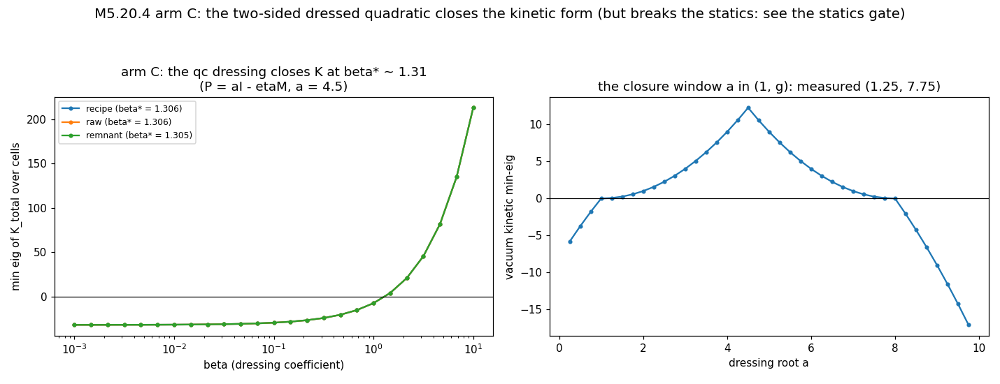
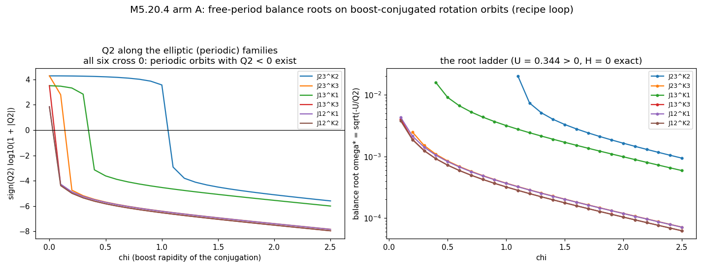
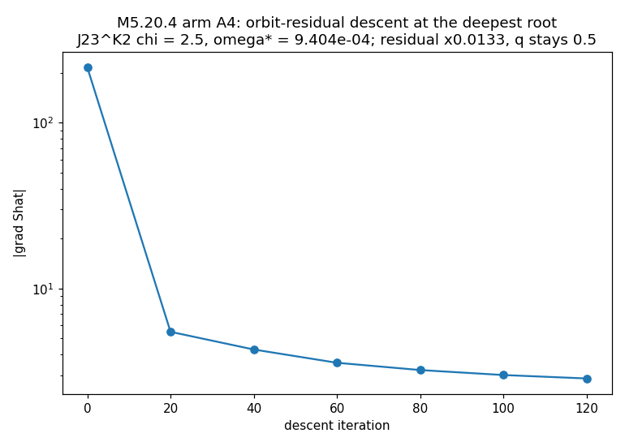

# M5.20.4 method note: the formulation search (arms C / B / A on the quartic L)

**Task**: [`../tasks/m5_20_4_task_details.md`](../tasks/m5_20_4_task_details.md) · **lineage**: [M5.20.3](m5_20_3_method_note.md) (free-EL IVP ill-posed; every regularization blows up; the least-action BVP named as the fallback branch) · **question**: [Q24](../m5_question_tracker.md#q24-detail). Self-directed search (deliberately not author-gated): three formulation routes with pre-registered kill criteria, run order C → B → A.

## 0. FIELD CONTENT (unchanged from M5.20.3)

Symmetric 4×4 field M(ρ,z) on the axisym equivariant stack (64×128, h = 1), η = diag(−1,1,1,1), the M5.18-verified Lagrangian:

```text
L = − Σ_{μ<ν} η^μμ η^νν ⟨F_μν, F_μν⟩_η − V,   F_μν = [∂_μM, ∂_νM]_η
[A,B]_η = AηB − BηA,   ⟨F,G⟩_η = F_ab G_cd η^ac η^bd
V = w Σ_{p=1..4} (Tr((ηM)^p) − C_p)²,  C_p = g^p + 1 + δ^p,  g = 8, δ = 0.3
T = 4 Σ_{i∈{ρ,φ,z}} ⟨[Ṁ, A_i]_η, [Ṁ, A_i]_η⟩_η = ½ Ṁ·K(M)·Ṁ
```

K(M) is the measured kinetic form: rank ≤ 5 on loop backgrounds, exact global null Ṁ ∝ η, min-eig ≈ −32 with negative directions in 100% of cells (this note § 2). Backgrounds: the recipe seed (energy-minimized loop, q = 0.500), the raw ansatz seed, the unwound remnant (all from M5.20.3).

## 1. ARM C: the sanctioned-term enumeration

### 1.1 Equations

Building blocks transforming by the SAME similarity under Lorentz maps (X → (Λᵀ)⁻¹XΛᵀ): X_μ = η∂_μM and N = ηM. Every trace of {X_μ, N}-products with μ-indices contracted by η^μν is invariant (machine-checked, gate CL1); Cayley-Hamilton caps dressings at cubic in N. Candidate families:

```text
qa (bare quadratic)      −η^μν tr(X_μ X_ν)
qb (one-sided dressing)  −η^μν tr(X_μ X_ν P)
qd (trace split)         −η^μν tr(X_μ P) tr(X_ν P)
qc (two-sided dressing)  −η^μν tr(X_μ P X_ν P),   P = aI − N
s1 (bare Skyrme)         −Σ_{μ<ν} s_μ s_ν tr(C_μν C_μν),  C_μν = [X_μ, X_ν] = ηF_μν
s2 (dressed Skyrme)      −Σ_{μ<ν} s_μ s_ν tr(C_μν P C_μν P)
```

**Lemma L1 (the null is class-structural).** For Ṁ ∝ η: X₀ = η·η = I, so C_0i = [I, X_i] = 0 for ANY spatial content: no commutator-class ("Skyrme-like" sensu stricto) term, dressed or not, contributes kinetic content along η. The primary constraint cannot be lifted inside the sanctioned commutator class. (Machine: max\|Q_s·η₁₀\| = 1.1e-13.)

**Lemma L2 (the closing sign pattern).** At a diagonal vacuum ηM = diag(g, 1, δ, 0), the qc kinetic form is T(V) = Σ_ij p_i p_j η_ii η_jj V_ij² with p_i = p(eigenvalue_i). Positive-definiteness ⇔ p(g) opposite in sign to every spatial p ⇔ a strictly between the timelike eigenvalue g and the largest spatial eigenvalue 1. Measured vacuum window: a ∈ (1.25, 7.75) on the scan grid ≈ the derived (1, 8).

**Lemma L3 (why nothing else closes).** One-sided dressings give coefficients (p_i + p_j): the (0,0) entry needs p₀ > 0 while the boost entries need p₀ + p_k < 0 with all spatial p same-signed: unsatisfiable. Trace splits have rank ≤ 4 on 10 dimensions. The bare qa has all p equal: boost-indefinite. (Machine: vacuum min-eigs qa = −1.0, qb = −3.5, qd = 0, qc = +12.25 at a = 4.5.)

**The obstruction (closure ⇔ texture charge).** PD of qc forces the spatial-pair coefficients p_k p_l > 0; p₁p₂ is exactly the charge on the (1,2) off-diagonal component, which is where the equivariant vacuum texture lives (A_φ = [J, M]/ρ ≠ 0 for the biaxial vacuum diag(1, δ): the co-rotating frame). So ANY kinetic-closing member of the family assigns positive gradient energy to a texture the quartic theory holds at EXACTLY zero energy. And the asymmetric two-sided family tr(X_μ P X_ν Q) offers NO escape: its coefficient pattern is (p_i q_j + p_j q_i)/2, PSD on the spatial diagonals forces (p₁q₁)(p₂q₂) > 0, and since (p₁q₂)(p₂q₁) = (p₁q₁)(p₂q₂) > 0 the two cross terms carry the SAME sign, so the (1,2) texture charge (p₁q₂ + p₂q₁)/2 cannot vanish. Trace-split additions touch only the diagonal sector and cannot cancel it either. Closure and texture-neutrality are mutually exclusive within second-order invariants.

### 1.2 Equation-to-code map (gates in parentheses)

| Object | Function | File |
| --- | --- | --- |
| Candidate densities (all 6) | `density_point` | [`m5_20_4_c_terms.py`](https://github.com/openwave-labs/openwave/blob/main/openwave/xperiments/m5_liquid_crystal/research/scripts/m5_20_4_c_terms.py) |
| Lorentz check (random boost·rotation) | `gate_cl1` (CL1 ≤ 7e-15) | same |
| Lemmas L1-L3 machine check | `gate_cl2` (CL2) | same |
| T_C, U_C, π_C, dT_C/dM, kdot_C, dU_C/dM | `t_add_density` · `u_add_density` · `pi_add` · `grad_m_t_add` · `kdot_add` · `g_u_add` (CG1-CG4 complex-step ≤ 3e-16) | same |
| The term's 10×10 kinetic form | `k10_add` (CG5 vs polarization, 2e-16) | same |
| Closure scan + β* bisection | `phase_census` · `beta_star` | same |
| Statics anchor gate | `phase_statics` (the B3 frozen-time FIRE recipe + U_C) | same |
| Fixed (full-rank) dynamics | `accel_fixed` · `evolve_fixed` | same |

### 1.3 Results

| Measurement | Value | Status |
| --- | --- | --- |
| Quartic K min-eig / negative-cell fraction | ≈ −32 / 100% (all 3 backgrounds) | ✅ measured |
| qc per-cell min-eig (a = 4.5, β = 1) | +24.3 (recipe), uniform across backgrounds | ✅ measured |
| Closure β* (min-eig(K_total) ≥ 0 over ALL cells) | 1.3056 / 1.3061 / 1.3050 (recipe / raw / remnant) | ✅ measured |
| U_C at β* vs base static energy | 1.96e5 vs 0.344 (recipe): ×5.7e5 | ✅ measured |
| U_C of the PURE co-rotating vacuum texture at β* | 9.1e4, vs its true energy EXACTLY 0 | ✅ measured |
| Dressed Skyrme s2 min-eig (sampled cells, a ∈ {2, 4.5, 7}) | negative everywhere (−0.36 … −5.1) | ✅ measured |
| Statics anchors at β* (frozen-time FIRE re-relax) | E lands at 13976 (vs 0.344); ring 17.5 → 44.2 (box scale); **q unreadable**: the loop is destroyed | ✅ measured |
| Fixed dynamics from the DRESSED minimizer (β*, T = 10, dt = 0.00125) | reaches T; E conserved to 3.7e-8 relative over 8000 steps (vs every true-L run blowing at t* ≤ 7.2): the closed system is a numerically well-posed conservative dynamics | ✅ measured |
| Fixed dynamics from the LOOP seed at β* (T = 10, dt = 0.00125) | NO blowup to T = 10 (vs t* = 0.53 under the true L, same seed and grid): a violent texture slosh (E ≈ 1.96e5, drift 2.0%, max\|V\| ~ 2), ring persists at ρ ≈ 17 while the winding read churns (the known M5.21 churn artifact); the statics minimizer has no loop, so no containment claim | ✅ measured |
| Fixed dynamics from the LOOP seed at sub-closure β = 0.01 | BLOWUP at t = 6.87 (delayed 13× vs 0.53, not removed): no stable window below closure at this β: the invariant ε-bridge (arm D subsumed) behaves like every M5.20.3 regularization | ✅ measured |



Reading the strip (basic template, 6 rows, T = 10): between steps 1600 and 3200 the closed dynamics dissolves the biaxial vacuum structure (the max-eig field flattens toward uniform and the energy redistributes into a near-axis band: the charged texture converting), while the loop's \|M13\| winding-pair signature persists and slowly broadens through step 8000: the field-level picture of "well-posed dynamics, but a different vacuum".



**Arm C verdict (per the pre-registered kill criterion): KILL as scoped, with the structural explanation, and ONE audit-discovered escape.** No commutator-class term ALONE can lift the null (L1) or remove its negatives (s2 measured); the unique η-lifting family (qc) is forced by its own sign pattern to charge the zero-energy vacuum texture, and at closing β* it destroys the loop statics (measured). The original headline "kinetic closure and loop-statics preservation are mutually exclusive at ≤ 4th derivative order" was REFUTED AS STATED by the audit (C8), which found a combination inside this note's own term list that evades it: **L − 1·s2(a = 4.5) + β·qc(a = 4.5), β → 0⁺**. Measured by the audit on all five backgrounds: the quartic kinetic form dominates the dressed Skyrme exactly to PSD-marginal (min-eig(H_q − H_s2) ≈ −1e-13, machine zero: per channel −tr((WP)²) − 4tr(W²) ≥ 0 for W = η[V,A]_η ∈ so(1,3)), any β > 0 then gives strict PD (min-eig 24.5β), the texture cost scales to ZERO with β (s2 carries no texture charge), and the s2 static addition on the loop is +0.69 (≈ 2× the base energy, not the 1e5 bomb). The mutual-exclusivity claim is therefore RE-SCOPED: it holds for a single η-lifting quadratic term alone; the γ = −1 Skyrme-subtraction combination evades it. ⚠️ The escape is HYPOTHESIS status: the γ = −1 sign admissibility is author-gated (Q13/Q24 territory), the statics anchors under it are unmeasured (gate re-runs needed), no ghost analysis, and the pointwise PSD property is domain-limited to the physical spectral band (wild M outside [0, g] reopens indefiniteness ~50% of the time in the audit's random probes): named as the sharpest successor candidate alongside the BVP route.

## 2. ARM B: Dirac consistent initial data

### 2.1 Equations

Primary constraints are automatic in velocity space: π = K(M)V has exactly zero null component for EVERY V, so the constraint sits on the force side. Consistency (secondary) at data (M, V):

```text
r(M, V) = [ (grad_M T(M,V) − G_static(M)) / (4w) − kdot(M,V) ]_null = 0
```

At V = 0 this is [G_static]_null = 0: measured violated at nff = 0.9999977 (the static force at rest is ENTIRELY null to the strict cutoff; the M5.20.3 98.6% was the run-cutoff read). Null-force concentrates in the b0 (time-diagonal) sector: 0.43 vs ≤ 2.8e-4 elsewhere.

**The zero-energy route.** "Rest" is ambiguous under degenerate K: null velocities V = U_null·c carry zero momentum AND zero kinetic energy, yet enter r through grad_M T and kdot (both exactly quadratic in V). So r(c) = r₀ + Q(c, c), a pure quadratic system (NO linear term: the Jacobian at c = 0 vanishes: Newton needs multi-start), square per cell (dim null equations in dim null unknowns), coupled across cells; solved matrix-free (Newton-Krylov).

### 2.2 Code map

| Object | Function | File |
| --- | --- | --- |
| Null bundle (per-cell eigh + cutoff) | `null_basis` | [`m5_20_4_b_dirac.py`](https://github.com/openwave-labs/openwave/blob/main/openwave/xperiments/m5_liquid_crystal/research/scripts/m5_20_4_b_dirac.py) |
| The EL right-hand side in the 10-basis | `rhs_10` | same |
| The residual r(c) | `resid_null` · `v_of_c` | same |
| From-rest card | `b1` | same |
| The JFNK solve (multi-start) | `b2` | same |
| On-surface evolution | `b3` (evolve_true from (M, V*)) | same |

### 2.3 Results

| Measurement | Value | Status |
| --- | --- | --- |
| From-rest nff (strict cutoff) | 0.9999977; null-dim histogram 2:1294 / 3:66 / 4:1444 / 5:5134 cells | ✅ measured |
| Sector structure of the null force | b0 (time-diagonal) 0.43; b1-b3 ≤ 2.8e-4; rest ~0 | ✅ measured |
| The quadratic-system structure r = r₀ + Q(c,c) | derived from the exact V-quadraticity of grad_M T and kdot | ✅ derived |
| b2 consistent-data solve (JFNK, 6 multi-starts: 3 scales × 2 seeds) | ALL stall at \|r\| = 0.42871 (relative reduction 2e-5); wall 738 s | ✅ measured |
| b2b range diagnostic (24 random probes) | velocity-induced null-force changes align with r̂₀ at ≤ 0.5% (null-only max 5.0e-3, FULL-V max 4.4e-3); align² ≈ 2.5e-5 predicts the b2 stall depth; magnitude is NOT the limit (full-V \|dr\| ≈ 30 vs needed 0.43): the obstruction is DIRECTIONAL | ✅ measured |
| b3 on-surface evolution | moot: no on-surface data was found to evolve | ❌ not reachable |
| **AUDIT CORRECTION (C6c refuted)** + b2c follow-up | structured velocities DO reach the b0 sector (the audit's (0,2) time-mixing bump: align −0.479, 96× the random-probe ceiling). b2c quantifies: over the 4 audit-identified structured directions, best \|r\|/\|r₀\| = **0.8855 full-V** (≈ the single-direction bound √(1−0.479²), all gain from the (0,2) bump) vs **1.0000 null-projected** (zero cancellation) | ✅ measured |

**Arm B verdict (audit-corrected).** The ZERO-ENERGY route (null-bundle velocities, r(c) = r₀ + Q(c,c)) is closed by measurement: the JFNK stall + the b2b random probes + b2c's exact 1.0000 null-projected floor agree: null velocities cannot touch the b0-sector static force. The original generalization "no velocity at all can reach r₀" was REFUTED by the audit (structured full-V probes cancel 11.5% from one direction family): whether full consistent initial data (with kinetic energy) exists at the loop state is OPEN, a hard underdetermined solve with structured initialization, named for the successor. The from-rest inconsistency itself (nff = 0.9999977) stands.

## 3. ARM A: the free-period least-action BVP (rigid-orbit level)

### 3.1 Equations (re-derived on the current instrument; the M5.12 phase-D container is era-drifted and NOT reused)

```text
orbit ansatz  M(x,t) = Λ(ωt) M₀(x) Λ(ωt)ᵀ,  Λ = exp(ωtG),  G ∈ so(1,3)
Ṁ = ω D_G M₀,  D_G M = GM + MGᵀ
T(ω) = ω² Q2,   Q2 := T_true(M₀, D_G M₀)   (the TRUE quartic kinetic form)
S(ω) = (2π/ω)(ω² Q2 − U)
dS/dω = 0  ⇒  ω*² = −U/Q2   and exactly  H = ω*²Q2 + U = 0
```

Existence of a free-period root therefore needs sign(U) ≠ sign(Q2).

**Closure lemma.** Only rotations exponentiate periodically; boosts never return. BUT boost-conjugated rotations G' = B(χ)JB(−χ) (B = exp(χK), non-commuting pairs) are EXACTLY periodic for every rapidity χ (exp(tG') = B·exp(tJ)·B⁻¹) while carrying boost content: the internal clock seen from a boosted internal frame.

### 3.2 Code map

| Object | Function | File |
| --- | --- | --- |
| Generators, orbits, Q2, U | `gen` · `conj_gen` · `d_g` · `q2_of` · `u_of` | [`m5_20_4_a_bvp.py`](https://github.com/openwave-labs/openwave/blob/main/openwave/xperiments/m5_liquid_crystal/research/scripts/m5_20_4_a_bvp.py) |
| dQ2/dM (fixed-V + orbit chain) | `grad_q2` (AG1 complex-step 1.2e-15) | same |
| Exact quadraticity + uniform-state zero | AG2 (0.0), AG3 (0.0; the co-rotating vacuum instead carries Q2_J23 = 1706: the arm-C texture, correct physics) | same |
| Generator × background census | `phase_a1` | same |
| The elliptic families | `phase_a1b` | same |
| The U-sign scan under static clock dressing | `phase_a2` | same |
| Orbit residual + descent | `grad_shat` · `phase_a4` | same |

### 3.3 Results

| Measurement | Value | Status |
| --- | --- | --- |
| Pure rotations (recipe): Q2 | J12 +68.7 · J13 +3187 · J23 +1.9e4, with U = +0.344: NO root | ✅ measured |
| Pure boosts: Q2 | K1 −2.42e6 · K2 −1.86e6 · K3 −3.0e4 (huge negatives; non-periodic: excluded from root claims) | ✅ measured |
| The elliptic families | ALL SIX cross Q2 = 0 (J23^K2 at χ ≈ 1.1; J23^K3 at 0.2; J13^K1 at 0.4; J13^K3, J12^K1, J12^K2 at ≈ 0.1) | ✅ measured |
| Balance roots on periodic orbits | REAL: ω*(χ) spans ~6e-5 … 2e-2 across the six families (U > 0, Q2 < 0, H = 0 exact) | ✅ measured |
| U < 0 route (static clock dressing, 15-point amp × width grid) | NEVER: V4 dominates every sampled dressing (U up to +1.2e5), q intact: the root lives ONLY on the elliptic route | ✅ measured |
| Orbit proximity (a4, deepest root J23^K2 χ = 2.5, ω* = 9.4e-4) | residual \|δŜ/δM₀\| drops ×75 (215.7 → 2.87) in 120 crude descent steps, still monotone, **q stays 0.500** | ✅ measured |





**AUDIT CORRECTION (C7 qualified) + the a1c re-scan.** The audit caught a real instrument defect: internal conjugation breaks the axisym equivariance (A_φ = [J12, M]/ρ is equivariant only under the J12-commutant), so the slice formula q2_of(M, D_G M) is NOT the 3D orbit kinetic for G outside the commutant, and the a1b/a4 numbers are exact values of the WRONG functional. The correct rigid-level quantity (derived at the correction, `q2_avg` in the script): T and U are constant along the TRUE 3D conjugation orbit (global internal conjugation is an η-similarity pointwise), and the 3D T at t = 0 equals the φ-average of the slice density with the generator rotated, G_φ = e^(−φJ12) G e^(φJ12). The a1c re-scan under the corrected Q2_avg (`m5_20_4_a_a1c_recipe.json`): **ALL SIX families STILL cross** (J23^K2 ≡ J13^K1 at χ = 0.75, the K3/J12 families at 0.25; the averaging exactly symmetrizes the families it should). Root existence on exactly periodic orbits therefore SURVIVES the correction, with the corrected root values to be read off Q2_avg. The a4 descent stays informative but variationally unfounded as an orbit solve (it descended the slice functional): the corrected-functional extremal solve is the successor step.

**Arm A verdict (per the pre-registered survive criterion, audit-corrected): SURVIVES at the rigid level.** Finite-ω periodic orbits satisfying the free-period least-action stationarity in ω EXIST on the loop background (all six elliptic families, corrected φ-averaged kinetic), with the exact H = 0 identity. The negative kinetic directions, the SAME structure that makes the IVP blow up, are precisely what makes the balance root satisfiable with U > 0: the author's "negative Hamiltonian terms propel angular momentum", made quantitative. The full extremal solve (saddle-aware Newton in M₀ under Q2_avg, stationarity over χ coupled in, then Fourier profile relaxation) is the named successor step.

## 4. Not computed

| Item | Why |
| --- | --- |
| The full extremal-orbit solve (δŜ/δM₀ = 0 under the CORRECTED Q2_avg) | saddle-point Newton on 78k unknowns at 16-24× slice cost: successor scope; a4 establishes descent machinery + that the loop survives descent |
| The Fourier (non-rigid) BVP profile | gated on the rigid level per the plan; now unblocked by the a1c signal |
| Stationarity over χ (dS/dχ = 0) | couples to the corrected M₀ solve |
| The audit-escape's gates (γ = −1 statics anchors, ghost analysis, band-confinement under evolution) | the escape landed AT the audit; its gate program is the successor's first arm if pursued |
| The full-V Dirac solve with structured initialization | re-opened by the audit (C6c); underdetermined Gauss-Newton, successor scope |
| Hedgehog statics anchors under qc (r_half, Coulomb) | 3D M5.16 machinery; the loop-sector anchor break already kills single-term qc |
| Higher-derivative (> 4th order) or nonlocal invariants | outside the ≤ 4-derivative enumeration; the honest boundary of the arm-C claim |
| tu → s calibration | still author-gated (M5.12 A1/A2 residual) |

## 5. Adversarial audit (cardinal rule)

Independent agent, own instruments (`../scripts/m5_20_4_audit_check.py`, verdicts `../data/m5_20_4_audit.json`), same day. Score: **5 CONFIRMED / 1 QUALIFIED / 2 REFUTED**; every refutation was folded back into this note (the corrections above) and two were converted into same-day follow-up measurements (a1c, b2c).

| Claim | Verdict | The audit's evidence |
| --- | --- | --- |
| C1 the commutator-class η-null lemma | ✅ CONFIRMED | own dressed-commutator constructions (incl. mixed and trace-split): invariance under V → V + cη to 3.6e-12; own polarized form \|Q·η\| = 2.3e-13 |
| C2 the qc sign-pattern lemma + window | ✅ CONFIRMED | own polarization equals Σp_ip_jη_iiη_jjV_ij² to 3.5e-16; PD strictly inside (1, 8), boundaries exactly degenerate |
| C3 the β* factor pairing | ✅ CONFIRMED | own Hessians equal 4·build_k10 and k10_add to 3.5e-16 full-grid; own bisection β* = 1.305571288 (dev 1.1e-12 from the claim); a factor-2 error would have given 0.653/2.611 |
| C4 the texture obstruction | ✅ CONFIRMED | u_eta = V4 = 0 exactly on the co-rotating vacuum yet own U_C = 9.0958e4; 400k-sample (P,Q) scan: every PSD sample obeys \|c₁₂\| ≥ √(c₁₁c₂₂) (AM-GM, qc saturates); 200k constrained c₁₂ = 0 samples never PSD |
| C5 the statics-gate "loop destroyed" read | ✅ CONFIRMED | not a detector artifact: \|M13\| max 7.4e-12 (vs 3.2e-2 on the recipe), 1218-center winding scan finds 0 hits; the minimizer is an in-plane melt killing the A_φ texture |
| C6 arm B (a: nff; b: no-linear-term; c: alignment obstruction) | ❌ c REFUTED (a, b confirmed) | nff reproduced exactly; dr = O(ε²) exact; BUT a structured (0,2) time-mixing bump velocity aligns at −0.479 (two independent paths agree to 3e-16): random probes had missed structured directions → the b2c follow-up above re-scoped the arm-B verdict |
| C7 arm A rigid-orbit claims | ⚠️ QUALIFIED | all internals check (crossing χ = 1.083 reproduced, a4 residual 2.8666 reproduced by FD, q = 0.5 both reads); the rigid-orbit premise FAILS on the slice (only J12 is rigid there: the equivariance defect) → the q2_avg correction + a1c re-scan above; roots survive on the corrected functional |
| C8 the mutual-exclusivity headline | ❌ REFUTED as stated | the γ = −1 dressed-Skyrme + β → 0⁺ qc escape (measured PSD-marginal at machine zero, texture cost → 0, s2 statics +0.69) → the re-scoped verdict + the escape recorded as the successor candidate (hypothesis status, caveats above) |

Audit structural findings kept: the escape was hiding in the note's own lemma chain (L1 says s2 keeps the null ⇒ the texture floor binds only the η-lifting weight, which can be made infinitesimal once γ = −1 s2 handles the other directions); the b0-sector reach of structured velocities is 86% b0 for the best direction (why random sampling missed it); the audit's PSD identity is domain-limited to the physical spectral band.

## 6. Data / regeneration

| Artifact | Regenerate |
| --- | --- |
| `../data/m5_20_4_c_gates.json` · `_census.json` · `_statics.json` | `python m5_20_4_c_terms.py gates` · `census` · `statics 1.306 4.5` |
| `../data/m5_20_4_b_b1.json` · `_b2.json` · `_b2b.json` · `_b2c.json` | `python m5_20_4_b_dirac.py b1` · `b2` · `b2b` · `b2c` |
| `../data/m5_20_4_a_gates.json` · `_a1.json` · `_a1b_recipe.json` · `_a1c_recipe.json` · `_a2.json` · `_a4.json` | `python m5_20_4_a_bvp.py gates` · `a1` · `a1b` · `a1c` · `a2` · `a4 2.5` |
| `../data/m5_20_4_audit.json` | `python m5_20_4_audit_check.py` (the independent audit instrument) |
| `../plots/m5_20_4_*.png` (film: `m5_20_4_film_recipe_closed.png`) | `python m5_20_4_plots.py all` · `python m5_20_4_c_terms.py film` |
| DELETED at FINISH (the > 1 MB rule) | `m5_20_4_c_ev_dressed_end.npz` (1.26 MB), `m5_20_4_c_ev_recipe_bstar_end.npz` (1.20 MB), `m5_20_4_c_ev_recipe_smallb_end.npz` (1.19 MB): end-state (M, V) of the three evolution diagnostics; regen `python m5_20_4_c_terms.py evolve 1.306 4.5 10` (dressed) and `phase_evolve(beta, 4.5, T=10, seed_kind='recipe', tag=...)` with beta = 1.306 / 0.01; the trajectory JSONs are kept |
