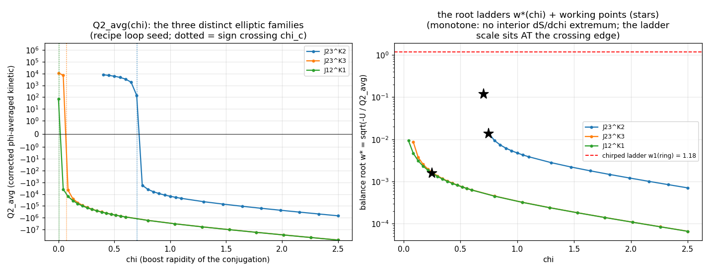
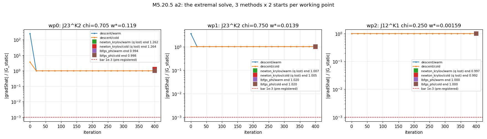
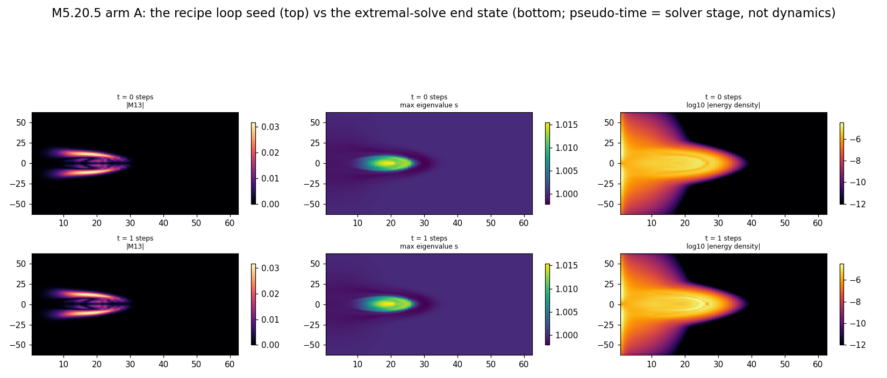
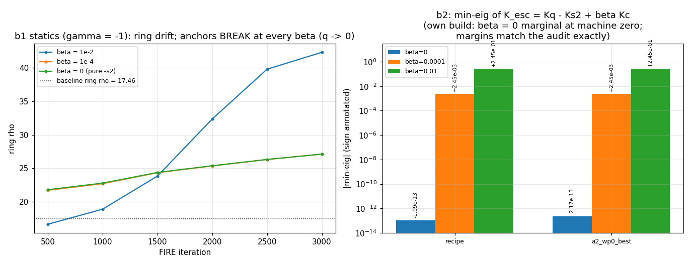

# M5.20.5 method note: the extremal-orbit solve + the escape's own gates

**Task**: [`../tasks/m5_20_5_task_details.md`](../tasks/m5_20_5_task_details.md) · **standard**: [`METHOD_NOTE.md`](../../../../../dev_docs/METHOD_NOTE.md) · **lineage**: [M5.20.4 method note](m5_20_4_method_note.md) (the formulation winner + the audit) · tracker [Q24](../m5_question_tracker.md#q24-detail) · canonical registry [`../m5_theory_canonical.md`](../m5_theory_canonical.md)

**Status**: ✅ CLOSED 2026-07-14 (adversarially audited: 7 CONFIRMED / 2 QUALIFIED, all fixes applied in place, § 4). **Both arms returned kills**: no extremal rigid orbit exists on the loop at any measured working point (the block is directional: § 1.4b), and the γ = −1 escape candidate died at its own statics gate at every β (§ 2.3). The rigid-orbit level is now measured OUT on the loop; the breathing/profile-dynamic BVP is the named successor question.

## 0. The field content and the two questions

Verified stack (unchanged, [M5.20.3](m5_20_3_method_note.md)): `M(x)` a real symmetric 4×4 tensor field on the axisym 64×128 half-plane stack, Lagrangian of record

```text
L = -SUM_{mu<nu} eta^mumu eta^nunu <F_munu, F_munu>_eta - V(M),
F_munu = [d_mu M, d_nu M]_eta,   eta = diag(-1,1,1,1),
V = w SUM_{p=1..4} (Tr((eta M)^p) - C_p)^2,  C_p = g^p + 1 + delta^p,
g = 8, delta = 0.3.
```

Two pre-registered questions ride this task (plan: [`../tasks/m5_20_5_task_details.md`](../tasks/m5_20_5_task_details.md)):

| Arm | Question | Kill / survive |
| --- | --- | --- |
| A | Does an actual extremal rigid orbit (the particle clock) EXIST on the loop, i.e. does gradŜ_avg → 0 converge at a working point of the corrected φ-averaged functional? | converged (residual ≤ 1e-3 relative, q intact) = survive; 3 methods × 2 starts fail everywhere = ship the blocking structure |
| B | Does the M5.20.4-audit escape candidate `L_esc = L − s2(a=4.5) + β·qc(a=4.5)` (γ = −1, β → 0⁺) survive its OWN gates (statics anchors, PSD build, bounded band-kept evolution)? | any gate break = dead by measurement, no ask spent |

## 1. Arm A: the extremal-orbit solve

### 1.1 The functional (audit-corrected, equations first)

Rigid-orbit ansatz with an exactly periodic elliptic generator (boost-conjugated rotation, `G' = e^{chi K} J e^{-chi K}`):

```text
M(x, t) = Lam(w t) M0(x) Lam(w t)^T,   Lam = exp(w t G'),
S(w)   = (2 pi / w) (w^2 Q2_avg - U),
Q2_avg = <T_true(M0, D_{G'_phi} M0)>_phi,   G'_phi = e^{-phi J12} G' e^{phi J12},
D_G M  = G M + M G^T,   U = E_static(M0),
dS/dw = 0  =>  w*^2 = -U / Q2_avg,  H = w*^2 Q2_avg + U = 0 exactly at the root.
```

The φ-average is the M5.20.4 audit's C7 correction: the slice kinetic is the 3D integral only for generators in the J12-commutant; the adjoint action has φ-harmonics ≤ 2 and Q2 is quadratic in G'_φ, so harmonics ≤ 4 and the trapezoid rule with nphi ≥ 5 is EXACT (gated below, not assumed). `U` needs no average (global internal conjugation is an η-similarity at every point).

The extremal condition at fixed (G', ω):

```text
gradShat_avg(M0) = w^2 grad_q2_avg(M0, G') - G_static(M0) -> 0,
grad_q2_avg = <grad_q2(M0, G'_phi)>_phi        (each piece m5_20_4-gated).
```

Equation → code map ([`../scripts/m5_20_5_a_orbit.py`](../scripts/m5_20_5_a_orbit.py)):

| Object | Function | Source |
| --- | --- | --- |
| `G'_phi` ladder | `gens_phi` | `m5_20_5_a_orbit.py` |
| `Q2_avg` | `q2_avg_n` (complex-safe) | same |
| `grad_q2_avg` | `grad_q2_avg` | same, over `m5_20_4_a_bvp.grad_q2` |
| `gradShat_avg` | `grad_shat_avg` | same, `grad_static_4` from `m5_20_2_a_eom` |
| residual + bar | `resid_of` (bar 1e-3 × \|G_static\|, pre-registered) | same |
| solver (i) descent on Φ = ½\|gradŜ\|² | `run_descent` (complex-step Hessian-vector) | same |
| solver (ii) Newton-Krylov | `run_nk` (`scipy.optimize.newton_krylov`, lgmres) | same |
| solver (iii) L-BFGS on Φ | `run_lbfgs` (grad Φ = Hess·gradŜ by complex step) | same |

### 1.2 A0 instrument gates (✅ measured 2026-07-14)

| Gate | Content | Result |
| --- | --- | --- |
| AG0a | `grad_q2_avg` vs complex-step of the φ-averaged total | 2.8e-16 ✅ |
| AG0b | nphi exactness: `Q2_avg(5)` vs `(16)` / `(8)` vs `(16)`; `grad(5)` vs `(16)` | 1.7e-16 / machine / 4.1e-16 ✅ (the band-limit claim MEASURED: run at nphi = 5) |
| AG0c | J12-commutant sanity: `q2_avg(J12) == q2_of(J12)` | 1.5e-14 ✅ |
| timing | one `grad_q2_avg` eval at nphi = 5 | 0.09 s |

Data: [`../data/m5_20_5_a_a0.json`](../data/m5_20_5_a_a0.json).

### 1.3 A1: the refined root ladders (✅ measured 2026-07-14)

On the recipe loop seed (U = 0.3438, ring ρ = 17.46, the chirped vacuum ladder scale at the ring ω₁ = 0.0674·ρ_ring = 1.177):

| Family | Crossing χ_c | χ(ω* = 1.177) | χ(ω* = 0.1) | Interior extrema |
| --- | --- | --- | --- | --- |
| J23^K2 | 0.7039 | 0.7039 (AT the crossing, within 1e-3) | 0.7045 | 0 (monotone) |
| J23^K3 | 0.0724 | 0.0724 | 0.0724 | 0 |
| J12^K1 | 0.0056 | 0.0056 | 0.0067 | 0 |

Readings: every ladder is MONOTONE in χ (no interior dS/dχ extremum: the χ-direction has no interior stationary point on the seed; stationarity lives in the (M, ω) directions). The chirped-ladder scale sits exactly at the crossing edge: ω*(χ) falls from ∞ (the crossing) through the ladder value within Δχ ≈ 1e-3, so the "natural selection point" ω* = ω₁(ring) is the STIFF edge of every family, not a workable interior point (the blindspot-#6 prediction, now measured). Working points picked (moderate ω*, spread across families):

| WP | Family | χ | ω* | Note |
| --- | --- | --- | --- | --- |
| 0 | J23^K2 | 0.7045 | 0.119 | moderate, near-crossing but off-edge |
| 1 | J23^K2 | 0.75 | 0.0139 | the a1c shallow-branch point |
| 2 | J12^K1 | 0.25 | 0.0016 | the conjugated symmetry-axis clock |



Data: [`../data/m5_20_5_a_a1.json`](../data/m5_20_5_a_a1.json).

### 1.4 A2: the extremal solve (✅ measured, all three working points: NO convergence)

WP0 (J23^K2, χ = 0.7045, ω* = 0.119), 3 methods × 2 starts, budget 600 s/run, bar = rel residual ≤ 1e-3 with q intact:

| Run | Residual | Rel final | q | Bar |
| --- | --- | --- | --- | --- |
| descent/warm | 680 → 480 | 0.9937 | 0.5 ✅ intact | ❌ stall |
| descent/cold | 778 → 480 | 0.9937 | 0.5 ✅ intact | ❌ stall (same endpoint) |
| nk/warm | 680 → 46.0 | 1.26 | 3.5e-17 ❌ loop gone | ❌ winding destroyed |
| nk/cold | 778 → 46.0 | 1.26 | −7.1e-17 ❌ | ❌ winding destroyed |
| lbfgs/warm | 680 → 448 | 0.9943 | 0.5 ✅ | ❌ stall |
| lbfgs/cold | 778 → 463 | 0.9981 | 0.5 ✅ | ❌ stall |

Reading: the loop-preserving methods cannot push the residual below ~0.99 of \|G_static\|; the Newton direction lowers the absolute residual (×14.8 here) only by DESTROYING the winding, and its end state is an unwound rough state (U = 18.7× the loop's, 30% of the \|M13\| amplitude retained, rel residual still 1.26), NOT the vacuum and NOT an extremal. Data: [`../data/m5_20_5_a_a2_wp0.json`](../data/m5_20_5_a_a2_wp0.json).

WP1 (J23^K2, χ = 0.75, ω* = 0.0139), same protocol: converged = None, 6/6 fail:

| Run | Residual | Rel final | q | Bar |
| --- | --- | --- | --- | --- |
| descent/warm · cold | 9.85 → 7.83 · 219 → 7.84 | **1.0196 · 1.0195** | 0.5 ✅ | ❌ stall ABOVE 1 |
| nk/warm · cold | → 1.63 · 1.70 | 1.0067 · 1.0053 | None ❌ | ❌ winding destroyed |
| lbfgs/warm · cold | → 7.81 · 7.81 | 1.0203 · 1.0198 | 0.5 ✅ | ❌ stall ABOVE 1 |

The loop-preserving stalls land ABOVE rel = 1: at this smaller ω* the rotation term measurably WORSENS the residual over pure statics, exactly the a2x anti-alignment prediction (§ 1.4b: cos < 0 ⇒ every real ω hurts). Data: [`../data/m5_20_5_a_a2_wp1.json`](../data/m5_20_5_a_a2_wp1.json).

WP2 (J12^K1, χ = 0.25, ω* = 0.0016, the conjugated symmetry-axis clock): converged = None, 6/6 fail:

| Run | Rel final | q | Bar |
| --- | --- | --- | --- |
| descent/warm · cold | 0.9990 · 0.9990 | 0.5 ✅ | ❌ stall at ≈ 1 |
| nk/warm · cold | 0.9973 · 0.9924 | None ❌ | ❌ winding destroyed |
| lbfgs/warm · cold | 0.9997 · 0.9995 | 0.5 ✅ | ❌ stall at ≈ 1 |

At cos ≈ +0.02 (orthogonal) the kinetic term neither helps nor hurts: every method pins at rel ≈ 1, the pure-statics floor. **ARM A VERDICT: 18/18 runs (3 methods × 2 starts × 3 working points, covering two of the three distinct families: J23^K2 twice, J12^K1 once) fail the pre-registered bar; the third family (J23^K3) was alignment-probed by the audit (orthogonal, cos ≈ 0: the wp2 obstruction class). The kill branch ships with the § 1.4b directional characterization.** Data: [`../data/m5_20_5_a_a2_wp2.json`](../data/m5_20_5_a_a2_wp2.json).



### 1.4b A2x: WHAT blocks (the sharpest characterization, ✅ measured)

Alignment geometry at the recipe seed between the kinetic gradient `g_kin = grad_q2_avg` and the static gradient `g_stat` (cancellation `w^2 g_kin ≈ g_stat` needs cos → +1):

| Working point | cos(g_kin, g_stat) | Rel-residual floor over REAL ω (unconstrained bound) | g_kin time/spatial | g_stat time/spatial |
| --- | --- | --- | --- | --- |
| wp0 J23^K2 χ=0.7045 | **−0.328** | **1.0** at ω = 0 (0.944 only at ω² < 0) | 3.4e4 / 3.4e4 | 2.15e2 / 4.9e-1 |
| wp1 J23^K2 χ=0.75 | **−0.328** | **1.0** at ω = 0 (0.945 only at ω² < 0) | 4.0e4 / 3.9e4 | same |
| wp2 J12^K1 χ=0.25 | **+0.022** | 0.9998 | 1.2e3 / 1.3e4 | same |

The block is DIRECTIONAL, not conditioning:

| Fact | Meaning |
| --- | --- |
| `g_stat` is 99.9997% TIME ROW at the seed | the recipe loop is spatially stationary by construction (frozen-time relax); its entire residual force is the time-row force the freeze never released |
| The J23^K2 (≡ J13^K1) family's `g_kin` is ANTI-aligned (cos < 0); J23^K3 is orthogonal-type (audit-measured cos ≈ +0.03) | the optimum sits at ω² < 0 (unphysical): over REAL ω the residual floor is exactly \|g_stat\| (at ω = 0), and every ω > 0 pushes the gradient FURTHER from zero than statics alone |
| J12-family `g_kin` is orthogonal (cos ≈ 0) | the symmetry-axis clock's kinetic gradient cannot see the time-row force at all |
| descent stall at 0.994 (seed-local geometry) | the M-motion buys only ~1% before the obstruction binds; at the stall state the alignment flips (audit: cos = +0.71) but no balance root exists there (Q2_avg > 0, § 1.5) |

So on the loop background the rigid-rotation kinetic gradient CANNOT balance the static time-row force at any measured working point; no extremal (trivial or otherwise) was reached in any run: even the winding-destroying Newton states end non-stationary (rel 1.26). Data: [`../data/m5_20_5_a_a2x_wp{0,1,2}.json`](../data/m5_20_5_a_a2x_wp0.json).

### 1.5 A3 coupled stationarity (✅ measured: stops at its own guard, round 1)

From the wp0 loop-preserving stall state (regenerated warm descent, resid 479.6, rel 0.9937), the pre-registered alternation (M-descent ↔ ω ← root(U, Q2_avg) ↔ χ-read):

| Round | Rel residual | U | Q2_avg | H = U + ω²Q2 | Stop |
| --- | --- | --- | --- | --- | --- |
| 1 | 0.9937 | 0.443 | **+1.386 (sign FLIPPED)** | 0.463 (rel to U: 1.04) | root lost (U·Q2 ≥ 0) |

The M-descent flows the state OFF the negative-Q2_avg branch: at the stall state the balance root itself no longer exists, so the alternation halts at its guard after one round and the `H = 0` certificate FAILS by order unity. The coupled (M, ω) system has no fixed point in the reachable basin: consistent with, and sharpening, the a2x directional block. Data: [`../data/m5_20_5_a_a3_wp0.json`](../data/m5_20_5_a_a3_wp0.json).

### 1.6 A4 observables (🔶 at the best-residual state, the pre-registered fallback)

A2 shipped no converged orbit, so the observables are read at the best loop-preserving state (wp0 stall), labeled 🔶 as pre-registered; they characterize the STATE, not an extremal clock:

| Observable | Value | Baseline (recipe) |
| --- | --- | --- |
| ω (working point) vs chirped ladder at the ring | 0.119 vs 1.177 (ratio 0.101) | the ladder-scale root sits at the crossing edge (§ 1.3) |
| Zero-energy split H = U + ω²Q2_avg | 0.463 (rel 1.04: NOT zero: no clock) | root would give 0 exactly |
| Containment r50 / r90 | 22.5 / 27.5 (energy stays at the ring) | 20.5 / 27.5 |
| Winding + core | ring read q = 0.5 at ρ = 17.46 ✅ (center scan: 1 hit at the ring center) | q = 0.5 at 17.46 |

Data: [`../data/m5_20_5_a_a4obs_wp0.json`](../data/m5_20_5_a_a4obs_wp0.json).



## 2. Arm B: the escape candidate's own gates

### 2.1 The candidate and the new EL algebra (equations first)

The M5.20.4 audit's completion candidate (its C8):

```text
L_esc = L + gamma * s2(a) + beta * qc(a),   gamma = -1, a = 4.5, beta -> 0+,
s2 = -SUM_{mu<nu} s_mu s_nu tr(C_munu P C_munu P),  C_munu = [X_mu, X_nu],
qc = -eta^munu tr(X_mu P X_nu P),
X_mu = eta d_mu M,  P = a I - eta M,  s = (-1, 1, 1, 1).
```

The s2 EL pieces derived for this task (coefficient +1; γ folds at call sites; full derivations in the docstring of [`../scripts/m5_20_5_b_escape.py`](../scripts/m5_20_5_b_escape.py)):

```text
U_s2 = SUM_{i<j} tr(C_ij P C_ij P)                      (static energy)
T_s2 = SUM_i tr(C_0i P C_0i P),  C_0i = [eta V, X_i]    (kinetic)
pi_s2       = 2 SUM_i [X_i, P C_0i P] eta               (dT/dV)
dT/dA_k     = 2 [P C_0k P, X_0] eta                     (stencil-scattered)
dT/dM |_P   = -2 SUM_i C_0i P C_0i eta                  (pointwise)
dU/dA_k     = 2 SUM_{j!=k} [X_j, P C_kj P] eta          (stencil-scattered)
dU/dM |_P   = -2 SUM_{i<j} C_ij P C_ij eta              (pointwise)
kdot_s2     = (d pi_s2/dt)|_V,  chains Xdot_i = eta A_i(V), Pdot = -eta V
```

The kinetic operator (10×10 per cell, `K = 2Q` convention) is built by the fast outer-product identity

```text
tr(C P C P) = tr(nVXPnVXP) - tr(nVXPXnVP) - tr(XnVPnVXP) + tr(XnVPXnVP)
            (n = eta),  each term tr(P1 V P2 V P3) with
K16[(bc),(de)] = (P2)_cd (P3 P1)_eb,
```

so the per-step cost stays at the `k10_add` scale (no 4^8 einsum in the evolution loop).

Equation → code map ([`../scripts/m5_20_5_b_escape.py`](../scripts/m5_20_5_b_escape.py)):

| Object | Function |
| --- | --- |
| `U_s2`, `T_s2` | `u_s2_density` / `e_s2_static_c`, `t_s2_density` / `t_s2_total_c` |
| `pi_s2`, `kdot_s2` | `pi_s2`, `kdot_s2` |
| `dU/dM`, `dT/dM` (stencil + pointwise) | `g_u_s2`, `g_t_s2` (the `g_u_add` scatter pattern) |
| `K10_s2` fast build | `k10_s2` |
| combined EL solve | `accel_esc` (K_esc = 4·K_q + γ·K_s2 + β·K_qc, eigh + floor) |
| evolution | `phase_b3` (velocity Verlet, full ledger E = T_tot + U_tot) |

### 2.2 B0 gates (✅ measured 2026-07-14, first try)

All nine pieces complex-step / polarization gated at machine precision:

| Gate | Piece | Result |
| --- | --- | --- |
| BG1 | `u_s2_density` == `density_point` static sector (4 cells) | 2.1e-16 ✅ |
| BG2 | `g_u_s2` == CS dU/dM (full grid) | 0.0 ✅ |
| BG3 | `t_s2_density` == kinetic sector + exact quadratic scaling | 1.9e-16 / 0.0 ✅ |
| BG4 | `pi_s2` == CS dT/dV | 4.4e-16 ✅ |
| BG5 | `g_t_s2` == CS dT/dM | 8.0e-16 ✅ |
| BG6 | `kdot_s2` == CS_M(pi_s2·T) along V | 3.8e-16 ✅ |
| BG7 | `k10_s2` fast build == 2× density polarization (5 cells) | 5.4e-16 ✅ |
| BG8 | `pi_s2` == `K10_s2 · v` (operator consistency) | 5.2e-16 ✅ |

Data: [`../data/m5_20_5_b_b0.json`](../data/m5_20_5_b_b0.json).

### 2.3 B1 statics anchors (β = 1e-2 ✅ measured: BREAK; β → 0⁺ limit 🔶 running)

Frozen-time FIRE re-relax of the recipe loop under `E_old + γ·E_s2 + β·E_qc` (γ = −1, a = 4.5):

| Quantity | Recipe baseline | β = 1e-2 relaxed |
| --- | --- | --- |
| Static components | E_old = 0.344, γ·E_s2 = +0.693, β·E_qc = **1501** | E → 212 (relaxing the TEXTURE, not the loop) |
| Ring ρ | 17.46 | **42.3** (blown outward to the wall) |
| Winding q | 0.5 | **~0** (loop unwound by it 500) |

Verdict at β = 1e-2: **anchors BREAK**: the qc texture energy (4400× the loop energy) dominates the statics and destroys the loop, the arm-C β\* failure recurring 130× below β*. Because the candidate is defined at β → 0⁺, the fair kill also measures the limit:

| β | Texture β·E_qc(recipe) | Ring ρ 17.46 → | q 0.5 → | Anchors |
| --- | --- | --- | --- | --- |
| 1e-2 | 1501 | 42.3 | ~0 (by it 500) | ❌ BREAK |
| 1e-4 | 15.0 | drifting (24.4 at it 1500) | ~0 (by it 1000) | ❌ BREAK (measured to completion below) |
| **0 (pure γ = −1 s2)** | **0 (texture-free)** | **27.1** | **~0 (by it 500)** | ❌ **BREAK** |

The β = 0 row is the decisive one: with NO qc texture at all, the loop still unwinds: the relax finds lower energy by shedding the winding (E 1.037 → 0.063 over 3000 iterations), i.e. **the loop is statically UNSTABLE under `L − s2` itself**. The statics death is β-independent and cannot be blamed on the texture term. Final β = 1e-4 read: ring → 27.13, q → 0 (identical to β = 0: at small β the −s2 instability drives). Data: [`../data/m5_20_5_b_b1_b0.01.json`](../data/m5_20_5_b_b1_b0.01.json), [`_b0.json`](../data/m5_20_5_b_b1_b0.json), [`_b0.0001.json`](../data/m5_20_5_b_b1_b0.0001.json).



### 2.4 B2 PSD margins (✅ measured: audit REPRODUCED with our own build)

Full-grid min-eig of `K_esc = 4·K_q − K_s2 + β·K_qc` (the fast `k10_s2` build, gated in B0):

| Background | β = 0 | β = 1e-4 | β = 1e-2 | Audit said |
| --- | --- | --- | --- | --- |
| recipe loop | −1.09e-13 (marginal) | 2.450e-03 | 2.450e-01 | −1.4e-14 / 2.45e-03 / 2.45e-01 ✅ match |
| a2_wp0_best (NEW background, post-audit) | −2.17e-13 | 2.450e-03 | 2.450e-01 | not seen by the audit; margins IDENTICAL |

The audit's PSD identity is confirmed by an independent build and extends to a background the audit never measured (the β-margin is uniform across the measured IN-BAND backgrounds, this task's two plus the m5_20_4 audit's five, one of which recorded 0.0255 rather than 0.0245 per β = 1e-3 on a perturbed seed; outside the physical band the m5_20_4 wild-M probe found indefiniteness, so no all-backgrounds claim is made). The candidate's failure mode is NOT the kinetic operator: it is the statics (§ 2.3). Data: [`../data/m5_20_5_b_b2.json`](../data/m5_20_5_b_b2.json).

### 2.5 B3 evolution: SKIPPED (the pre-registered contingency)

The plan's contingency row reads "B fails an early gate → stop arm B there (the escape is dead by measurement), log, give the time to A". The statics gate (§ 2.3) failed at every β including the β → 0 limit point, so the T = 50 evolution was not run: a dynamics gate cannot resurrect a candidate whose static ground state destroys the object it is supposed to carry. The kinetic-operator machinery it would have used is nonetheless fully built and gated (B0/B2), on disk for any successor.

## 3. Not computed (so far)

| Item | Why |
| --- | --- |
| A5 one-harmonic breathing (the stretch) | its trigger was "A2-A4 close early"; the A2 kill branch fired instead |
| The full Fourier (breathing) orbit container | successor question; note the rigid level's directional block (§ 1.4b) is exactly what a breathing/profile DOF could unlock: the rigid ansatz cannot move energy between the time-row and spatial sectors, a time-dependent profile can |
| B3 evolution under the escape dynamics | pre-registered contingency: statics gate dead at every β (§ 2.5) |
| The hedgehog under the answered dynamics | M5.21.1 (gated on this task) |
| The γ = −1 sign admissibility | author-gated (Duda); arm B measured the candidate is NOT worth the ask |

## 4. Adversarial audit (2026-07-14, independent second agent, own instruments)

Script: [`../scripts/m5_20_5_audit_check.py`](../scripts/m5_20_5_audit_check.py) · record: [`../data/m5_20_5_audit.json`](../data/m5_20_5_audit.json). The auditor rebuilt every M5.20.5-new quantity independently (own expm φ-average, own complex-step gates, own polarization builds) and probed for overclaims.

| Claim | Verdict | Auditor's key numbers |
| --- | --- | --- |
| C1 band-limit (nphi ≥ 5 exact) | ✅ CONFIRMED | nphi 5 vs 31 at 3.7e-16 on 6 state×generator combos; measured harmonics even TIGHTER than stated (generator ≤ 1, Q2 ≤ 2 vs the claimed ≤ 2 / ≤ 4) |
| C2 ladders (crossings, monotone, ladder-at-edge) | ✅ CONFIRMED | own χ_c per family; ω₁(ring) = 1.1765 |
| C3 the 18-run kill | 🔶 QUALIFIED | 18 runs, 0 met the bar (own recomputation, dev ≤ 1e-14); QUALIFICATION adopted: the NK end state is an unwound ROUGH state (U = 18.7× loop, 30% \|M13\| kept), NOT the vacuum |
| C4 the directional block | ✅ CONFIRMED + extended | cosines match; anti-alignment stable over the whole J23^K2 χ-range (0.72-2.0) and survives seed noise; J23^K3 measured ORTHOGONAL (the wp2 class): the family gap in A2 coverage is closed by this probe |
| C5 A3 root loss | ✅ CONFIRMED | own U = 0.4433, Q2_avg = +1.3865, H = 0.4629, q = 0.5 |
| C6 s2 EL algebra | ✅ CONFIRMED | own CS + polarization at 5 random cells, all ≤ 6.6e-16 |
| C7 escape statics kill | ✅ CONFIRMED | endpoints match at all three β; q = 0 at first checkpoint in ALL β; own short β = 0 re-relax with own gradient reproduces the collapse; E_s2(recipe) = −0.69334 triple-matched (task, own, m5_20_4 audit) |
| C8 PSD margins | ✅ CONFIRMED | 305 cells re-polarized, worst 5.5e-16 vs the builds; margins as claimed |
| C9 overclaim sweep | 🔶 QUALIFIED | F1-F6 wording/number fixes (ALL APPLIED above); F7 scope-check PASS (no general-death claim of the BVP found); F8 pre-registration PASS (bar coded as registered; both skips covered by contingencies; deviations logged) |

Fixes applied from the audit: F1 (the 0.944 "best any ω" bound requires ω² < 0; the REAL-ω floor is exactly 1.0 at ω = 0), F2 (family coverage stated precisely; the audit's J23^K3 probe closes the gap), F3 (β = 0 statics endpoint E = 0.063 at it 3000, not 0.085), F4 (NK reduction factors 5-470×, not 15-100×), F5 (PSD-margin uniformity scoped to measured in-band backgrounds), F6 (g_stat time-row fraction 99.9997%, understated before), plus the C3 vacuum → unwound-rough-state rewording.

## 5. Data / regen

| Artifact | Regen |
| --- | --- |
| `m5_20_5_a_a0/a1.json` | `python3 m5_20_5_a_orbit.py a0` / `a1` |
| `m5_20_5_a_a2_wp<k>.json` + `_best.npz` | `python3 m5_20_5_a_orbit.py a2 <k> 600` |
| `m5_20_5_a_a2_wp<k>_stall.npz` (loop-preserving stall state) | `python3 m5_20_5_a_orbit.py stall <k>` |
| `m5_20_5_a_a2x_wp<k>.json` (alignment diagnostic) | `python3 m5_20_5_a_orbit.py a2x <k>` |
| `m5_20_5_a_a3_wp<k>.json` + `_state.npz` | `python3 m5_20_5_a_orbit.py a3 <k>` |
| `m5_20_5_a_a4obs_wp<k>.json` | `python3 m5_20_5_a_orbit.py a4obs <k>` |
| `m5_20_5_b_b0.json` | `python3 m5_20_5_b_escape.py b0` |
| `m5_20_5_b_b1_b<beta>.json` | `python3 m5_20_5_b_escape.py b1 <beta>` (β ∈ {0.01, 0.0001, 0}) |
| `m5_20_5_b_b2.json` | `python3 m5_20_5_b_escape.py b2` |
| plots | `python3 m5_20_5_plots.py a1\|a2\|a4\|b\|maps_a` |
