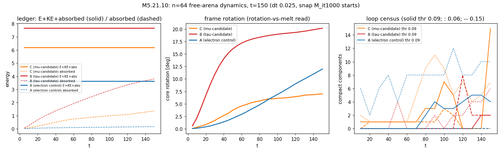

# M5.21.10: the decay-grade extension at the n = 64 free arena (method note)

**Task**: [`m5_21_10_task_details.md`](../tasks/m5_21_10_task_details.md) · **Date**: 2026-07-20 · **Status**: 🔶 IN FLIGHT (skeleton drafted at go; results land per phase; audited before anything author-facing). Rider: the Q35 read synthesis lives in [`m5_21_12_q35_read.md`](m5_21_12_q35_read.md).

## 1. Equations and instruments (all pre-existing + certified unless flagged NEW)

| Piece | Definition | Provenance |
| --- | --- | --- |
| Energy | E = h³ Σ_cells (u + V), T2 eigenvalue-penalty term set, symmetrized stencil | the certified M5.21.2b instrument ([`../scripts/m5_21_2b_a_instrument.py`](../scripts/m5_21_2b_a_instrument.py)) |
| Dynamics | damped wave M_tt = −(1/h³) δE/δM − γ(r) M_t, kick-drift-kick leapfrog; interior γ = 0; absorbing sponge γ(r) = g_max·s², s = clip((r − 0.65·L/2)/(0.33·L/2), 0, 1) | [`../scripts/m5_21_6_a_decay.py`](../scripts/m5_21_6_a_decay.py) (M5.21.6-certified) |
| Ledger | E_tot = E + KE, KE = ½h³ Σ \|M_t\|²; absorbed(t) = ∫ γ \|M_t\|² h³ dt; closure E + KE + absorbed = const | M5.21.6 (closed to 3 decimals there) |
| Arena | n = 64, L = 64, h = 1.0 free (no pin): SAME spacing as the M5.21.6 f48 arena (n = 48, L = 48), box +33% linear: the box variable isolated | this task (PLAN decision) |
| Loop census | biaxial-core mask: min eigen-gap(M) < thr, thr ∈ {0.06, 0.09, 0.15}, restricted r < 0.65·L/2; 26-connected components; size ≥ 3; compact = disjoint from the edge zone (r > 0.62·L/2) | M5.21.6 conventions unchanged; NEW here: full 3D centroids per component ([`../scripts/m5_21_10_a_decay64.py`](../scripts/m5_21_10_a_decay64.py) `loop_read_xyz`) |
| Release kinematics (NEW, ours) | per-snapshot components matched across time by greedy nearest-centroid (match radius 6.0); per-track velocity v = (x_last − x_first)/(t_last − t_first), direction v̂, departing = r grows by > 2.0 | this task (`kin` mode); flagged as our instrumentation, convention disclosed |
| Cross-stencil re-read | converged endpoint's E re-evaluated under fwd and 2h stencils, no re-relax | M5.21.2-era protocol on the 2b instrument ([`../scripts/m5_21_10_b_ring.py`](../scripts/m5_21_10_b_ring.py)) |
| cfg-from-npz fix | `D.evolve`/`D.p1` hardcode L = 48.0; every M5.21.10 mode rebuilds cfg with L = n·h from the npz record (f64 would otherwise get h = 0.75) | this task (wrapper; the reason the wrapper exists) |

## 2. P0: arena certification at n = 64 (gates + descents)

✅ GREEN (`data/m5_21_10_gates.json`): GK kick symmetry 0.0 exact; GL1 γ=0 E_tot drift ladder 1.4e-3 / 3.6e-4 / 8.9e-5 at dt 0.05/0.025/0.0125 (clean dt² scaling); GL2 sponge monotone. Production dt = 0.025 (the f48 dt, kept for box-variable isolation; the gate auto-pick 0.05 declined, deviation logged). Dynamics-grade ledger closure over t = 150: end-vs-first-row \|drift\| ≤ 3.1e-5; against the true t = 0 budget the audit's max-over-rows read is ≤ 8.9e-5 (B the worst): conservation at the 1e-4 grade (§ 8 C1). Start-state provenance (audit catch, fixed): all three windows launch from the relax snapshot `M_it1000` (budgets 6.179 / 7.656 / 3.613 for C/B/A), NOT the descent endpoints; the `snap` field was added to the ev JSONs post-hoc with a disclosure note.

Descents (12000 iters each, the f48 budget): A E 3.332, retention 0.90 (f48: 0.87), r_half 16.5 · B E 3.009, retention 0.87, r_half 23.7 (spreads, winding retained) · C E 4.114, retention 0.81 with the SAME two-eigenvalue decay signature as f48_C but milder (0.72/0.71/0.99 vs f48's 0.34/0.32/0.98: more room, slower resolution). Absolute cross-box energy comparisons are confounded by the vacuum-volume change; the reads of record are the dynamics windows below.

## 3. Read 1: the two-loop count + release kinematics (μ-candidate C)

🔶 **paired antipodal outward-moving biaxial features are REAL; the compact-loop identity is NOT established: the two-loop count stays OPEN** (verdict re-based at the audit, § 8 C2). What survives the audit's own raw-snapshot recompute: the core rotates (rot 7.0° at t = 150, the author's rotation mechanism) and radiates (absorbed 1.35); at **t ≈ 80 the census splits 1 → 3** (remnant core ~1300 cells + two off-center features, 2×2×5 rods at birth, departing at recomputed speed 0.0520, directions 108.9° apart); a symmetric departing pair persists at BOTH thr 0.06 and 0.09 and the audit confirmed it is the SAME physical structure across rungs (cross-threshold distance 1.85). What the audit REFUTED: the "compact fragment" picture at late times: by t = 150 each feature has split into a mirror doublet of **1-cell-wide z-column filaments** (spanning r 8.3-19.8, exact antipodes at 180.0°), which are edge-CONNECTED once the census r-cut (r < 20.8) is removed, and the census resolves nothing off-center at t = 120-140; the "stable size 14 → 13 at speed 0.052" is a construction of the greedy tracker over threshold filaments, and the compact/edge flags are fragile to the two hard-coded radii (filament tips stop at r 19.82 vs the 19.84 edge line). Honest statement: the decay ejects biaxial structure in a SYMMETRIC PAIRED pattern along distinct directions (consistent with the author's "different directions" refinement, and unlike the A-control's centered mask erosion), but whether that structure is two closed loops, filament bundles, or radiation tails is UNRESOLVED at this instrument grade: the [M5.25](../tasks/m5_25_task_details.md) arm-(1) disclination tracer (a true line-assembly instrument) is the closure read. The f48 descent-grade record (ONE equatorial ring) is neither confirmed nor contradicted: descent resolves topology, dynamics resolves ejection, and the ejected structure's identity needs the tracer.

## 4. Read 2: the τ-candidate B, drain vs decay at the bigger box

🔶 **the f48 "drain" verdict does NOT survive the bigger box: B undergoes a violent rotation + radiation transition with core DISINTEGRATION.** In the window: rot 20.1° (the largest of the three; the rotation mechanism, no melt spike), absorbed 3.79 (the heaviest radiator, half its start budget), core spectrum falling to specdev 0.045 (near vacuum-like). The kinematics: **B's own core is the departing object** (4298 → 316 cells, migrating from r = 0 to r = 8.2 at speed 0.058), with a second fragment (1734 → 316) leaving at 0.034 in a different direction; the largest non-departing remnant is 11 cells: nothing substantial remains in place. Verdict at n = 64: NOT a quiet in-place drain (that was the box-limited f48 appearance) and NOT a clean settle-to-electron within t = 150: the τ-candidate DISINTEGRATES through the rotation channel, shedding its biaxial volume outward. Whether a settled electron-level remnant forms beyond t = 150 (or the fragments re-collapse) needs a longer window; the honest statement is that the box ladder EXTENDED the story (drain → disintegration-grade transition) without closing B's endpoint.

### 4b. The A control (electron): hold + the instrument null

✅ dual result. ENERGETIC HOLD: absorbed 0.158 = 4.4% of the t = 0 budget; E declines 2.8% row-to-row (3.51 → 3.41), 5.6% against the t = 0 budget (the audit corrected the earlier ≤ 3% phrasing; § 8 C5): the electron persists in free dynamics at the bigger box (the stability clock-half's box extension). INSTRUMENT NULL: the biaxial-mask census still produces late small compact fragments (up to 5) and TWO nominal "departing" tracks, one centered-early-eroding (r_first = 0, t = 10, 402 → 55) and one near-center eroding (r_first = 5.6, 89 → 56): mask erosion, not object ejection; both qualitatively unlike C's off-center late symmetric pair. This null defines the artifact background against which the C and B reads are interpreted. ⚠️ The frame-rotation read drifts to 12.0° late in A's window at near-zero energy cost with specdev flat (0.158 → 0.139, monotone down, no melt): a soft global rotation mode or a reference-frame sensitivity of the diagnostic, not a transition.

## 5. Read 3: the point-vs-charged-ring tie-breaker at next rigor

✅ RESOLVED as a measured near-degeneracy (`data/m5_21_10_ring.json`, [`../scripts/m5_21_10_b_ring.py`](../scripts/m5_21_10_b_ring.py)). All three seeds CONVERGE (stop = f_tol, maxit 16000 headroom unused) on the certified sym instrument:

| Read | t32_A (hedgehog) | t32_R4 (ring a=4) | t32_R6 (ring a=6) |
| --- | --- | --- | --- |
| E native (sym) | 4.767567 | 4.766186 | 4.765764 |
| rel above min | 3.78e-4 | 8.86e-5 | 0 |
| E under 2h re-read | 4.402344 | 4.402242 | 4.403158 |
| rel above min (2h) | 2.31e-5 | 0 | 2.08e-4 |
| core spectrum | (0.0582, 0.2777, 0.9640) | (0.0566, 0.2737, 0.9697) | (0.0569, 0.2734, 0.9697) |

Pairwise endpoint distances (rel Frobenius): A-R4 1.2%, A-R6 2.1%, R4-R6 1.1%.

**Verdict**: the three seeds land on ONE energy level within 4e-4 relative, with similar core spectra and 1-2% field distance; the sym/fwd ordering (R6 < R4 < A) FLIPS under the 2h re-read (R4 < A < R6) at that spread, so the ordering sits BELOW the cross-stencil resolution floor (~4e-4): a genuine near-degeneracy, the statics face of the M5.21.2b one-object merge (point core = the braided ring pair). The M5.21.2-era tie (ring −3.7% fwd vs +23% 2h, non-converged instrument) is SUPERSEDED: at f_tol-converged endpoints the 2h re-read shifts the ABSOLUTE energy uniformly (−7.7%, the known stencil-functional offset) while preserving 1e-4-level spreads, so the old +23% swing was a convergence artifact, not physics. Fwd-vs-sym evaluation agrees to ≤ 2e-8 relative on these endpoints.

## 6. The Q35 rider (M5.21.12)

Landed in full: [`m5_21_12_q35_read.md`](m5_21_12_q35_read.md). Headline: the runaway is a first-order GHOST direction (class (b), NOT Ostrogradsky); fixed-J is the sanctioned ENERGY-CASIMIR stabilization (Holm-Marsden-Ratiu-Weinstein 1985); Battye-Haberichter relax at fixed J for exactly our reason; dE/dJ = ω\* is the textbook Q-ball Legendre identity; the sharpest imported falsifier = the RADIATION WINDOW (ω\* vs the lightest mode mass; the M5.21.1 twist gap ω ≈ 0.10 sits BELOW all three rungs → long free evolution with J(t) tracked is the direct test, staged M5.26/M5.21.11).

## 7. Not computed (this run)

Loop CLOSURE/identity of the departing fragments (needs the M5.25 arm-(1) disclination tracer); B's endpoint beyond t = 150 (longer window or larger box); winding integrals around the departing fragments; the J(t) secular-decay read from the Q35 radiation-window test (rides [M5.26](../tasks/m5_26_task_details.md)); any spectral identification of the fragments with the neutrino construction ([M5.21.7](../tasks/m5_21_7_task_details.md) consumes Read 1, not this note); cross-box energy-level calibration (vacuum-volume confound, [M5.21.11](../tasks/m5_21_11_task_details.md)).

## 8. Audit (2026-07-20, independent agent, own script + own reads)

Script [`../scripts/m5_21_10_d_audit.py`](../scripts/m5_21_10_d_audit.py) · numbers `data/m5_21_10_audit.json` · 7 claims: **4 CONFIRMED, 3 NUANCE, 0 clean refutations of measured numbers; 1 INTERPRETATION REFUTED and adopted** (the compact-fragment picture, § 3 re-based).

| Claim | Verdict | The audit's own numbers |
| --- | --- | --- |
| C1 ledger ≤ 5e-5 | ⚠️ NUANCE | end-vs-first ≤ 3.1e-5 ✅ but max-over-rows vs the t = 0 budget: C 6.5e-5, B 8.9e-5, A 1.4e-5 (1e-4 grade, bound restated § 2); PLUS the provenance catch: windows start from `M_it1000` (energy-matched), the `snap` field was missing from the ev JSONs (fixed post-hoc with disclosure) |
| C2 the departing pair | ⚠️ NUANCE, interpretation REFUTED | JSON-level numbers reproduce exactly (2 departing at t = 80, 14 → 13, speed 0.0520, 108.9°); raw snapshots show 2×2×5 rods at birth splitting into mirror doublets of 1-cell z-column filaments by t = 150, edge-connected beyond the census r-cut; census resolves nothing off-center t = 120-140. § 3 re-based: paired symmetric ejection real, loop identity OPEN |
| C3 thr ladder 3/2/0 + persistent pair | ✅ CONFIRMED | counts reproduce; the 0.06 and 0.09 pairs are the SAME structure (cross-thr distance 1.85 < 3) |
| C4 B disintegration | ✅ CONFIRMED | own mask volume 4298 → 644 (×0.15); absorbed/budget = 0.495; rot 20.1°; largest compact non-edge remnant 6 cells. Two ~316-cell edge-reaching mirror shells remain at r ≈ 13 (disclosed) |
| C5 A null | ⚠️ NUANCE | absorbed 4.4% ✅; E drop 2.8% row-to-row but 5.6% vs t = 0 budget (❌ the ≤ 3% phrasing, corrected § 4b); the second departing track (r_first = 5.6) was omitted (added § 4b); specdev monotone down ✅, rot 12.0° ✅ |
| C6 ring tie-breaker | ✅ CONFIRMED | independent e_parts recompute: spread 3.78e-4; sym = fwd order, 2h flips at 2.1e-4; 2h offset −7.64% mean; all stops f_tol |
| C7 descent signature | ✅ CONFIRMED | f64_C (0.721, 0.711, 0.991) vs f48_C (0.336, 0.323, 0.982); f64_A ≥ f48_A per-eig; f64 rows re-derived from npz to 1.3e-10 (f48 rests on row JSONs, raw npz cleared under the old data rule; disclosed) |

Cross-cutting audit finding adopted into § 3: the `n_compact`/`touches_edge_zone` flags are cut-sensitive (filament tips at r 19.82 vs the 19.84 edge line; reconnection past the r = 20.8 census cut): any late-window "compact loop count" at thr 0.09 in these evolutions is fragile to the two hard-coded radii. Routed to the M5.25 tracer requirements.
