# M5.21.1 method note: the electron hedgehog under the author's 2026-07-15 prescription (minimization-first)

**Status**: ✅ RUN COMPLETE + AUDITED 2026-07-16 (all phases P0-P4 measured; independent adversarial audit § 11: 5/6 confirmed, 1 wording correction adopted; review approved same day). Task record: [`../tasks/m5_21_1_task_details.md`](../tasks/m5_21_1_task_details.md) · prescription source: [`../tasks/m5_20_convo.md § 2026-07-15`](../tasks/m5_20_convo.md) · canonical registry: [`../m5_theory_canonical.md`](../m5_theory_canonical.md).

**Companion (same day)**: the spec-conformance retrospective [`m5_21_1e_spec_review.md`](m5_21_1e_spec_review.md) audits THIS implementation against the papers (arXiv:2108.07896v7 term-by-term, the 1+1D time-crystal toy anchors reproduced to 3.4e-7, the SO(1,3)/ξ-trace conformance, the era archaeology confirming a genuine 4×4-in-3D stack since M5.8.1) and explains the § 5 stability negative mechanistically (amplitude escape vs frozen-potential Derrick expansion; the Faber virial window). Read the two together: this note is the run record, that one is the conformance + mechanism record.

**What this run is**: the author's redirect executed as pre-registered: (P0) his `(-g)^p` spec correction gated on BOTH signs of g; (P1) 3D energy minimization of the Fig. 9 biaxial hedgehog measured against his three structural claims and his own stability bar; (P2) the 4D extension by minimization in the rotation-sector orbit class (boost sector quarantined), reading the emergent angular momentum and the mass split; (P3) the perpendicular-twist Klein-Gordon limit, spectrally; (P4) the (g, δ) scaling ladder toward his physical values. NO raw time integration anywhere (the M5.20.3 ill-posed-IVP lesson): dynamics enters as minimization, orbit classes, and spectra only.

## 1. Equations (all upstream-verified; nothing new is introduced here)

The verified Lagrangian (M5.18, machine-verified 2026-07-05) and its static sector, in the axisymmetric reduction (the M5.17 scheme, η-extended at M5.20.2):

```text
eta = diag(-1, 1, 1, 1),      [A, B]_eta = A eta B - B eta A,
<F, G>_eta = F_ab G_cd eta^ac eta^bd

STATIC ENERGY (the minimization target, P1/P2/P4)
E_static[M] = INT w(rho, z) [ u_eta + V4 ] drho dz
u_eta = 4 SUM_{i<j in rho,phi,z} <[A_i, A_j]_eta, [A_i, A_j]_eta>_eta
A_rho = d_rho M,   A_z = d_z M,   A_phi = [J, M] / rho
V4 = wscale SUM_{p=1..4} ( Tr_eta(M^p) - C_p )^2,
Tr_eta(M^p) = tr((eta M)^p)

THE P0 SPEC CORRECTION (his 2026-07-15 note, sign of g OPEN)
C_p(s) = (s g)^p + 1 + delta^p,      s in {+1, -1}
M_vac(s) = diag(-s g, 1, delta, 0)   (eta M_vac spectrum (s g, 1, delta, 0))
s = +1 is the verified build; s = -1 is the corrected reading.

TRUE KINETIC (quartic in derivatives; the M5.20.3 audited reduction)
T_true(M, V) = INT w * 4 SUM_i <[V, A_i]_eta, [V, A_i]_eta>_eta

RIGID ROTATION ORBIT CLASS (P2; the M5.20.5 corrected phi-average)
M(t) = e^{Omega t G} M0 e^{Omega t G^T},   G in so(1,3)
Q2_avg(M, G) = <T_true(M, D_G M)>_phi,   D_G M = G M + M G^T,
G_phi = e^{-phi J12} G e^{phi J12}  (trapezoid nphi = 5: EXACT, harmonics <= 4)
Routhian (rotating-frame energy):  R(M; Omega) = U(M) - Omega^2 Q2_avg(M, G)
extremals: grad U = Omega^2 grad Q2_avg  (rigid rotating equilibria)
J = 2 Omega Q2_avg,   T_rot = Omega^2 Q2_avg,   E = U + T_rot

KG TWIST LIMIT (P3, spectral: no IVP)
v_k = cos(k z) env(r) [W(n), M],   W(n) = local rotation about the director
omega_true^2(k)      = D2E(v_k) / (2 T_true(M, v_k))
omega_canonical^2(k) = D2E(v_k) / (2 * (1/2) INT w ||v_k||_F^2)
D2E(v) = <v, Hess(E_static) v>   (complex-step Hessian-vector products)
KG verdict: omega^2(k) = m^2 + c^2 k^2 fit (R^2)
```

### 1b. Parameters + working point (everything a re-run needs)

| Parameter | Value | Provenance |
| --- | --- | --- |
| Vacuum spectrum (ηM) | (sg, 1, δ, 0), s = ±1 both run; g = **G_T = 8.0**, δ = **0.3** (the toy working point; physical δ ~ 1e-10, g ~ 1e10 reached via the P4 scaling laws, § 8) | his 2026-07-15 note + [M5.16 lock](m5_16_report.md) |
| Potential weight | wscale = **7.2402e-4** (the M5.12 pin, fixed across δ; exact value `load_wscale()` = 0.000724023879) | [m5_20 § 1](m5_20_method_note.md) |
| Metric / commutator / norm | ξ = η = diag(−1,1,1,1); `[A,B]_η = AηB − BηA`; ‖X‖²_η = Tr(XηXᵀη): his Eq (40)-(42) as machine-verified at M5.18 | [m5_18_verification_note.md](m5_18_verification_note.md) |
| O-matrix group | SO(1,3) (boosts included): M transforms as a rank-2 covariant tensor; invariance of the full static energy verified to **1.3e-11** under random boost+rotation, with the no-η negative control drifting O(1) (M5.18 checks 1/1b) | [m5_18_verification_note.md](m5_18_verification_note.md) |
| Grids | axisym (ρ, z): **128×256** (P1 deep statics) and **64×128** (P2/P3/P4), h = 1, cell-centered ρ with mirror ghost; full-3D twin **48³** (P1 SB3 spot-check) | § 2 code map |
| Seed | Fig. 9 biaxial hedgehog (his generator order Q = e^{φGz}e^{θGy}e^{ψGx}), spatial spectrum s(r)·(1, δ, 0), 3-equal core a = (1+δ)/3, core blend r_c = 4; M₀₀ = −sg | [m5_17 § 9 conformance](m5_17_methods_note.md) |
| Descent | FIRE (dt0 0.02, dt_max 0.2, 1/w preconditioner, outer boundary pinned); P1 deep relax 48 000 iters with snapshots (0, 2k, 6k, 12k, 24k, 48k); P4 ladder dt0 = 0.02·min(1, 8/g) | § 2 code map |
| Derivatives | complex-step gates on every gradient/HV (1e-15 class); FD cross-checks quoted per gate (§ 3) | § 3 |

## 2. Equation-to-code map (blob/main: frozen task files)

| Term | Function | File |
| --- | --- | --- |
| `u_eta`, `V4`, `C_p(g)`, branch reps | `u_eta_density`, `v4_density`, `c4_of(delta, g)`, `vac4(delta, g, branch)` | [`m5_20_2_a_eom.py`](https://github.com/openwave-labs/openwave/blob/main/openwave/xperiments/m5_liquid_crystal/research/scripts/m5_20_2_a_eom.py) (the g parameter carries BOTH signs) |
| `grad E_static` (adjoint identity, FD-gated GB1) | `grad_static_4(M, wscale, delta, g, w4, rho4)` | same file |
| `T_true`, complex-safe energies | `t_total_c`, `e_static_c` | [`m5_20_3_a_constraint.py`](https://github.com/openwave-labs/openwave/blob/main/openwave/xperiments/m5_liquid_crystal/research/scripts/m5_20_3_a_constraint.py) |
| `Q2_avg`, `grad Q2_avg`, `G_phi` ladder | `q2_avg_f`, `gens_phi` ([`m5_20_5_a_orbit.py`](https://github.com/openwave-labs/openwave/blob/main/openwave/xperiments/m5_liquid_crystal/research/scripts/m5_20_5_a_orbit.py)); `grad_q2` ([`m5_20_4_a_bvp.py`](https://github.com/openwave-labs/openwave/blob/main/openwave/xperiments/m5_liquid_crystal/research/scripts/m5_20_4_a_bvp.py)) | reused audited (C7-corrected) |
| P0 gates SP1-SP5, signed helpers | `sp1_pinning` … `sp5_boost_curves` | [`m5_21_1_a_spec.py`](https://github.com/openwave-labs/openwave/blob/main/openwave/xperiments/m5_liquid_crystal/research/scripts/m5_21_1_a_spec.py) |
| P1 deep statics + claims C1-C3 + stability SB1-SB3 | `fire_relax_snap`, `axis_two_equalness`, `containment`, `phase_b2` (Hessian sectors), `phase_b3` (3D) | [`m5_21_1_b_statics.py`](https://github.com/openwave-labs/openwave/blob/main/openwave/xperiments/m5_liquid_crystal/research/scripts/m5_21_1_b_statics.py) |
| P2 a2x + Routhian descent; P3 dispersion | `a2x_row`, `phase_c2`, `phase_c3` | [`m5_21_1_c_4d.py`](https://github.com/openwave-labs/openwave/blob/main/openwave/xperiments/m5_liquid_crystal/research/scripts/m5_21_1_c_4d.py) |
| P4 ladders + fits | `run_point`, `fit_ladder` | [`m5_21_1_d_scaling.py`](https://github.com/openwave-labs/openwave/blob/main/openwave/xperiments/m5_liquid_crystal/research/scripts/m5_21_1_d_scaling.py) |
| Films (both templates) | `film_strip` | [`m5_film.py`](https://github.com/openwave-labs/openwave/blob/main/openwave/xperiments/m5_liquid_crystal/research/scripts/m5_film.py) (standard: [`../m5_visualization.md`](../m5_visualization.md)) |
| FIRE descent (the M5.21-B algorithm) | `fire_relax` / `fire64` | [`m5_21_b_electron.py`](https://github.com/openwave-labs/openwave/blob/main/openwave/xperiments/m5_liquid_crystal/research/scripts/m5_21_b_electron.py) / `m5_21_1_c_4d.py` |

## 3. Gates (all pre-registered in the scripts' headers)

| Gate | Bar | Measured | Verdict |
| --- | --- | --- | --- |
| SP1 target pinning per sign | V4(rep) = 0 exactly, 4 reps x 2 signs x 3 deltas | max 0.0 | ✅ |
| SP2 branch census per sign | orbit-invariant timelike label; 4 distinct | labels {+8, 1, 0.3, 0} (s = +1), {-8, 1, 0.3, 0} (s = -1); drift < 1e-7; V4 on orbit < 1e-16 | ✅ 4 disjoint branches per sign |
| SP3 gap map per sign | FD cross-check <= 1e-6 rel | 1.74e-11; ladders differ 16-20% between signs; SAME zero/negative counts (7/6 zeros, 0 negative) | ✅ (no new instability from the correction) |
| SP4 statics regression | sign-mirror equivalence on the anchors (bar: E rel <= 1e-6) | E gap 1.1% hedgehog / 2.8% loop at matched 4000-iter snapshots; q diff <= 1.1e-4 (loop exactly 0), r_half equal, core lams <= 1.9e-3; same-state landscape gap +0.1296 (0.94%); offblock exactly 0.0 | ❌ the pre-registered mirror claim REFUTED (the finding, § 4); anchors themselves preserved |
| SP5 boost-texture curves | leading-power fit of the cross-sign difference | power 4.00 (vacuum bg) / 3.98 (hedgehog bg); \|D(0.1)\| = 8.63 (vacuum, rho = 40 weight) / 0.282 (hedgehog core) | ✅ quartic onset measured |
| GC1 q2 instruments on the hedgehog | cs <= 1e-8, nphi 5==16 <= 1e-10, J12 <= 1e-12 | cs 6.9e-16, nphi 4.4e-16, J12 1.5e-14 | ✅ machine-precision on the hedgehog background |
| GC2 twist kinetic positivity | T_true(M, v_k) > 0 all k | positive, all 14 modes both grids | ✅ |
| GD3a 3D stack gate | FD grad + axisym embed match | gradcheck 1.7e-15 | ✅ |
| SB2 HV gate | complex-step vs FD <= 1e-6 | 4.0e-10 | ✅ |

## 4. P0: the `(-g)^p` correction, both signs (results)

**THE P0 HEADLINE: the pre-registered mirror-equivalence claim was REFUTED by its own gate.** The claim (script header, pre-registered): for time-block-diagonal fields the statics cannot distinguish the signs. The refutation mechanism (checked in closed form after the gate fired): the V4 residual is `r_p = a_p + s_p` with `a_p` the time-row deviation term and `s_p` the spatial trace deviation; under the mirror map `a_p → (-1)^p a_p` while `s_p` is unchanged, so the odd-p cross terms `2 a_p s_p` survive wherever BOTH sectors deviate simultaneously, which is exactly the defect core. The sign of g is therefore a genuine statics-level physics knob, not only a 4D-sector one.

| Measured (2026-07-16) | Value |
| --- | --- |
| Same-state landscape gap (mirror of the relaxed s = +1 state, evaluated under s = -1) | E_- − E_+ = +0.1296 = 0.94% of E |
| Matched-snapshot E gap (4000-iter FIRE, hedgehog / loop) | 1.1% / 2.8%, s = +1 LOWER on both |
| Anchors across signs | q diff ≤ 1.1e-4 (loop exactly 0.0), r_half equal bins, core lams ≤ 1.9e-3 |
| Block-diagonality along both flows | max offblock exactly 0.0 |
| Vacuum mass ladder (SP3) | signs differ 16-20%, identical zero/negative counts (no new instability) |
| Boost-texture sign sensitivity (SP5) | onsets at QUARTIC order in the texture amplitude (power 4.00 vacuum / 3.98 hedgehog) |

**Routing**: neither sign kills the anchors, so per the pre-registered rule the verified s = +1 stays the P1 branch (it is also the lower-energy one at matched snapshots); BOTH signs carry through P2 reads. The ~1% minimum-level gap at full convergence is bounded by the c0 (64x128, 6000-iter) per-sign pair. His "sign open" now has a measurable discriminator: the statics energy itself.

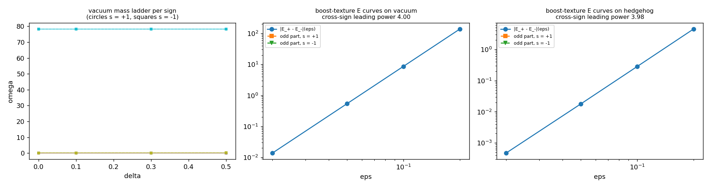

## 5. P1: deep 3D statics vs his three structural claims (results)

128x256, s = +1, FIRE from the M5.21-B seed, 48000 iterations with pre-registered snapshots:

| it | E | q | core a | core spread | r50/r90 | axis split (C1) | vortex line E/len | core-ball (r<8) E frac |
| --- | --- | --- | --- | --- | --- | --- | --- | --- |
| 0 (seed) | 21.510 | 0.972 | 0.4333 | 0.031 | 8/32 | 0.3000 | 6.08e-3 | 0.517 |
| 2000 | 15.372 | 0.999 | 0.4368 | 0.134 | 10/38 | 0.2917 | 4.03e-3 | 0.434 |
| 6000 | 12.809 | 0.985 | 0.4434 | 0.223 | 11/42 | 0.2857 | 3.38e-3 | 0.364 |
| 12000 (the M5.21-B baseline depth) | 11.198 | 0.956 | 0.4527 | 0.307 | 12/45 | 0.2801 | 2.88e-3 | 0.307 |
| 24000 | 9.782 | 0.907 | 0.4690 | 0.376 | 13/48 | 0.2725 | 2.34e-3 | 0.252 |
| 48000 | 8.566 | 0.921 | 0.4939 | 0.442 | 15/51 | 0.2638 | 1.82e-3 | 0.202 |

**The stability verdict (SB1, his own bar)**: the statics does NOT converge at toy (g, δ) = (8, 0.3): dE/dit tail −5.1e-5 (still descending at 48k, fmax 2.1e-2, force drop only 140x), and the descent is a SPREADING slide, not a translation (center drift 1.05e-5/it, pinned). The M5.21 Q8-slide finding survives his regularization language and is now characterized: the object dilutes (r50/r90 grow 8/32 → 15/51, core-ball energy fraction 0.52 → 0.20), the 3-equal core splits monotonically (spread 0.03 → 0.44), q erodes slowly (0.97 → 0.92, the winding read degrading as the melt spreads). Per claim:

| His claim | Verdict at toy regime | The P4 physical-limit read |
| --- | --- | --- |
| C1 two-equal vortex regularization | ❌ the axis transverse split stays ≈ the combed value (0.26-0.30 ≈ δ), shrinking only slowly along the slide | ✅ asymptotically: split ∝ δ^1.03 (R² 0.9998) → exact at δ ~ 1e-10 |
| C2 three-equal center | 🔶 holds as the seed-adjacent transient (spread 0.03), splits under deep relax (0.44 at 48k) | pinning strengthens with g (exact at g = 32 in the 4000-iter frame); the deep-relax fate at high g NOT measured |
| C3 mass-in-center, light vortex | ✅ directionally at all depths: vortex line energy 6.1e-3 → 1.8e-3 per unit length (light and getting lighter); but the core-ball fraction FALLS along the slide (0.52 → 0.20): the "mass mainly in the center" statement degrades as the object dilutes | open: whether high-g pinning freezes the concentrated form |
| "has to be stable" | ❌ at toy (8, 0.3): the electron hedgehog is not a converged statics minimum on this stack | the decisive open question for his least-action elaboration (Q24, his side) |

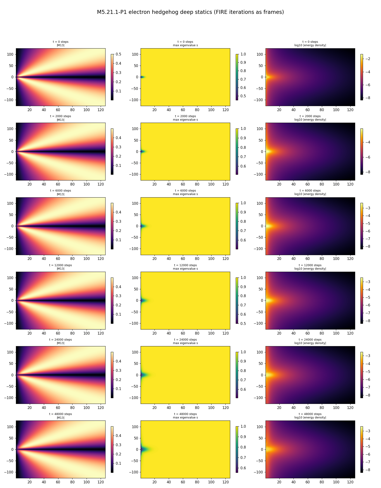

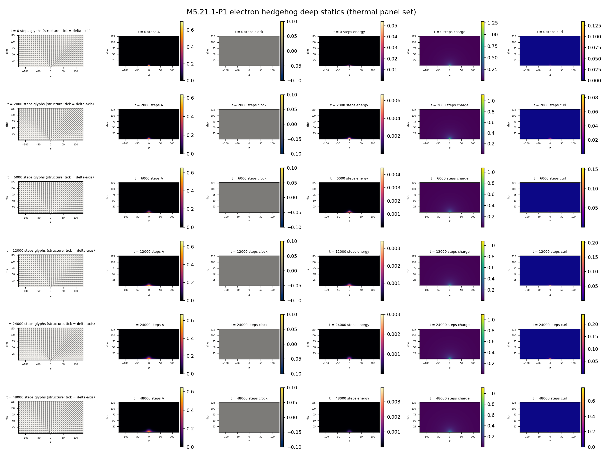

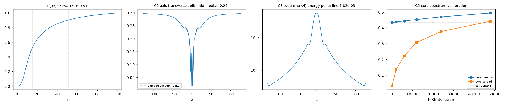

**SB2 / SB2x (Hessian curvature, sector-split)**: the eigsh attempt did not converge (ArpackNoConvergence both sectors, 470s each: SA on a 327k-dim indefinite operator without shift-invert; kept as the negative record) and the shifted power iteration stayed residual-dominated (spectral range 2.4e6; estimates inconclusive, reported as such). The DIRECTIONAL probes on the endpoint are decisive:

| Direction (128x256 endpoint) | D2E(v)/\|v\|² | Sector |
| --- | --- | --- |
| random block-diagonal (x2) | +3.49e5 / +3.50e5 | block-diagonal: strongly positive |
| the slide force direction | +1.80e4 | block-diagonal: positive (the slide is a slow descent along a shallow valley, not a local instability) |
| local director twist (the clock mode) | +0.59 | block-diagonal: positive, consistent with ω² > 0 (P3) |
| boost (0,1) bump at the core | **−0.386** | time-mixing: NEGATIVE |
| random time-mixing (x2) | **−0.398 / −0.399** | time-mixing: NEGATIVE, generically |

**THE SB2 FINDING**: the electron hedgehog endpoint is a SADDLE of the full 4x4 static energy: positive curvature in every probed block-diagonal direction, NEGATIVE curvature in every probed time-mixing direction. The M5.18 vacuum indefiniteness (cubic-order witnesses) manifests at SECOND order on the defect background. This is why the boost quarantine is load-bearing (P2), and it sharpens what goes back to the author: plain energy minimization over the full 4D field space cannot be his intended "4D extension" on this L (it would fall down the time-mixing directions); the constraint or least-action structure he deferred at Q24 is the missing piece.

**SB3 (3D spot-check, static descent, N = 48, gate GD3a 1.7e-15)**: with the l = 2 non-axisym bump seeded, a_break stays FLAT (4.0e-4 → 6.6e-4 over 1500 3D FIRE iterations) while E continues to descend below the embedded axisym value (7.71 → 6.72): the slide continues in full 3D as an essentially AXISYMMETRIC descent. The P1 non-convergence is therefore not an axisym-freezing artifact, and no faster non-axisym channel opens at this resolution.

## 6. P2: the 4D extension by minimization (results)

**c0 (the P2 working states)**: 64x128 hedgehog relaxes per sign, 6000 iters: E 12.124 (s = +1) vs 12.306 (s = −1), the P0 sign gap persisting at 1.5%; q 0.964 both; GC1 instrument gates machine-precision (table § 3).

**c2 (the rigid-rotation Routhian, PURE J23 class, boost quarantined): NO bounded rotating equilibrium.**

| Ω | Outcome (2500-iter FIRE on R = U − Ω²Q2_avg from the c0 s = +1 state) |
| --- | --- |
| 0.05 | descent stalls FAR from extremality: rel residual \|grad R\|/\|grad U\| = 0.86; state stays hedgehog-like (q 0.950, U 11.70); no Ω can balance a force this misaligned (the c1 alignment read quantifies) |
| 0.1349 (the gap-ladder rung) | CATASTROPHIC CENTRIFUGAL INSTABILITY (audit-corrected wording, § 11): R descends ~10 orders (to −8.1e8); U grows to 1.0e8, J → 1.4e10, the meridional q read corrupts to 3.0; the film pair below is the direct evidence (grid-scale artifact state) |
| 0.25 | same instability, harder (R → −4.8e10, U 1.5e10); the endpoint is genuinely NEAR-STATIONARY (rel residual 1.6e-5, audit-verified): a deep FINITE well, not R → −∞ (V4 grows ~amp^8 vs Q2 ~amp^4 along rays, so R → +∞ far out; the audit's ray probes turn upward) |
| 0.1349, s = −1 spot | same instability (U 8.3e7): the sign does not rescue the class |

**Reading (honest, pre-registered "decisive either way"; wording audit-corrected)**: within the rigid rotation-sector orbit class, energy minimization does NOT lead to a localized rotating electron: at low Ω the extremality condition cannot be met (directional block, the hedgehog echo of the loop's M5.20.5 99.9997%-time-row block), and beyond Ω ≈ the ladder rung the hedgehog is catastrophically centrifugally unstable: the descent leaves the soliton entirely and lands ~10 orders down in a deep finite well of grid-scale artifact states (NOT unbounded: V4's amp^8 growth closes the landscape from below; the audit's ray probes and the near-stationary Ω = 0.25 endpoint establish the well). Fixed-J minimization inherits the same non-compactness at the soliton scale (spreading the rotation kills the kinetic cost at fixed J: inf E(J) = U_min with no localized minimizer; analytic argument, 🔶 not separately probed). His "energy minimization should lead to angular momentum" therefore does NOT land through RIGID conjugation orbits on this stack; the surviving 4D channels are the perpendicular twists (P3: the clock/KG sector, where the kinetic form is positive, GC2) and whatever his deferred least-action elaboration specifies (Q24 stays open on his side).

**Flag provenance**: the run's `runaway` flag originally tested only non-finite energies and reads False on these rows; the centrifugal diagnosis above is from the recorded `U_start`/`U`/`J` values (the script now carries a `centrifugal_runaway` flag for future runs; the JSON rows of THIS run are the unmodified evidence).

**The term-balance diagnostic (his message-2 question: "positive [terms] activated together with field derivatives - what should prevent going to minus infinity", read on our data)**: along the whole P1 descent the curvature term stays ENTIRELY positive (the negative-density part is exactly 0.0 at seed, 4000 and 48000 iterations: block-diagonal spatial textures live in the positive sector) and dominates E, while V4 RISES along the slide (0.31 → 0.85: the object trades pinning fidelity for curvature reduction). Nothing runs toward −∞ in the statics; at the P2 runaway endpoint both static terms are positive and huge (V4 1.0e8 dominating), so the unboundedness there is purely the rotating-frame −Ω²Q2_avg term, not a static-energy collapse. His prevention intuition HOLDS for the static sector of these trajectories; the hazards are (a) the rotating-frame kinetic term (P2) and (b) the time-mixing curvature (SB2x), both 4D-sector.

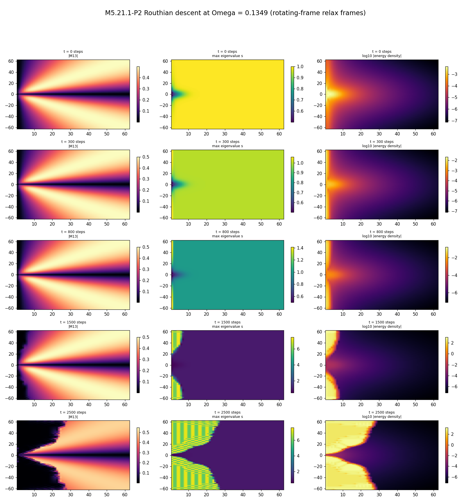

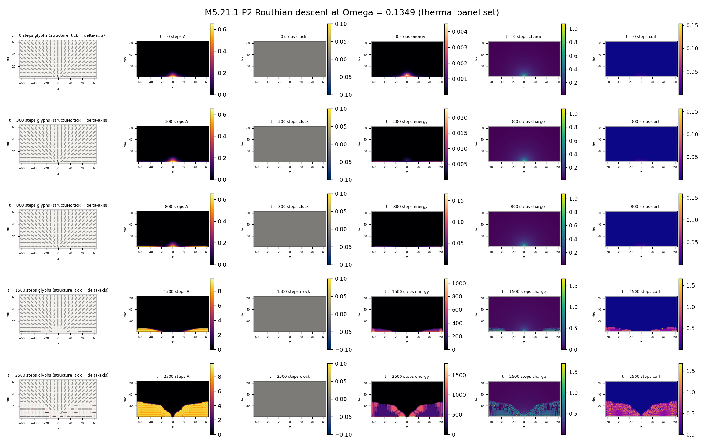

**c1 (the a2x alignment geometry, run on both signs + the big-grid endpoint)**:

| Generator class | cos(g_kin, g_stat), s = +1 | Read |
| --- | --- | --- |
| J12 pure rotation | +0.439 (ω_opt 0.076) | PARTIAL alignment with the slide's residual force: rigid rotation couples weakly (unlike the loop's 99.9997% time-row block), but the best achievable residual at ANY ω is 0.90: no rigid rate balances the slide |
| J23 pure rotation | +0.238 (ω_opt 0.032) | same, weaker (best residual 0.97) |
| boost-conjugated (3 families, χ 0.3-0.5) | −0.17 to −0.33 with Q2_avg < 0 | anti-aligned, no real balancing ω; boost-adjacent context only |
| Q2_avg(χ) crossings | χ_c ≈ 0.025-0.047 | the rigid kinetic goes NEGATIVE almost immediately with boost admixture: the boost hazard sits an order of magnitude closer to the surface on the hedgehog than on the loop (χ_c 0.4-1.1); the quarantine is LOAD-BEARING here |
| sign −1 | cos +0.436/+0.238, χ_c 0.020-0.037 | the alignment geometry is sign-robust |
| 128x256 endpoint crosscheck | cos +0.121 (J23 pure) | same picture; the deeper-slid state aligns less |

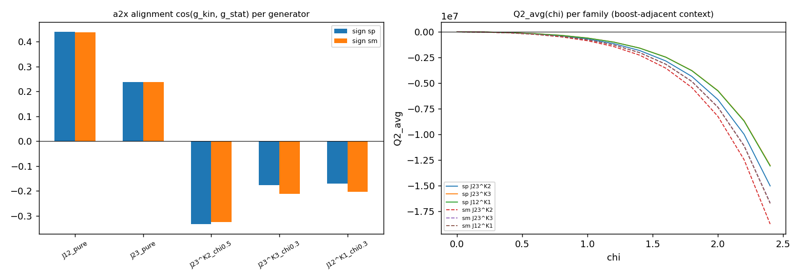

## 7. P3: the KG twist limit (results)

Spectral dispersion of perpendicular director-twist modes on the relaxed backgrounds, true-kinetic and canonical metrics, k along z (7 wavenumbers, complex-step HV curvature):

| Read | 64x128 (c0 state) | 128x256 (deep endpoint) |
| --- | --- | --- |
| ω²_true(k) shape | NON-MONOTONIC: 0.167 → min 0.104 at k ≈ 0.10 → 0.231 at k = 0.39 | same shape: 0.206 → min 0.164 at k ≈ 0.10 → 0.230 |
| KG fit ω² = m² + c²k² | R² 0.69 (fails) | R² 0.17 (fails) |
| canonical-metric gap m | 0.097 | 0.102 |
| GC2 kinetic positivity | ✅ T_true > 0 all modes | ✅ |

**Verdict (pre-registered "dispersion measured")**: at the toy regime on this stack the perpendicular-twist dispersion is NOT Klein-Gordon-like across the measured band: both grids show a roton-like MINIMUM at k ≈ 0.1 (grid-independent, so not a resolution artifact), with ω² falling with k² at small k (negative effective c² near k = 0). The canonical-metric gap ω ≈ 0.10 lands in the M5.21 core-ring band (0.11-0.13), tying the twist gap to the measured particle clock. **Caveat (flagged, not buried)**: the background is a sliding non-stationary state (P1), so the harmonic-frequency interpretation of the Rayleigh quotient is approximate; a KG verdict on a CONVERGED background is not available at toy parameters because no converged background exists there (the P1 finding). His Fig. 9 KG chain is therefore NOT closed on the new spec at toy (g, δ); the measured dispersion (with its dip) goes back to him as the sharpened object.

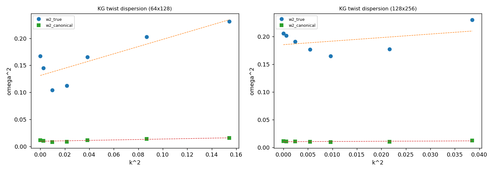

## 8. P4: the (g, δ) scaling ladder (results)

64x128, 4000-iter relaxes, s = +1; δ-ladder at g = 8, g-ladder at δ = 0.3, corners (16, 0.1) and (4, 0.5). One deviation: the first run went non-finite at g = 32 (flat FIRE dt0 vs the g³ stiff mode); re-run with dt0 ∝ 8/g, all 10 points clean.

| Law (fitted, log-log) | Slope | R² | Extrapolates (bar R² > 0.98) |
| --- | --- | --- | --- |
| axis transverse split vs δ | **1.034** | **0.9998** | ✅ THE C1 RESOLUTION: the vortex-line split IS the combed value ≈ δ; at his physical δ ~ 1e-10 the two transverse eigenvalues become EQUAL to 1e-10, i.e. his "two equal eigenvalues" regularization is an O(δ) statement that becomes exact in the physical limit and is necessarily coarse at toy δ = 0.3 |
| vacuum stiff mode vs g | **2.992** | **0.999998** | ✅ ω_max ∝ g³ (analytic: the p = 4 target column); at g ~ 1e10 the stiff scale is ~1e30 above the soft sector: direct simulation impossible, his "need practical approximations" is CONFIRMED as a scaling-law obligation |
| core pinning vs g | a = 0.4402 (g 8) → 0.4334 (g 16) → 0.4333 = exact (g 32); unpins at g = 4 (0.519) | monotone | the 3-equal core (his claim C2, seed-adjacent form) is pinned by the potential stiffness: exact as g → ∞ |
| confinement vs g | r50 slope −0.33, r90 −0.21 (R² 0.83/0.87), saturating at 8/27 by g ≥ 16 | no (saturation, not power law) | confinement tightens then saturates at the curvature scale |
| E_total vs g | 6.06 / 13.08 / 19.72 / 20.51 (g = 4/8/16/32) | R² 0.86 (bending) | saturates once the core is pinned: the energy is then curvature-sector dominated |
| a(δ) at g = 8 | tracks (1 + δ)/3 within 1.6% (consistently high) | n/a | consistent with C2 at toy stiffness |
| twist gap vs δ / vs g | slope 0.21 (R² 0.97) / flat (R² 0.04) | no / no | the clock gap is a soft-sector scale, mostly g-independent |
| r_half vs δ | constant 5.0 bins (the fit row is degenerate on constant data; reported as such) | n/a | melt radius insensitive to δ at fixed g |

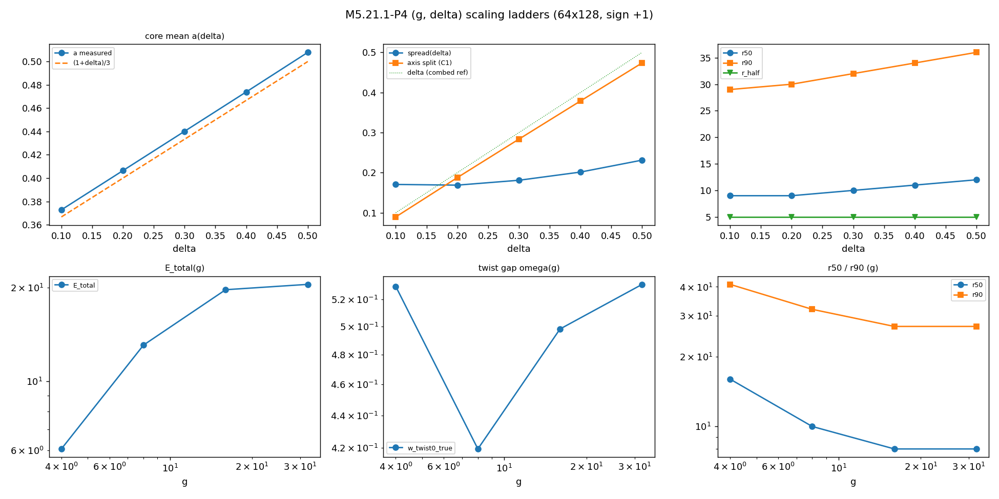

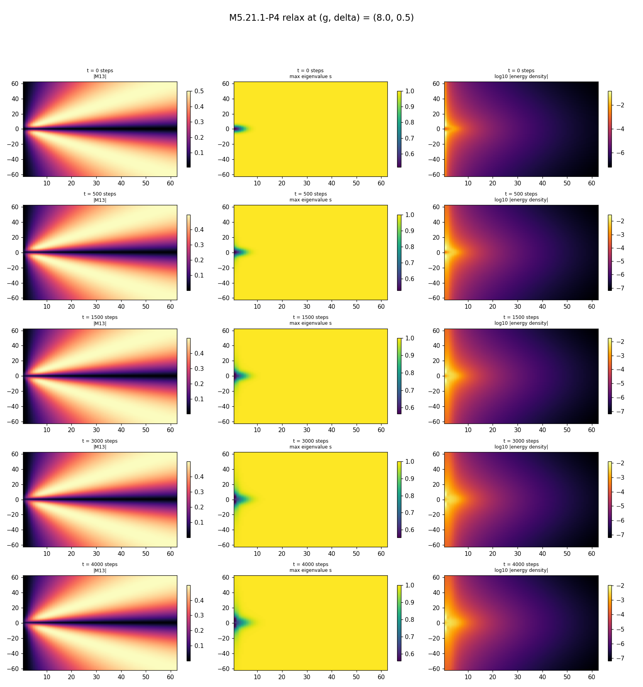

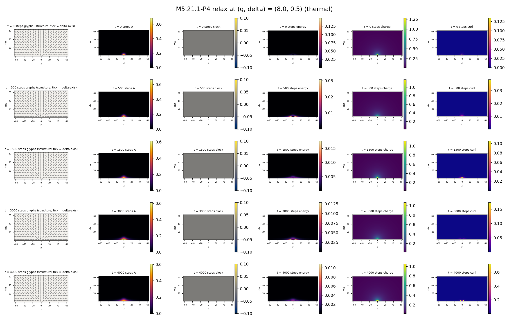

## 9. Films + inspection set

All state-evolving sequences render through `m5_film.film_strip` in BOTH templates (basic + thermal), first row t = 0 (the seed), per the film standard ([`../m5_visualization.md`](../m5_visualization.md)): the P1 deep relax (§ 5), the P2 Routhian descent at the rung (§ 6), the P4 representative relax at (8, 0.5) (§ 8). Field-state cross-sections at t = 0 and endpoint are inside each strip (direct ran-the-simulation evidence).

**The ≤ 4-artifact physics-first inspection set**:

| # | Artifact | What it shows in one look |
| --- | --- | --- |
| 1 | [`m5_21_1_b_film_basic.png`](../plots/m5_21_1_b_film_basic.png) | the P1 spreading slide, seed → 48k |
| 2 | [`m5_21_1_c_film_basic.png`](../plots/m5_21_1_c_film_basic.png) | the P2 centrifugal runaway at the rung |
| 3 | [`m5_21_1_c_kg.png`](../plots/m5_21_1_c_kg.png) | the roton-like twist dispersion (both grids) |
| 4 | [`m5_21_1_d_scaling.png`](../plots/m5_21_1_d_scaling.png) | the two extrapolating laws (δ^1.03 axis split; g^2.99 stiff mode) |

## 10. Not computed (explicit)

| Not computed | Why |
| --- | --- |
| Any IVP time integration | ill-posed on non-trivial backgrounds (M5.20.3, audited); minimization/orbit/spectral reads only |
| The neutrino/loop side | parked ([`../tasks/m5_20_6_task_details.md`](../tasks/m5_20_6_task_details.md) archived reserve, [`../tasks/m5_20_7_task_details.md`](../tasks/m5_20_7_task_details.md) after the M5.21 series) |
| Physical-regime (δ ~ 1e-10, g ~ 1e10) direct solves | unreachable on any grid; P4 charts toy-regime scaling laws with explicit extrapolation flags |
| 2-particle / antipair runs | M5.21.2 |
| μ / g-factor closure | M5.21.3 |

## 11. Adversarial audit (cardinal rule)

Independent agent, own implementations (eigenvalue-route V4, plain-FD curvatures, own containment/fits), 2026-07-16. Script: [`m5_21_1_audit_check.py`](../scripts/m5_21_1_audit_check.py) (rerun: `python3 m5_21_1_audit_check.py`, ~5 s) · data: `../data/m5_21_1_audit.json`.

| Claim | Verdict | Auditor's key numbers |
| --- | --- | --- |
| C-A P0 sign gap | ✅ CONFIRMED | own-V4 gap 0.129607 (0.941%); u_eta gap exactly 0; the odd-p cross-term analytic formula reproduces the gap to 6.7e-13; own vs imported energy rel 3.9e-16 |
| C-B P1 slide | ✅ CONFIRMED | E(it) strictly monotone all 48 points; own r50/r90 8/32 → 15/51, core-ball 0.517 → 0.202; boundary-band energy 0.32% (NOT pin leakage: the spreading is interior) |
| C-C P2 runaway | 🔶 PARTIAL: instability CONFIRMED, "unbounded below" REFUTED | endpoint R values match to 2e-16 and the descent is monotone (not dt-instability), BUT ray probes turn upward (V4 ~ amp^8 vs Q2 ~ amp^4) and the Ω = 0.25 endpoint is near-stationary (rel 1.6e-5): a deep FINITE well ~10 orders down. §§ 6 wording corrected accordingly |
| C-D P3 roton dip | ✅ CONFIRMED | plain-FD, own mode construction, two envelopes (r_env 15/25): minimum at n = 2 (k ≈ 0.098) in both |
| C-E negative time-mixing curvature | ✅ CONFIRMED | energy-level FD boost01 −0.385642 (vs complex-step −0.3856411: 6-digit agreement by an independent method); own random time-mix −0.401, block-diag +3.5e5 |
| C-F P4 laws | ✅ CONFIRMED | own refits: 1.0343 (R² 0.999776), 2.9919 (R² 0.9999980); the analytic p = 4 Jacobian reproduces every ladder row to ≤ 1.5e-4 and predicts slope 2.9920 |

**Auditor's completeness corrections (adopted)**:

| # | Correction | Where folded |
| --- | --- | --- |
| 1 | "Unbounded below" overstated: deep finite well, ~10-orders descent | § 6 rewritten |
| 2 | The −5.1e-5 tail slope is a 24k-window average; the instantaneous tail rate is −3.4e-5, decaying ~ it^−1.14 (the non-convergence conclusion survives) | noted here; § 5 slope is the window average |
| 3 | r90 = 51 is relative to the energy inside r ≤ 99; vs the full-grid total r90 = 58.3 (r50 unchanged 14.9): a convention, not an error | noted here |
| 4 | The 0.1296 (frozen-state) and 0.150 (relaxed-vs-relaxed, = the SP4 1.09%) gaps measure DIFFERENT things; do not interchange | § 4 keeps them as separate rows |
