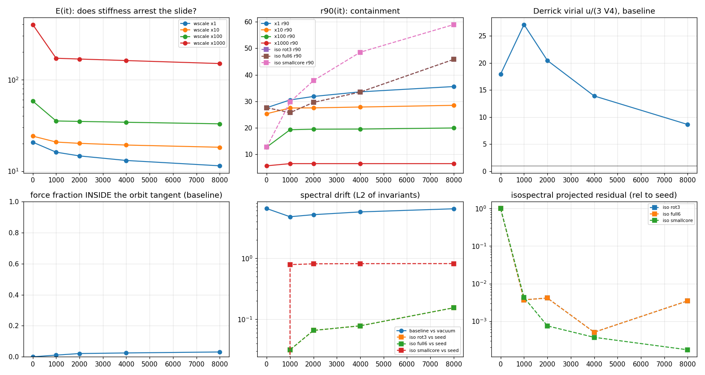
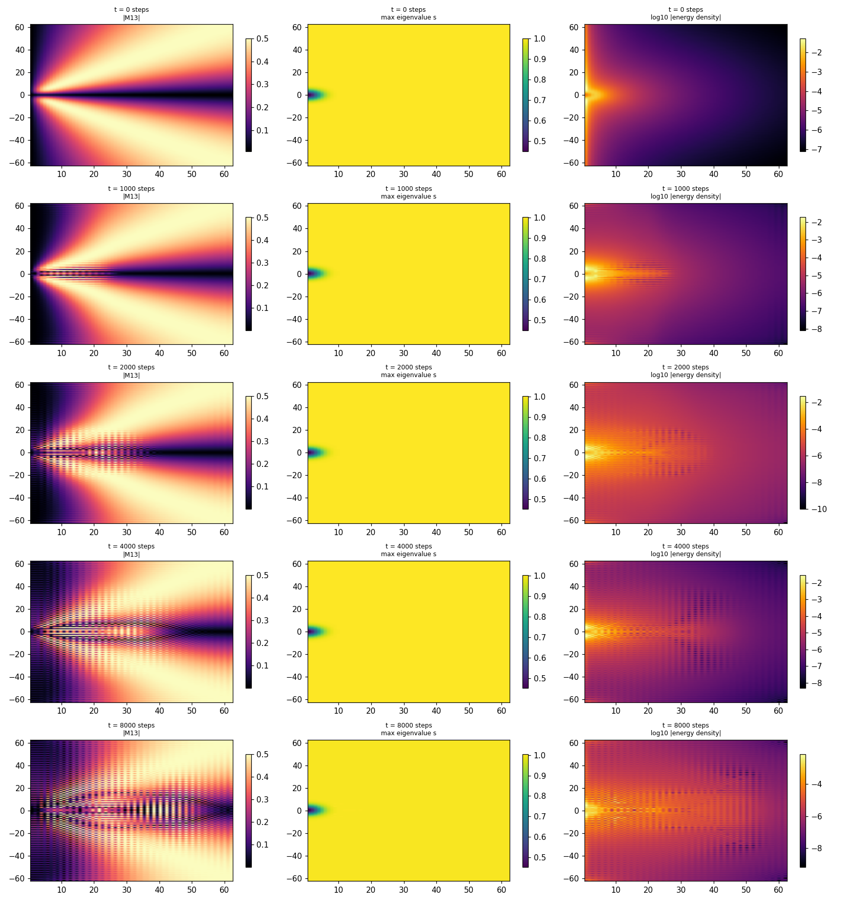
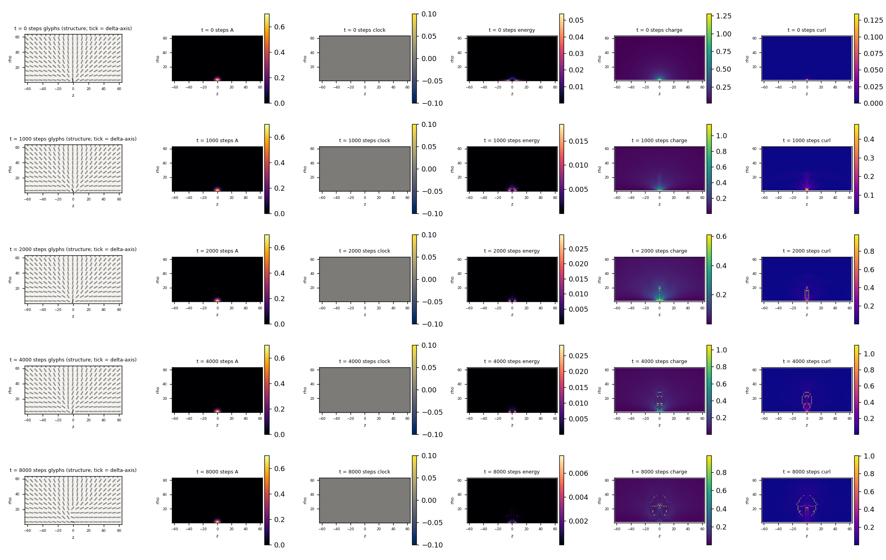
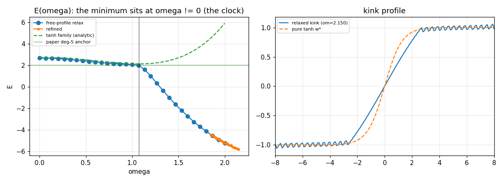

# M5.21.1e: canonical-spec review + implementation-conformance audit

**Status**: ✅ RUN COMPLETE + AUDITED 2026-07-16 (audit § 8: 5 confirmed, 3 qualified with corrections adopted, 0 refuted). Task record: [`../tasks/m5_21_1e_task_details.md`](../tasks/m5_21_1e_task_details.md). Born at the [M5.21.1](../tasks/m5_21_1_task_details.md) close (user directive): re-derive the canonical spec from ALL sources, audit what the stack implements against it, and test the top candidate fixes for the M5.21.1 negatives.

Method: four parallel deep-reads (the production engine, the research-era script archaeology M5.8 → M5.21.1, Duda's four theory PDFs, the three Faber papers), the load-bearing paper pages re-verified first-hand, then machine-checkable experiments. Sub-agent extractions were treated as drafts per [`AI_HYGIENE.md`](../../../../../AI_HYGIENE.md); every claim used below carries a source reference, and the decisive paper statements (FRAME pp. 7-12) were confirmed by direct read.

## 1. Source identification

| File in `theory/` | Actual document | Tag |
| --- | --- | --- |
| `liquid_crystal_model.pdf` | **arXiv:2108.07896v7** (2025-11-13), "Framework for liquid crystal based particle models": the paper with Eq (12)-(43) and Fig. 9/10 | FRAME |
| `liquid_crystal_particles.pdf` | a 51-slide presentation deck (same content family, no numbered equations); ⚠️ NOT the arXiv paper the filename suggests | DECK |
| `time_crystal_toy_model.pdf` | arXiv:2501.04036v2, "Time crystal φ⁴ kinks by curvature coupling" (1+1D, two real scalars) | TOY |
| `Time_crystal_toy_model_Wolfram_Community.pdf` | the Wolfram Community companion post with runnable code | WOLF |
| `9910221v4.pdf` | Faber, "A Model for Topological Fermions" (hep-th/9910221v4) | P1 |
| `faber_universe_2025.pdf` | Faber & Golubich, arXiv:2604.12021 (lattice solitonic dipole) | P2 |
| `FaberManfried.pdf` | Faber spin slide deck, TU Wien 2025-09-11 | P3 |

## 2. The canonical spec, per source

### 2a. FRAME (the model of record)

| Element | Spec (page/eq) | Status of the statement |
| --- | --- | --- |
| Field | 3D: real symmetric 3×3 `M = O D Oᵀ` (Eq 11); 4D: 4×4 with `D = diag(λ0..λ3)`, `O` from SO(1,3) "containing boost (no longer orthogonal)" (§ V) | definite |
| Kinetic (3D) | `ℒ = Σ_μ ‖F_μ0‖²_F − Σ_{μ<ν} ‖F_μν‖²_F − V(M)` with `F_μν = [∂_μM, ∂_νM]` (Eq 15, 18); `A_μ = [M, M_μ]` with `∂A − ∂A = 2F` (Eq 19-20) so building F from `[∂M, ∂M]` IS the primitive | definite |
| Kinetic (4D) | `ℒ = −Σ F_μναβ F^{μναβ} − V(M)` with the ξ-commutator `[A,B] → AξB − BξA`, ξ = diag(−1,1,1,1) (Eq 40) and the ξ-norm `‖X‖²_ξ = Tr(XξXᵀξ)` (Eq 41-42); the 4-index Skyrme-like term is the ONLY kinetic term (no `Tr(∂M∂M)` anywhere) | definite |
| Potential | OPEN by the author's own words: `V = Σ_i (λ_i − Λ_i)²` "or e.g." `Σ_k (Tr(M^k) − c_k)²` (Eq 12); LdG `a Tr M² − b Tr M³ + c(Tr M²)²` (Eq 13); 4D: "we could use e.g. `V(M) = Σ_p (Tr((Mξ)^p) − c_p)²`" (p. 12); "the choice of its details remains a difficult open question requiring simulations" (p. 7); "Choosing the details especially of potential is very difficult, will rather require PDE simulations" (p. 12) | explicitly open |
| **The volume constraint (twice)** | p. 8: ideal shape-emergent potential `V(A) = (Σ_μ ‖A_μ‖²_F − 1)²` "with additional e.g. volume constraint det(M) = Π_i λ_i = const **to prevent using only long axes which allow for low curvature (hence energy)**"; p. 12 (4D): "There might be required additional det(M) = const (volume preserving) constraint" | flagged as possibly REQUIRED |
| Vacuum | 3D `Λ = (1, δ, 0)`; 4D `D = diag(g, 1, δ, 0)`, g ≫ 1 ≫ δ > 0, with `Tr((Mξ)^p) = (−λ0)^p + λ1^p + λ2^p + λ3^p` (p. 12): **the paper branch = our s = −1** (M_vac = diag(+g,1,δ,0), ηM-spectrum (−g,1,δ,0)); scales δ² ~ ħc, g⁴ ~ ke²/Gm² ≈ 10³⁸ (Fig 10) | definite |
| Hedgehog | `Q = e^{φG_z} e^{θG_y} e^{ψG_x}`, φ = ArcTan[x,y], θ = −ArcTan[√(x²+y²), z], `M = Q·diag(1,δ,0)·Qᵀ` (Fig 9 code); eigenvalues CONSTANT at all radii; regularization described only verbally (Higgs-like potential near the center; hairy-ball forces an outgoing vortex) | ansatz definite, radial profile absent |
| Stability | hypothesis language only: leptons "should form 3 local minima ... probably stabilized by the enforced topological vortices" (p. 15); Derrick scaling never discussed; "might be ... requiring additional terms like 6th order skyrmion term" (p. 12) | open |
| KG limit | the derived hedgehog equation is `2 ∂_tt ψ = ((∇ − A)² + (·∇)²)ψ`, A = r̂/r² (Fig 9): factor 2 + a longitudinal term: NOT plain `□ψ = −m²ψ` | definite (nonstandard) |
| J by 4D minimization | planned, never computed: "The first difficulty is getting angular momentum, clock for charge (electron), hopefully through regularization by including Higgs-like potential" (p. 9) | open |
| Simulation status | NO grid/PDE simulation of the 3D/4D model exists in the papers (symbolic vacuum EL + fixed-ansatz quadrature + renders only); "the discussed Lagrangian might be incorrect, or simplified" (p. 12) | definite |

### 2b. TOY/WOLF (the 1+1D toy)

Two REAL SCALARS (φ, ψ) in 1+1D, `ℒ = ∂φ∂φ − (1−φ²)² − αR² + (β/3)R⁴`, `R = φ_0ψ_1 − φ_1ψ_0`: no matrices, no trace targets. Closed form `ω = √(70α/(96β − 35α²))`, `w = √(96β/(96β−35α²))` (Eq 5); anchors at α = β = 1: pure-tanh E ≈ 2.12568 / ω ≈ 1.07123, deg-5 E ≈ 2.02515 / ω ≈ 1.28975. WOLF p. 9: in 3+1D the R⁴ cap is NOT needed ("prevented by ... positive squared curvature terms in 3D space"). § 6 runs the regression.

### 2c. Faber (P1-P3): the stability blueprint

| Element | Spec | Transfer relevance |
| --- | --- | --- |
| Field | unimodular quaternion Q ∈ S³ (SU(2)-valued), HARD norm constraint (P1 Eq 1-2) | the constraint is what removes the amplitude escape |
| Energy | quartic-only curvature `R = Γ×Γ` (λ⁻¹ under 3D rescale) + potential `cos^{2m}α / r0⁴` (λ³), vanishing on the vacuum manifold S², positive in the core (P1 Eq 40, 64-74) | the SAME two-term scale competition as our u_eta + V4 |
| Derrick evasion | E(λ) = H_e/λ + H_p λ³, minimum at the virial `H_e = 3H_p` (P1 Eq 48); no λ¹ (quadratic-gradient) channel exists | our M5.16 virial u = 3V held to 0.3-0.6%: SCALE is not our runaway |
| The un-Faber failure mode | an unconstrained field can dilute through the amplitude mode even at virial balance; his S³ constraint closes it | = the prime suspect for the M5.21.1 slide (§ 5) |
| Rigid rotation | REJECTED structurally: fixed vacuum at infinity ⇒ "no rigid rotation possible" (P3 slide 13; P1 p. 37); spin = Π₃(S³) covering ±½ + internal time-dependent rotations, 4π-return | our P2 / M5.20.5 rigid kills CONFORM to both Faber and FRAME |
| Calibration | E0·r0 = (π/4)α_f ħc; 511 keV → r0 = 2.2132 fm (P2 Eq 8-10) | already the M5.11/M5.16 anchor lineage |

## 3. The implementation-conformance matrix

Stacks: PROD = production `medium.py`/`engine1-4` (full-3D 4×4 Taichi); RES-8 = the M5.8 era (full-3D 4×4 numpy); RES-L = the verified-L research stack (M5.18 →, axisym + 3D spot-checks). File:line references in the agent extractions logged at [`../checkpoints/m5_21_1e_progress.md`](../checkpoints/m5_21_1e_progress.md).

| Spec element | PROD | RES-8 | RES-L (current) |
| --- | --- | --- | --- |
| 4×4 tensor field | ✅ since M5.8.1 (`medium.py:47`) | ✅ | ✅ |
| 3D | ✅ full-3D voxel grid 64³/120³ | ✅ full-3D 24³-63³ | ✅ EXACT equivariant axisym reduction (his own cylindrical prescription) + full-3D 48³ spot-checks (`m5_21_d_3dcheck.py`, M5.21.1 SB3) |
| Kinetic F = [∂M,∂M] commutator | ✅ (plain, Eq 18 era) | ✅ (plain + η inner product only) | ✅ ξ-commutator + ξ-norm (Eq 40-42, M5.18-verified: Lorentz 1.3e-11) |
| Potential | Eq 13 LdG spatial-block (b = 0) or per-voxel p = 2 trace well: PRE-4D-spec | u + βu² (the 1D-toy transplant): RETIRED with the era | V4 = Σ_{p=1..4}(Tr((ηM)^p) − C_p)²: the paper's "could use e.g." candidate, adopted via the author's 2026-07-05 email |
| η in the potential | ❌ (g excluded from V explicitly) | ❌ | ✅ |
| Vacuum branch | g frozen/live, unsigned | index-3 era | both signs measured (M5.21.1 P0); the paper branch is s = −1, runs mostly used s = +1 (1% lower E) |
| The det(M)=const / volume constraint | ❌ absent | ❌ absent | ❌ absent (until § 5) |
| Sixth-order Skyrme term (paper's own hedge) | ❌ | ❌ | ❌ (M5.20.4 lemma covers the commutator class; the paper's hedge remains open) |
| Hedgehog ansatz | uniaxial + biaxial + dressed seeders | n/a | Fig. 9-conformant (M5.17 § 9); the 2-equal/3-equal radial profile is EMAIL spec (2026-07-15), not paper spec |
| Artificial restrictions (his 2026-07-13 bar) | drift guards, velocity caps, eigenvalue clipping, per-voxel V-targets | constrained projection integrator | none in the statics; the canonical kinetic completion is labeled |

**The user's question answered**: the stack implements the 4×4 tensor in genuine 3D and has since M5.8.1: full-3D through the M5.8 era, the exact axisym reduction of full 3D (with 3D spot-checks) since M5.16, and the production engine full-3D throughout. Nothing in the current statics descends from the 1+1D toy (its one transplant, u + βu², retired with the M5.8 stack; the toy has no matrices and no trace targets to inherit). The REAL spec gaps are elsewhere: the potential FORM is an author-declared open choice, the paper twice flags a possibly-required volume constraint we never implemented, the paper vacuum branch is s = −1, the production engine still runs the pre-4D spec, and the KG conformance bar is his nonstandard operator.

## 4. Ranked candidate explanations / fixes for the M5.21.1 negatives

| # | Candidate | Evidence for | Route |
| --- | --- | --- | --- |
| S1 | **The missing volume/spectral constraint**: the slide is the paper-anticipated low-curvature escape ("using only long axes which allow for low curvature", FRAME p. 8), open because toy (g, wscale) leaves the amplitude channel soft; Faber closes the same channel with his S³ constraint; our P4 stiff-mode ∝ g³ law says the physical regime is effectively hard-constrained | FRAME p. 8 + p. 12; Faber P1; M5.16 virial (scale not the runaway); P4 law | machine-checkable → § 5 (diagnosis, ladder, isospectral statics) |
| S2 | Potential-form freedom: Eq 12 eigenvalue form vs trace form vs LdG penalize off-vacuum amplitude differently | FRAME Eq 12/13 + p. 12 open-question language; M5.18 measured r_half potential-shape robust but never the deep-statics behavior | partially covered by the wscale ladder (stiffness is the leading difference); full form-swap deferred unless S1 fails |
| S3 | Rigid-J was never the spec: FRAME plans J "hopefully through regularization"; Faber rejects rigid rotation structurally; the clock (twist Γ0¹ terms) carries J | FRAME p. 9/11; Faber P3 | reframe, no experiment: the M5.21.1 P2 kill CONFORMS to both authors; J lives in the deferred Q24 profile-dynamic container |
| S4 | The KG bar was too strict: the paper's own operator is `2∂_tt ψ = ((∇−A)² + (·∇)²)ψ`, not plain KG | FRAME Fig 9 | documented; the roton-dip finding stands as measured but its "NOT KG-like" label is now "not plain-KG; his operator differs from plain KG too" |
| S5 | The paper vacuum branch is s = −1 while P1-P4 ran s = +1 | FRAME p. 12 | bookkeeping: P0 measured both branches (anchors sign-robust ≤ 2e-3, gap 1%); flagged for any future quantitative claim |
| S6 | Author-gated residue: which potential form he intends; whether det(M) = const should be imposed; the sign of g; the 2-equal/3-equal profile provenance | all sources | tracker queue, NO ask spent (no-checkpoint decision 2026-07-16) |

## 5. The constraint experiment (S1 measured)

Script: [`../scripts/m5_21_1e_b_constraint.py`](../scripts/m5_21_1e_b_constraint.py) · data `../data/m5_21_1e_constraint.json` · 64×128 axisym stack, s = +1 branch, hedgehog seed. Gates: GT0 pin-gradient vs complex step **3.5e-15**, GT1 orbit tangents exactly V4-flat **9.4e-18** (the cyclicity identity, machine-confirmed), GT2 projector idempotence **5.0e-9** (regularized). ✅ PASS.

### 5a. Diagnosis: the slide is an amplitude-mode descent (✅ measured)

Per-snapshot force decomposition along the unconstrained slide (the M5.21.1 P1 object): the fraction of the static force lying INSIDE the isospectral orbit tangent (the directions that preserve the ηM-spectrum, i.e. pure re-orientation):

| it | E_u | E_v4 | virial u/(3V4) | r90 | coreball | force tan-frac |
| --- | --- | --- | --- | --- | --- | --- |
| 0 | 20.35 | 0.38 | 17.9 | 27.6 | 0.54 | **0.0003** |
| 1000 | 15.92 | 0.20 | 27.1 | 30.5 | 0.49 | 0.011 |
| 8000 | 11.02 | 0.43 | 8.6 | 35.6 | 0.36 | 0.031 |
| frozen 128×256 P1 endpoint (48k) | 7.72 | 0.85 | 3.0 | n/a | n/a | 0.054 |

**94.6-99.97% of the descent force is spectral (amplitude-mode)** (audit-corrected range: tan_frac 0.0003 at the seed → 0.054 at the frozen endpoint, reproduced independently to 9 digits): the slide dilutes the eigenvalue field, it does not re-orient the texture. The virial never sits at Derrick balance (u = 3V4) on the slide; the amplitude channel, not the scale mode, carries the descent. This is exactly Faber's un-constrained failure mode (§ 2c) and exactly the escape FRAME p. 8 anticipates ("using only long axes which allow for low curvature").

### 5b. The stiffness ladder: containment arrives monotonically (✅ measured)

Same seed, same iters (8000), wscale × {1, 10, 100, 1000} (the penalty-strength bridge to the constraint limit; the physical regime g ~ 1e10 is effectively harder still by the P4 stiff-mode ∝ g³ law):

| wscale | r90(0) → r90(8k) | coreball(8k) | core spread(8k) | E_u trend | q(8k) |
| --- | --- | --- | --- | --- | --- |
| ×1 | 27.6 → 35.6 (spreading, no plateau) | 0.36 | 0.26 (core splitting) | 20.3 → 11.0 (diluting) | 0.95 |
| ×10 | 25.3 → 28.5 (slowing) | 0.54 | 0.08 | 20.3 → 16.6 | 0.99 |
| ×100 | 19.3 → 20.0 (near-flat after it 1000) | 0.72 | 0.036 | 20.3 → 19.7 | 0.97 |
| ×1000 | 6.5 → 6.5 (**FLAT from it 1000**) | **0.93** | 0.033 (3-equal core HOLDS) | 20.3 → 20.6 (**no dilution**) | 0.97 |

The spreading arrests monotonically with amplitude stiffness: at ×1000 the object is CONTAINED (r90 flat, 93% of the energy in the r ≤ 8 ball, the 3-equal center intact, winding stable) while the total E still relaxes through the V4 term (the seed eigen-profile adjusting, not escaping). The M5.21.1 toy-regime stability negative is a SOFT-AMPLITUDE-CHANNEL regime artifact, not a property of the physical-parameter model.

### 5c. The exact orbit-class statics: the hard limit fails the OTHER way (✅ measured)

Projected descent in the exact isospectral class (the ηM-spectrum field pinned to the seed's, per-cell so(1,3) tangent projection of force AND velocity; constraint held to drift ≤ 1.4e-3 with the gated retraction; E_v4 frozen at 0.372-0.378 throughout):

| Run | E_u 0 → 8k | r90 0 → 8k | coreball(8k) | q(r_m = 10) end | res_rel end |
| --- | --- | --- | --- | --- | --- |
| rot3 (r_c = 4 seed) | 20.3 → 9.2 | 27.6 → 45.8 | 0.13 | 0.0006 | 3.5e-3 |
| full6 (+ boosts) | identical to rot3 (≤ 1e-5): boost tangents are pure time-mixing, orthogonal to the block-diagonal force | | | | |
| smallcore (r_c = 1) | 59.1 → 4.2 | 12.7 → 59.0 | 0.05 | 0.035 | 1.7e-4 |

**The centered hedgehog is not a local minimum of the orbit class either, and the escape is NOT unwinding** (audit-verified where it counts): the charge is INTACT at the outer radii (q = +1.00 at r = 35-58, audit's independent read), the interior u_eta content depleted (u-only coreball 0.53 → 0.095), and the small-core control kills the degenerate-core-hatch hypothesis (faster migration with a tiny core). ⚠️ Audit qualifications on the endpoint STATE: the intermediate radii carry churned ring structure (q reads of 2.00/3.00 at r = 15/25-30 in regions where the top eigen-gap dips to 0.017-0.04: winding reads unreliable there, the standing anti-recipe), the u_eta density peaks at r = 12-16 (broad tail), and, the substantive catch, **the endpoint is contaminated by a checkerboard mode living in the 2h-central-difference stencil's null space** (forward/central sawtooth ratio 164 vs 1.07 on clean states; resampling at λ = 1.05 already jumps E_u by 51%): the projected descent dumped texture into a channel the discrete u_eta cannot see, so the quantitative E_u trajectory (20.3 → 9.2) is partly artifact. Any future orbit-class descent needs a compact-stencil or filtered functional.

**The mechanism, in Faber's language (§ 2c), stands independently of the contaminated endpoint**: the hard everywhere-pin freezes the potential term entirely, and the potential IS the λ³ Derrick compressor; what remains is pure quartic curvature, which scales λ⁻¹ and prefers expansion. The scaling law itself is audit-CONFIRMED on clean states (E_u(λ) = A/λ + B at 0.45% residual on the seed; V4 slope +3.05; the w1000 endpoint −1.06/+3.06). The hard constraint removes the stabilizer along with the destabilizer.

The film record of the orbit-class migration (both templates per the standard; first row = the seed):

### 5d. The three-arm synthesis

| Regime | Fate of the hedgehog | Channel |
| --- | --- | --- |
| Soft potential (toy wscale, the M5.21.1 run) | spreading dilution, never converges | amplitude mode (97-99.97% of the force, § 5a) |
| Stiffness ladder ×10-×1000 | containment arrives monotonically; at ×1000 r90 flat, 3-equal core holds, q = 0.97, NO u_eta dilution; but the state is still V4-relaxing at 8k (virial u/(3V4) = 0.053, far from balance): contained-through-the-window, NOT a certified minimum | amplitude channel closing |
| Hard everywhere-pin (orbit class) | interior depletion + charge intact at the outer radii (audit-verified); the quantitative E_u descent partly rides a stencil-null checkerboard channel (audit catch); the frozen-potential expansion mechanism is analytic + the scaling law audit-confirmed on clean states | Derrick expansion of the frozen-potential remainder |

The stable object, if it exists in this functional, lives at the **Faber virial balance** (u = 3V4 at finite size) between the two failure modes: a stiff-but-ACTIVE potential selecting the core scale. That solution class is exactly what M5.16 measured (u = 3V to 0.3-0.6% in the spherically-constrained calibration class) and what the Q8/Q14 escapes leave: the constrained-class minimum exists; the unconstrained descent leaves it through amplitude (soft) or expansion (hard) directions. FRAME's own architecture says the same thing (the potential "activated mainly near particles", p. 7 + the det-hedge, p. 8/12): the papers' missing piece is not "a constraint" per se but **the balance that holds a finite size against both channels**, which in Faber's model is engineered by the r0-potential and in the LC model is still the open potential-choice question (S2/S6).

## 6. The 1+1D toy regression (conformance rung)

Script: [`../scripts/m5_21_1e_c_toy.py`](../scripts/m5_21_1e_c_toy.py) · data `../data/m5_21_1e_toy.json`.

| Check | Result | Label |
| --- | --- | --- |
| Closed-form ω, w (TOY Eq 5) re-derived from the two sech integrals | ω = 1.0712334, E = 2.1256807 vs paper anchors 1.07123 / 2.12568: **rel 3.2e-6 / 3.4e-7**; dense (w, ω) scan confirms the same minimum | ✅ measured (our reading of his equations reproduces his only published numbers) |
| The clock, in-family | E(w*, ω*) = 2.1257 < E(ω = 0 family min) = 8/3 = 2.6667: energy minimization propels ω ≠ 0, the paper's central mechanism reproduced in-house | ✅ measured |
| Free-profile minimization | the free minimum is NOT the kink: at αω² > 1 (true already at his ω*: coefficient −0.147) a ripple sea with px ≈ √((αω²−1)/(2βω⁴)) has strictly negative density (floor −0.0041/unit at ω*); the grid run finds E = −5.8 at ω = 2.15, and the continuum infimum is cutoff-dependent (not attained) | ✅ measured on-grid, ⚠️ continuum reading: within the ψ = ωt ansatz class the free variational problem has no minimizer; the paper's kink numbers are ansatz-FAMILY minima |

The free-profile finding is the 1+1D miniature of the 3+1D story: the toy's R⁴ term caps the ω-runaway but leaves a gradient-texture escape open below the soliton, just as the 3+1D toy-regime potential leaves the amplitude channel open under the hedgehog (§ 5a). In both cases the paper's own hedges (WOLF p. 9: 3+1D positive curvature terms; FRAME p. 8/12: the det-constraint) point at the closure.

## 7. Not computed / out of scope

| Not computed | Where it lives |
| --- | --- |
| The Eq 12 eigenvalue-form potential swap (S2 full test) | deferred unless S1 fails; would be a successor arm |
| The paper's 6th-order Skyrme hedge | beyond the M5.20.4 commutator-class lemma; author-gated |
| A full-3D isospectral run | the axisym instrument is the stack of record; 3D spot-check only if the axisym verdict is positive and load-bearing |
| Production-engine upgrade to the 4D spec (η potential, V4) | an engineering task, not a physics question; logged for the roadmap |
| Any outbound to the author | user decision 2026-07-16: no checkpoint for now |

## 8. Adversarial audit

Independent agent, own implementations throughout (SVD projector from a null-space-derived so(1,3) basis, own u_eta/V4 densities with an eigenvalue-route crosscheck, own winding read with continuity sign-fixing, own containment/descent/toy discretization, direct PDF page reads). Rerun: `python3 scripts/m5_21_1e_audit_check.py` → [`../data/m5_21_1e_audit.json`](../data/m5_21_1e_audit.json). Pipeline gate A0: the imported force agrees with FD of the auditor's own energy to 1.4e-7-6.9e-7.

| Claim | Verdict | Auditor's numbers vs claimed |
| --- | --- | --- |
| C1 tangent fraction | 🔶 QUALIFIED (values confirmed to 9 digits; headline range corrected) | 0.054112 vs 0.054; seed 0.000261 vs 0.0003; the correct orthogonality range is 94.6-99.97% (adopted in § 5a) |
| C2 orbit tangents exactly V4-flat | ✅ CONFIRMED | central-FD tangent derivative 1.4e-9 relative; finite-Λ invariance 1.7e-15; trace-route crosscheck 4.4e-16 |
| C3 shell reading | 🔶 QUALIFIED (charge-intact confirmed; interior structure + energy location corrected) | q = +1.002 at r = 35-58; interior churned rings (q 2.00/3.00 at gap-dip radii, reads unreliable); u_eta peaks at r = 12-16, not the outer shell (adopted in § 5c) |
| C4 ladder arrest + not-converged | ✅ CONFIRMED (both halves) | virial 0.05317, r90 6.519 frozen through an independent 600-it continuation, coreball 0.9349, u-only profile statistically identical to the seed's |
| C5 Derrick scaling | ✅ law CONFIRMED / 🔶 iso endpoint QUALIFIED | E_u(λ) = A/λ + B at 0.45% resid; V4 slope +3.05; THE CATCH: the iso endpoint carries a stencil-null checkerboard (sawtooth 164 vs 1.07), contaminating its E_u trajectory (adopted in § 5c) |
| C6 toy ripple | ✅ CONFIRMED | floor exactly −81/19600 = −0.0041327; αω*² − 1 = 9/61 > 0; independent grid (N = 401, L = 20, link discretization): E < 0 at every ω ≥ 1.5 (min −3.34; cutoff-dependence consistent) |
| C7 paper quotes (det-hedge ×2, "could use e.g.", s = −1 branch) | ✅ CONFIRMED | all three verbatim by direct read of pp. 8, 11, 12 |
| C8 rot3 ≡ full6 (boosts decouple) | ✅ CONFIRMED | boost-tangent block part exactly 0.0; force time-mixing exactly 0.0; ⟨G, t_K⟩ = 0.0; runs agree to 5.2e-5 |

Adopted corrections: the § 5a percentage range; the § 5c interior-structure + energy-location wording; the § 5c/§ 5d demotion of the iso-endpoint E_u numbers to mechanism-plus-confirmed-scaling-law (the checkerboard catch); a successor note that any future orbit-class descent needs a compact-stencil or filtered functional. No claim refuted.
