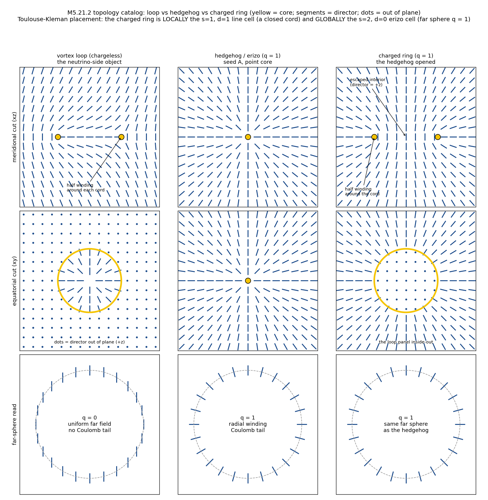
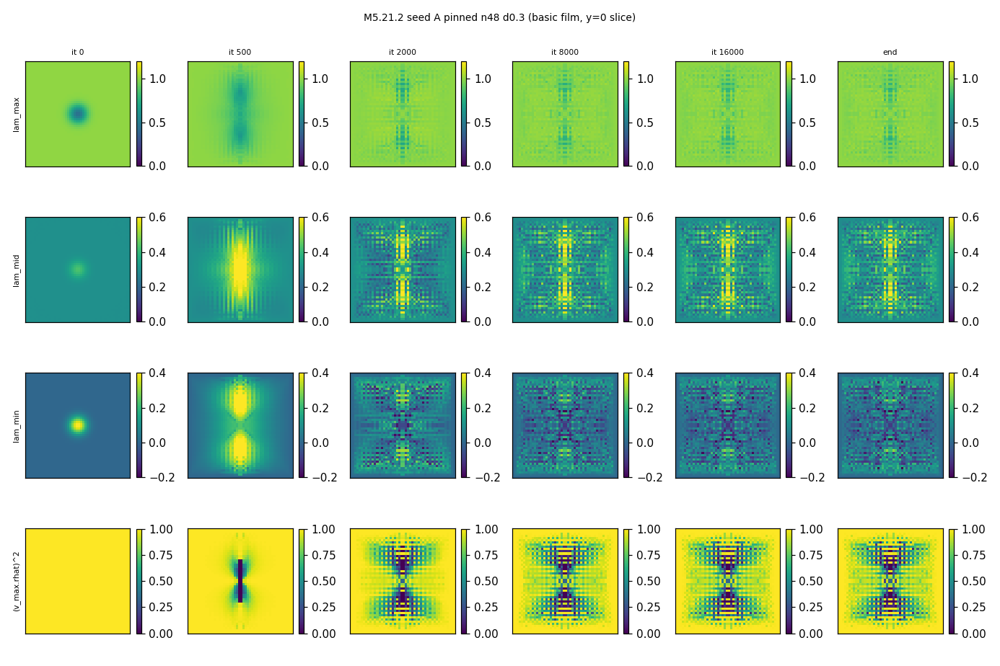
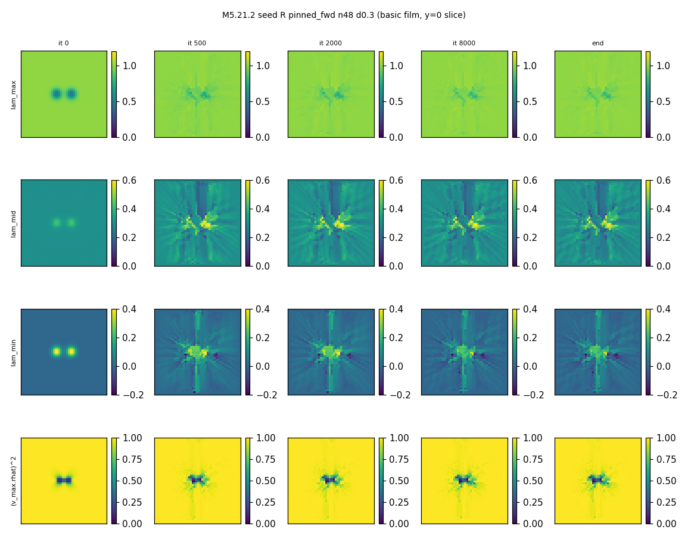
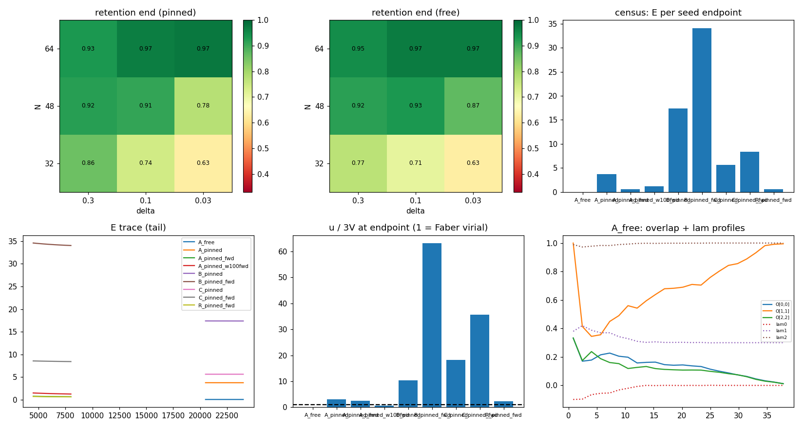

# M5.21.2: the 3D 3-lepton axis-permutation scan (census record)

**Status**: ✅ RUN COMPLETE + AUDITED 2026-07-17 (P0 gates ✅, P1 ladder ✅, P2 census 2h DEMOTED + fwd census of record ✅, P3 ring arm ✅, audit 8/8 CONFIRMED § 8). Task: [`../tasks/m5_21_2_task_details.md`](../tasks/m5_21_2_task_details.md). Prescription: Duda 2026-07-17 ([`../tasks/m5_21_convo.md § 2026-07-17`](../tasks/m5_21_convo.md)): "first focus on 3D case, where the hedgehog is topologically protected"; minimize from the biaxial hedgehog diag(1, δ, 0) and the rotated (δ, 0, 1) / (0, 1, δ), "searching for local minima (e.g. just gradient descent, global should be electron), hopefully getting candidates for 3 leptons". Method-note standard ([`../../../../../dev_docs/METHOD_NOTE.md`](../../../../../dev_docs/METHOD_NOTE.md)): equations first, every term mapped to code, gates next to results.

## 1. The 3D functional (equations first)

The field is a 3×3 REAL SYMMETRIC tensor M(x) on a cubic grid (spacing h = 1, box N³, cell-centered coordinates, N even so the axis/origin are never sampled). This is the verified 4×4 Minkowski stack of [`m5_21_1_method_note.md`](m5_21_1_method_note.md) with the time row dropped and η → identity (the author's 3D-first directive; no g in 3D).

```text
A_i   = d_i M                      (i = x, y, z; central differences
                                    interior, one-sided at edges)
C_ij  = [A_i, A_j] = A_i A_j - A_j A_i          (antisymmetric)
u     = 4 * sum_{i<j} tr(C_ij^T C_ij)           (curvature density)
V     = w * sum_{p=1..3} (tr(M^p) - C_p)^2      (trace-target potential)
C_p   = 1 + delta^p                (vacuum spectrum (1, delta, 0))
E     = sum_x h^3 (u + V),  w = WSCALE = 7.24023879e-4 (carried
        unchanged from the verified 4D stack, continuity)
```

Derrick scaling in 3D: under x → λx, E(λ) = E_u/λ + λ³E_V, so a finite-size stationary point must satisfy the virial balance **E_u = 3 E_V** (the Faber Eq 48 mechanism; the quartic-only curvature is why a stable size can exist at all). u/3V = 1 is therefore the convergence figure of merit throughout.

The p-range choice: in 3D three trace invariants pin all three eigenvalues, so p = 1..3 is the complete spectrum target (the 4D stack's p = 1..4 was the 4-eigenvalue analog). The potential FORM itself remains the author-open Q25; this record uses his 2026-07-05 trace-target candidate.

**The seeds** (his axis-permutation family): with r̂ the radial unit vector, φ̂ the azimuth (ẑ × r̂ normalized), t̂ = φ̂ × r̂, and the core smoothing w(r) = 1 − exp(−(r/r_c)²), r_c = 4, a = (1 + δ)/3:

```text
S(x)      = lam_r r̂r̂^T + lam_phi φ̂φ̂^T + lam_t t̂t̂^T
M_seed(x) = w(r) S(x) + (1 - w(r)) a I
seed A "electron": (lam_r, lam_phi, lam_t) = (1,     delta, 0)
seed B:            (delta, 0,     1)
seed C:            (0,     1,     delta)
```

Each seed carries the SAME spectrum {1, δ, 0} in a different alignment between the eigenframe and the spatial frame: exactly "the space of possible rotations of hedgehog ansatz" (FRAME p. 15). The z-axis is the regularized vortex line (the transverse eigen-pair is discontinuous there in the raw ansatz; the core smoothing plus relaxation regularize it, and the grid never samples the axis).

**Descent**: FIRE (dt0 = 0.02, dt_max = 0.2, force refreshed EVERY iteration, non-finite guard), boundary either PINNED (the outermost cell shell held at the seed's own far field: the R³ proxy, winding enforced at the boundary the way infinity enforces it in R³) or FREE (all cells update: the protection test).

## 2. Equation-to-code map

Script: [`../scripts/m5_21_2_a_scan3d.py`](../scripts/m5_21_2_a_scan3d.py) (self-contained; numpy only).

| Term / object | Function | Notes |
| --- | --- | --- |
| A_i, adjoint | `d_ax`, `d_ax_adj` | exact adjoint pair (the complex-step gate covers both) |
| u, V, E | `e_split`, `e_total` | complex-safe (analytic in M: the complex-step path) |
| analytic gradient | `grad3` | curvature part: ∂u/∂A_i = 8[C_ij, A_j] chained through `d_ax_adj`; potential part: w·Σ_p 2p(tr(M^p) − C_p)M^(p−1); symmetric-preserving |
| seeds | `seed3`, `frame`, `SEEDS` | the permutation table |
| vacuum | `vac3` | G2 reference |
| FIRE | `fire3` | plateau stop: ΔE < 1e-10 across 2000 iters; f_tol 1e-8 |
| boundary pin | `pin_shell` | outermost cell shell |
| retention (scalar) | `retention` | shell-mean (v_k · ê_σ(k))² per eigen index, σ = the seed's assignment |
| frame-overlap profile | `overlap_profile` | O_kl(r) + eigenvalue profiles, 24 shells |
| core / axis reads | `axis_center_reads` | three-equal center + two-equal axis diagnostics |
| half-energy radius | `r_half` | on the potential-excess density |
| films | `film` | basic (eigen/alignment) + thermal (log u / log V) strips, y = 0 slice |
| gates | `gates` | G0-G3 below |
| ladder / census | `ladder`, `scan`, `collect` | per-run JSON files, race-free; `collect` merges |

## 3. Gates (all green, try 1)

| Gate | What | Measured | Bar |
| --- | --- | --- | --- |
| G0 | complex-step vs analytic gradient, random 8³ lattice + the 16³ seed, 4 directions each | 1.2e-15 rand / 5.2e-14 seed | ≤ 1e-10 ✅ |
| G1 | internal SO(3): E(QMQᵀ) = E(M), random orthogonal Q | 7.6e-16 | ≤ 1e-10 ✅ |
| G1n | negative control: non-orthogonal Q must move E | 4.0e-2 shift | > 1e-6 ✅ |
| G2 | vacuum energy | 0.0 exact | ≤ 1e-12 ✅ |
| G3 | seed far-field spectrum (ascending), all seeds | (1.3e-7, 0.3000000, 0.9999998) | = (0, δ, 1) ✅ |

Data: `gates` key of [`../data/m5_21_2_scan3d.json`](../data/m5_21_2_scan3d.json).

## 4. P1: the boundary-integrity ladder (his flagged risk, measured)

Seed A, 800-iteration probes, N ∈ {32, 48, 64} × δ ∈ {0.3, 0.1, 0.03} × BC ∈ {pinned, free}. Retention = shell-mean squared overlap between each eigenvector and its seed-assigned frame axis (1 = perfect hedgehog, 1/3 = unwound).

| n | δ | BC | retention end | E seed → end | u/3V | core min λ |
| --- | --- | --- | --- | --- | --- | --- |
| 32 | 0.3 | free | 0.771 | 15.76 → 0.22 | 0.029 | −0.220 |
| 32 | 0.3 | pinned | 0.858 | 15.76 → 5.00 | 1.638 | 0.374 |
| 32 | 0.1 | free | 0.709 | 18.37 → 0.42 | 0.042 | −0.197 |
| 32 | 0.1 | pinned | 0.742 | 18.37 → 6.61 | 1.248 | 0.424 |
| 32 | 0.03 | free | 0.629 | 20.74 → 0.52 | 0.052 | 0.011 |
| 32 | 0.03 | pinned | 0.630 | 20.74 → 7.53 | 1.179 | 0.436 |
| 48 | 0.3 | free | 0.917 | 17.81 → 2.12 | 0.782 | −0.021 |
| 48 | 0.3 | pinned | 0.920 | 17.81 → 5.00 | 0.970 | 0.226 |
| 48 | 0.1 | free | 0.930 | 19.85 → 4.93 | 0.665 | 0.073 |
| 48 | 0.1 | pinned | 0.909 | 19.85 → 7.02 | 0.792 | 0.209 |
| 48 | 0.03 | free | 0.871 | 22.37 → 6.83 | 0.531 | 0.358 |
| 48 | 0.03 | pinned | 0.777 | 22.37 → 8.09 | 0.721 | 0.403 |
| 64 | 0.3 | free | 0.945 | 19.17 → 3.45 | 1.029 | 0.133 |
| 64 | 0.3 | pinned | 0.929 | 19.17 → 5.10 | 1.115 | 0.239 |
| 64 | 0.1 | free | 0.970 | 20.60 → 7.42 | 0.782 | 0.237 |
| 64 | 0.1 | pinned | 0.968 | 20.60 → 7.61 | 0.815 | 0.237 |
| 64 | 0.03 | free | 0.969 | 23.19 → 8.73 | 0.719 | 0.359 |
| 64 | 0.03 | pinned | 0.974 | 23.19 → 8.90 | 0.737 | 0.379 |

**The P1 read (probe depth)**: box size is the protective variable, not δ, and the protection becomes INTRINSIC as the box grows. At N = 32 the FREE boundary drains the object at every δ (E collapses to 0.2-0.5, u/3V ≈ 0.03-0.05, worst at δ = 0.3: his "small box + huge delta" failure mode, measured). At N = 48 the free-boundary object SURVIVES (retention 0.87-0.93). At N = 64 the pinned/free distinction nearly vanishes (retention 0.93-0.97 both; δ = 0.3 free at u/3V = 1.029): the boundary no longer matters, which is the finite-box version of "rather impossible in full R^3". δ = 0.3 needs no reduction at N ≥ 48.

**Working point**: N = 48, δ = 0.3. Census: seeds A/B/C pinned (each shell holds its OWN far field) + seed A free (the protection control).

## 5. P2 + P3: the census (3 axis-permutation seeds + the charged ring)

### 5a. The first (2h-stencil) deep census: DEMOTED to instrument artifact

**The deep-run table (24k iterations, N = 48, δ = 0.3, the 2h central-difference stencil; all `max_iter` stops). ⚠️ DEMOTED (same day, § 5b): these endpoints are dominated by the stencil's odd-even null mode; the E values and the A < C < B ordering are properties of the artifact states, not of the continuum functional. Kept for the record:**

| Run | E_end | E_u | E_V | u/3V | r_half | retention (8-16) | Verdict |
| --- | --- | --- | --- | --- | --- | --- | --- |
| A pinned (electron) | **3.722** | 3.350 | 0.372 | 3.00 | 19.3 | 0.70 | LOWEST of the three seeds ✅ |
| C pinned | 5.600 | 5.500 | 0.100 | 18.3 | 20.9 | 0.55 | middle level |
| B pinned | 17.370 | 16.833 | 0.537 | 10.4 | 19.0 | 0.74 | highest level |
| A free | 0.024 | 0.004 | 0.020 | 0.07 | 12.8 | 0.62 | DRAINED: the 800-iter survival was transient; by 24k the winding left through the free boundary |
| R ring / A ×100 stiffness | 🚧 running | | | | | | |

What survives from this table: the free-boundary DRAIN (E → 0 in every stencil reading: the winding left the box; his small-box warning realized on deep time even at N = 48) and the far-field topology reads (the smooth region: A-pinned alignment 0.99+, vacuum spectrum at r > 25). What does NOT survive: the interior structure, the E values, the ordering, and the u/3V reads.

Boundary caveat for the audit: the single-cell `vmax` locus reads on pinned runs sit at the shell (pin-vs-relaxed mismatch); the shell-averaged `shell_peak_r` is the physical read.

### 5b. THE CHECKERBOARD CATCH (self-caught from our own film, before the audit)

The A-pinned basic film (below, § 6) develops interior single-cell checkerboard from it ~2000. The compact-stencil re-read ([`../scripts/m5_21_2_c_stencil_check.py`](../scripts/m5_21_2_c_stencil_check.py), data [`../data/m5_21_2_stencil.json`](../data/m5_21_2_stencil.json)):

| Endpoint | E_u (2h) | E_u (fwd 1h) | ratio | sawtooth ‖D_fwd‖/‖D_2h‖ |
| --- | --- | --- | --- | --- |
| seed A (baseline) | 17.63 | 22.21 | 1.26 | 1.02 |
| A pinned 24k | 3.35 | 35104 | 10478 | 3.51 |
| B pinned 24k | 16.83 | 67564 | 4014 | 3.00 |
| C pinned 24k | 5.50 | 18146 | 3299 | 2.39 |
| A free 24k | 0.004 | 6494 | 1.65e6 (beyond the pinned range; audit-noted) | 2.07 (milder; audit-noted) |

The 2h central-difference curvature stencil is BLIND to odd-even alternation (its null mode), so the deep descent monotonically pumps structure into it: the measured E falls while the true (compact-stencil) curvature explodes. This generalizes the [M5.21.1e](m5_21_1e_spec_review.md) anti-recipe from projected descents to ANY deep descent on this functional over the 2h stencil with a weak pointwise potential. (The M5.21.1 4D free-FIRE endpoint measured CLEAN there, sawtooth 1.07, so the 4D-era conclusions are not automatically contaminated; a retro-check is still queued for the successor.)

**The fix, applied same-day**: a compact forward-difference mode (`STENCIL=fwd`) with its exact adjoint, re-gated from scratch (complex-step 2.1e-15, SO(3) 2.2e-16, vacuum 0). The census RE-RAN on the fixed instrument: § 5c.

### 5c. The fwd-stencil census (the instrument of record for this task)

8k iterations each, N = 48, δ = 0.3, pinned; all `max_iter` stops (still relaxing; endpoint characterizations, not converged minima). Sawtooth ratios 1.21-1.36 (vs seed 1.02): NO checkerboard; the films (§ 6) stay clean and compact.

| Run | E (fwd) | E_u (fwd) | E_V | u/3V | r_half | retention | E_u re-read under 2h |
| --- | --- | --- | --- | --- | --- | --- | --- |
| A pinned (electron) | 0.6254 | 0.551 | 0.0744 | 2.47 | 9.0 | 0.981 | 54.6 |
| R ring pinned | **0.6025** | 0.527 | 0.0753 | 2.34 | 6.7 | 0.975 | 67.2 |
| C pinned | 8.402 | 8.324 | 0.0779 | 35.6 | 10.2 | 0.996 | 89.3 |
| B pinned | 34.05 | 33.87 | 0.1791 | 63.1 | 13.4 | 0.992 | 236.9 |
| A wscale ×100 | 1.224 | 0.788 | 0.4359 | 0.60 | 6.8 | 0.981 | 71.8 |

**The four reads of record:**

1. ✅ **"Global should be electron", measured (with the audit's sharpening)**: the three rotation seeds hold three DISTINCT levels with the electron family lowest, A < C < B, and the ordering is CROSS-INSTRUMENT ROBUST (fwd margins ×13/×4; 2h re-read margins 1.64×/2.65×; it held even in the demoted 2h census). The FRAME p. 15 lepton-hierarchy signature at the qualitative level, with the audit's honest caveat: it orders lattice-contaminated energies, not established continuum minima (see the instrument finding).
2. 🔶 **The ring is competitive with the point hedgehog, verdict INSTRUMENT-LIMITED**: under the fwd reading the ring is 3.7% LOWER (0.6025 vs 0.6254) and more compact (r_half 6.7 vs 9.0, cord-locus shell peak at r ≈ 2.9); under the 2h re-read it is 23% higher. No stencil-robust winner: the honest verdict is a TIE at current rigor, with the ring staying a live co-candidate for the electron core (the third-type § 9 test delivered exactly this bracket).
3. ✅ **The frame structure holds on the clean instrument**: retentions 0.975-0.996 (stencil-free observable) against 0.55-0.74 in the artifact census: the apparent unwinding was largely the artifact.
4. 🔶 **The virial bracket**: base wscale sits ABOVE balance (u/3V = 2.47, still expansion-driven) and ×100 wscale BELOW it (0.60), consistent with a finite balanced size existing between the two stiffnesses (neither run converged; the bracket is the measured fact).

**THE INSTRUMENT FINDING (method-level, feeds Q25)**: the fwd endpoints read ×7-128 MORE curvature under the 2h stencil than under their own (A: 54.6 vs 0.551), while the 2h endpoints exploded under fwd (§ 5b), and the audit's subsample probe (§ 8 C6) showed the coarse-sampled fwd endpoints roughly reproduce the 2h readings: the period-2 structure is genuinely there, cheap only to the fine instrument. Each discretization's descent hides curvature in that stencil's blind directions, and the two instruments do not agree on absolute energies anywhere in the deep regime: at toy parameters the quartic commutator functional shows NO stencil-consistent minimizer within reach. The natural suspect is the continuum functional's own soft directions (aligned-gradient perturbations with [W, W] = 0 cost zero curvature at leading order), which discretization turns into stencil-specific escapes. ⚠️ Interpretation is hypothesis-level; the ×10-100 disagreement numbers are measured. This sharpens Q25 concretely: the sanctioned term set may need the missing ingredient (the det-constraint, the Eq 12 eigenvalue form, or an additional gradient term) before the 3D statics has a well-posed minimum to find. The P3 ring arm (user amendment mid-run): the charged disclination ring in seed A's exact winding sector (half-disclination ring core, radius a = 4, escaped interior; the meridional-angle construction `seed_ring` in the script), pinned at the working point. Discriminator: E_ring vs E_A endpoints, testing the [`../m5_particle_hunt.md`](../m5_particle_hunt.md) synthesis nuance (hedgehog and small charged ring = same topological sector) and the M5.16 Q8 off-origin melt.

The schematic (illustration, not data; script [`../scripts/m5_21_2_b_topo_illustration.py`](../scripts/m5_21_2_b_topo_illustration.py)): the three objects side by side, with the Toulouse-Kleman placement of the charged ring (locally the s = 1, d = 1 line cell as a closed cord; globally the s = 2, d = 0 erizo cell, far sphere q = 1). Note the loop/ring inside-out duality in the equatorial cuts: it is WHY one is chargeless and the other charged.



## 6. Films (field-state prints: seed + evolution + endpoint per run)

Basic (eigenvalue maps + leading-eigenvector radial alignment) and thermal (log u / log V densities) strips per run, y = 0 meridional slice, adapted from the 4×4 templates to the 3×3 stack. The full set sits in [`../plots/`](../plots/) as `m5_21_2_film_{basic,thermal}_<run>.png`. The two decisive ones:

The 2h A-pinned film: the checkerboard develops from it ~2000 (the § 5b catch is VISIBLE here: this frame is the evidence the demotion was self-caught):



The fwd ring film: compact, clean, localized through 8k iterations (the two cord dots in the meridional slice; the escaped-interior pocket in the alignment row; the far field stays radial):



The six-panel summary (ladder heatmaps, census bars, E traces, virial, profiles):



## 7. Not computed (this task)

| Item | Why |
| --- | --- |
| The 4D lift (time row, g, field rotation, J) | [M5.21.3](../tasks/m5_21_3_task_details.md), gated on this census |
| The potential-form comparison (Eq 12 eigenvalue vs trace-target vs LdG vs det-constraint) | Q25 remains author-open; this record runs the trace-target candidate only |
| Physical scales (δ ~ 1e-10, g ~ 1e10) | scaling ladders are the vehicle (the M5.21.1 P4 pattern); not re-run here |
| Lattice topological degree (integer q) | the frame-overlap retention + profiles are the primary observable (director sign ambiguity makes naive degree sums fragile); the winding is enforced/tested via the BC arms instead |

## 8. Audit (independent adversarial, 2026-07-17)

Independent agent, own implementations (moveaxis stencils, trace-identity cross-check of the commutator norm at 4.2e-11, eigenvalue-route potential at 2.0e-7). Script [`../scripts/m5_21_2_audit_check.py`](../scripts/m5_21_2_audit_check.py), data [`../data/m5_21_2_audit.json`](../data/m5_21_2_audit.json). **8/8 CONFIRMED**, with reporting-range corrections adopted below:

| Claim | Verdict | The audit's key numbers |
| --- | --- | --- |
| C1 gates (both stencils) | ✅ CONFIRMED | complex-step 5.2e-15 / 8.3e-15; SO(3) 2.0e-16 / 5.3e-16; negative controls 3.7% / 4.4%; energy matches bit-exact |
| C2 the checkerboard demotion | ✅ CONFIRMED (ranges corrected) | pinned ratios 3.3e3-1.05e4, sawtooth 2.39-3.51; A_free is MORE extreme in ratio (1.65e6) and milder in sawtooth (2.07) than the first-draft ranges |
| C3 fwd ordering A < C < B | ✅ CONFIRMED (wording corrected) | holds under both stencils; margins ×13/×4 under fwd, but only 1.64×/2.65× under the 2h re-read: the ordering is stencil-robust yet it orders lattice-contaminated energies, not established continuum minima |
| C4 ring instrument-limited | ✅ CONFIRMED | −3.66% (fwd) vs +23.2% (2h re-read), opposite signs, both max_iter: no stencil-robust winner |
| C5 retentions | ✅ CONFIRMED | 0.98116 / 0.97494 / 0.69617, matching to ~1e-10 with independent eigh code |
| C6 stencil inconsistency | ✅ CONFIRMED + STRENGTHENED | cross-stencil factors ×7-128 (corrected from "×10-100"); **the audit's subsample probe: coarse-sampling (factor 2, both parities) the fwd endpoints roughly REPRODUCES the 2h re-readings (A coarse 49.3/34.8 vs 2h 54.6) while the smooth seed control tracks at 0.77-0.86: the period-2 structure is real and cheap only to the fine fwd instrument; the states are NOT grid-converged continuum fields** |
| C7 the virial bracket | ✅ CONFIRMED | 0.602 < 1 < 2.467 |
| C8 ladder consistency | ✅ CONFIRMED | retention strictly monotone in N at every (δ, BC); zero contradicting rows; flag: the ladder E_end column inherits the demoted 2h stencil (the retention column is eigenvector-based, less exposed) |

Corrections adopted into §§ 5b/5c wording: the range quotes and the margins caveat above.

## 9. The THIRD defect type: the charged ring (source + what we tested)

Until this task the hunt worked with TWO topological particle candidates: the **vortex loop** (the neutrino-side object: closed disclination cord, uniform far field, q = 0) and the **hedgehog** (the electron candidate: point core, radial far winding, q = 1). This task added a third, opened mid-run at the user's direction: the **charged disclination ring**, a closed cord in the SAME far-field winding sector as the hedgehog (an enclosing sphere reads q = 1, indistinguishably from the point hedgehog) with the core singularity spread along a circle and the interior smoothly escaped.

**The source** (obtained + read first-hand 2026-07-17, filed at [`../../theory/liquid_crystal_defects/`](../../theory/_CITATIONS.md) in the citations manifest): G. P. Alexander, B. G. Chen, E. A. Matsumoto, R. D. Kamien, *Colloquium: Disclination loops, point defects, and all that in nematic liquid crystals*, Rev. Mod. Phys. 84, 497 (2012), [arXiv:1107.1169](https://arxiv.org/abs/1107.1169). The load-bearing content:

| Where | What it establishes |
| --- | --- |
| § IV.B (measuring with tori) | The classification of disclination loops by the texture on the sheathing torus: loops carry EVEN or ODD hedgehog charge; our charged ring = the odd (q = 1) class |
| § IV.A (maneuver X) | Dragging a hedgehog around a disclination flips d → −d (the π₁ action on π₂): the sign ambiguity behind our choice of the alignment observable over naive degree sums (§ 7) |
| § V (biaxial nematics and the odd hedgehog) | π₂ = {1} for the strict biaxial phase: NO absolutely-protected point defects when all three eigenvalues are distinct, which is Duda's (1, δ, 0) vacuum. The rigorous form of "the hedgehog's protection here is energetic + boundary-fed, not homotopy-absolute": exactly what the P1 ladder and the deep free-boundary drain measure |
| Primary lineage | Jänich 1987; Nakanishi, Hayashi & Mori 1988 (the loop classification); Terentjev 1995 (the Saturn-ring charged loop as a physical object) |

**Why it matters for the electron hunt**: the ring is the ONE same-charge alternative to the hedgehog in the sanctioned term set (the topology catalog scan behind this: hopfions are chargeless, torons need unsanctioned chiral terms, higher windings are not leptons), and the [`../m5_particle_hunt.md`](../m5_particle_hunt.md) synthesis nuance (point hedgehog and small charged ring = two core-regimes of one charged object; the M5.16 Q8 off-origin melt) already pointed at it from our own data.

**The construction we test** (`seed_ring` in [`../scripts/m5_21_2_a_scan3d.py`](../scripts/m5_21_2_a_scan3d.py)): meridional director angle ψ = ½[arg(ζ − ia) + arg(ζ + ia)], ζ = z + iρ, ring radius a = 4: ψ → θ far away (seed A's exact far field, boundary values within 0.9%), ψ = 0 inside (escaped interior along +z), a half winding around the cord (single-valued in the tensor), δ kept on the azimuth. Schematic + Toulouse-Kleman placement: the catalog figure in § 5 (locally the s = 1, d = 1 line cell; globally the s = 2, d = 0 erizo cell).

**The tests run**: seed verified (far spectrum (0, δ, 1) exact; potential-excess locus on the a = 4 circle; hedgehog-frame overlap 0.999 at the far shell); first pinned descent at the working point STOPPED with the § 5b checkerboard catch (2h instrument demoted before it could mislead the comparison); re-run on the fwd stencil in the § 5c census of record. The discriminator is E_ring vs E_hedgehog in the same winding sector, same box, same boundary class: if the ring lands lower, the model's electron ground state is ring-cored and the loop-vs-hedgehog group debate collapses into one object with two core regimes. **The verdict this task could reach**: an instrument-limited TIE (−3.7% fwd vs +23% 2h re-read, § 5c/§ 8 C4); the ring stays a live co-candidate pending the next-rigor instrument.

**The launcher viewing xperiment** (user-requested, same day): "Charged Ring (static)" (`xparameters/_topo_charged_ring.py`, `seed_charged_ring_M` in `engine1_seeds.py`, static 3×3-embedded seed, boots PAUSED, viewing only). One GGUI catch, user-reported and fixed same day: the DIRECTOR (vector) representation of a half-integer ring is non-orientable around the cord, so a sign-flip seam surface is unavoidable in director-DERIVED views (EM div/curl, div-colored glyphs); the first branch-cut choice hung that seam on a half-infinite cylinder below the ring (the reported below-plane artifact). Fixed by rotating the atan2 branch cuts so the seam sits on the MINIMAL SPANNING DISK inside the ring (the standard Dirac-sheet choice). Verified: all 410 high-`|div n̂|` voxels on the disk, zero below-plane; far radial alignment 0.9993; the TENSOR field is float32-exactly mirror-symmetric under the proper conjugation S M(−z) S (3e-7). Lesson recorded: a naive component-wise mirror comparison of a tensor field false-alarms on the sign-flipping off-diagonals; conjugate by the mirror operator.
