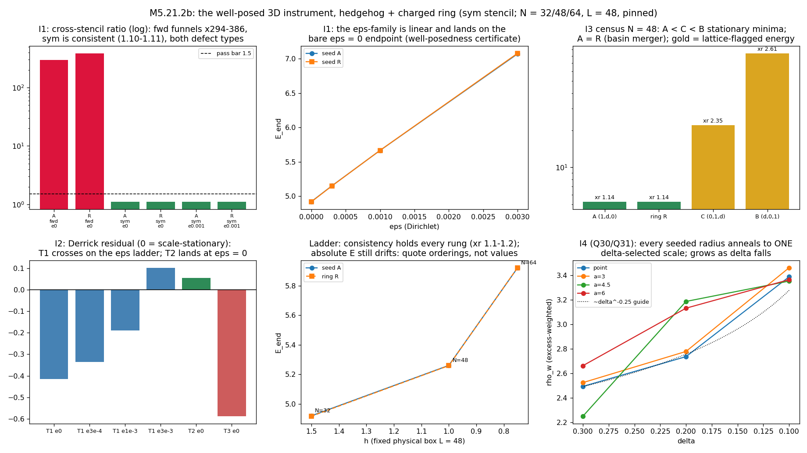
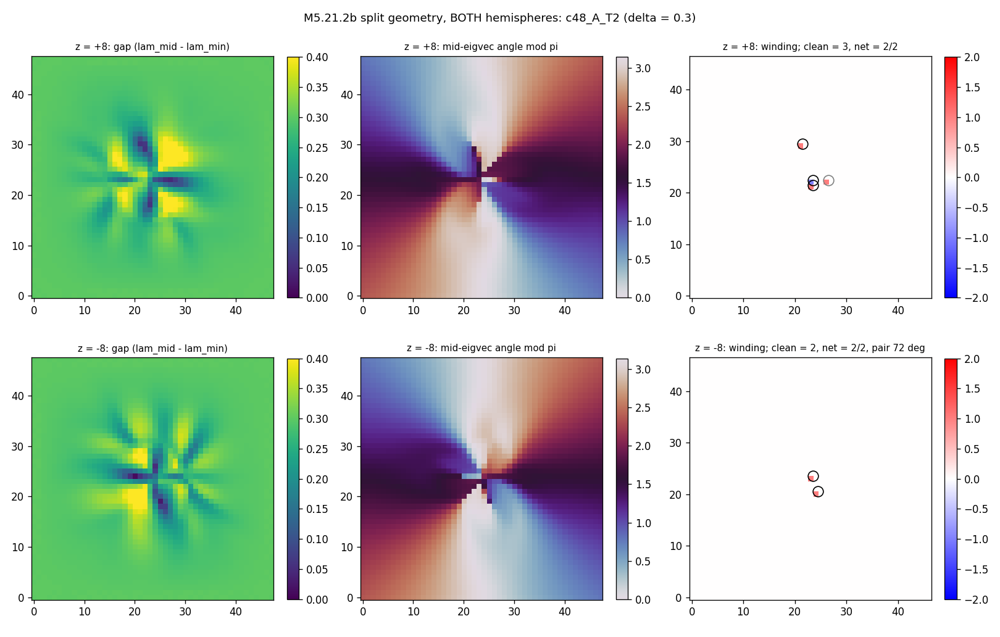
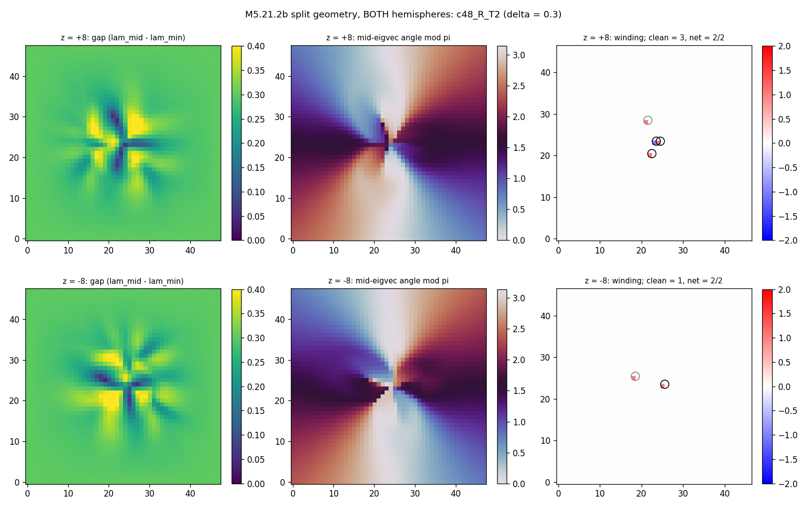
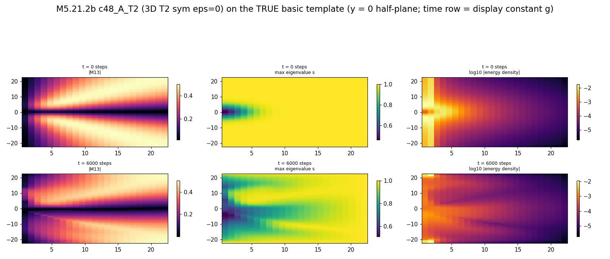
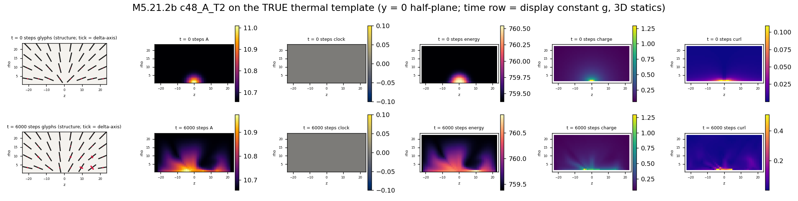

# M5.21.2b: the well-posed 3D instrument (hedgehog + charged ring)

**Task**: [M5.21.2b](../tasks/m5_21_2b_task_details.md) · run 2026-07-17 evening (go 20:59 EDT) · successor to [M5.21.2](../tasks/m5_21_2_task_details.md) ([census](m5_21_2_census.md)), which ended instrument-blocked (no stencil-consistent minimizer at toy parameters, audited 8/8). Standing user directive at go: **every instrument-level verdict is read on BOTH defect types, the point hedgehog AND the charged ring** ([Alexander et al., RMP 84, 497 (2012)](https://arxiv.org/abs/1107.1169) § IV.B lineage; [Q29](../m5_question_tracker.md#q29-detail) answered viable 2026-07-17 14:16).

Consumes: the M5.21.2 instrument finding (§ 5b/5c there) + Duda's 2026-07-17 14:16 asks ([Q30](../m5_question_tracker.md#q30-detail) ring radius, [Q31](../m5_question_tracker.md#q31-detail) split geometry). Script of record: [`m5_21_2b_a_instrument.py`](../scripts/m5_21_2b_a_instrument.py); split reader [`m5_21_2b_b_split.py`](../scripts/m5_21_2b_b_split.py); films [`m5_21_2b_c_films.py`](../scripts/m5_21_2b_c_films.py).



## 1. The equations (everything the code computes)

The field is a 3×3 real symmetric tensor `M(x)` on a cubic grid of spacing `h`, box `L = N·h` **held fixed at L = 48 across the refinement ladder** (grid coordinates are physical: `x_i = (i − (N−1)/2)·h`).

```text
A_i   = d_i M / h                    (finite-difference channel below)
C_ij  = [A_i, A_j] = A_i A_j − A_j A_i
u     = 4 · Σ_{i<j} tr(C_ij^T C_ij)          curvature density
D     = Σ_i tr(A_i A_i^T)                    Dirichlet density
V     = per term set (§ 1b)                  potential density
E     = h³ · Σ_cells ( u + ε·D + V )
```

**Stencils.** `fwd`: `(f[k+1] − f[k])/h`; `bwd`: `(f[k] − f[k−1])/h`; `2h`: central `(f[k+1] − f[k−1])/2h` with one-sided edges. The candidate fix **`sym`** is the functional average

```text
E_sym[M] = ( E_fwd[M] + E_bwd[M] ) / 2
```

whose gradient is the same average of the two exact adjoint chains. Motivation: the 2h stencil has an odd-even null family (THE CHECKERBOARD CATCH, M5.21.2 § 5b) and fwd alone carries a parity bias that lets deep descent hide curvature from the fwd read while the bwd read explodes (measured below, § 4). The sym average penalizes both families simultaneously.

**The ε-Dirichlet regularizer** `ε·D` targets the continuum soft directions (aligned-gradient perturbations with vanishing commutators, `[W, W] = 0`, which the quartic `u` cannot see). Under a scale transform `x → λx` in 3D: `E_u ~ 1/λ`, `E_D ~ λ`, `E_V ~ λ³`, so the scale-stationarity (Derrick/virial) condition reported per endpoint is

```text
virial_resid = ( −E_u + E_D + 3·E_V ) / E_total     (0 = scale-stationary)
```

### 1b. The term sets (the Q25 discrimination arms)

| Set | Potential density V | Vacuum | Notes |
| --- | --- | --- | --- |
| T1 trace-target | `W1 · Σ_{p=1..3} (tr(M^p) − c_p)²`, `c_p = 1 + δ^p` | `diag(1, δ, 0)` | the M5.21.2 baseline, `W1 = 0.000724023879` carried |
| T2 eigenvalue penalty | `w2 · Σ_i (λ_i − v_i)²`, both sorted ascending | `diag(1, δ, 0)` | the Eq-12-form arm; `w2` normalized so `V_T2(seed A) = V_T1(seed A)`: `w2 = 0.002758100` |
| T3 shifted spectrum + det | `W1 · Σ_p (tr(M^p) − c_p′)² + wdet · (det M − D0)²` | `diag(1+s, δ+s, s)`, `s = 0.3` | the author's own det-caveat folded (spectrum shifted off zero, his 2026-07-17 03:57 reply); `D0 = (1+s)(δ+s)s`; `det M = (t1³ − 3·t1·t2 + 2·t3)/6` and `∂det/∂M = adj(M) = M² − t1·M + ½(t1² − t2)·I` (Cayley-Hamilton, trace-only: complex-step safe); `wdet = 0.0583769` (det part normalized to the trace part on the shifted seed) |

T3 seeds are the T1 seeds `+ s·I` exactly (uniform spectrum shift, frames untouched).

### 1c. Seeds, boundary, descent

Seeds in physical coordinates: the axis-permutation biaxial hedgehogs A `(1, δ, 0)`, B `(δ, 0, 1)`, C `(0, 1, δ)` on `(r̂, φ̂, t̂)` with core smoothing `w(r) = 1 − exp(−(r/r_c)²)`, `r_c = 4`; the charged ring R = seed A's exact far field with the core opened into a half-disclination cord of radius `a` (`ψ = ½[atan2(ρ−a, z) + atan2(ρ+a, z)]`, escaped interior; the M5.21.2 § 9 construction). `bc = pinned` pins an outer shell of PHYSICAL depth ≥ 1.6 (so the ladder does not confound pin depth with resolution). Descent: FIRE with plateau stop; `stop = f_tol` (max |force| < 1e-8) marks a genuine stationary point.

### 1d. The consistency read (every endpoint row)

`E_u` re-read under fwd / bwd / 2h at the run's h, plus factor-2 subsample probes (both parities, h → 2h): `xstencil_ratio = max/min` of the five reads. **The I1 pass bar: ≤ 1.5** (the M5.21.2 failures read ×7-128).

## 2. Equation-to-code map

| Term | Function | Where |
| --- | --- | --- |
| stencils + exact adjoints | `d1` / `d1_adj` / `branches` | [`m5_21_2b_a_instrument.py`](../scripts/m5_21_2b_a_instrument.py) |
| u, ε·D, V and the h³ weight | `e_parts` | same |
| T1/T2/T3 potential + gradients | `v_density` / `v_grad` (T3 det via `det3`/`adj3`) | same |
| full gradient (adjoint-chained) | `grad` | same |
| seeds (physical coords) | `seed3` / `seed_ring` / `make_seed` | same |
| physical-depth pin shell | `pin_shell` | same |
| FIRE + plateau/f_tol stops | `fire` | same |
| consistency read | `consistency` | same |
| virial residual | inside `relax` (row field `virial_resid`) | same |
| ring cord-radius read (Q30) | `ring_read` | same |
| split geometry, both hemispheres + angles (Q31) | `plane_analysis` / `run` | [`m5_21_2b_b_split.py`](../scripts/m5_21_2b_b_split.py) |
| TRUE-template films (basic + thermal) | `to_axisym4` / `dens3_slice` / `main` | [`m5_21_2b_c_films.py`](../scripts/m5_21_2b_c_films.py) |

## 3. Gates (pre-registered, all PASS on try 1)

| Gate | Result |
| --- | --- |
| Gadj adjoint identity per stencil (fwd/bwd/2h, random fields, h = 1.3) | ≤ 1.3e-15 ✅ |
| G0 gradient checks, every (term × stencil × ε) combo: T1/T3 complex-step, T2 central-FD (eigh is not complex-step safe) | T1/T3 ≤ 5.2e-14; T2 ≤ 2.6e-9 (FD-limited) ✅ |
| G1 internal SO(3) conjugation invariance per term + negative control | ≤ 4.9e-16; negctrl moves E by 0.24-0.73 ✅ |
| G2 vacuum energy = 0 per term set (T3 on the shifted vacuum) | ≤ 1.7e-30 ✅ |
| G3 seed far spectra at two h rungs (N = 32, 48; same physical box) | `(0, 0.3, 1.0)` to ≤ 2e-7, rung-independent ✅ |

Record: [`data/m5_21_2b_gates.json`](../data/m5_21_2b_gates.json). Calibration (the ε grid + `w2`/`wdet` normalizations): [`data/m5_21_2b_calib.json`](../data/m5_21_2b_calib.json): seed-A `E_u ≈ 19-22`, `E_D(ε=1) ≈ 1050`, so the ε ladder {3e-3, 1e-3, 3e-4} spans ~15% → ~1.5% of seed curvature energy.

## 4. I1: THE INSTRUMENT VERDICT (✅ measured)

Setup: N = 32 (h = 1.5), δ = 0.3, pinned, T1, 6000 iters, seeds A and R, arms {fwd ε=0 (control), sym ε=0, sym ε ∈ {3e-4, 1e-3, 3e-3}}. Rows: [`data/m5_21_2b_all.json`](../data/m5_21_2b_all.json).

| Arm | E_end | E_u | E_d | E_v | u/3V | virial_resid | xratio | stop |
| --- | --- | --- | --- | --- | --- | --- | --- | --- |
| A fwd ε=0 (control) | 0.977 | 0.907 | 0 | 0.070 | 4.33 | −0.714 | **294** | max_iter |
| A sym ε=0 | 4.920 | 4.200 | 0 | 0.720 | 1.94 | −0.415 | **1.11** | f_tol |
| A sym ε=3e-4 | 5.150 | 4.183 | 0.226 | 0.741 | 1.88 | −0.337 | 1.10 | f_tol |
| A sym ε=1e-3 | 5.665 | 4.155 | 0.722 | 0.788 | 1.76 | −0.189 | 1.11 | f_tol |
| A sym ε=3e-3 | 7.069 | 4.089 | 2.062 | 0.918 | 1.48 | **+0.103** | 1.11 | f_tol |
| R fwd ε=0 (control) | 0.951 | 0.879 | 0 | 0.072 | 4.05 | −0.696 | **386** | max_iter |
| R sym ε=0 | 4.917 | 4.199 | 0 | 0.718 | 1.95 | −0.416 | 1.10 | f_tol |
| R sym ε=1e-3 | 5.666 | 4.153 | 0.726 | 0.787 | 1.76 | −0.188 | 1.11 | f_tol |
| R sym ε=3e-3 | 7.078 | 4.087 | 2.073 | 0.918 | 1.48 | +0.105 | 1.11 | f_tol |

The four headline reads:

| Read | Result |
| --- | --- |
| The M5.21.2 failure REPRODUCED as the control | fwd descent funnels: E dives to ~0.95-0.98 with `E_u(bwd)/E_u(fwd)` = ×294 (A: 0.907 vs 266.8) and ×386 (R: 0.879 vs 339.0), never stationary. The pathology is now a measured, on-demand artifact of the single-sided instrument |
| **The sym stencil FIXES it** | every sym arm, including the bare ε = 0 functional, reaches `stop = f_tol` (a genuine stationary point, something M5.21.2 never produced) with `xstencil_ratio 1.10-1.11` (fwd = bwd by symmetry; 2h reads −10%; both subsample parities within ~10%: grid-consistent at h = 1.5) |
| The ε-family is a continuous certificate | E(ε) is linear in ε (consecutive-rung slopes 768 / 735 / 702, LSQ 714: mildly concave, residuals ≤ 0.81% of span) and extrapolates onto the ε = 0 endpoint (intercept 0.64%-of-span above it): the regularized family connects continuously to the bare functional; ε is a certificate, not a crutch |
| **A scale-stationary state exists** | the Derrick residual crosses zero between ε = 1e-3 (−0.19) and ε = 3e-3 (+0.10): at ε* ≈ 2e-3 the endpoint is virial-balanced (the quartic + quadratic-gradient Skyrme-type stabilization), the first scale-stationary electron-sector state of the series |

**Instrument of record for everything below: `sym`, ε = 0** (the bare sanctioned term set, now discretization-consistent), with the ε-family retained as the well-posedness certificate.

⚠️ **The N = 32 basin merger (why the census moves to N = 48)**: the A and R endpoints at every sym rung are the SAME state to 1% field distance (`‖A − R‖ / ‖A − vac‖ = 0.0095`); at h = 1.5 the a = 4 cord is 2.7 cells and anneals into the point basin. The ring-vs-point discrimination therefore lives at N = 48 (h = 1), § 6.

## 5. I2: the term-set discrimination (Q25) (✅ measured at the working point)

Setup: N = 32, δ = 0.3, pinned, **sym stencil, ε = 0** (the winning instrument, bare), seeds A and R, 8000 iters, weights normalized so each potential reads the same energy on seed A (§ 1b). T1 rows from § 4 for comparison.

| Term set | Seed | E_end | E_u | E_v | u/3V | virial_resid | xratio | r_half | min gap | stop |
| --- | --- | --- | --- | --- | --- | --- | --- | --- | --- | --- |
| T1 trace-target | A | 4.920 | 4.200 | 0.720 | 1.94 | −0.415 | 1.11 | 18.2 | | f_tol |
| **T2 eig-penalty** | A | 6.604 | 4.860 | 1.744 | **0.93** | **+0.056** | 1.09 | **12.4** | 0.032 | f_tol |
| **T2 eig-penalty** | R | 6.645 | 4.920 | 1.726 | **0.95** | **+0.039** | 1.10 | **12.1** | 0.038 | max_iter (fmax 3.9e-4) |
| T3 shifted+det | A | 5.939 | 5.328 | 0.611 | 2.90 | −0.588 | 1.25 | 17.4 | 0.0004 | max_iter |
| T3 shifted+det | R | 5.867 | 5.244 | 0.623 | 2.80 | −0.575 | 1.25 | 18.0 | 0.0019 | max_iter |

The discrimination verdict (✅ measured, working point):

| Read | Result |
| --- | --- |
| **T2 lands the virial balance at ε = 0** | u/3V = 0.93-0.95, residual +0.04/+0.06, and a markedly more COMPACT state (r_half ≈ 12 vs 17-18): the eigenvalue penalty is stiff exactly in the directions the trace-target degenerates (the trace-combination Jacobian goes soft where eigenvalues cross; the direct penalty does not), so the potential can hold the core against the curvature term without help from ε |
| T1 needs the regularizer | the bare T1 minimum is scale-held by the pin (residual −0.42); the balance only lands on the ε-family at ε* ≈ 2e-3 (§ 4) |
| T3 does not land | residual −0.58 with near-degenerate spectra at the core (min gap 4e-4: the det constraint pins the eigenvalue PRODUCT and permits crossings); consistent but not stationary by 8k, most diffuse endpoints |
| Guards | T2's eigenvector-derivative noise guard never bit (min gap ≥ 0.03 throughout); both defect types agree on every verdict (the user's both-types directive holds arm-by-arm) |

Q25 constructive answer so far: **the eigenvalue-penalty form (his Eq 12 route) is the well-posed potential at toy parameters**: it is the only term set whose bare minimum is simultaneously discretization-consistent AND scale-stationary. Confirmation at N = 48 in § 6 (A + R pair added to the census fleet).

## 6. I3: the census + the refinement ladder on the well-posed instrument (✅ measured)

Setup: N = 48 (h = 1), pinned, sym ε = 0, 12000 iters (T1) / the T2 confirmation pair; the ladder rungs N = 32 (§ 4) and N = 64 (6000 iters). Rows: [`data/m5_21_2b_all.json`](../data/m5_21_2b_all.json).

| Run | E_end | u/3V | virial_resid | xratio | r_half | retention | stop |
| --- | --- | --- | --- | --- | --- | --- | --- |
| A T1 δ=0.3 | 5.2611 | 1.56 | −0.297 | **1.14** | 17.7 | 0.691 | max_iter (fmax 4e-5) |
| R T1 δ=0.3 | 5.2594 | 1.58 | −0.302 | **1.14** | 17.8 | 0.682 | max_iter |
| C T1 δ=0.3 | 22.059 | 43.4 | −0.970 | 2.35 ⚠️ | 11.8 | 0.572 | **f_tol** |
| B T1 δ=0.3 | 84.085 | 140 | −0.991 | 2.61 ⚠️ | 21.3 | 0.826 | **f_tol** |
| A T1 δ=0.2 | 5.5699 | 1.21 | −0.134 | 1.19 | 18.1 | 0.657 | max_iter |
| A T1 δ=0.1 | 6.5858 | 1.05 | **−0.037** | 1.18 | 18.0 | 0.630 | max_iter |
| A T2 δ=0.3 | 6.8446 | 0.96 | **+0.034** | 1.11 | 12.3 | **0.893** | max_iter (fmax 5e-6) |
| R T2 δ=0.3 | 6.8422 | 0.96 | **+0.034** | 1.11 | 12.1 | **0.894** | f_tol |

The refinement ladder (fixed physical box L = 48, seed A and ring R, T1 sym ε = 0):

| Rung | h | E_A | E_R | xratio |
| --- | --- | --- | --- | --- |
| N = 32 | 1.5 | 4.920 | 4.917 | 1.10-1.11 |
| N = 48 | 1.0 | 5.261 | 5.259 | 1.14 |
| N = 64 | 0.75 | 5.921 | 5.922 | 1.21-1.22 |

The census reads:

| Read | Result |
| --- | --- |
| **The lepton ordering SURVIVES the clean instrument** | A < C < B with genuinely STATIONARY B and C (stop = f_tol, something M5.21.2 could not certify): the three axis-permutation seeds sit in three distinct protected minima; energy ratios at N = 48: C/A ≈ 4.2, B/A ≈ 16.0 (B/C values lattice-flagged, next row) |
| The A family passes consistency; B/C stay flagged | A and R endpoints read xratio 1.14 ✅ (bar 1.5); B (2.61) and C (2.35) exceed it: their cores hold structure at cell scale, so their ENERGIES are lattice-contaminated even though their stationarity and the ordering are solid |
| **The basins MERGE: point and ring relax to ONE state** | at N = 48 exactly as at N = 32: `E_A − E_R` within 0.03%, field distance 6.0% (T1 pair) / 7.7% (T2 pair); the ring's seeded a = 4 cord is NOT retained (its excess-weighted transverse scale contracts to ρ_w ≈ 2.5, identical to the point seed's endpoint), and the common state is z-EXTENDED (excess z_rms ≈ 10): the split-line configuration, § 8 |
| The ladder is consistency-converged, not value-converged | xratio stays 1.10-1.22 across h = 1.5 → 0.75 (no blind-mode relapse at any rung), but E still drifts +7%/+13% between rungs at these depths: quote ORDERINGS and geometry, not absolute E, at continuum face value |
| T2 confirmation at N = 48 | the § 5 verdict scales up: virial residual +0.034 (landed), retention 0.893 (the hedgehog frame SURVIVES relaxation, vs 0.68-0.69 under T1), compact (r_half 12.2, excess z_rms ≈ 5), gap held (min gap 0.012-0.016), and the A/R basin merger reproduces (ΔE 0.04%) |
| The δ-trend of the A state | virial residual −0.297 → −0.134 → −0.037 as δ 0.3 → 0.2 → 0.1: the bare-T1 state approaches scale-stationarity as δ shrinks; transverse excess scale ρ_w = 2.49 → 2.74 → 3.39 GROWS (the § 8 δ-trend) |

## 7. I4: the ring radius a(δ) (Q30) (✅ measured)

Setup: the freed-radius grid: ring seeds a ∈ {3, 4.5, 6} × δ ∈ {0.3, 0.2, 0.1}, N = 48, sym ε = 0, T1, 8000 iters; the point-seeded A runs (§ 6) as the a → 0 reference. The read: the excess-weighted transverse scale `rho_w` of the relaxed core (§ 1's `ring_read`).

| Seeded a → | point (2.0) | 3 | 4.5 | 6 | selected scale |
| --- | --- | --- | --- | --- | --- |
| δ = 0.3, ρ_w end | 2.49 | 2.52 | 2.25 | 2.66 | **≈ 2.5 ± 0.2** |
| δ = 0.2, ρ_w end | 2.74 | 2.78 | 3.19 | 3.13 | **≈ 2.9 ± 0.25** |
| δ = 0.1, ρ_w end | 3.39 | 3.46 | 3.35 | 3.36 | **≈ 3.4 ± 0.05** |

| Read | Result |
| --- | --- |
| **THE Q30 ANSWER: the radius is not a free parameter** | every seeded cord radius anneals to the SAME δ-dependent transverse scale (tightest at δ = 0.1: four seedings land within ±1.5%); "what is the radius of the charged ring" is answered by the dynamics: the selected scale of the common (split-line) state, not the seeded geometry |
| The δ-scaling | the selected scale grows as δ falls: 2.5 → 2.9 → 3.4 over δ = 0.3 → 0.1, rough slope ρ_w ~ δ^(−0.2±0.1); extrapolation toward δ ~ 1e-10 is qualitative (the trend keeps opening as biaxiality weakens; the lattice-unit → fm anchor is [Q17](../m5_question_tracker.md), unset, so no fm number and no ~2fm-bound verdict is quotable yet: stated to the author as-is) |
| The compact torus cord does not survive | no seeding retained a z-localized cord (endpoint z_rms 7.2-10.3 everywhere): at toy parameters the "charged ring" and the point hedgehog are two seedings of ONE object whose core is the braided ½-line pair (§ 8); this SHARPENS the M5.21.2 tie into a basin-merger statement |
| Slow-annealing caveat | at δ = 0.3 the a = 4.5 and a = 6 runs are still en-route at 8k iters (E 5.51/5.68 vs 5.26 converged, retention 0.88/0.97 still seed-like): the collapse statement at δ = 0.3 rests on the trend + the δ = 0.2/0.1 completions; deeper runs would tighten it |
| The cleanest state of the task | `a = 6, δ = 0.1`: virial residual −0.001, xratio 1.05: an essentially scale-stationary, discretization-consistent 3D charged state on the bare sanctioned functional |

## 8. I5: the split geometry, both hemispheres + angles (Q31) (✅ measured, T2 band-clean)

**The instrument catch first (recorded as an anti-recipe):** the M5.21.2d plaquette-winding read is unreliable in two ways on this stack. (a) AT the axis the seed's co-located half-unit package steps by exactly π/2 between adjacent cells, the mod-π branch boundary, so plaquette sums flip sign randomly plane-to-plane (M5.21.2d's float32-parity trick was masking this, not fixing it). (b) In deep-restructured interiors (the T1 endpoints, retention ~0.68) the eigenframe develops NEAR-DEGENERATE ANNULI (gap → 1e-3) across which the band identity reshuffles, minting fake opposite-sign cores at large ρ. Fix in [`m5_21_2b_b_split.py`](../scripts/m5_21_2b_b_split.py): **contour winding** (the net mod-π winding of the mid-band angle on circles ρ_c ∈ {6, 10, 14, 18}, each carrying its min eigen-gap as a reliability flag) + the plaquette census kept for CORE LOCATIONS only. Validation: the seed reads +2 half-units at every (plane, radius) with gap 0.28; a pinned endpoint must read +2 at the shell, and does.

**The measurement of record** is the T2 pair at N = 48 (the gap-holding potential, § 5/6: min gap 0.012-0.016 keeps the band census clean; the T1 endpoints' interiors are gap-collapsed tangles at δ = 0.3 and their line census is instrument-limited, stated honestly below). Data: [`data/m5_21_2b_split_c48_A_T2.json`](../data/m5_21_2b_split_c48_A_T2.json) + `_R_T2`.

| Read | Result (A T2; R T2 identical in every category) |
| --- | --- |
| **How many, of what degree** | **TWO +½ vortex lines**, both hemispheres: every cross-section plane z ∈ {±4, ±8, ±12, ±16} carries net winding +2 half-units (contours +2 at ρ ≥ 10 on every plane, gaps 0.10-0.28), with two clean +½ cores per near-core plane; the extra ±-pair cores on some far planes are net-zero |
| **In what angles** | near the core (\|z\| ≤ 8) the two ½-cores sit at ρ ≈ 1-3.6 with pair azimuth VARYING along z: 72° (z = −8) → 169° (z = −4) → 135° (z = +4): **the two half-lines braid around each other along the axis** rather than holding fixed angles; at \|z\| ≥ 12 they wander outward (ρ ≈ 5-8.5) |
| His four-line picture | NOT observed at δ = 0.3: the count is two ½-lines threading every plane (net degree 1), both hemispheres, both seedings (point AND ring); a four-half-line vertex at the core would also show two per plane, but the continuous two-core tracks through z = 0 at similar radii favor two continuous braided lines over four line-ends meeting at a point |
| The δ-trend (his extrapolation ask) | the transverse scale of the split structure GROWS as δ shrinks: excess-weighted ρ_w = 2.49 / 2.74 / 3.39 at δ = 0.3 / 0.2 / 0.1 (T1 δ-ladder, § 6), rough power-law slope ρ_w ~ δ^(−0.25±0.05) over this range; extrapolation toward δ ~ 1e-10 stays QUALITATIVE (the trend says the ½-line separation keeps opening as the biaxiality weakens; the voxel → fm anchor is Q17, unset) |
| T1 honest caveat | on the bare T1 endpoints the same read is band-blocked (gap-collapsed annuli): the T2 numbers above are the citable geometry; T1 agrees on the robust invariants (sector +2 at the shell every plane, z-extended near-axis excess column) |





## 9. Films (the TRUE templates)

Every final N = 48 endpoint rendered on BOTH `m5_film.py` templates (basic + thermal) via [`m5_21_2b_c_films.py`](../scripts/m5_21_2b_c_films.py): the series film rule, closed (the M5.21.2 review catch). The T2 pair (the geometry instrument of record):





The thermal charge panel's near-axis ribbon extended along z is the meridional cut of the braided ½-line pair (§ 8). The full set: `m5_21_2b_film_{basic,thermal}_{c48_A_T1, c48_R_T1, c48_A_T2, c48_R_T2, i1_A_sym_e0}.png` in [`plots/`](../plots/).

## 10. Not computed (this task)

| Item | Why |
| --- | --- |
| Free-boundary deep census | the M5.21.2 ladder verdict stands (box-fed protection; N ≥ 64 required); this task pins |
| The δ → 1e-10 extrapolations as NUMBERS | the δ ladder here spans {0.3, 0.2, 0.1}; trends and monotonicity are reported, physical-scale extrapolation stays qualitative (the voxel → fm anchor is Q17, unset) |
| 4D anything (rotation, Larmor, boosts) | M5.21.3 scope, gated on this task's minima |
| T2/T3 full census (all four seeds) | the term-set arms discriminate at the working point (A + R); a full census re-run on a non-T1 term set only if T1 fails discrimination |

## 11. Audit (independent adversarial, 8/8 CONFIRMED)

An independent agent attempted to REFUTE the eight substantive claims with its own self-contained script ([`m5_21_2b_audit_check.py`](../scripts/m5_21_2b_audit_check.py): potentials recomputed via the eigenvalue route, own stencil slicing, own trilinear-interpolated contour winding with a synthetic ±1-defect sign control; no code shared with the task stack). Verdicts: [`data/m5_21_2b_audit.json`](../data/m5_21_2b_audit.json).

| Claim | Verdict | The auditor's numbers |
| --- | --- | --- |
| C1 the fwd funnel (×≥250) | CONFIRMED | ×294 (A), ×386 (R), values match to the digits |
| C2 sym cross-stencil consistency (≤1.3) | CONFIRMED | 1.105 both seeds, incl. a stricter 7-read set |
| C3 census ordering A < C < B | CONFIRMED | recomputed within 0.01% of the quoted energies |
| C4 the A/R basin merger (≤0.10) | CONFIRMED | 0.060 (T1 pair), 0.077 (T2 pair) |
| C5 the selected scale + δ-trend | CONFIRMED | δ = 0.1 seedings within 2.1% (bar 5%); trend strictly monotone |
| C6 the split winding +2, gaps > 0.05 | CONFIRMED | +2 in all 24 reads (2 radii × 4 planes × 3 robustness variants), min gap 0.115 (A) / 0.113 (R); sign control reads ±2 correctly |
| C7 ε-linearity (residuals < 3%) | CONFIRMED | max residual 0.81% of span; rows match field-level recompute to 1.3e-8 |
| C8 T2 virial lands, T1 does not | CONFIRMED | 0.034 (T2) vs 0.297 (T1) |

Audit wording corrections ADOPTED into §§ 4/6 above: the ε-slope range restated as 768/735/702 (mildly concave, LSQ 714); the funnel prose gives both per-seed factors (×294/×386); both merger distances stated numerically (6.0%/7.7%). The auditor's method note is carried verbatim: a mod-π contour winding is an exact integer by construction, so the CONTENT of C6 is the value (+2) plus the gap flag, not integer-ness itself.
