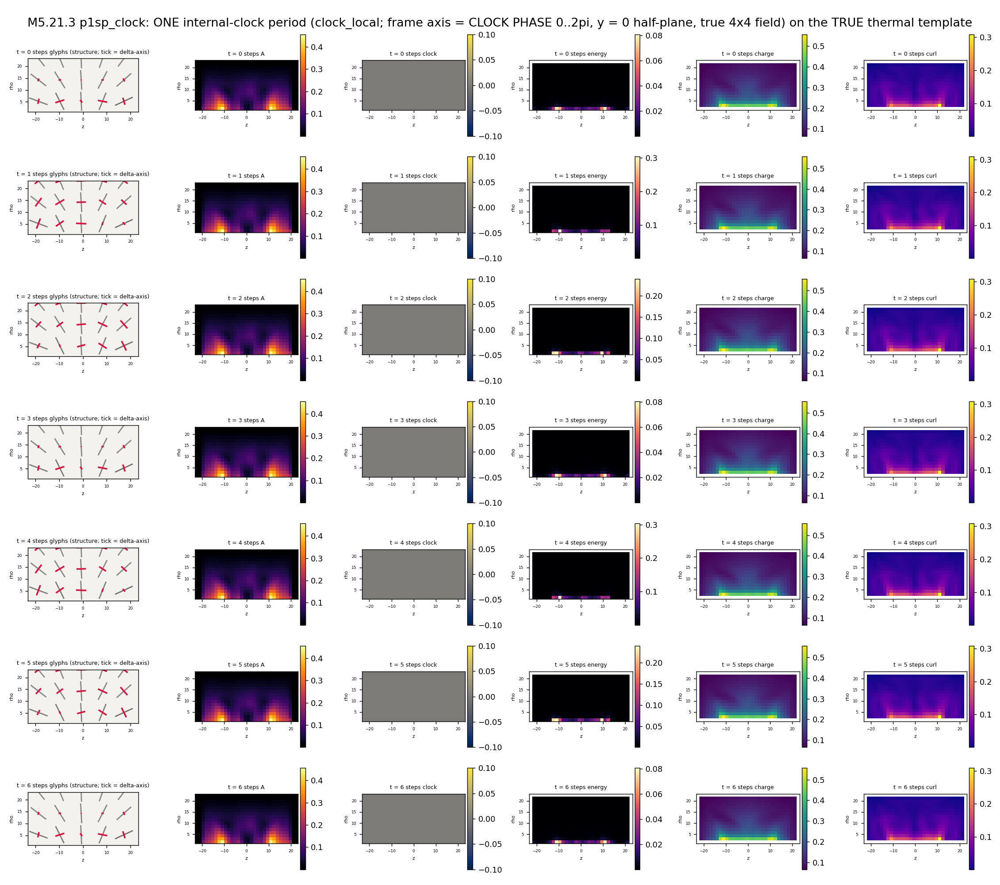

# M5.21.3: the 4D lift: does energy minimization select nonzero time derivatives?

**Task**: [`tasks/m5_21_3_task_details.md`](../tasks/m5_21_3_task_details.md) · run 2026-07-18 (go 13:54 EDT) · author prescription 2026-07-18 03:22: "use 3x3 field electron as starting point of 4x4 energy minimization, including field time derivatives (should be nonzero from minimization), to try to get its stable dynamical configuration" ([`tasks/m5_21_convo.md § 2026-07-18 03:22`](../tasks/m5_21_convo.md)).

🚧 RESULTS SECTIONS FILLED AT CLOSE (this header + § 1-2 written at PLAN; nothing below § 2 is a claim until its measurement lands).

## 1. Equations first (the exact functional the code computes)

The field is a symmetric 4×4 matrix M(x) on an N³ cubic grid, spacing h, physical box L = N·h = 48 fixed; η = diag(−1, 1, 1, 1). Vacuum (branch s = ±1): M_vac = diag(−sg, 1, δ, 0), sg = s·g, g = 8, δ = 0.3; the η-spectrum of M_vac is (sg, 1, δ, 0).

Spatial derivatives use the M5.21.2b stencil-symmetrized instrument: every energy is the average of the fwd and bwd one-sided builds (exact adjoints each), the well-posedness fix measured there.

```text
A_i    = d_i M / h                        (i = x, y, z; fwd/bwd averaged)
F_ij   = A_i eta A_j  -  A_j eta A_i      (the eta commutator, M5.20.2 convention)
<F,G>  = tr(eta F eta G^T)                (the eta inner product; sign-indefinite)

E_stat = h^3 SUM_cells [ 4 SUM_{i<j} <F_ij, F_ij>
                         + W1 SUM_{p=1..4} (tr((M eta)^p) - C_p)^2 ]
C_p    = sg^p + 1 + delta^p               (the audited trace-target V4)
W1     = 0.000724023879                   (the M5.21.2/2b WSCALE, carried)
```

The TIME sector (the task's new piece), in the velocity-field reading of his prescription: a clock direction field a0(x) (generator G, envelope w(r) = exp(−(r/10)⁴), unit Frobenius normalization) defines dM/dt = ω·a0, and the same η-metric energy acquires

```text
E_kin(omega) = omega^2 * kin(M; a0)
kin          = 4 h^3 SUM_i <comm_eta(a0, A_i), comm_eta(a0, A_i)>
```

exactly quadratic in ω (F_0i ∝ ω; no linear term exists). Because <,>_η is indefinite, kin can be NEGATIVE: that is the signature channel that would make minimization select ω ≠ 0.

**Velocity convention (audit-flagged, stated explicitly)**: the instrument's a0 = w·(GM − MG^T) is ANTISYMMETRIC for symmetric M (it is a probe direction, not a motion of the symmetric field); the physical velocity of the conjugation orbit M → ΛMΛ^T is the SYMMETRIC tangent a0_conj = w·(GM + MG^T). Both are measured (§ 5): the sign structure is identical, magnitudes differ, and the conjugation-tangent values are the physically quotable ones. The axial-twist channel replaces A_z → A_z + k·a0 and reads E(k) = e0 + b·k + d·k², whose linear term b permits spontaneous twist selection k* = −b/2d.

Generator catalog (each per branch): clock_local (rotation about the local leading spatial eigenvector, his ZBW clock), plane_1d (about the lowest eigenvector: rotates the (1, δ) eigenplane), rot_z, rot_x (global spatial), boost_z, boost_x (global time-space, η-antisymmetric). The static saddle question is probed independently: central-difference curvatures of E_stat along unit-norm localized directions with ONLY time-mixing (M_0i) entries, plus block-diagonal control directions.

**Pre-registered verdict rules** (checkpoint, written before any P2 number): kin < 0 somewhere → run the ω-ladder with profile re-relaxation; E*(ω) turning up at finite ω* = (a) the stable dynamical configuration; monotone descent through the dive floor = (b) the signature dive survives well-posedness; kin ≥ 0 everywhere and no negative curvatures = (c) static wins at toy parameters. |b| above fit noise = spontaneous axial twist as a static statement.

## 2. Equation-to-code map

| Equation piece | Code |
| --- | --- |
| sym stencil d_i + exact adjoints | [`m5_21_3_a_4d.py`](https://github.com/openwave-labs/openwave/blob/main/openwave/xperiments/m5_liquid_crystal/research/scripts/m5_21_3_a_4d.py) `d1` / `d1_adj` / `branches` (copied verbatim from the 2b instrument) |
| η commutator + inner product | same file, `comm_eta` / `inner_eta` |
| E_stat (u_η + V4 trace-target) | `e_parts` / `e_total` |
| exact gradient (complex-step gated 1.5e-15) | `grad` |
| kin(M; a0) + its frozen-a0 gradient (gated 1.2e-15) | `kin_of` / `kin_grad` |
| generator catalog + envelope | `gen_catalog` / `envelope` |
| twist channel E(k) parabola | `twist_read` |
| time-mixing curvature probe | `hess` |
| FIRE (ω-augmented) + dive detector | `fire` |
| phases | `gates` / `p1` / `p2` / `p3` |
| films (period-phase or descent axis) | [`m5_21_3_c_films.py`](https://github.com/openwave-labs/openwave/blob/main/openwave/xperiments/m5_liquid_crystal/research/scripts/m5_21_3_c_films.py) |

Seed: the M5.21.2b converged 3D electron (A, T2, n = 32, sym ε = 0; `data/m5_21_2b_end_i2_A_T2.npz`), embedded block-diagonally with M_00 = −sg. Design note (logged, not hidden): the 4D potential is the audited trace-target (complex-step safe end-to-end, production continuity, SO(1,3)-invariant); the 2b lesson that the spatial Eq-12 eigenvalue form is the well-posed 3D choice is carried as a caveat, and its Lorentz-invariant 4D lift (elementary-symmetric-polynomial penalty on the η-spectrum) is a documented follow-up arm, not run here.

## 3. Gates (P0) ✅

| Gate | Result | Bar |
| --- | --- | --- |
| G0 complex-step, static functional | 1.5e-15 | < 5e-9 |
| G0k complex-step, kinetic gradient | 1.2e-15 | < 5e-9 |
| G1 SO(1,3) conjugation invariance | 3.0e-13 (negative control 1.8e5) | < 1e-9 / > 1e-6 |
| G2 vacuum energy, both branches | exactly 0.0 | < 1e-16 |
| G3 3D regression (block-diag u_η ≡ 2b spatial u) | exactly 0.0 | < 1e-12 |

## 4. P1: the static 4D lift ✅ (and the saddle, measured clean)

The 2b 3D electron embedded block-diagonally (M_00 = −sg) and relaxed statically, both branches, N = 32, 6000 FIRE iterations:

| Branch | E_end | E_u | E_V | offblock_max | stop |
| --- | --- | --- | --- | --- | --- |
| s = +1 | 6.2397 | 4.8329 | 1.4067 | exactly 0.0 | max_iter (fmax 6.3e-3, slow grind) |
| s = −1 | 6.7961 | 4.8772 | 1.9189 | exactly 0.0 | max_iter (fmax 7.3e-3, slow grind) |

Block-diagonality is preserved exactly through 6000 iterations (the M5.21.1 invariance, reconfirmed); the endpoints are contained-not-converged at this depth (the trace-target statics grinds slowly, the same character 2b measured for the T1 form; per-branch E values are not cross-comparable, the targets C_p(s) differ). ⚠️ Probe-stage endpoints, not certified stationary states.

**THE SADDLE, on the well-posed instrument**: central-difference curvatures along 24 unit-norm localized time-mixing (M_0i) directions are NEGATIVE in every single direction, both branches (min curvature −0.276 / −0.277; the 8 block-diagonal control directions are all positive). The static 4D electron is a saddle toward the time sector. This reproduces the M5.18-era read (≈ −0.4 there) on the stencil-symmetrized stack: the precondition of the author's "field time derivatives should be nonzero from minimization" is REAL, and which way it resolves (a stable dynamical state vs the signature dive) is exactly what P2/P3 measure.

## 5. P2: the kinetic sign table ✅ (rotation is not the negative channel; boosts are)

kin(M; a0) per generator at the P1 endpoints (E_kin = ω²·kin; negative kin = minimization wants that velocity):

| Generator (velocity direction) | kin, s = +1 | kin, s = −1 |
| --- | --- | --- |
| clock_local (his ZBW clock: rotation about the local leading eigenvector) | +0.2946 | +0.2970 |
| plane_1d (rotation of the (1, δ) eigenplane) | +0.2694 | +0.2718 |
| rot_z (global spatial) | +0.2575 | +0.2600 |
| rot_x (global spatial) | +0.2718 | +0.2737 |
| **boost_z** | **−0.0834** | **−0.0832** |
| **boost_x** | **−0.0704** | **−0.0729** |

And the same table under the PHYSICAL conjugation-orbit tangent a0_conj = w·(GM + MG^T) (§ 1 convention note; `m5_21_3_f_confirm.py`):

| Generator | kin_conj, s = +1 | kin_conj, s = −1 |
| --- | --- | --- |
| clock_local | +0.1191 | +0.1205 |
| plane_1d | +0.1254 | +0.1255 |
| rot_z | +0.1205 | +0.1211 |
| rot_x | +0.1003 | +0.1009 |
| **boost_z** | **−0.0828** | **−0.0839** |
| **boost_x** | **−0.0727** | **−0.0705** |

Three reads, branch-robust and convention-robust: (i) every ROTATION velocity, including the author's clock direction, has kin > 0 under BOTH variants: an internal rotation RAISES the η-energy at quadratic order, so rotation is not selected by free minimization from the static electron (this is a statement about local selection at the static point, not a global exclusion of rotating states); (ii) the negative channel is the BOOST sector under both variants, consistent with the § 4 saddle directions (M_0i textures); (iii) the axial-twist channel shows NO spontaneous twist (the linear coefficient b sits at numerical zero, k* ≈ 0), so the long-axis twist the author forecasts does not fire at the static point through this channel at toy parameters.

## 6. P3: the ω-ladder ✅ (shallow slope, no stationary ω, no dive; the decoupling)

The most negative channel (boost_z) run as an ω-ladder with 3000 re-relaxation iterations per rung (warm-started), dive detector armed:

| ω | E*, s = +1 | kin, s = +1 | E*, s = −1 | kin, s = −1 |
| --- | --- | --- | --- | --- |
| 0 (ref) | 6.2397 | | 6.7961 | |
| 0.05 | 6.1620 | −0.0841 | 6.6661 | −0.0842 |
| 0.1 | 6.0914 | −0.0848 | 6.5512 | −0.0850 |
| 0.2 | 6.0253 | −0.0854 | 6.4476 | −0.0859 |
| 0.4 | 5.9572 | −0.0861 | 6.3476 | −0.0868 |
| 0.8 | 5.8622 | −0.0874 | 6.2250 | −0.0884 |

Every rung stops at max_iter; the dive detector NEVER fires; kin creeps only ~1% per rung (no self-amplification).

**The grind control + the decoupling**: because the P1 endpoints still grind, a static ω = 0 continuation of the same cumulative depth (15000 iterations) was run as the subtraction control: E_ctrl = 5.9186 (E_u 4.8006, E_V 1.1180). Against it, the ladder's whole ω-advantage is exactly the quadratic kinetic margin: E*(0.8) − E_ctrl = −0.0564 vs ω²·kin = −0.0559 (ratio 1.008, audit-verified 1.00835), and the static parts match the control to ~1e-3 (gaps: E_u 2.1e-4, E_V 6.8e-4). The boost velocity RIDES ON TOP of an essentially undeformed profile: the ω-term and the statics decouple at these amplitudes.

**The verdict (against the § 1 pre-registered rules)**: E*(ω) is monotone decreasing with NO stationary ω and NO dive in the probed range: on the η-reading, descent does move time-ward (every probed ω beats the equal-depth static control), but it never lands: there is no finite stationary ω, only the shallow, non-runaway, profile-decoupled boost slope (a much milder residue of the M5.20.3 signature pathology than its finite-time blowup); the rotation sector is positive. Under the Hamiltonian reading (kinetic entering positively) statics wins outright in every channel. **So free 4×4 energy minimization lands NO stable dynamical electron at toy parameters: no finite stationary ω exists on either functional reading.** The constructive residue: (i) the static state is a genuine saddle toward the time sector (§ 4), so the time sector is where the action is; (ii) fixed-J rotating states are well-defined with the measured collective inertia (conjugation-tangent kin_clock ≈ 0.119): ω* = J/(2·kin), E* = E_stat + J²/(4·kin): the isorotation construction is the surviving route to a rotating electron, with J supplied as a constraint (the spin quantum), not by descent.

## 7. Films ✅

Both TRUE templates on the s = +1 static electron carried through ONE internal-clock period of the clock_local generator (the fixed-J rotating-electron ansatz; frame axis = CLOCK PHASE 0 → 2π, labeled in the suptitle; this is the ansatz visualization, not a free-descent endpoint):





## 8. Not computed (honest list)

| Item | Why |
| --- | --- |
| Larmor precession (THE acceptance observable) | Contingent-not-reached: free minimization produced no rotating state to precess; the fixed-J isorotation state (§ 6) is where the Larmor read attaches if the constrained reading is adopted (author's call) |
| The Lorentz-invariant 4D lift of the Eq-12 eigenvalue potential (elementary-symmetric penalty on the η-spectrum) | Designed, not run: this task carries the audited trace-target for continuity; the 2b discrimination says the potential choice is load-bearing, so this arm is the named follow-up |
| N = 48 confirm of the full ladder | Time-boxed out; the n = 24 h-rung + cross-stencil re-reads (§ 9 confirm block) carry the discretization-robustness burden at this stage |
| ω > 0.8 tail, local-generator E(ω) beyond the quadratic read, spacetime-lattice (Nt > 1) descent | Out of scope for this rung; the quadratic + re-relaxed reads bound the behavior in the probed range |
| Physical-unit rates (his ~1e21 Hz) | Needs the Q17 anchors; model-unit numbers only |

## 9. Robustness confirms + audit

**The confirm block** (`data/m5_21_3_row_confirm.json`): the kin sign table is instrument-robust: (i) cross-stencil re-reads on the s = +1 endpoint agree to 5 digits between sym/fwd/bwd (clock_local +0.29463/+0.29466/+0.29460; boost_z −0.083446 on all three) and keep both signs on the coarse 2h read (+0.2635 / −0.0765, ~11% magnitude shift as expected); (ii) a FRESH n = 24 (h = 2.0) static lift relaxed from the resampled seed reproduces the full sign pattern (clock_local +0.718, plane_1d +0.672, rot_z +0.632, boost_z −0.221, boost_x −0.179; magnitudes scale with h and relax depth, the signs are the claim). The rotation-positive / boost-negative structure holds across stencils and grid spacings.

(The n = 24 endpoint is not saved; regenerate the confirm block with `python3 scripts/m5_21_3_f_confirm.py`.)

### Independent adversarial audit ✅ (6/6 numerical claims CONFIRMED; corrections adopted)

Independent agent, own re-implementation (own stencils, diagonal-form η inner product, own expm, fresh RNG seeds); script [`m5_21_3_audit_check.py`](https://github.com/openwave-labs/openwave/blob/main/openwave/xperiments/m5_liquid_crystal/research/scripts/m5_21_3_audit_check.py), record `data/m5_21_3_audit.json`.

| Claim | Verdict | Auditor's numbers |
| --- | --- | --- |
| C1 gates as recorded | ✅ CONFIRMED | rerun bit-exact; own SO(1,3) check 8.1e-16, negative control 0.505 |
| C2 the saddle | ✅ CONFIRMED | 6/6 fresh directions negative, −0.2587 to −0.2730, stable under t ∈ {5e-4, 1e-3, 2e-3}; controls +0.41 to +0.44 |
| C3 the kin table | ✅ CONFIRMED | rot_z +0.257509, boost_z −0.083446 (rel 2e-16); cross-stencil values reproduced |
| C4 the decoupling | ✅ CONFIRMED | ratio 1.00835 (deviation 0.84% < 2%); recorded rows internally exact |
| C5 the twist null | ✅ CONFIRMED | b = 1.3e-14 (fit noise), odd part exactly 0.0 |
| C6 block-diagonality | ✅ CONFIRMED | exactly 0.0, both endpoints |
| C7 wording | ⚠️ 3 corrections + 1 structural | ALL ADOPTED |

Adopted corrections: (1) "static parts match to 4 decimals" → gaps stated (E_u 2.1e-4, E_V 6.8e-4); (2) the verdict sentence restated as "no FINITE stationary ω" (on the η-reading descent does prefer ω ≠ 0, it just never lands); (3) the § 8 discretization pointer now resolves to the confirm block above; (4) THE STRUCTURAL CATCH: the instrument's a0 is the antisymmetric variant, the physical conjugation-orbit tangent is GM + MG^T: the full conjugation-tangent table was then measured (§ 5 second table), the sign structure survives everywhere, and the quotable inertia is the conjugation value (kin_clock ≈ 0.119, not 0.295).
