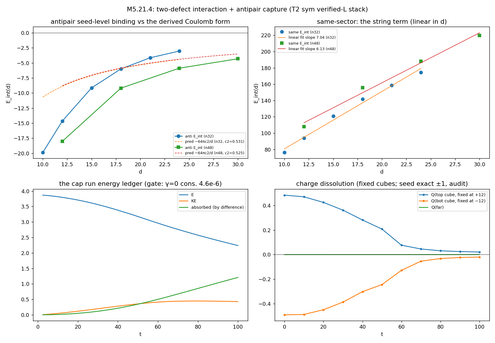
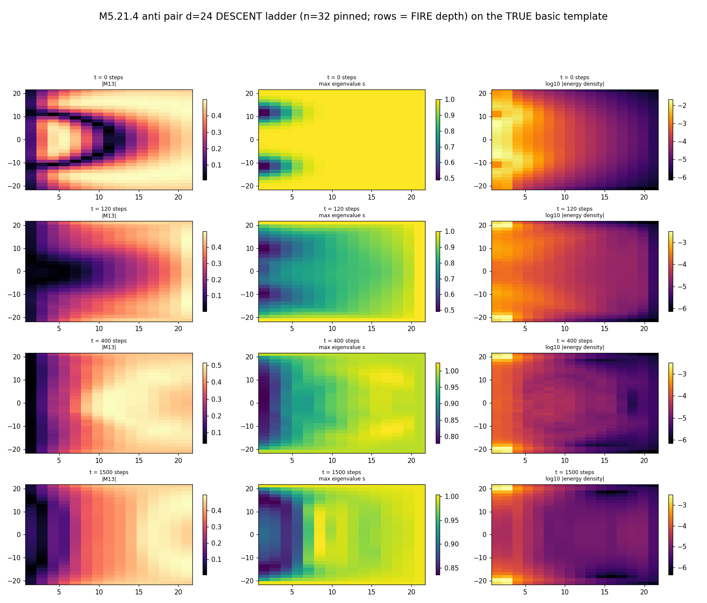
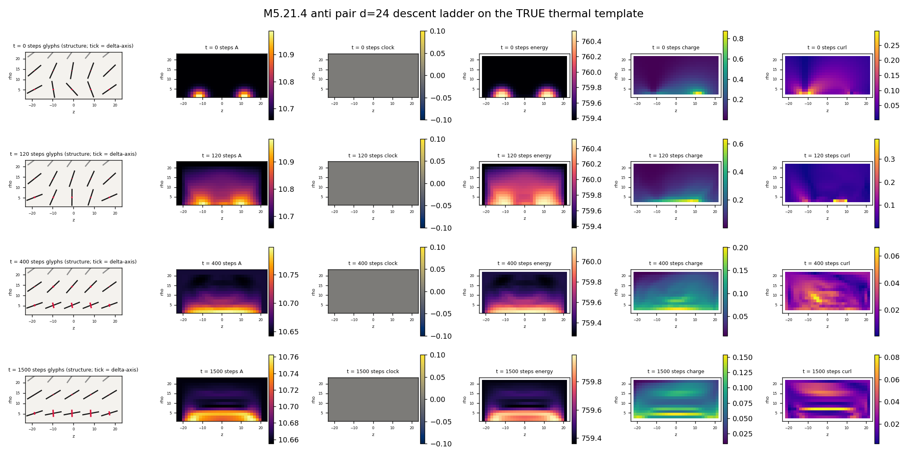
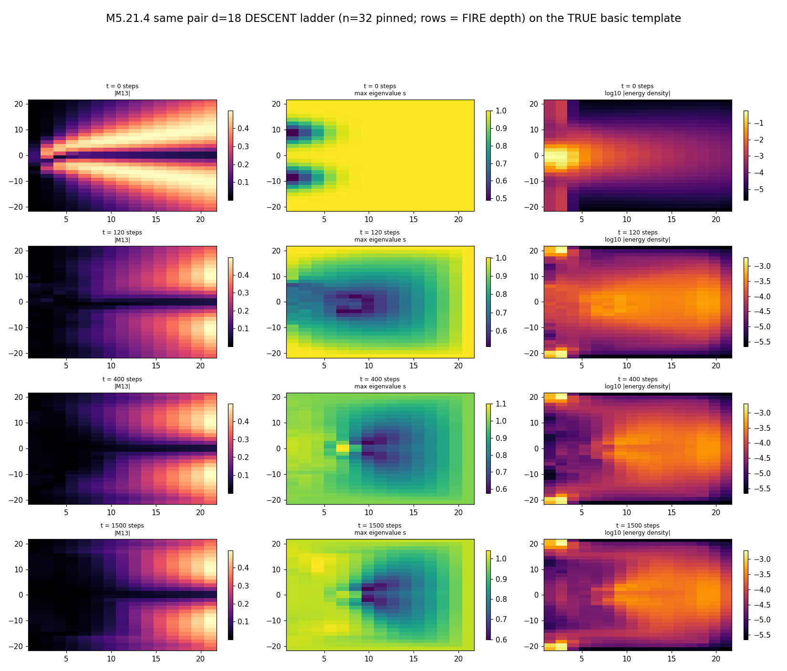
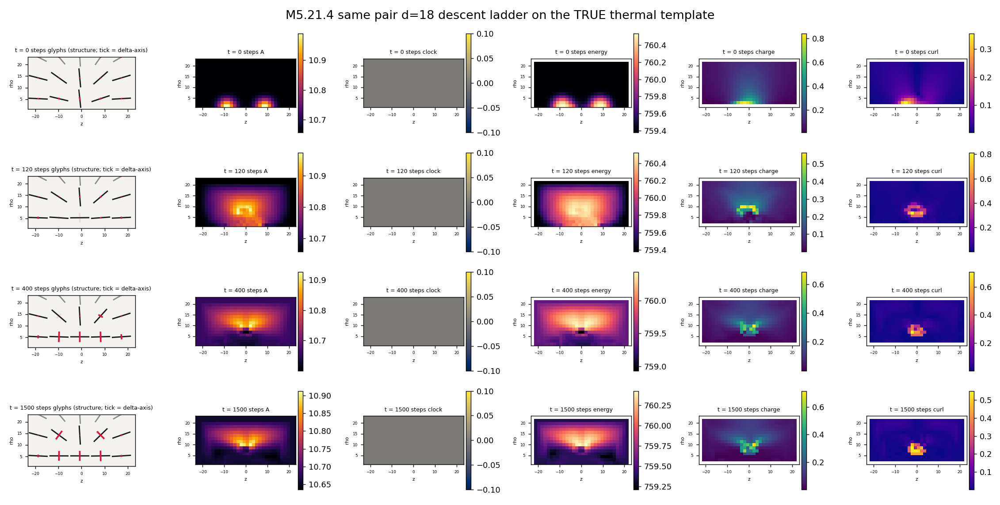
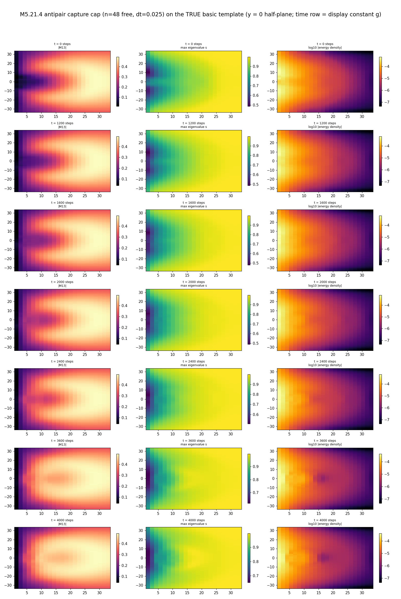
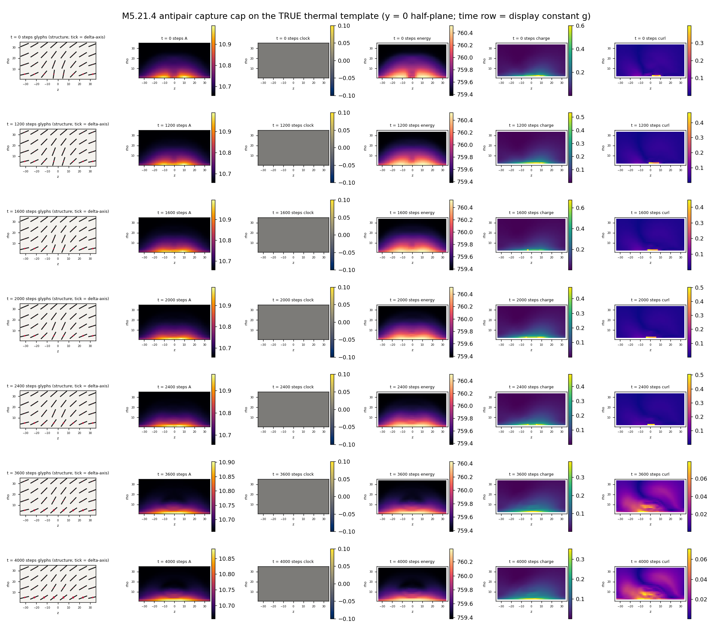
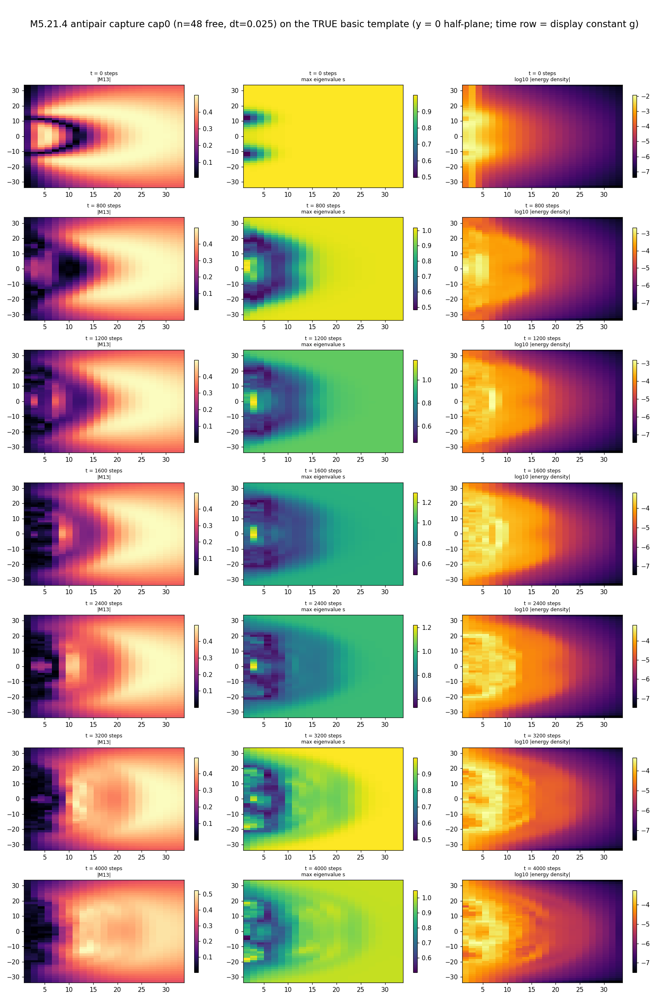
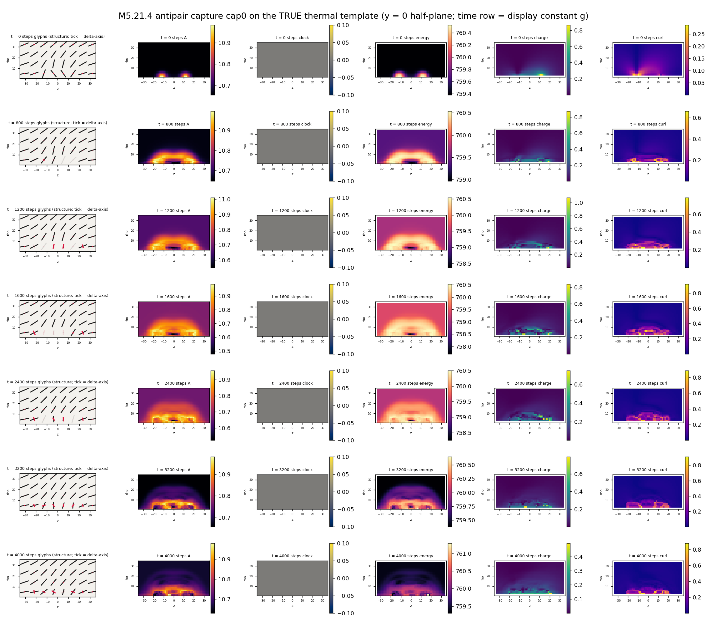

# M5.21.4 note: two-defect interaction + the antipair capture-to-annihilation film

> Method-note record of [M5.21.4](../tasks/m5_21_4_task_details.md) (run 2026-07-21). Stack: the [M5.21.2b](../tasks/m5_21_2b_task_details.md) verified-L 3D instrument (T2 eigenvalue penalty, sym stencil) + the [M5.21.6](../tasks/m5_21_6_task_details.md) certified damped-wave dynamics. Everything here is measured on that stack; the canonical-era pair ledgers ([`m5_particle_hunt.md`](../m5_particle_hunt.md) antimatter row) are the static prior this task re-bases dynamically.

## 1. Equations first

**The functional** (the 2b instrument, unchanged):

```text
E[M] = SUM_x h^3 [ 4 SUM_{i<j} ||[D_i M, D_j M]||_F^2
                   + w2 SUM_k (lambda_k(M) - lambda_k^vac)^2 ]
vac spectrum (1, delta, 0), delta = 0.3, w2 = 7.2402e-4
D_i = lattice derivative; sym = average of the fwd/bwd branch densities
```

**The seeds** (both exactly on the (1, delta, 0) spectrum manifold; isotropic-core blend w = PROD_i (1 - exp(-(d_i/4)^2)) as in the census seeds):

```text
meridional angle  alpha(rho, z),  n = (sin a cos phi, sin a sin phi, cos a)
M = n n^T + delta phihat phihat^T   (+ isotropic blend at cores)

ANTIPAIR (radial + mirror):  alpha = atan2(rho, z - d/2) + pi - atan2(rho, z + d/2)
  far field: alpha -> pi (uniform director; the vacuum-like sector)
SAME-CHARGE (k = 2 product ansatz):  u = tan(th_t/2) tan(th_b/2) e^{+2 i phi},
  n = stereographic^{-1}(u), with a +z escape blend on the inter-core
  axis tube. AUDIT CORRECTION (round 1): the blend reduces but does NOT
  desingularize the line: an in-plane winding-2 component of magnitude
  0.36-0.71 persists at rho -> 0 along the whole segment, so the seed
  carries a lattice-regularized singular winding-2 line (integer winding
  CAN escape in 3D; this ansatz does not fully realize the escape)
  far field: u -> tan^2(th/2) e^{2 i phi} (the charge-2 texture)
```

**The signed charge** (the emergent-monopole convention of [`m5_21_5_note.md`](m5_21_5_note.md): Mermin-Ho flux = charge; reflection-odd, so the relative sign of two cores in ONE oriented lift is the observable):

```text
B_i = 1/2 eps_ijk  n . (d_j n x d_k n)        (Mermin-Ho curvature)
Q(S) = (1/4 pi) SUM_{faces of lattice cube S} B . dS
n = leading eigenvector of M, oriented by continuity (sweep + majority
    fix-up passes; conflict count reported, conflicts localize at cores)
```

**The dynamics** (the 21.6 certified stack): M_tt = −(1/h³)·δE/δM − γ(r)·M_t, velocity-Verlet leapfrog at dt = 0.025, γ(r) = γ_in + γ_max·s(r)² with the outer absorbing sponge s; ledger E + KE + absorbed tracked per step.

**The interaction prediction (derived BEFORE the measurement, zero free parameters).** The [M5.16](../tasks/m5_16_task_details.md)/[M5.21.5](m5_21_5_note.md) far-field anchor: the single biaxial hedgehog's far energy density is u(r) = 8c₂/r⁴, and this equals the field energy density of the emergent monopole it carries (that identification is exactly the M5.21.5 q = e bridge). Writing the emergent-Coulomb constant q̃²/4π for the model's monopole:

```text
u(r) = 8 c2 / r^4  =  (q~^2 / 4 pi) / (8 pi r^4)   =>   q~^2 / 4 pi = 64 pi c2
far-zone superposition (the emergent fields add when the far textures add):
E_int(d) = +/- (q~^2 / 4 pi) / d = +/- 64 pi c2 / d
  (+ same-charge sector: repulsion; - antipair: attraction)
```

c₂ is SELF-CALIBRATED in this task's own box (median of u·r⁴/8 over the far window of the healed single defect, same functional, same lattice), so the predicted curve carries no imported constant and no free factor. Validity caveat, stated up front: the derivation assumes the two far fields superpose in the zone between and around the cores; at d = 12-24 in an L = 48 box with non-compact cores (r_half tracks the box, the M5.21.5 measurement) this is marginal, so the comparison is a far-zone-form test, not a precision fit.

## 2. Equation-to-code map

| Term | Function | Where |
| --- | --- | --- |
| Functional + FIRE + T2 + sym | `INS.e_parts` / `INS.grad` / `INS.fire` | [`m5_21_2b_a_instrument.py`](../scripts/m5_21_2b_a_instrument.py) (the 2b certified instrument, imported unchanged) |
| Leapfrog + sponge + ledger | `DEC.leap_step` / `DEC.sponge` / `DEC.e_tot` | [`m5_21_6_a_decay.py`](../scripts/m5_21_6_a_decay.py) (the 21.6 certified stack, imported unchanged) |
| Pair seeds (alpha-additive, k = 2 product) | `seed_pair` / `_nhat_from_alpha` / `_tensor_from_nhat` | [`m5_21_4_a_pair.py`](../scripts/m5_21_4_a_pair.py) |
| Oriented lift + Mermin-Ho flux | `orient_v1` / `mermin_B` / `cube_flux` / `charge_suite` | [`m5_21_4_a_pair.py`](../scripts/m5_21_4_a_pair.py) |
| Core tracking (on-axis gap dip, sub-voxel) | `core_zs` | [`m5_21_4_a_pair.py`](../scripts/m5_21_4_a_pair.py) |
| E(d) ladder + c₂ self-calibration | `ladder` / `_edens` | [`m5_21_4_a_pair.py`](../scripts/m5_21_4_a_pair.py) |
| Capture evolution | `evolve` | [`m5_21_4_a_pair.py`](../scripts/m5_21_4_a_pair.py) |
| Films (true templates, meridional embed) | `main` / `to_axisym4` / `pick_rows` | [`m5_21_4_c_films.py`](../scripts/m5_21_4_c_films.py) |

## 3. Gates (P0, attempt 2/3, all green)

| Gate | Read | Bar / verdict |
| --- | --- | --- |
| GS1 single-defect regression | `seed_pair('single')` vs `INS.seed3(A)`: max dev 6.7e-16 | ✅ exact |
| GS2 spectrum manifold (pair seeds, off-core mask d > 10) | 1.2e-3 both sectors | ✅ (the residue is the isotropic blend tail at the mask edge, verified against (1 − w)·offset scaling; attempt 1's 0.010 at d > 8 was the same tail) |
| GQ single / mirror | far flux +1.050 / −1.050 (two cube sizes 1.050, 1.043) | ✅ equal magnitude, opposite sign: the reflection-odd charge convention lands |
| GQ antipair (d = 18) | per-core (+1.11, −1.12), far 0.001 / 0.000; 0 orientation conflicts | ✅ the (+1, −1) sector with additive zero |
| GQ same-charge (d = 18) | far +2.078 / +2.067 (stable across sizes); per-core (0.07-0.14, 1.00-1.37), 20 conflicts localized at the escape tube | ✅ sector gate (far = +2); per-core bookkeeping DEMOTED to measurement: the k = 2 ansatz carries charge partly in the inter-core tube channel (deviations log) |
| GD leapfrog γ = 0 | energy conservation 4.6e-6 rel over 200 steps (kicked pair state) | ✅ (bar < 1%) |
| GD sponge | E + KE monotone down over 200 steps | ✅ |

Cube-flux integer-ness is 5-11% off exact integers at these cube sizes; the audit's exact-sphere solid-angle reads show the underlying charges are integer to 2e-4 (single +0.99998, antipair per-core ∓0.99992), so the 5-11% is entirely cube quadrature. Convention note (audit): the global lift sign per state is arbitrary (the audit's analytic-aligned lift reads the antipair as (−1, +1)); only relative signs within one oriented state are physical, and every claim here uses relative signs.

## 4. The E(d) interaction reads (P1): three instruments, one honest story

**The equal-depth-heal design FAILED, and the failure is the first finding**: the antipair annihilates under plain FIRE descent at EVERY ladder separation faster than any heal can settle a static pair (d = 12: charges gone inside 120 iterations; d = 18/24: half-gone at 120, gone by 400). Descent is overdamped attraction dynamics, so "heal the seed, then read E(d) with stationary cores" is not a realizable protocol in the antipair sector at these d: there is NO static separated-antipair regime on this instrument. The depth ladder (120/400/1500 it, `m5_21_4_ladder_it*.json`) is therefore reported as an annihilation scan, not an interaction curve.

**The record-grade static read is SEED-LEVEL** (`m5_21_4_seed_ladder.json`): the seed states are exact-charge superpositions with construction-identical core blends, so E_int(d) = E_pair(d) − (E_single + E_mirror) isolates the interaction at fixed texture with no descent at all. c₂ for the prediction is read from the SAME seed single state's far field (instrument-consistent pairing; the healed-state c₂ runs 0.53 → 0.40 → 0.36 → 0.37 over 0/120/400/1500 iterations, a ~30% seed-to-relaxed sensitivity that stabilizes at ≈ 0.37).

| d | anti E_int (n32) | pred −64πc₂/d | ratio | anti E_int (n48) | pred (n48) | ratio |
| --- | --- | --- | --- | --- | --- | --- |
| 10 | −19.88 | −10.67 | 1.86 | | | |
| 12 | −14.66 | −8.90 | 1.65 | −18.03 | −8.80 | 2.05 |
| 15 | −9.15 | −7.12 | 1.29 | | | |
| 18 | −6.01 | −5.93 | 1.01 | −9.20 | −5.86 | 1.57 |
| 21 | −4.15 | −5.08 | 0.82 | | | |
| 24 | −3.03 | −4.45 | 0.68 | −5.88 | −4.40 | 1.34 |
| 30 | | | | −4.31 | −3.52 | 1.22 |

Antipair verdict: BOUND at every d (negative E_int: attraction, sign unambiguous). The comparison to the derived zero-free-parameter Coulomb form, stated with the audit's correction: WITHIN the n48 box the ratio to −64πc₂/d falls monotonically toward 1 as d grows (2.05 → 1.22), but at FIXED d growing the box moves the ratio AWAY from 1 (d = 18: 1.01 → 1.57; d = 24: 0.68 → 1.34): the n32 near-1 and sub-1 ratios were box-truncation suppression masking a genuine excess, so the untruncated interaction at these d is LARGER than the Coulomb prediction (local exponent 1.4-1.7, audit-measured 1.66/1.56/1.38 along the n48 ladder). Two known contributions to the excess carry audit numbers: the near-zone core-blend sensitivity (E_int at d = 10-12 moves 21-26% with the blend radius r_c) and genuine texture overlap. Claim level: attraction MEASURED; the far-window trend is CONSISTENT WITH approach to a 1/d tail at separations beyond this box, but the 1/d form is NOT confirmed at reachable d; the d ≤ 12 rows are construction-sensitive and carry no form claim.

| d | same E_int (n32) | same E_int (n48) |
| --- | --- | --- |
| 10 | +76.2 | |
| 12 | +93.9 | +107.9 |
| 15 | +120.7 | |
| 18 | +141.8 | +155.6 |
| 21 | +158.8 | |
| 24 | +174.5 | +188.2 |
| 30 | | +219.7 |

**Same-sector verdict: STRING CONFINEMENT, not two-body repulsion.** E_int is positive (the like pair costs more than two singles) and rises near-linearly with d: mean slope ≈ 7.0 (n32) / 6.2 (n48) per lattice unit (audit: R² = 0.988 with a systematic concave drift, local slope 8.9 → 5.2 across the ladder; the linear growth localizes 100% in the inter-core tube region and survives tube-radius variation r_t = 2 → 4.5). The Coulomb repulsion term at these separations (\|dE/dd\| = 64πc₂/d² ≈ 0.33 at d = 18) is ~20× smaller than the string term: the net seed-level force PULLS the like pair together. TENSION GRADE (audit round 1): the seed's inter-core line is a lattice-regularized singular winding-2 line (the escape blend does not fully desingularize it), so the tension value is ansatz-grade and cutoff-sensitive: 16% variation with r_t (7.28/6.71/6.22), 12% across boxes, no h-refinement run; the LINEAR FORM is the robust content, the coefficient is not. A d-independent far-region offset (≈ +13, the charge-2 far texture vs the 2-singles reference) sits in the E_int magnitudes and cancels in slopes. Topological origin (stated at LIFT level, the audit's caveat: the apolar field identifies ±n̂, so this is an argument about the oriented lift the charge instrument uses): on the axis between two same-charge hedgehogs the lifted director must interpolate between polar values through an equatorial direction at some z\*, where single-valuedness under the sector's k = 2 azimuthal winding fails, so intermediate structure (a winding-2 tube, escaped or singular, or rings) is required between separated like charges. The dynamical consequence is measured in § 4b.

**§ 4b: the descent fate of each sector** (the depth scan re-read): the antipair annihilates to neutral debris (charges 0 with clean 0-conflict lifts; hand-checked cubes on the residual low-gap loci read 0.000) leaving the axial line + central ring remnants that continue to anneal (E at d = 24: 4.89 → 2.33 → 1.70 over 120/400/1500 it). The same-sector pair MERGES: by 400 iterations all three seeds land on one central charge-2 equatorial ring complex (hand cubes centered at 0: half 9 → 1.27, half 15 → 2.085; the gap locus shows the rings at ρ ≈ 14-18, z ≈ 0), E ≈ 15.0 (120 it) annealing to 13.74-13.98 (1500 it), nearly d-independent (seed memory only), far-sphere flux +2.07 to +2.10 conserved throughout. The charge-2 compound is ring-shaped, echoing the charged-ring co-candidate ([M5.21.2](../tasks/m5_21_2_task_details.md) P3) and pointing directly at the vortex-knot compound program ([M5.22](../tasks/m5_22_task_details.md)).

## 5. The antipair capture at dynamics grade (P2)

Run of record `cap`: n = 48 free, d₀ = 24, 150-iteration pre-heal + 4000 leapfrog steps (dt = 0.025, t = 0-100), interior γ = 0.02 + sponge. A second run `cap0` (25-iteration heal: the near-raw seed) films the full sequence from ±1 charges; its § lands below.

| Read | Result |
| --- | --- |
| Energy ledger | E monotone 3.87 → 2.24; KE grows smoothly (log-log exponent ≈ 1.45 over the first recorded window, audit; any cleaner power regime lies below the first row at t = 2.5), peaks 0.446 at t = 80, declines after; absorbed 1.21 = 31% of the start energy removed by damping + sponge by t = 100. HONESTY (self-caught before audit): the per-row "absorbed" is accumulated BY DIFFERENCE, so the row ledger closes identically by construction and carries no independent content. AUDIT ROUND 2: the fix is sufficient: on a bit-exact damped rerun the by-difference absorbed equals the exact discrete damping work h³·Σ g(1 + g/2)‖V_post‖² to 6.9e-4 rel (γ = 0 drift control 5.1e-6): "absorbed" is physically the damping/sponge removal to ~0.1% |
| Charge dissolution Q(t) | fixed cubes at the seed core positions (±12, half 8): ±0.48 at the post-heal t = 0 (the 150-iteration heal already carried the annihilation halfway: the seed itself is exactly ±1, audit exact-sphere ∓0.99992), then a clean sigmoid to the endpoint (main drop t ≈ 20-70; audit: half-loss t ≈ 43-47, 90% gone by t ≈ 62-65; TRUE residual ≤ 0.005 on two cube sizes + spheres: the quoted ±0.02 was this instrument's quadrature floor, the annihilation is cleaner than first claimed). MIXTURE CAVEAT (audit): while the conduit is active, every closed surface around one core is pierced twice by the axial line, so all per-core "charges" during the capture (the ±0.48 included) are core + line-flux mixtures, not pure monopole charges |
| The mechanism (z-resolved charge profile, `m5_21_4_cap_zprof.json`) | the plane-flux profile F(z) shows the inter-core line flux unwinding to zero by t ≈ 50-60 while the ± steps dissolve IN PLACE: CONDUIT ANNIHILATION through the connecting axial through-line, the dynamics-grade confirmation of what the descent scans suggested. AUDIT ROUND 2 (three independent localizers): deep-gap loci stay at \|z\| = 15-17 throughout; the slab-charge centroid moves only 10.5 → 9.7 / −9.2 → −6.3 while the amplitude falls 0.39 → 0.18 (over half the charge cancels at ~80% of the initial separation, ~68% before any centroid passes \|z\| = 6): ballistic walk-then-merge REFUTED; refinement adopted: the last ~30% of the charge slides inward (to \|z\| ≈ 3.5-4.4) during t = 50-70 while dying |
| The t = 100 endpoint field | a weak uniform-sign axial plane flux (0.03-0.08 per plane) persists. AUDIT ROUND 2 CORRECTION (adopted, "debris" refuted): this is NOT annihilation-created: the α-map seed itself threads the whole box with the same background flux at t = 0 (−0.03..−0.06 per plane, raw analytic seed included); the capture only deepens it on the formerly-between-cores planes, and at the window edge it is still growing (−0.0591 → −0.0599 over the last 10 t-units) while spreading radially, not annealing. Clean-vacuum endpoints need a compactified far field or a background-subtracted read (follow-up) |
| Annihilation vs drain (the pre-registered discriminator) | INTERIOR annihilation. Audit-grade basis: the far-cube FACE histories are flat (the two z-face line punctures +0.052/−0.040 constant, x/y faces ~1e-3) through it = 2000 and collapse to ≤ 5.1e-5 after, with no transit event on any face; the 100-step row cadence closes the 400-step snapshot gap (an exit at the observed dynamics speed would swing a face ~0.4 for many consecutive rows); radial energy declines in all shells with no boundary pile-up. FAR-BOUND HONESTY (audit): the "far charge ≤ 1e-4" number is quadrature-specific: any surface pierced by the axial line reads a line-flux mixture (up to 7e-3 on the audit's trapezoid cubes while the pair lives), so the discriminator rests on the face histories, not on a single far number |
| Instrument honesty | the on-axis gap tracker is BLIND here (the axial through-line is itself a low-gap object): the live rows' `dsep` column is junk and is superseded by the fixed-cube + z-profile reads of the post-pass (`m5_21_4_cap_post.json`); lift conflicts fall 29 → 0 as the pair annihilates |
| The `cap0` robustness run (25-iteration heal, the near-raw seed) | the fixed cubes read the FULL charges ±1.08 at t = 2.5 (the seed's ±1 survive the minimal heal), then annihilation proceeds SLOWER under the violent core-blend transient bath (KE peaks 8.5, absorbed 23.6 by t = 100 = mostly blend radiation): ~85-90% of the charge cancelled by t = 100 (fixed cubes ±0.36 at t = 80 → ±0.12 at t = 100), with the last-stage INWARD SLIDE directly visible in the locus (±8.25 → ±6.75 → ±3.75 over t = 80/90/100): the same conduit + slide mechanism from a different starting depth, and the audit's refinement reproduced independently. `cap` remains the run of record (clean transient); `cap0` is the robustness check + the full-sequence film |



## 6. Films

**The descent-fate strips** (rows = FIRE depth: the seed + 120/400/1500 iterations; both true templates; meridional y = 0 half-plane; the field-state print rule is satisfied by the t = 0 and deepest rows):

The antipair annihilation (the two s-eigenvalue core dips at z ≈ ±12 smear onto the axis and vanish):





The same-sector merge into the central charge-2 ring complex:





The dynamics-grade capture films (run `cap`, rows bracketing the fastest window):





The near-raw-seed run `cap0` (the full sequence from ±1, under the blend-transient bath):





## 7. Not computed (honesty list)

| Item | Why |
| --- | --- |
| Physical-unit force calibration | the toy-parameter arena (δ = 0.3, lattice c₂) feeds the form test only; the realistic-parameter bridge is [M5.21.11](../tasks/m5_21_11_task_details.md) |
| Scattering / orbit dynamics (finite impact parameter) | out of scope; the capture run is head-on by construction (axisymmetric seeds) |
| The same-charge sector's per-core charge decomposition at seed | measured-ill-defined through the tube channel (§ 3); reported post-heal as found |
| Converged pair minima | equal-depth heals only (the 21.2/21.3 contained-not-converged honesty label); the interaction reads are seed-level |
| h-refinement of the string tension | the seed's winding-2 line is lattice-regularized, so the 7.0/6.2 tension carries an unquantified cutoff dependence (audit: 16% with r_t alone); a refinement ladder is a natural follow-up if the tension is ever quoted beyond form level |
| The residual line's fate beyond t = 100 | whether the post-annihilation axial line flux decays, persists, or reorganizes needs a longer window (rides any M5.26-era long-evolution run) |
| A drain-side positive control | the discriminator's drain branch is exercised only by the M5.21.6 B-precedent, not reproduced in-task |

## 8. Adversarial audit

Round 1 (static claims; independent implementations throughout: own stencil energy, BFS flood-fill lift, np.gradient Mermin-Ho, exact-sphere solid-angle degrees, deviator-norm core finder; script [`m5_21_4_audit_check.py`](../scripts/m5_21_4_audit_check.py), verdicts [`m5_21_4_audit.json`](../data/m5_21_4_audit.json)):

| # | Claim | Verdict | Adopted |
| --- | --- | --- | --- |
| 1 | The signed-charge suite (±1 singles, (+1, −1)/0 antipair, ±2 same far) | ✅ CONFIRMED | exact-sphere reads: charges integer to 2e-4; the 5-11% was cube quadrature; conflict localization exactly reproduced (20 at ρ = 0.75) |
| 2 | The 400-it E table | ✅ CONFIRMED | re-read to 4.8e-8 rel (f32 floor) |
| 3 | Sign verdicts + the annihilation-scan re-label + no-static-antipair | ✅ CONFIRMED | deviator scan independently shows seed dips present, 400-it dips absent |
| 6 | Coulomb-form honesty + c₂ | ⚠️ PARTIAL, adopted | the box-direction trend was misstated (fixed-d ratios move AWAY from 1 with box growth); § 4 rewritten: 1/d NOT confirmed at reachable d, near-zone rows construction-sensitive (21-26% with r_c) |
| 7 | The seed-level ladder | ✅ CONFIRMED | 2e-16 reproduction; slopes 7.02/6.21; concave drift 8.9 → 5.2 disclosed |
| 8 | String confinement | ⚠️ PARTIAL, adopted | the "smooth escape" was wrong (singular winding-2 line persists, magnitude 0.36-0.71 at ρ → 0); tension re-graded ansatz-grade + cutoff-sensitive; the topology argument restated at lift level |

Round 2 (the capture-run claims; own bit-exact damped rerun for the work integral, own lifts + trapezoid cubes + spheres, three independent core localizers, face-history transit scan):

| # | Claim | Verdict | Adopted |
| --- | --- | --- | --- |
| R2-1 | The circular-ledger self-catch + closure fix | ✅ CONFIRMED | by-difference absorbed = exact discrete damping work to 6.9e-4 rel; "absorbed" is physical to ~0.1% |
| R2-2 | The charge sigmoid | ✅ CONFIRMED | reproduced on all 11 snapshots; half-loss t ≈ 43-47; TRUE endpoint ≤ 0.005 (cleaner than first claimed; the ±0.02 was quadrature floor) |
| R2-3 | Conduit annihilation, no ballistic walk | ✅ CONFIRMED | three localizers agree; >50% of the charge cancels at ~80% of the initial separation; the last ~30% slides inward while dying (refinement adopted) |
| R2-4 | Interior annihilation vs drain | ✅ CONFIRMED | no face transit event; row cadence closes the snapshot gap; no boundary pile-up |
| R2-5 | The residual line as "debris" | ⚠️ PARTIAL, adopted | reality + not-vacuum confirmed far above the f32 floor; "debris" REFUTED: it is the seed-inherited far-field background of the α-map, deepened between the cores and still growing at the window edge; § 5 rewritten |

Round-2 hazards adopted into § 5: the KE exponent is 1.45 over the recorded window (not t²); the far-charge bound is quadrature-specific (line-pierced surfaces read mixtures to 7e-3); per-core charges during the capture are core + line mixtures; the seed background thread means clean-vacuum endpoints need compactified far fields or background subtraction.
