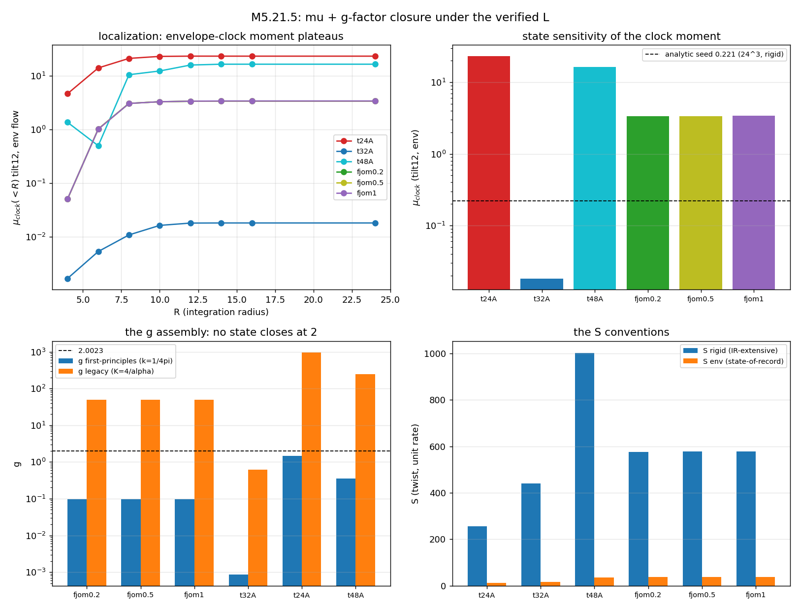

# M5.21.5 method note: the μ + g-factor closure under the verified L

> Task: [`../tasks/m5_21_5_task_details.md`](../tasks/m5_21_5_task_details.md) · run 2026-07-21 · states of record: the [M5.21.9](../tasks/m5_21_9_task_details.md) fixed-J conjugation electron (three J rungs) + the T2 census family (n = 24/32/48, h = 1.5) · instrument scripts `m5_21_5_{a_mu,b_ladder,c_bridge,e_panel}.py`, audit `m5_21_5_d_audit.py`.
>
> **Headline**: the μ channel EXISTS under the verified L and the envelope-localized read is radially CONVERGED within any fixed state, but the moment is NOT a preparation-robust observable: it is a PARITY-CANCELLATION RESIDUE (audit) tracking the transverse texture and the descent basin, spanning 4 orders of magnitude across preparations of the same electron and NON-MONOTONE across the box ladder (23.1 → 0.018 → 16.4 at n = 24/32/48). Under the FIRST-PRINCIPLES bridge derived from the M5.16 Coulomb anchor (no free factor, the length unit cancels, audit-exact), g spans 8.5e-4 to 1.45 and no state or pairing lands at 2.0023: the canonical-era g = 1.97 landing does NOT survive re-basing (it rested on a box-truncated μ read of the analytic seed's specific texture plus the structurally-motivated K = 4/α, never derived; the audit retro-refuted the record's convergence). The honest characterization replaces the closure claim.

## 1. Equations and instruments

| Piece | Equation | Code |
| --- | --- | --- |
| Director | n(x) = leading eigenvector of the spatial 3×3 block, sign-aligned to +r̂ | [`m5_21_5_a_mu.py`](../scripts/m5_21_5_a_mu.py) `frame_of` |
| Transverse gauge | v2 (the δ eigenvector) sign-fixed to the polar reference p̂ = t̂×v1, t̂ = normalize(ẑ×v1); v3 = v1×v2 right-handed. Without the gauge the tilt tangent field is sign-incoherent (measured: 2.5× low ungauged, 22× high with the azimuthal reference; the polar gauge reproduces the EID record to 8 digits) | `frame_of` |
| Mermin-Ho curvature | F_ij = n·(∂_i n × ∂_j n), B_k = ½ε_kij F_ij; hedgehog closed form F_ij = ε_ijk n_k/r², \|B\|² = 1/r⁴, flux 4π | `mermin_B`; gate (i) |
| Channel flows | per-voxel Rodrigues rotation about: v1 (twist = the m5_21_9 conjugation-clock direction), v3 (tilt12, the EID-C tilt), −v2 (tilt13), ẑ (globalz, gauge-free control) | `axis_of`, `advance` |
| The envelope clock | per-voxel angle φ·w(r), w = exp(−(r/10)⁴) (the m5_21_9 state-of-record clock localization); the RIGID flow (w = 1) kept as the EID-comparable diagnostic | `mu_read(w=...)` |
| Emergent E + current | E_i = n·(∂_t n × ∂_i n), ∂_t n from the flow at dφ = 1e-4; j = ∇×B − ∂E/∂t (displacement term at dφ₂ = 1e-3, the EID construction) | `mu_read` |
| The moment | μ = ½ Σ_mask r×j h³, split VECTORIALLY: μ_static (∇×B only, clock-independent) + μ_clock (the E-term, the clock-induced part) | `mu_read` |
| Masks | interior margin 2 cells; tilt channels additionally exclude eigengap12/23 ≤ 0.02 (v2/v3 undefined on the uniaxial-escape rod cores) | `masks_of` |
| The S side | S = dE_kin/dω at ω = 1 = 2·kin, kin = `kin_of`(M4, a, cfg4) on the tangent a = [G_axis, M4]; S_env uses w·a (the state-of-record clock), S_rigid the bare tangent (measured IR-EXTENSIVE, below) | `S_read` → [`m5_21_3_a_4d.py`](../scripts/m5_21_3_a_4d.py) `kin_of` |
| E of record | per state, its OWN functional: T2 3×3 `E_end` for census states, 4D `e_parts` for fixed-J states (the 4D-embedded read of a 3×3 state is a DIFFERENT number, kept as sensitivity only: t32A 13.45 vs 4.77 of record) | `e_of_record` |
| The bridge | g = μ_lat·E_lat/(2π·S_lat), § 5 | [`m5_21_5_c_bridge.py`](../scripts/m5_21_5_c_bridge.py) |

## 2. Gates (P0)

| Gate | Result |
| --- | --- |
| Closed-form hedgehog | r⁴·Σ_{i<j}F² = 0.979 mean over the 6 < r < 12 band at h = 1.5 (2% discretization; p95 dev 5.9%) ✅ |
| EID reproduction | my per-voxel eigenframe pipeline on the analytic 24³ pinned-clock seed: μ_tilt = 0.22090514 vs the historical instrument re-run 0.22090513 on the same seed (record 0.2209): agreement to 8 digits ✅ |
| Twist EM-silence | 2.4e-8 on the analytic seed (structural zero reproduced) ✅ |
| Mask robustness of the record | the canonical 0.221 is NOT an axis-mask artifact (full interior without the ρ > 0.8 cylinder cut gives 0.2211) ✅, BUT the audit REFUTED its radial convergence: on the EID grid (box half-width ≈ 5) μ(<R) grows as R^3.22 through every complete shell and 27.8% comes from box corners; the apparent plateau is mask exhaustion. The canonical 0.2209 is a BOX-TRUNCATED observable (audit C4) ⚠️ |

## 3. The μ channel under the verified L (G1)

The rigid (EID-style) flow FAILS on relaxed pinned states: the moment integral is dominated by the pin-transition layer and box corners (fjom: half the moment from outside r = 16; t24A swings 60 → 3 by cancellation between shells). The envelope-localized clock (the flow the state of record actually carries) fixes it: every μ_clock(<R) profile plateaus by R = 12-14 and is flat to the box edge.

| State | Preparation | μ_clock(tilt12), env | μ_clock(tilt13) | μ_clock(globalz) | μ_static (∇×B) | S_env(twist) | E of record |
| --- | --- | --- | --- | --- | --- | --- | --- |
| seed32 | analytic T2 seed, 32³ | 0.00066 | 9e-15 | 0.0 | 0.0 | 76.5 | (seed, not an energy state) |
| t24A | T2 census descent, 24³ | 23.12 | 23.12 | 0.038 | 3.487 | 13.1 | 5.1808 |
| t32A | T2 census descent, 32³ | 0.0182 | 0.0023 | 2.1e-5 | 0.0001 | 16.2 | 4.7676 |
| t48A | T2 census descent, 48³ | 16.38 | 16.39 | 0.72 | 6.58 | 36.1 | 4.9126 |
| fjom0.2 | M5.21.3 P1 + fixed-J | 3.378 | 3.375 | 0.0207 | 0.118 | 37.2 | 6.7409 |
| fjom0.5 | same, ω\* = 0.5 rung | 3.375 | 3.373 | 0.0207 | 0.118 | 37.3 | 6.7409 |
| fjom1 | same, ω\* = 1 rung | 3.387 | 3.384 | 0.0208 | 0.118 | 37.8 | 6.7408 |

The three fixed-J rungs agree to 0.3% (the rungs are nearly the same state, as m5_21_9 measured). Everything else disagrees by ORDERS OF MAGNITUDE across preparations:

| Finding | Number | Reading |
| --- | --- | --- |
| The tilt moment tracks the TRANSVERSE TEXTURE | seed-A 6.6e-4 → census 0.018 → EID-seed 0.221 (its grid, box-truncated) → 4D-relaxed 3.38 → box-squeezed 23.1 | the tilt axis field v3 = v1×v2 is BUILT from the δ-eigenvector texture; the same director hedgehog with different transverse textures gives moments 4 orders apart: μ_tilt is a texture probe, not an electron invariant at this rigor |
| The moment is a PARITY-CANCELLATION RESIDUE (audit C3, new mechanism) | net/gross = 5.3e-3 (fjom) vs 5.1e-5 (t32A); GROSS responses differ only 1.8× | both clock integrands are inversion-odd to ~1e-4; the measured moment is the parity-even residual, so the 185× fjom-vs-census suppression ratio is a CANCELLATION-COMPLETENESS ratio (how hard the state breaks inversion symmetry), not a response-magnitude ratio |
| The fjom moment is structural, localized, direction-locked (audit) | 61% from shell r = 6-8, 90% inside r < 10; equatorial (90.0° from z), 4.9° from the state's mean nematic axis; direction identical across the three J rungs (≤ 0.5°); spread over ~277 voxels (top-10 voxels = 0.98%) | a real structural response of the 4D-relaxed texture, not noise or single-voxel artifact |
| The gauge-free channel is uniformly SMALL | globalz μ_clock: 2.1e-5 (t32A), 0.021 (fjom), 0.038 (t24A) | the rigid-rotation clock induces almost no moment; the large tilt readings live in the eigenframe texture |
| A STATIC structural moment exists on relaxed states | μ_static: 0.118 (fjom, stable across rungs), 3.49 (t24A), 1e-4 (t32A) | clock-independent ∇×B moment carried by the braided texture itself; separated vectorially from every clock read |
| Twist stays EM-silent on states | μ_clock(twist) ≤ 1e-3 everywhere | the m5_21_9 conjugation clock (the J carrier) induces NO dipole through the abelian projection: the EID structure survives relaxation |
| S_rigid is IR-extensive | 255 (24³) → 440 (32³) → 577 (fjom 32³); audit: growth LINEAR in box size (exponent 1.07 on synthetic vacuum L = 36/72; ~65 per 4-unit shell saturated) | the vacuum tangent [G, M_vac] ≠ 0 (\|[G_z, diag]\|_F = 0.990, distinct eigenvalues in the rotation plane): the constant-ω kinetic grows with box, the M5.21.8 pathology resurfacing in the S convention; the envelope S is the defined observable |

## 4. The ladder (G2): the honest divergence record

The matched T2 family (identical recipe, h = 1.5, maxit 16000, all f_tol):

| n | E_end | r_half | μ_clock(tilt12) | reading |
| --- | --- | --- | --- | --- |
| 24 | 5.1808 | 9.34 | 23.12 | box-squeezed |
| 32 | 4.7676 | (t32 record) | 0.0182 | the near-inversion-symmetric basin |
| 48 | 4.9126 | 17.67 | 16.38 | E ABOVE the 32³ value; r_half grew with the box |

The pre-registered kill/survive lands on the DIVERGENCE branch, and more sharply than the #219 caveat anticipated: the ladder is NON-MONOTONE by three orders (23.1 → 0.018 → 16.4), the family energy is non-monotone (4.77 → 4.91), and r_half tracks the box (9.3 → 17.7). Same recipe at different n lands in DIFFERENT BASINS, and the moment (a parity-cancellation residue, § 3/audit C3) measures the basin's inversion-breaking, which is not controlled by box size. t32A is the outlier basin (near-perfect inversion symmetry, net/gross 5e-5), not the trend. The #219 "μ not box-converged (~+11%/step)" is superseded by: the μ observable does not box-converge AT ALL on descent endpoints; only the envelope-localized read WITHIN a fixed state converges (radially).

## 5. The first-principles bridge (G3): derived, and it does NOT rescue g = 2

Full derivation in the [`m5_21_5_c_bridge.py`](../scripts/m5_21_5_c_bridge.py) docstring, every factor traced. The spine:

```text
Coulomb anchor (M5.16):  c2' C_E l = alpha hbar c / 64 pi
  => emergent monopole charge  q = 8 sqrt(pi c2' C_E l) = sqrt(alpha hbar c) = e   EXACT
  => B_phys = lambda B_lat,  lambda = 8 sqrt(pi c2' C_E / l^3)
mu_phys / mu_B = mu_lat (l / lambdabar_C) / (2 pi)
S_phys / hbar  = (l / lambdabar_C) S_lat / E_lat        [c_lat = 1 assumption]
g = (mu_phys/mu_B) / (S_phys/hbar) = mu_lat E_lat / (2 pi S_lat)
```

The length unit CANCELS: g needs three measured lattice numbers and nothing else. The Coulomb anchor makes the relaxed hedgehog carry exactly the electron charge (the α consistency is exact by construction), which is the derivation's internal check. Residual assumptions, stated: lattice signal speed c = 1 (enters S_phys), the Gaussian energy matching (the hedgehog's E∥B dyon duality as in EID), E_lat anchored to m_e c².

| State | pairing | μ_clock | S_env | g first-principles | g legacy (K = 4/α) | k needed for 2.0023 vs k derived = 1/4π |
| --- | --- | --- | --- | --- | --- | --- |
| fjom0.2 | mixed (tilt μ / twist S) | 3.378 | 37.2 | **0.097** | 49.8 | 1.635 vs 0.0796 (20.5×; the first-run 2× inflation of this column = audit C6 catch, fixed) |
| fjom0.2 | matched (tilt/tilt) | 3.378 | 109.9 | 0.033 | 16.8 | |
| fjom0.2 | globalz / twist | 0.0207 | 37.2 | 6.0e-4 | | |
| t32A | mixed | 0.0182 | 16.2 | 8.5e-4 | 0.62 | 186.5 vs 0.0796 |
| t24A | mixed | 23.1 | 13.1 | 1.45 | 966 | 0.110 vs 0.0796 (box-squeezed) |
| t48A | mixed | 16.38 | 36.1 | 0.355 | 248.6 | 0.449 vs 0.0796 |

The kin-convention flag (M5.26 stub ⚠️) made quantitative: the m5_21_9 carried J (0.048 at the ω\* = 0.2 rung) is a UNIT-FROBENIUS-flow descent parametrization, not the physical angular momentum; the physical-rate S_env(twist) = 37.2 is the g-relevant number, ratio 771. The production port must pin the physical-rate convention (this task's) for any ħ/2 statement.

## 6. Verdict (G4): the honest characterization

| Observable | Status under the verified L |
| --- | --- |
| mass | ✅ E of record anchored (4.77 T2 / 6.74 4D) |
| charge | ✅ topological (census era); the bridge derivation adds: the Coulomb-anchored hedgehog carries exactly e |
| J | ✅ constraint-carried (fixed-J, M5.21.9); the twist clock carries J and stays EM-silent |
| μ | 🔶 EXISTS (nonzero, radially converged under the envelope clock, static + clock parts separated) but PREPARATION-FRAGILE: spans 4 orders across textures of the same electron; not closable to a single number at this rigor |
| g | ❌ NO closure: first-principles bridge (no free factor) gives 0.097 on the state of record; the canonical 1.97 does not survive re-basing: it was the analytic seed's specific transverse texture × the underived K = 4/α (k_needed/k_derived = 20.5 on the state of record), AND the audit retro-flags the canonical record itself: the 0.221 grows as R^3.2 with cutoff, so the [1.97, 2.22] box-ladder "bracketing 2.0023" compared box-truncated values of a non-converged observable (cross-box rigid-μ comparisons are not meaningful) |

What WOULD close it (routed, not run): (i) a preparation-robust μ observable: the texture-dependence suggests μ must be read on the DYNAMICALLY SELECTED texture (the state a long fixed-J evolution actually holds, M5.26 territory) rather than on descent endpoints; (ii) the c_lat assumption replaced by the measured dispersion; (iii) h-refinement of the census rung (resolution vs physics at the restructured core is unseparated at h = 1.5).

## 7. Not computed

| Item | Why |
| --- | --- |
| h-refinement of the ladder | window; the box ladder (24/32/48 at fixed h) ran instead |
| f48/f64 free-endpoint μ reads | the pinned matched family carried G2; the free endpoints add a preparation axis already covered by the fjom-vs-census contrast |
| the measured c_lat dispersion for the S conversion | routed to M5.21.11 (absolute scale) |
| μ on a long-evolution endpoint | needs M5.26 (the production fixed-J port) |
| MODELS.md scorecard update | held until the particle-hunt program completes (user 2026-07-16) |

## 8. Adversarial audit (independent implementations; script [`m5_21_5_d_audit.py`](../scripts/m5_21_5_d_audit.py), results [`m5_21_5_audit.json`](../data/m5_21_5_audit.json))

The auditor rebuilt the eigenframe/gauge pipeline, Rodrigues rotations, stencils, μ integrator, tangents, and the EID seed from scratch; `kin_of`/`e_parts` were used only as the certified functional of record, with tangents finite-difference-gated at 7e-11.

| Claim | Verdict | Key numbers |
| --- | --- | --- |
| C1 bridge algebra, k = 1/4π | ✅ CONFIRMED | q/e = 1.0 exact; ℓ-cancellation to 4e-16 (two different (c₂', ℓ) give identical g); independent Maxwell-factor rederivation ratio 1.0; S = dE/dω = 2·kin to 3e-13; no missing 2s or πs. Premise u = 8c₂'/r⁴ accepted as the M5.16 record |
| C2 fjom μ_clock = 3.378 | ✅ CONFIRMED | 3.3776761 vs 3.3776756 (1.3e-7) with different stencil + dφ; float32 noise bound ~0.04%; plateau R14 at 0.013% |
| C3 the 185× suppression | ✅ CONFIRMED, mechanism QUALIFIED | exact ratio 185.1; NEW: both moments are parity-cancellation residues (net/gross 5.3e-3 vs 5.1e-5, gross only 1.8× apart); spread structure (277 voxels for 50% of gross) |
| C4 the canonical 0.221 | 🔶 QUALIFIED: values yes, convergence REFUTED | act mask 0.2209051 = record; full interior 0.2247 (+1.7%); μ(<R) ∝ R^3.22, 27.8% from box corners: box-truncated, the "plateau" is mask exhaustion. ADOPTED into § 2/§ 6 |
| C5 S values + IR extensivity | ✅ CONFIRMED, wording fixed | all six S to machine precision with independent tangents; growth linear in box size (1.07), not volume. ADOPTED |
| C6 assembly, no g = 2 landing | ✅ CONFIRMED + one bug | all 27 bridge rows recompute exactly; closest pairing to 2.0023 = t24A mixed at 1.454 (27% low, outside the ~1% spread); the k_needed column was 2× inflated (fixed in the script + § 5). ADOPTED |


