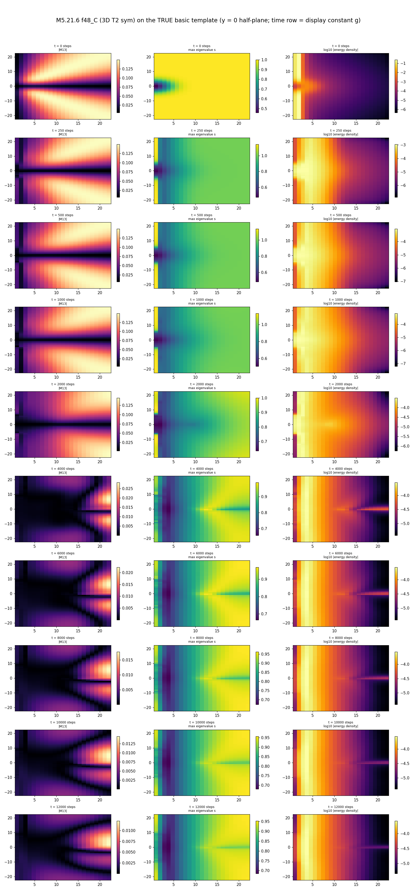
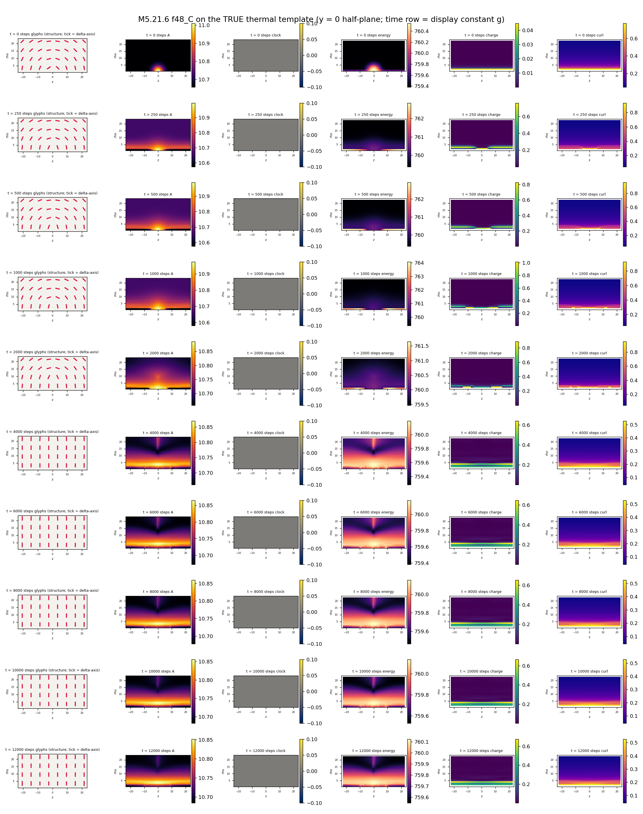
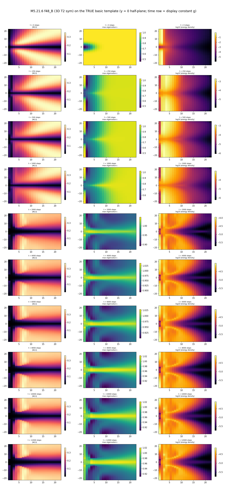
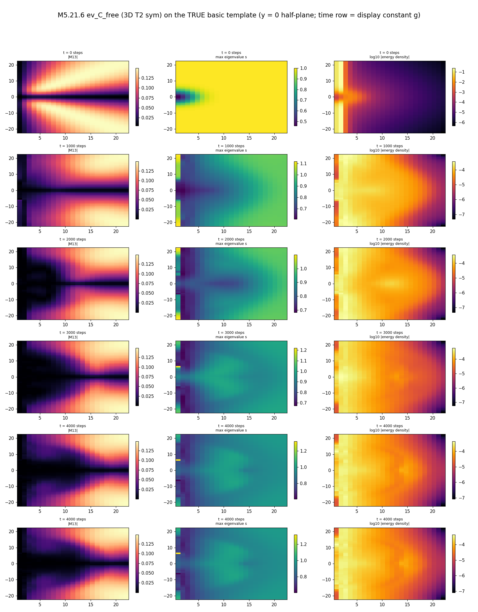

# M5.21.6 method note: the 3D μ/τ decay runs (heavy minima → the electron + released structure)

**Status**: ✅ RUN COMPLETE + AUDITED 2026-07-18 (gates ✅ attempt 2/3, both arenas ✅, dynamics arm ✅, audit 21/24 CONFIRMED + 3 PARTIAL adopted § 8). Task: [`../tasks/m5_21_6_task_details.md`](../tasks/m5_21_6_task_details.md). The author's prescription (goal (c), [`../tasks/m5_21_convo.md § 2026-07-18 morning`](../tasks/m5_21_convo.md)): "perturb initial minimum, what should lead to quick field rotation to global energy minimum of electron, which should give energy to attached vortices - releasing as fast vortex loops, interpreted as neutrinos", plus his 14:16 conjecture: the four ½-vortices pair into TWO loops, hence two neutrinos per decay. Method-note standard ([`../../../../../dev_docs/METHOD_NOTE.md`](../../../../../dev_docs/METHOD_NOTE.md)).

## 1. Equations and instruments

The field is the 3×3 real symmetric M(x) on the cubic grid, and the STATIC functional is exactly the [M5.21.2b](m5_21_2b_note.md) certified instrument (imported, not re-implemented): sym stencil (½(fwd + bwd) with exact adjoints), curvature u = 4 Σ_{i<j} tr(C_ij^T C_ij), C_ij = [A_i, A_j], A_i = d_i M / h, and the T2 eigenvalue-penalty potential V = W2 Σ_i (λ_i − v_i)², vacuum spectrum v = (1, δ, 0), δ = 0.3, W2 = 0.000724023879, E = h³ Σ (u + V). Its gates (complex-step gradient, SO(3) invariance, vacuum zero) are the 2b record.

New instruments added by this task (gated in § 3):

| Instrument | Equation | Honesty grade |
| --- | --- | --- |
| Kick K1 (random smooth) | M → sym(M + ε·Ŝ·w(r)), Ŝ = Gaussian-filtered (σ = 2 cells) white symmetric noise, w = exp(−(r/8)²), ε RMS-relative to \|M − iso\| | perturbation operator |
| Kick K2 (core twist) | M → R_z(θ·w(r)) M R_z(θ·w(r))^T, symmetrized | his "field rotation" as a perturbation |
| Damped wave evolution | M_tt = −(1/h³) δE/δM − γ(r) M_t, leapfrog kick-drift-kick, KE = ½ h³ Σ \|M_t\|², interior γ = 0, absorbing sponge γ(r) = γ_max·s(r)², s ramping 0 → 1 over r ∈ [0.65, 0.98]·L/2 | the ONLY dynamics-grade instrument; FIRE descent everywhere else = basin topography, not dynamics |
| Topology bookkeeping | per-cell min eigen-gap min(λ₂−λ₁, λ₃−λ₂) < thr mask (r < 0.65·L/2) → 26-connected components; compact = disjoint from the edge zone (no voxel with r > 0.62·L/2); thr = 0.09 with {0.06, 0.15} sensitivity | proxy for ½-line content; component count ≠ proven loop closure |

**The arena fact that shapes everything**: the pinned shell holds each seed's OWN far field (A/B/C = axis permutations (1, δ, 0) / (δ, 0, 1) / (0, 1, δ) on the (r̂, φ̂, t̂) frame), so cross-sector decay is boundary-forbidden when pinned; the M5.21.2 census measured free-boundary protection to be intrinsic only at N ≥ 48. Hence: Arena 1 = n = 32 pinned (in-sector robustness only, pre-registered), Arena 2 = n = 48 FREE (the honest decay arena; the census also warns free boxes drain slowly, so a drained endpoint is a pre-registered alternative verdict, discriminated by core spectrum + retention + topology, never conflated with decay).

**Pre-registered verdict rules** (checkpoint, written before any Arena number): Arena-1 returned = \|ΔE\| < 1% and core-spectrum shift < 0.02. Arena-2: endpoint A-like (E, core spectrum, topology signature match the free-A reference) = decay-to-electron under descent; E → 0 with no core = drained-to-vacuum; held level = metastable. Rotation-vs-melt (dynamics arm): rotation-dominant = frame rotation grows while spectrum deviation stays bounded. Emission language reserved for the damped-evolution arm (an outward-moving energy pulse); the two-loop count = compact components in the wake at thr 0.09, reported whatever it is.

## 2. Equation-to-code map

| Piece | Code |
| --- | --- |
| Static stack (imported whole) | [`m5_21_2b_a_instrument.py`](https://github.com/openwave-labs/openwave/blob/main/openwave/xperiments/m5_liquid_crystal/research/scripts/m5_21_2b_a_instrument.py) `e_parts` / `grad` / `fire` / `make_seed` |
| Driver + all new instruments | [`m5_21_6_a_decay.py`](https://github.com/openwave-labs/openwave/blob/main/openwave/xperiments/m5_liquid_crystal/research/scripts/m5_21_6_a_decay.py): `kick_random` / `kick_rotate` / `leap_step` / `sponge` / `e_tot` / `gates` / `p1` / `evolve` / `loop_read` |
| Films (TRUE templates) | [`m5_21_6_c_films.py`](https://github.com/openwave-labs/openwave/blob/main/openwave/xperiments/m5_liquid_crystal/research/scripts/m5_21_6_c_films.py) |
| Panel | [`m5_21_6_d_panel.py`](https://github.com/openwave-labs/openwave/blob/main/openwave/xperiments/m5_liquid_crystal/research/scripts/m5_21_6_d_panel.py) |
| Data | `data/m5_21_6_*.json` (gates, rows, p1 ladders, traces, spec_core, loop reads, evolve history) |

## 3. Gates ✅ (attempt 2 of the pre-registered 3)

| Gate | Result |
| --- | --- |
| GK: kicks keep M exactly symmetric, pinned shell exactly untouched (applied masked form) | both 0.0 EXACT |
| GL1: leapfrog γ = 0 conserves E_tot | drift over 200 steps: 9.7e-3 (dt 0.05) / 2.4e-3 (dt 0.025) / 6.1e-4 (dt 0.0125) = clean O(dt²); production dt = 0.025 |
| GL2: sponge physically dissipative | ends below both the start and the equal-step conservative run; no step-rise above the measured γ = 0 noise floor |

Attempt-1 failures were gate-instrument defects, documented in the task details deviations log (exact-zero vs float ε before symmetrization; unmasked form tested; 1e-10 monotonicity demand under the integrator noise floor). One physics-relevant catch from the gate run: WHITE-noise kicks are energetically violent (kicked E ≈ 1469 on the E ≈ 6.6 electron), so K1 noise is smoothed (σ = 2 cells) to probe barrier-scale physics; kick energies are recorded per row regardless.

## 4. Arena 1 (pinned, n = 32): the heavy minima are rock solid in-sector ✅

T2 pinned n = 32 levels, the lepton ordering reproduced: **A 5.318 < C 15.934288 < B 55.599677** (C converged to f_tol, fmax 3.8e-8, a certified stationary point; B a contained grind at fmax 4.7e-4). ⚠️ AUDIT CORRECTION (adopted): the A reference is the 2b `i2_A_T2` state, which was relaxed and originally scored under the 2b calibration weight w2 = 0.0027581 (E = 6.604177 on that scale); rescored at THIS stack's common w2 = 0.000724023879 it reads 5.318, quoted above so all three levels sit on one energy scale. The state itself was relaxed under the heavier weight (a common-weight A re-relax would differ slightly); the ordering holds under both conventions. All M5.21.6-native runs (both arenas) share the common weight.

The kick ladder (FIRE 4000 from each kicked state):

| Kick | B: E_kicked → E_end | C: E_kicked → E_end | Verdict |
| --- | --- | --- | --- |
| K1 ε = 0.05 | 57.07 → 55.607 | 16.73 → 15.934 | returned / returned |
| K1 ε = 0.15 | 73.71 → 55.589 | 29.61 → 15.932 | returned / returned |
| K1 ε = 0.4 | 451.58 → 55.585 | 402.91 → 15.910 | returned (spec 0.021, marginal) / returned |
| K2 θ = 30° | 56.17 → 55.600 | 15.98 → 15.934 | returned / returned |
| K2 θ = 60° | 57.82 → 55.605 | 16.14 → 15.934 | returned / returned |
| K2 θ = 90° | 60.44 → 55.604 | 16.41 → 15.933 | returned / returned |

12/12 relax back to the start level, including kicks carrying 8× the state's total energy. No in-sector lower state is reachable by these perturbations; with the far field held, the heavy states are genuinely protected local minima. (Cross-sector decay is boundary-forbidden here by construction; that is the arena limit, not a physics claim.)

## 5. Arena 2 (free, n = 48, 12000 iters): C decays to the electron; B drains ✅

Equal-depth endpoint table (all max_iter stops, all still slowly creeping: levels-at-equal-depth read, none converged):

| Seed | E_end | Core spectrum (r < 6) | Retention per-axis | Topology (thr 0.09) | Verdict (pre-registered rules) |
| --- | --- | --- | --- | --- | --- |
| A (ref) | 1.946 | (0.77, 0.49, 0.04) | (0.84, 0.94, 0.83) | 2 compact axial through-lines + polar run-outs | the protection reference holds |
| C | 2.099 | **(0.77, 0.51, 0.02) = A's within ~0.02** | (0.34, 0.32, **0.98**) | **2 compact = A's exact signature** | **DECAY-TO-ELECTRON under descent** |
| B | 0.853 (UNDER A) | (1.00, 0.22, 0.07) ≈ vacuum | (0.84, 0.75, 0.85) | 0 compact ever (2 edge lobes) | **DRAINED through the free boundary** |

The C transition is sharp and mechanism-rich: E 6.09 → 2.57 across it 1000-2500 (the film shows the reorganization firing between snapshots 2000 and 4000); the retention pattern (0.34, 0.34, 0.98) is AXIS-SELECTIVE unwinding (the two in-plane frame axes rotate away while the third holds), i.e. the field-rotation character his mechanism predicts, stated here at descent grade only (the dynamics-grade rotation read is § 6). B's collapse is early (6.80 → 1.15 by it 2500) and structurally different: no compact core ever forms, the biaxial content sits in two edge-zone lobes, the endpoint core is near-vacuum with the residual energy pushed outward (r_half 19.8): the census drain warning realized, honestly labeled, NOT a decay.

**The topology ledger through C's transition** (thr 0.09; identical-size entries are z-mirror pairs):

| it | compact | Inventory |
| --- | --- | --- |
| 250-1000 | 1 | one big biaxial core (the heavy C object, size ~600-790) |
| 2000 | 1-2 | breakup begins |
| 4000-8000 | 6 | transient fragment population in identical-size pairs |
| 10000 → end | **2** | **A's signature: the axial through-line pair (ρ ≈ 2, z-extent 23)**; departing: ONE thin equatorial ring @ ρ 15.2, z = 0 (arc pair, φ-extent 0.19, z-extent 1), EXITED the analysis region by the endpoint; the polar z ≈ ±12 features are through-line run-outs, present in A's own endpoint class → not emission |

**The descent-grade released-structure count is therefore 1 (one equatorial ring), against his conjectured 2.** Three caveats keep this honest: (i) FIRE descent has no inertia and actively quenches traveling structures, so descent UNDERCOUNTS emission (the dynamics-grade count is § 6); (ii) the component count is a proxy: the ring appears as an arc pair at the mask threshold (exactly 2 under the size ≥ 3 voxel filter; 2 extra 2-voxel specks exist at the raw count, audit-disclosed), and loop CLOSURE is inferred from geometry (thin, equatorial, fixed ρ, z-extent 1), not from a winding integral around the ring; (iii) connectivity convention (audit probe, adopted): the counts above are 26-connectivity; at 6-connectivity A's pair fragments to 8 pieces and B's edge debris splits into 23 small compact bits, while **C's 2 is connectivity-ROBUST**, so the sharpest topology statement is C's, and A/B counts are quoted as 26-conn reads (the A/B verdicts rest on core spectrum + energy, not on the count).

## 6. The damped-wave-evolution arm (dynamics-grade) ✅

Start state: the f48_C mid-descent snapshot M_it1000 (E = 5.064, past the seed transient, the transition ahead). 4000 leapfrog steps at dt = 0.025 (t = 0 → 100), interior γ = 0, absorbing sponge only; free arena n = 48.

| Read | Result |
| --- | --- |
| **The energy ledger CLOSES** | E + KE + absorbed = 3.5816 + 0.3337 + 1.1491 = **5.064 = the start energy to 3 decimals**: everything that left the field is accounted for at the sponge |
| **Emission, dynamics-grade** | **1.149 units = 23% of the start energy radiated outward and absorbed at the boundary within t = 100**; the absorption is continuous through the window (0.03 → 1.15), not a single burst |
| Rotation-vs-melt (pre-registered rule) | rot_core grows 0.16° → 4.27° (peak 4.6°) while spec_dev_core stays bounded in [0.14, 0.18] with NO spike: **ROTATION-DOMINANT, melt absent**: the author's "quick field rotation" mechanism holds at dynamics grade in this window |
| The emitted object in flight | The main biaxial component migrates outward BODILY: centroid ρ = 10.1 → 12.8 → 13.8 → 15.0 across the window (size shrinking 1510 → 514 voxels as it enters the edge zone and the sponge eats it): the release process caught mid-flight |
| Window honesty | t = 100 covers the EARLY transition (E still 3.58 vs the descent endpoint 2.10; the core still one connected biaxial object): the full topological resolution to the electron pair is the § 5 descent read; the two arms are complementary, neither is overclaimed as the other |

## 7. Not computed

| Item | Why |
| --- | --- |
| Physical decay rates / branching | toy parameters; the realistic bridge is [Q33](../m5_question_tracker.md#q33-detail) |
| Loop closure by winding integral around the departing ring | geometry-inferred only this run; a contour instrument around the ring axis is a clean follow-up |
| B-drain vs B-decay at larger boxes | N = 64 free would discriminate whether B's drain is box-fed; not run (time-boxed) |
| τ → μ staging (B → C cascade) | the free arena sends B under A directly (drain); a staged read needs the boundary discrimination first |

## 8. Audit ✅ (independent adversarial; 24 checks: 21 CONFIRMED, 3 PARTIAL, 0 REFUTED)

Auditor: independent agent, OWN energy implementation (no imports from the instrument or driver; replicated the actual `d1` sliced one-sided semantics). Script: [`m5_21_6_audit_check.py`](https://github.com/openwave-labs/openwave/blob/main/openwave/xperiments/m5_liquid_crystal/research/scripts/m5_21_6_audit_check.py); verdicts: `data/m5_21_6_audit.json`.

| Claim group | Verdict | Detail |
| --- | --- | --- |
| Pinned levels B, C | ✅ CONFIRMED | own E to < 2e-7 relative |
| Pinned A reference | ⚠️ PARTIAL → ADOPTED (§ 4) | `i2_A_T2` carries the 2b calib weight w2 = 0.0027581 (E 6.604 on that scale, 5.318 on the common scale); the § 4 restatement puts all three on one scale; ordering holds under both |
| Ordering A < C < B | ✅ CONFIRMED | both conventions |
| Kick returns (12) | ✅ CONFIRMED | max \|dE_rel\| 1.54e-3; both K1-0.4 endpoints recomputed to < 2e-7 |
| Free-arena energies | ✅ CONFIRMED | A 1.946038, B 0.852794, C 2.099319 |
| Core spectra | ✅ CONFIRMED | max \|A − C\| = 0.021; B near vacuum (mid eigenvalue 0.078 below 0.3, noted) |
| Compact counts (26-conn) | ✅ CONFIRMED | A 2 (24, 24), C 2 (19, 19), B 0 |
| Connectivity robustness | ⚠️ PARTIAL → ADOPTED (§ 5) | 6-conn: A → 8, B → 23, **C → 2 robust**; A/B counts quoted as 26-conn reads |
| Equatorial arcs | ⚠️ PARTIAL → ADOPTED (§ 5) | the two size-8 arcs exact (ρ 15.2, z 0.0); "exactly two" holds under the size ≥ 3 filter (2 extra 2-voxel specks raw) |
| Evolve ledger | ✅ CONFIRMED | E + KE + absorbed = 5.0644 vs own start E 5.0645 (leak −7.3e-5); endpoint static E recomputed 3.581573 |
| Rotation-vs-melt | ✅ CONFIRMED | own final-rotation recompute 4.270°; note the trace peaks 4.61° at it 2750 then settles (non-monotone tail, stated) |

One audit-brief erratum (mine, not the code's): the brief claimed `d1` uses periodic np.roll; the actual instrument uses sliced one-sided differences with a zero boundary plane. The auditor replicated the real semantics.
