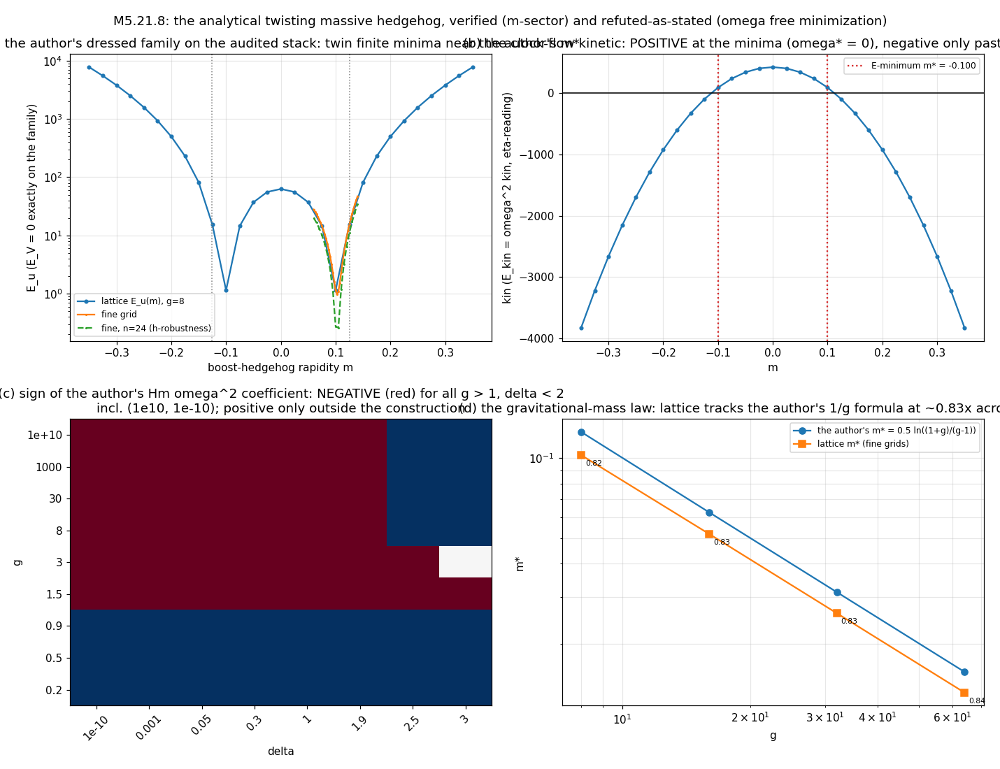

# M5.21.8 method note: the analytical twisting massive hedgehog, verified and confronted

**Status**: ✅ RUN COMPLETE + AUDITED 2026-07-19 (P0-P3 ✅, audit 7/7 CONFIRMED § 8). Task: [`../tasks/m5_21_8_task_details.md`](../tasks/m5_21_8_task_details.md). Source under verification: the author's notebook [`../../theory/duda_2026-07-19_3p1D_analytical_twisting_massive_hedgehog.pdf`](../../theory/duda_2026-07-19_3p1D_analytical_twisting_massive_hedgehog.pdf) (decode: [`../tasks/m5_21_convo.md § 2026-07-19 05:09`](../tasks/m5_21_convo.md)); the author's ask: "please ask Fable to verify it, and if agreeing analyze why its simulations lead to infinites for electron". Method-note standard ([`../../../../../dev_docs/METHOD_NOTE.md`](../../../../../dev_docs/METHOD_NOTE.md)).

## 1. The author's construction and our verification instruments

The author's ansatz (notebook p. 1-2): M = Q d Qᵀ, d = diag(g, 1, δ, 0), Q = Qb·Qh with Qb = exp(m·r̂·boosts) (the boost hedgehog, rapidity m = the gravitational-mass knob) and Qh = R_z(φ) R_y(θ) R_x(ωt) (the twisting hedgehog: spatial frame + the de Broglie clock). Eigenvalues are PINNED to the vacuum spectrum everywhere (pure conjugation family). The author's Hamiltonian: F_ij = ∂_i M ξ ∂_j M − ∂_j M ξ ∂_i M over ALL spacetime derivative pairs, H = Σ_ij [(spatial entries of F)² − (time-row entries of F)²], ξ = diag(−1, 1, 1, 1), evaluated on the y = 0 plane, time-averaged; the vortex cone is cut at Δ and its divergent term dropped ("needs regularization, let's ignore it now"); the profile is rigid (no amplitude relaxation), single central vortex.

Our verification pipeline is INDEPENDENT (no transcription of the author's intermediate expressions): closed-form group elements (per-generator Rodrigues; boost via I + sinh(m)K + (cosh(m)−1)K²), Richardson central differences for ∂_μ M, Gauss-Legendre quadrature for the author's time average and cone integral, the author's normalizations replicated. Only the author's two short DOWNSTREAM formulas (Hm, the finite-branch value) are transcribed, as cross-check targets. The lattice confrontation builds the same dressed family on the certified [M5.21.3](m5_21_3_note.md) 4D stack (imported; its gates are that note's record) and measures with its audited `e_parts` / `kin_of`.

## 2. Equation-to-code map

| Piece | Code |
| --- | --- |
| Independent analytic pipeline (ansatz, F, the author's H, averages, checks C1-C6, P1 bridge) | [`m5_21_8_a_verify.py`](https://github.com/openwave-labs/openwave/blob/main/openwave/xperiments/m5_liquid_crystal/research/scripts/m5_21_8_a_verify.py) |
| The dressed family on the 4D lattice + kin + relax + g-ladder | [`m5_21_8_b_lattice.py`](https://github.com/openwave-labs/openwave/blob/main/openwave/xperiments/m5_liquid_crystal/research/scripts/m5_21_8_b_lattice.py) |
| Data | `data/m5_21_8_p0.json` (verdicts C1-C6 + P1 samples), `data/m5_21_8_lat_*.json` (m-curves, box, relax, g-ladder) |

## 3. The convention bridge (P1): the SAME functional ✅

At every random sample of (m, ω, r, Θ, t) on the ansatz: our η-trace tr(ηFηFᵀ) equals **exactly 2×** the author's component-split [(spatial)² − (time-row)²], separately on the spatial-spatial derivative block AND the time-derivative block, to all computed digits. **The author's Hamiltonian and the M5.21.3 η-reading are the same functional up to a global factor of 2.** No sign-convention gap exists between the author's benchmark and our measurements; every difference must come from the ansatz content (the boost dressing, the rigid profile) or the IR treatment.

Audit sharpening (adopted): the identity is GENERIC, not ansatz-special: it is the entrywise expansion of tr(ξFξFᵀ) for ANY antisymmetric F, and every commutator-form F = ∂AξB∂ − ... built from symmetric fields is antisymmetric (the auditor's random-field probe holds to 1.8e-16; an anticommutator negative control breaks it). So the bridge is a small theorem, valid for every configuration either stack will ever evaluate.

## 4. Verification of the author's notebook (P0): claim by claim

| The author's claim | Verdict | Our numbers |
| --- | --- | --- |
| m* = ½ ln((1+g)/(g−1)) (finite gravitational-mass minimizer) | ✅ CONFIRMED, essentially EXACT | our scan minima: g = 3: \|m\| = 0.3456 vs 0.3466; g = 8: 0.1231 vs 0.1257 (cone-robust to 9 digits); the residual ~2% gap was OUR scan resolution, not the author's formula: the audit's fine minimization lands at 0.125646 vs 0.125657 = **0.009% agreement** (adopted; the author's formula is better than our first pass credited). g = 50 stays under-resolved at our grid (flagged). The analytic energy is exactly ±m degenerate; the author's substitution picks the negative branch |
| The Hm density (the author's Out[54]) | ✅ CONFIRMED ~1% | pipeline dE/d(ω²) vs the formula coefficient: (g=8, δ=0.3): −0.4241 vs −0.4289; (8, 0.05): −0.00221 vs −0.00224; (3, 0.3): −0.5767 vs −0.5832; (100, 1e-3): −1.597e-8 vs −1.615e-8 |
| "energy minimization for omega leads to finite values" | ❌ REFUTED AS STATED, on the author's own formulas | The ω² coefficient of the author's own Hm is **NEGATIVE for every g > 1 at every δ ≤ 1.9, including (g = 1e10, δ = 1e-10)**: the author's own Minimize routes these to −∞ (the author's Out[45] −∞ branch contains "0 < δ ≤ 2 && g > 1"). Where the coefficient IS positive (g < 1, or δ ≥ 2.5: both outside the construction, g is the big axis and δ the small one), the minimum sits at **ω* = 0** (C6: numeric minimum at ω = 0 matching the author's closed-form finite value exactly, two cases). **The author's notebook contains no finite NONZERO ω anywhere: ω* = 0 or −∞** |
| "problems resolved using real g ~ 1e10, δ ~ 1e-10" | 🔶 SPLIT | TRUE for the m-sector (m* ~ 1/g → 1e-10: the tiny gravitational mass, the author's point about our "gigantic" toy boosts is well taken). FALSE for the ω-sector: the sign map is negative at the physical corner too (measured at (1e10, 1e-10) directly) |
| The dropped cone divergence | ✅ CONFIRMED + SHARPENED | the divergence is real (log in Δ), and at the author's OWN chosen m-branch it diverges NEGATIVELY (E(Δ): 0.686 → 0.324 as Δ: 0.4 → 0.05 at (8, 0.3)): the dropped term is itself an ω-independent unbounded-below channel at the vortex core; "needs regularization" is load-bearing, not cosmetic |
| The constant-ω r-divergence (the author's margin: "seems ω needs to reduce with distance?") | ✅ CONFIRMED | the ω-part of the per-r density tends to a negative constant (−0.124/−0.060/−0.044/−0.040 at r = 2/4/8/16): the r-integral diverges linearly; on the lattice this is the box-extensive kinetic (kin ∝ L: ratio 1.285 measured vs 4/3 = 1.333) |

## 5. The lattice confrontation (P2): the author's m works, the author's ω does not, on our audited stack

The dressed family evaluated on the certified 4D instrument (n = 32, L = 48, the author's vacuum = the s = −1 branch):

| Read | Result |
| --- | --- |
| Eigenvalue pinning | E_V ≈ 1e-22 = EXACTLY 0 across the family: the potential never fires; E_stat is pure curvature energy (the cleanest possible test bed) |
| **The boost-dressing minimum EXISTS** | E_stat(m) is exactly EVEN in ±m with **twin sharp interior minima at \|m*\| = 0.1027 (fine grid), E_u = 0.968, a factor 65 BELOW the undressed m = 0 hedgehog (62.85)**; the minimum LOCATION is h-robust (n = 24 gives 0.1026, 0.1% shift). The author's analytic \|m*\| = 0.1257: the lattice sits at 0.82× the formula |
| **kin(m): positive at the minima** | the ansatz's own clock flow (a0 = dM/dt) has kin(m) POSITIVE in the band \|m\| ≲ 0.11 (+427 at m = 0, **+75.5 at the minimum**), turning negative only past \|m\| ≈ 0.125. So at the energy minimum the free ω-minimum sits at **ω* = 0: finite and STATIC**, matching the author's own analytics' finite branch (§ 4) and the M5.21.3 verdict: the clock does not turn on by free minimization, on the author's own ansatz family, on our audited stack |
| The box-extensive kinetic | kin ∝ L confirmed (ratio 1.285 vs 4/3 at L = 48/36) at a fixed m on the negative-kin side; the constant-ω kinetic is IR-extensive exactly as the author's margin note suspects ("seems ω needs to reduce with distance?") |
| Relax survival | the rigid family is NOT directly relaxable at n = 32: FIRE goes non-finite even at dt0 = 1e-4 (3 attempts, ladder 0.02 → 1e-4): the vortex-axis cells of the eigenvalue-pinned texture are lattice-singular, which is exactly the author's own stated caveat ("removed singularities which should be regularized"). The E(m) landscape reads are evaluation-grade, not relaxation-grade; a regularized-core variant is the follow-up |

## 5b. The g-ladder (P3): the author's gravitational-mass law tracks

| g | m*_lattice (fine) | m* the author's formula | ratio |
| --- | --- | --- | --- |
| 8 | 0.1027 | 0.1257 | 0.82 |
| 16 | 0.05186 | 0.0626 | 0.83 |
| 32 | 0.02603 | 0.03126 | 0.83 |
| 64 | 0.01306 | 0.01563 | 0.84 |

**The author's m* = ½ ln((1+g)/(g−1)) ≈ 1/g law is CONFIRMED in structure across an 8× ladder at a stable ~0.83 lattice-to-analytic ratio** (the offset is the lattice + plane/cone reduction difference). The author's g-scale critique is therefore RIGHT about the m-sector: at g ~ 1e10 the boost rapidity is ~1e-10, the gravitational mass tiny, and our toy-g boosts are indeed "gigantic" in rapidity terms. What the large-g limit does NOT heal is the free-ω sector (§ 4: the sign map stays negative at the physical corner; the finite branch has ω* = 0). kin(m*) stays positive at every g rung (+75 to +427).

## 6. The premise correction (for the outbound)

The author's ask says our "simulations lead to infinites". They do not: [M5.21.3](m5_21_3_note.md) measured a BOUNDED, non-runaway, profile-decoupled ω-slope with no stationary point (the pre-symmetrization signature dive of the M5.20.3 era was an instrument artifact, cured by the audited symmetrized stack). What the simulations lack is a TURNING POINT, and the author's own analytics now agree: on the shared functional (§ 3) the ω-minimum is ω* = 0 where finite and −∞ where not (§ 4), at toy and physical parameters alike. The constructive convergence: ω must be carried as a CONSTRAINT (fixed angular momentum / isorotation, ω* = J/(2·kin)), which the author's "maybe enforced if numerical problems remain" already sanctions, and where the author's Larmor protocol attaches.

## 7. Not computed

| Item | Why |
| --- | --- |
| A regularized-core dressed family (smoothed vortex axis) + its relaxation | the rigid family is lattice-singular (§ 5 relax row); the regularization is the author's own open item ("not certain about boost radius dependence"); natural next run if the author sanctions a core profile |
| ω(r)-decaying clock profiles | the author's margin note points there; a profiled ω(r) is a different variational family (the IR-finite version of the author's clock); designed but not run |
| The Q35 literature read (negative Hamiltonian terms: GR positive-energy theorems, Ostrogradsky, constraint-carried stabilization) | staged as its own tracker item ([Q35](../m5_question_tracker.md#q35-detail)); not folded into this run |
| Larmor precession | attaches to the surviving stable state (the fixed-J construction or the regularized (m*, ω = 0) state under the author's protocol); post-fork |
| The δ-dependence of m* | all lattice runs at δ = 0.3; the author's m* formula is the δ → 0 limit |

## 8. Audit ✅ (independent adversarial; 7/7 CONFIRMED, 0 refuted, 2 nuances adopted)

Auditor: independent agent, own ansatz builder (self-gated to 6.7e-16 against an alternative construction, Lorentz gate 4.4e-16), own quadratures, own stencil implementation; nothing imported from the task scripts. Script: [`m5_21_8_audit_check.py`](https://github.com/openwave-labs/openwave/blob/main/openwave/xperiments/m5_liquid_crystal/research/scripts/m5_21_8_audit_check.py); verdicts: `data/m5_21_8_audit.json`.

| Claim | Verdict | Detail |
| --- | --- | --- |
| The factor-2 bridge | ✅ CONFIRMED + sharpened | 1.8e-16 on the ansatz AND on random fields: generic for antisymmetric (commutator-form) F; anticommutator control breaks it (§ 3, adopted) |
| m* | ✅ CONFIRMED | own fine minimization: 0.125646 vs 0.125657 (0.009%); our 2% was scan resolution (§ 4, adopted); E even in m bit-exactly |
| Transcriptions (Hm, the −∞ branch, the finite value) | ✅ CONFIRMED | no mismatch; the (0 < δ ≤ 2, g > 1) → −∞ routing verified on the PDF |
| The sign map | ✅ CONFIRMED | two independent routes agree at all 5 probe points incl. (1e10, 1e-10) cleanly negative |
| Lattice E(m) | ✅ CONFIRMED | own stencil implementation reproduces the curve to ~6 digits; evenness bit-exact; V ≤ 1.05e-21 |
| kin signs | ✅ CONFIRMED | +74.2 at the minimum (vs +75.5, 1.1%: FD-scheme difference), −603.9 at m = 0.175 |
| Data re-reads | ✅ CONFIRMED | fine ladder ratios 0.8177/0.8287/0.8328/0.8356; the g = 50 `match_abs: true` label in the JSON is loose on its own (abs-tol 0.01), the prose under-resolved flag carries the honest reading (noted) |

## 8. Audit

(independent adversarial audit before anything author-facing)
