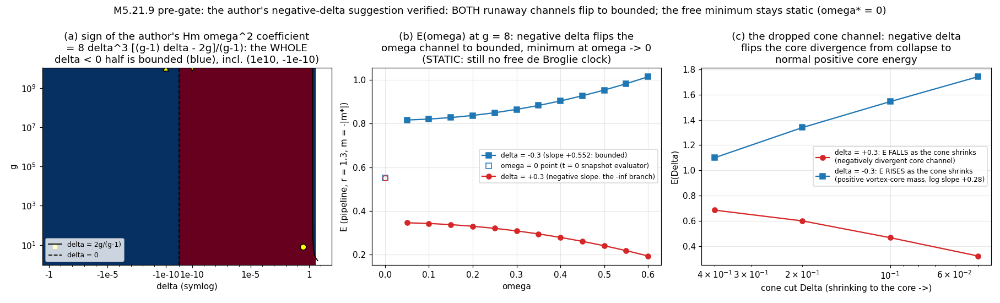

# M5.21.9 pre-gate note: the negative-delta suggestion, verified

**Status**: ✅ VERIFY-FIRST PASS COMPLETE + AUDITED 2026-07-20 (7/8 CONFIRMED + 1 nuance adopted, 0 refuted, § 6). Trigger: the author's reply 2026-07-19 14:53 ([`../tasks/m5_21_convo.md`](../tasks/m5_21_convo.md)) suggested the Minimize region routed to minus infinity ("0 < δ ≤ 2 && g > 1") might instead be bounded "for (g > 1 && δ ≤ 0), so maybe delta should be negative? (not an issue, especially when shifting spectrum)". Per the M5.21.8 verify-first pattern, the suggestion is checked on the already-audited instruments BEFORE anything runs on it. Task home: [`../tasks/m5_21_9_task_details.md`](../tasks/m5_21_9_task_details.md). Base verification: [`m5_21_8_note.md`](m5_21_8_note.md). Standard: [`METHOD_NOTE.md`](../../../../../dev_docs/METHOD_NOTE.md).

## 1. Equations first

The object is the author's Out[54] density at m = m\*(g) = ½ ln((1+g)/(g−1)) (transcription audited in M5.21.8):

```text
Hm(g, d, r, w) = 4 d^2 [ -2 g (d-1) d w + d^2 w + g^2 (2 + (d-2) d w) ] / ((g-1)^2 r^2)
with  w = -1 + 2 r^2 omega^2          (d = delta; LINEAR in w, hence linear in omega^2)
```

The omega^2 coefficient factors EXACTLY (new here, one line of algebra):

```text
T(g, d) = -2g(d-1)d + d^2 + g^2 (d-2) d  =  (g-1)^2 d^2 - 2g(g-1) d  =  (g-1) d [ (g-1) d - 2g ]
C(g, d) = 8 d^2 T / (g-1)^2             =  8 d^3 [ (g-1) d - 2g ] / (g-1)
```

**Sign law at g > 1: C > 0 iff d < 0 or d > 2g/(g−1).** The author's suggested condition (g > 1 && δ ≤ 0) is exactly the near-vacuum half of the bounded region: the suggestion is RIGHT at the branch level. And because Hm is linear in omega^2, wherever C > 0 the free minimum sits at **omega\* = 0 exactly**, with value equal to the author's own Out[51] finite-branch formula at the static point.

## 2. Equation-to-code map

| Piece | Code |
| --- | --- |
| The verify pass N1-N8 (factorization, sign map, pipeline probes, linearity, corner, m-scan, shift invariance, cone channel) | [`m5_21_9_a_negdelta.py`](https://github.com/openwave-labs/openwave/blob/main/openwave/xperiments/m5_liquid_crystal/research/scripts/m5_21_9_a_negdelta.py) (imports the audited M5.21.8 pipeline) |
| The independent adversarial audit | [`m5_21_9_a_audit.py`](https://github.com/openwave-labs/openwave/blob/main/openwave/xperiments/m5_liquid_crystal/research/scripts/m5_21_9_a_audit.py) |
| The summary panel | [`m5_21_9_b_negdelta_panel.py`](https://github.com/openwave-labs/openwave/blob/main/openwave/xperiments/m5_liquid_crystal/research/scripts/m5_21_9_b_negdelta_panel.py) |
| Data | `data/m5_21_9_negdelta.json` (N1-N8), `data/m5_21_9_negdelta_audit.json` (verdicts) |

## 3. Verdicts

| Check | Result |
| --- | --- |
| N1 factorization | ✅ C(g, d) = 8 d³ [(g−1)d − 2g]/(g−1) matches the raw transcription to 1.2e-12 worst over 4000 random (g, δ) samples spanning g ∈ (1.01, 1e10), δ ∈ (−3, 3) |
| N2 the δ < 0 sign map | ✅ POSITIVE at every probed cell of the δ < 0 half-plane (g = 1.5 to 1e10, δ = −3 to −1e-10); the contrast columns (+1e-10, +0.3) stay negative |
| N3 pipeline confirmation (ansatz-level, no formula) | ✅ dE/d(omega²) at m = −\|m\*\|: (8, −0.3): +0.5522 vs formula +0.5585; (8, −0.05): +0.00231 vs +0.00234; (3, −0.3): +0.7048 vs +0.7128; (100, −1e-3): +1.599e-8 vs +1.617e-8: sign flip confirmed at ~1%, the M5.21.8 C2 accuracy class |
| N4 bounded but STATIC | ✅ Hm exactly linear in omega² (resid 2.3e-16); numeric minimum at omega = 0; static value = the author's Out[51] finite formula EXACTLY (0.6611510204081633 both, at (8, −0.3, r = 1)). Pipeline E(omega > 0) linear in omega² to 9.0e-12 with slope +0.552; the omega = 0 evaluator point sits 0.264 off the line because it is a t = 0 snapshot, not a clock-phase average (instrument artifact, documented) |
| N5 the physical corner | ✅ C(1e10, −1e-10) = +1.6e-29 (transcribed and factored forms agree); C(1e10, +1e-10) = −1.6e-29: the corner flips bounded with the sign of δ |
| N6 the m-sector survives | ✅ interior m-minimum at δ = −1e-4: \|m\| = 0.1231 on our scan grid; the audit's finer minimization lands on m\* = 0.1257 to 5e-5 relative (our gap was scan resolution, same as the M5.21.8 C1 lesson). At δ = −0.3: \|m\| = 0.1486 on our grid, 0.1508 on the audit's finer scan (shifted by the odd δ³ term, interior and finite either way; ω-choice moves it only ~5e-4) |
| N7 "shifting spectrum" qualified | ⚠️ the parenthetical is NOT exact on the boosted family: d → d + cI changes M by c·Qb², position-dependent (Qb symmetric, not orthogonal). Invariance holds undressed (m = 0: 4.3e-11) and BREAKS with the boost: 7.5e-5 at m = 0.0013, up to 0.41 relative at \|m\| ~ 0.1. At the physical m\* ~ 1/g the violation is small; at toy m it is order one |
| N8 the cone channel FLIPS TOO | ✅ at (8, −0.3) E(Δ) RISES as the cone shrinks (1.10 → 1.74 over Δ = 0.4 → 0.05, log slope +0.283): the core divergence becomes normal POSITIVE vortex-core energy, where at +0.3 it was the negatively-divergent collapse channel (M5.21.8 C4: 0.686 → 0.324). Parameter disclosure (audit-flagged): the N8 ladder ran at the instrument default r = 1.0 while N3/N4 probed r = 1.3; the audit reproduced the flip at BOTH r. Audit extension: the +0.3 side crosses ZERO (E(Δ = 0.01) = −0.0226), and the −0.3 side follows E ≈ +0.28 ln(1/Δ): bounded BELOW, with the total core energy log-divergent until a core cutoff is chosen (normal vortex physics: the regularization carries positive mass) |



## 4. The reading

| What negative δ buys | What it does not buy |
| --- | --- |
| BOTH unbounded-below channels of the toy analytics flip to bounded: the omega runaway (C > 0 on the whole δ < 0 half-plane, including (1e10, −1e-10)) AND the dropped cone term (positive core mass instead of collapse). The δ < 0 family is the first regime where the author's construction is bounded BELOW without a rescue; the core stays log-divergent until a cutoff is chosen, so the regularization still sets the (now positive) core mass: the author's "regularization ... carries mass or density from potential" becomes literal there | The de Broglie clock. Hm is exactly linear in omega², so the free minimum in the bounded region is omega\* = 0: STATIC. The finite NONZERO omega (omega = mc²/ħ) still does not come out of free minimization anywhere in the (g, δ) plane, either sign of δ. The constructive route remains constraint-carried omega (fixed-J, the author's own "maybe enforced if numerical problems remain"), where the Larmor acceptance test attaches: fork (c) is unchanged as the recommendation |

Nuance for the reply: the author's "not an issue, especially when shifting spectrum" needs the N7 qualification: spectrum shifts are exact only on the undressed (orthogonal) family; the boost dressing breaks them at toy m (order one at \|m\| ~ 0.1), restoring only as m → 0. So negative δ is a genuinely DIFFERENT variational family, not a relabeling: which eigen-slot carries the vacuum matters to the boosted energy.

## 5. Not computed

| Item | Why |
| --- | --- |
| The δ < 0 family on the certified 4D lattice (E(m) landscape, kin sign, relax survival) | that is M5.21.9-proper territory; runs when the author's full fork answer lands (the reply closes "Will study further in the morning") |
| The decay arena at δ < 0 (does the M5.21.6 census / two-loop count change?) | same gate; the M5.21.10 stub carries the two-loop read |
| Pipeline probes at the corner (1e10, −1e-10) | formula-level only (N5); the pipeline probed g = 3, 8, 100 (finite-difference conditioning at g = 1e10 needs its own instrument design, the standing Q33 obstacle) |
| The omega(r)-profiled family, Larmor | post-fork, unchanged |

## 6. Audit

Independent adversarial audit (cardinal rule): second agent, own implementation (no imports from the task script), tries to refute N1-N8 as claims CL1-CL8. Script: [`m5_21_9_a_audit.py`](https://github.com/openwave-labs/openwave/blob/main/openwave/xperiments/m5_liquid_crystal/research/scripts/m5_21_9_a_audit.py); verdicts: `data/m5_21_9_negdelta_audit.json`.

| Claim | Verdict | Detail |
| --- | --- | --- |
| CL1 the factorization | ✅ CONFIRMED | exact polynomial identity with denominators cleared (factors multiplied out in code, not hand-copied); 400 exact-Fraction random points, 0 mismatches; a tampered-coefficient negative control is correctly detected; the threshold δ = 2g/(g−1) gives coefficient exactly 0 |
| CL2 the δ < 0 half-plane | ✅ CONFIRMED | exact rational arithmetic on a 6×8 grid incl. (g = 1+1e-9, δ = −1e-30): all positive; the corner exactly +1.60000000024e-29 vs −1.60000000008e-29 at the mirror; the exact sign law extends the grid to the whole half-plane analytically. Float64 at the corner is NOT fragile (no catastrophic cancellation; the bracket terms differ by 10 orders) |
| CL3 linear in ω², static minimum | ✅ CONFIRMED | exact second differences in ω² vanish (30 Fraction draws); the Hm(ω = 0) numerator equals the Out[51] numerator as exact polynomials; the instance is exactly 80991/122500 = 0.6611510204081633 on both sides |
| CL4 pipeline slope signs | ✅ CONFIRMED | independent slopes +0.55224277 / +0.00230949 / +0.70479603 / +1.5988e-8 match ours to ~1e-9 relative; probe-pair choice ((0.1, 0.5) vs (0.3, 0.6)) shifts the slope by only 2e-9 |
| CL5 linearity + the snapshot artifact | ✅ CONFIRMED | residual 2.6e-12; an independent static phase-average evaluator equals the fit intercept to 3e-12, so the ω = 0 offset (−0.2643) is exactly the snapshot-vs-phase-average gap claimed |
| CL6 the m-sector | ✅ CONFIRMED + sharpened | finer minimization: the δ = −1e-4 minimum IS m\* to 5e-5 relative; δ = −0.3 lands at 0.1508; both adopted into § 3 N6 |
| CL7 shift breaking | ✅ CONFIRMED | M(d + cI) − M(d) = c·QQᵀ verified to 2.2e-15; QQᵀ position-dependent (defect 0.30 at m = 0.1); H invariant at m = 0 to 5.5e-11; violation grows monotonically 8.0e-5 → 0.69 over m = 0.0013 → 0.1 |
| CL8 the cone flip | 🔶 NUANCE adopted | all rungs reproduced to <1e-5 and both directions confirmed at both r, but the N8 numbers sat at r = 1.0 while N3/N4 used r = 1.3, an undocumented switch (now disclosed in § 3 N8); the audit's zero-crossing and log-slope extensions adopted there too |

Audit extras adopted: the exact r-structure E(r, ω) = S/r² + K·ω² with K r-independent (so the formula-pipeline agreement is not an r coincidence and the linearity is structural: the time derivative enters only as ω·d/dα); the stable 1.12% pipeline-vs-formula slope gap at every probe is the finite cone-cut (Δ = 0.15) angular truncation, not noise.
