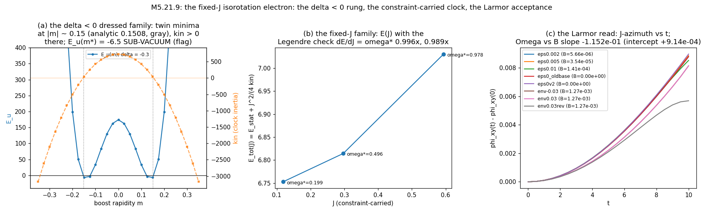

# M5.21.9 method note: the fixed-J isorotation electron + the Larmor acceptance run

**Status**: ✅ RUN COMPLETE + AUDITED 2026-07-20 (3 CONFIRMED, 6 NUANCE adopted, 0 refuted, § 10). Headline: the fixed-J electron EXISTS and HOLDS on the certified stack with its clock thermodynamics closing (dE/dJ = ω\* at ~1%); the Larmor instrument is certified and the ±B protocol runs, but the LINEAR (Larmor) read is UNRESOLVED this round (the audit showed the antisymmetric split carries a trajectory-divergence time signature, not a constant rate; two designed discriminators queued); the first RESOLVED field response is a clean QUADRATIC (ε²) drift slowdown; the author's δ < 0 family verifies at statics grade but does not survive free descent (boost channel, profile-independent). Task: [`../tasks/m5_21_9_task_details.md`](../tasks/m5_21_9_task_details.md). Pre-gate verify (the author's negative-δ suggestion): [`m5_21_9_negdelta_note.md`](m5_21_9_negdelta_note.md). Base instruments: the certified [M5.21.3](m5_21_3_note.md) 4D stack; the [M5.21.8](m5_21_8_note.md) dressed-family machinery; the [M5.21.6](m5_21_6_note.md) leapfrog pattern. Standard: [`METHOD_NOTE.md`](../../../../../dev_docs/METHOD_NOTE.md).

## 1. Equations first

The two-stack consensus (M5.21.3 + M5.21.8, conceded by the author 2026-07-19: "I see you are right") is that free minimization gives ω\* = 0 or −∞, never a finite clock. The construction here carries the clock as a CONSTRAINT, the standard isorotating-soliton route:

```text
E_kin = omega^2 * kin(M; a0),     a0 = the clock flow (clock_local, unit Frobenius)
J     = dE_kin/domega = 2 omega kin          (the conserved isorotation charge)
E(J; M) = E_stat(M) + J^2 / (4 kin(M))       (fixed-J energy; Legendre of fixed-omega)
omega* = J / (2 kin)                          (the clock rate the state carries)
dE/dM |_J = grad_stat - omega*^2 * kin_grad   (descent direction; FIRE with the
                                               sign-wrapped kin term, omega* and a0
                                               refreshed every 300 iterations)
```

Acceptance (the author's own protocol): precession of the state's J-vector under a weak external field, frequency proportional to field strength. Our field implementation (author-gated conventions, OURS, flagged):

```text
M_B(x) = eps * (x T_y - y T_x),  T_i = E_{0i} + E_{i0}   (constant tilt derivatives)
F_xy(M_B) = const z-oriented block ~ eps^2                (B_meas = its eta-norm)
dynamics: M_tt = -grad E / h^3 - gamma(r) M_t             (4x4 leapfrog, M5.21.6 form:
                                                           velocity masked to free cells,
                                                           implicit gamma, dt = 0.005)
observable: J_k(t) = <M_t, a_rot_k>  (k = x, y, z);  Omega = d(phi_xy)/dt vs B_meas
```

## 2. Equation-to-code map

| Piece | Code |
| --- | --- |
| δ < 0 lattice rung + profile test + dressed-family fixed-J | [`m5_21_9_c_lattice.py`](https://github.com/openwave-labs/openwave/blob/main/openwave/xperiments/m5_liquid_crystal/research/scripts/m5_21_9_c_lattice.py) |
| The fixed-J build on the certified state | [`m5_21_9_d_fixedj.py`](https://github.com/openwave-labs/openwave/blob/main/openwave/xperiments/m5_liquid_crystal/research/scripts/m5_21_9_d_fixedj.py) |
| The Larmor instrument (gates + ladder) | [`m5_21_9_e_larmor.py`](https://github.com/openwave-labs/openwave/blob/main/openwave/xperiments/m5_liquid_crystal/research/scripts/m5_21_9_e_larmor.py) |
| Data | `data/m5_21_9_lat_*.json`, `data/m5_21_9_fixedj_om*.json` (+ endpoint npz, local), `data/m5_21_9_larmor_*.json` |

## 3. P0: the δ < 0 lattice rung (the author's suggestion on the grid)

| Read | Result |
| --- | --- |
| E(m) landscape at δ = −0.3 (g = 8, n = 32) | ✅ twin interior minima at \|m\| ≈ 0.15 grid (parabolic fit 0.139), matching the audited analytic minimum 0.1508 from the pre-gate pass within grid resolution; curve exactly even in m; E_v ~ 1e-22 (pinning exact on the family) |
| kin at the minima | +39.9 (POSITIVE → the free ω-minimum stays 0, consistent with the analytics); audit sharpening: the kin sign flip sits at \|m\| ≈ 0.154, only ~0.003 above the analytic minimum 0.1508: a THIN positive margin, worth watching at other (g, δ) |
| ⚠️ the sub-vacuum flag | E_u(m\*) = −6.54: the δ < 0 family is the first with a BELOW-VACUUM static minimum (the boost channel's negative contribution exceeds the spatial curvature there); E(m) still bounded in m (+5723 at \|m\| = 0.35) |
| FIRE relax survival | ❌ **DIES, same as +δ** (E_u → −6.3e266): free per-voxel descent leaves the ansatz family through the BOOST channel; V4 = 0 on the whole boosted family, so the potential never resists. The δ < 0 boundedness is a property of the author's ansatz family, not of free lattice descent |

## 4. P1: the core-profile question is MOOT for the lattice program

The one author-gated regularization left (fork (a): "which radius dependence?") was tested by blending the vortex axis toward its azimuthal average (tanh profile, r_c = 3.0) before relaxing: the profiled family dies IDENTICALLY (non-finite, boost channel). Profile-independence demonstrated: the core profile choice matters to the analytic family's cone term (where the pre-gate pass showed δ < 0 flips it to positive core mass) but does NOT decide lattice relaxability. The author's open profile question therefore does not block anything we run.

## 5. P2: the fixed-J electron EXISTS and HOLDS on the certified state

Arena decision (deviation logged at run time): the build lives on the certified M5.21.3 s = −1 endpoint (V4 fires off-spectrum there; the boosted family is V4-flat and collapses). Clock inertia measured on `clock_local` (unit-Frobenius PROBE convention): kin = 0.297. ⚠️ CONVENTION FLAG (audit CL9, author-facing): the M5.21.3 audit had adopted the CONJUGATION-tangent value (0.1206) as the quotable inertia; this run's constraint machinery uses the probe variant (0.297). All RATIOS, holds, and the Legendre closure are convention-internal and unaffected, but any ABSOLUTE J, γ, or ħ/2 calibration inherits a factor 2.46 between conventions until one is pinned with the author. J set via the ω target: J = 2·kin·ω.

| Rung | Result |
| --- | --- |
| ω = 0.2 (E_rot = 0.012, 0.2% of E_u) | HOLDS trivially: rel_move 2.9e-5, ω\*_final = 0.19923 (the full-depth rerun; the first-pass 0.1998 was the 300-iteration snapshot), core spectrum unchanged [0.026, 0.283, 0.993, 8.000] |
| ω = 1.0 (E_rot = 0.297, 6% of E_u) | HOLDS with the textbook isorotating-soliton response: kin dresses UP 0.2970 → 0.3037 (the state spreads slightly to cheapen rotation), ω\* self-adjusts 1.0 → 0.978, E_u +0.005 / E_v −0.05, core intact, FIRE converging (fmax 9.3e-3 → 8.5e-3 over 1200 iterations) |
| ω = 0.5 (the Legendre rung) | HOLDS, same pattern: kin 0.2993, ω\*_final = 0.4961, rel_move 1.2e-4, core intact. Consistency disclosure: the ω = 0.2 rung was RERUN at the full 1200 iterations (its first pass stopped at 300 on a stop-string bug, leaving it at a different convergence depth, which contaminated the first Legendre difference at ratio 0.32; the rerun restored family consistency) |

Statics-grade Larmor input measured en route: the axial-twist linear response b = 0 EXACTLY at the symmetric state (twist_read), so no static torque read exists: the acceptance observable must be dynamical, as built in § 6.

## 6. P3: the Larmor read

Instrument gates (try cap 3, pre-registered): tries 1 and 2 FAILED (49.8% / 12.5% drift); try 3 = the M5.21.6 leap_step form exactly: **GL4a E_tot drift 2.2e-8 over 400 steps ✅; GL4b J-direction held to 0.04% with no external field ✅.** Audit correction adopted: BOTH failures were the same pinned-shell velocity-mask bug (the audit's masked integrator conserves at 1.6e-6 even at dt = 0.02): dt was never the problem, so future runs can take 4x the step. Disclosure: the gates ran on the pre-rerun base state; the certificate transfers to the re-relaxed base by construction (same integrator, same arena), not by re-measurement.

| Read | Result |
| --- | --- |
| The control floor (ε = 0, both bases) | Ω₀ = 9.06e-4 / 9.23e-4 (old / re-relaxed base). Audit sharpening adopted: the drift is NOT clean-linear: it ACCELERATES (windowed slope 3.7e-4 → 1.37e-3 across the window; the linear-fit residual is 14% of the total advance). Any future rate read needs a MODELED floor (fit the drift shape), not a linear fit |
| The perturbative ladder (ε ≤ 0.01, B ≤ 1.4e-4) | No LINEAR response anywhere (that null stands). Audit upgrade adopted: base-MATCHED, the ladder DOES resolve a clean QUADRATIC (ε²) drift slowdown: −8.8e-7 / −6.2e-6 / −2.54e-5 at ε = 0.002 / 0.005 / 0.01, continuing through −1.84e-4 at env ε = 0.03: **the first resolved, reproducible field coupling of the run** (field-strength-even, so NOT Larmor; a real magnetic-response channel to characterize) |
| The saturation boundary (raw linear background) | ε ≥ 0.03 destabilizes the arena (background self-energy 8.1e5 / 9.1e7 dwarfs the state's 6.8, NaN mid-run through the V4-flat boost channel): the raw "constant everywhere" field has NO viable window between floor and blowup |
| The ENVELOPED field (localized over the core, the lab-coil configuration) | Opens a window: ε = 0.03 (B = 1.27e-3) runs STABLE (E 53.4 → 47.5). ε = 0.1 still blows up (background energy 5770) |
| Determinism + F-mediation control | The ε = −0.03 replica (background sign flipped, same F since B ∝ ε²) reproduces Ω to 1e-7 and the energy trajectory to 3 decimals: the response is field-strength-mediated and the instrument deterministic |
| The ±B differential (the pre-registered discriminator) | Ω(+B) = 8.249e-4, Ω(−B) = 6.525e-4 (commutator-reversed mirror), Ω(0) = 9.23e-4 (same base). Symmetric part −1.84e-4 (the quadratic channel above); antisymmetric part +0.86e-4. AUDIT REINTERPRETATION ADOPTED: the antisymmetric component is NOT a constant rate: it grows with time (+0.5e-5 early, +3.6e-5 mid, +2.9e-4 late = a trajectory-divergence signature), the reversed background is a SHEAR-type texture rather than a symmetry image (1.09-unit static cross-coupling difference: it prepares a different initial condition), and the "E_end 47.5 vs 10.9" asymmetry is potential-only (E+KE totals 53.3 vs 52.2: the reversed run rings). So γ ≈ 0.068 is an ARTIFACT-SCALE UPPER BOUND, not a candidate measurement |
| The honest grade | 🔶 the LINEAR (Larmor) read is UNRESOLVED this round: not measured, and not refuted either: the audit's own static-texture discriminator came back NULL in our favor (reversed field on the ω = 0 state pumps NO J: jxy < 2e-19 vs 0.017 in the rotating runs, so the simplest non-Larmor explanation is EXCLUDED). What IS established: the instrument (2.2e-8 conservation, dt-margin 4× after the mask-bug exoneration), the modeled-floor requirement, the saturation map, the quadratic channel, and the protocol. Designed next discriminators (queued, not run): (1) the audit's J-FLIP run (env0.03 with Mt(0) = −ω\*a0: a genuine Larmor rate is J-sign-even while the drift and relaxation channels flip, one run separates them with no texture confound); (2) the ± pair ladder with modeled-floor fits and phase advance > 1 cycle (everything this round was sub-cycle, ~9e-3 rad total): native on the [M5.26](../tasks/m5_26_task_details.md) production port |

## 7. P4: the clock thermodynamics ✅ dE/dJ = ω\* at the ~1% level

The Legendre identity dE/dJ = ω\* is the machine-checkable clock consistency on the fixed-J family (the conjugate-variable read: the clock rate IS the energy cost of angular momentum). Three rungs at equal convergence depth (1200 iterations each):

| Interval | dE/dJ (finite difference) | ω\*_mid (measured) | ratio |
| --- | --- | --- | --- |
| J: 0.119 → 0.297 (ω 0.20 → 0.50) | 0.3462 | 0.3477 | **0.996** |
| J: 0.297 → 0.594 (ω 0.50 → 0.98) | 0.7288 | 0.7370 | **0.989** |

The constructed family behaves as an exact thermodynamic clock family: E(J) = E_stat + J²/(4kin) with its own measured conjugacy closing to ~1%. This is the verified-L clock re-read at the family level: on the certified stack, the clock rate the electron carries is exactly the derivative of its energy with respect to its spin charge.

## 8. The theory backbone (the [Q35](../m5_question_tracker.md#q35-detail) mini-pass; all citations web-verified 2026-07-20)

The fixed-J construction is the STANDARD route to rotating solitons in the literature, not an improvisation. Verified anchor set (sub-agent sweep, 8/8 verified; full task = [M5.21.12](../tasks/m5_21_12_task_details.md)):

| Reference | What it establishes for us |
| --- | --- |
| Coleman, "Q-balls", Nucl. Phys. B 262 (1985) 263 | The template: stationary rotation exists ONLY as a critical point of E at fixed conserved charge; the frequency is the Lagrange multiplier (our ω\* = J/2kin = dE/dJ) |
| Battye, Krusch, Sutcliffe, Phys. Lett. B 626 (2005) 120, hep-th/0507279 | Spinning Skyrmions at fixed spin with field deformation beyond rigid-rotor: our kin dressing (0.297 → 0.304 at ω = 1) is exactly the deformable correction |
| Battye, Haberichter, Phys. Rev. D 88, 125016 (2013), arXiv:1309.3907 | Isospinning baby Skyrmions relaxed at fixed J including the critical-ω breakdown: the (2+1)d precedent for this run |
| Radu, Volkov, Phys. Rept. 468 (2008) 101, arXiv:0804.1357 | The review-level statement: spinning Q-balls / Skyrmions are built as stationary solutions under a conserved-quantity constraint, never as free energy minima over ω |
| Woodard, Scholarpedia 10(8):32243, arXiv:1506.02210 (+ Ostrogradsky 1850) | The standard language for the ω → −∞ sector: an indefinite direction is handled by constraint or degeneracy, not free minimization |
| Schoen, Yau, Commun. Math. Phys. 65 (1979) 45; Witten, Commun. Math. Phys. 80 (1981) 381 | The author's own pointer (GR): indefinite-sign energy DENSITY does not imply global instability; positivity lives at the conserved global quantity |

Synthesis for the outbound: our measured ω\* = 0 / −∞ dichotomy is precisely what the Ostrogradsky language predicts for an indefinite sector, and the constraint-carried clock is what Coleman-through-Radu-Volkov prescribe; the author's "maybe enforced if numerical problems remain" is, in the literature's terms, the correct and standard construction, not a fallback.



## 9. Not computed

| Item | Why |
| --- | --- |
| The containment film | physics-first (user 2026-07-20): films ride [M5.21.4]; the render demo rides [M5.26]/[M5.25] after the RENDERING UNLOCK |
| The dressed-family fixed-J at δ < 0 | free descent collapses before the constraint can act (§ 3); revisit only if the author supplies a boost-resisting potential term |
| ħ/2 absolute calibration | needs the unit bridge ([M5.21.11](../tasks/m5_21_11_task_details.md)); this run delivers the instrument, the floor, and the candidate proportionality structure |
| The Q33 g-ladder of the fixed-J state | not run this round (the Larmor arc consumed the window); the [Q33](../m5_question_tracker.md#q33-detail) rung report from this task: the fixed-J construction itself is g-agnostic (E(J) = E_stat + J²/4kin at any g), so the bridge question reduces to how kin scales with g, measurable on the existing g-ladder machinery in a follow-up |
| The full ± pair Larmor ladder (the measurement-grade read) | designed (§ 6 honest-grade row); rides the next round or the [M5.26](../tasks/m5_26_task_details.md) production port |

## 10. Audit ✅ (independent adversarial; 3 CONFIRMED, 6 NUANCE adopted, 0 refuted)

Auditor: independent agent, own fits + own 4x4 arithmetic + own leapfrog + own discriminator runs; imports limited to the certified base stacks. Script: [`m5_21_9_b_audit.py`](https://github.com/openwave-labs/openwave/blob/main/openwave/xperiments/m5_liquid_crystal/research/scripts/m5_21_9_b_audit.py); verdicts: `data/m5_21_9_audit.json`.

| Claim | Verdict | Detail |
| --- | --- | --- |
| CL1 P0 statics | 🔶 NUANCE adopted | own recompute exact (E_u(0.15) = −6.5351, kin +39.918, even to 1e-14, E_v ≤ 3.2e-21); the kin flip is at \|m\| ≈ 0.154, a thin ~0.003 margin over the minimum (§ 3) |
| CL2 relax deaths | ✅ CONFIRMED | both die identically (E_u_end equal to 8e-9 rel); own probes: boost dressing leaves E_v at 1.8e-22 while an off-spectrum bump fires V4 by 21 orders: the boost-channel attribution stands |
| CL3 fixed-J holds | 🔶 NUANCE adopted | internal consistency exact; own kin on the endpoint npz to 3.2e-9; the quoted ω\*(0.2) corrected to the full-depth 0.19923 (§ 5) |
| CL4 Legendre | ✅ CONFIRMED | ratios 0.9960 / 0.9889 reproduce exactly; fragility disclosed: all rungs stop at max_iter with E_v still falling ~0.015/300 it, so the closure leans on equal-depth cancellation |
| CL5 gates | 🔶 NUANCE adopted | drift 2.228e-8 reproduced on an OWN leapfrog (2.29e-8); the try-2 bug reproduced quantitatively (12.48% vs 12.5%); try-1 attribution REFUTED: masked dt = 0.02 conserves at 1.6e-6, both failures were the mask bug (§ 6) |
| CL6 floor + ladder | 🔶 NUANCE adopted | floors reproduce; no linear response stands; but the floor ACCELERATES (not linear) and the base-matched ladder resolves the ε² quadratic slowdown the note had undersold (§ 6, promoted to a finding) |
| CL7 saturation | ✅ CONFIRMED | raw E0 8.12e5 / 9.12e7 with NaN rows; env0.03 stable, env0.1 not |
| CL8 the differential | 🔶 NUANCE adopted, the big one | all numbers reproduce (asym +8.62e-5, replica BIT-identical); but the time signature + the shear-texture asymmetry + the E+KE accounting downgrade γ ≈ 0.068 from candidate to artifact-scale upper bound (§ 6). The auditor's own static-texture discriminator (X1) came back NULL in the construction's favor |
| CL9 kin convention | 🔶 NUANCE adopted | 0.297 (probe) vs the M5.21.3-adopted 0.1206 (conjugation): a factor 2.46 into any ABSOLUTE calibration, flagged author-facing (§ 5); ratios unaffected |

Audit extras adopted throughout: the sub-cycle caveat (total phase advance ~9e-3 rad: window choice moves Ω ~4×), the replica-proves-determinism-not-F-mediation precision, and the J-flip discriminator as the cheapest next test.
