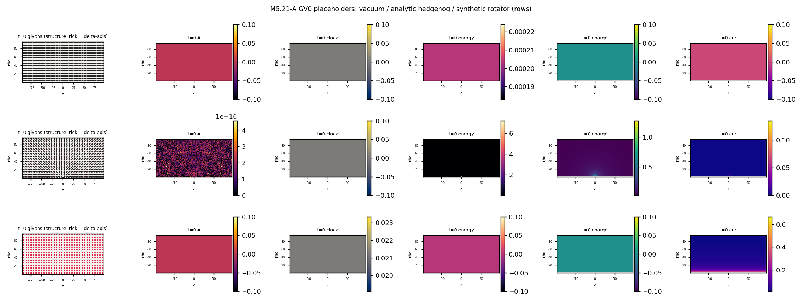
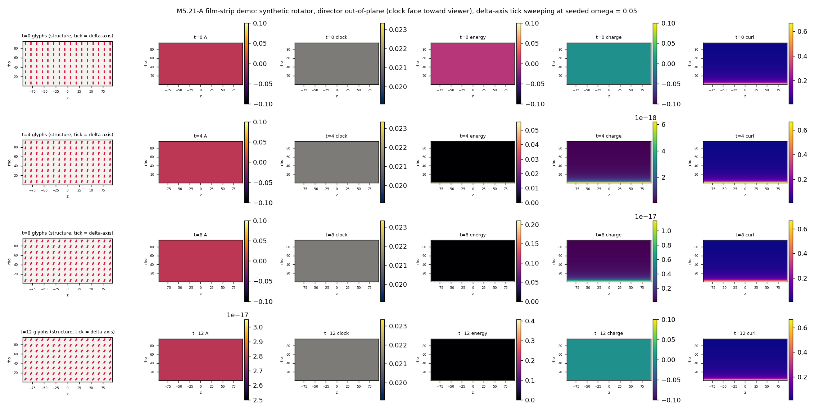
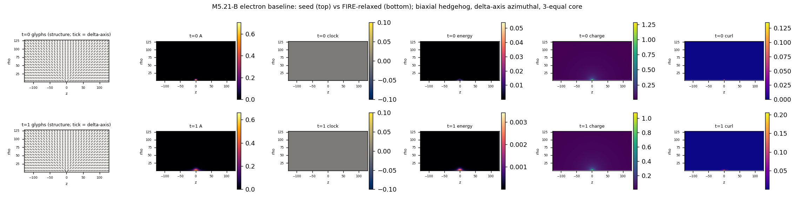
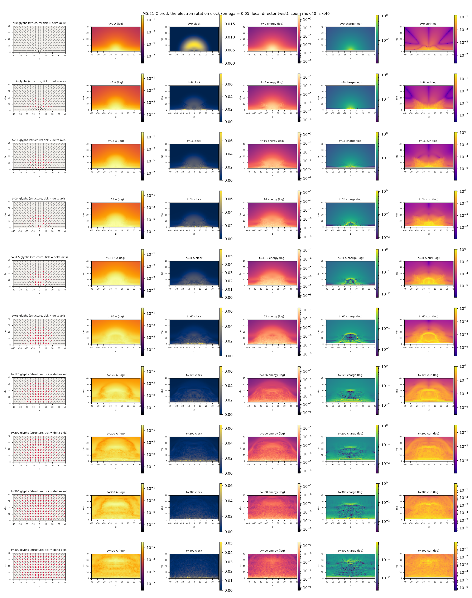
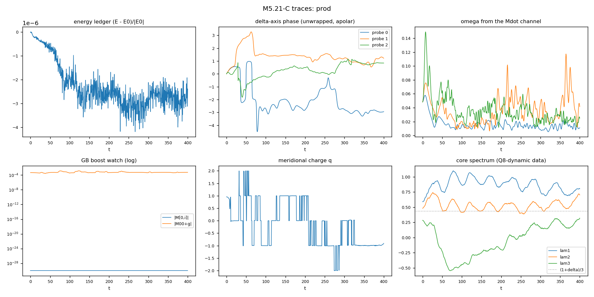
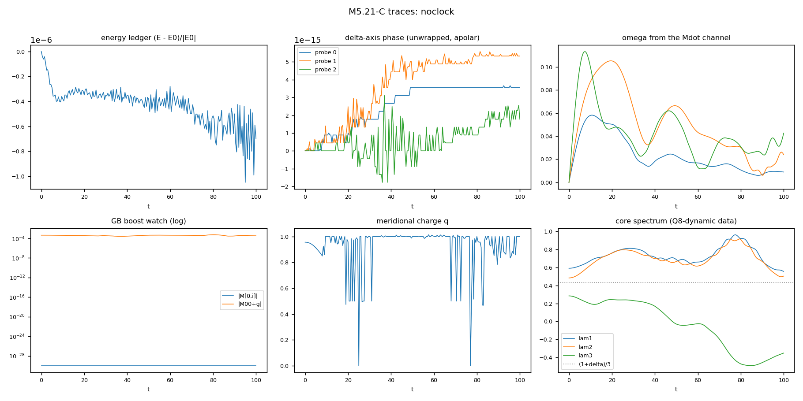
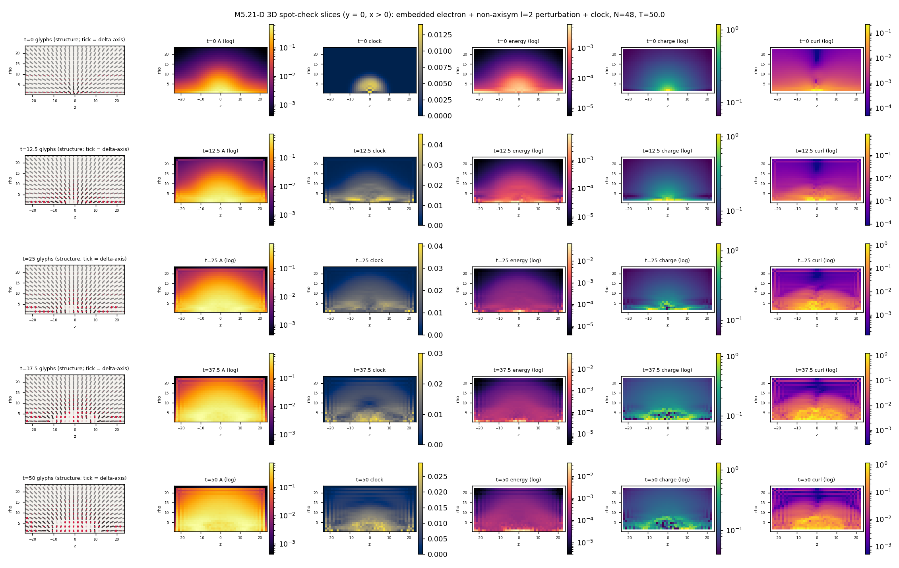
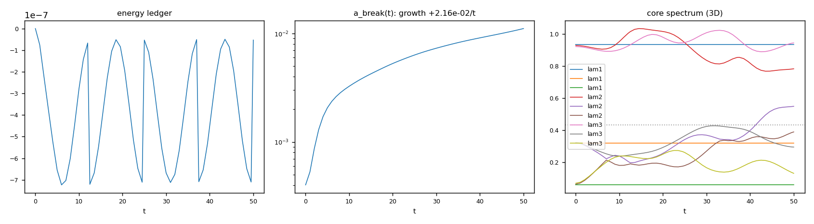

# M5.21: the particle-clock film strip (internal findings)

**Task**: [m5_21_task_details.md](../tasks/m5_21_task_details.md) · Scripts: [`m5_21_a_snap.py`](../scripts/m5_21_a_snap.py) · [`m5_21_b_electron.py`](../scripts/m5_21_b_electron.py) · [`m5_21_c_clockrun.py`](../scripts/m5_21_c_clockrun.py) · [`m5_21_d_3dcheck.py`](../scripts/m5_21_d_3dcheck.py)
**Lineage**: [M5.20.2](../tasks/m5_20_2_task_details.md) (the 4×4 EOM stack + the rotation-sector stability this task rides) · [M5.16](../tasks/m5_16_task_details.md) (Q8: the hedgehog saddle) · [`m5_4b_rendering_features.md`](../tasks/m5_4b_rendering_features.md) (the viz framework previewed here headlessly)

## 1. The snapshot instrument (phase A) ✅

A reusable headless matplotlib panel renderer for axisym (ρ,z) cross-sections (and 3D slices), the 1:1 preview of the future Taichi engine's viz features. API in [`m5_21_a_snap.py`](../scripts/m5_21_a_snap.py): `channel_maps` / `render_panels` / `film_strip` / `clock_phase` / `splay_curl` / `eig_fields`.

| Panel | Observable | Launcher analog |
| --- | --- | --- |
| Glyphs | director segment + the REQUIRED δ-axis tick (middle eigenvector; the m5_4b § 4.1.1 correction: only the δ-axis sweeping shows the clock), grayness = activated V4, fade below an eigenvalue-gap floor | Glyph states 0/1 |
| A | gauge-safe spectral amplitude \|\|λ − λ_vac\|\| | WM2 Amp |
| clock | \|\|Ṁ\|\|_F | WM3 Clock ω |
| energy | u_eta + V4 density | WM4 Energy H |
| charge | director splay \|div n̂\| (apolar-sign-aligned derivatives + defect-relative orientation: the § 3 sign caveat handled) | WM6 EM div |
| curl | \|curl n̂\| (the B analog) | WM7 EM curl |

Both launcher glyph variants (`structure` = unit + single-color, `strength` = magnitude + gradient) are one flag; log color scales for 1/r⁴-type fields; shared norms + zoom for film-strips.

**GV0 (rendering validated before physics, the § 5.3 placeholder pattern), all PASS** ([data](../data/m5_21_a_gates.json)):

| Placeholder | Checks |
| --- | --- |
| Uniform J-commuting vacuum | u_eta exactly 0, V4 spread 0, amplitude 0; director defined everywhere; the δ-tick mask fires on the degenerate (a,a) pair (fraction 0.0) |
| Analytic hedgehog (s = 1) | splay·r/2 err 3.1e-4 (analytic div r̂ = 2/r); u_eta·r⁴/8 err 1.4e-3 (the 8/r⁴ anchor); curl proven truncation-limited (h → h/2 ratio 3.73 ≈ 4, curl/splay 3e-3) |
| Synthetic rotator | δ-axis phase read-back err 1.1e-16 vs seeded; ω from the Ṁ channel err 1.4e-16; multi-frame phase-fit ω err < 1e-9 |

The demo geometry lesson (folded into the instrument): a δ-axis sweeping about an IN-plane director mostly leaves the cross-section, so the tick only shortens; with the director OUT of plane (clock face toward the viewer) the tick visibly rotates. The electron's resting δ-axis is azimuthal (out-of-plane), so its ticks render as dots at rest and appear exactly when the clock runs.

## 2. The electron statics baseline (phase B) ✅ with a finding

The charge defect in the M5.20.2 canonical stack (u_eta + V4 4-target, δ = 0.3, g-timelike, 128×256 axisym): biaxial hedgehog, director radial (the charge winding), δ-axis azimuthal, core seeded 3-equal (a,a,a), a = (1+δ)/3 = 0.4333 (Duda's charge prescription) as the initial guess only.

| Gate | Result |
| --- | --- |
| GS1 descent | ✅ E 21.51 → 11.20 over 12000 FIRE iters, force drop 310× |
| GS2 core spectrum | **measured, two-stage**: seed-adjacent (it 300) the core sits 3-equal ((0.451, 0.429, 0.420), spread 0.044, mean 0.4338 vs predicted 0.4333); the DEEP relax SPLITS it ((0.591, 0.483, 0.284), spread 0.31) while the descent continues without plateau |
| GS3 charge | ✅ q_meridional 0.956 (winding intact through the whole relax) |
| GS4 finite + localized | ✅ E finite; melt r_half 3.5 → 6.5 (spreading); no z-drift (center z = 0.0) |

**The finding (Q8-consistent, axisym scope-boxed)**: the unconstrained V4 statics does NOT hold the 3-equal core; the descent is a slow slide (core splitting + melt spreading at conserved charge), echoing M5.16's Q8 saddle verdict on the LdG hedgehog. Duda's (a,a,a) core appears as the seed-adjacent transient of the statics, not its deep preference. Whether the ROTATION CLOCK changes this is exactly the phase-C question; the noclock control on the same state carries the baseline burden.

## 3. The rotation-clock films (phase C)

GD dt² triage ✅ (ratios 3.92/4.06, production dt 0.02). Four conservative runs from the SAME relaxed state ([log](../data/m5_21_c_runs.log)):

| Run | Seed velocity | T | Ledger | GB (boost watch) |
| --- | --- | --- | --- | --- |
| noclock | zero (the quiet-baseline control) | 100 | 1.05e-6 ✅ | time-mixing exactly 0.0 |
| prod | local ZBW twist about the director, ω = 0.05 (KE 3.47 = 31% of E_static) | 400 | 4.19e-6 ✅ | exactly 0.0 over all 400 units |
| control | global-ẑ conjugation (alternate axis, blindspot 5) | 100 | 1.81e-6 ✅ | exactly 0.0 |
| gentle | local twist, ω = 0.02 (KE 5%: kick-amplitude dependence) | 100 | 1.30e-6 ✅ | exactly 0.0 |

**GB, measured**: rotation-sector dynamics NEVER excites the boost sector (time-mixing stays at exact zero through every run): the M5.20.2 census prediction (rotation K_eff > 0 stable, boosts quarantined) holds on the full electron nonlinearity. The frozen-time-row fallback was never needed.

**GR, split honestly**: the instrument part is exact (ω read from the Ṁ channel at t = 0: rel err 4e-16 at all probes; GV0c already proved the phase read-back at 1e-16). The physics part: the seeded twist is NOT maintained: early-window phase slopes run 25-79% below seeded and the long-run slope ≈ 0 (prod). The δ-frame twist is potential-coupled (restoring torque + differential shear), does ~one apolar sweep, stalls, and radiates: an unconstrained kinetic twist is not a persistent ZBW clock in this stack.

**Kick-amplitude dependence (gentle, ω = 0.02, 5% KE)**: same phenomenology: the twist stalls (early slopes 73-95% below seeded) and the restructuring scales down with the kick (centroid drift 5.0 at T = 100 vs noclock's 4.2 and prod's ~7 at the same t). The stall is amplitude-robust: the kinetic twist is not a persistent clock at any tested amplitude.

**The noclock baseline is NOT quiet (Q8 in motion)**: the statics slide continues dynamically: the core goes exotic (a negative spatial eigenvalue appears: (0.555, 0.504, −0.352) at t = 100), the melt migrates outward (amplitude centroid ρ 2.0 → 6.1), KE concentrates then leaves the core region: yet the far-field winding stays exactly q = 1.000 at every read radius (8-40). The charge is topologically fine; the shape is not static.

**THE HEADLINE: the core rings: the surviving particle clock is the core breathing, not the seeded twist.** In prod the core spectrum oscillates coherently for ~8 cycles over T = 400 (λ1 swinging 0.75-1.1, λ2 0.45-0.75, λ3 −0.55 to +0.3), and the same mode rings in noclock (intrinsic: kicked by the slide itself; the twist only pumps it harder). Frequency, bin-honest: windowed FFT peak 0.1255 ± 0.0078 (prod λ2), detrended sub-bin estimates 0.111-0.116; the analytic activated-face rung of the 4×4 gap ladder is 0.1349. The measured ring sits NEAR but ~15% BELOW the rung, consistent with large-amplitude anharmonic softening (the oscillation is far outside the small-oscillation regime). We do NOT claim bin-exact rung identification. This is the same "internal oscillation as the particle's clock at conserved total energy" theme as the author's 2026-07-12 radius-breathing prediction for the loop, observed here on the hedgehog core.

**Charge reads in the churned region (instrument honesty)**: after the radiation passes, λ1 ≈ λ2 over a wide region, the leading-eigenvector "director" branch-swaps, and the fixed-radius meridional q read flips between ±1 and 0 (prod endpoint reads q ≈ −1 inside r = 20, ≈ 0 at r = 30-40). We do NOT read this as charge inversion or escape: it is the known near-degenerate ambiguity (blindspot 4 at field scale). The clean statement is noclock's: winding q = 1.000 at all radii through the slide. A branch-tracking winding instrument is future work.

**Q8-dynamic verdict (✅ measured, axisym scope-boxed, this stack = the canonical completion)**: the rotation clock as an unconstrained kinetic twist does NOT stabilize the hedgehog saddle: it adds energy that radiates and accelerates the melt restructuring (centroid drift 14 cells at T = 400 vs 4 cells in noclock at T = 100). What persists instead: the topological winding (trivially) and the coherent core-breathing mode. The constrained clock (Duda's energy-minimization dynamics, the M5.20.3 gate) is exactly what M5.21.1 must test: this run defines its comparison baseline.

## 4. The 3D spot-check (phase D) ✅

Full-3D central-diff twin of the static energy (48³, h = 1, boundary pinned), velocity Verlet; the axisym-relaxed electron embedded equivariantly, an l = 2 non-axisym bump (the direction axisymmetry freezes) + the twist clock added, T = 50, dt = 0.005 ([data](../data/m5_21_d_3dcheck.json)).

| Check | Result |
| --- | --- |
| GD3a gradient | ✅ complex-step directional derivative 1.75e-15 (the energy is polynomial in M, so complex-step is cancellation-free; real central differences hit their ~5e-6 roundoff floor at the g⁴ trace scale: measured, documented in the gate) |
| Embedding | a_break (RMS deviation from the state's own azimuthal average) = 2.8e-15 on the clean embed: the equivariant embed is exact |
| Ledger | ✅ 7.2e-7 over T = 50 |
| a_break growth | 4.0e-4 → 1.1e-2 over T = 50; DECELERATING per segment (9.4× → 1.7× → 1.4× → 1.3× per 12.5 units); tail consistent with a slow e-rate ≈ 0.022/t. NO fast non-axisym instability; a slow leak that a longer run must classify (grows-vs-saturates undecided at T = 50) |

**Scope-boxing consequence**: axisym verdicts are safe on T ≲ 50 timescales; the T = 400 axisym story carries the caveat that non-axisym leakage (e-fold ≈ 46 time units IF the tail is exponential) is frozen out. Small-box caveat: the pinned 48³ boundary reflects the radiation back after t ≈ 12; the a_break trend before first reflection (t < 12) is the cleanest reading.

## 5. Reuse map (the rendering-block feeder)

| Asset | Reuse |
| --- | --- |
| `film_strip` / `render_panels` / `channel_maps` | Any 2D cross-section or 3D slice of a 4×4 M state; the headless twin of the launcher panels (WM2/WM3/WM4/WM6/WM7 + glyph states), both size/color variants |
| `clock_phase` + probe-frame pattern | The δ-axis clock read-back for any future run (GR-style gates) |
| `splay_curl` (apolar-safe) + `meridional_charge` | Charge/circulation channels; known limit: fixed-radius q read branch-swaps in churned regions |
| `verlet_3d` + `grad_static_3d` (complex-step-gated) | The full-3D dynamics twin for future 3D production |
| The 2-particle film-strip | The natural next reuse (per the interview outcome) |
