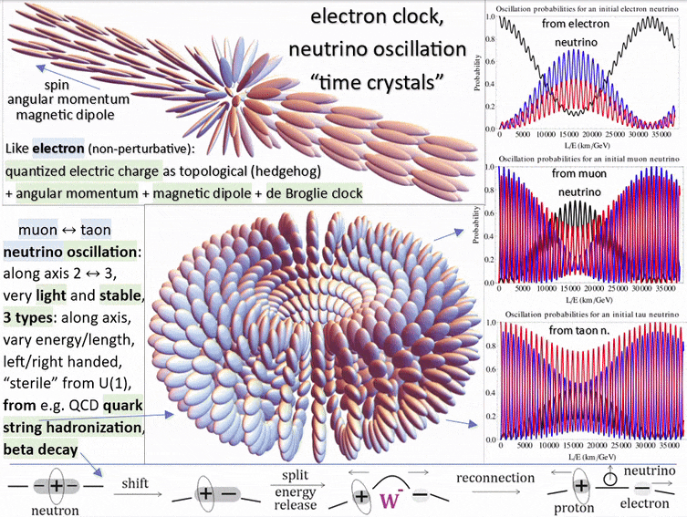

# The M5 particle hunt: shapes measured, identifications hypothesized

The M5.20 and M5.21 series are one hunt with two topologies: a defect whose internal clock persists at contained energy. The SHAPE is what the simulations measure; the particle NAME is the hypothesis riding on it, so the "possibly" stays attached until the anchors land (framing agreed at the M5.21 close-out, 2026-07-14). M5.20's early tasks also built the shape-agnostic machinery both hunts run on (the 4×4 EOM, the analytic gap ladder, the clock census, the audited conservative-dynamics stack).

| Series | What is measured (the shape) | The identification hypothesis | What already supports it | What would firm it up |
| --- | --- | --- | --- | --- |
| [M5.20](m5_roadmap.md) (.1/.2/[.3](tasks/m5_20_3_task_details.md)) | A closed **VORTEX-LOOP** of the (δ,0) winding pair, half-integer, with a measured gap ladder and (so far) no unconstrained protection | Possibly the **neutrino** | The author's own ansatz language (his ellipse diagram, flavor-as-loop-state, the radius-breathing-during-oscillation remark); the M5.11 closed-loop → PMNS lineage; the near-zero rest-energy character of the winding pair | A constrained run where the loop persists, its radius breathes at conserved E_total, and the spectrum lands on the gap ladder (exactly M5.20.3's pre-registered observables) |
| [M5.21](tasks/m5_21_task_details.md) (.1/.2) | A radial **HEDGEHOG** charge defect, 3-equal-melting core, intrinsic core-breathing clock, topological charge that survives everything thrown at it | Possibly the **electron** | The M5.11 Faber electron (511 keV) lineage; the M5.16 parameter-free r_half = 2.926 fm; charge-1 winding robustness measured at M5.21; the M5.21.1 asymptotic structure laws (his 2-equal vortex + 3-equal core exact in the physical limit) | A formulation where the energy is contained and the clock persists: [M5.21.1](tasks/m5_21_1_task_details.md) measured that the bare minimization chain does NOT deliver it at toy parameters (spreading statics, rigid-J killed), so this now waits on the [Q24](m5_question_tracker.md#q24-detail) structure; then the quantum-number checks (the M5.21.3 stub) |

The asymmetry: the electron identification already has quantitative anchors (511 keV, r_half), while the neutrino identification is still structural (right topology, right ansatz, right oscillation story, no calibrated number yet). So "possibly the electron" is currently the stronger "possibly", and M5.20.3's breathing spectrum is the neutrino side's first shot at a number.

**The identification question went public (2026-07-14)**: the author convened Marc, Andras, and Giorgio on models-of-particles ("Fable is now able to model vortex loop - maybe let's try to verify if it is rather electron or neutrino?"), offering to help if convinced the loop is the electron, and naming a discriminator: replace the Lagrangian and try to get Coulomb, as required for an electron ([`tasks/m5_20_convo.md`](tasks/m5_20_convo.md) message 3). This page's tables are the internal scorecard for exactly that debate; note the two camps put DIFFERENT shapes behind "electron" (their vortex loop vs this page's hedgehog), so the discriminating observables (Coulomb tail, 511 keV anchor, charge quantization, oscillation phenomenology) matter more than the shape vocabulary.

**THE HUNT ORDER FLIPPED (2026-07-15/16)**: with the loop-side dynamics measured out at the rigid level (M5.20.5) and the least-action question deferred on his side, the author redirected the program to the electron hedgehog ("which (in contrast to neutrino) has to be stable"; [`tasks/m5_20_convo.md § 2026-07-15`](tasks/m5_20_convo.md)), and the user confirmed electron-first (2026-07-16): **the M5.21 series is the live hunt** ([M5.21.1](tasks/m5_21_1_task_details.md) RAN + CLOSED 2026-07-16: the prescription executed end-to-end; stability fails at toy parameters, rigid-rotation J killed, two scaling laws rescue his structure claims asymptotically; rows updated below); the M5.20/neutrino side is parked (the breathing-BVP stub archived as reserve; his neutrino-aging data request staged as [M5.20.7](tasks/m5_20_7_task_details.md) after the M5.21 series). His aging hypothesis adds a NEW neutrino-side observable class for whenever that hunt resumes: rest-frame radiation → distance-growing energy threshold + final flash (DAMA/LIBRA annual modulation as the candidate signature).

## The Particle-Hunt Scorecard: which shape is the Electron vs. the Neutrino?

Scored against the criteria the author himself laid out (Coulomb as the named discriminator; angular momentum propelled by the negative Hamiltonian terms), using only what the simulations have already measured:

### NEUTRINO HUNT (M5.20 series)

Criteria sources: the defining neutrino properties (no charge, sub-eV mass, spin 1/2) + the **AMBer 9-observable lepton scoreboard** (Baretz et al. 2026, [`../theory/_CITATIONS.md`](../theory/_CITATIONS.md), local `amber_neutrino_flavor_rl.pdf`): 3 charged-lepton masses + 2 mass-squared splittings + 3 PMNS angles + δ_CP, fit against the KATRIN / KamLAND-ZEN / Planck bounds (the charged-lepton masses belong to the flavor-sector fit and ride the oscillation rows here).

| Criterion (what a NEUTRINO must match) | Topology: Vortex-Loop (the M5.20 series) | Topology: Hedgehog (the M5.21 series) |
| --- | --- | --- |
| Zero electric charge / NO Coulomb tail | ✅ measured: the (δ,0) pair winding is chargeless (no monopole flux); far field localized, no 1/r⁴ tail in any run | ❌ monopole-charged: the Coulomb tail is measured (its electron anchor) |
| Near-zero rest mass (KATRIN < 0.45 eV; Planck Σm_ν < 0.12 eV) | 🔶 the near-zero rest-energy character of the winding pair is structural; no calibrated eV number yet | ❌ carries the 511 keV mass anchor |
| Three flavor states + PMNS mixing (sin²θ₁₂, θ₁₃, θ₂₃: AMBer rows 4-6) | 🔶 structural lineage: the M5.11 closed-loop → PMNS ladder (the N4c scorecard = the honest baseline); the author's flavor-as-loop-state ansatz | ❌ no flavor / oscillation story |
| Mass-squared splittings Δm²₂₁ ≈ 7.5e-5 eV², Δm²₃₁ ≈ 2.5e-3 eV² (AMBer rows 7-8) | 🚧 needs a stable oscillation spectrum: NOT REACHED under free EL ([M5.20.3](tasks/m5_20_3_task_details.md)); blocked on the [Q24](m5_question_tracker.md#q24-detail) formulation | ❌ n/a |
| δ_CP (AMBer row 9) | 🚧 the in-model δ_CP fork (180° vs 270°) is flagged; the chiral-term redirect (Q13) pending | ❌ n/a |
| Spin ħ/2 | 🚧 untested (blocked on Q24) | 🚧 same (M5.21.1) |
| Stability (a persistent particle) | ⚠️ unwinds 10/10 in canonical stacks; under the true L the winding NEVER unwinds but the free-EL IVP is ill-posed (Q24) | ⚠️ the charge survives everything; energy containment pending |
| **Candidate Score** | **1✅ / 7** | **0✅ / 7** |

### ELECTRON HUNT (M5.21 series)

Criteria sources: the standard electron observables (charge, mass, spin, g-factor) + the author's named discriminator (Coulomb) and his "negative terms propel electron angular momentum" line. Kept in SYNC with the repo-root [`MODELS.md`](../../../../MODELS.md) coverage matrix (its electron-relevant rows are folded below with their validation links); where the two disagree, this page is the fresher record and wins. Stack qualifier used below: "canonical-stack era" = measured on the pre-verified-L canonical completion (M5.8/M5.21 dynamics); re-establishing those rows under the verified L is exactly the M5.21-series program.

| Criterion (what an ELECTRON must match) | Topology: Vortex-Loop (the M5.20 series) | Topology: Hedgehog (the M5.21 series) |
| --- | --- | --- |
| Charge quantization (−e) | ❌ the pair winding is a chargeless class; its q is a winding along the loop, not a monopole charge | ✅ [validated in-platform] integer π₂ degree; q = 1.000 measured at every radius through the entire M5.21 noclock evolution (and q = 0.500 exact through the M5.20.3 blowups on the loop's own read) [`m5_21_films.md`](findings/m5_21_films.md) · [`m5_21_b_electron.py`](scripts/m5_21_b_electron.py) (the `meridional_charge` instrument) · [`m5_21_c_clockrun.py`](scripts/m5_21_c_clockrun.py) (the GQ gate: q == 1 throughout) · [`m5_20_3_c_production.py`](scripts/m5_20_3_c_production.py) (the loop read); the M5.1-era director-field tracker `m5_1_winding.py` (the MODELS.md row) is the historical first validation, superseded by these |
| **Coulomb far field, "as required for electron"** (named discriminator) | ❌ nothing: the (δ,0)-pair winding has no monopole flux; no 1/r⁴ tail in any run | ✅ [validated in-platform] the far-field curvature energy density is exactly 8c₂/r⁴ (the M5.16 G3/G4 analytic-hedgehog gates) = the Coulomb form; the two-charge run follows E(d) ∝ 1/d with A/64π = 1.07-1.17, sign correct both channels (M5.17, the author's own prescription); quantitatively anchored: c₂ = αħc/64π locked, with α⁻¹ → 137.03 measured from charge quantization (M5.11, the Faber anchor) [`m5_16_report.md`](findings/m5_16_report.md) · [`m5_17_methods_note.md`](findings/m5_17_methods_note.md) · [`m5_16_axisym.py`](scripts/m5_16_axisym.py) · [`m5_17_energy.py`](scripts/m5_17_energy.py) · [`m5_11_n4c_alpha_energy.py`](scripts/m5_11_n4c_alpha_energy.py) |
| Mass anchor (511 keV) + size consistency | ❌ near-zero rest-energy character, which is exactly why it fits the NEUTRINO | ✅ [validated in-platform] 511.00 keV Faber electron at r₀ = 2.2132 fm (M5.11: energy-minimized regularized soliton, non-circular, I = π/4 to 6e-6) + parameter-free r_half = 2.926 fm (M5.16; potential-shape ROBUST at M5.18: 2.935 fm under the author's spectral potential, −4.6% vs Faber's 3.075) [`m5_11_p1_faber_electron.py`](scripts/m5_11_p1_faber_electron.py) · [`m5_16_report.md`](findings/m5_16_report.md) · [`m5_18_verification_note.md`](findings/m5_18_verification_note.md) · [`m5_18_spectral.py`](scripts/m5_18_spectral.py) |
| de Broglie clock (Zitterbewegung) | 🚧 parked with the loop program: no free-period loop clock found (M5.12 BVP search: honest stalls, floor 4.4-5.5× above the molten-clock band) and the rigid-orbit level measured OUT (M5.20.5); the profile-dynamic formulation is deferred with [Q24](m5_question_tracker.md#q24-detail) | ✅ [validated in-platform, canonical-stack era] bounded, self-starting, frequency-RIGID 3+1D time crystal; the clock is the energy-minimizing state (rest energy ≈ 21% below clock-stopped); absolute scale: the geo-mean calibration E·r₀ = α·(π/4)·ħc recovers the electron ZBW to ~13% and, being exactly scale-covariant, extends to every lepton via ω ∝ 1/r₀ ∝ m (#220); freshest read: the M5.21 hedgehog core RINGS intrinsically at ω = 0.1255 ± 0.0078 near the 0.1349 activated rung [`m5_9_lepton_mass_clock_findings.md`](findings/m5_9_lepton_mass_clock_findings.md) · [`m5_8_2u_clock_energy_minimum.py`](scripts/m5_8_2u_clock_energy_minimum.py) · [`m5_8_2z_length_anchor.py`](scripts/m5_8_2z_length_anchor.py) · [`m5_21_films.md`](findings/m5_21_films.md) |
| Stability (a persistent particle) | ⚠️ unwinds 10/10 in unconstrained stacks: neutral until the formulation is fixed | ❌ MEASURED NEGATIVE at toy parameters ([M5.21.1](tasks/m5_21_1_task_details.md), 2026-07-16, audited): under the author's own minimization-first prescription the verified-L hedgehog statics is a SPREADING dilution (48k iters, no convergence, interior, 3D-axisymmetric) and the endpoint is a SADDLE against time-mixing: his "has to be stable" bar fires. Asymptotic rescue measured: the P4 scaling laws land his 2-equal-vortex + 3-equal-core structure exactly in the physical limit (δ ~ 1e-10, g ~ 1e10), so the toy negative does not falsify the physical-regime object; the stabilizer is dynamical (the deferred [Q24](m5_question_tracker.md#q24-detail) least-action structure). The M5.8-era canonical-stack breather precedent (self-starts, holds) stands as era-anchored [`m5_21_1_method_note.md`](findings/m5_21_1_method_note.md) · [`m5_8_2g_spontaneity.py`](scripts/m5_8_2g_spontaneity.py) |
| Angular momentum / spin ħ/2 ("negative terms propel electron angular momentum") | 🚧 untested under the true L (blocked on Q24) | ❌ the RIGID route is KILLED ([M5.21.1](tasks/m5_21_1_task_details.md) P2, audited): no localized rotating equilibrium in the rigid rotation class (low-Ω directional block; Ω ≥ 0.1349 catastrophic centrifugal instability into a deep finite well): "4D minimization → J" does not land through rigid orbits on the hedgehog either (matches the loop-side M5.20.5 kill: object-independent). J, if it lives in L, is profile-dynamic or constraint-carrying: parked with [Q24](m5_question_tracker.md#q24-detail) |
| Magnetic moment g ≈ 2 | 🚧 no channel demonstrated | ⚠️ right-order MEASURED (canonical-stack era, #219): μ via the clock's tilt/precession channel (pure twist is EM-silent, the EID-C mechanism); g = 1.97 at 24³ via the K = 4/α bridge, box ladder [1.97, 2.22] bracketing the measured 2.0023. Caveats: the 4/α bridge is structurally-motivated (not first-principles), μ not box-converged [`m5_8_2za_findings.md`](findings/m5_8_2za_findings.md) · [`m5_8_2za_g_factor.py`](scripts/m5_8_2za_g_factor.py) · [`m5_8_2r_electron_id.py`](scripts/m5_8_2r_electron_id.py) |
| Spin-½ statistics (720° double cover) | 🔶 the apolar mechanism is a property of the ellipsoid field itself (representation-level), but verified only on the hedgehog production seed; not yet read on a loop background | ✅ [validated in-platform] no belt-trick machinery needed: the field is APOLAR (ellipsoids), so a π rotation returns M exactly while the frame needs 2π: one frame revolution = two field periods (the same factor 2 as the ω_M = 2ω_clock rule); machine-exact on the production seed (M(φ+π) = M(φ) to 1e-16, both clock planes) [`m5_8_2s_spin_half_apolar.py`](scripts/m5_8_2s_spin_half_apolar.py) |
| Antimatter (positron) + annihilation | 🚧 loop-antiloop untested | ⚠️ measured with caveats (canonical-stack era + spectral-potential statics): Q → −Q under reflection; charge ledger validated (±1 → Q ≈ ±1; the enclosing sphere of a ± pair → Q = 0, additive) + energy ledger balances (pair rest ≈ 2× H_static); the antipair annihilates in-sim through the melt bridge under BOTH potential shapes (M5.17/M5.18: note the same melt channel is also the single-hedgehog escape route, the Q14 open issue); the 1+1D SG kink+antikink → breather → vacuum trail holds Q = 0 throughout; remaining: the full 3D dynamical capture film [`m5_8_2v_pair_annihilation_budget.py`](scripts/m5_8_2v_pair_annihilation_budget.py) · [`m5_14_sine_gordon_annihilation.py`](scripts/m5_14_sine_gordon_annihilation.py) · [`m5_17_methods_note.md`](findings/m5_17_methods_note.md) |
| **Candidate Score** | **0✅ / 9** | **5✅ / 9** |

Reading the scores: the hedgehog side carries FIVE validated rows (charge quantization, the Coulomb-form tail + α⁻¹ → 137, 511 keV + r_half, the de Broglie clock with its absolute-scale calibration, the apolar double-cover statistics) plus two right-order partials (the g = 1.97 bracket, the annihilation ledgers) versus zero validated on the as-simulated loop side; the neutrino hunt's one measured match (chargelessness) sits on the loop side, with its remaining rows parked with the loop program (the AMBer fit is the pre-registered long-run target). The stack qualifier is load-bearing: the M5.8-era rows (clock, g-factor, statistics, annihilation budget) were validated on the canonical-completion stack, and re-establishing them under the verified L / the author's 2026-07-15 minimization chain is exactly what the M5.21 series is for ([M5.21.1](tasks/m5_21_1_task_details.md)).

**M5.21-series coverage of the not-yet-validated rows** (checked 2026-07-16: every non-validated hedgehog cell has a covering task):

| Electron-hunt row | Status | Covering task |
| --- | --- | --- |
| Charge / Coulomb / mass anchors | ✅ | re-confirmed in passing by the M5.21.1 P0 statics regression (the (-g)^p both-sign gate) |
| de Broglie clock: the verified-L re-read | ✅ canonical-stack era; M5.21.1 P3 adds the twist-sector read: canonical-metric gap ω ≈ 0.10 in the M5.21 ring band, dispersion roton-like (not clean KG) at toy | ran at [M5.21.1](tasks/m5_21_1_task_details.md) P3 (sliding-background caveat); the converged-state re-read waits on the [Q24](m5_question_tracker.md#q24-detail) formulation |
| Stability | ❌ measured negative at toy (2026-07-16); asymptotic structure rescued by the P4 laws; mechanism now BRACKETED by [M5.21.1e](tasks/m5_21_1e_task_details.md) (audited): soft = the paper-anticipated amplitude escape (arrested monotonically by stiffness), hard spectrum-pin = frozen-potential Derrick expansion; the stable window = the Faber virial balance (the M5.16-measured class). **3D-first update ([M5.21.2](tasks/m5_21_2_task_details.md), 2026-07-17, audited 8/8): topological protection REAL but box-fed; the virial balance BRACKETED (0.60 < 1 < 2.47 across wscale ×100/×1) but never landed; the blocker is now the INSTRUMENT/term set (no stencil-consistent minimizer at toy parameters), not the topology** | [M5.21.1](tasks/m5_21_1_task_details.md) ran the bar; [M5.21.1e](tasks/m5_21_1e_task_details.md) explained it; [M5.21.2](tasks/m5_21_2_task_details.md) measured the 3D case ([`findings/m5_21_2_census.md`](findings/m5_21_2_census.md)); the well-posed instrument + term set = [M5.21.2b](tasks/m5_21_2b_task_details.md) (the Q25 discrimination, self-determined) |
| The lepton hierarchy (3 rotation minima) | ✅ first measurement ([M5.21.2](tasks/m5_21_2_task_details.md), audited): three DISTINCT levels among the axis-permutation seeds, electron family LOWEST (A < C < B, cross-instrument robust; orders lattice-contaminated energies, converged verdict waits on the fixed instrument) | [M5.21.2b](tasks/m5_21_2b_task_details.md) I3 (the converged census) |
| The core TYPE: point vs charged ring (the THIRD defect type, Alexander RMP 84, 497 (2012), § IV.B odd-charge loops) | 🔶 instrument-limited TIE at M5.21.2 (ring −3.7% under fwd, +23% under the 2h re-read; same winding sector, far spheres indistinguishable); the synthesis nuance below is now a RUN discriminator, not just an interpretation | [M5.21.2b](tasks/m5_21_2b_task_details.md) I3; the viewing xperiment `_topo_charged_ring.py` renders it in the launcher |
| Angular momentum / spin ħ/2 | ❌ rigid route killed (2026-07-16) | [M5.21.1](tasks/m5_21_1_task_details.md) P2 RAN it; the profile-dynamic route is [Q24](m5_question_tracker.md#q24-detail)-gated |
| Magnetic moment g ≈ 2: verified-L + first-principles bridge | ⚠️ | [M5.21.5](tasks/m5_21_5_task_details.md) (stub created 2026-07-16 as M5.21.3, renumbered 2026-07-17: the 4-observable closure) |
| Spin-½ statistics | ✅ | representation-level, no further task; the loop-side read is parked with the loop program |
| Antimatter: the full 3D capture film | ⚠️ | [M5.21.4](m5_roadmap.md): the antipair arm (added 2026-07-16 as M5.21.2, renumbered 2026-07-17; the ledgers are validated, the film is the remaining item) |

**The synthesis nuance (worth holding; our own data produced it)**: in LC topology a point hedgehog and a small charged disclination ring live in the SAME topological sector: a hedgehog can open into a ring carrying the identical monopole charge. M5.16's Q8 measured exactly that tendency (the point form is a saddle; the melt moves off-origin, toward a ring-like core). So Marc/Andras/Giorgio's "electron = vortex loop" and our "electron = hedgehog" may be two core-regimes of the same charged object. The sharp discriminator is then not loop-vs-point shape at all, it is the WINDING CLASS: monopole-charged (Coulomb tail, our hedgehog/charged-ring) = electron; the chargeless (δ,0) pair loop (no Coulomb, near-zero energy, flavor-oscillation-friendly) = neutrino, which is Duda's loop and the one M5.20 simulates. Under that reading, both camps can be right about "loop" while Duda stays right about which loop is the neutrino.

**The shared missing ingredient (measured, not a hunch)**: containment is exactly what the constraint must buy. In the unconstrained canonical stack the defect's energy is not contained (the statics is a saddle-slide; a kinetic clock kick radiates), while the topological charge and the core-breathing clock survive ([M5.21 findings](findings/m5_21_films.md)). **M5.21.1 (2026-07-16) put the author's minimization-first prescription on the electron and containment did NOT arrive**: the statics spreads, the endpoint is a saddle against time-mixing, and rigid rotation cannot supply J; only the topological charge, the twist-sector gap, and the asymptotic structure laws survive. Both hunts now funnel into the same [Q24](m5_question_tracker.md#q24-detail) missing structure: whatever least-action / constraint formulation the author elaborates must buy containment AND profile-dynamic J at once; "the particle clock creating particle stability" stays the film to make once it lands.
