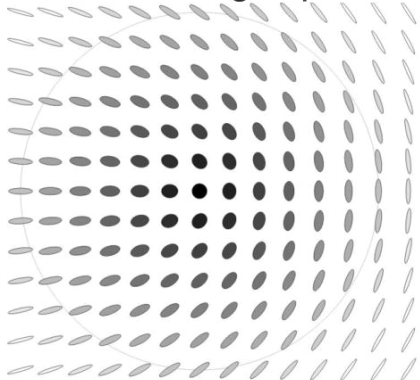
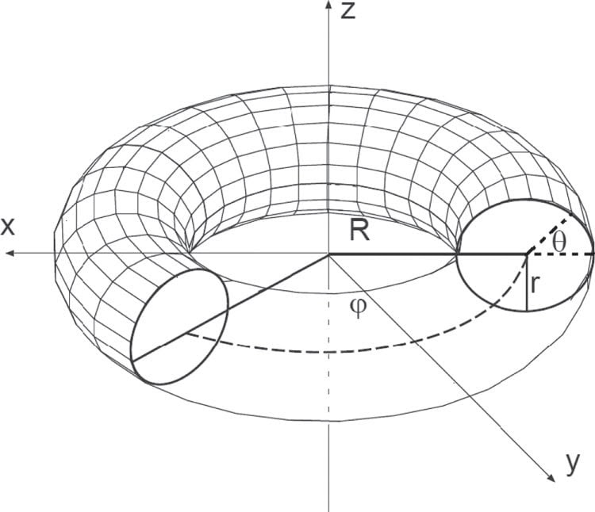

# M5.12 convo record (public channel: GitHub issue #236 + email)

Convention: datestamped entries, verbatim load-bearing lines, then decode + routing. Companion to [`m5_12_task_details.md`](m5_12_task_details.md).

## 2026-07-10 morning: the close note posted to issue #236 (the user's call)

The user posted the full [`m5_12_close_note.md`](../findings/m5_12_close_note.md) as a comment on [openwave-labs/openwave#236](https://github.com/openwave-labs/openwave/issues/236) (2026-07-10 07:13 PDT). This lifted the close-out's "group share HELD" status by the owner's own decision; the § 8 hold record is superseded by this entry.

## 2026-07-10 10:56: Duda's reply (the regularization diagnosis + the torus-construction prescription)

### 1. The reply verbatim (the load-bearing lines)

> Got email that you are running neutrinos again - thanks!
>
> Seems the problem is lack of regularization - e.g. in used ansatz.
>
> Cross-section of topological vortex looks like below: spatial eigenvalues (1, delta, 0) have to deform to have two equal eigenvalues in the center of topological vortex in such cross-section (infinite energy otherwise), what I think should be included in ansatz in a general way [diagram 1]
>
> During neutrino oscillations these eigenvalues can vary, also should mass/energy density per length - for energy conservation also radius R of such vortex loop should be able to vary.
>
> Additionally, there is gravity - tiny boosts of temporal axis, crucial to propel oscillations.
>
> So even choosing the ansatz is quite difficult.
>
> Should be sufficient M(r) with r as radius from center of vortex.
>
> Then rotate it in plane to form topological vortex - beta decay suggests of degree 1, but also might be 1/2 as in above diagram.
>
> Then rotate it to make close loop - let say of radius R [diagram 2: torus (θ, φ) parametrization]
>
> But the field also need to be optimized in the center of such loop.
>
> So finally energy minimization likely should be applied to M(x,z) field with cylindrical symmetry.

### 2. The attached diagrams

### 3. Decode + routing

| Line | Decode | Routed to |
| --- | --- | --- |
| "lack of regularization - e.g. in used ansatz"; eigenvalues (1, δ, 0) must deform to TWO EQUAL eigenvalues at the vortex center (infinite energy otherwise), "in a general way" | the author's diagnosis of the phase-D negative: the background/core ansatz, not the search. Converges independently with the b18 audit's finding that the relax gains live in M0 background adaptation invisible to seed-level shape search. This is a DIFFERENT regularization from the Q14 `aI` core replacement (eigenvalue DEGENERACY as a smooth structural condition, not a value swap) | the M5.19 spec § The construction (its central requirement) |
| eigenvalues vary during oscillation; mass/energy density per length varies; loop radius R must be able to vary (energy conservation) | R is a degree of freedom (none of the M5.12 loop seeds allowed it); ties to the `E = λ·L` phase-E gate | M5.19 spec (R-DOF requirement) + the phase-E inheritance |
| gravity: "tiny boosts of temporal axis, crucial to propel oscillations" | re-affirms the Q19 negative-H/clock intent: the temporal-boost channel is the oscillation propellant, applied ON the regularized minimizer | M5.19 phase ladder (clock phase AFTER statics) |
| the construction: M(r) cross-section profile → planar topological vortex ("beta decay suggests degree 1, but also might be 1/2") → revolve to a closed loop of radius R → optimize the loop-center field too → "energy minimization likely should be applied to M(x,z) field with cylindrical symmetry" | a concrete buildable prescription; the cylindrical-symmetry M(x,z) minimization IS the M5.12 axisym (ρ,z) instrument, which carries over whole. Degree 1-vs-1/2 = a measurable residual (run both) | the M5.19 spec § The construction + phased plan |
| "So even choosing the ansatz is quite difficult." / "Please let me know if something." | the author expects iteration and invites the loop: the basis for the ask-when-gated batched workflow (codified in `_AI_flow.md` + the tracker outbound policy, 2026-07-10) | workflow docs |
