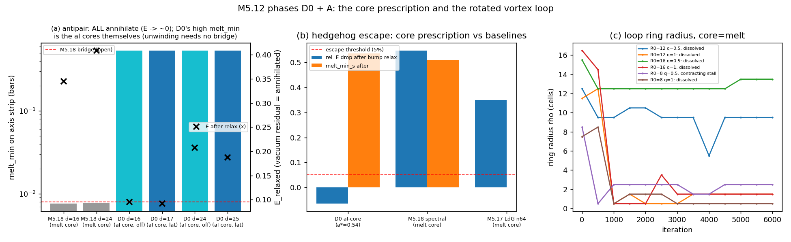

# M5.12: Neutrino vortex-loop at the physical regime (the fresh re-entry)

> Task **M5.12** (M5 / Liquid-Crystal model). Status: **Backlog, READY (all gates green)** · Gated by: ~~M5.16~~ ✅ (delivered 2026-07-02) + ~~M5.17~~ ✅ (delivered 2026-07-04) + ~~M5.18~~ ✅ (delivered 2026-07-05; this task runs on the verified 4D Lagrangian + the spectral potential) + ~~the pre-flight ask round~~ ✅ **CLOSED 2026-07-06** (Duda's two group-cc replies: Q13 redirect + Q14 core prescription + the negative-H intent; § 2026-07-06 spec updates below, full decode [`m5_18_convo.md`](m5_18_convo.md)) · Roadmap: [`m5_roadmap.md`](../m5_roadmap.md)

This doc is the task's full record: planning + findings + future planning + documentation.

---

## Why a new task ID (and not resuming M5.11)

M5.11 is **closed ✅** ([`m5_11_task_details.md`](m5_11_task_details.md)): it answered Duda's 2026-06-22 "too simple" critique with real energy-minimized regularized solitons, banked the electron + `α⁻¹` reproduction, built the AD + chiral machinery, and **precisely isolated** the open frontier (the 2×2 elimination). The re-entry is a genuinely different task: physical `(g, δ, V)` regime instead of placeholders, uniaxial-primary construction instead of biaxial-first, and Duda's pre-flight answers in hand instead of guessed. A fresh ID keeps the Duda-facing surface clean: **everything he needs to review carries `m5_12_`**; the `m5_11_*` corpus stays frozen as the validated evidence behind the closed task, not a pile he must sort through.

## What M5.11 banked (inherited, do NOT redo)

| Result | Where (frozen record) |
| --- | --- |
| Faber's electron reproduced: 511.00 keV at `r₀ = 2.2132 fm`, `I = π/4` to 6e-6, non-circular | `m5_11_p1_faber_electron.py` · [`m5_11b_findings.md`](m5_11b_findings.md) |
| `α⁻¹ → 137.03` from charge quantization (`charge² → 1.00003 e²`) | `m5_11_p1b_dipole.py` |
| Taichi reverse-mode AD gradient == the production functional (E 4e-16, grad 1.8e-13) | `m5_11_ad_energy.py` |
| Chiral Lifshitz + Frank terms built + validated (AD == numpy 1e-14) | `m5_11_p2_heliknoton.py` |
| **The 2×2 elimination map** (5 clean negatives): smooth knots expand, unknotted singular loops contract, painted melts heal; the one un-filled cell = a forced-singular knotted/linked disclination line | [`m5_11b_findings.md`](m5_11b_findings.md) § the full map |
| The PMNS N-ladder honest scorecard: 1 imposed μ-τ symmetry + θ₁₂ pinned-not-selected + θ₁₃ free coupling (`g_chiral* ≈ 0.94`) + CP sign open; masses ~6× compressed; loops not stationary (the foundational gap) | [`m5_10e_findings_N4c.md`](m5_10e_findings_N4c.md) |

## The standing hypothesis (why this task should succeed where M5.11 P2 could not)

All five M5.11 P2 loop experiments ran at the placeholder `δ = 0.3`, where the spatial tensor `diag(1, 0.3, 0)` is **strongly biaxial**; run 3's obstruction was precisely biaxiality (the chiral term drives a blue-phase texture, the Tai/Smalyukh thesis's flagged hard case, p.132). Duda's sketch ([`m5_4f_convo_2026.07.01.md`](m5_4f_convo_2026.07.01.md) § 2) states the neutrino is a **uniaxial** nematic field with **1 distinguished axis** (two vortex types), and at the physical `δ ~ 1e-10` the substrate's spatial spectrum degenerates to quasi-uniaxial `(1, 0, 0)`, exactly the regime where Smalyukh's chiral knots are known stable. **So the M5.11 negatives are regime artifacts until re-tested; only negatives at the physical regime count as verdicts.** The cheap first probe is M5.16 **P-G** (the δ-continuation study, [`m5_16_task_details.md`](m5_16_task_details.md)).

## Entry gates (both must be green before "go M5.12")

| Gate | Delivers |
| --- | --- |
| **M5.16** (the parameter-lock task) | ✅ DELIVERED 2026-07-02: locked `c₂ = αħc/64π` + `(a,b,c)` per β + the calibrated axisymmetric minimizer ([`m5_16_task_details.md § FINDINGS`](m5_16_task_details.md)); P-G read: all four obstruction indicators relax monotonically toward uniaxial (supportive, not sufficient alone) |
| **The pre-flight ask round** (one email to Duda, backed by the M5.16 deliverable) | SENT 2026-07-02; the 2026-07-03 reply audited the methods instead of answering (only Q16 partial: § Ask-round outcome below). The gate is now **[M5.17](m5_17_task_details.md)**: methods note + two-charge Coulomb + the re-ask email; question registry + details: [`../m5_question_tracker.md`](../m5_question_tracker.md) § OPEN QUESTIONS |

## The pre-flight ask round (entry gate 2: the ONE email)

Strategy (Rodrigo, 2026-07-02, recorded in [`m5_16_task_details.md § Comms plan`](m5_16_task_details.md)): deliver first, ask second. The M5.16 deliverable report ([`../findings/m5_16_report.md`](../findings/m5_16_report.md)) leads the email; the five asks follow. ONE email, never a drip; do not ask what we can measure ourselves (Q7/Q8 were delivered, not asked; these five are theory-intent or design-choice questions the minimizer cannot decide). Question registry + full per-question detail: [`../m5_question_tracker.md`](../m5_question_tracker.md).

The ask table (row order = priority; answers feed the phase named in the last column):

| ID | Ask | Why it is critical | Feeds |
| --- | --- | --- | --- |
| **Q13** | Does the M5 LdG substrate carry a chiral (Lifshitz) invariant `2q₀L ε_ikl M_ij ∂_k M_lj` + Frank partner, or is uniform-vacuum achirality intended? Framing: the δ_CP fork (180° pure-SO(3) vs 270° chiral; NuFIT ~212° between) is what this answer decides in-model | Three sectors converge on the ONE term: the CP phase (achiral LdG gives none), θ₁₃ (`g_chiral ≈ 0.94` free until microscopic), loop stabilization (the heliknoton route = Frank + chiral). A "no" reshapes phases A-C and kills the chiral CP story before we build | phases A, C, F |
| **Q16** | The neutrino seed topology: Hopf-linked `+1/2` disclination pair, `+1/2` trefoil, or the `4f` sketch's "two vortex types" composite? | The seed choice is the first line of phase A/C code; the wrong topology class wastes the heaviest compute of the program | phases A, C |
| **Q14** | Hedgehog core, point vs ring: M5.16 measured the spherical hedgehog to be a saddle of the unconstrained functional (perturbed relax −35%, melt moves off-origin). Symmetric hedgehog intended (held by what: Frank term? sixth-order LdG? clock dressing?), or is the ring-core texture acceptable? | Decides whether the calibration's spherically-constrained class is the model's intent; couples to Q13 (the same Frank+chiral pair is the natural point-stabilizer) | phase D + the electron ground state |
| **Q15** | δ-pinning: the quartic trace-LdG cannot be stationary at `(1, δ, 0)` (residual force `3bδ`). Sixth-order invariant intended, or is δ dynamical (his 2026-06-09 remark)? | Decides the vacuum structure the program minimizes toward; `κ_δ = (3/2)b` is the handle either way | the potential every phase minimizes |
| **Q17** | β and g anchor preference: β = b/c un-pinned by the electron sector (`κ_δ = (3/2)b` is its meaning); statics measured g-blind, so g comes from clock/boost or baryon mass. Which anchors first? | Closes the two open slots of the M5.16 lock table | phase E + `#220` |

Not in the email: the δ_CP fork is one framing paragraph under Q13 (not a standalone ask); Q4/Q9/Q10/Q12 are background (later rounds); Q11 is Close's thread.

### Ask-round outcome (2026-07-03) + the spec updates his reply carried

The email went out 2026-07-02; Duda's 2026-07-03 reply audited the report's methods instead of answering (he could not find the potential / Hamiltonian in the code; full exchange + decoding: [`m5_4h_convo_2026.07.03.md`](m5_4h_convo_2026.07.03.md)). The re-ask rides the [M5.17](m5_17_task_details.md) methods note. Per-question state:

| ID | State after 2026-07-03 |
| --- | --- |
| Q13 | unanswered, re-ask with the methods note |
| Q16 | 🔶 PARTIAL ANSWER, banked: "topological vortex rotated cylindrically to make it loop" = build the **single rotated vortex loop first** (phase A/C seed order settled); linked-pair vs trefoil discrimination stays open |
| Q14 | unanswered; his Fig. 9 (arXiv:2108.07896) ansatz reference sharpens what "the symmetric hedgehog" means (the M5.17 conformance check feeds this) |
| Q15 | unanswered; his "search for parameters" framing keeps it live |
| Q17 | weak signal: clock frequency is explicitly on his electron checklist (points at the clock/boost g-anchor path); no direct answer |

Design-note spec updates from the same reply (logged here per the rigor rule, before any build):

| Spec (Duda 2026-07-03, verbatim source in [`m5_4h`](m5_4h_convo_2026.07.03.md)) | Lands in |
| --- | --- |
| Neutrino starting point = "topological vortex rotated cylindrically to make it loop" | phase A/C seed (first object to build) |
| "minimization should give preferred time derivatives defining PMNS matrix to compare with" | phase F observable: PMNS from the TIME DERIVATIVES of the minimized loop, not from static overlaps alone |
| Electron bar = mass + "clock frequency, angular momentum and magnetic dipole" | phase D (clock + stability) picks up the 3 dynamical observables; EID-B/EID-C heritage = the starting points |
| Coulomb anchor = two charges at varying distance (large d anchor, fm-scale running coupling) | consumed by M5.17 phase C; this task inherits whatever the cross-check does to the `c₂` lock |

### 2026-07-04 spec updates (the group energy-conservation threads, [`m5_4i_convo_2026.07.04.md`](m5_4i_convo_2026.07.04.md))

| Spec | Lands in |
| --- | --- |
| **The energy-conserving oscillation gate** (Duda's now-PUBLIC mechanism: mass = energy density per length; the loop conserves total energy by changing length while rotating among the 3 axes): pre-register the constraint `E = λ_axis(i) · L_i = const` → length ratios `L_i ∝ 1/λ_i`; the relaxed oscillation must trace that trajectory with `E(t)` conserved | phase E (the mass/length-density map is now THE primary candidate, not one of two) + phase F (the `E(t)` gate along the SO(3) rotation) |
| **The 6.2 pm lab anchor** (Nature s41586-024-08479-6, neutrino wavepacket spatial extent; treat as a lower limit ≥ 6.2 pm) | phase E absolute-scale target; candidate closer of the β lock slot via `κ_δ = (3/2)b` (Q17) |
| **Faber's acceptance spec** ("must NOT be stable solitons, but must oscillate between three stable states"; replicate the SM mechanism: 3 eigen-configurations propagating independently, the flavor state = their oscillating mixture) | phases D/F acceptance criteria: the 3 axis-aligned loops = stable eigen-configurations; the produced flavor object = a rotating superposition; each eigenstate stationary, the mixture oscillating |
| **Urgency note**: Duda publicly cites "AI-written simulations" as confirming the mechanism, but the validated record is one step behind (M5.11 loops not stationary; PMNS numbers placeholder-δ era; the length-varying trajectory never simulated) | the physical-regime run + provenance-labelled scorecard protect the claim he has already made in public; schedule weight accordingly |

### 2026-07-05 spec updates (Duda's reply to the M5.17 method note, [`m5_17_convo.md`](m5_17_convo.md))

He confirmed the static 3D functional verbatim (audit PASS; the M5.16 lock now sits on an owner-signed-off energy, no retroactive change to any static number) and issued two 4D specs that are PRE-CONDITIONS for phase D (clock dynamics) and any later gravity-sector work:

| Spec (Duda 2026-07-05, verbatim source in [`m5_17_convo`](m5_17_convo.md)) | Lands in |
| --- | --- |
| **4D potential minimum `(g, 1, δ, 0)`**: "For 4D, required to add clock and gravity, potential needs to have minimum (g,1,delta,0)" | phase D pre-condition: extend V from `M_sp` to the full 4×4 M with enough independent invariants to pin 4 distinct eigenvalues (generically Tr M through Tr M⁴); the p.11 anchor hints (`g⁴ ~ 1e38`, `δ² ~ ħc`) become coefficient constraints (Q17). Any functional change re-runs the M5.16 gate suite first (the calibrated-instrument rule above) |
| **Signature commutator in 4D**: "[A,B] = A xi B - B xi A for xi = diag(-1,1,1,1)" | phase D kernel: mandatory the moment time derivatives or time-mixing textures enter (the ψ clock). Static fields are ξ-blind (zero time block in every ∂M, verified in [`../scripts/m5_17_energy.py`](../scripts/m5_17_energy.py)), so this changes dynamics only |

His SECOND 2026-07-05 reply ([`m5_17_convo.md`](m5_17_convo.md) entry 2) then went further and created the gating task **[M5.18](m5_18_task_details.md)**; what this task inherits from it:

| Spec (Duda 2026-07-05b) | Lands in |
| --- | --- |
| **The universal spectral potential** `V(M) = Σ_p (Tr(M^p) − c_p)²`, `c_p = Σ_i Λ_i^p`, targets `(1,δ,0)` 3D / `(g,1,δ,0)` 4D: supersedes the quartic LdG; β = b/c dissolves | EVERY phase minimizes this potential once M5.18 phase B validates it (gate suite + recalibration); the phase-E `κ_δ = (3/2)b` anchor equation is retired with the LdG form |
| **The explicit 4D Lagrangian** `L = −Σ F_{μναβ}F^{μναβ} − V(M)`, η-raising everywhere, + his Hamiltonian via Legendre: verification delegated to the agent ("nobody else has checked it. Should be used if it is right") | phase D runs the clock on the VERIFIED Lagrangian/Hamiltonian only. ✅ M5.18 DELIVERED 2026-07-05: both claims verified; phase D MUST handle the three qualifications ([`../findings/m5_18_verification_note.md`](../findings/m5_18_verification_note.md)): degenerate Legendre map (constrained evolution), covariant vacuum `diag(−g,1,δ,0)`, and the INDEFINITE boost-texture sector (negative-energy channel on the vacuum manifold: evolution can fall into it; owner-intent question out in the reply email). `r_half` potential-shape robustness (0.3%) means the calibrated instrument behaves identically under the swap |
| "can use delta=0 for uniaxial approximation without QM" | phase A/B seeds: the uniaxial construction is the honest δ=0 approximation; the δ≠0 (QM) sector needs the exact `(1,δ,0)` pin the new potential provides |
| **Faber running-coupling benchmark** (2026-07-05 public group post, [`m5_17_convo.md`](m5_17_convo.md) entry 3: he cited Universe 11/4/113 + arXiv 2604.12021 as the reference bar and reposted our `m5_17_two_charge.png`) | any running-coupling or fm-scale interaction claim this task makes (phase E scale work, phase F observables) is benchmarked against Faber's curves EXPLICITLY, overlay not asymptote-only; the group-public standing of the M5.17 readout raises the provenance-label bar |

### 2026-07-06 spec updates (Duda's two replies to the M5.18 email: THE ASK ROUND CLOSES)

His 2026-07-06 replies (now group-cc'd to models-of-particles; full decode + verbatim: [`m5_18_convo.md`](m5_18_convo.md)) close the pre-flight ask round. Every remaining unknown is either answered, banked, or routed to a phase-D-only gate. The consequences reshape the phase plan:

| Spec (Duda 2026-07-06, verbatim source in [`m5_18_convo`](m5_18_convo.md)) | Lands in |
| --- | --- |
| **Q13 REDIRECT**: the LC chiral Lifshitz + Frank pair "might not translate here ... just focus on consequences of chosen LdGS Lagrangian - with different Lorentz-invariant Skyrme-like term and finally extended to 4x4 tensor" | **Phase A as planned (uniaxial heliknoton via Frank + chiral) is DEMOTED**: a heliknoton needs the cholesteric chiral term, which is now unsanctioned physics; keep it at most as a numerical scaffold, never a headline. The primary construction becomes the Q16-banked **single rotated vortex loop** under the sanctioned functional, with stabilizer candidates in priority order: (1) the Q14 core prescription (below), (2) a **Lorentz-invariant Skyrme-like term** (a MEASUREMENT: which term, what coefficient; the M5.8 N-5 invariant matrix already has a Skyrme candidate, "Skyrme damps"), (3) the clock dressing. Phase F: the δ_CP fork leans **180°** (no sanctioned chirality source); `g_chiral ≈ 0.94` reverts to a free-fit label unless a Skyrme-like source reproduces θ₁₃ |
| **Q14 ANSWERED as a CONSTRAINT**: "constraining centers in lattice points, replacing central value with 'M = a I' (3D), or in 4D (g', a,a,a) eigenspectrum"; static Coulomb centers fixed at lattice points, `(g', a)` optimized; "denser lattice, or some FEM" for small distances | **NEW phase D0 (first measurement of the task, cheap, runs before any loop build)**: re-run the M5.18 melt-channel pair (hedgehog perturbed relax + antipair) with pinned centers AND the replaced `aI` core value, optimizing `(g', a)`. The M5.18 runs pinned cores but did NOT replace the central value, so this is a genuinely untested prescription: if the channel closes, defect stability is solved by constraint and the loop core gets the same treatment; if not, the Skyrme-like-term measurement moves up. Either outcome is reportable to the group |
| **Negative-H channel INTENDED** (M5.18 back-question 3 answered): needed for "oscillations of resting electron/neutrinos, and boosts for gravitational mass"; instabilities handled by "the least action principle (for e.g. Big Bang - Big Crunch boundary conditions) ... not Euler-Lagrange" | **Phase D formulation directive**: the clock is the stationary point of the 4D action as a **time-periodic boundary-value problem** (relax the action with periodic time BCs), not open-ended time stepping; the negative boost-texture sector is the ENGINE (clock + gravitational mass), not a pathology to constrain away. Converges with resolved Q1 ("time-periodic resonance"). The Dirac constraint analysis (now Q18) is bookkeeping, not a blocker, under the BVP formulation |
| M5.18 back-questions 1-2 unanswered → tracker **Q18** (constraints) + **Q19** (vacuum branches; partial core signal: `(g', a, a, a)` at charge cores = spatially degenerate spectrum with a distinct timelike `g'`) | Phase D gates only; phases A-C (loop statics) are NOT gated by either |
| **Weak sector named**: weak = `SU(2)_LR ~ SO(3)` neutrino 3D rotations; strong = `SU(3)` baryon with twist; Yang-Mills from `∂_μ D` eigenspectrum deformation ("activation of potential") | Phase F framing: the SO(3) 3-axis oscillation run doubles as the model's weak-sector object, so the PMNS scorecard is also the first weak-force deliverable; label accordingly |
| Potential open-by-design ("worth to be open especially for modifications of potential, maybe also adding more kinetic terms e.g. like Skyrme people do") + deeper-level derivation direction (Q9) + SM-correspondence ladder (Dirac → QED → QCD; public issue #197 endorsed) | Instrument stance: the spectral potential is the working instrument, not dogma; any kinetic-term addition (Skyrme-like) re-runs the M5.16 gate suite first (the calibrated-instrument rule). The deeper-level and SM-ladder directions are post-M5.12 program, not this task |

**Phase-plan deltas in one line each** (the phased-plan table below is the 2026-07-05 state; read it with these deltas until the "go" re-plan folds them in):

| Phase | Delta |
| --- | --- |
| NEW **D0** | The core-prescription melt-channel re-run (pinned centers + `aI` / `(g', a, a, a)` core, optimize `(g', a)`): the FIRST measurement, before any loop build |
| A | Demoted from "theory-motivated primary" to optional scaffold (Q13 redirect); the primary seed = the rotated vortex loop (Q16) under the sanctioned functional + the D0-validated core treatment |
| B | Unchanged in spirit (δ-continuation into the biaxial tensor), but from the loop of the new phase A, not from a heliknoton |
| C | The forced-singular knotted/linked backup stays, now on equal footing with the Skyrme-like-term route if D0 + the plain loop both fail |
| D | Formulation = time-periodic action BVP (not IVP time stepping); ξ-commutator + 4D spectral potential as per the 2026-07-05 specs; Q18/Q19 tracked, non-blocking |
| E | Unchanged (mass/length density + 6.2 pm anchor + knot-family spread); `(g', a)` join the anchor bookkeeping (Q17) |
| F | δ_CP fork leans 180°; the run doubles as the weak-sector (SO(3)) deliverable; `g_chiral` labeled free-fit unless Skyrme-sourced |

## PRE-GO CONTEXT PACK (2026-07-07 full-corpus refresh)

A four-agent parallel re-read of the entire M5 corpus (M5.16/17/18 instrument docs + scripts, the M5.11 heritage + scripts, the six convo files 4e-4i + m5_17_convo, the N4c/PMNS findings), consolidated so this file alone carries what "go M5.12" needs. Sources are linked per card; when a number matters, trust the linked source over this digest.

### Card 1: the calibrated instrument (what every phase runs on)

Convention everywhere: `M = O·D·Oᵀ`, `D = diag(g, 1, δ, 0)`, time/g = index 0, `η = diag(−1,1,1,1)`.

| Locked item | Value | Status |
| --- | --- | --- |
| `c₂` (curvature) | `αħc/64π = 7.1618e-3 MeV·fm`, analytic, potential-independent | ✅ carries over to the spectral era |
| Potential of record | `V(M_sp) = w Σ_{p=1..3} (Tr(M_sp^p) − c_p)²`, `c_p = Σ_i Λ_i^p`; electron sector δ = 0 → `c_p = (1,1,1)`; δ ≠ 0 → `(1+δ, 1+δ², 1+δ³)` pins `(1, δ, 0)` EXACTLY (gate S3) | ✅ Duda 2026-07-05; equal weights, per-p weights = the flagged freedom |
| `w` fixing | seed virial balance `w = E_curv/(3·E_pot,w=1)` (Derrick length-scale choice); n96 value 7.2402e-4 | protocol, not physics |
| Scale anchor | `E[M] = m_e c²` at the minimum → `ℓ = c₂·E_sim/m_e` (~0.2494 fm/grid-unit at n96); invariant = `J_half = E_sim·r_half_sim` | ✅ |
| Headline banked | `r_half = 2.935 fm` h-converged (n64/96/128, virial 1.016/1.006/1.003, Richardson from (96,128)), −4.6% vs Faber 3.0754, +0.3% vs quartic LdG: potential-shape ROBUST | ✅ measured |
| δ | `1e-10` 🔶; never fed to floats: E(δ) evaluated as an exact polynomial (Vandermonde order extraction, the M5.16 trick); measured effect −1.5e-10 fractional | working value |
| g | `1e10` 🔶 (`g·δ = 1` hypothesis); statics EXACTLY g-blind (gate G8, rel 0.0); enters only via clock/boost + the 4D `c_p` targets | working value |
| Dynamic range | `g/δ ~ 1e20`: perturbative-δ / exact-polynomial grading / non-dimensionalization mandatory (the N1 graded-precision lesson: the θ13 channel recovered to 9.4e-16 where naive f64 returns 0) | standing rule |

Solver that produced every trusted number: exact equivariant axisymmetric (ρ,z) reduction (cell-centered ρ + mirror ghost, volume weight 2πρh²), central differences, ANALYTIC numpy adjoint gradients (Taichi-AD JIT never completed on this kernel shape, 28 min CPU twice: do not re-tread), mass-preconditioned FIRE cross-checked by CG Polak-Ribière + golden-section (the Golubich/Faber recipe, [`m5_4g_convo_2026.07.02.md`](m5_4g_convo_2026.07.02.md)), grids 96×192 production / 64-128 h-family, convergence = 6 gradient decades + monotone E + virial.

Gate suite (re-run ALL after ANY functional change, the calibrated-instrument rule): G2 gradient vs FD 3.6e-7 · G3 hedgehog density `r⁴d = 8` (0.17%) · G4 shell energy closed form (0.73%) · G5 3D lineage bit-identical · G6 2D==3D at h² (0.27% at h/2) · G7 frame invariance 6e-16 · G8 g-blindness EXACT · S1 spectral gradient 1.1e-9 · S2 spectral vacuum exact · S3 biaxial pinning exact. Code: `run_gates()` in [`../scripts/m5_18_spectral.py`](../scripts/m5_18_spectral.py) + [`../scripts/m5_16_axisym.py`](../scripts/m5_16_axisym.py); records `m5_18_spectral_gates.json`, `m5_16_axisym_gates.json`.

Module import-vs-fork: physics single-source = [`../scripts/m5_17_energy.py`](../scripts/m5_17_energy.py) (curvature, gradients, weights, tail, seeds; import, never re-implement); minimizers/basis = `m5_16_axisym.py`; the spectral trio (`potential_density_spec_np` / `dv_spec` / `energy_gradient_spec_np`) = [`../scripts/m5_18_spectral.py`](../scripts/m5_18_spectral.py); its composition pattern (curvature adjoints + new dV scattered into the spatial block) is the template for ANY further term (e.g. a Skyrme-like candidate).

### Card 2: phase D0 protocol (the first measurement, frozen design)

Re-run the M5.17/M5.18 melt-channel pair experiments with Duda's core prescription; everything else in the design is FROZEN (comparability): perturbed-hedgehog stability (3% Gaussian bump, unconstrained 2D FIRE, 8000 iters, n96×192) + antipair relax (`pair_field` tilt ansatz, d ∈ {16, 24}, 3000 iters, `w` from the calibrated hedgehog run). The ONE change: centers constrained to lattice points + the central value REPLACED by `M = aI` (3D) / `diag(g', a, a, a)` (4D reading), `(g', a)` optimized, instead of the melted `s(r)` core + 2.5h pinned disks. Decision criterion already wired in the JSONs: `melt_min` staying O(1) = channel CLOSED (defect stability solved by constraint; the loop core gets the same treatment); `melt_min → 0.008-class` = channel survives (the Skyrme-like-term measurement moves up). Either outcome is group-reportable. Baseline numbers to beat/compare: LdG antipair E → 0.30-0.59 vacuum residual, bridge `melt_min ≈ 0.008` at both d; spectral identical (0.345/0.409, 0.0076/0.0078); hedgehog escape 35% (LdG n64) / 55% shallow-melt `min_s 0.51` (spectral n96).

### Card 3: seeds + the M5.11 heritage (what exists, what to build, what not to repeat)

Existing seeders (all built for the 4×4 tensor, placeholder δ = 0.3 era): plain `+1/2` disclination ring (`seed_vortex_loop_M`, `m5_11_p2_vortex_loop.py`), smooth Hopfion (`hopf_director`), heliknoton (`heliknoton_director`), forced-melt singular `+1/2` loop (`disclination_loop_tensor`, mode `disc`), painted-melt Hopfion (mode `shopf`), all in [`../scripts/m5_11_p2_heliknoton.py`](../scripts/m5_11_p2_heliknoton.py) with diagnostics (`melt_diag`, `director_ring_R`, localization). The directive seed ("topological vortex rotated cylindrically to make it loop") has the ring seeders as ancestors but needs a NEW build with three changes: (a) **uniaxial** cross-section (the 4f sketch + "δ=0 = uniaxial approximation without QM"; winding class integer-vs-half = the Q16 residual, test both), (b) the **Q14 core prescription** (Card 2), not the tanh melt, (c) the **sanctioned functional** (Card 1), no chiral/Frank. The axisymmetric φ-winding machinery of `m5_11_p1b_dipole.py` (validated −0.024%) is the template for exploiting the loop's cylindrical symmetry.

The 5 M5.11 negatives (2×2: smooth/forced-singular × unknotted/knotted; ALL at δ = 0.3, so regime artifacts until re-tested; only physical-regime negatives are verdicts): plain ring dissolves (6% curvature retained) · smooth Hopfion expands (Derrick) · chiral heliknoton → blue-phase, no stable simple helix in the biaxial tensor (the Tai p.132 case) · forced-melt unknotted loop heals + dissolves, chiral does not help · painted melt heals by iter ~100 then expands. Lessons that survive the regime change: a melt must be topologically FORCED, not painted; an unknotted loop bounds a disk the director combs smooth; any "hold" verdict needs BOTH retention bounds AND a localization check (the run-5 blue-phase false positive, guard `curv_keep > 2.5`); the 4th-order curvature term VANISHES on 1D-varying textures, so any added gradient term needs its own boundedness check (the bare-chiral `E → nan` trap). Full map: [`m5_11b_findings.md`](m5_11b_findings.md).

Taichi-AD engine ([`../scripts/m5_11_ad_energy.py`](../scripts/m5_11_ad_energy.py), validated E 4e-16 / grad 1.8e-13): params via a `ti.field` not f64 args, loops-only kernel body, one differentiable loop per term, symmetrize the spatial gradient block, boundary re-pinned each step; ~6 min recompile per kernel edit (batch edits), f64 CPU. Use for 3D verification runs; the axisymmetric analytic-adjoint path (Card 1) is the production instrument.

### Card 4: the owner-spec ledger (standing gates, deduplicated; full ledger in the convo files)

| Standing spec | Source | Constrains |
| --- | --- | --- |
| Seed = single cylindrically-rotated vortex loop, uniaxial, cylindrical symmetry to reduce dimension | Duda 4f/4e/4h | phases A/B |
| Serious-sim bar: lattice/FEM energy minimization, "not seconds but weeks"; center regularization = the hardest part | Duda 4e | all |
| Electron deliverable bar = mass + clock frequency + angular momentum + magnetic dipole (4 observables, 3 dynamical) | Duda 4h | phase D |
| Faber acceptance: "must NOT be stable solitons, but must oscillate between three stable states"; 3 eigen-configs stable + flavor = rotating superposition | Faber 4i | phases D/F |
| Energy-conservation gate: `E = λ_axis(i)·L_i = const`, length ratios `L_i ∝ 1/λ_i`, `E(t)` conserved along the oscillation (his PUBLIC flagship claim, one step ahead of the validated record: reputationally urgent) | Duda 4i | phases E/F |
| PMNS from the preferred TIME DERIVATIVES of the minimized loop | Duda 4h | phase F |
| Size anchor: neutrino wavepacket ≥ 6.2 pm (Nature s41586-024-08479-6, lower limit) | Duda 4i | phase E |
| g anchor candidates: "maybe g can be obtained from electron clock, neutrino oscillations. Otherwise gravitational mass - certain only for baryons" (a g-value read is an M5.12 OUTPUT slot) | Duda 4e | phases D/E |
| Running-coupling benchmark = Faber's curves explicitly (Universe 11(4):113 + arXiv 2604.12021), overlay not asymptote-only | Duda 2026-07-05 public | any fm-scale claim |
| 4D: spectral potential target `(g,1,δ,0)`; ξ-commutator `[A,B] = AξB − BξA` once time derivatives enter; clock = time-periodic action BVP (least-action stance); negative boost-texture channel = the ENGINE, not a pathology | Duda m5_17 convo + [`m5_18_convo.md`](m5_18_convo.md) | phase D |
| Rigor: "careful small steps, maybe multiple agents verifying each other" (4h); "do less, but more rigorously" (round 2, [`m5_10a_neutrino_oscillations.md`](m5_10a_neutrino_oscillations.md), NOT in the convo files: cite 10a); method note + independent adversarial audit before any outbound; assume public reposting (the thread is group-cc'd, podcast-cc'd) | Duda 4h/10a/m5_17 | reporting |
| Reviewer roster: Faber bowed OUT of neutrinos (electron/EM/Coulomb reference only); Sulich (IF PAN) joined; Golubich sources (`MTF.tex` etc.) are local-only, never in public artifacts | 4i, 4g | reporting |

### Card 5: the phase-F baseline (the honest scorecard to beat, [`m5_10e_findings_N4c.md`](m5_10e_findings_N4c.md))

| Parameter | In-model | Provenance | NuFIT 6.0 NO | Pull |
| --- | --- | --- | --- | --- |
| θ₁₂ | 35.26° (trimaximal) | geometrically PINNED, not energy-selected (`E_self` flat to 0.09%) | 33.68 ± 0.70° | +2.3σ |
| θ₂₃ | 45.00° | CONSEQUENCE of the imposed μ-τ mirror | 43.3 ± 1.0° | +1.7σ |
| θ₁₃ | 8.56° | FREE coupling (`g_chiral* ≈ 0.94`, fit; post-Q13-redirect this label is final unless a Skyrme-like source reproduces it) | 8.56 ± 0.11° | 0 (by construction) |
| δ_CP | 270° (\|δ\| = 90, sign open) | consequence of μ-τ reflection; post-redirect the fork LEANS 180° (no sanctioned chirality source) | 212 ± 30° | consistent |

Gaps phase F must close on REAL relaxed loops: loops were NOT stationary (`dE/dL = +6.74`: overlaps of non-solutions, no well-defined Hessian: the foundational gap, resolved by construction if phases A-C deliver); the Gram-bridge `U = eigvecs(overlap)` is a postulate, test against a true second-variation Hessian; θ₁₂ energy-selection re-test (`dE/dα = 0` at the magic tilt?); μ-τ mirror is an INPUT (is there a deeper reason?); CP sign = loop handedness, undetermined. Mass-compression tension (phase E's target): loop eigenvalues `1 : 1.148 : 1.682` give Δm² ratios 5.8-7.3× too compressed vs the observed 33.6; candidate resolutions = the mass/length-density map (primary) + knot-family spread; if neither spreads it, the compression IS the reported falsifier. The deliverable bar (Duda round 3 verbatim, 10a): "first focus on the basic 4 parameters - if writing convincing article able to pass peer review, this already would be huge."

### Card 6: pre-registered gates per phase (no post-hoc success criteria)

| Phase | Pre-registered gate |
| --- | --- |
| D0 | `melt_min` O(1) after the core-prescription re-runs = channel CLOSED; `→ 0.008-class` = survives. Frozen designs of Card 2; both outcomes reportable |
| A | the rotated uniaxial loop is STATIONARY under the sanctioned functional + D0-validated core: `\|δE/δM\| → 0` (6 gradient decades), finite size (ring R off the box edge), retention AND localization both green (the run-5 double criterion), h-robust at two grids |
| B | the stable object survives δ-continuation to `δ ~ 1e-10` in the full tensor (exact-polynomial grading, never raw f64), or the breaking δ* is MEASURED (a number either way) |
| C (backup) | a forced-singular knotted/linked loop (Machon-Alexander / RMP 2012 parametrization, never improvised) holds finite size under the calibrated functional; triggered only if A/B fail and D0 did not close the channel |
| D | clock as a time-periodic action BVP (ω free, the Track C C3 + Duda least-action convergence); ξ-commutator on; 4D spectral potential `(g,1,δ,0)`; no collapse over many periods; the electron 4-observable bar (mass banked + clock ω + J + magnetic dipole) as the sibling calibration; any added Skyrme-like term re-runs the FULL gate suite first + carries the M5.8 N-5 caution (the measured Skyrme candidate SATURATES but DAMPS the clock 10×: measure, don't assume) + a 1D-texture boundedness check |
| E | mass = regularized loop energy; the `E = λ·L = const` trajectory traced with `E(t)` conserved; `L_i ∝ 1/λ_i` ratios; Δm² hierarchy vs 33.6 honest pass/fail; absolute scale vs the ≥ 6.2 pm anchor; the compression reported as falsifier if unresolved |
| F | the 4 PMNS parameters recomputed on stationary loops, provenance-labelled (derived / consequence / fit) vs NuFIT 6.0; PMNS also from the loop's preferred time derivatives (the owner-specified observable); θ₁₂ selection re-test; Gram vs Hessian; the δ_CP fork DECIDED in-model; the run doubles as the weak-sector (SO(3)) deliverable |

### Card 7: blindspot pass (the unknowns quadrant map, per `_AI_flow.md § Unknowns discipline`)

| Quadrant | Biggest known instance | Route |
| --- | --- | --- |
| Known knowns | the calibrated instrument + the closed ask round (Cards 1-5) | this pack |
| Known unknowns | does the core prescription close the melt channel? which winding class is the loop? does a Skyrme-like term help or damp? | machine-checkable: D0, A, D measurements |
| Unknown knowns | tacit acceptance criteria for "a stable loop" (how long, how converged, what counts as finite size) | pre-registered gates (Card 6) + user reacts to the first D0/A plots before phases E/F spend compute |
| Unknown unknowns | (a) the BVP formulation of the clock is NEW numerics (time-periodic boundary conditions on a 4D action: no reference implementation anywhere, his own words); (b) the negative-energy engine may interact with the minimizer (descent can fall into the intended negative channel and read as "instability"); (c) the 1e20 dynamic range in a LOOP geometry (the M5.16 tricks were derived for the hedgehog); (d) vacuum-branch mixing at the loop core (Q19: the `(g',a,a,a)` core sits in a different branch than the bulk) | deviations log at EXECUTE; adversarial audit on every headline; escalate mid-task if (b) or (d) produces sign-confusing energies |

## Rigor compliance (inherited bar + M5.12-specific)

The full Duda-requirement table, item by item with verbatim sources, is [`m5_16_task_details.md § Rigor compliance`](m5_16_task_details.md): it applies to this task verbatim (energy minimization, cylindrical symmetry where applicable, center regularization, physical-regime parameters, independent benchmarks, article-standard documentation). M5.12-specific additions:

| M5.12 rule | Content |
| --- | --- |
| Physical-regime headlines only | every REPORTED number at the locked `(g, δ, a, b, c)` from M5.16; placeholder-parameter runs are labelled scaffolding, never headlines (the M5.11 lesson: only physical-regime negatives are verdicts) |
| Pre-registered gates per phase | each phase A-F carries its gate in the phased-plan table BEFORE the run (the M5.16 G1-G8/R1-R5 pattern); no post-hoc success criteria |
| Calibrated instrument only | the minimizer + potential come from M5.16 unmodified; any change to the functional re-runs the M5.16 gate suite first |
| Ask-round answers logged | Duda's Q13/Q16/Q14/Q15/Q17 answers land in [`../m5_question_tracker.md`](../m5_question_tracker.md) § QUESTION DETAILS (per ID) AND in this file's phase-A/C design notes before any build |
| Honest scorecard discipline | phase F reports the 4 PMNS parameters provenance-labelled (derived / consequence / fit), the N4c pattern; negatives and the mass-compression tension reported as falsifiers, not buried |
| Multi-agent verification (Duda 2026-07-03b: "careful small steps, maybe multiple agents verifying each other") | every headline number cross-checked by an independent path (two minimizers, analytic-vs-FD, the M5.16/17 pattern) AND the phase-F scorecard + any outbound method note audited by an independent second agent before sending ([`m5_4h_convo_2026.07.03.md § 6`](m5_4h_convo_2026.07.03.md)) |

## The phased plan

Phases lettered A-F (distinct from M5.11's P0-P6 so the two records never blur). The old P5 (parameter search) is gone: M5.16 owns it.

| Phase | What | Gate |
| --- | --- | --- |
| **A / uniaxial heliknoton (the primary route, was fork B)** | reduce to the unit director `n` with Frank `K\|∇n\|²` + chiral `2q₀ n·(∇×n)`; seed the elementary heliknoton (Ackerman-Smalyukh / Tai thesis Fig 6.5) in a helical background; relax at the physical parameters | a stable localized knot (`\|δF/δn\| → 0`, finite size, Hopf index intact), reproducing the KNOWN uniaxial result first |
| **B / map back to the M5 tensor** | walk δ up from the uniaxial limit (the P-G continuation in reverse) and embed the stable knot in the biaxial `M`; find where/whether biaxiality breaks it | the stable object survives at `δ ~ 1e-10` in the full tensor, or the breaking δ is measured (a real number, either way) |
| **C / biaxial-native backup (was fork A)** | only if A/B fail or Duda's answers redirect: the forced-singular knotted/linked disclination line from a literature single-valued ansatz (Machon & Alexander PNAS 2013; Alexander et al. RMP 2012) | a forced-singular knotted loop holds finite size under the calibrated functional |
| **D / stability + the clock** (was M5.11 P3) | Hessian / real-time evolution over many periods; add the M5.8 clock dressing; the SO(3) 3-axis oscillation on the loop (Duda's SO(2)-vs-SO(3) slide, `4e § 3`) | no collapse mode; the clock lowers energy; ω measured |
| **E / masses** (was P4 + the deferred N6) | mass = regularized loop energy; test Duda's **mass/length density** map + the **knot-family spread** (linked pair vs trefoil vs "two vortex types") against the ~6× splitting compression (N4c-2) | `Δm²` hierarchy honest pass/fail; if no map spreads the spectrum, the compression is reported as the falsifier |
| **F / mixing on real loops** (was P6) | recompute PMNS on the RELAXED stable loops; close the N4c gaps: θ₁₂ energy-selection re-test (`dE/dα = 0` at the magic tilt?), the Gram-bridge vs a true second-variation Hessian, `g_chiral` derived not fitted (per the Q13 answer), and the **δ_CP fork decision** (180° pure-SO(3) vs 270° chiral; tracker § δ_CP fork) | the 4 PMNS parameters from solutions of the field equations, vs NuFIT 6.0, provenance-labelled (derived / consequence / fit) |

### Phase F detail: the N4c gap-closure map

| N4c gap ([`m5_10e_findings_N4c.md`](m5_10e_findings_N4c.md)) | Phase F test on real loops |
| --- | --- |
| Q8 loop stability (foundational: overlaps computed on NON-solutions) | resolved by construction (the loops are stationary solutions) |
| Q4 θ₁₂ not energy-selected (`E_self` flat to 0.09%) | re-test `dE/dα = 0` at the magic tilt with the real potential + stable loops |
| Q7 the `U = eigvecs` Gram-bridge postulate | recompute the overlap matrix on solutions; test against a true second-variation Hessian (now well-defined) |
| Q1/Q2 chiral origin of θ₁₃ + CP | if the substrate carries a chiral invariant (per the Q13 answer), derive `g_chiral` microscopically instead of fitting 0.94 |
| the δ_CP fork (180° pure-SO(3) vs 270° chiral μ-τ reflection; NuFIT ~212 ± 30 sits between) | the real-loop mixing decides it in-model; DUNE/HK decide it in nature (tracker § δ_CP fork) |

### Phase E detail: the mass-compression tension

The N4c-2 flag stands as phase E's target: the M5.11 loop spectrum `1 : 1.15 : 1.68` gives splitting ratios ~5-7× below the observed `Δm²₃₁/Δm²₂₁ ≈ 33.6` under both natural eigenvalue→mass maps. Resolution candidates, testable once a stable loop family exists: Duda's **mass/length density** map (oscillation = the loop changing length, his round-3 email), plus a **knot-family spread** (Hopf-linked pair vs trefoil vs the sketch's "two vortex types" as distinct flavour carriers). If neither spreads the spectrum, the compression is reported as the falsifier.

## Script reuse manifest (fork-on-use, at "go M5.12")

Copies, never moves: the `m5_11_*` originals stay frozen as the closed task's evidence. Fork only what a phase actually uses, when it uses it.

| Source (frozen M5.11 record) | Fork target | Used by |
| --- | --- | --- |
| `m5_11_ad_energy.py` (Taichi-AD gradient engine) | `m5_12_ad_energy.py` | A-D (the gradient engine for every relaxation) |
| `m5_11_p2_heliknoton.py` (functional + chiral/Frank terms + seeds + diagnostics: `melt_diag`, `director_ring_R`, Hopf index) | `m5_12_heliknoton.py` | A, B, C |
| `m5_11_p2_vortex_loop.py` (loop seeder + dissolve-vs-stabilize diagnostic) | `m5_12_loop_diag.py` | B, C |
| `m5_11_n4c_*` mixing pipeline (overlap matrix → angles, scorecard) | `m5_12_mixing.py` | F (re-grounded on real loops) |
| `m5_11_p0_minimizer.py` + `m5_11_n1_precision_method.py` | no fork: consumed via **M5.16**, which hands back the calibrated instrument | A-F inputs |
| NEW: the uniaxial director-field reduction (3-component `n`, Frank + chiral, its own relaxer) | `m5_12_uniaxial.py` | A (new code, no M5.11 ancestor) |
| `m5_11_p1b_dipole.py` (axisymmetric φ-winding machinery, validated −0.024%) | template for the rotated-loop cylindrical reduction | A/B (added 2026-07-07 reality check) |
| `m5_11_p2_hopfion.py` (run-2 smooth-Hopfion control) | control re-run at the physical regime if needed | B (added 2026-07-07 reality check; all manifest files verified present on disk) |

## Definition of done

A **stable, regularized neutrino loop at the physical `(g, δ, V)` regime** (or the honest physical-regime negative, which, unlike the M5.11 placeholders, IS a verdict on the model), then the clock, masses, and mixing computed **on that solution**, documented to article standard. The stake is Duda's own framing (round 3, [`m5_10a_neutrino_oscillations.md`](m5_10a_neutrino_oscillations.md)): a rigorous derivation of the 4 PMNS parameters "able to pass peer review ... would already be huge". Rigor bar: § Rigor compliance above (the inherited M5.16 table + the M5.12-specific rows).

## EXECUTION LOG (2026-07-07, go 11:23 EDT)

Running record + deviations (logged as they happen, per the flow's deviations-log rule). Checkpoints: [`../checkpoints/m5_12_progress.md`](../checkpoints/m5_12_progress.md).

| Time | Event |
| --- | --- |
| 11:23 | GO. Resume ping armed (fires 14:25 EDT if a cap hits). Roadmap row In Progress |
| 11:27 | D0 driver written ([`../scripts/m5_12_core_pin.py`](../scripts/m5_12_core_pin.py)); hedgehog leg launched (coordinate descent on `a` + frozen bump protocol, n96×192) |
| 11:38 | Phase A seeder written ([`../scripts/m5_12_loop.py`](../scripts/m5_12_loop.py)): the rotated vortex loop as a 2D vortex at `(R0, 0)` in the equivariant (ρ,z) reduction; melt-core scan q ∈ {1/2, 1} × R0 ∈ {8, 12, 16} launched |
| 11:42 | ⚠️ Deviation (tooling): `m5_16_axisym.py` parses `sys.argv` positionals as ints AT IMPORT, so any importing driver with non-numeric CLI args crashes (`--core melt` did). Fix: capture-then-strip argv before the import chain in both m5_12 drivers; scan relaunched. No physics impact; note for future drivers importing the axisym stack |
| 12:00 | D0 hedgehog leg DONE (1889 s): a* = 0.5366; ⚠️ the corepinned unconstrained relax lands at E 4.19 < the M5.18 escaped 7.61 < radial 16.85: the prescription does NOT restore the spherical hedgehog; the JSON's `escaped=False` uses the wrong (already-relaxed) baseline, superseded by this reading. Driver patched to save the final state (`m5_12_d0_hedgehog_state.npz`) for the structure diagnostic |
| 12:10 | D0 antipair leg launched (d ∈ {16, 17, 24, 25}, aI cores) |
| 12:15 | Loop scan interim: q=1/2 R8/R12 contract/dissolve (0.3-1.8 gnorm decades, melt heals to ~0.7); R16 q=1/2 DIVERGED (FIRE NaN → eigvalsh crash). ⚠️ Deviation (tooling): NaN guards + conservative FIRE steps (dt0 0.005, dt_max 0.05) added to the loop driver; remaining 4 scan points rerunning. Also: zsh does not word-split unquoted `$args` (a rerun launcher bug, no physics impact) |
| 12:40 | D0 antipair DONE: annihilates at all d incl. lattice-centered; the isotropic core is a free unwinding surface. Pre-registered branch taken: the σ-term (Skyrme quadratic partner) pilot built (`m5_12_sigma.py`, gate SG1 6.4e-10) + launched. Hedgehog v2 rerun with state saving |
| 13:15 | Loop melt-core scan COMPLETE: 6/6 dissolve (both q, all R0): the phase-A bare-functional negative is verdict-grade |
| 13:30 | Hedgehog v2 bit-identical to v1; the 4.19 state decoded (escape texture around the frozen core: far winding intact, biaxial halo, ρ̂-combed director) |
| 13:45 | σ-pilot: frac 0.1 dissolves; 0.3/1.0 ring-holds FLAGGED as possible confound → discriminator launched (20k extend + matched no-loop control) |
| 14:40* | Discriminator: `E_localized = −6.8`, ring drifts to 22.5, E_near 3.7/49: the σ hold was far-field texture + slow descent. Statics CLOSED at this search level. (*wall-clock ~13:40 EDT; the 14:40 estimate in an earlier status was an arithmetic slip, corrected) |
| 13:48 | FINISH block 1: resume ping PARKED unfired (no cap); figure + findings + checkpoint finalized; block-1 review presented |
| 14:05 | BLOCK 2 OPEN (user: D-first; group share held for final M5.12). Ping re-armed for 19:25 EDT. D1 built: the uniform-rotation clock reduction `H(ω) = E_static + 4ω²Q_W`; gates CQ1-CQ4 machine-precision |
| 14:20 | D1 measured: boosts negative (−2.4e5 class), rotations positive; dense R0 scan shows an apparent interior loop-size minimum tracking ω. FLAGGED for adversarial audit before any reporting |
| 14:50 | ⚠️ AUDIT VERDICT: size-selection headline REFUTED (far-field-driven, box-divergent, g_time-background-dominated, 4× ω-normalization slip); algebra + φ-averaging EXACT; sign structure = a theorem of the zero-time-mixing class; `Q_def > 0` (the defect REDUCES boost negativity in this class). D2 rung specified: the time-mixing dressed-state class (the M5.8 GEM-dip home) as the honest clock-stabilizer test. Corrections written into the script docstring + findings; JSONs stand with the correction note |
| 14:25 | BLOCK 3 GO (reset 19:20, ping armed 19:25): D2a dressed-state class built (`m5_12_dressed.py`); DG1 initially failed → the p=4 necessity surfaced (a real 4D modeling requirement, not a bug); gates fixed + ALL PASS |
| 15:05 | D2a scan: vacuum-subtracted dips defect-attributed 100-1000× (D1 failure mode gone), but no static bottom (monotone to b0 = 4): the balance must be dynamic |
| 15:15 | D2b: the R12 clock balances the runaway at fixed J: interior minima (hedgehog b0 1.6-1.7, loop 0.45-0.6), box-stable at n128; controls carry Q_R12 = 0 exactly. Flagged for audit |
| 15:50 | ⚠️ AUDIT VERDICT (2nd of the day): C1 instrument CONFIRMED (+ the exhibited spurious p≤3 vacuum); C2 → "defect-AMPLIFIED g-background ghost channel" (99% collapses at g = 1: the `ΛηΛ = η` dressing-inertness identity); C3 balanced-minima REFUTED as stated (rigid-rotor-internal, g=8-only, ghost directions in every cell). Block synthesis: three reductions closed in one day; the genuine time-periodic 4D BVP is what remains; the g-mechanism is the new knowledge |
| 07-08 08:53 | BLOCK 11 GO (reset 11:20, ping 11:25 on the M5.12 slot, message verified; reset-time WATCHDOG armed at 11:20, first live use). Driver gains `--ascale`/`--tagx`; gauntlet BG7 fixed (salvage `ArpackNoConvergence` partials, k = 4, maxiter 12000). Launched: 11a n64 deep rung, 11b a4 amplitude ladder, 11c gauntlet rerun, 11d THE ADVERSARIAL AUDIT (C1-C4 × T1-T6) |
| 07-08 09:25 | ⚠️ AUDIT VERDICT (block 11): **C1 REFUTED**: ω\* = the closed-form LS balance `w*² = −⟨R_sp,R_t⟩/\|R_t\|²` of the UNCONVERGED residual (7e-7 match at n64), 99.9% core-selected, one warm-start chain, ω\*(nr) ratio 22.5 vs h² 2.86, H-drift 220% grid-independent; **the pinned boundary carried rotating harmonics (max \|A1\| = 0.5): boundary-DRIVEN state**. C2 WEAKENED (non-gauge real; but rigid-rotor algebra satisfied to 0.1-0.8% = the D1 ansatz in Fourier clothes; staticR non-discriminating). C3 WEAKENED (core-concentration real; h² ratios off 15%; "plateau" not established). C4 WEAKENED-SHARPENED: the 0.3% pin is an algebraic identity; `Q2_mix = 0` exactly and Q2 ≥ 0 at any amplitude → NO free-period orbit in the mixing-free class at ANY amplitude; needs η-negative time-mixing (Q2 < 0). T1: the block-3 g-disease does NOT recur (g=1 repose keeps Q2 > 0); the pathology is driven-boundary |
| 07-08 09:30 | ⚠️ Deviation (audit-driven mid-block redirect): 11a and 11b KILLED (both converging refuted formulations). Driver fixed: zero harmonic BCs on pinned cells (always on) + `--bmix` time-mixing breather seed (0i boost sector). Relaunched: **11a'** axisswing n32 zero-BC LSMR 500 × 20 steps (converge ONE grid, H-drift as metric) + **11b'** breather `--bmix 1` fresh seed. 11c untouched (its BG7 result = "index of the unconverged driven state") |
| 07-08 10:55 | **THE Q2-SIGN PROBE** (`m5_12_b11_q2probe.py`): the time-mixing class carries **Q2 < 0** (−0.473 at ε 0.15, ~ε² deepening; mixing-free control positive, matching the audit's theorem): the free-period root EXISTS at `ω = sqrt(S0/\|Q2\|) ≈ 11.7` seed-level. ⚠️ Deviation: 11b' (ω ~ 1.04, c_ω pinned at the identity as predicted) killed at step 3; **11b''** relaunched AT the balance root (`--omega0 11.7`, `*_mixw12*`). The block-2 sign theorem (boosts ≤ 0) finds its constructive use: the 0i harmonic is the negative channel |
| 07-08 11:20 | The reset-time WATCHDOG fired its first live wake: session alive → ping pushed to 16:25, watchdog re-armed for 16:20 (the procedure works end-to-end; no false-alarm push this window) |
| 07-08 12:10 | ⚠️ Deviation (pre-audit self-catch): w_amp 0.3 → 2.0 changed the mixw12b trajectory by NOTHING (3 decimals) → found the `rmatvec` adjoint bug (amplitude-row gradient unscaled: A vs Aᵀ disagreed). Fixed; mixw12b killed; `mixfix` relaunched as the definitive breather try. The rotor run left on old in-memory code (bug degrades direction quality only, not endpoint validity: line search accepts only true \|F\| decreases) |
| 07-08 14:35 | Rotor arm CLOSED: honest stall at rel 0.239 (3 consecutive sub-1% steps at λ = 1/32 after a 4.2× contraction). Driver gains per-iteration field-state checkpointing (early stops used to lose fields) |
| 07-08 15:15 | Breather arm CLOSED at the goal-loop cap: mixfix converged its field (rel 4.95e-3, 12 full steps) but the endpoint Q2 readout (−0.0287, 16× shallower; ω_bal 39.4) exposes **the receding-root mechanism** (\|Q2\| ∝ a² → ω_bal ~ 1/a: penalty methods cannot corner the branch; HARD amplitude continuation required). Probe-vs-solver cross-check exact (−3.5146 vs −3.515) |
| 07-08 15:35 | BG7 gauntlet KILLED after 6.5h by decision: a second-variation index gates a SOLUTION, and the audit refuted the n48 state's solution status: BG7 moves to block 12's converged endpoint. Cleanup: deleted `m5_12_d3b_axisswing_n64_state_b10.npz` (1.0 MB, verified bit-identical to the kept `m5_12_d3b_axisswing_n64_state.npz`; regen: `cp` of that file) + 2 empty logs of the pre-audit killed runs. Doc checker: ✅ clean |
| 07-08 14:24 | BLOCK 12 GO (reset 16:20, ping 16:25, watchdog 16:20). Built + gated `m5_12_b12_hard.py` (ω-elimination + hard retraction); gates ALL PASS (HG2 8.2e-14); ladder launched (rungs 1/2/4/8 from the mixfix endpoint) |
| 07-08 16:20 | Watchdog live cycle 2: fired, session alive, ping → 21:25, watchdog → 21:20; no false alarm |
| 07-08 17:30 | Core ladder in (4 rungs, every metric ~10×/rung); ω_bal still falling → extension rungs ×16/×32 launched from the r8 endpoint (`--tagpre x`, collision-proofed tags + ladder JSON) |
| 07-08 19:05 | Extension done. Six-rung law measured: pure 1/a through ×16 (S0 pinned ~45, retraction shocks relax away), **Q2-saturation bend at ×32** (ratio 1.37 vs 2). ⚠️ The ω-floor ≈ 6 reading is HYPOTHESIS (least-converged rung): audit-gated, block-13 fork. No convergence to 1e-5 anywhere: the stronger inner solver remains THE standing need |
| 07-08 18:43 | BLOCK 13 GO (reset 21:20, ping 21:25, watchdog 21:20). Launched 13a (LSMR budget probes 200/500/1000/2000, single step each on the x2 state) + 13d (the ladder audit). 13b deep push + 13c ×32 discrimination queued on 13a |
| 07-08 20:15 | ⚠️ AUDIT VERDICT (13d): **L4 solver CONFIRMED exact**; **L1 REFUTED as a law** (fresh-seed kill: independent seed at r4's a² relaxes to a better floor at ω_bal 8.83 vs 15.51: the ladder = one chain's stall points; rescaling null test passed in the claimant's favor; S0 → 44.5 seed-independent); **L2 mechanism REFUTED** (the bend = η-positive super-quadratic cancellation growth, NOT mixing saturation; x4-stall counter-hypothesis supported); **L3 WEAKENED** (rel floors half denominator-inflation; absolute floors reverse after r8); **L5 REFUTED** (`H_mean = S0 + ω²Q2 = 0` at ω_bal BY CONSTRUCTION, 1e-14-verified: drift_rel was noise-normalized; H_swing honest: ~2×S0 everywhere). Assets banked: the audit's relaxed fresh-seed state = chain-2 rung-1; the zero-mean-energy identity; honest-metric ruleset (absolute \|F\|, H_swing/S0, pos/\|mix\|) |
| 07-08 20:55-01:45 | 13a probe verdict (non-monotone in LSMR budget: accidental-regularization diagnosis) + LM damping implemented; 13b/13c deep chains launched 20:55, closed ~01:45 07-09 as honest stalls (c2 216/8.638, c1 139/6.575, s 207/5.807); BLOCK 13 CLOSED, review presented (details: FINDINGS block 13 + checkpoint) |
| 07-09 04:32 | BLOCK 14 GO, option B (reset 9:20, ping 9:25, watchdog 9:20). Built `m5_12_b14_seeds.py` (seed forge + exact Q2/ω_bal probe, 6 classes, all solver-consumable); `m5_12_b12_hard.py` gates JSON tagpre-suffixed (3-parallel-launch race fix) |
| 07-09 04:41 | Probes in: class battery at matched a² all Q2 < 0, none undercuts the bmix control; scale-family series ω_bal 15.0 → 5.4 (n24 → n64); ⚠️ SELF-CATCH (fixobj): at fixed h that axis is a BOX test (passed: Q2 exact to 6 decimals), the falling series is object-size + convention, flagged to the audit. Chains A (n48 bmix) + B (n32 loop) launched 04:45, gates machine-clean |
| 07-09 05:55 | ⚠️ AUDIT VERDICT (14d, 25 min): **N2 coverage REFUTED** (shape hole: wide 8.619 / node 8.947 vs control 11.031; A1/B1 degeneracy = time-translation identity), **N3 = 1/L calibration kinematics** (reverses at fixed wscale; true h-refinement converged, limit 10.80), **N1 floors real but non-stationary + below the discretization scale** (wording must be "unfound"), **N4 loop-hood confirmed / S0 217.6 refuted as physics**, **N5 band sentence unsupported**; ⚠️ author-gated unit-map question surfaced (which object scale does the M5.8 band live at?) |
| 07-09 05:58 | Deviation (audit-driven, in-scope): `wide_rz`/`node_rz` shape classes added to the forge (re-forge reproduces the audit's numbers exactly, cross-validated); chain C (n32 wide_rz) launched |
| 07-09 06:30-08:08 | All three chains CLOSED as honest stalls (stall rule, H_swing/S0 ≈ 2, no solution): lp 522 / ω_bal 10.19 (topology intact), wd 194 / 7.455 (undercuts the bmix band at same a²/grid), g48 101 / 5.720 (= 1/L rescaling to 0.7%) |
| 07-09 08:25 | Audit ENDPOINT ADDENDUM: all endpoints re-derived exactly; loop winding q = 0.5 at the FINAL state; wd confirms the shape kill at the relaxed level; stalls still descending (independent GN 0.7-2.2%); the assembled honest class-negative paragraph banked (`endpoint_addendum.honest_paragraph`) and quoted in FINDINGS block 14 |

## FINDINGS (2026-07-07, block 1: D0 + phase A statics)

### D0: the core prescription does NOT close the melt channel (both legs ✅ measured)

| Leg | Result | Status |
| --- | --- | --- |
| Hedgehog | `a* = 0.5366` (golden-stable, deterministic across two identical runs); the corepinned unconstrained relax lands at **E 4.19 < the M5.18 escaped 7.61 < the spherical 16.85**: the aI core makes the ESCAPE CHEAPER, not the hedgehog stabler. Structure decoded (`m5_12_d0_hedgehog_state.npz`): far-field winding intact (boundary-pinned), near field = the escape texture (biaxial halo, eigs (−0.30, 0.70, 0.76) at ρ=5; director combed to ρ̂ off-equator) around the frozen isotropic core | ✅ measured |
| Antipair | **Annihilates at ALL d ∈ {16, 17, 24, 25}** (E → 0.09-0.21, BELOW the M5.18 baseline 0.35/0.41); lattice-centered (d = 17, 25) identical to off-lattice; no melt bridge forms because none is needed: **the frozen isotropic core is a free unwinding surface** (it carries no director, so the winding combs out through it) | ✅ measured |

Honest scope note: the prescription remains sound for its ORIGINAL context (fixed-ansatz Coulomb / running-coupling calibration, where nothing relaxes); as a defect-stability mechanism under free relaxation it fails on both legs, and the M5.18 director-pinned cores fail the complementary way (bridge at 0.008). Statics chain M5.16 → M5.17 → M5.18 → D0 is now fully consistent: **no core regularization stabilizes defects or pairs**.

### Phase A: no stationary bare rotated-vortex loop at δ = 0 (6/6, ✅ measured)

The full scan (q ∈ {1/2, 1} × R0 ∈ {8, 12, 16}, melt core, 6000 iters, n96×192): ALL dissolve: melt heals to 0.68-0.75, E collapses to 7-12, ≤3.1 gnorm decades ([`../data/m5_12_loop_scan_melt.json`](../data/m5_12_loop_scan_melt.json)). The R8-q½ raw "stable" label is overridden by the pre-registered double criterion (1.8 decades + healed melt = contracting stall). The M5.11 unknotted-loop lesson carries to the physical regime: the bare functional (quartic curvature + spectral potential) has no loop-protecting mechanism.

### The σ-term pilot (Skyrme quadratic partner): the non-collapsing signal was a CONFOUND (✅ measured negative)

Physics: M5's quartic curvature IS the Skyrme-family quartic; the σ-model quadratic kinetic term `σ‖∇M‖²` is its Derrick partner (the classic Skyrme stabilization pair) and the exact class Duda sanctioned. Pilot (SCAFFOLDING grade, placeholder σ; gate SG1 = 6.4e-10):

| σ / E_curv(seed) | Outcome |
| --- | --- |
| 0.1 | dissolves (ring 12.5 → 9.5, melt heals) |
| 0.3 | **ring HOLDS at 11.5**, E_end 26 ≫ bare ~7-12, melt heals to 0.74 (smooth core?) |
| 1.0 | **ring HOLDS at 11.5**, E_end 54, melt heals to 0.71 |

**The discriminator (20k iters + a matched no-loop control, same pinned boundary; [`../data/m5_12_sigma_extend_f1.json`](../data/m5_12_sigma_extend_f1.json)) kills it**: `E_localized = E_end − E_control = 49.07 − 55.84 = −6.8` (the loop run ends BELOW the control: everything is far-field σ-texture cost pinned by the boundary), the "held ring" drifts outward to 22.5 by 20k iters with only 3.7/49 energy units within 8 cells of it, and neither run converges past ~1.9 decades. Both confounds confirmed: slow descent masqueraded as stationarity, boundary texture masqueraded as an object. **σ at pilot scale does not stabilize the loop.** Caveats: 3 placeholder σ values, one seed geometry, pilot grade; but `E_localized ≈ 0` means there is nothing localized left to converge around, which is the load-bearing readout.

**Block-1 conclusion: STATICS ARE CLOSED at this search level.** Core regularizations (melt, director-pinned, isotropic aI), potential shapes (quartic LdG, exact-pinning spectral), and the first Skyrme-family gradient term all fail to hold defects, pairs, or loops. Two candidates remain, in order: **the 4D clock** (phase D, the time-periodic action BVP: Duda's own stance, resolved Q1 "particles are time-periodic resonances") and **topological protection** (phase C, the forced-singular knotted/linked loop, the one unbuilt 2×2 cell, whose trigger condition "A fails and D0 did not close" is now met). Which runs first is the block-2 decision (C is heavy full-3D construction; D is new BVP numerics on the verified Lagrangian).

## FINDINGS (2026-07-07, block 2: phase D1, the clock-dressing lever)

**Built + gated (banked ✅):** the uniform-rotation clock reduction on the calibrated instrument ([`../scripts/m5_12_clock_q.py`](../scripts/m5_12_clock_q.py)): for `M(x,t) = Λ(ωt)^{-T} M̃(x) Λ(ωt)^{-1}`, `Ṁ = ω[W, M̃]_η` and `H(ω) = E_static + 4ω²·Q_W[M̃]` (the 4 from the instrument's curvature normalization, audit-caught). Gates CQ1-CQ4 machine-precision; the audit independently confirmed the algebra (its own derivation, 7.5e-16) and the exact φ-averaging.

**Measured (✅), then audited (the cardinal rule earned its keep AGAIN):**

| Claim (pre-audit) | Audit verdict |
| --- | --- |
| Boosts = the negative channel (Q_W ≈ −2.4e5 to −3.9e5, negative every cell); rotations cost | CONFIRMED-WITH-CAVEATS: the SIGN is an algebraic THEOREM of the zero-time-mixing field class (any texture, defect or not: boosts → purely time-mixing `F_{0i}` → density ≤ 0 identically), so it is not defect-diagnostic; magnitudes are box-divergent (linear in box size: instrument numbers, not converged physics) and **99.4% carried by the frozen `g_time = 8` background** |
| The boost clock creates an interior loop-size minimum (R0 16 → 8 over ω² ∈ [1e-4, 5e-4]): "the clock selects the loop size" | **REFUTED as physics** (arithmetic reproduces exactly, interpretation does not): the ω² axis was mislabeled 4×; the window bottom is a box artifact (fails at ω² = 1e-4 on 128²/160² boxes); the R0-trend is >100% FAR-FIELD (the near-ring trend has the OPPOSITE sign); the channel is 102-105% as strong with the DEFECT REMOVED. The size-selection lived in the boundary texture + fixed-rc family + g_time background, not in the loop |

**The audit's constructive lead (the real block-2 output):** the defect-attributed clock coupling `Q_def = Q_melt − Q_vac` is **POSITIVE** (+8.2e3 to +1.7e4, growing with R0): within the zero-time-mixing ansatz class, the defect core REDUCES boost negativity, so the uniform-rotation conjugation of undressed fields CANNOT be the stabilizer. This squares exactly with the M5.8 heritage: the GEM dip (boost dressing LOWERING the defect energy, E* 2.61 < 6.14) lives in states whose time row/col is genuinely DRESSED (time-mixing components in the state itself), a class this D1 ansatz excludes by construction. **The D2 rung is therefore specified, not guessed: extend the axisym instrument's field class to carry time-mixing DOF (the dressed-defect class) and re-pose the clock as stationarity there (the time-periodic action BVP proper), with boundary-matched families and vacuum-subtracted observables as the audit prescribes.**

Audit record: independent second agent, own scripts + derivations (scratchpad `audit_A_algebra.py`, `audit_grid.py`), 6 refutation targets, 22 tool uses; verdicts and corrected numbers as tabulated (the § 10 pattern). Data: [`../data/m5_12_clock_q.json`](../data/m5_12_clock_q.json) + `m5_12_clock_q_dense.json` + `m5_12_clock_q_gates.json` (read all three WITH the normalization + audit notes above).

## FINDINGS (2026-07-07, block 3: phase D2, the dressed-state class)

### Banked ✅: the dressed-class instrument (audit-CONFIRMED)

[`../scripts/m5_12_dressed.py`](../scripts/m5_12_dressed.py): the 4D static energy on time-mixing dressed fields (η-curvature at instrument normalization; `V_4D` p = 1..4 with covariant `m00 = −g`; closed-form boost dressing). Gates DG1-DG4 pass; the audit's independent implementation matches to 3e-13 and **exhibited a spurious p ≤ 3 vacuum** (spectrum {8.001, 0.916, 0.306, −0.223} with V(p≤3) = 9e-24 but p4-term = 4.0): the p = 4 invariant is a real necessity, now proven, and a finding Duda will care about (his "generalization to 4D is far nontrivial"). The p4 term shifts undressed statics by 39% (recalibration under `V_4D` deferred, labeled).

### Measured ✅, audited: the ghost channel is g-POWERED (the block's mechanism discovery)

| Claim (pre-audit) | Audit verdict |
| --- | --- |
| Boost dressing lowers defect E monotonically; defect-localized (controls 100-1000× smaller, `Q_R12(control) = 0` exactly) | CONFIRMED-WITH-CAVEATS: true at w_b = 8/16, but the channel is negative on the PURE VACUUM too (nonuniform boost of vacuum: dE = −20.7 at b0 = 2: E is unbounded below on the dressed class with NO defect), control suppression degrades to ~2× at w_b = 4 / b0 = 2, and **~99% of the channel rides the frozen g = 8 background** (at g = 1: gain −2413 → −21; mechanism: the g = 1 covariant vacuum satisfies `Λ η Λ = η` EXACTLY, so it is dressing-inert: the channel is powered by the g-vs-1 mismatch). Honest name: a **defect-AMPLIFIED g-background ghost channel** |
| THE HEADLINE: R12-clock-balanced dressed-defect minima (hedgehog b0 ≈ 1.7, E −169.6 at J = 2000; loop b0 ≈ 0.45-0.6 at J = 50-1000; box-stable at n128; controls cannot spin) | **REFUTED as stated**: the minima reproduce exactly and are real WITHIN the rigid-rotor family at g = 8, but (i) at g = 1 and g = 0 they DO NOT EXIST (no Q zero crossing, no bracket, any J), (ii) w_b = 16 gives only shallow positive-energy minima (gone by J = 1000), (iii) the exact kinetic quadratic form has a NEGATIVE eigenvalue in EVERY cell (an explicit J-neutral velocity reaches T = −230k at J ≈ 0), so the fixed-J centrifugal wall confines nothing outside the rotor line. "Stationary points of the field equations" was an overclaim: a 1-parameter minimum inside an ansatz is not that |

The rotor reduction itself is exact for R12 (dress-then-rotate == rotate-then-dress to 5.6e-17; `T = 4ω²Q_R12` to 6e-11; J is a genuine Noether charge), and ⚠️ ansatz-AMBIGUOUS for the axis-swing clock (orderings differ O(4): all `Q_axis_swing` columns carry that label).

### The block-3 synthesis (what this buys the program)

1. **Every cheap route is now measured-closed**: statics (block 1), the undressed uniform-rotation clock (block 2), the rigid-rotor dressed clock (block 3). Three reductions, three audited closures: the Track-C "reductions are ansatz-gated" lesson, now with a D1-D2 sequel. What remains is the genuine object: **the time-periodic 4D field BVP** (Duda's least-action framing, where per-cell ghost directions do not poison two-sided boundary-value stationarity). This matches his own difficulty assessment ("the most difficult is regularization... not seconds but weeks"; no reference implementation exists anywhere).
2. **The g-mechanism is new knowledge**: the negative channel scales with the g-background mismatch (measured: −13.5 / −21 / −2413 at g = 0 / 1 / 8, and the g = 1 dressing-inertness identity), the defect amplifies it 100-1000× at moderate dressing widths: this is the model's gravity/mass sector showing its face in the statics ("boosts for gravitational mass"), and the physical g ~ 1e10 makes its treatment THE gating question for phase D proper (dynamic range + the ghost sector together).
3. Artifacts: [`../scripts/m5_12_dressed.py`](../scripts/m5_12_dressed.py) · balance + controls scans (`../data/m5_12_dressed_*.json`, 5 files) · gates `m5_12_dressed_gates.json` · audit record (this section; auditor scripts in scratchpad, 21 tool uses, independent implementations incl. scipy-expm cross-check).

## FINDINGS (2026-07-07, block 5: D3-pre + D3a)

### D3-pre: the `V_4D` recalibration (✅ measured; the card the BVP compares against)

[`../scripts/m5_12_d3pre.py`](../scripts/m5_12_d3pre.py) (gates P1 `dV_4D/dM` FD 5.7e-8, P2 uniaxial reduction 3.2e-14) + [`../data/m5_12_d3pre_lock.json`](../data/m5_12_d3pre_lock.json):

| Grid | E_sim | r_half_phys | virial |
| --- | --- | --- | --- |
| 64×128 | 26.886 | 2.9203 fm | 1.016 |
| 96×192 | 18.029 | 2.9689 fm | 1.006 |
| 128×256 | 13.548 | 2.9907 fm | 1.003 |

**The p=4 term moves the electron-size prediction TOWARD Faber**: Richardson from (96,128) gives `r_half ≈ 3.00 fm` vs Faber's 3.0754 (≈ −2.6%, from −4.6% under the 3D-spectral form and −4.8% under LdG): the 4D-consistent potential IMPROVES the cross-model agreement, and the prediction is now robust across THREE potential forms (LdG, 3D-spectral, `V_4D`). Honest caveat: the h-trend is less flat than the 3D chain (J_half 208.4 → 211.8 → 213.4, still rising): quote the Richardson with the spread, not a point value.

### D3a: the BVP core, built + gated (✅ banked)

[`../scripts/m5_12_d3a_bvp.py`](../scripts/m5_12_d3a_bvp.py): the Fourier-in-time action evaluator (`Ŝ` = the verified L's sign structure, reducing EXACTLY to the static energy at zero harmonics) + the full analytic residual (η-sandwich adjoints `dE/dA = 2·sym(η[C,B]_η η)` scattered through the gated channel patterns; `dV_4D/dM`; the Fourier/ω chain) + `dŜ/dω`. Gates: **BG1** residual == FD (field blocks 1.6e-9; ω 1.9e-5, FD-conditioning-limited), **BG2** static embedding identity (7.3e-12; harmonic residuals 1.8e-12 structurally zero), **BG3** the vacuum rotor is an EXACT solution end-to-end through the harmonic plumbing (2.5e-8 absolute = the `(ηM)⁴` fp floor at g = 8, ~1e-11 relative). Tolerances documented in-code. BG4 (rotor-consistency vs the audited D2b numbers) rides D3b with the rotor projection; BG5 (Noether drift) needs a converged solution.

**Block-5 handoff**: the instrument for D3b is complete: recalibrated statics + a gated residual + `dŜ/dω`. D3b = Newton-Krylov on R (matrix-free JVP, GMRES, static-diagonal preconditioner) + the phase/amplitude constraints + continuation from the D2b seeds: the first nontrivial branch attempt (hedgehog first, then the loop).

## FINDINGS (2026-07-07, block 6: D3b, the first Newton branch attempts)

### The machinery (✅ banked)

[`../scripts/m5_12_d3b_newton.py`](../scripts/m5_12_d3b_newton.py): damped Gauss-Newton on the gated D3a residual; bordered system (phase condition + first-harmonic amplitude selector, ω the paired unknown); matrix-free LSMR with EXACT rmatvec via the variational structure (`dR/dX` = the symmetric Hessian of `Ŝ`; `dR/dω` FD-cached per iteration; constraint gradients analytic); diagonal `D^{1/2}` column scaling (per-DOF sqrt cell weight); per-iteration cap-survival checkpoints; generator-parameterized rotor seeds.

### The gauge catch (the block's load-bearing finding, caught pre-claim)

Tries 1-2 (the R12-clock dressed-rotor seed, n48): one-decade first step then a hard plateau at \|F\| ≈ 1072 (`lsmr istop=7`; the preconditioner fix did not move it). The residual-localization diagnostic: 99.7% of the seed residual in the M0 static block, 85% in the time-mixing rows, core-peaked: Newton fights the boost dressing's static imbalance. The deeper structure: **on an axisymmetric field the R12 clock is PURE GAUGE** (a global z-rotation equals a φ-shift of the equivariant field), so "the rotating static hedgehog" is an exact zero-cost symmetry orbit with first-harmonic norm ≈ the seed's, satisfying the amplitude constraint: the solver was crawling toward a PHYSICALLY TRIVIAL orbit that the endpoint classifier would have labeled converged-nontrivial. Consequences, folded into the design: (a) the clock generator must not be absorbed by the spatial symmetry (axis-swing R23/R13, boosts, or products); (b) any converged solution must pass a **symmetry-orbit test** (is it Λ-conjugate to a static solution?) before being called nontrivial; (c) retrospectively, the D2b "R12 balance" was doubly wrong (the audit's g-artifact verdict + the gauge nature). ⚠️ This also re-reads the M5.8 heritage: rigid ROTATIONS about the hedgehog axis were never the clock; the M5.8 breathing/boost modes and the axis-swing are the physical candidates.

### Try 3 (the axis-swing clock, the first genuine attempt): ✅ measured, partial descent

Axis-swing seed (plane (2,3), b0 = 0.4, n48, Nt = 2, 8 Newton steps ≈ 48 min): qualitatively different from the gauge runs: **ω navigates** (0.34 → 0.64, settling ≈ 0.634-0.640), the harmonics hold at seed scale, and \|F\| descends EVERY step, 6302 → 3382 (46%, sawtooth ~1-4%/step), all steps at full λ = 1. Verdict: `stalled_or_partial` (honest label: inner-solve-truncation-limited descent, NOT converged; Ŝ_end = −3258). Reading: the first genuinely non-gauge Newton trajectory of the program behaves like slow navigation along a branch direction: no divergence, no collapse, no plateau-freeze: the formulation is workable and the bottleneck is identified (LSMR truncation at 60 inner iterations on the still-stiff spectrum). Next knobs, in order: (a) the **co-rotating-frame formulation** (design § 2's rotating-frame option: quotients out the gauge sector entirely, shrinks the harmonic content the solver must resolve, and makes symmetry orbits static: kills two birds), (b) inner-solve budget + a static-Hessian block preconditioner beyond the diagonal, (c) Nt = 1 first (the seed's h2 content is tiny: 17 of 6302). Data: [`../data/m5_12_d3b_axisswing.json`](../data/m5_12_d3b_axisswing.json) + per-iteration `m5_12_d3b_axisswing_progress.json`; the gauge-run record kept in `m5_12_d3b_hedgehog_progress.json` (tries 1-2, evidence for the catch).

## FINDINGS (2026-07-09, block 14: option B, the class-negative hardening + the loop transplant)

The user resolved the block-13 fork to OPTION B: harden the honest class-negative, then run the loop transplant. What ran: the seed forge + exact probes ([`../scripts/m5_12_b14_seeds.py`](../scripts/m5_12_b14_seeds.py): grid series, fixed-object series, 8-class battery at matched a²), three LM chains (n48 object `g48_`, n32 loop transplant `lp_`, n32 wide-shape `wd_`), and THE ADVERSARIAL AUDIT with an endpoint addendum (`m5_12_audit_b14_{probe,loop,stall,verdicts,endpoints}.py` + [`../data/m5_12_audit_b14.json`](../data/m5_12_audit_b14.json)).

### The audit verdicts (14d, pre-endpoint + endpoint addendum)

| Claim | Verdict | Basis |
| --- | --- | --- |
| N1 class-negative wording | ⚠️ WEAKENED | floors confirmed (1-2%, phase-row variants cannot break them) BUT the stalls are NOT stationary points (\|JᵀF\| ~ 3e8-6e8, independent GN steps still descend 0.7-2.2%) and sit BELOW the grid-transfer discretization scale (631-867): the 1e-5 bar cannot demonstrate nonexistence. Honest wording: "no orbit FOUND; chains enter a sub-1%-per-step regime at \|F\| ~ 101-522" |
| N2 class coverage | ❌ REFUTED | my battery froze the RADIAL SHAPE: `wide_rz` (ω_bal 8.619) and `node_rz` (8.947) undercut the bmix control (11.031) ~20% at matched a²; the A1/B1 "degeneracy" is a provable time-translation identity (zero coverage content); higher-harmonic ω_bal not class-comparable (physical frequency = k·ω) |
| N3 object-scale trend | ⚠️ WEAKENED | the falling ω_bal series (15.0 → 5.4) is 1/L CALIBRATION KINEMATICS (ω·nr ≈ 350 across the family; REVERSES at fixed wscale); true h-refinement (fixed object + box) is h-converged: order ~2.4, limit 10.80, n32 error 2.1% |
| N4 loop transplant | 🔶 MIXED | loop-hood CONFIRMED (winding q = 0.5 measured, preserved through the FULL chain: endpoint ring intact, \|dM0\| = 0.006); S0 = 217.6 REFUTED as physics (background-only = 141 under the hedgehog-calibrated wscale) |
| N5 "band reachable at larger scale" | ❌ UNSUPPORTED | matched-a² ω_bal saturates ~9.2-9.5; the fixed-ε law needs ~nr-300-equivalent objects at a² ~ 25, inside the regime where block 13 showed the balance root DIES |

### The three chains (all honest stalls, H_swing/S0 ≈ 2, no solution anywhere)

| Chain | Seed → relaxed ω_bal | \|F\| floor | Q2 (mix / pos) | Read |
| --- | --- | --- | --- | --- |
| g48_ (n48 object, bmix) | 7.26 → **5.720** | 101 | −0.933 (−0.916 / +0.004) | = the n32 root × 32/48 to 0.7%: pure 1/L scale covariance, NOT band approach |
| wd_ (n32, wide shape) | 8.62 → **7.455** | 194 | −0.797 (−0.794 / +0.002) | UNDERCUTS the bmix relaxed band 8.64-8.83 at the same a²/grid: the shape kill survives relaxation |
| lp_ (n32, loop transplant) | 15.19 → **10.19** | 522 | −0.935 (−0.933 / +0.000) | topology intact end-to-end, but the WORST performer at matched amplitude (S0 pins ~97 vs ~44): no loop-sector advantage |

### The assembled class-negative (the audit's honest paragraph, quoted verbatim)

> Across seven chains (the block-13 bmix lineage plus the closed g48_1, lp_1 and wd_1), no free-period orbit was FOUND in any (A, omega) rz-mixing class probed: every chain enters a sub-1%-per-step regime at a nonzero floor (\|F\| 101-522) that is not a stationary point of \|F\|², and the floors sit below the grid-transfer discretization scale, so failing the 1e-5 discrete-root bar is evidence of unfound, not nonexistent. The stall balance root is shape-dependent: the wide_rz profile relaxes to omega_bal 7.45 at the same amplitude and grid where the bmix profile stalls at 8.64-8.83, so the class-negative must be stated over the (profile, width) shape family, whose floor is unmapped, not over the single bmix profile. All quoted omega_bal values are calibration-relative: relaxed same-shape states obey omega_bal × L ~ const, so any distance-to-band statement requires the still-unresolved unit map fixing the object scale of the M5.8 band; at the n96 calibration scale the closed stalls rescale to 1.9-2.9, i.e. 1.8-2.7× the band, not 5-8×. The loop transplant preserved its topology through the full chain but performed worst at matched amplitude: the loop sector shows no advantage for reaching lower balance roots.

### What block 14 changes

| Item | Before | After |
| --- | --- | --- |
| The class-negative | "no orbit in the bmix class at n32, ω_bal 5.8-8.6 far above the band" | "no orbit FOUND in any rz-mixing shape probed; the shape-family floor is UNMAPPED (one shape variation already broke the stall band downward); ω_bal statements are calibration-relative" |
| Distance to the M5.8 band | quoted as 5-8× | ⚠️ AUTHOR-GATED: depends on the unit map fixing which object scale the band lives at; at the n96 calibration scale the stalls sit 1.8-2.7× above the band |
| The loop sector | untested (the original D3d target) | transplant RAN: topology survives relaxation cleanly (a genuine positive: the machinery handles loops), but no energetic advantage at matched amplitude |
| Block-15 fork | | (i) map the (profile, width) shape family's ω_bal floor at fixed calibration (the audit's saturation read says ~9.2-9.5 at matched a², but the wide chain broke expectations once already); (ii) resolve the unit-map question (author-gated: which object scale does ω ~ 1.1 live at?) BEFORE any band claim; (iii) or close phase D at the honest negative and move to the E/F wrap |

## FINDINGS (2026-07-08/09, block 13: the inner-solver rung + the ladder audit)

### 13a: the probe verdict (✅ measured; the block's diagnostic)

Four single-Newton-step probes on the x2 state at LSMR 200/500/1000/2000: **non-monotone in budget** (200 REJECT / 500 ACCEPT 205 → 168 / 1000 REJECT / 2000 REJECT; walls 732/1793/3538/6989 s). The exact Gauss-Newton step assembled from FD-noisy operators near a rank-deficient Jacobian is NOT a descent direction; truncated Krylov had been regularizing BY ACCIDENT. Fix: **explicit Levenberg-Marquardt damping** (damp = fraction × LSMR's ‖A‖ estimate; escalation (0, 1e-3, 1e-2, 1e-1); the winning fraction seeds the next iteration), wired into `m5_12_b12_hard.py` together with the audit-mandated honest metrics (H_swing/S0 replacing drift_rel; Q2 mix/pos channel split; absolute \|F\| alongside rel).

### 13d: THE LADDER AUDIT (verdicts on the block-12 claims, `m5_12_audit_b13.json`)

| Claim | Verdict | The decisive number |
| --- | --- | --- |
| L4 the ω-elimination solver | **CONFIRMED exact** | c_ω 8e-10..7e-11 at all six endpoints; rank-one Jacobian O(ε²); adjoints clean |
| L1 the 1/a law | **REFUTED as a law** | fresh independent seed at r4's a² relaxes to a BETTER floor at **ω_bal 8.83 vs the chain's 15.51**; rescaling null test passed (relaxation is load-bearing); S0 → 44.5 seed-independently |
| L2 Q2 saturation | mechanism REFUTED | mixing exponent 1.00 exact (never saturates); the bend attributed to η-positive growth; the x4-stall counter-hypothesis SUPPORTED |
| L3 more solvable | WEAKENED | rel floors half denominator-inflation; absolute floors reverse after r8 |
| L5 H-drift | **REFUTED** | at ω_bal, `H_mean = S0 + ω²Q2 = 0` BY CONSTRUCTION (1e-14-verified): drift_rel was noise-normalized; honest H_swing ≈ 2×S0 everywhere |

The zero-mean-energy identity is a genuine structural insight banked from the refutation: **the free-period balance point is exactly the point where the ghost channel cancels the static energy on period average.**

### 13b/13c: the deep LM endpoints (✅ measured; the block's data product)

| Run (lineage) | a² | \|F\| floor (abs) | ω_bal | Q2 (mix / pos) | H_swing/S0 |
| --- | --- | --- | --- | --- | --- |
| c2 (independent fresh seed) | 0.304 | 216 | 8.638 | −0.596 (−0.586 / +0.003) | 1.98 |
| c1 (x2 state) | 1.215 | **139** | 6.575 | −1.015 (−0.928 / +0.065) | 1.99 |
| s (x4 state) | 2.430 | 207 | 5.807 | −1.322 (−1.133 / +0.035) | 2.71 |

| Reading | Status |
| --- | --- |
| LM breaks the truncation walls: the x2 state's floor 205 → 139 (32% deeper than anything in block 12); c2 reproduces the audit's independent relax (8.64 vs their 8.83), so the fresh basin is solver-independent; the old ladder's early rungs are superseded (under-relaxed lineage artifacts) | ✅ measured |
| 13c discrimination: Q2 never settled (−1.128 → −1.322 over 12 steps, past its rung-open value): **the sharp ×32 bend was substantially SOLVER STALL**; the residual sub-quadraticity is mild and smooth (per-doubling Q2 ratio ≈ 1.30 consistently at deep endpoints vs 2.0 pure) | ✅ measured |
| The η-positive contamination at DEEP endpoints is small and non-monotone (pos/\|mix\| 0.005/0.070/0.031 vs the old chain's 0.38): itself partly a stall artifact | ✅ measured |
| ω_bal at deep endpoints declines only ~12%/doubling (0.87-0.88): reaching the M5.8 band ω ~ 1.1 would need ~18 more doublings at this trend: the free-period orbit at reachable amplitude remains UNFOUND; but per the audit's own L1 lesson these are STILL stall points (rel 0.02-0.68, H_swing ~ 2-2.7 S0): the trend is not yet a physics claim | honest label |
| No convergence to 1e-5 anywhere: LM regularizes but does not resolve the stiff subspace: the next escalation is a true preconditioner / trust-region second-order method, OR the honest negative ("no free-period orbit in this class at n32") pending grid/class robustness | the block-14 fork |

Artifacts: probes `m5_12_b13_probe_{200,500,1000,2000}.log` + `p*_1` ladder JSONs/states; deep runs `m5_12_b13_{c1,c2,x4settle}.log` + `ladder_{c1_,c2_,s_}.json` + endpoint/ck states; chain-2 seed `m5_12_d3b_breather_n32_c2seed_state.npz`; audit `m5_12_audit_b13*.{py,json}`.

## FINDINGS (2026-07-08, block 12: the ω-eliminated hard-amplitude ladder)

### The solver that ends the receding-root chase (✅ built + gated)

[`m5_12_b12_hard.py`](../scripts/m5_12_b12_hard.py): on the audit-verified structure `Ŝ = S0 − ω²Q2` the free-period condition is solved in CLOSED FORM, `ω_bal(X) = sqrt(S0/(−Q2))`, so the solver drives `R(X, ω_bal(X)) = 0` in X alone: every iterate satisfies the free-period condition exactly (no ω to chase); the amplitude is held HARD by retraction (constraint elimination, no penalty row to leak: the block-11 lesson). Jacobian = fixed-ω symmetric Hessian + the rank-one `(dR/dω) ⊗ dω_bal/dX`, all pieces analytic or two-residual-cached (`dR/dω = −2ω(R(X,0) − R(X,1))`). Gates ALL PASS (`m5_12_b12_gates.json`): HG2 = the closed-form root satisfies the instrument's own `c_ω` to rel 8.2e-14; HG3 retraction 4.4e-16; HG4 row-match 0.0; ω_bal(warmstart) = 39.4043 reproduces the block-11 probe exactly.

### The six-rung amplitude ladder (✅ measured; `m5_12_b12_hard_ladder.json` + `_x.json`)

Warm-start chain from the mixfix endpoint, amplitude doubling per rung, endpoint values:

| a² | 0.076 | 0.152 | 0.304 | 0.607 | 1.215 | 2.430 |
| --- | --- | --- | --- | --- | --- | --- |
| floor rel | 0.741 | 0.320 | 0.130 | 0.046 | 0.025 | 0.060 |
| ω_bal | 32.80 | 22.70 | 15.51 | 10.40 | 7.33 | 6.35 |
| Q2 | −0.041 | −0.086 | −0.184 | −0.409 | −0.821 | −1.128 |
| H-drift | 3.9e11 | 3.6e10 | 3.3e9 | 3.0e8 | 4.2e7 | 1.6e7 |

| Reading | Status |
| --- | --- |
| **Larger amplitude = MORE solvable**: floor rel improves 0.74 → 0.025 across four doublings; H-drift improves ~10× PER RUNG for five consecutive rungs; each rung opens with one huge full-Newton step (up to 97%) then hits a line-search wall (LSMR-200 clears the easy subspace, stalls on the stiff directions) | ✅ measured: the "genuine breathers are large-amplitude" prediction realized as solver behavior |
| **The scaling law**: ω_bal per doubling falls at ratio 0.69/0.68/0.67/0.71 (pure 1/a: Q2 ∝ a² with S0 pinned ≈ 45; every retraction's S0 shock relaxes away) then **0.87 on the last doubling**: the bend arrives via **Q2 SATURATION** (a²-ratio 1.37 instead of ~2), NOT S0 growth | ✅ measured through ×16; the ×32 bend is real data from the least-converged rung (rel 0.060) |
| ⚠️ The extrapolated reading: if Q2 saturates near −1.2, ω_bal floors at ≈ 6, and the M5.8 molten-clock band (1.07-1.15) is UNREACHABLE in this seed class | HYPOTHESIS: audit-gated; the alternative (LSMR stall before Q2 re-deepens: the ×32 rung got only 2 real steps) is live; block-13 fork |
| No rung converged (best rel 2.5e-2 vs the 1e-5 bar); all verdicts `stalled_or_partial`; no free-period-orbit candidate claimed | honest scorecard: the stiff directions at ω² ~ 40-1000 need the stronger inner solver (still the standing need) |

Artifacts: per-rung endpoint states `m5_12_b12_hard_{r1,r2,r4,r8,x2,x4}_state.npz` + per-iteration checkpoints `*_state_ck.npz` + progress JSONs + logs `m5_12_b12_hard_ladder{,_x}.log`.

## FINDINGS (2026-07-08, block 11: THE ADVERSARIAL AUDIT + the corrected arms)

### 11d: the audit demolishes the rotor headline (C1 REFUTED; the block's load-bearing event)

Independent agent, own implementations (`m5_12_audit_b11_lib.py`, gates: its Ŝ == the claimant functional 0.0; the claimant residual == FD of ITS Ŝ 5.7e-8). Verdicts (`m5_12_audit_b11.json`):

| Claim | Verdict | The evidence |
| --- | --- | --- |
| C1 ω\* ≈ 0.657 grid-converged branch frequency | **REFUTED** | The exact structure `Ŝ = S0 − ω²Q2`, `R = R_sp + ω²R_t` makes the LS-optimal ω closed-form: `w\*² = −⟨R_sp,R_t⟩/\|R_t\|²`; it reproduces the saved ω\* to 7e-7 (n64), selected 99.9% by the unconverged core cells. The "three grids" = ONE warm-start chain; ω\*(nr) diff ratio 22.5 vs h²-predicted 2.86; H-drift 220% grid-INDEPENDENT; no run below rel 2.9e-3 |
| C2 load-bearing non-gauge rotation | WEAKENED | Non-gauge CONFIRMED (R12 isometry 9.5e-16; generator-fit residual 0.999); but the state satisfies the rigid-rotor algebra ([W23,M0] = 0 to 0.11%, B1 = [W23,A1] to 0.8%): the audited-refuted D1 uniform-rotation ansatz in Fourier clothes; staticR 851 = the same unconverged residual measured twice (cosine 0.936) |
| C3 plateau = h² core error | WEAKENED | Core concentration real (84/90/94% inside 2rc); ratios 2.11/1.51 vs h² 2.25/1.78; no plateau established (still falling 1.1-1.6%/iter at every stop) |
| C4 breather obstruction | WEAKENED-SHARPENED | The 0.3% pin is an algebraic identity (gap = 2ω²Q2/\|Ŝ\| for ANY near-static state); the REAL theorem: `Q2_mix = 0` exactly and Q2 ≥ 0 for mixing-free harmonics at ANY amplitude → that class contains NO free-period orbit; the route requires η-negative TIME-MIXING (Q2 < 0) |

T1 (the g=8 disease): does NOT recur in the block-3 form (pure-vacuum rotor Q2 = 1e-28; g=1 repose keeps Q2 > 0); the actual pathology was **the driven boundary**: the pinned shell carried rotating harmonics (max \|A1\| = 0.5): ω\* was the forced-response frequency of a boundary-driven problem.

### The corrected rotor arm (11a'): honest stall, verdict-grade at this budget

Driver fixed (zero harmonic BCs on pinned cells, always on). The zero-BC n32 run: 5494 → 1311 (steps 1-4 at ~30%/step) then 3 consecutive sub-1% crawl steps at λ = 1/32: stopped per the pre-registered criterion at rel 0.239. **With the boundary honest, the fixed-ω rotor problem does not approach a solution at n32 under LSMR 500 × 8 steps**; the next rung is a better inner solver (direct/multigrid), not more budget. History: `m5_12_d3b_axisswing_n32_zbc_progress.json`.

### The corrected breather arm (11b): Q2 < 0 measured, and the receding-root mechanism

The block's constructive discovery chain: (1) **the Q2-sign probe** (`m5_12_b11_q2probe.py`): the time-mixing (0i boost) seed class carries **Q2 < 0** (−0.473/−1.773/−5.211 at ε 0.15/0.30/0.60; mixing-free control positive: the audit's theorem confirmed constructively): the free-period equation `c_ω = −ωQ2 − S0/ω = 0` has a real root, ω_bal = sqrt(S0/\|Q2\|) ≈ 11.7 at seed. (2) The solve AT the root (mixfix, 12 full steps, \|F\| 1.05e4 → 52, rel 4.95e-3): the field converges but the soft amplitude row leaks (\|h1\| 0.412 → 0.276) and the endpoint readout (`m5_12_b11_q2state.json`; probe c_ω(ω) = −3.5146 == solver −3.515 exactly) shows **Q2 = −0.0287 (sign held, 16× shallower), ω_bal = 39.4**: (3) **THE MECHANISM: \|Q2\| ∝ a² makes ω_bal ~ 1/a: under any penalty method Gauss-Newton drains amplitude and the balance root recedes faster than ω chases it.** The free-period branch, if it exists, must be cornered by HARD amplitude continuation (constraint elimination). Both arms therefore converge on the same conclusion: block 12 is a solver-design rung (hard constraints + better linear solves), not a physics rung.

### Tooling banked (block 11)

`--ascale`/`--tagx`/`--bmix` driver flags; zero harmonic BCs; per-iteration field-state checkpointing (`*_state_ck.npz`); the w_amp adjoint bug fixed (`rmatvec` carried `gamp` unscaled: A vs Aᵀ disagreed on the amplitude row; found because w_amp 0.3 → 2.0 changed the trajectory by NOTHING, to 3 decimals); gauntlet BG7 salvage fix (catch `ArpackNoConvergence`, keep partials, k = 4, maxiter 12000).

## FINDINGS (2026-07-08, block 10: the rotor gauntlet + the breather arm)

### 10a: the rotor candidate hardens across a THIRD grid (✅ measured)

n64 warm-started hop (6 steps, ~97 min): **ω\* = 0.6446 / 0.6564 / 0.6569 across n32/48/64** (Richardson ≈ 0.657-0.658: the branch frequency is converged-with-resolution); the **h² line extends to three grids** (M0-residual RMS/cell 19.94 / 9.11 / 5.82; the n64 point 14% above pure h², consistent with its shallower 6-step convergence); core share 0.925. State: `m5_12_d3b_axisswing_n64_state.npz`.

Gauntlet on the n48 candidate (`m5_12_gauntlet.py`; BG7 eigensolve still running at block close):

| Check | Result | Reading |
| --- | --- | --- |
| ROT nontriviality | rigidity 0.132 (genuine non-rigid co-rotating structure); static residual of the co-rotating mean = **851** | **The rotation is load-bearing**: nothing like a trivially-rotating static solution ✅ |
| BG5 Noether | H drift 220% over the period at \|F\| = 718 | Honest: the candidate is a converging APPROXIMATION, not yet a dynamical solution; conservation demands the deep-convergence rung (more Newton at n64 + the h² extrapolation) |
| BG7 index | 🔶 eigensolve in flight | lands async |

### 10b: the breather obstruction, measured to 0.3% (✅ the block's quantitative gem)

The amplitude-harmonic seed (ε = 0.15, no rotation, ω₀ = 1.1) converges its FIELD nearly three decades (\|F\| 6858 → 10.2, rel 1.5e-3) at the held small amplitude, with ω drifting 1.09 → 1.04, but `c_ω` pins at −37.8 while `−Ŝ/ω = −39.25/1.041 = −37.7`: **the obstruction identity `c_ω = −Ŝ/ω` satisfied to 0.3%**. The measured statement: a small-amplitude free-period orbit CANNOT exist because free periodicity requires the action balance `Ŝ = ω·dŜ/dω`, and `dŜ/dω` scales with amplitude²: **genuine breathers are necessarily LARGE-amplitude objects**, exactly the regime M5.8's molten clock lived in (H_dyn ≈ 2.7× H_static). Cross-code validation: the mode band 1.04-1.09 overlaps M5.8's independently-measured ω₁ attractor (1.07-1.15). Next rung: the amplitude-continuation ladder (raise the a\* target stepwise, follow `c_ω` toward the balance point). Endpoint: `m5_12_d3b_breather_n32.json` + state.

## FINDINGS (2026-07-07/08, block 9: the ω-eigenvalue rung, and what it found instead)

Three goal-loop tries on the ω-stationarity row (all warm-started from the block-8 n48 endpoint, w_om flag added to the driver):

| Try | What | Outcome |
| --- | --- | --- |
| 1 | `dŜ/dω = 0` row at w_om = 1e-4 | the row at 0.5% system weight steers nothing (flat over 2 steps) |
| 2 | same at w_om = 2e-2 (parity) | ω takes real steps but `dSdw` stalls at −3.6e4: working the stall caught **a formulation error of mine (pre-audit)**: the free-period condition on the per-period average is `dŜ/dω = Ŝ/ω` (from `S = −(2π/ω)Ŝ`), NOT `dŜ/dω = 0` |
| 3 | the CORRECTED row `c_ω = dŜ/dω − Ŝ/ω` | `c_ω` is INVARIANT at ≈ −3.62e4 across steps (−3.645, −3.626, −3.622: asymptote) with ω pinned at 0.656 and the amplitude held: **no free-period stationary point exists near this state** |

**THE FINDING: the axis-swing rotating state carries an irreducible conjugate momentum.** `c_ω ≈ −3.6e4` invariant across the constrained manifold means `dS/dω ≠ 0` structurally: by the classical relation this is a large J-like charge, so the state belongs to the **ROTOR CLASS** (the correct stationarity concept: fixed-J / fixed-ω field equations: exactly what the block-7/8 fixed-ω solves converge toward, now understood as the right formulation rather than a stopgap), while genuine **free-period orbits are the BREATHER class** (amplitude oscillation without net internal rotation: the M5.8 breathing heritage), requiring a different seed family. The M5.8 arc's own structure (the breather as THE object; rotations as costs) re-emerges from the BVP independently.

**Block-10 spec:** (a) declare the fixed-ω n48 axis-swing state the ROTOR-CLASS candidate and run the full claim gauntlet on it (n64 hop for the h² line, BG5 Noether drift, BG7 index, symmetry-orbit test, ADVERSARIAL AUDIT: the candidate concept is now sharp enough to audit); (b) the breather-seeded free-period attempt (Ṁ-amplitude first-harmonic seed on the undressed/dressed hedgehog, n32 scaffolding) as the parallel arm; (c) the loop transplant of whichever class survives.

## FINDINGS (2026-07-07, block 8: the warm-started resolution continuation)

Driver upgrades: `--warmstart` (order-1 zoom of a saved state to the target grid: the seed convention scales the object with nr, so grid-to-grid is pure zoom) + grid-tagged filenames (the block-7 collision fixed). Run: n48×96, Nt = 1, LSMR 150, warm-started from the n32 endpoint; 10 Newton steps (~87 min).

| Readout | Result | Status |
| --- | --- | --- |
| Warm-start transfer | the zoomed state re-contracts 1.85 decades in ONE step (1.02e5 → 1441) with ω unmoved: continuation works | ✅ measured |
| **The plateau is h² core discretization error** | M0-residual RMS/cell 19.94 (n32) → 9.11 (n48): factor 2.19 at a 1.5× grid vs the h² prediction 2.25; core share 0.80 → 0.87 (tighter), boundary share halved | ✅ measured: the block-7 diagnosis CONFIRMED quantitatively |
| **ω* is grid-stable** | 0.6446 (n32) → 0.6564 (n48): +1.8% across a 1.5× resolution jump (and try-3's independent n48 run settled at 0.634-0.640 from a different seed/solver config) | ✅ measured: the branch-frequency candidate behaves like a physical quantity |
| ω-stationarity | `dŜ/dω` −24.7k → −37.1k: NOT approaching zero: the bordered amplitude-constrained formulation converges the FIELD but moves ω only ~1e-3/step: the branch point proper needs the ω-equation driven explicitly | ⚠️ the block-9 refinement target |
| Endpoint | \|F\| 718 (rel 7.0e-3), Ŝ = −426.0, state persisted (`m5_12_d3b_axisswing_n48_state.npz`) | banked |

**Block-9 spec (from these numbers):** (a) add the explicit ω-Newton row (solve the bordered system with the `dŜ/dω = 0` equation replacing or augmenting the amplitude constraint: the frequency must become a solved-for eigenvalue, not a slow drift); (b) one more hop (n64) to extend the h²-scaling line and Richardson the plateau away; (c) then BG5/BG7 + the symmetry-orbit test + the adversarial audit on whatever converges: the candidate is close enough that the claim-gauntlet needs to be ready.

## FINDINGS (2026-07-07, block 7: D3b-v2, the direct-formulation push)

### The design correction (banked into [`m5_12_d3_bvp_design.md`](m5_12_d3_bvp_design.md) § 2)

The co-rotating-frame option is INCOMPATIBLE with the equivariant reduction for the physical clock: only R12 (pure gauge, the block-6 catch) and boosts (hyperbolic → non-periodic: no boost clock can be a rigid periodic conjugation) commute with the equivariance. The axis-swing clock is a genuine texture motion WITHIN the equivariant class (block 6's try 3 was legitimate), and the DIRECT Fourier formulation + inner-solve strength is the working route. A real scoping finding: periodic clocks are compact (rotations); the boost sector enters through dressing, not through the clock generator.

### D3b-v2 (axis-swing, n32, Nt = 1, LSMR 250, ω₀ = 0.64): 2.5 decades, plateau ANATOMIZED

| Metric | Value |
| --- | --- |
| Descent | \|F\| 2.94e5 → 965 (rel 3.3e-3, 2.5 decades; try 3 managed 0.27 decades): the 4× inner budget + Nt=1 converted the crawl into genuine contraction (1.6 + 0.7 decades in steps 1-2), then the same crawl-plateau |
| ω | stabilizes at **0.644 ± 0.003 over the last 8 steps**: a robust branch-frequency candidate (try 3 independently settled at 0.634-0.640 at n48) |
| Endpoint | Ŝ = +351.5; state PERSISTED (`m5_12_d3b_axisswing_state.npz`): warm-start ready |
| The plateau dissected (on the saved state) | **80% of the M0-residual density within r < 3 of the origin** (the core: resolved by only ~2.7 cells at n32); harmonic residuals 75-87% TIME-MIXING rows (the F_0i sector at the core); 11% boundary shell; `dŜ/dω = −2.5e4` (ω-stationarity NOT reached: the branch point is beyond the plateau) |

**Reading**: the formulation works (steady full-step descent, frequency self-selection, no divergence/collapse/gauge-trap); the blocker is CORE RESOLUTION on the scaffolding grid, not the solver or the physics. Next rung (block 8): warm-started continuation to n48/n64 (the state file makes this cheap to seed), core-resolution scaling of the plateau, and, if the core stress persists at resolution, the lattice-pinned `aI` core (Duda's Q14 prescription) as the BVP core REGULARIZER: the prescription's proper home may be exactly here, closing the circle with D0.

⚠️ Deviations: (a) the co-rotating plan was replaced pre-build by the design correction above (the reason is the finding); (b) tag collision: v2 overwrote try-3's endpoint JSON (`m5_12_d3b_axisswing.json`); try-3's numbers survive in block-6 findings + its log; fix = grid-tagged filenames next run.

## FINDINGS (2026-07-07, block 4: the D3 design)

Design-only block (user decision, option a). Deliverable: **[`m5_12_d3_bvp_design.md`](m5_12_d3_bvp_design.md)**: the time-periodic 4D BVP formulation (action + conventions with the audit-corrected normalization explicit), Fourier-spectral-in-time discretization with the rotating-frame option, Newton-Krylov saddle-finding (critical points, not minima: the ghost sector obstructs descent, not stationarity), 7 pre-registered gates (BG1-BG7 incl. the exact vacuum-rotor solution and the D2b-consistency gate), the g-continuation route (adopted) for the g-treatment, the `V_4D` recalibration flagged as D3-pre REQUIRED, the run-block ladder D3a-D3d (residual+gates → hedgehog branch → g-ladder → the loop branch = the neutrino attempt), and the honest outcome statement (a converged branch = the first particle-candidate solution; a measured non-existence = a verdict-grade negative with real falsification weight). ⚠️ Ops deviation logged: the resume-ping pool collided with the concurrent M7.8 session (its armed slot got relabeled by this session's re-arm; resolved per the pool protocol: slot restored to M7.8, M5.12 moved to the second slot, both verified): propose a flow-doc hardening line at review ("re-list and verify the slot's MESSAGE matches your task before arming; never single-field-update a slot whose message is not yours").

### Artifacts (block 1)

| Artifact | Content |
| --- | --- |
| [`../scripts/m5_12_core_pin.py`](../scripts/m5_12_core_pin.py) | D0 driver (aI cores, golden-a coordinate descent, frozen M5.17/18 protocols) |
| [`../scripts/m5_12_loop.py`](../scripts/m5_12_loop.py) | the rotated-vortex-loop seeder (equivariant (ρ,z), both winding classes) + verdict classifier |
| [`../scripts/m5_12_sigma.py`](../scripts/m5_12_sigma.py) | σ-term (density + analytic adjoints, gate SG1) + pilot + extend/control discriminator |
| [`../scripts/m5_12_plot.py`](../scripts/m5_12_plot.py) → [`../plots/m5_12_d0_loop.png`](../plots/m5_12_d0_loop.png) | the 3-panel block figure |
| `../data/m5_12_d0_hedgehog.json` · `m5_12_d0_pair_anti.json` · `m5_12_loop_scan_melt.json` (+ 6 singles) · `m5_12_sigma_pilot_R12_q0p5.json` · `m5_12_sigma_gate.json` | results |
| `../data/m5_12_d0_hedgehog_state.npz` (0.9 MB) | the decoded final state (structure diagnostic source) |

## Cross-links

- Predecessor (closed): [`m5_11_task_details.md`](m5_11_task_details.md) · frozen findings [`m5_11b_findings.md`](m5_11b_findings.md) · resume-state archive [`../findings/SESSION_STATE.md`](../findings/SESSION_STATE.md)
- Gate task: [`m5_16_task_details.md`](m5_16_task_details.md) (parameter lock + P-G + rigor bar + comms plan)
- Ask round: § The pre-flight ask round (above, the queue lives here) · question registry [`../m5_question_tracker.md`](../m5_question_tracker.md) § OPEN QUESTIONS + § QUESTION DETAILS · § δ_CP fork (tracker)
- Theory inputs: [`m5_4e_convo_2026.07.01.md`](m5_4e_convo_2026.07.01.md) (serious-sims bar, SO(2)/SO(3) slide) · [`m5_4f_convo_2026.07.01.md`](m5_4f_convo_2026.07.01.md) (uniaxial-neutrino sketch) · [`m5_4g_convo_2026.07.02.md`](m5_4g_convo_2026.07.02.md) (Golubich lattice recipe) · [`m5_4h_convo_2026.07.03.md`](m5_4h_convo_2026.07.03.md) (audit reply: vortex-loop-first, PMNS from time derivatives, 4-observable bar) · [`m5_4i_convo_2026.07.04.md`](m5_4i_convo_2026.07.04.md) (energy-conservation mechanism, 6.2 pm anchor, Faber acceptance spec) · [`m5_17_convo.md`](m5_17_convo.md) (universal potential + 4D Lagrangian + ξ-commutator) · [`m5_18_convo.md`](m5_18_convo.md) (ask round CLOSED: Q13 redirect, Q14 core prescription, negative-H intent, least-action BVP, weak-SO(3) slide)
- Honest-scorecard baseline the F phase must beat: [`m5_10e_findings_N4c.md`](m5_10e_findings_N4c.md)
