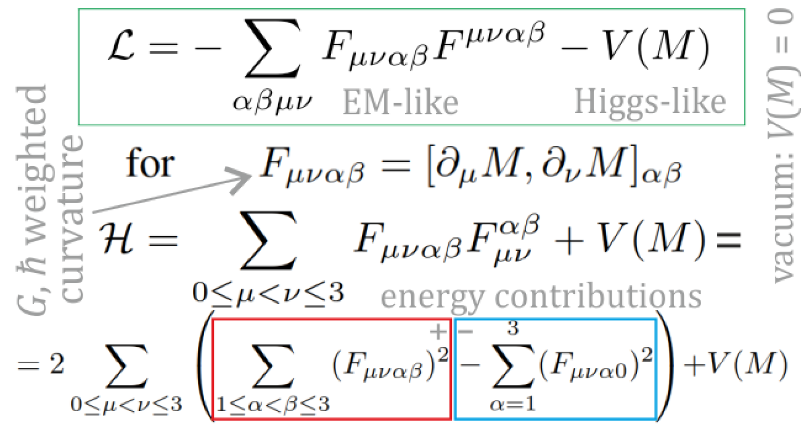

# M5.17 convo record (Duda ↔ Rodrigo)

> The message exchange attached to task [M5.17](m5_17_task_details.md); datestamped entries accumulate in chronological order (the per-task convo convention, adopted 2026-07-05: one `m5_<id>_convo.md` per task that exchanges messages; some tasks have none, some accumulate several). Lineage: follows [`m5_4i_convo_2026.07.04.md`](m5_4i_convo_2026.07.04.md) (group threads) and [`m5_4h_convo_2026.07.03.md`](m5_4h_convo_2026.07.03.md) (the audit failure that created the method-note standard; last of the retired date-keyed `m5_4x` naming).

## 2026-07-05: Duda's first reply to the method note (audit PASS + the 4D spec)

Duda's 2026-07-05 01:03 reply to the M5.17 re-ask email (method note + two-charge Coulomb run + Q13/Q14/Q15).

### 1. The reply in brief

"Thanks, looks better." He quotes the functional VERBATIM from [`../findings/m5_17_methods_note.md`](../findings/m5_17_methods_note.md) (E[M], u_curv, V(M_sp)) and confirms it: "This is 3D, (a,b,c) should be chosen to have minimum for eigenspectrum (1,delta,0)." Then the new content: "For 4D, required to add clock and gravity, potential needs to have minimum (g,1,delta,0), also this commutator needs to include signature in 4D: [A,B] = A xi B - B xi A for xi = diag(-1,1,1,1)." Closes with "Will study further and write."

### 2. What it settles

| # | Item | Consequence + routing |
| --- | --- | --- |
| 1 | **The method-note standard WORKS**: he found the Hamiltonian and potential in one click and quoted them back verbatim (contrast 2026-07-03: "still I have no idea what does it calculate") | The audit failure is closed; METHOD NOTE (`dev_docs/METHOD_NOTE.md`) is validated as the owner-facing format. No further legibility work needed on M5.16/M5.17 |
| 2 | **First owner sign-off on the exact static functional**: the E[M] we locked `c2 = alpha*hbar*c/(64 pi)` on is now owner-confirmed | The M5.16 Coulomb lock and the M5.17 two-charge cross-check sit on an owner-signed-off energy; upgrade their standing in any scorecard |
| 3 | **NO retroactive change to M5.16/M5.17 numbers** (verified, not assumed): the signature commutator reduces identically to the plain commutator on our static fields, because `M[0,0] = g` is uniform and the time-space mixing is zero everywhere, so every `dM` has a zero time block (`hedgehog_field`, `curvature_density_np` in [`../scripts/m5_17_energy.py`](../scripts/m5_17_energy.py)) | Lock, `r_half`, two-charge curve, melt-channel finding all stand. M5.16 gate G8 (g-blindness) is now owner-endorsed as a feature of the static sector |
| 4 | **NEW 4D SPEC (a): potential minimum `(g, 1, delta, 0)`** for the clock + gravity extension | Pre-condition for any dynamic/4D run: extend V from `M_sp` to the full 4x4 M with enough independent invariants to pin 4 distinct eigenvalues (generically Tr M through Tr M^4). The paper p.11 anchor hints (`g^4 ~ ke^2/Gm^2 ~ 1e38`, `delta^2 ~ hbar*c`) become COEFFICIENT CONSTRAINTS on that potential. Routed: [`m5_12_task_details.md`](m5_12_task_details.md) phase-D spec + Q17 detail ([`../m5_question_tracker.md`](../m5_question_tracker.md)) |
| 5 | **NEW 4D SPEC (b): signature commutator `[A,B]_xi = A xi B - B xi A`, `xi = diag(-1,1,1,1)`** in the curvature term | Mandatory the moment time derivatives or time-mixing textures enter (the psi clock dynamics). The module's convention block already declares `eta = diag(-1,1,1,1)`; only the kernel needs the xi insertion when we go dynamic. Routed: M5.12 phase-D spec |
| 6 | **Q15 nuance**: he EXPECTS the vacuum spectrum `(1, delta, 0)`, genuinely biaxial; a quartic trace LdG cannot have a strict minimum there (exactly Q15's territory), and the 4D `(g,1,delta,0)` minimum needs still more invariants | Does NOT answer Q15, but makes a "yes, higher invariants" answer structurally likely and extends Q15's scope from the 3D vacuum to the 4D one. Routed: Q15 detail |

### 3. What stays pending

Q13 (chiral Lifshitz + Frank), Q14 (what holds the hedgehog / the pairs), Q15 (sixth-order pinning): "Will study further and write." No reply needed from our side; the next inbound is his.

### Cross-links

- The note he audited: [`../findings/m5_17_methods_note.md`](../findings/m5_17_methods_note.md) (gains a § 10 addendum pointing here)
- Consumer of items 4-5: [`m5_12_task_details.md`](m5_12_task_details.md) § 2026-07-05 spec update (phase D)
- Consumer of items 4, 6: [`../m5_question_tracker.md`](../m5_question_tracker.md) Q15 + Q17 details
- Predecessor exchanges: [`m5_4h_convo_2026.07.03.md`](m5_4h_convo_2026.07.03.md), [`m5_4i_convo_2026.07.04.md`](m5_4i_convo_2026.07.04.md)

## 2026-07-05: Duda's second reply (the universal potential + the 4D Lagrangian + the Fable5 verification ask)

Duda's 2026-07-05 12:24 reply, the biggest content drop of the ask round: a practical ANSWER to Q15, the explicit 4D Lorentz-invariant Lagrangian (attached as an equation slide), a derivation request addressed to the agent BY NAME, and two questions back at us about the M5.17 two-charge run. Response task: **[M5.18](m5_18_task_details.md)** (opened same day; gates M5.12).

### 1. The reply verbatim (the load-bearing lines)

| Topic | Verbatim |
| --- | --- |
| 4D signature | "While in 3D it is standard Landau-de Gennes, in 4D for Lorentz invariance we need to include eta = diag(-1,1,1,1) signature everywhere e.g. shifting indexes up/down, also in Frobenius norm ... Where commutator also hides change of indexes, so I use [A,B] = A.eta.B - B.eta.A" |
| The delegation | "But maybe Fable5 could verify that this Lagrangian is Lorentz-invariant, and derived from it Hamiltonian is right (by Legendre transform)? **I think it is, but nobody else has checked it. Should be used if it is right.**" |
| The potential | "Regarding potential, there is assumed original LdG, but its generalization to 4D is far nontrivial. While there is freedom to choose this potential, one practical universal way is: V(M) = sum_p (Tr(M^p)-c_p)^2 for c_p = sum_i (Lambda_i)^p and Lambda are the preferred eigenvalues: (1,delta,0) in 3D, (g,1,delta,0) in 4D for full model, can use delta=0 for uniaxial approximation without QM." |
| Back-questions | "I see the code uses uniaxial hedgehog ansatz, which works only for delta=0. The diagram writes 'fixed ansatz' - does it mean without energy optimization? For continuos case it would mean infinite energy, but for lattice it can finite - if singularity is not in a lattice point." |

### 2. The attached equation slide (transcribed)

```text
L = - SUM_{alpha beta mu nu}  F_{mu nu alpha beta} F^{mu nu alpha beta}  -  V(M)
        (EM-like)                                      (Higgs-like)         vacuum: V(M) = 0

for  F_{mu nu alpha beta} = [ d_mu M , d_nu M ]_{alpha beta}     (G, hbar weighted curvature)

H = SUM_{0 <= mu < nu <= 3}  F_{mu nu alpha beta} F_{mu nu}^{alpha beta}  +  V(M)

  = 2 SUM_{0 <= mu < nu <= 3} (  SUM_{1 <= alpha < beta <= 3} (F_{mu nu alpha beta})^2   [+, red box]
                               -  SUM_{alpha = 1..3} (F_{mu nu alpha 0})^2  )             [-, blue box]
    + V(M)
```

All index raising through `eta = diag(-1,1,1,1)`, including inside the Frobenius norm; the commutator is `[A,B] = A.eta.B - B.eta.A`. He BOXES the negative internal-time contributions himself: H is INDEFINITE as written (the boundedness question is part of the verification). The slide (saved 2026-07-05, local-only `theory/` convention):



### 3. What it settles / opens

| # | Item | Consequence + routing |
| --- | --- | --- |
| 1 | **Q15 ANSWERED (practically)**: the universal spectral potential `V(M) = Σ_p (Tr(M^p) − c_p)²`, `c_p = Σ_i Λ_i^p`, targets `(1, δ, 0)` in 3D and `(g, 1, δ, 0)` in 4D | Sum-of-squares, exactly zero at the target spectrum: pins the biaxial vacuum EXACTLY (what the quartic LdG provably could not). IS the higher-invariants answer (degree 6 in 3D, degree 8 in 4D). SUPERSEDES the quartic `(a,b,c)` instrument; β = b/c dissolves (only an overall scale remains → better predictivity). Routed: Q15 detail (answered-with-residual), M5.18 phase B |
| 2 | **δ ↔ QM tie, first explicit**: "can use delta=0 for uniaxial approximation **without QM**" | The δ eigenvalue carries the quantum sector in his mapping (consistent with tracker Q6's `delta = QM` row); log for the dynamical-δ question inside Q15's residual |
| 3 | **The 4D Lagrangian delivered + verification DELEGATED to Fable5** ("nobody else has checked it. Should be used if it is right") | New owner-requested task = **M5.18 phase A**: prove/refute Lorentz invariance of L, re-derive H by Legendre transform (mind the field-dependent, possibly degenerate kinetic form: constraint structure), and address boundedness (his own blue-boxed negative terms). First-pass check (this session): the naive Legendre of `L = Σ_{0i}‖F_{0i}‖² − Σ_{ij}‖F_{ij}‖²` does give his `H = Σ_{all μ<ν} + V`, so the formula looks right formally; the careful derivation is the deliverable |
| 4 | **Q14 becomes computable**: melt (M → 0) under the new potential costs `V(0) = Σ_p c_p²` per cell (vs the quartic's tiny `c − b/2`) | Whether the melt channel CLOSES is now a measurement, not an ask: **M5.18 phase B** re-runs the melt-cost + two-charge relax analysis on the new potential |
| 5 | **Q17 restructured**: the β slot dissolves with the potential swap; g now enters through the `c_p` spectrum targets | The remaining anchors: the g VALUE and the overall energy scale (m_e anchor as before). Routed: Q17 detail |
| 6 | **His back-questions on the two-charge diagram** (fixed ansatz = no optimization? finite only on the lattice?) | Answer in the NEXT EMAIL, folded with the M5.18 deliverable: yes, "fixed" = seed evaluated without relaxation (the relaxed curves are the other panel: annihilation / melt-line restructuring); energy is finite even in the continuum because the melt core `s(r) = 1 − exp(−(r/r_c)²)` regularizes the center (methods note § 6 seeds; his own regularization slot), and separately the cell-centered grid never samples the singular point. His "uniaxial hedgehog works only for delta=0" matches our quasi-uniaxial `δ ~ 1e-10` regime (note § 1: spectrum `s·(1, δ, 0)`) |

### 4. What stays pending

Q13 (chiral term): still untouched ("will study further" remains the standing state). The next outbound reply rides the M5.18 deliverable (verification result + the fixed-ansatz answer), so it carries a deliverable rather than just an answer.

## 2026-07-05: Duda's PUBLIC group post citing the M5.17 methods note

13:16, to Models-of-Particles (cc: jenny, ericweinsteinpodcast): subject "OpenWave Fable 5 seems to handle difficult simulation of the running coupling effect". Body: "While most previous simulations were made with Opus 4.8 and were far from perfect, recently it switched to Fable 5 and yesterday I got from Rodrigo looking reasonable calculation of running coupling effect - quite difficult like done in Manfried's [mdpi 2218-1997/11/4/113, arXiv 2604.12021]. Seems very promising - please add your models, and soon we might solve physics ..." + the public GitHub link to [`../findings/m5_17_methods_note.md`](../findings/m5_17_methods_note.md) + the § 8 two_charge section and topology note quoted VERBATIM + our `m5_17_two_charge.png` figure reposted as the attachment.

| # | Item | Consequence + routing |
| --- | --- | --- |
| 1 | **The methods note is now a PUBLIC group reference** (link posted; audience includes the Eric Weinstein podcast address) | The method-note standard + commit-pinned permalinks are group-facing infrastructure, not private courtesy: every owner-facing note must assume public reposting. Applied to M5.18 same day (figures embedded, anchors verified) |
| 2 | He quoted the § 8 topology note VERBATIM, including the melt-channel quantification and the Q13/Q14/Q15 closing sentence | The melt-channel finding + the three open questions now have PUBLIC standing in the group; his eventual answers are semi-public commitments. No routing change; raises the stakes on the tracker's honesty discipline |
| 3 | "most previous simulations ... Opus 4.8 ... far from perfect; switched to Fable 5" + the title credits the model | The actually-load-bearing changes were the METHOD NOTE standard + the multi-agent adversarial audit (adopted from HIS 2026-07-03 advice) + the analytic-anchor gates; the model upgrade compounds them. Keep all three mandatory regardless of model (routed: memory + `dev_docs/METHOD_NOTE.md` culture) |
| 4 | "please add your models, and soon we might solve physics" + podcast cc | Expectation escalation on top of the m5_4i item-5 provenance risk: honest scorecards + provenance labels are now REPUTATIONALLY load-bearing for the whole group surface. M5.12's rigor rows unchanged but now public-facing |
| 5 | Faber's running-coupling papers cited as the reference bar (Universe 11/4/113 + arXiv 2604.12021) | Any future running-coupling claim (M5.9.0 Coulomb-unit axis, M5.12 phase E) benchmarks against Faber's curves explicitly, not just the 64π asymptote |
| 6 | Our plot reposted as his attachment | Figures in owner-facing notes ARE the public face of the work: keep the embed-plots-in-notes practice (M5.18 note now carries both figures) + the eyeball-before-send rule |
