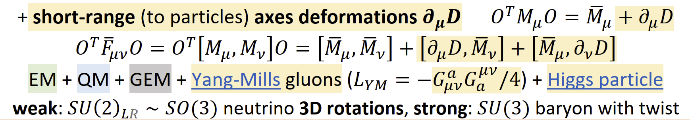
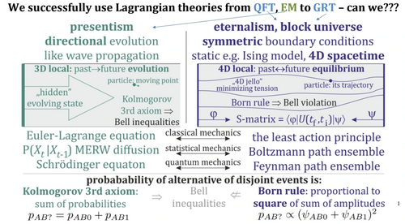

# M5.18 convo record (Duda ↔ Rodrigo, cc models-of-particles)

> The message exchange attached to task [M5.18](m5_18_task_details.md); datestamped entries accumulate in chronological order (the per-task convo convention). Lineage: follows [`m5_17_convo.md`](m5_17_convo.md) (the universal-potential + Fable5-delegation round). NOTE: with his 2026-07-06 reply Duda cc'd **models-of-particles**, so this thread is now GROUP-PUBLIC ("maybe somebody there would like to help/contribute"): provenance labels and claim discipline carry group-level weight from here on.

## 2026-07-05: the M5.18 reply email out (the verification deliverable + 3 qualifications + back-answers)

Rodrigo's 2026-07-05 15:16 email: both verification claims confirmed (Lorentz invariance + Legendre Hamiltonian, machine-checked, adversarial-audited) with the [verification note](../findings/m5_18_verification_note.md) linked; the three owner-intent questions (1: degenerate Legendre map / Dirac constraints; 2: 4-branch vacuum split + domain walls; 3: negative boost-texture channel intended?); the spectral-potential validation (`r_half = 2.935 fm`, potential-shape robust); the melt-channel negative (survives his potential too); Q13 re-stated as THE pre-M5.12 blocker; his two back-questions answered (fixed ansatz = no optimization; energy finite in the continuum via the melt core `s(r)`). Content bullets: [`m5_18_task_details.md § Phase C`](m5_18_task_details.md).

## 2026-07-06: Duda's reply 1 (Q13 redirect + the melt diagnosis + the SM-correspondence program)

Duda's 2026-07-06 00:25 reply, cc models-of-particles.

### 1. The reply verbatim (the load-bearing lines)

| Topic | Verbatim |
| --- | --- |
| Status of the Lagrangian | "So this LdGS might be the final Lagrangian for this level of physics - but it is worth to be open especially for modifications of potential, maybe also adding more kinetic terms e.g. like Skyrme people do." |
| Deeper level | "Also potentials are often effective - it is worth to simultaneously search for even deeper level of physics: explaining this gigantic anisotropy for QM-EM-GEM completely different energy contributions, from which we could derive this potential - maybe suggesting its details." |
| SM correspondence | "a basic research direction is searching for effective description of LdGS to be in agreement with Standard Model Lagrangian, starting with Dirac equation as effective description of particle with spin, QED. Then QCD adds Yang-Mills, which I suspect comes from deformation of eigenspectrum - activation of potential" |
| The melt diagnosis | "I suspect this melt problem comes from here - assuming center of charge not in lattice. Should be better if constraining centers in lattice points, replacing central value with above 'M = a I' (identity matrix) in 3D, or in 4D (g', a,a,a) eigenspectrum." |
| Static Coulomb prescription | "For static Coulomb with running coupling, the centers of charges need e.g. to be fixed in lattice points - central eigenspectrum needs to be spherically symmetric: (g', a,a,a) with g', a to be optimized. If there are still problems for small distances, rather needs denser lattice, or some FEM (finite element method)." |
| **Q13** | "I don't understand this question, from 'Frank' suspect it comes from standard liquid crystals - which might not translate here, where we should just focus on consequences of chosen LdGS Lagrangian - with different Lorentz-invariant Skyrme-like term and finally extended to 4x4 tensor." |

### 2. The attached slide (Yang-Mills from eigenspectrum deformation)

Transcription: short-range (to particles) axes deformations `∂_μ D`; `O^T M_μ O = M̄_μ + ∂_μ D`; `O^T F̄_μν O = O^T [M_μ, M_ν] O = [M̄_μ, M̄_ν] + [∂_μ D, M̄_ν] + [M̄_μ, ∂_ν D]`; EM + QM + GEM + Yang-Mills gluons (`L_YM = −G^a_μν G_a^μν / 4`) + Higgs particle; **weak: `SU(2)_LR ~ SO(3)` neutrino 3D rotations, strong: `SU(3)` baryon with twist**. The mechanism: near particles the eigenvalue matrix `D` itself deforms ("activation of potential"), and the extra `[∂D, M̄]` commutator terms are where the Yang-Mills sector lives.

### 3. Decode + routing

| # | Item | Consequence + routing |
| --- | --- | --- |
| 1 | **Q13 ANSWERED BY REDIRECT**: the LC-tradition chiral Lifshitz + Frank pair "might not translate here"; the sanctioned gradient-term class is a **Lorentz-invariant Skyrme-like term** (eventually on the 4×4 tensor). Not a yes/no on chirality: a reframe of the admissible term class | Tracker Q13 flipped to ✅ answered-by-redirect; the heliknoton (cholesteric) route DEMOTED from theory-motivated primary to numerical scaffolding at most; the remaining stabilizer candidates for M5.12 = (a) his core-pinning prescription (item 2), (b) a Lorentz-invariant Skyrme-like term, (c) the clock dressing. Routed: [`m5_12_task_details.md § 2026-07-06 spec updates`](m5_12_task_details.md) + tracker Q13/Q14 details |
| 2 | **The melt-channel diagnosis (his in-words Q14 answer)**: the escape/annihilation artifact comes from "assuming center of charge not in lattice"; prescription = constrain defect centers to lattice points AND replace the central value with `M = aI` (3D) / eigenspectrum `(g', a, a, a)` (4D), with `g', a` optimized; denser lattice or FEM if small-distance trouble persists | A CONSTRAINT/regularization answer, not a new term: testable immediately. Honest nuance: the M5.18 antipair run already pinned cores and still annihilated through the bridge; the NEW ingredient is the central-value replacement (`aI` core boundary condition) + optimized `(g', a)`. Evidence-not-resolution until the re-run: the pinned-center + `aI`-core antipair relax is the first M5.12 pre-flight measurement. Routed: M5.12 phase-D0 (new), tracker Q14 |
| 3 | **δ_CP fork consequence** (of item 1): the 270° chiral route loses its substrate sanction (no LC chiral term; the standard Skyrme term is parity-even). Unless a chirality source emerges from the Skyrme-like class or the 4D clock, the model-sanctioned in-model prediction leans **δ_CP = 180°** (pure SO(3)) | Tracker § δ_CP fork updated; M5.12 phase F decides in-model |
| 4 | **Weak-force mechanism named** (slide): weak = `SU(2)_LR ~ SO(3)` **neutrino 3D rotations**, i.e. the M5.12 phase-F SO(3) 3-axis loop oscillation IS the weak sector; strong = `SU(3)` baryon with twist; Yang-Mills from `∂_μ D` eigenspectrum deformation | Q10 upgraded from "gap" to direction-in-hand; phase-F framing: the PMNS run doubles as the weak-sector probe |
| 5 | **Deeper-level program** (owner-voiced): potentials are effective; search for the deeper physics explaining the QM-EM-GEM anisotropy (the `(g, 1, δ, 0)` spread over ~38 orders), from which V could be DERIVED | Q9 (deeper substrate) re-activated with an owner-stated goal; long-tail, not an M5.12 gate |
| 6 | **SM-correspondence direction**: effective description of LdGS matching the SM Lagrangian, starting with the Dirac equation (particle with spin), then QED, then QCD/Yang-Mills via item 4's mechanism | Strengthens the public effective-Dirac issue [#197](https://github.com/openwave-labs/openwave/issues/197) (now owner-endorsed as "a basic research direction"); post-M5.12 program ladder |
| 7 | **Potential kept deliberately open**: "worth to be open especially for modifications of potential" + more kinetic terms | Q15 residual (coefficient freedom) confirmed open-by-design; the spectral potential is the working instrument, not dogma |
| 8 | **Thread now group-public** (cc models-of-particles, invitation to contribute) | Provenance-label bar raised again (the 2026-07-05 Faber-benchmark note already applied); every number quoted on-thread must carry its measured/hypothesis label |

## 2026-07-06: Duda's reply 2 (the negative Hamiltonian: intended, and the least-action foundation)

Duda's 2026-07-06 02:56 follow-up, same thread ("As the report also discusses issues with negative Hamiltonian, let me elaborate on it").

### 1. The reply verbatim (the load-bearing lines)

| Topic | Verbatim |
| --- | --- |
| Unavoidable | "negative Hamiltonian terms seem unavoidable if working with curvature in Lorentz-invariant way, e.g. also general relativity has this issue." |
| Necessary | "Also it seem necessary both for energetically preferred time derivatives: oscillations of resting electron/neutrinos, and boosts for gravitational mass of particles." |
| Astro speculation | "Other consequences I thought about are energetic tendencies to form empty regions seen in astronomy like Boötes Void, but the question is if they require active mechanism?" |
| The foundation | "Sure negative Hamiltonian terms also have problems like instabilities - this is one of many reasons I believe physics was originally solved in symmetric way: here by the least action principle (for e.g. Big Bang - Big Crunch boundary conditions) ... not Euler-Lagrange, excluded also by Bell violation forbidden for such local realistic models." |

### 2. The attached slide (presentism vs eternalism, the least-action stance)

Transcription (structure): presentism (directional evolution, 3D local past→future, hidden evolving state, Kolmogorov 3rd axiom, Bell inequalities, Euler-Lagrange / MERW diffusion / Schrödinger) vs eternalism (block universe, symmetric boundary conditions, 4D spacetime equilibrium, "4D jello" minimizing tension, Born rule ⇒ Bell violation, S-matrix `⟨φ|U(t_f, t_i)|ψ⟩`, the least action principle / Boltzmann path ensemble / Feynman path ensemble). Probability of alternative of disjoint events: Kolmogorov `p_AB = p_AB0 + p_AB1` (⇒ Bell inequalities) vs Born `p_AB ∝ (ψ_AB0 + ψ_AB1)²` (⇒ Bell violation).

### 3. Decode + routing

| # | Item | Consequence + routing |
| --- | --- | --- |
| 1 | **M5.18 back-question 3 ANSWERED: the negative boost-texture channel is INTENDED**, and load-bearing twice: it powers the energetically preferred time derivatives (the resting electron/neutrino oscillations, the clock) and the boosts carrying gravitational mass. GR named as the precedent for negative energy with Lorentz-invariant curvature | The M5.18 qualification (c) is resolved as a FEATURE: do not constrain the sector away. M5.12 phase D treats the negative channel as the clock/gravity engine, with the instability concern handled at the formulation level (item 2). Tracker: the M5.18 back-question ledger |
| 2 | **The instability resolution is FOUNDATIONAL, not a term**: physics is "solved in symmetric way" by the least action principle with two-sided boundary conditions (Big Bang - Big Crunch), NOT by Euler-Lagrange initial-value evolution; presentist local-realistic evolution is independently excluded by Bell violation | **Formulation directive for the 4D clock**: the intended object is the stationary-action solution of a BOUNDARY-VALUE problem (for the clock: time-PERIODIC boundary conditions), not open-ended time stepping. Converges with resolved Q1 ("the particle is a time-periodic resonance"). Practical reading: relax the 4D action with periodic time BCs; H-unboundedness does not poison a BVP the way it poisons an IVP. Also DOWNGRADES the urgency of the Dirac constraint analysis (M5.18 back-question 1): the canonical/Hamiltonian formulation is less load-bearing if the physics is the action BVP. Routed: [`m5_12_task_details.md`](m5_12_task_details.md) phase D |
| 3 | **Q12 (Bell / Kochen-Specker) gets his on-record answer**: the model is eternalist (4D BVP + Born rule from squared amplitude sums); Bell violation is the argument FOR the least-action stance and AGAINST reading the field as a presentist local-realistic evolver | Tracker Q12 detail upgraded: the defense template now has the owner's own slide; consistent with the existing MERW bridge notes |
| 4 | **Boötes-void speculation** (empty regions as an energetic tendency of the negative sector; "do they require active mechanism?" left open) | ⚠️ speculative, background only; logged for the gravity-sector long tail, no task consumes it |
| 5 | **M5.18 back-questions 1 and 2 remain unanswered in words**: the Legendre/Dirac constraint structure (1) and the 4-branch vacuum split / domain walls (2). Partial signal on (2): the static-charge core spec `(g', a, a, a)` (reply 1) says which branch structure he expects AT CORES | Both stay open as tracker items (Q18, Q19); neither gates M5.12 phases A-C (loop statics); both gate phase D (4D dynamics), with Q18's urgency downgraded by item 2 |

### Cross-links

- The task this thread belongs to: [`m5_18_task_details.md`](m5_18_task_details.md) (§ POST-REVIEW logs this reply)
- The deliverable he is replying to: [`../findings/m5_18_verification_note.md`](../findings/m5_18_verification_note.md)
- Consumers: [`m5_12_task_details.md § 2026-07-06 spec updates`](m5_12_task_details.md) (the ask round CLOSED; phases reshaped) · [`../m5_question_tracker.md`](../m5_question_tracker.md) (Q13 ✅ redirect, Q14 ✅ prescription, Q18/Q19 opened, Q10/Q9/Q12 details upgraded, δ_CP fork note)
- Predecessor exchange: [`m5_17_convo.md`](m5_17_convo.md)
- Slide images: [`../images/m5_18_duda_ym_activation.png`](../images/m5_18_duda_ym_activation.png) · [`../images/m5_18_duda_least_action.png`](../images/m5_18_duda_least_action.png)
