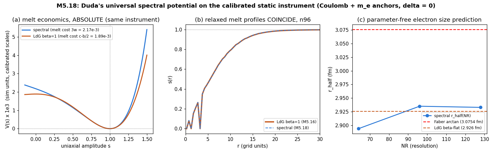

# M5.18: 4D Lagrangian verification + the universal spectral potential

> Task **M5.18** (M5 / Liquid-Crystal model). Status: ✅ **Done** (delivered + review approved 2026-07-05) · Gates: **[M5.12](m5_12_task_details.md)** (runs on the new potential) · Roadmap: [`../m5_roadmap.md`](../m5_roadmap.md) · Origin: Duda's 2026-07-05 second reply ([`m5_17_convo.md`](m5_17_convo.md) entry 2)

This doc is the task's full record: planning + findings + documentation.

---

## TASK PLANNING

### Why this task exists (the origin, so we remember what we're doing)

Duda's 2026-07-05 12:24 reply ([`m5_17_convo.md`](m5_17_convo.md) entry 2) delivered three things at once:

1. A practical ANSWER to Q15: the universal spectral potential `V(M) = Σ_p (Tr(M^p) − c_p)²`, `c_p = Σ_i Λ_i^p`, target spectrum `(1, δ, 0)` in 3D and `(g, 1, δ, 0)` in 4D. It supersedes the quartic LdG `(a,b,c)` instrument the M5.16/M5.17 statics ran on.
2. The explicit 4D Lorentz-invariant Lagrangian (`L = −Σ F_{μναβ}F^{μναβ} − V(M)`, `[A,B] = AηB − BηA`, η-raising everywhere including the Frobenius norm) WITH a delegation addressed to this agent by name: "maybe Fable5 could verify that this Lagrangian is Lorentz-invariant, and derived from it Hamiltonian is right (by Legendre transform)? I think it is, but **nobody else has checked it. Should be used if it is right**."
3. Two back-questions about the M5.17 two-charge diagram (does "fixed ansatz" mean no optimization; is the energy finite only on the lattice) that need an answer in the next email.

The adopted recommendation (2026-07-05 session, verbatim): "open this as M5.18 (title along the lines of '4D Lagrangian verification + the universal spectral potential'), gate M5.12 on it, and fold the fixed-ansatz answer into the next email together with the verification result, so the reply carries a deliverable rather than just an answer."

### Scope (three phases)

| Phase | What | Gate (pre-registered) |
| --- | --- | --- |
| **A: the verification** (owner-requested, analytic) | Prove or refute: (A1) the 4D Lagrangian is Lorentz-invariant with the η-signature insertions (index shifts, Frobenius norm, `[A,B] = AηB − BηA`); (A2) his Hamiltonian `H = Σ_{0≤μ<ν≤3} F_{μναβ}F_{μν}^{αβ} + V` follows by Legendre transform, treating the field-dependent (possibly degenerate) kinetic quadratic form honestly: constraint structure, not just the naive sign flip; (A3) characterize boundedness: the internal-η contraction makes H INDEFINITE (his own blue-boxed `−Σ_α (F_{μνα0})²` terms); state precisely when/whether energy is bounded below. First-pass check already done (session note in [`m5_17_convo.md`](m5_17_convo.md) entry 2 § 3 item 3): the naive Legendre DOES reproduce his H; the careful derivation is the deliverable | A method-note-grade derivation doc, every step checkable by reading; verdict stated as ✅ holds / ❌ fails with the exact failing term; independent second-agent audit before sending (the multi-agent rule, [`m5_4h_convo_2026.07.03.md § 6`](m5_4h_convo_2026.07.03.md)) |
| **B: the potential swap** (numerical) | Implement `V(M) = Σ_p (Tr(M^p) − c_p)²` (3D statics first: target `(1, δ, 0)`, p = 1..3) alongside the quartic LdG in [`../scripts/m5_17_energy.py`](../scripts/m5_17_energy.py); re-run the FULL M5.16 gate suite on the new potential (the calibrated-instrument rule: any functional change re-runs the gates first); re-calibrate the m_e scale anchor (the `c2 = αħc/64π` Coulomb lock is curvature-side, potential-independent, and carries over); re-measure `r_half` (now with the β slot dissolved: fewer free parameters than the −4.8% LdG prediction had); re-measure the MELT COST `V(0) = Σ_p c_p²` and re-run the M5.17 melt-channel analysis (hedgehog perturbed relax + two-charge relax both signs) | Gate suite green on the new potential; the melt-channel verdict is the headline: does the channel CLOSE (hedgehog stops escaping, antipair stops annihilating through melt bridges)? Either answer is publishable to him; this is the empirical Q14 test |
| **C: the reply email** (Rodrigo's voice; agent supplies content bullets only) | Fold into ONE email: the phase-A verification verdict (with the derivation doc linked, method-note standard), the phase-B outcome (gate suite + melt channel on HIS potential), and the answer to his fixed-ansatz back-questions (fixed = no optimization, the relaxed curves are the other panel; energy finite in the continuum too because the melt core `s(r)` regularizes the center, plus the cell-centered grid never samples the singular point) | The reply carries a deliverable, not just an answer; method-note standard applies (equations first, commit-pinned permalinks) |

### Definition of done

| Item | Done when |
| --- | --- |
| Phase A | Derivation doc written (`../findings/m5_18_verification_note.md`), verdict explicit, second-agent audit passed |
| Phase B | New-potential module + gate-suite JSON + melt-channel numbers + plots in the repo, `m5_17_energy.py`-style auditability (the physics stays in ONE module) |
| Phase C | Content bullets handed to Rodrigo for the email; the email is HIS voice (Scientific bucket) |
| Tracking | Q15 detail updated with the phase-B empirical outcome; Q14 detail updated with the melt-channel verdict; roadmap row moved to Done on approved review |

### What this task does NOT do

| Out of scope | Where it lives |
| --- | --- |
| The 4D DYNAMIC implementation (ξ-commutator kernel, live time axis, clock) | M5.12 phase D (this task only verifies the math it will run on) |
| The chiral term (Q13) | still pending Duda's "will study further" |
| The g value + overall-scale anchors | Q17, next ask round |
| Neutrino loops | M5.12 (gated on this task) |

### Preconditions + inherited rules

| Rule | Source |
| --- | --- |
| Calibrated-instrument rule: any functional change re-runs the M5.16 gate suite before new physics | [`m5_12_task_details.md § Rigor compliance`](m5_12_task_details.md) |
| Method-note standard for anything owner-facing | [`../../../../dev_docs/METHOD_NOTE.md`](../../../../dev_docs/METHOD_NOTE.md) |
| Multi-agent verification of headline claims | Duda 2026-07-03b, [`m5_4h_convo_2026.07.03.md § 6`](m5_4h_convo_2026.07.03.md) |
| Headless + matplotlib only; physics in one auditable module | M5.16/M5.17 pattern |

---

## FINDINGS (2026-07-05)

### Phase A: the verification (COMPLETE, audit-hardened)

Full derivations + machine-check map: [`../findings/m5_18_verification_note.md`](../findings/m5_18_verification_note.md) (THE deliverable page); suite [`../scripts/m5_18_lorentz_check.py`](../scripts/m5_18_lorentz_check.py), 15/15 PASS ([`../data/m5_18_lorentz_check.json`](../data/m5_18_lorentz_check.json)).

| # | Result | Status |
| --- | --- | --- |
| A1 | **His Lagrangian IS Lorentz-invariant** (curvature 1.3e-11, potential 2.0e-14 over 20 random boosts; the no-η control drifts 3e4×, so the η insertions are exactly what invariance requires) | ✅ measured |
| A2 | **His Hamiltonian IS the exact Legendre transform** (algebraic identity `H = L(Ṁ) − 2L(0)`, residual 3.6e-16; also the Noether energy; the slide's ± expansion exact) | ✅ measured |
| A3 | Qualification (a): the Legendre map is DEGENERATE (`[η,B]_η = 0` ∀ symmetric B: the η-direction velocity carries zero momentum, a primary constraint; Dirac analysis remains) | ✅ measured |
| A4 | Qualification (b): with η-traces the covariant vacuum is `diag(−g, 1, δ, 0)` (the spectrum statement belongs to the mixed tensor `ηM`; `diag(+g,...)` has V ≈ 1.05e6, not 0) | ✅ measured |
| A5 | Qualification (c): **H is INDEFINITE, and the vacuum manifold itself carries negative-energy textures**: the shared-axis boost×rotation product texture has V = 0 exactly and density −97.8 to −127.7 over its full period → H unbounded below unless the boost-texture sector is constrained / gauged / intended (gravity-shaped attraction?) | ✅ measured |
| A6 | Audit finding: the vacuum manifold is a UNION of 4 disjoint Lorentz orbits (which preferred eigenvalue rides the timelike eigenvector); domain-wall question | ✅ measured |
| A7 | Static sector η-blind (1.4e-14): every M5.16/M5.17 published number carries over EXACTLY | ✅ measured |

**The audit round earned its keep**: the independent adversarial agent confirmed A1-A4/A7 with its own script and hand derivations, REFUTED the original A5 witness (the expm-of-sum texture flips positive off-origin, +4407 at (1.5,−0.8)), supplied the corrected product-texture construction (adopted, re-verified over the full period), and found A6. Record: verification note § 10.

### Phase B: the potential swap (calibration COMPLETE)

Driver [`../scripts/m5_18_spectral.py`](../scripts/m5_18_spectral.py) (spectral potential + gradient at top; curvature imported verbatim from `m5_17_energy.py`); gates [`../data/m5_18_spectral_gates.json`](../data/m5_18_spectral_gates.json); lock [`../data/m5_18_spectral_lock.json`](../data/m5_18_spectral_lock.json).

| # | Result | Status |
| --- | --- | --- |
| B1 | Gates: gradient analytic == FD 1.1e-9 (directional); vacuum V(1) = 0, V'(1) = 0, V(0) = 3w exact; **biaxial `(1, δ, 0)` pinned EXACTLY at δ = 0.3** (the Q15 mechanism confirmed in code: the sum-of-squares does what the quartic provably could not) | ✅ measured |
| B2 | **HEADLINE: `r_half = 2.935 fm`, h-converged** (J = 206.5 / 209.4 / 209.3 at NR 64/96/128; virials 1.016/1.006/1.003; Faber 3.0754 → −4.6%): with β dissolved this is PARAMETER-FREE given equal weights, and it lands within 0.3% of the LdG's 2.926: **the electron-size prediction is potential-shape ROBUST** (was β-flat, now form-flat) | ✅ measured |
| B3 | Melt economics at the calibrated scale: spectral melt cost `3w = 2.17e-3`/cell vs LdG `c − b/2 = 1.885e-3`: only ~15% dearer, and the calibrated V(s) curves nearly COINCIDE along the uniaxial melt path (figure panel a); the relaxed melt profiles coincide (panel b). The potential-shape difference lives OFF the uniaxial path (biaxial directions + s > 1 stiffness), not in the melt channel | ✅ measured |
| B4 | **Q14 stability probe: the hedgehog is STILL a saddle** (perturbed 2D relax, n96, 8000 iters): E 16.85 → 7.61, a **55% drop** (LdG probe: 35% at n64), melt minimum moves off-origin to (ρ, z) = (0.5, −3.5). NEW nuance: the escape is now SHALLOW-melt (min_s = 0.51 vs LdG's ~0): the exact spectrum pinning makes deep melt dearer, but the ring/biaxial escape route is untouched, so the instability is orientation-driven, not melt-driven. gnorm still descending at cap (restructuring, the M5.17 likepair signature) | ✅ measured |
| B5 | **Antipair: ANNIHILATES IDENTICALLY to LdG** (pinned-core relax, d = 16 and 24): E 18.8 → 0.34 and 27.9 → 0.41 (vacuum residuals), melt bridge along the axis strip `min_s = 0.008` at both d, indistinguishable from the M5.17 LdG bridge (~0.008). The annihilation route through the melt channel is COMPLETELY unaffected by the potential swap | ✅ measured |

### THE PHASE-B VERDICT (B3 + B4 + B5, all measured)

**The melt channel SURVIVES the potential swap, in both routes.** The mechanism is now clear: at the anchors' calibrated (virial-balanced) scale, the potential ALONG the uniaxial melt path is essentially fixed by the calibration itself (panel a: the curves coincide), so no choice among spectrum-pinning potential forms can close the channel; the forms differ only off-path (biaxial directions, s > 1 stiffness), and the off-path difference merely re-routes the escape (B4: shallower melt, same instability). Consequences:

| Consequence | Where it lands |
| --- | --- |
| The Q14 answer is SHARPENED, with measured evidence on TWO potentials: what holds point defects/pairs must be a NEW TERM (the Q13 Frank/chiral quadratic-gradient pair) or the clock dressing, NOT potential-shape engineering | tracker Q14 detail; the reply email |
| Q15's mechanism is confirmed in code (exact biaxial pinning) AND its melt-cost hope is closed (pinning does not close the channel) | tracker Q15 detail |
| The electron-size prediction `r_half ≈ 2.93 fm` (−4.6% vs Faber) is now known to be anchor-driven, robust to both β and the potential form: a genuinely sharp model prediction | headline; scorecards |
| M5.12 runs on the spectral potential with the SAME calibrated instrument behavior (profiles coincide), so nothing in the M5.12 plan changes except the potential module | [`m5_12_task_details.md`](m5_12_task_details.md) |

### Phase C: reply-email content (bullets only; the email is Rodrigo's voice)

1. His verification request, answered with a deliverable: both claims CONFIRMED (Lorentz invariance + the Legendre Hamiltonian, machine-checked from two independent implementations, adversarial second-agent audit passed); the verification note link leads.
2. The three qualifications that matter before "should be used": the degenerate Legendre map (primary constraints, Dirac analysis pending); the covariant vacuum is `diag(−g, 1, δ, 0)` (spectrum statements belong to `ηM`); H is INDEFINITE: a shared-axis boost×rotation texture on the vacuum manifold has V = 0 and strictly negative energy density along its full extent → unbounded below unless constrained/gauged/intended. Ask: is the negative boost-texture channel intended (gravity-shaped attraction?) or should a constraint remove it? Also: the vacuum manifold splits into 4 disjoint orbit branches (which eigenvalue is timelike): intended?
3. His potential, implemented same-day at the calibrated parameters: exact biaxial pinning confirmed; `r_half = 2.935 fm` h-converged, within 0.3% of the quartic-LdG value (the size prediction is potential-shape robust, still −4.6% vs Faber).
4. The melt-channel test he made possible: the channel SURVIVES his universal potential (hedgehog still escapes, antipair still annihilates through the same melt bridge): so Q13 (chiral + Frank) and the clock dressing are the remaining candidates for what holds point defects: sharpens exactly the three questions already on his desk.
5. His two back-questions answered: yes, "fixed ansatz" = seed evaluated without optimization (the relaxed curves are the other panel); the energy is finite even in the continuum because the melt core `s(r) = 1 − exp(−(r/r_c)²)` regularizes the center (the same `s(r)` he saw in the note § 6), and separately the cell-centered grid never samples the singular point.
6. δ = 0 uniaxial: agreed, that is exactly the regime the electron sector runs in; the exact `(1, δ, 0)` pinning his potential provides is what the δ ≠ 0 (QM) sector will use.

### Artifacts

| Artifact | Content |
| --- | --- |
| [`../findings/m5_18_verification_note.md`](../findings/m5_18_verification_note.md) | THE deliverable: verdict + derivations + qualifications + equation-to-code map + audit record |
| [`../scripts/m5_18_lorentz_check.py`](../scripts/m5_18_lorentz_check.py) | phase-A machine checks (15/15 PASS) → [`../data/m5_18_lorentz_check.json`](../data/m5_18_lorentz_check.json) |
| [`../scripts/m5_18_spectral.py`](../scripts/m5_18_spectral.py) | phase-B driver: spectral potential + gates/radial/stability/calibrate/pair modes |
| [`../data/m5_18_spectral_gates.json`](../data/m5_18_spectral_gates.json) · [`../data/m5_18_spectral_lock.json`](../data/m5_18_spectral_lock.json) · [`../data/m5_18_spectral_n96_stability.json`](../data/m5_18_spectral_n96_stability.json) · [`../data/m5_18_spectral_pair_anti.json`](../data/m5_18_spectral_pair_anti.json) | gate suite · 3-grid calibration lock · the B4 saddle probe · the B5 annihilation probe |
| [`../scripts/m5_18_plot.py`](../scripts/m5_18_plot.py) → [`../plots/m5_18_spectral.png`](../plots/m5_18_spectral.png) | the 3-panel figure (melt economics / coinciding profiles / r_half robustness) |
| No deleted files | largest artifact 132 KB (the figure); nothing exceeded the 1 MB cleanup bar |

### Cross-links

- Origin exchange: [`m5_17_convo.md`](m5_17_convo.md) entry 2 (2026-07-05, the universal potential + the Fable5 ask)
- Supersedes as instrument: the quartic LdG lock of [`m5_16_task_details.md`](m5_16_task_details.md) (its record stays valid AS the LdG-potential result)
- Consumer: [`m5_12_task_details.md`](m5_12_task_details.md) (gated on this task; its § 2026-07-05 spec updates carry the same 4D specs)
- Question registry: [`../m5_question_tracker.md`](../m5_question_tracker.md) (Q15 answered-with-residual; Q14 empirical test = phase B; Q17 restructured)
- The audited module phase B extends: [`../scripts/m5_17_energy.py`](../scripts/m5_17_energy.py) + [`../findings/m5_17_methods_note.md`](../findings/m5_17_methods_note.md)

---

## TASK REVIEW (2026-07-05)

Task Duration: 00:52 (from 13:13 to 14:05 EDT)
Usage Cap Triggered: NO (ping armed for 17:25, parked unfired at FINISH)

| # | Result | Status |
| --- | --- | --- |
| 1 | His Lagrangian IS Lorentz-invariant (1.3e-11 / 2.0e-14 over 20 random boosts; the no-η control drifts 3e4×) | ✅ measured |
| 2 | His Hamiltonian IS the exact Legendre transform (3.6e-16; also the Noether energy; slide ± expansion exact) | ✅ measured |
| 3 | Three qualifications for the owner: degenerate Legendre map (primary constraints); covariant vacuum `diag(−g,1,δ,0)`; **H INDEFINITE: boost×rotation vacuum-manifold textures at V = 0 with density −97.8 to −127.7 → unbounded below** + the 4-branch vacuum split | ✅ measured |
| 4 | The audit rule earned its keep: independent adversarial agent confirmed 5/6 claims, refuted the original unboundedness witness, supplied the corrected product texture, found the branch structure; 15/15 checks green after fix | ✅ |
| 5 | Spectral potential implemented + validated: exact biaxial pinning; `r_half = 2.935 fm` h-converged, within 0.3% of LdG (potential-shape ROBUST, −4.6% vs Faber), parameter-free with β dissolved | ✅ measured |
| 6 | The melt channel SURVIVES the swap both routes (hedgehog escapes 55% shallow-melt; antipair annihilates, bridge identical): Q14 sharpened to the Q13 pair or clock dressing | ✅ measured |
| 7 | Static sector η-blind: all M5.16/M5.17 published numbers carry over exactly | ✅ measured |

Issues: the 2D relaxes end with gnorm still descending at cap (energy-gap verdicts robust, labeled in JSONs); the Dirac constraint analysis is flagged out of scope (candidate follow-up before 4D dynamics).

**Findings**: Duda's 4D Lagrangian and Hamiltonian are both RIGHT and now verified, but the energy is unbounded below through boost-rotation textures on the vacuum manifold at zero potential cost, and the vacuum manifold splits into 4 disjoint branches: two new owner-intent questions with measured witnesses. His universal spectral potential works exactly as intended (exact biaxial pinning), leaves the calibrated electron sector essentially unchanged (`r_half` robust to 0.3%), and measurably does NOT close the melt channel, so defect stability now points uniquely at the Q13 terms or the clock dressing.

**Research docs created/updated**: this file (FINDINGS + PHASE-B VERDICT + phase-C bullets); [`../findings/m5_18_verification_note.md`](../findings/m5_18_verification_note.md) (the deliverable); [`../scripts/m5_18_lorentz_check.py`](../scripts/m5_18_lorentz_check.py) · [`../scripts/m5_18_spectral.py`](../scripts/m5_18_spectral.py) · [`../scripts/m5_18_plot.py`](../scripts/m5_18_plot.py) + 9 data JSONs + [`../plots/m5_18_spectral.png`](../plots/m5_18_spectral.png); [`../m5_question_tracker.md`](../m5_question_tracker.md); [`../m5_roadmap.md`](../m5_roadmap.md); [`m5_12_task_details.md`](m5_12_task_details.md); [`../checkpoints/m5_18_progress.md`](../checkpoints/m5_18_progress.md) (closed).
