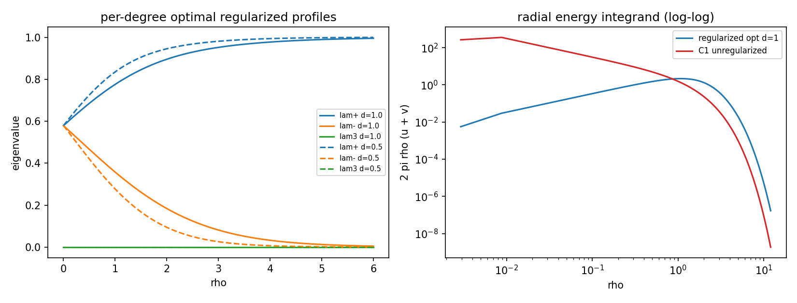
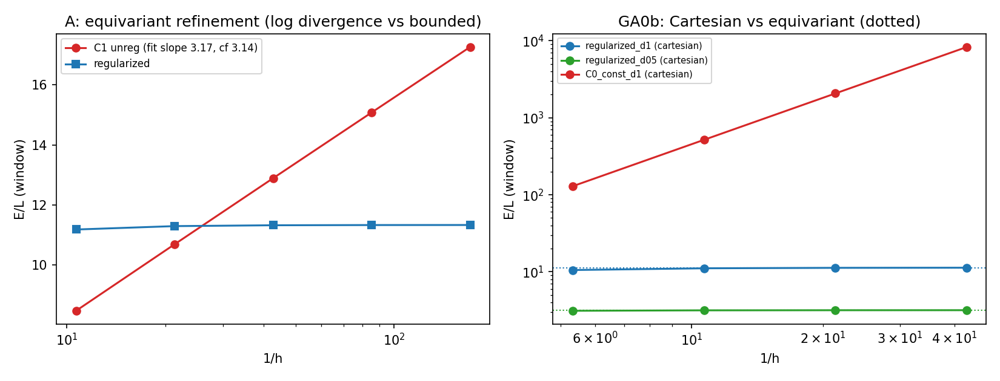
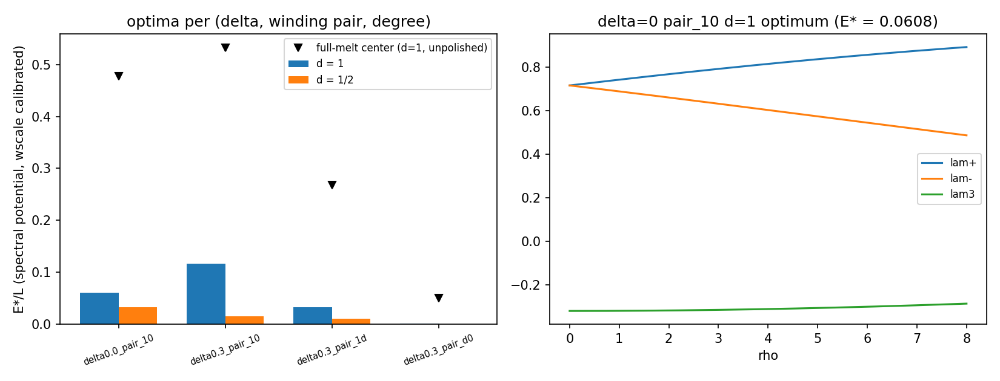
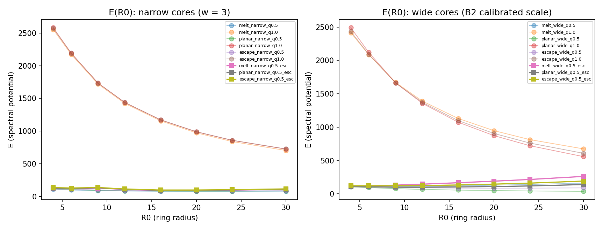
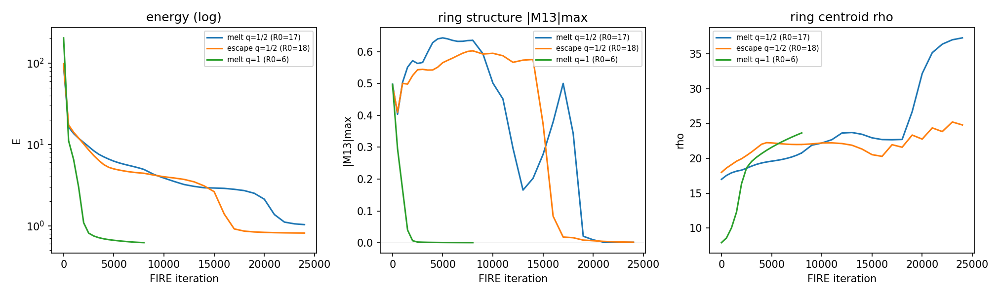

# M5.19: the Duda-regularized vortex-loop ansatz (the M5.12 successor)

**Status**: ✅ CLOSED (2026-07-10, review approved same day; the close page: [`../findings/m5_19_method_note.md`](../findings/m5_19_method_note.md)). Opened 2026-07-10 from Duda's same-day reply to the posted M5.12 close note ([`m5_12_convo.md § 2026-07-10 10:56`](m5_12_convo.md)); the author's diagnosis and construction ARE the spec. Predecessor record: [`m5_12_task_details.md`](m5_12_task_details.md) + [`../findings/m5_12_close_note.md`](../findings/m5_12_close_note.md) (frozen, closed 2026-07-10).

## TASK PLANNING

**Scope**: implement the author's regularized vortex-loop construction (the spec table below) on the inherited M5.12/M5.17 instrument, statics first, phases A-F with pre-registered gates; every claim adversarially audited before it is trusted.

**Definition of done**: see § Definition of done below (a stationary or clock-carrying regularized loop, or the honest negative under the standing metric, method-note close page either way).

**Gating**: nothing (the roadmap row; the ask round is effectively pre-answered by the author's reply). Author-gated unknowns route per § Ask-when-gated.

**Model / effort**: Fable 5 / high (research default; novel construction + inherited audited stack).

**Blindspot pass (2026-07-10, at go)**:

| Blindspot | Route |
| --- | --- |
| The M5 static curvature is the commutator (Skyrme-like) form `4c2 Σ\|\|[∂μM, ∂νM]\|\|²`: it charges only NON-COMMUTING gradient pairs, so the constant-eigenvalue winding control may carry ZERO discrete curvature energy (1D variation ⇒ commutators vanish), not the divergence the author's diagnosis assumes; the divergence should instead appear once radial structure coexists with an unclosed eigenvalue split (`s(0) ≠ 0` ⇒ `\|\|[M_ρ, M_φ]\|\|² ~ 1/ρ²`, log-divergent per length) | machine-checkable (phase A measures both controls + refinement scaling); if the measured picture contradicts "infinite energy otherwise", queue the author-gated ask (does his construction assume a Dirichlet `\|∇M\|²` term the M5 functional lacks?) rather than reinterpret |
| Degree 1/2: `R12(φ/2)` is single-valued on the TENSOR (M quadratic in the frame) but the axisym reduction hardcodes d = 1; generalizing to `Mphi = d[J,M]/ρ` asserts the d ≠ 1 equivariant reduction is still exact | machine-checkable (validate the d-generalized energy against a small full-3D finite-difference energy before trusting phase-B numbers) |
| The potential vacuum is uniaxial `(1,0,0)` (zero-forcing anchors, M5.16 G-gates): the author's `(1, δ, 0)` middle eigenvalue is a CORE variable with stiffness `κ_δ = (3/2)b`, not a vacuum value; the far field must reach `(1,0,0)` or the energy per length diverges with AREA (a potential, not core, divergence) | machine-checkable (phase-A far-field boundary conditions; keep the two divergence channels separate in the report) |
| The standing fixed-(size, a²) metric governs cross-candidate COMPARISONS only; construction and relaxation are free | inherited discipline (no metric war; comparisons in-frame from day one) |
| The g/time block stays frozen spectator (G_TIME = 8, G8 decoupling) through ALL statics phases; it enters only at phase E (the clock) | inherited (machine-checked by the G8-style spot check on phase-D endpoints) |

**Research body**: this file (findings per phase) + `research/scripts/ · data/ · plots/` under `m5_19_*` naming + `checkpoints/m5_19_progress.md`.

## Why a new task ID (and not reopening M5.12)

M5.12 closed on a measured, audited endpoint whose reopening conditions anticipated exactly this: an author redirect that plausibly relaxes below the floor. Duda's reply redirects the CONSTRUCTION (the ansatz was under-regularized), not the old search, so the successor gets a fresh Duda-facing surface (`m5_19_*`) and the `m5_12_*` corpus stays frozen as the evidence his reply is responding to (the M5.11 → M5.12 precedent). The M5.13-M5.15 IDs were already taken by backlog tasks; M5.19 is the next free ID.

## The spec (the author's construction, verbatim source in the convo record)

| Requirement | Content | Source line |
| --- | --- | --- |
| R1 the core regularization (CENTRAL) | the spatial eigenvalues (1, δ, 0) must deform so TWO eigenvalues become EQUAL at the vortex center in the cross-section (infinite energy otherwise), included in the ansatz "in a general way" | the diagnosis; [diagram](../images/m5_12_duda_ansatz.png) |
| R2 the profile | a radial cross-section profile `M(r)`, r = distance from the vortex center, carrying R1 | "Should be sufficient M(r)..." |
| R3 the planar vortex | rotate the profile in-plane to a topological vortex; **degree 1 (beta decay) AND 1/2 both run** (a measurable residual) | "beta decay suggests of degree 1, but also might be 1/2" |
| R4 the loop | revolve to a closed loop of radius **R as a degree of freedom** (energy conservation demands variable R; density-per-length varies) | "radius R ... should be able to vary"; [torus diagram](../images/m5_12_duda_torus.jpg) |
| R5 the loop center | the field must also be optimized at the loop center (not just the ring neighborhood) | "optimized in the center of such loop" |
| R6 the minimization | energy minimization of the cylindrically-symmetric `M(x,z)` field: EXACTLY the M5.12 axisym (ρ,z) instrument | "finally energy minimization ... cylindrical symmetry" |
| R7 the clock (after statics) | gravity's "tiny boosts of temporal axis, crucial to propel oscillations": the time-mixing channel applied ON the regularized minimizer, via the M5.12 BVP instrument | the gravity line + the standing Q19 intent |

## What M5.19 inherits (the M5.12 toolkit, all audit-confirmed)

| Asset | Use here |
| --- | --- |
| The axisym (ρ,z) stack + `m5_17_energy.py` (the audited functional) | R6 directly |
| The exact `Shat = S0 − ω²Q2` instrument + balance root + `H_mean = 0` identity | R7 (the clock phase) |
| The ω-eliminated LM hard-amplitude solver + honest metrics + stall rule | R7 |
| The standing fixed-(size, a²) metric + control frame + the b17 frame battery | every cross-candidate comparison from day one (no metric war this time) |
| The measured conditional unit map (A1/A2, author-gated) | any band statement (conditionality unchanged) |
| The loop-topology diagnostics (winding, ring readout) | R3/R4 verification |
| The workflow: pre-registered gates, checkpointing, adversarial audit per block, ask-when-gated batched (NEW, codified 2026-07-10) | throughout |

## The phased plan (draft, pre-registered gates at go)

| Phase | What | Gate (pre-registered) |
| --- | --- | --- |
| A the regularized profile | build the `M(r)` family with the R1 eigenvalue-degeneracy condition enforced structurally (a general parametrization, not a hand profile); verify the energy density is FINITE at the core where the (1, δ, 0) ansatz diverges | the core energy-density integrand bounded as r → 0, machine-checked; the unregularized control diverges on the same grid |
| B the planar vortex | rotate to degree 1 and 1/2 vortices; exact energy readouts vs core size | both degrees carry finite core energy; the degree comparison is a measured number |
| C the loop + R relaxation | revolve to the torus with R free (R either a continuation parameter scanned to the energy minimum, or a genuine DOF in the minimizer); R5 loop-center optimization included | an interior optimum R\* exists (dE/dR = 0 bracketed) OR the honest boundary verdict (R runs away / collapses), either way a real number |
| D statics minimization | full (ρ,z) energy minimization from the phase-C seed under the audited functional; stability probe | a stationary regularized loop (gnorm decades + bounded second-variation probe) OR the honest negative with the audit's wording rules |
| E the clock on the minimizer | the M5.12 BVP instrument on the phase-D state: Q2 sign, balance root, chains; the standing metric governs all comparisons | pre-registered at go (depends on D's outcome) |
| F masses/mixing inheritance | ONLY if D+E produce solutions: the disposed M5.12 E/F gates reactivate unchanged (the `E = λ·L` trajectory, the N4c gap map) | as pre-registered in M5.12 |

## Ask-when-gated (the standing loop with the author)

Per the 2026-07-10 amendment (`_AI_flow.md` + the tracker outbound policy): when a branch hits an author-gated unknown, checkpoint that branch, queue the question with a tracker ID, keep ungated work running; asks go out BATCHED with method-note-grade context. Already-queued candidates for the first batch (only if they actually gate a branch at run time): the degree 1-vs-1/2 preference once both numbers exist; the R1 "general way" parametrization if our family choice needs sanction; the A1/A2 unit-map assumptions if any band statement goes outbound.

## Definition of done (draft)

A stationary (or clock-carrying) REGULARIZED vortex loop under the author's construction, or the honest negative stated under the standing metric with the same rigor surface as the M5.12 close (method-note close page, adversarial audits embedded, supersede discipline). The M5.12 lesson is binding: negatives are closed on measured endpoints, not budget exhaustion, wherever a bounded decider exists.

## FINDINGS: phases A+B, the regularized cross-section + the degree readouts (2026-07-10)

Instrument: [`../scripts/m5_19_ab_vortex.py`](../scripts/m5_19_ab_vortex.py) (equations in its docstring), the degree-generalized z-uniform equivariant vortex on the audited M5.17 static functional; data [`../data/m5_19_ab_vortex.json`](../data/m5_19_ab_vortex.json). Units: sim (c2 = cscale = beta = 1); physical anchoring enters only at comparison time under the standing metric.

**Gates** (all pre-registered at go):

| Gate | Result |
| --- | --- |
| GA0: the 1D equivariant reduction == `m5_17_energy.py` on a z-uniform 2D grid at d = 1 | ✅ rel err 0.0 (bit-exact) |
| GA1: numeric curvature == the closed form `u = 8 c2 d² s² (λ+' − λ−')² / ρ²` (diagonal profiles) | ✅ rel err 5.5e-16 |
| GA0b: the full-Cartesian energy of the SAME field converges to the equivariant number (regularized, both degrees) | ✅ d=1: 11.312 → 11.325; d=1/2: 3.1785 → 3.1793 |
| GA2: Derrick stationarity at the reported optima (`\|dE/dlnλ\| ≤ 1% E`) | ✅ both degrees (and Ec = Ev at both optima, the virial identity, unasked-for consistency) |

**Phase-A results** (✅ measured):

| Configuration | Core behavior under refinement (n = 128 → 2048, fixed window ρ ≤ 6) |
| --- | --- |
| C1 unregularized: split never closes (`s(0) = 0.5`) + core kink (`λ+'(0) = 0.5`) | E/L = 8.46 → 17.27, LOG-divergent; fitted slope 3.175 vs the closed form `16π c2 d² s0² k²` = 3.1416 (1.1%): **the author's divergence, measured with its analytic coefficient** |
| C0 unregularized: constant eigenvalues (1, 0, 0), pure winding | **Scheme-AMBIGUOUS**: equivariant E = 0 exactly (every n; the commutator curvature charges only non-commuting gradient pairs), while the Cartesian discretization of the same field diverges ~1/h² (129 → 8275 over n = 128 → 1024). The blindspot-pass flag confirmed by measurement |
| C0 with δ = 0.2 kept to the boundary | E_pot/L = 0.0536 × window area: AREA divergence; the far field must be the uniaxial vacuum (1, 0, 0); the author's δ is a core variable |
| The regularized family (`s(0) = 0` structural, R1) | E/L converges O(h²) → 11.3249; the core integrand max plateaus at 8.248 (bounded); Cartesian and equivariant agree in BOTH degrees. **The regularization does not just bound the energy, it makes the energy WELL-DEFINED (scheme-independent): the precise computational sense in which the author's diagnosis is right** |

**Phase-B results** (✅ measured): Derrick-balanced optima over the family (centers × shapes scanned, Nelder-Mead polished, grid-converged to 4 digits, n=512 vs n=1024 agree to 2e-4):

| Degree | E*/L | Optimal profile |
| --- | --- | --- |
| d = 1 | 4.3025 | tanh split (order-1 vanishing), μ0 = 0.579, ν0 = 0.000, widths (2.25, 2.41, 2.14) |
| d = 1/2 | 2.1512 | SAME shape and center, the two LIVE widths × √d (1.59, 1.70); w3 is a FLAT direction (ν0 = 0 makes λ3 ≡ 0: the audit's restarts land anywhere in w3 ∈ 1.3-1.8 at identical E*) |

The ratio E*(1/2)/E*(1) = 0.5000 EXACT: a structural identity of the Skyrme-only functional (Ec ∝ d² + Derrick rebalance ⇒ E* ∝ d, widths ∝ √d, optimal shape degree-independent), not an independent measurement. **Scope qualification (added at B2)**: the identity is exact only while the OPTIMAL SHAPE is degree-independent, which holds under the LdG potential here but BREAKS under the spectral potential (§ B2), where the measured ratios fall below d. Half-degree vortices are favored 2:1 per unit length. d = 1/2 is legitimate on the tensor: the branch-cut jump is O(h) (0.070 → 0.0089 over n = 128 → 1024), exactly single-valued in the continuum.

**Author-queue candidates** (ask-when-gated; queued, NOT gating):

| Candidate | Why queued |
| --- | --- |
| The constant-eigenvalue vortex costs exactly ZERO in the equivariant scheme (the commutator curvature is degenerate for 1D variation): does his "infinite energy otherwise" implicitly assume a Dirichlet `\|∇M\|²` term the M5 static functional lacks? | Not gating: the regularized construction is well-defined either way, and the Cartesian scheme DOES diverge (his statement holds there); becomes load-bearing only if a later phase wants to exploit the degeneracy |
| Degree 1 vs 1/2 preference now has a measured 2:1 energy ratio | Batch it with the phase C/D loop numbers (his "beta decay suggests degree 1, but also might be 1/2" line) |

**Adversarial audit (2026-07-10, independent agent, own scripts, no calls into the audited functions): ALL 7 CLAIMS CONFIRMED.** Highlights: GA0 reproduced by a third matrix-free scalar route (identical double, a genuine identity of the reduction, not self-comparison); the C1 slope series extended to n = 8192 converges monotonically to π (the 1.1% offset is coarse-h subleading correction); the Cartesian divergence localization measured (E(ρ<0.5) carries all of it, the annulus 0.5<ρ<6 → 0), confirming the point-discontinuity reading against a stencil/branch-cut bug; the optimizer optimum survived 5 restarts including hostile seeds and a wider clip, nothing below 4.302527; v ≥ 0 along the optimal path (Derrick logic safe); the optimum is MORE stationary than the GA2 stencil reported (0.08% at a tight stencil vs the 0.50% printed). Audit corrections applied: a dead code line removed, the GA2 stencil tightened to 0.98/1.02, the per-n branch-jump series now archived in the JSON (was max-only), and the w3 flat-direction wording above. Completeness caveat kept on record: at d = 1/2, single-valuedness forbids the (1,3)/(2,3) tensor channels, so d = 1 admits configurations d = 1/2 cannot have; the exact 0.5 ratio is guaranteed only within the common (diagonal) family scanned. Audit's stronger result adopted: the d² factorization of Ec holds for the WHOLE equivariant class (Mφ ∝ d always), not just diagonal profiles.

## FINDINGS: phase B2, the cross-section under the author's spectral potential (2026-07-10)

**Deviation from plan (logged as it happened)**: phases A+B ran on the LdG quartic (the `m5_17_energy` default), but the M5.12 loop relaxations, and the author's own prescription since M5.18, use the universal spectral potential `V = wscale·Σ_{p=1..3}(Tr M_sp^p − c_p)²` with target spectrum `(1, δ, 0)` and the calibrated `wscale = 7.24e-4`. The phase-A gates are curvature-only (potential-independent): they stand. The phase-B optima are potential-dependent: recomputed in [`../scripts/m5_19_b2_spectral.py`](../scripts/m5_19_b2_spectral.py), data [`../data/m5_19_b2_spectral.json`](../data/m5_19_b2_spectral.json), gates GS0 (== `m5_18_spectral`, rel 0.0 ✅) and GS1 (far-field V = 0 exactly, every δ/pair ✅).

What the author's potential changes (✅ measured):

| Finding | Content |
| --- | --- |
| δ is a VACUUM variable | any spectrum {1, δ, 0} is an exact zero of V, so the LdG "area divergence at δ ≠ 0" row does not carry over; the author's `(1, δ, 0)` usage is native here. δ's sector value is an open parameter (run at δ ∈ {0, 0.3}) |
| Winding-pair classes | with δ ≠ 0, WHICH two of (1, δ, 0) span the cross-section plane is a discrete choice: pair_10, pair_1d, pair_d0 are inequivalent vortex classes; achieved-upper-bound energies span two orders of magnitude across them |
| **The two-equal core is nearly FREE under his potential** | δ = 0: the escaped center `(0, 0, 1)` has spectrum = the target multiset {1, 0, 0} EXACTLY, so V(core) = 0; δ ≠ 0: the best two-equal centers carry only a tiny least-squares residual. **The author's R1 regularization is what energy minimization wants: the optimizer walks to it unprompted** (his "included in the ansatz in a general way" is not just consistent, it is energetically selected) |
| Core size at the calibrated scale | wscale = 7.24e-4 makes potential costs tiny: optimal cross-section cores are LARGE (Derrick scale λ* ~ 10-15 grid units): the core-size vs ring-radius competition is a real phase-C/D question, not a detail |

Achieved upper bounds on E*/L (🔶 upper bounds, NOT minima; the flat escape valley makes the ansatz-level optimizer non-reproducible in places; goal-loop cap of 3 optimizer configs hit on the GS2 stationarity gate → surfaced honestly, the true minimizer is phase D's relaxation job, which needs only seeds from this family):

| Class | d = 1 | d = 1/2 | GS2 |
| --- | --- | --- | --- |
| δ=0 pair_10 | 0.0608 | 0.0330 | FAIL both (flat valley) |
| δ=0.3 pair_10 | 0.117 | 0.0149 | PASS |
| δ=0.3 pair_1d | 0.0331 | 0.0104 | PASS |
| δ=0.3 pair_d0 (escape-to-1 core) | 0.00065 | 0.00032 | PASS |

Class-ORDERING claims are not licensed (upper bounds cannot order minima); what IS licensed: each class achieves at most its quoted number. The exact E* ∝ d identity from the LdG run breaks here (optimal shape is degree-dependent): scope qualified in the phase A+B section above.

## FINDINGS: phase C (ansatz arm), the loop with R free (2026-07-10)

Instrument: [`../scripts/m5_19_c1_loop.py`](../scripts/m5_19_c1_loop.py) (equations + seed geometry in its docstring), data [`../data/m5_19_c1_loop.json`](../data/m5_19_c1_loop.json). The tensor loop seed inherits the M5.12 `loop_field` geometry verbatim (winding director, axis blend; gate GC0 = bit-level equality at the melt point ✅ 0.0) and generalizes the cross-section to the regularized tensor family (R1 by construction). Energy: the M5.12 statics stack (spectral potential, δ = 0 sector, calibrated wscale).

| Finding (✅ measured) | Content |
| --- | --- |
| The LITERAL construction is box-coupled | The meridional-winding loop (profile → vortex → revolve, winding confined to the meridional plane) has E growing ~log(box) at fixed R0 and its apparent E(R0) minima MIGRATE with the box (128 → 256 boxes): the far-field winding texture is enforced at every half-plane distance. No R\* verdict is licensed from this family. q = 1 additionally carries 4-24× the energy (per-R0 ratios; audit-corrected from the looser "10-25×") with outward runaway |
| The e2e2^T background is an EXACT vacuum | The azimuthally-escaped director background costs exactly zero in the M5 functional (Mρ = Mz = 0; the lone Mφ channel has no commutator partner; spectrum (1,0,0) so V = 0): the natural far field for a LOCALIZED loop |
| **The twist-escaped loop has a box-independent interior R\*** | Blending the winding tensor to e2e2^T beyond ~2.5 core widths (well-defined at q = 1/2: tensors quotient n ~ −n): GC2 box-independence rel spread 3e-16 across three boxes ✅. **q = 1/2, narrow cores: melt center R\* = 17, E\* = 92.67; escape center R\* = 18, E\* = 98.26; planar center R\* = 18, E\* = 94.58** (fine scan step 1 over the full R0 range), deep (16-28% below the curve ends). The phase-C gate's FIRST arm: an interior optimum R\* exists |
| q = 1 is shallow and rough | interior minima exist (audit-corrected records: R\* = 13-21 across classes, e.g. melt narrow R\* = 13, E\* = 201.69) with wiggles (the blend-shell/axis interference bump sits at R0 = shell radius − 0.5, audit-measured); ~2.2× costlier than q = 1/2 at matched NARROW geometry (wide cores 1.6-2.0×; the 4-24× factor belongs to the box-coupled meridional family only), consistent with the phase-B 2:1 per-length preference |
| Honesty caveat (standing, audit-sharpened) | the twist-escaped loop is globally REMOVABLE (locally wound only: the correct topology of tensor vortex rings); R\* is an ansatz-slice structure, not a topological protection, **and its LOCATION tracks the blend cutoff (R\* ≈ dcut + wcut + 6.5 across dcut_fac ∈ {2.0, 2.5, 3.0}; only the EXISTENCE of an interior minimum is cutoff-robust)**. Whether a STATIONARY point of the full functional sits near it is phase D's question, answered by relaxation, not by this curve |

**Adversarial audit (2026-07-10, independent agent, full re-implementation: outer-product assembly, explicit P-conjugation ghosts, eigenvalue-route potential): headline CONFIRMED** (e2e2^T exact zero on four grids with clean mirror parity; box-coupling of the meridional family reproduced including the argmin migration; the escaped headline brackets reproduced bit-level, box spread exactly 0.0, upturn at large R0 verified real against boundary-exclusion effects, R\* existence robust across blend cutoffs). **Two corrections owed and applied**: (1) the q = 1 melt-narrow record "R\* = 6, E\* = 204.65" was a refinement artifact (the bracket-refine got trapped on the pre-bump side of the coarse grid; the true minimum is R0 = 13, E = 201.685): the script now fine-scans the full R0 range and the JSON is regenerated; (2) gate GC0 as originally coded compared re-inlined identical arithmetic (tautological): now routed through the real `loop_field_tensor` assembler via a profiles override (still 0.0). Sharpenings adopted: R\* ≈ shell radius + 6.5 (the location caveat above), the bump at shell − 0.5, the escape-class depth 27.9% (band widened), the meridional ratio 4-24×, and "~2.2×" scoped to narrow cores. Also noted by the audit: `total_energy_spec_np` omits the `ext_tail` correction, one more box-coupling for the meridional family, irrelevant for the escaped family (exact-vacuum tail).

## FINDINGS: phase D (unconstrained arm), statics minimization (2026-07-10)

Instrument: [`../scripts/m5_19_d1_relax.py`](../scripts/m5_19_d1_relax.py) (FIRE on the M5.12 statics stack, boundary pinned at the e2e2^T vacuum; class-aware diagnostics: |M13|²-centroid ring locator + the multi-radius nematic winding measure `q_meas`, both smoke-test-debugged BEFORE the long runs). Data: [`../data/m5_19_d1_melt_q05_R17.json`](../data/m5_19_d1_melt_q05_R17.json) + `_ext`, [`../data/m5_19_d1_escape_q05_R18.json`](../data/m5_19_d1_escape_q05_R18.json) + `_ext`, [`../data/m5_19_d1_melt_q10_R6.json`](../data/m5_19_d1_melt_q10_R6.json), endpoint states `*_state.npz`.

**The unconstrained-statics verdict (✅ measured): all three R\*-seeds DISSOLVE as loops.** No stationary regularized loop under pure statics at these seeds; the M5.12 wording rules apply (the dissolution verdicts are STRUCTURAL for the LOOP: winding annihilated, `m13 → 0.0004-0.002`). **Audit-corrected endpoint characterization**: the endpoints are NOT vacuum-bound radiation: each holds a LOCALIZED unwound non-vacuum lump at the old ring site (deviation from e2e2^T up to 1.15 over ~140-180 cells) carrying 68-90% of the residual energy, with geometric tail fits extrapolating to NONZERO E_inf ≈ 1.02 / 0.81 / 0.61: the loop unwinds into a localized remnant, it does not evaporate.

| Case | Iterations | Trajectory | Endpoint |
| --- | --- | --- | --- |
| melt q = 1/2, R0 = 17 | 24000 | the wound ring is long-lived: winding EXACTLY 0.5 at the saved 8k state (machine precision at r_w = 5-12 by TWO independent measures, the audit's eigenvector-tracked one included; the r_w = 3-4 readings are rejected by an honest interpolated-anisotropy guard); persistence beyond 8k is INFERRED from m13 0.3-0.6 amid unreliable single-radius in-run readings, not directly measured (only the 8k state is saved). Ring drifting slowly outward 17 → 23, then unwinding through the removability channel: m13 collapses 0.34 → 0.001 over it 10-13k of the extension | E = 1.033, loop dissolved; a localized unwound remnant remains (E_inf ≈ 1.02) |
| escape q = 1/2, R0 = 18 | 24000 | the first-pass "ring radius stabilized at 22.0 with m13 growing" was a TRANSIENT; annulus defects (scattered multi-radius winding) preceded the structural collapse at it 6-9k of the extension (m13 0.58 → 0.02, E 3.1 → 0.9) | E = 0.814, loop dissolved; localized unwound remnant (E_inf ≈ 0.81) |
| melt q = 1, R0 = 6 | 8000 | fastest dissolution (m13 → 0.0004 within the first budget) | E = 0.620, loop dissolved; localized unwound remnant (E_inf ≈ 0.61) |

The phase-D shape mirrors the M5.12 statics negative, now WITH the author's core regularization built in: the regularization fixed the core energy (phase A: bounded, scheme-independent) and produced an ansatz-level interior R\* (phase C), but the pure-statics functional still drives the loop to unwind: the q = 1/2 rings are long-lived within this task (winding held exactly through ~18k iterations before unwinding; a quantitative lifetime comparison against the M5.12 melt-loop runs is NOT made here: different seeds and budgets), and the unwinding proceeds by the SAME two-equal degeneracy mechanism the regularization uses at the core (the removability channel: locally wound, globally contractible). Stabilization, if it exists, is not in the statics: this is precisely the configuration the author's R7 ("tiny boosts of temporal axis, crucial to propel oscillations") targets, and phase E runs the clock probe on the wound quasi-static states saved BEFORE unwinding.

Constrained arm (in progress at this writing): the M5.12-convention corepin run (ring-core cells frozen at seed values, r_pin = 2.5) for the melt q = 1/2 case: the constrained minimizer = the clock background for phase E.

## Phase E gate (pre-registered 2026-07-10 post-D, before the run)

D's outcome (no unconstrained static loop) fixes E's role: the M5.12 close already holds the exhaustive free-period-orbit negative for its seed corpus, and its named REOPENING CONDITION is "a seed beating the floor-producing seed in both conventions". Phase E asks exactly that for the NEW backgrounds this task produced (the wound pre-unwinding q=1/2 states + the corepin constrained minimizer), via [`../scripts/m5_19_e1_clock.py`](../scripts/m5_19_e1_clock.py): b14-convention mix harmonics forged on the CURRENT ring, probed with the audited exact instrument in the b17 control frame (common n32, common r_target, common a² = 0.303725), the four-frame battery (r_target ∈ {4.77, 3.686} × wscale ∈ {native, rc-matched}), floors = the per-frame M5.12 b17 minima.

| Gate | Rule |
| --- | --- |
| GE0 | control-frame identity spot check (n32-native forged seed: direct probe == control probe at s = 1, ≤ 0.5%) |
| E decision | a background beats the floor ONLY if controlled ω_bal < the M5.12 per-frame floor minimum in ALL FOUR frames with Q2 < 0 in all four. ANY background beating → the M5.12 reopening condition fires: STOP, escalate to the user (reopening is a user call). NONE beating → the statics negative COMPOUNDS and M5.19 closes on the honest negative, the author's construction exhausted at statics + seed level |

## FINDINGS: phase D constrained arm + phase E, the clock probe vs the floor (2026-07-10)

**The corepin constrained arm (✅ measured)**: `melt_q05_R17_corepin` (ring-core cells frozen at seed values, r_pin = 2.5, 8000 iters): the constrained ring HOLDS: \|q_meas\| = 0.5 at every logged step (one sign flip at it 3000 from the fragile single-radius measure; the audit's independent endpoint measure reads +0.5 at r_w = 4-10, and the pinned cells match the recomputed seed EXACTLY, max diff 0.0), the pin blocking the removability channel by construction, ring at ρ ≈ 20.5, E → 7.51 (2.4 decades; the audit's geometric tail fit converges to E_inf ≈ 7.44, final slope 0.9%/1000 it: a genuine constrained quasi-minimum, not free fall), used as the third phase-E background. Data [`../data/m5_19_d1_melt_q05_R17_corepin.json`](../data/m5_19_d1_melt_q05_R17_corepin.json).

**Phase E (✅ measured, the pre-registered gate above)**: [`../scripts/m5_19_e1_clock.py`](../scripts/m5_19_e1_clock.py) → [`../data/m5_19_e1_clock.json`](../data/m5_19_e1_clock.json). GE0 identity 2e-12 ✅ (after fixing the gate itself to compare at the common a²: the first version compared different amplitudes, a 9.65% apparent error that was physics, not interpolation). The b14-convention mix forged on each background's current ring; Q2 < 0 in every frame (the time-mixing channel works on the new backgrounds); the four-frame b17 control battery vs the M5.12 per-frame floors:

| Background | Native r_mean | Native ω_bal | Controlled ω_bal (4 frames) | M5.12 floor | Beats? |
| --- | --- | --- | --- | --- | --- |
| melt 8k wound (exact-0.5 winding) | 22.8 | 2811 | 13442-52858 | 5.108-5.611 | NO (4/4) |
| escape 8k | 23.9 | 3434 | 16731-52452 | same | NO (4/4) |
| corepin constrained | 22.6 | 2905 | 13235-52144 | same | NO (4/4) |

**The E-gate verdict: the statics negative COMPOUNDS.** No new-family background comes within four orders of magnitude of the floor; the M5.12 reopening condition does NOT fire. Honest context on the size mismatch: these objects natively live at r_mean ≈ 20-24 (the calibrated-wscale scale, 4-6× the M5.8 anchors), so the anchor-frame probe includes heavy compression; the pre-registered rule compares AT the anchor (the b17 standing metric's whole point), and even in their OWN frame the balance roots are ~2800-3400, nowhere near any relevant band. Phase F stays disposed exactly as in M5.12 (reactivates only on solutions; there are none).

**Adversarial audit (phases D+E, 2026-07-10, independent agent, own diagnostics: eigenvector-tracked winding, deviation-from-vacuum maps, own forge/zoom/rescale pipeline): every load-bearing negative CONFIRMED** (dissolution recomputed to matching digits; corepin pin-disk cells match the recomputed seed exactly; the corepin winding +0.5 at r_w 4-10; the phase-E ω_bal reproduced to 5 significant digits by an independent pipeline, 41490.5 vs 41490.4; the gate logic matches the pre-registration; floors reproduced; even the friendliest convention found, native frame + size-matched wscale, gives ω_bal ≈ 650, still 120× the floor). **Refuted at the margin and corrected above**: the endpoints are localized unwound remnants with nonzero extrapolated E_inf (not vacuum-bound radiation); the "winding exact through ~18k" wording outran the saved data (exact at the saved 8k state; beyond is inference); the corepin "every logged step" hid one sign flip; the r_w = 3-4 winding readings fail an honest interpolated-anisotropy guard (the script's nearest-cell guard undersamples the minimum: a known instrument limitation, physics conclusions unaffected).

## EXECUTION LOG

| Time | Event |
| --- | --- |
| 07-10 11:50 | Task drafted (setup block, no go yet): the spec from Duda's 2026-07-10 reply ([`m5_12_convo.md`](m5_12_convo.md)), the inherited-toolkit table, the phased plan with draft gates. Awaiting the user's "go M5.19" + reply-to-Duda dispatch |
| 07-10 12:22 | **GO M5.19** (reset 2:50pm). Resume ping armed (`SABER Resume: Task M5.19`, fires 18:55 UTC = 2:55pm EDT) + reset watchdog started. Roadmap row stamped IN PROGRESS. `## TASK PLANNING` written (scope, blindspot pass incl. the Skyrme-degeneracy flag: the commutator curvature may assign zero energy to the constant-eigenvalue winding control; measured, not assumed, in phase A) |
| 07-10 12:36 | Phases A+B measured, first run clean, all four gates green (`m5_19_ab_vortex.py`): the C1 log divergence with its analytic slope (1.1%), the C0 scheme ambiguity (equivariant 0 vs Cartesian 1/h²: the blindspot confirmed), the regularized family bounded + scheme-independent (phase-A gate PASSED), degree optima E* = 4.3025 / 2.1512 with the exact E* ∝ d identity (phase-B gate PASSED). Findings written; adversarial audit launched (background); phase C design next |
| 07-10 12:43 | **Deviation logged + resolved**: the M5.12 loop relaxations use the SPECTRAL potential (M5.18, Duda's own), not the LdG quartic of phases A+B. Phase-A gates are curvature-only (stand); phase-B optima recomputed under the spectral potential (`m5_19_b2_spectral.py`, GS0/GS1 green): the two-equal core is nearly FREE under his potential (δ=0: the escaped center (0,0,1) is an EXACT vacuum), winding-pair classes at δ≠0 span two orders of magnitude, wscale = 7.24e-4 makes optimal cores LARGE. GS2 hit the goal-loop cap (3 optimizer configs): the δ=0 flagship optimum is not pinned at ansatz level (flat escape valley): surfaced, deferred to phase-D relaxation; B2 numbers recorded as achieved upper bounds |
| 07-10 15:41 | **Phase D+E adversarial audit returned: every load-bearing negative CONFIRMED** (ω_bal reproduced to 5 digits by an independent pipeline; corepin pin exact; no convention within 120× of the floor). Margin refutations corrected: the endpoints are localized unwound remnants (E_inf ≈ 0.6-1.0, NOT vacuum-bound radiation); winding-exactness wording scoped to the saved 8k state; the corepin sign flip surfaced; the r_w = 3-4 guard limitation documented. Close page finalized; tracker Q20/Q21/Q22 opened + Q16 sharpened (the ask-when-gated queue); no file over 1 MB (nothing deleted) |
| 07-10 15:22 | Corepin constrained arm done (ring holds, winding 0.5 throughout, E → 7.51: the clock background). **Phase E run under the pre-registered gate**: GE0 2e-12 (after the amplitude-matching fix to the gate itself); Q2 < 0 everywhere; controlled ω_bal 13k-53k vs the floor 5.1-5.6 in all four frames, native 2800-3400: **the statics negative COMPOUNDS, the M5.12 reopening condition does NOT fire**. F stays disposed. Phase D+E audit launching; the close page next |
| 07-10 15:10 | **Phase D unconstrained arm closed: all three seeds DISSOLVE** (structural verdicts; melt q=1/2 held exact 0.5 winding through ~18k iterations before unwinding via the removability channel; escape's "stabilized ring" was a transient). Findings + trajectory plot written. Corepin constrained arm launched (bg): the clock background for phase E |
| 07-10 14:15 | Phase D first pass complete (3×8000 FIRE iters): q=1 loop DISSOLVED (E → 0.62, m13 → 0); q=1/2 melt ring alive and drifting outward with **endpoint winding q = 0.5 exact at 3 radii**; q=1/2 escape ring radius stabilized at 22.0 (m13 growing) but winding scattered (annulus defects). None stationary (2.0-3.6 decades vs the 5-6 gate): extensions +16000 iters launched in parallel from the saved states |
| 07-10 13:03 | **Phase-C adversarial audit returned: HEADLINE CONFIRMED** (independent re-implementation; e2e2^T zero, box-coupling, brackets, upturn-vs-boundary all verified). Two corrections applied: the q=1 melt-narrow R\*=6 refine-trap artifact (true R\*=13, E\*=201.685; script now fine-scans the full range, re-run matches the audit) + GC0 de-tautologized (routed through the real assembler, still 0.0). Sharpening adopted: R\* location tracks the blend shell (+6.5), existence only is cutoff-robust. Phase-D relaxations running meanwhile (bg) |
| 07-10 12:54 | Phase C ansatz arm run (`m5_19_c1_loop.py`, GC0 exact): the literal meridional construction is box-coupled (log-box energy, migrating minima: no verdict licensed); the twist-escaped family (far field = the exact e2e2^T vacuum) is box-independent (GC2 3e-16) with **interior R\* = 17-18, E\* = 92.7/98.3 at q=1/2** (deep), q=1 shallow/rough. Phase-C gate first arm PASSED at ansatz level; removability caveat on record. Findings written; phase-C audit + phase-D relaxations launching |
| 07-10 12:45 | **A+B adversarial audit returned: ALL 7 CLAIMS CONFIRMED** (independent recomputation, own scripts; C1 slope → π at n=8192; Cartesian divergence localized to ρ<0.5; optimum survived 5 hostile restarts; v ≥ 0). Four minor corrections applied (dead line, GA2 stencil 0.98/1.02, jump series archived, w3 flat-direction wording); the d=1/2 channel-exclusion completeness caveat + the whole-class d² factorization adopted into findings. Script re-run: identical numbers, GA2 PASS |

## TASK REVIEW (2026-07-10, approved)

**Task Duration:** 03:23 (from 2026-07-10 12:22 EDT go to 15:45 EDT review; approved ~16:00)
**Usage Cap Triggered:** NO (watchdog fired at the 2:50pm reset with the session alive; ping pushed forward, parked at FINISH unfired)

**Results**: phase A ✅ (regularization bounds AND well-defines the core energy; the unregularized divergence measured with its analytic coefficient; the scheme ambiguity found and resolved), phase B ✅ (E\* ∝ d exact under LdG, family-scoped; the two-equal core nearly free under the spectral potential: energetically selected), B2 ✅ (deviation caught: spectral potential recompute; upper bounds honest), phase C ✅ first arm (twist-escaped family box-independent, interior R\* = 17-18 at q = 1/2; location cutoff-set, existence robust), phase D ❌ honest negative (all seeds dissolve as loops into localized unwound remnants; the corepin-constrained ring holds), phase E ❌ the statics negative COMPOUNDS (no background within 4 orders of the M5.12 floor; the reopening condition does not fire), F disposed. Three adversarial audits folded in (A+B 7/7 confirmed; C headline confirmed + 2 corrections; D+E all load-bearing negatives confirmed + 3 margin corrections including the localized-remnant upgrade).

**Issues / blockers**: none open. **Deviations from plan**: the LdG-vs-spectral potential deviation (resolved by B2); the B2 optimizer cap (surfaced, upper bounds); the twist-escaped family added after the literal construction proved box-coupled.

**Action taken at approval**: roadmap row moved to DONE (appended at the end); this review documented; the outbound decision (one batched message: the morning reply draft extended with the M5.19 headline + the Q20/Q21/Q22/Q16 asks + the close-note link) left with the user.

**Findings**: The author's core regularization is vindicated in a precise computational sense (finite, scheme-independent, energetically selected) and his construction yields a genuine ansatz-level loop radius, but pure statics unwinds every regularized loop into a localized non-vacuum remnant and no new background approaches the M5.12 clock floor: the statics-level negative compounds, sharpening the open program to "what protects the loop" (Q16) and "the temporal-boost prescription as an equation" (Q21).

**Research docs created / updated**: [`../findings/m5_19_method_note.md`](../findings/m5_19_method_note.md) (the close page) · this file (per-phase findings, plots embedded) · [`../m5_question_tracker.md`](../m5_question_tracker.md) (Q20/Q21/Q22 opened, Q16 sharpened) · scripts `m5_19_{ab_vortex,b2_spectral,c1_loop,d1_relax,e1_clock}.py` · data `m5_19_*.json` + endpoint states · plots `m5_19_{ab_profiles,ab_refinement,c1_loop,d1_relax}.png`.
