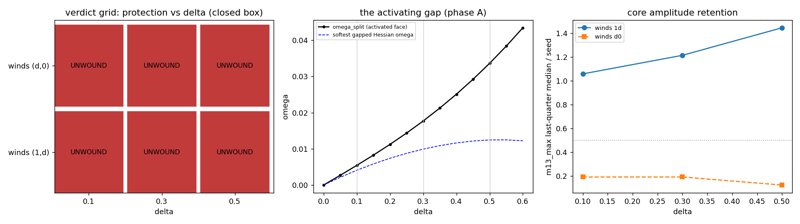
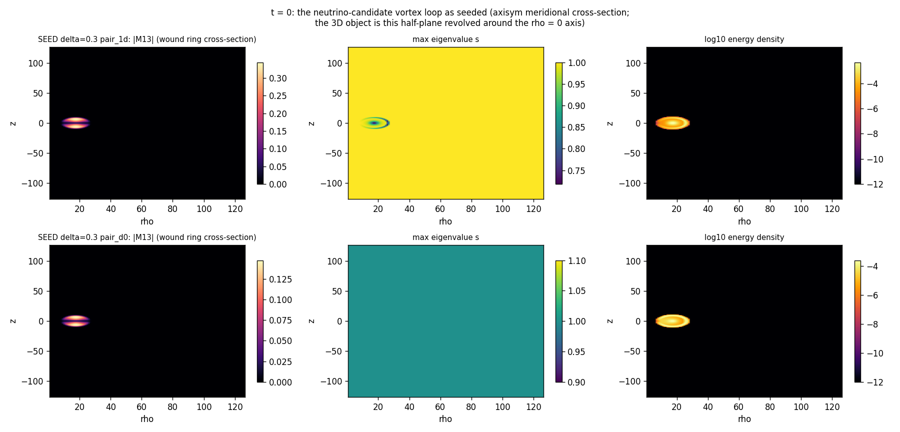
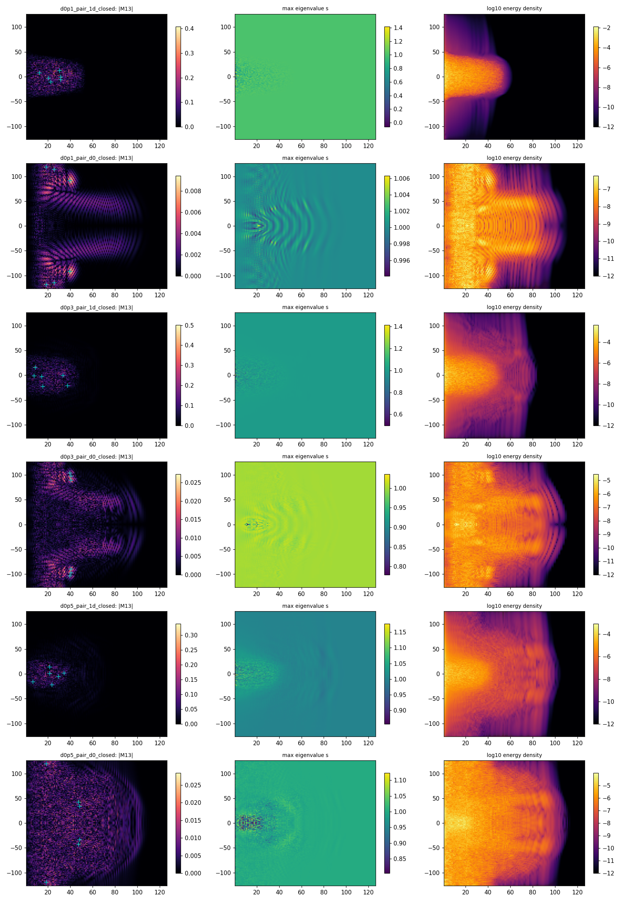
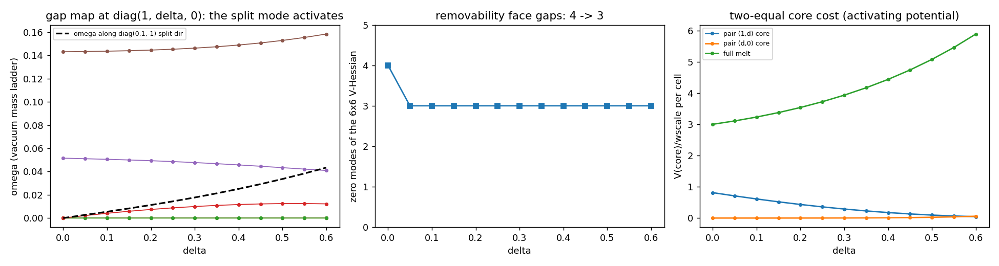
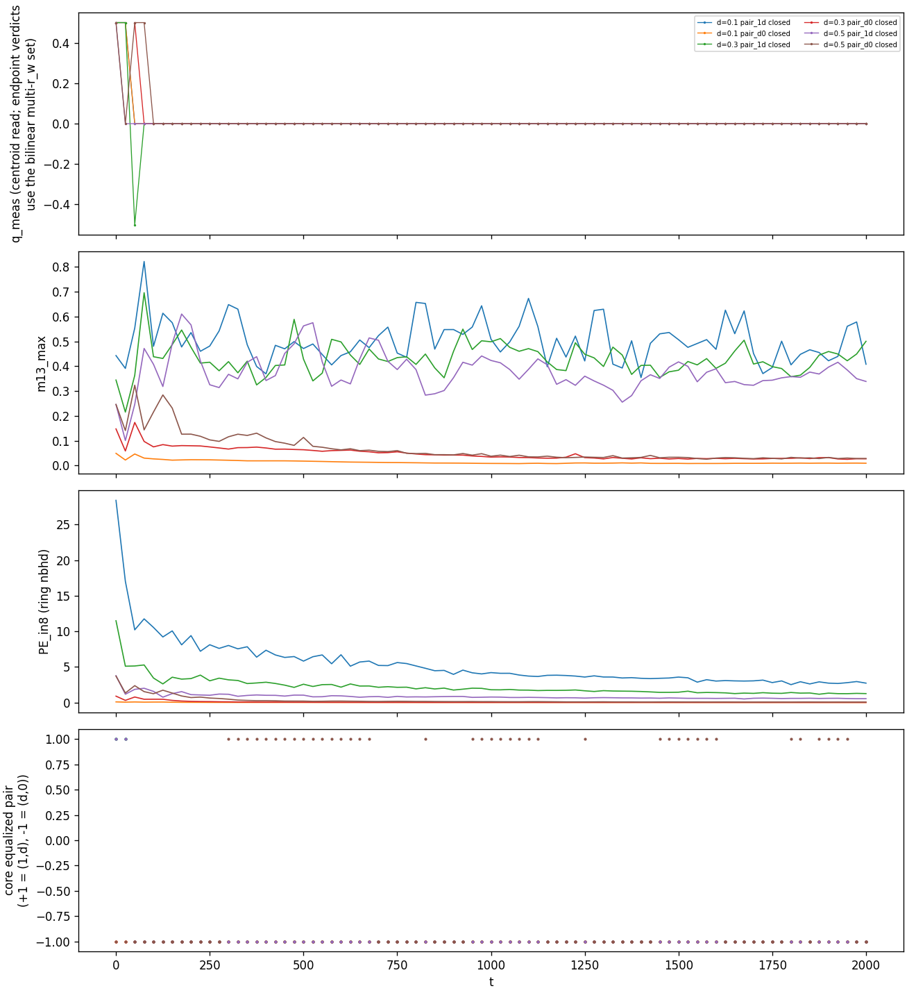

# M5.20.1 - Biaxial (1, δ, 0) dynamics: does the spectral gap protect the vortex loop?

**Status**: ✅ DONE 2026-07-12 (review approved; roadmap DONE row). **Renumbered 2026-07-12** (user call): M5.21 → **M5.20.1**, successor M5.22 → **M5.20.2**; the neutrino vortex-loop runs group as M5.20.x. **Spec**: Duda 2026-07-11 14:27 ([`m5_20_convo.md`](m5_20_convo.md)): "topological vortex requires potential with (1, delta, 0) minimum - preferred three different, which should regularize to two equal in center - to prevent discontinuity of infinite energy, activating potential. So maybe there is problem with assumed simpler spectrum." Predecessors: [M5.20](m5_20_task_details.md) (conservative dynamics at δ = 0, all runs unwound) · [M5.19](m5_19_task_details.md) (statics; B2 measured the winding-pair classes at δ = 0.3). Outbound seed round sent 2026-07-11 16:07 (3 questions); **ANSWERED overnight 2026-07-12 00:06 and FOLDED into this plan** ([`m5_20_convo.md`](m5_20_convo.md)): "in 3D (1, delta, 0) you can start with" (Q3 = the no-scope-change branch, the spatial run is the sanctioned start), no δ value given (the sweep stands), the winding pair left to energy minimization ("has to equalize 2 eigenvalues in the center": measured, not assumed, via the core-equalization diagnostic below); the full 4×4 (g, 1, δ, 0) oscillation run is the declared successor (**M5.20.2** stub, roadmap Backlog; his 07-12 "(1,g,delta,0)" read as a misspelling of the standing spectrum, user call).

## TASK PLANNING

### Scope: the question in one sentence

M5.20 proved the δ = 0 theory does not protect the loop because the two-equal-eigenvalue face is potential-free in that vacuum (4 zero modes, the removal path). His directive: the vortex sector requires three DISTINCT eigenvalues (1, δ, 0), which gaps that face ("activating potential") and changes the vacuum-manifold topology (SO(3) flag-manifold orbit, π₁ = Q₈, no free escape). M5.20.1 re-targets the audited M5.20 conservative-dynamics stack to (1, δ, 0) and measures whether the gap protects the loop: **protection as a function of δ**.

His 2026-07-12 reply author-confirms both the premise and the start ([`m5_20_convo.md`](m5_20_convo.md)): "the problem was indeed assuming delta=0 everywhere, for which there is no topological vortex" and "in 3D (1, delta, 0) you can start with".

Both outcomes are decisive: HELD at δ ≠ 0 = the program's first protected loop (the reopening event); UNWOUND at δ ≠ 0 = the spectrum objection also fails in-framework, and protection has exactly one door left (the Q23 time sector, now the declared M5.20.2 successor).

### Spec decode (his 2026-07-11 replies + the 2026-07-12 seed-round answer)

| His statement | Consequence for M5.20.1 |
| --- | --- |
| "(1, delta, 0) minimum - preferred three different" | Potential targets `c_p = 1 + δ^p` (the code's `cps` argument, already general; gate S3 pins the biaxial minimum to machine zero since M5.18) |
| "regularize to two equal in center ... activating potential" | The core seed keeps his two-equal regularization, which now COSTS potential energy: compute the per-cell core cost analytically PER PAIRING as the barrier scale: `V((1+δ)/2, (1+δ)/2, 0)` for the (1, δ) pair, `V(1, δ/2, δ/2)` for the (δ, 0) pair |
| "problem with assumed simpler spectrum" | δ = 0 results stand as that sector's verdict; no re-litigation. M5.20.1 is a NEW theory point, not a fix. Author-confirmed 2026-07-12: "the problem was indeed assuming delta=0 everywhere" |
| "in 3D (1, delta, 0) you can start with" (07-12) | The spatial run is the SANCTIONED start: the canonical-kinetic-term conditionality stays flagged (Q23), but the sector choice is now his, not ours |
| "Energy minimization has to equalize 2 eigenvalues in the center of vortex" (07-12) | The two-equal core is the predicted OUTCOME of minimization, not just a seed choice: seed both pairings, then MEASURE which pair the run equalizes (the core-equalization diagnostic, DoD 3b). This is the measured answer to the unanswered seed-round Q2 (the Q22 pairing half) |
| "finally to get oscillations requires full 4x4 tensor ... (1,g,delta,0)" + "clock propulsion ... (g, 1, delta, 0)" (07-11) | OUT OF THIS RUN, IN THE PROGRAM: the successor **M5.20.2** (§ Successor below). The 07-12 "(1,g,delta,0)" is read as a misspelling of the standing `(g, 1, δ, 0)` (user call 2026-07-12; the engine convention he has reinforced consistently); the potential pins the SET, the timelike assignment is Q19 |
| "charges: 3 spatial eigenvalues equalized in the center ... black holes: all 4" (07-12) | The regularization ladder, recorded in [`m5_20_convo.md`](m5_20_convo.md); consistent with his 2026-07-06 `aI` / `(g', a, a, a)` charge-core prescription. No M5.20.1 consequence |

### Definition of done

1. **Gap map**: vacuum mass spectrum at diag(1, δ, 0) vs δ (numeric 6×6 V-Hessian, extending `vacuum_mass_spectrum`, vs analytic): confirm the zero-mode count drops 4 → 3 (Goldstone only) and measure the removability-face gap ω(δ).
2. **Vacuum enumeration**: the axisym-compatible uniform biaxial vacua (eigenvalue assignments to the (ρ̂, φ̂, ẑ) frame) enumerated with exactness checks (V = 0 AND u_curv = 0 per variant), the M5.20 dir-vacuum lesson applied up front.
3. **Instrument adaptation gated**: (a) an eigenframe-based winding read (largest-eigenvector angle of the wound pair, with degeneracy-gap guards) validated on synthetic known-q configurations before any production read; (b) the **core-equalization diagnostic** (his 07-12 mechanism made measurable): core spectrum profile `λ_i(ρ→0)` + degeneracy gap at the core center vs time, reporting WHICH pair the minimization equalizes per run (the measured Q22 pairing answer).
4. **Statics triage**: FIRE relax per (δ, pairing) seed: does the removability channel close already in statics?
5. **Dynamics verdict**: the M5.20 conservative instrument (gates GF/GA0-GA3 re-run at δ ≠ 0) on the production matrix; pre-registered classifier verdict per (δ, pairing) + per-peak core hunt; **the headline: protection vs δ**.
6. **Remnant re-probe**: is the breather-candidate oscillation present/absent/sharper in the gapped theory (comb vs the δ-dependent vacuum mass lines)?
7. Method-note-grade close page + independent adversarial audit; tracker (Q22/Q23) + convo routing updated; doc checker green. The note OPENS with a **FIELD CONTENT box** (the legibility fix for his repeated 4×4 directive): the substrate is the full 4×4 M with `D = diag(g, 1, δ, 0)` (engine since M5.8.1; the M5.18-verified 4D Lagrangian; the spectral potential pins `(g, 1, δ, 0)` exactly), and THIS run evolves the spatial 3×3 block with (1, δ, 0) per his sanctioned start ("in 3D (1, delta, 0) you can start with", quoted), with the full-4×4 oscillation run declared as M5.20.2 and its open inputs named (Q23 time term in M variables; Q18 constraint structure for the degenerate Legendre map; Q19 branch).

### Blindspot pass (unknown unknowns the plan must carry)

| # | Blindspot | Mitigation |
| --- | --- | --- |
| 1 | **The winding instrument assumes the δ = 0 director structure**: `winding_measure` reads component angles; at δ ≠ 0 the wound object is an eigenframe, and near-degenerate eigenvalues make the read ill-conditioned | DoD 3: eigenframe read + gap guards, gated on synthetic seeds BEFORE production; keep the M5.20 core-hunt as the second instrument |
| 2 | **wscale confound**: recalibrating w per δ (virial autochi) changes the length scale, entangling "gap effect" with "scale effect" | Primary runs at the FIXED M5.20 w = 7.24e-4 (controlled comparison vs the δ = 0 corpus); ONE recalibrated control at δ = 0.3 to bound the scheme dependence |
| 3 | **Uniform biaxial vacua are not all exact on the axisym grid** (the M5.20 e2-vacuum surprise): assignments with distinct (ρ̂, φ̂) eigenvalues carry the equivariant background gradient `A_φ = [J, M₀]/ρ` | DoD 2 enumeration first; seeds built ONLY on verified-exact (or measured-cost) far fields; the linear-radiation lemma re-derived per chosen vacuum (the corrected M5.20 § 1 logic) |
| 4 | **Stiffness/dt**: the new mass gap raises the top frequency; dt stability must be re-established | GA1 dt² drift scaling re-run at the largest δ before production; dt reduced if needed (budget noted below) |
| 5 | **Winding-pair classes differ by orders of magnitude** (M5.19 B2 at δ = 0.3): the (δ, 0) pair may be so cheap it behaves δ = 0-like, the (1, δ) pair so stiff seeds barely relax | Run BOTH pairings at δ = 0.3 (the Q22 pairing half); expected-cost table from B2 informs seed amplitudes. His 07-12 reply reframes the pairing as minimization-SELECTED: the core-equalization diagnostic (DoD 3b) reads the selection instead of trusting the seed |
| 6 | **Q₈ topology bookkeeping**: at δ ≠ 0 the half-vortex classes are non-abelian (π₁ = Q₈); class labels from a single angle read can mislead | Verdicts rest on the core hunt + energy localization, not the class label; the label is reported as auxiliary |
| 7 | **His answers may arrive mid-plan** (same-day replier) | ✅ FIRED 2026-07-12: the answers landed pre-go and folded per the table below with no redesign (the mitigation worked as designed) |

### Phased plan

| Phase | Content | Budget |
| --- | --- | --- |
| **A: vacuum theory** | Gap map (DoD 1) + vacuum enumeration (DoD 2) + core-cost table `V(two-equal)` vs δ; gates: S3 pinning, FD gradient at δ ≠ 0 (`dv_spec` with general `cps`), Hessian analytic-vs-numeric | short (minutes; NumPy) |
| **B: seeds + instrument** | Adapt `loop_field_escaped_z` to biaxial far fields; wind the chosen pair with the two-equal regularized core; eigenframe winding read + core-equalization diagnostic built + gated on synthetic known-q configs (DoD 3) | short |
| **C: statics triage** | FIRE relax per (δ, pairing): δ ∈ {0.1, 0.3, 0.5} × pairing {(1,δ), (δ,0)} at modest budget; classify holds/dissolves; statics survivors + one dissolver go to dynamics | ~1h total |
| **D: conservative dynamics** | The M5.20 instrument verbatim (fast-path gradient re-gated vs the audited einsum path at δ ≠ 0; GA0-GA3 re-run incl. the pulse test on the chosen vacuum): production matrix below; classifier + core hunt + energy ledger per run | overnight core |
| **E: remnant + synthesis** | Blob probe + breathing comb vs the δ-dependent mass lines; protection-vs-δ synthesis; method note; adversarial audit; tracker/convo routing | ~1h |

**Production matrix (phase D, ~10 runs, M5.20-scale ≈ 1h/run)**: δ ∈ {0.1, 0.3, 0.5} × pairing {(1,δ), (δ,0)} closed-box (6 core runs) + sponge arms on the δ = 0.3 pair-winners (2) + the recalibrated-w control at δ = 0.3 (1) + a δ = 0 back-compat anchor re-run (1, pins continuity with the M5.20 corpus). Gentle-release arms (corepin-style) added only if quench starts unwind everywhere (they were the long-lived class in M5.20).

### Duda-answer folding table (the 2026-07-11 seed round): ✅ ANSWERED 2026-07-12, outcomes applied

| If he answers | Plan change | Outcome (his 2026-07-12 reply) |
| --- | --- | --- |
| Q1: a δ value | Sweep collapses to {his value} + one bracket point each side; freed budget → longer horizons | No value given: **sweep stands** {0.1, 0.3, 0.5} |
| Q2: the intended pairing | The other pairing drops to 1 control run | Pair not named; his mechanism ("energy minimization has to equalize 2 eigenvalues in the center") converts the question to a MEASUREMENT: **both pairings run + the core-equalization diagnostic reads the selection** |
| Q3: "spatial (1, δ, 0) is enough" | No change (that is the plan) | ✅ **THIS BRANCH FIRED**: "in 3D (1, delta, 0) you can start with": run as planned |
| Q3: "the clock terms act at loop level" + the M-variable time term | SCOPE CHANGE: stop, re-plan (the kinetic term is new physics; M5.20.1 becomes the clock-augmented run and needs its own gates); if he asserts loop-level clock WITHOUT the term, M5.20.1 runs as planned and its verdict is explicitly conditional (same flag as M5.20) | Did not fire: no M-variable time term supplied; the 4×4 oscillation requirement routes to the successor **M5.20.2** |
| Nothing by go | Run as planned (sweep + both pairings) | Superseded: the answers landed pre-go |

### Successor: M5.20.2 - the full 4×4 (g, 1, δ, 0) oscillation run (stub, opened by his 07-11/07-12 directive)

"Finally to get oscillations requires full 4x4 tensor with potential preferring (1,g,delta,0) eigenvalues." The 4×4 MACHINERY already exists; what is missing is well-posedness inputs, not code:

| 4×4 asset (exists) | Where |
| --- | --- |
| 4×4 M substrate, `D = diag(g, 1, δ, 0)`, Duda index-0 convention | Engine since M5.8.1 (`medium.py`, `MDIM = 4`, `LC_G = 8.0`) |
| His 4D Lagrangian verified to machine precision (Lorentz invariance 1.3e-11, Legendre exact) | M5.18 ([`../findings/m5_18_verification_note.md`](../findings/m5_18_verification_note.md)) |
| Spectral potential pins `(g, 1, δ, 0)` exactly | M5.18 (`Σ_p (Tr M^p − c_p)²`, 4 targets) |
| Constrained 4D Minkowski integrator (evolves (M, P), validated vs f64 reference) | Engine M5.8.2c (Option B; needs re-gating on the spectral potential) |

| Open input (gates M5.20.2) | Tracker |
| --- | --- |
| The kinetic/time term in M variables (his negative `Γ·Γ̃` Hamiltonian structure mapped to our field) | [Q23](../m5_question_tracker.md#q23-detail) |
| Constraint structure for the degenerate Legendre map + the indefinite-H treatment | [Q18](../m5_question_tracker.md#q18-detail) |
| Which eigenvalue rides the timelike direction (branch choice; his reply orderings vary) | [Q19](../m5_question_tracker.md#q19-detail) |
| The M5.20.1 verdict (protected loop = the object the clock then dresses; unwound = the clock is protection's last door) | this task |

**Pre-registered fit scoreboard (adopted 2026-07-12 from the AMBer paper Duda circulated to the group; [`../../theory/_CITATIONS.md`](../../theory/_CITATIONS.md), local copy `amber_neutrino_flavor_rl.pdf`)**: when the oscillation sector produces numbers, it fits the same targets the field fits: the measured lepton observables (charged-lepton mass ratios m_e/m_μ, m_μ/m_τ; sin²θ₁₂, sin²θ₁₃, sin²θ₂₃; δ_CP; Δm²₂₁, Δm²₃₁ + ordering) and the absolute-mass bounds (KATRIN m_ν^eff < 0.45 eV, KamLAND-ZEN m_ee < 36 meV, Planck Σm_ν < 0.12 eV), with the free-parameter count n_p reported alongside fit quality (the paper's filtered-model bar χ² ≤ 10, n_p ≤ 7 = the field's parsimony standard). This also arms the earlier PMNS work (the M5.9 / M5.11 lineage) with a citable benchmark set.

Roadmap Backlog row added 2026-07-12 (top of Backlog; M5.20.1 itself sits in IN PROGRESS); task_details opens at its own PLAN time.

### Preconditions (all green at plan time)

| Precondition | State |
| --- | --- |
| Potential + gradient at general `cps` | ✅ `potential_density_spec_np` / `dv_spec` ([`../scripts/m5_18_spectral.py`](../scripts/m5_18_spectral.py)), S3 gate exact |
| Conservative-dynamics instrument | ✅ [`../scripts/m5_20_a1_dynamics.py`](../scripts/m5_20_a1_dynamics.py) (Verlet, sponge ledger, gates); fast path re-gate needed at δ ≠ 0 (GF) |
| Verdict instruments | ✅ classifier ([`../scripts/m5_20_b1_verdicts.py`](../scripts/m5_20_b1_verdicts.py); fix the documented RADIATES pre-registration drift before re-use) + core hunt ([`../scripts/m5_20_b2_maps.py`](../scripts/m5_20_b2_maps.py)) + blob probe ([`../scripts/m5_20_c1_blob.py`](../scripts/m5_20_c1_blob.py)) |
| Winding-pair prior data | ✅ M5.19 B2 (classes at δ = 0.3, achieved upper bounds) |
| Blockers | none; the seed-round answers refine, not gate |

### Research-body destinations

Scripts `m5_20_1_*` in [`../scripts/`](../scripts/), data/plots `m5_20_1_*` in `../data/` + `../plots/`, close page `../findings/m5_20_1_method_note.md`, this file = the record; roadmap row [`../m5_roadmap.md`](../m5_roadmap.md); tracker [Q22](../m5_question_tracker.md#q22-detail) / [Q23](../m5_question_tracker.md#q23-detail); convo [`m5_20_convo.md`](m5_20_convo.md). Checkpoints → `../checkpoints/m5_20_1_progress.md` (OpenWave-local per the checkpoint-location rule).

### Model + effort

Same combo as M5.20 (it closed a comparable scope in 03:28): main-loop model, high effort on the physics derivations (gap map, lemma re-derivation) and the audit; mechanical phases (seed sweeps, run babysitting) at standard effort. Headless throughout; NumPy stack (no GPU need at 128×256).

## FINDINGS (2026-07-12, production complete; adversarial audit DONE, verdicts folded in: headline CONFIRMED, two claims reworded, see the method note § 6)

**The headline: the (1, δ, 0) spectral gap does NOT protect the vortex loop at the calibrated scale.** All 10 production dynamics runs and all 6 statics relaxations end UNWOUND: every δ ∈ {0.1, 0.3, 0.5}, both winding pairings, fixed AND recalibrated w, closed box AND sponge, plus the δ = 0 anchor. His premise was confirmed exactly where it is a statement about the potential (the removability face DOES gap, 4 → 3 zero modes, lowest activated ω = 0.0041-0.0125 measured); protection still fails because the activated barrier is ~3% of the loop's curvature driving at w = 7.24e-4: the removal path stays net downhill (statics E strictly monotone, audit-verified).

| Result (all ✅ measured) | Value |
| --- | --- |
| Gap map (DoD 1) | zero modes 4 → 3 at δ ≠ 0 (prediction CONFIRMED); lowest activated gap ω = 0.0041 / 0.0099 / 0.0125 (Rayleigh along the split direction: 0.0054 / 0.0177 / 0.0336, audit-corrected presentation); Hessian analytic 2wJ^TJ vs numeric 4.6e-10 |
| Vacuum enumeration (DoD 2) | all 6 uniform (1,δ,0) assignments: V = 0 and u_curv = 0 exactly; NONE axis-regular (every biax far field carries a scheme-invisible axis disclination); chosen: pair_1d → diag(δ,0,1), pair_d0 → diag(0,1,δ) |
| Instruments (DoD 3) | winding reads exact q = 0.5 on seeds at r_w 3-6 (both nearest-cell and the bilinear v2); core-equalization diagnostic reads the seeded pairing at t = 0, every (δ, pairing) |
| Statics triage (DoD 4) | ALL SIX DISSOLVE downhill (E → vacuum, strictly monotone; net winding 0); ⚠️ audit: the δ=0.1 pair_1d endpoint retains a net-zero ±1/2 dipole (incomplete dissolution after 4000 iters); endpoints NOT stationary (1.6-2.0 decades); no metastable loop found |
| Dynamics verdict (DoD 5) | **UNWOUND 10/10** (classifier v2 + per-peak core hunt; audit: zero confirmed wound cores by three independent instruments); energy conserved ≤ 3.6e-6 (core 6) / ≤ 7.3e-6 (all 10) closed-box: unwinding needs NO radiation at δ ≠ 0 either |
| Core equalization (the measured Q22 pairing answer, audit-tempered) | the dynamics ABANDONS the seeded (1,δ) two-equal core in every pair_1d run; the (δ,0)-equalized endpoint is genuine at δ ≥ 0.3 and vacuum-confounded below (the label is trivial near vacuum for δ < 0.5; δ=0.1 unproven); matches the near-free (δ,0) barrier (V/w 3e-5-0.024) vs the (1,δ) barrier (0.095-0.61) |
| Remnant re-probe (DoD 6) | the δ = 0.3 pair_1d unwound remnant is a PERSISTENT localized oscillation with spectral power in a broad band (0.13-0.16) overlapping the top vacuum mass line 0.1463 (the earlier "0.2% on-the-line" was FFT-bin quantization, audit-refuted); E_blob flat over T = 300; the pair_d0 remnants disperse instead (19% sponge-absorbed) through the weak O(1) linear channel of their far field |
| Controls | recal-w (autochi): UNWOUND (verdict not a wscale artifact); δ = 0 anchor: UNWOUND (M5.20 corpus continuity); GA3-d pulse: pair_1d vacuum has NO linear channel (−0.007 cells), pair_d0 the weak O(1) channel (+0.79 cells) |

**Honest caveats**: (a) the verdict is a statement at the CALIBRATED w = 7.24e-4 and the recal control (w = 9.2e-4-class autochi) only bounds the scheme dependence locally: a regime w >> 1 where the barrier dominates the curvature driving was not swept (out of scope, flagged for the author); (b) the axisym instrument cannot represent Cartesian-uniform biaxial far fields (the axis-disclination caveat, § method note); (c) q = 1/2, R0 = 17, NARROW cores only (the M5.20 comparability choices); (d) the conservative kinetic term is the canonical completion, author-sanctioned as the START ("in 3D (1, delta, 0) you can start with"), and the time sector is exactly the successor [M5.20.2](m5_20_2_task_details.md).

Method note (equations + code map + full results): [`../findings/m5_20_1_method_note.md`](../findings/m5_20_1_method_note.md). Verdicts: `../data/m5_20_1_verdicts.json`. Checkpoint trail: [`../checkpoints/m5_20_1_progress.md`](../checkpoints/m5_20_1_progress.md).

## Large-file cleanup (2026-07-12 FINISH, per the >1MB rule)

Five endpoint `_state.npz` files (1.0-1.1 MB each) deleted after the audits and the M5.20.2 clock probe finished consuming them; every other artifact is under 1 MB. Regeneration: `python3 m5_20_1_d_dynamics.py run <delta> <pairing> 2000 <closed|sponge> [tag] [--recal]` reproduces each endpoint bit-comparably (deterministic seed + integrator).

| Deleted | Size | Regen |
| --- | --- | --- |
| `m5_20_1_run_d0p3_pair_1d_closed_state.npz` | 1.0 MB | `run 0.3 pair_1d 2000 closed` |
| `m5_20_1_run_d0p3_pair_1d_closed_recal_state.npz` | 1.0 MB | `run 0.3 pair_1d 2000 closed d0p3_pair_1d_closed_recal --recal` |
| `m5_20_1_run_d0p3_pair_1d_sponge_state.npz` | 1.0 MB | `run 0.3 pair_1d 2000 sponge` |
| `m5_20_1_run_d0p5_pair_1d_closed_state.npz` | 1.1 MB | `run 0.5 pair_1d 2000 closed` |
| `m5_20_1_run_d0p5_pair_d0_closed_state.npz` | 1.1 MB | `run 0.5 pair_d0 2000 closed` |

## TASK REVIEW (2026-07-12)

**Task Duration:** 03:24 (from 08:50 to 12:14 EDT)
**Usage Cap Triggered:** NO

Approved by Rodrigo 2026-07-12 (terminal review). Results: gap map CONFIRMED his mechanism (4 → 3 zero modes, lowest activated ω 0.0041-0.0125) ✅; **UNWOUND 10/10 dynamics + 6/6 statics, no radiation needed (E conserved ≤ 7.3e-6), barrier ~3% of driving** ✅; pairing answer measured (dynamics abandons the (1,δ) core, holds (δ,0), genuine δ ≥ 0.3) ✅; persistent unwound remnant in the top-mass-line band ✅; the time sector = protection's last in-framework door 🔶. Issues: audit corrected two presentation claims (blob bin-quantization; Rayleigh-vs-true gap) + the δ=0.1 statics dipole footnote; 4 instrument bugs documented, none verdict-bearing. Deviations: none material. The full findings + closing block are in [`## FINDINGS`](#findings-2026-07-12-production-complete-adversarial-audit-done-verdicts-folded-in-headline-confirmed-two-claims-reworded-see-the-method-note--6) and the review as presented lives in the session record; verdicts `../data/m5_20_1_verdicts.json`, audit `../data/m5_20_1_audit.json`.
