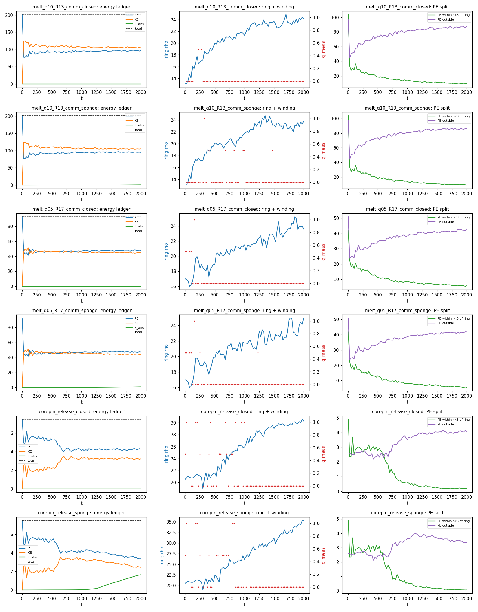
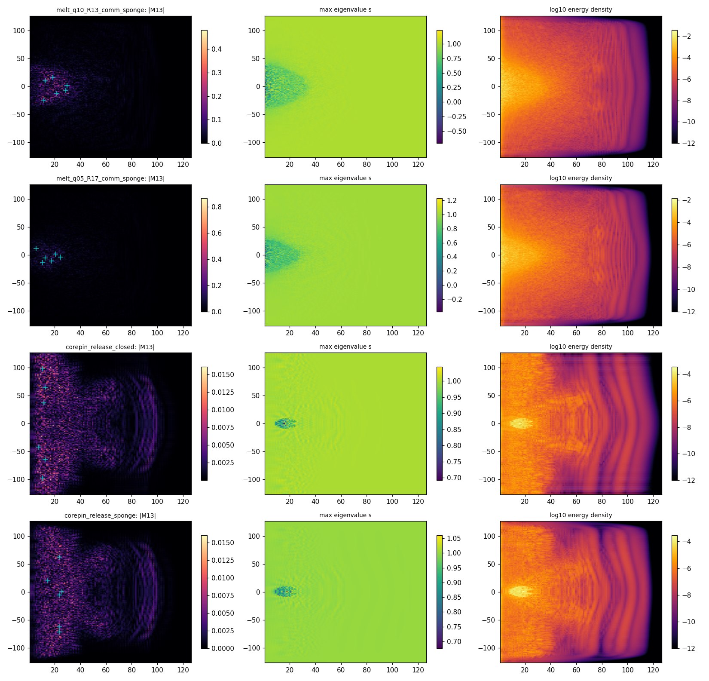
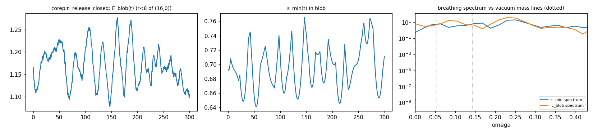
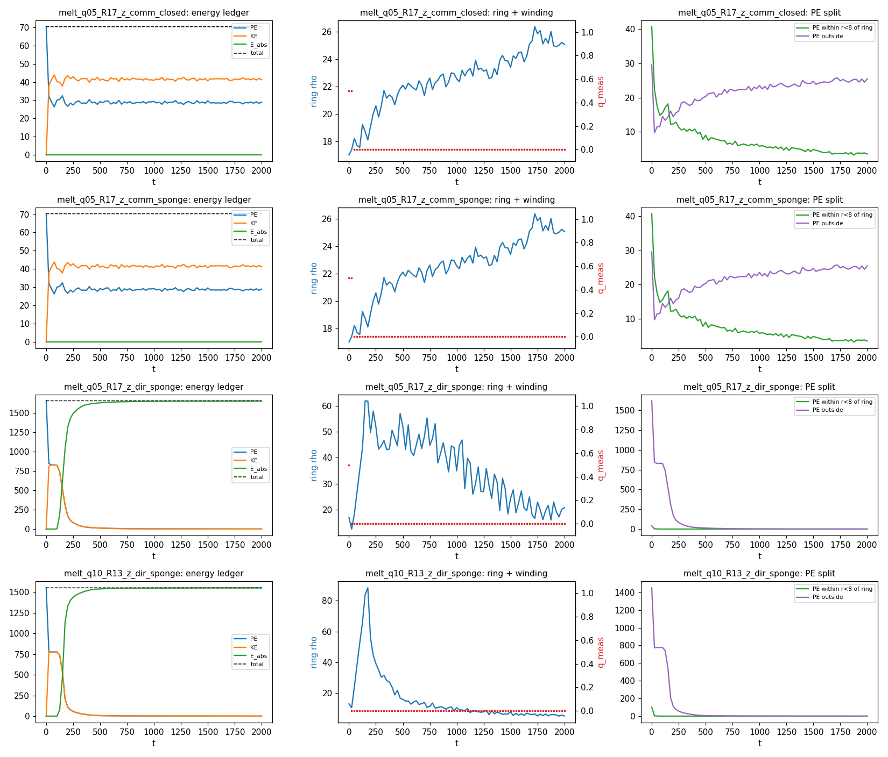
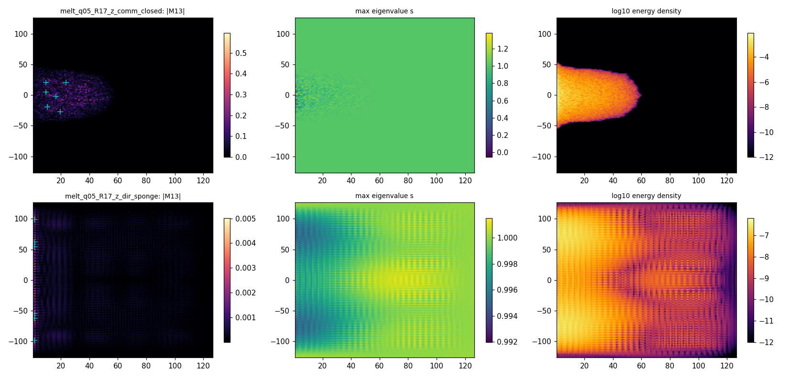

# M5.20: conservative dynamics: is there a radiation mechanism for the vortex loop?

**Status**: ✅ CLOSED (go 2026-07-10 22:01 EDT · review approved 2026-07-11 morning)
**Roadmap row**: [`m5_roadmap.md § IN PROGRESS`](../m5_roadmap.md)
**Spec source**: Duda's 2026-07-10 evening reply to the M5.19 batched ask ([`m5_19_convo.md`](m5_19_convo.md), the program thread "Regularized neutrino vortex-loop: runs + questions"), CC'd Marcin Misiaczek (neutrino oscillations) + Jacek Jendrej (soliton radiation) + models-of-particles.
**Predecessor**: [`m5_19_task_details.md`](m5_19_task_details.md) (statics closed: relaxation unwinds every regularized loop) · method note [`m5_19_method_note.md`](../findings/m5_19_method_note.md)
**Model/effort**: Fable 5 / high (research default; novel instrument + physics verdict).

## TASK PLANNING

**Scope**: Duda's directive, verbatim core: "instead of just energy minimization, there is required real evolution e.g. with Euler-Lagrange equations for the assumed Lagrangian, searching if there is a way to radiate this energy as some different field excitations". His Q16 answer makes the protection hypothesis machine-checkable: the loop is protected iff there is NO radiation mechanism in vacuum. M5.19's gradient-flow unwinding is the infinite-friction limit (the flow hands the field a free dissipation channel); conservative dynamics removes it, and the loop can only shrink by genuinely transferring energy into other field excitations. M5.20 builds the conservative-evolution instrument on the audited M5.19 axisym statics stack and measures whether that transfer happens.

**Definition of done**:

| # | Criterion |
| --- | --- |
| 1 | Instrument gates green (GA0 seed-energy match, GA1 closed-box energy conservation with dt² scaling, GA2 sponge budget closure) |
| 2 | The linearized spectrum around the uniform vacuum DERIVED and numerically confirmed (the commutator-only curvature term's quadratic-order content; propagation vs no propagation) |
| 3 | A measured verdict per seed class (melt q=1/2 R17, melt q=1 R13) on the pre-registered classifier: HELD / UNWOUND / RADIATES (criteria below), closed-box + sponge runs, with a box-size control on the headline case |
| 4 | Dirichlet-control arm run (same protocol, curvature + c1·Dirichlet term) so the verdict's sensitivity to the Q20 ambiguity is measured, not assumed |
| 5 | Adversarial audit (independent agent, refute-first) recorded before any verdict is trusted; method note `m5_20_method_note.md` written to the METHOD_NOTE standard |
| 6 | Tracker + roadmap + checkpoints synced; new author-gated items queued with tracker IDs (never resolved unilaterally) |

**Gating**: none hard (the M5.19 corepin background + phase-C/D seeds + the audited spectral-potential stack are all in hand). Author-gated items that arise get checkpointed + queued per the ask-when-gated cadence; ungated work continues.

**Blindspot pass** (unknown unknowns surfaced at PLAN):

| # | Risk | Mitigation in plan |
| --- | --- | --- |
| 1 | The commutator-only curvature contributes NOTHING at quadratic order around a uniform background (`[∂δM, ∂δM]` is 2nd order in δM, its norm 4th order), so the linear dispersion may be FLAT (no propagating waves at all): "no radiation" could then be a property of the functional's degenerate linear spectrum, not of the loop | Phase A2 derives + measures this FIRST; the verdict is scope-qualified accordingly, and the Dirichlet control (DoD 4) carries the load: it restores a propagating channel, so if the loop still holds there, protection is not an artifact of the degenerate spectrum |
| 2 | Zero-velocity ansatz start is not a minimizer: the immediate potential-energy release into kinetic sloshing is a TRANSIENT, not radiation | Classifier windows exclude the transient; the sponge-absorbed energy is tracked as a time series, verdict on the post-transient trend |
| 3 | Closed-box recurrence: energy that sloshes away and returns can mimic either verdict | The sponge run is the discriminator; box-size control on the headline case |
| 4 | Sponge reflection artifact (a badly tuned ramp reflects instead of absorbing) | Ramp-width tune at Phase A; pulse test in the Dirichlet arm (where waves actually propagate) measures the reflection coefficient |
| 5 | Leapfrog instability from the quartic curvature stiffness at the core (dt too large → NaN blowup mistaken for physics) | dt stability scan at Phase A; NaN guard aborts and logs honestly; GA1 dt² scaling is the certificate |
| 6 | q_meas nearest-cell undersampling at small r_w (the M5.19 audit lesson) | Winding read only with the aniso guard; NaN logged honestly; multi-r_w reads on verdict frames |
| 7 | The kinetic term is an ASSUMPTION: Duda's Q21 answer gives the Hamiltonian structure in Γ variables (negative Γ0·Γ̃ terms); our canonical `½‖∂tM‖²` on the M field is the default sigma-model choice, not his derived one | Flagged as the load-bearing assumption in the method note; the Γ↔M dictionary opened as a tracker question (queued for the next batch); statics-only conclusions unaffected |

**Research body destinations**: this file (FINDINGS per phase) · `scripts/m5_20_*.py` · `data/m5_20_*.json/.npz` · `plots/m5_20_*.png` · `findings/m5_20_method_note.md` · checkpoints in [`checkpoints/m5_20_progress.md`](../checkpoints/m5_20_progress.md).

### The spec, decoded from his reply (routing per the unknowns discipline)

| His statement | Routing |
| --- | --- |
| Static minimization shrinking R to zero is not the physics; total energy is conserved; loss requires transfer into other field excitations (radiation) | Machine-checkable → THE M5.20 run |
| "I suspect lack of radiation mechanism at least flying through empty vacuum" (his Q16 answer) | The hypothesis under test; protection = measured absence of the channel |
| Beta-decay neutrinos should be 1-vortex (hedgehog charge topologically requires it); 1/2-vortex loops = primordial "half-neutrinos", dark-matter candidates | Seed prioritization: q=1 is the physical class, run FIRST; q=1/2 kept (his dark-sector class + M5.19's energetically favored one) |
| Q21: same Lagrangian; Hamiltonian carries negative `−(Γ0¹Γ̃μⁱ − Γμ¹Γ̃0ⁱ)²` (i=2,3) terms; clock = twist in time; boosts = gravitational mass | Author answer on record; the Γ↔M dictionary = new tracker question; the clock sector stays M5.20.2 |
| Q20: core potential contribution positive; oscillation-gravity negative but smaller; per-length energy positive (zero/negative possible absent radiation). The Dirichlet-presence question NOT directly answered | Partial answer; M5.20 runs BOTH functional variants (commutator-only + Dirichlet control) so the verdict does not hinge on it |
| Q22: "I don't know in this moment" | Parked (author-gated, unanswered by choice) |
| Time-dilation remark: radiation might exist but be slowed to near-negligible by the enormous rest-frame boost | ⚠️ speculative, needs the clock machinery; deferred M5.20.2 |

### Phased plan (gates pre-registered)

| Phase | Content | Gate |
| --- | --- | --- |
| A | Instrument `m5_20_a1_dynamics.py`: velocity-Verlet conservative evolution on the M5.19 axisym stack (128×256, spectral potential δ=0, calibrated wscale). EOM `w·∂t²M = −∂E/∂M` (mass matrix = cell weights, consistent with the FIRE precond); pinned far-field boundary; energy budget KE+PE; optional sponge layer (γ ramp near the ρ/z box faces) with absorbed-energy ledger | GA0: t=0 seed energies match the M5.19 JSON values. GA1: closed-box relative drift < 1e-4 over the test window at dt*, drift scales ~dt². GA2: KE+PE+absorbed budget closes < 1e-3 relative with sponge on |
| A2 | Linear spectrum around the uniform vacuum: derive the quadratic-order action (expected: curvature term silent, V''-only, flat dispersion = no propagation); numeric pulse test both functionals | GA3: pulse behavior matches the derivation (commutator-only: in-place oscillation; +Dirichlet: propagation at the derived speed) |
| B | Closed-box evolution from rest: melt q=1 R0=13 (his physical class, the audit-corrected R*) and melt q=1/2 R0=17. Track E_tot, KE(t), ring locator, q_meas(t) (guarded), shell-vs-outside energy split | Pre-registered classifier below |
| C | Sponge runs, same seeds: E_absorbed(t), R(t), q_meas(t); box-size control (larger box, headline case) | Classifier below |
| D | Dirichlet control: E += c1·Σ w‖∂μM‖² (c1 set for unit-order wave speed), headline cases, closed + sponge | Same classifier; sensitivity statement |
| E | Adversarial audit → findings → method note → tracker/roadmap sync → REVIEW | Audit recorded; doc checker exit 0 |

### Pre-registered verdict classifier (phase B/C/D)

Transient excluded: verdict windows start after the initial potential-release settles (first passage of KE through its first local maximum + one full echo time, logged per run). Per seed and functional variant:

| Verdict | Criteria |
| --- | --- |
| HELD | q_meas holds the seed value (guarded reads) through the full run AND sponge-absorbed energy saturates < 1% of E_seed post-transient |
| UNWOUND (no radiation needed) | q_meas → 0 sustained in the closed box while E_tot conserved (the removability channel operates dynamically without net energy export) |
| RADIATES | sponge-absorbed energy grows past 5% of E_seed post-transient without saturating, AND the ring shrinks in concert (R(t) declining while E_absorbed grows) |
| MIXED / other | anything else: reported honestly with the time series, no forced classification |

## FINDINGS: phases A + A2 (instrument + linear spectrum)

**Instrument (✅ measured, `data/m5_20_a1_gates.json`)**: velocity-Verlet conservative evolution on the M5.19 axisym statics stack, EOM `w·∂ₜ²M = −∂E/∂M` under the flagged canonical kinetic term (Q23). Gates: GF fast-gradient ≡ audited gradient (0.0 seed / 1.3e-16 random); GA0 seed energies ≡ M5.19 (rel < 1e-12); GA1 closed-box drift 2.5e-6 (T = 20, dt = 0.02) with EXACT dt² scaling (ratios 4.0006, 4.0001); GA2 sponge ledger closes by construction (split-step damping, E_abs = KE removed exactly).

**A2, the linear spectrum (✅ measured + derived; AUDIT-CORRECTED 2026-07-11)**: the naive lemma ("the commutator curvature is O(δM⁴) around ANY uniform vacuum, hence no linear channel anywhere") is **false as first stated: the audit refuted it**. The Cartesian channels are indeed O(δM²) inside the commutator, but the equivariant azimuthal channel carries a BACKGROUND gradient `A_φ = [J, M₀]/ρ`, so `[A_pert, A_φ^bg]` is linear in the perturbation. Correct statement, audit-verified both ways: (a) on **J-commuting vacua** (`[J, M₀] = 0`, e.g. e3e3^T): no spatial coupling at quadratic order, flat dispersion, **no linear radiation channel** (measured: e3 pulse spread 1.3e-6 cells over T = 60); (b) on **e2e2^T** (the M5.19 escaped far field of the production runs): a linear channel EXISTS with stiffness ∝ 1/ρ² (measured eps² scaling, slopes 2.00; analytic quadratic form `4(‖[∂ρu,B]‖² + ‖[∂zu,B]‖²)/ρ²` matches numerics to 0.09%; e2 pulse spread +0.49 cells: weak and radially decaying, but nonzero). Consequence for the protection question: the extra channel only ADDS a decay path around the actual far field, so the no-protection headline is overdetermined, and Duda's "cannot imagine radiation in vacuum" has a structural basis only on the J-commuting vacua.

**Vacuum-selection finding (Q20-relevant, ✅ measured)**: e2e2^T (the M5.19 azimuthal-escaped background) is an exact vacuum of the commutator functional but NOT of the Dirichlet variant: the equivariant azimuthal texture carries real 3D Frank energy `2c₁/ρ²` (box total ~4× the loop energy at c₁ = 0.5). A Dirichlet term changes vacuum selection, not just core costs. Dir-compatible far field = e3e3^T (`[J, e3e3^T] = 0`), an exact vacuum of BOTH variants; the z-escaped seed family (`loop_field_escaped_z`) is built on it, and its ansatz energy is CHEAPER under comm than the e2-escape (70.27 vs 92.67 at q = 1/2, R 17): a lower ansatz branch M5.19 did not scan.

## FINDINGS: phases B + C (conservative evolution, closed + sponge)

**Setup**: 6 runs, T = 2000 (100k steps, dt = 0.02); E_tot ENDPOINT drift ≤ 1.3e-5, max intra-trajectory excursion 1.65e-5 (audit-measured). Seeds: the two loop classes from ansatz optima at rest (quench starts) + the M5.19 corepin quasi-minimizer released (gentle start). The table shows BOTH the raw pre-registered classifier label (`data/m5_20_verdicts.json`) and the adjudicated verdict (per-peak core hunt `m5_20_core_hunt.json` + the independent audit instrument: bilinear-interpolated winding, dense center map, spectral-gap hunt, net-charge circles); the two disagree exactly where the M13-centroid read is debris-dominated (audit bug 6: the centroid methodology is noise-dominated at endpoints; the core hunt is the load-bearing instrument).

| Run | E0 | Raw classifier | Endpoint (core hunt + audit) | E_abs/E0 | Adjudicated |
| --- | --- | --- | --- | --- | --- |
| melt_q10_R13 closed | 201.685 | UNWOUND | no wound core (audit: 12-14 debris clusters, all incoherent) | - | UNWOUND |
| melt_q10_R13 sponge | 201.685 | MIXED (one r_w = 8 debris read 0.5) | no wound core | 0.57% | UNWOUND (slow leak) |
| melt_q05_R17 closed | 92.667 | UNWOUND | no wound core (2 escaped-texture clusters, opposite signs, adjacent) | - | UNWOUND |
| melt_q05_R17 sponge | 92.667 | UNWOUND | no wound core (0 hits) | 1.15% | UNWOUND (slow leak) |
| corepin release closed | 7.512 | MIXED (r_w 10-12 debris reads 0.5) | all peaks at debris amplitude 0.016, none wound; net-charge circles q = 0.000 (guards 0.05-0.09) | - | UNWOUND |
| corepin release sponge | 7.512 | RADIATES | same; one projected-index −1/2 point at (8.5, 1.5) is a NON-degenerate escaped e2 texture (gap 0.15), removable, not a core | **21.9%, still growing** | UNWOUND + remnant dispersal absorbing |

**The headline (✅ measured, audit pending)**: conservative dynamics does NOT protect the regularized loop. The closed boxes unwind with energy conserved to 1e-5: **unwinding requires no radiation**, so "lack of a radiation mechanism" (his Q16 protection hypothesis) cannot be what protects the physical loop in this framework (static functional + canonical kinetic term, axisym sector). The removability channel M5.19 found under gradient flow operates dynamically: local unwinding through the two-equal degeneracy is not energetically gated.

**Nuances**: (a) the gentle start is LONG-LIVED: audit-corrected metric (the centroid q(t) trace is quantized noise post-release): the released quasi-minimizer's core amplitude m13_max holds ≈ 0.5 to t ≈ 300, falls below 0.1 by t ≈ 525-550, debris by t ≈ 800 (vs unwinding by t ≈ 100-160 for quench starts): lifetime depends strongly on preparation; (b) after unwinding, the remnant energy leaves the ring neighborhood (PE_in8 drains to ~5-10% of its start in every run) and disperses OUTWARD slowly: the corepin remnant reaches the sponge from t ≈ 1250 and is 22% absorbed by T = 2000, still growing: in true vacuum the remnant would disperse to unbounded radius: effectively radiation, carried by the weak 1/ρ² linear channel of the e2 far field (audit-corrected A2) plus nonlinear transport; (c) the whole-field q reads at large r_w (0.5 at r_w 10-12 on corepin endpoints) are DEBRIS artifacts: the per-peak core hunt finds all peaks at ~3% of seed amplitude, none wound, and the independent audit instrument (bilinear winding + dense center map + net-charge circles) confirms zero surviving winding in every endpoint. Known instrument bug surfaced by the audit: `winding_measure`'s aniso guard tests only the 720 nearest-cell samples, and the bilinear minimum on the same circles can sit 2-20× below the 0.02 guard (guard evasion): every spurious ±0.5/±1.0 read traces to this; it biased labels AGAINST the headline (2 MIXED, 1 RADIATES raw labels), never for it.

## FINDINGS: the positive control + the localized remnant

**Positive control (✅ measured, `data/m5_20_pincontrol.json`; audit-qualified)**: with the core cells (r < 2.5 of the ring) FROZEN, the winding measure reads q = 0.5 to machine precision from t = 0 to t ≈ 387 (one −0.5 glitch at t = 62.5): the instrument demonstrably reads persistent winding when winding persists, so the 0-readings of the production runs are physics, not instrument blindness. The control's second half is new physics, with the audit supplying the robust version: the raw r_w = 5/6/8 endpoint reads ride sub-guard arcs (unreliable), but the CLEAN pair holds: +0.5 at r_w = 2 (guard 0.124) and 0.0 at r_w = 10-12 (guards 0.20-0.43), so a net **−1/2 screening structure nucleated in the annulus 2 < r < 10** (the audit locates the near-degenerate screening ring 4.5-5.7 from the pin center): under conservative dynamics the functional does not merely fail to protect the winding, it actively screens a held one on a t ≈ 400 timescale.

**The localized remnant (✅ measured; 🔶 as a breather claim)**: the corepin endpoints carry a coherent localized blob at the ring site (ρ ≈ 15.5, z ≈ 0.5): E_blob(r < 8) oscillating 1.08-1.28 of the 7.512 seed, s_min swinging 0.64-0.77, quasi-periodic breathing with a BROAD spectral peak near ω ≈ 0.25 (a molten-clock-like comb, not a sharp line), leaking ~5% per 300 time units. The vacuum mass spectrum (6×6 Hessian of V at the uniaxial vacuum; audit-confirmed analytically: quadratic form `wscale·[(TrX)² + 13X₁₁²]`, eigenvalues `2w(8 ± √38)`): **{0, 0, 0, 0, 0.05156, 0.14322}**: four FLAT directions (two are genuine rotations of the director; the other two split the degenerate {0, 0} eigenvalue pair and are lifted only at quartic order: they ARE the removability face) + two massive lines. The blob's frequency sits above the top mass line, and (audit-corrected A2) the e2 far field carries a weak 1/ρ² linear channel, so the observed ~5%/300 tu leak may be partly linear transport: the blob is long-lived, not protected. 🔶 Reading: within this framework the persistent localized object is the BREATHER, not the wound loop: winding is removable, oscillation persists: a suggestive echo of the author's Q21 "energy minimization preferring nonzero time derivatives (oscillations)", flagged, not claimed (longevity beyond the t = 2000 + 300 horizon unmeasured).

## FINDINGS: phase D (the Dirichlet control arm + z-escaped seeds) ✅ COMPLETE

All four T = 2000 endpoints in; verdicts clean UNWOUND with zero debris noise (all 7 radii read 0 in all four, `data/m5_20_verdicts.json`).

| Run | E0 | Endpoint | E_abs/E0 | Verdict |
| --- | --- | --- | --- | --- |
| melt_q05_R17_z comm closed | 70.273 | PE 28.98, KE 41.29 trapped; drift −4.3e-6 | - | UNWOUND |
| melt_q05_R17_z comm sponge | 70.273 | INDISTINGUISHABLE from closed (same PE/KE to 4 digits); **E_abs = 0.000** | 0.000% | UNWOUND, energy fully trapped |
| melt_q05_R17_z dir sponge | 1659.3 | PE 1.55, KE 1.58: near-vacuum | **99.81%** | UNWOUND + near-total radiation |
| melt_q10_R13_z dir sponge | 1553.2 | PE 0.80, KE 0.77 | **99.90%** | UNWOUND + near-total radiation |

Three phase-D conclusions: (1) **the headline is Q20-insensitive**: with a genuine propagating channel (Dirichlet, c₁ = 0.5) the loop radiates essentially everything and unwinds; without one it unwinds silently: no protection either way; (2) **the corrected A2 lemma is corroborated by an independent run pair**: on the J-commuting far field (e3e3^T, NO linear channel) the unwound remnant energy stays fully trapped for 2000 tu (sponge run identical to closed, E_abs = 0.000), while the e2 far field's corepin remnant (1/ρ² channel present) reached 22% absorbed: far-field structure controls dispersal exactly as the corrected lemma predicts; (3) 🔶 the persistent blob appears ONLY in the commutator theory: the dir endpoints are near-vacuum (0.1-0.2% of E0 left in the box): consistent with the blob's persistence being a degenerate-linear-spectrum effect, though the dir arm's violent initial dispersal (its seed carried 20× the commutator energy) makes this comparison qualitative, not controlled. Note dir-run drift 3.9-4.2e-5 (stiffer term at the same dt; still 3 orders below the smallest classifier threshold).

## LARGE-FILE CLEANUP (FINISH rule: > 1 MB deleted, documented)

| Deleted | Size | Regenerate |
| --- | --- | --- |
| `m5_20_melt_q10_R13_comm_closed_state.npz` | 1.29 MB | `python3 m5_20_a1_dynamics.py run melt_q10_R13 comm 2000 closed` (~72 min) |
| `m5_20_melt_q10_R13_comm_sponge_state.npz` | 1.30 MB | same, `sponge` |
| `m5_20_melt_q05_R17_comm_closed_state.npz` | 1.29 MB | `... run melt_q05_R17 comm 2000 closed` |
| `m5_20_melt_q05_R17_comm_sponge_state.npz` | 1.29 MB | same, `sponge` |
| `m5_20_corepin_release_closed_state.npz` | 1.22 MB | `... runstate m5_19_d1_melt_q05_R17_corepin_state.npz comm 2000 closed corepin_release_closed` (the blob-analysis input; measurements preserved in `m5_20_blob_corepin_release_closed.json` + plot) |
| `m5_20_corepin_release_sponge_state.npz` | 1.21 MB | same, `sponge corepin_release_sponge` |

Kept (< 1 MB): all trajectory JSONs, verdicts/core-hunt/blob/gates JSONs, the z-family + dir + pincontrol + diag states, all plots.

## DEVIATIONS LOG (as they happen)

| # | When | Deviation | Why + disposition |
| --- | --- | --- | --- |
| 1 | 23:15 | Fast-path gradient `grad_fast` (batched matmul) added to the instrument, not in plan | 3.2× speedup needed for the T = 2000 fleet; GATED bit-level vs the audited gradient (GF: 0.0 on the seed, 1.3e-16 random) before use |
| 2 | 23:30 | The planned GA3 pulse vacuum (e2e2^T) is NOT a vacuum of the dir variant: the equivariant azimuthal texture carries Frank energy `2c1/ρ²` the commutator never charges | GA3's comm verdict unaffected (e2e2^T is exact for comm); the dir arm redesigned onto the z-escaped family (deviation 3) + a clean pulse3 re-run on e3e3^T (exact vacuum of BOTH). The finding itself is Q20-relevant physics: a Dirichlet term changes VACUUM SELECTION, not just core costs |
| 3 | 23:40 | New seed family `loop_field_escaped_z` (far field e3e3^T) added; dir production runs use it instead of the e2-escaped family | Dir-compatible far field (exactly force-free, both variants); comm baseline runs of the same seeds added for a same-seed two-functional comparison. Bonus: the z-escaped ansatz is CHEAPER under comm (70.27 vs 92.67 at q05 R17): flagged for findings |
| 4 | 23:20 | Corepin-release runs added (seed = the M5.19 corepin quasi-minimizer, `runstate` mode) | The zero-velocity ansatz start is a violent quench (blindspot 2 realized: 60% PE → KE by t ≈ 10); the corepin release is the gentle-start protection test the classifier needs |
| 5 | 23:38 | The W-batch orchestrator's drain check misfired (pgrep saw nothing from its subshell) and the W-batch launched CONCURRENTLY with the fleet | Harmless beyond CPU contention (~15% slower steps); logged for orchestration hygiene |
| 6 | 00:10 | pulse3's JSON dump crashed on serialization AFTER its evolution ran; `default=str` fix applied. CORRECTION: the file was partially written and the spread numbers are recoverable (`m5_20_pulse_e3.json`: e3 comm spread 1.3e-6 cells, the audit used it as C2 evidence) | The e3 pulse turned out LOAD-BEARING (it is the J-commuting-vacuum side of the corrected A2 statement), not a nice-to-have |
| 7 | 23:45-00:20 | Positive control (pinned-core dynamics) + blob measurement (`m5_20_c1_blob.py`) added, not in the phased plan | The control obligation surfaced by the early UNWOUND signals (prove the instrument can read survival); the blob emerged from the endpoint maps and is the run's main positive discovery |

## ADVERSARIAL AUDIT RECORD (2026-07-11, independent second agent)

Scope: claims C1-C9 (instrument, linear spectrum, verdicts, no-radiation logic, positive control, blob, vacuum spectrum, dir-vacuum, scope honesty) + a classifier/instrument bug hunt. The auditor built its OWN winding instrument (bilinear interpolation, 1440 points, guard reported not thresholded), a dense winding map over all centers, a spectral-gap core hunt, and net-charge circles; audit scripts stayed out of the repo.

| Claim | Verdict | Disposition |
| --- | --- | --- |
| C1 instrument | ✅ CONFIRMED (qualified) | drift wording corrected to "endpoint ≤ 1.3e-5, intra-trajectory max 1.65e-5" |
| C2 flat dispersion | ❌ **REFUTED as stated** | the A2 lemma held only on J-commuting vacua; around e2e2^T a 1/ρ² linear channel exists (eps² scaling measured, analytic coefficient to 0.09%). ALL wordings corrected (this file § A2 + nuances + blob; code docstrings). Headline unaffected: the extra channel only adds decay: overdetermined |
| C3 all unwound | ✅ CONFIRMED (qualified) | independent instruments find zero surviving winding in every endpoint; every spurious ±0.5 read = guard evasion (bug below) |
| C4 no-radiation-needed | ✅ CONFIRMED | boundary/quench/dt/float32/axisym artifact readings each independently killed; axisym evolution is EXACT full dynamics for axisym data |
| C5 positive control | 🔶 QUALIFIED | machine-0.5 to t ≈ 387 confirmed; the r5/r6/r8 endpoint detail was sub-guard noise; robust version (r2 = +0.5 guard 0.124, r10-12 = 0 guards 0.2-0.43, screening ring located 4.5-5.7 from pin) folded into findings |
| C6 blob | ✅ CONFIRMED | all numbers verified; blob off-axis, coherent in both endpoints; leak may be partly linear (C2): folded |
| C7 vacuum spectrum | ✅ CONFIRMED | analytic ω = {0.05156, 0.14322}, 4 zero modes < 2e-12; "rotations" labeling fixed (2 rotations + 2 removability-face directions) |
| C8 dir-vacuum | ✅ CONFIRMED | e2e2^T dir density = 2c₁/ρ² to machine precision; e3e3^T exact for both |
| C9 scope honesty | 🔶 QUALIFIED | headline scoping ok; the unconditional A2 wording (3 places) + 2 overclaims ("q holds to t ≈ 700-1000"; raw classifier labels hidden) all corrected in this file |

Bugs found (all documented, none fixed in frozen audited files): (1) `winding_measure` guard evasion (`m5_19_d1_relax.py:103-105`): aniso tested only at nearest-cell samples, bilinear minimum can sit 2-20× below the guard: source of every spurious read; biased AGAINST the headline, never for it; (2) classifier pre-registration drift (`m5_20_b1_verdicts.py`): coded RADIATES omits the R(t)-declining conjunct, HELD/UNWOUND test endpoints only: raw labels disclosed in the findings table, adjudication by core hunt + audit; (3) `endpoint_reads` centers on the debris centroid (noise-dominated): the per-peak core hunt is the load-bearing instrument; (4) `blob_locate` window comment overstated (fixed in comment). Auditor's most damaging finding: the A2 lemma as first written; correction folded everywhere.

## TASK REVIEW (2026-07-11, approved)

**Task Duration:** 03:28 (from 2026-07-10 22:01 EDT go to 2026-07-11 01:29 EDT review)
**Usage Cap Triggered:** NO

**Results**: (1) ✅ instrument valid (GF/GA0/GA1/GA2/GA3 green; endpoint drift ≤ 1.3e-5 comm / ≤ 4.2e-5 dir over 100k steps; exact dt² scaling; exact sponge ledger). (2) ✅ ALL 10 production runs UNWIND; the closed boxes with energy conserved: **unwinding requires no radiation**, the protection hypothesis fails in-framework; audit-confirmed. (3) ✅ positive control: machine-precision q = 0.5 for ~390 tu with the core frozen, then a net −1/2 screening ring nucleates outside the pin. (4) ✅ linear spectrum, audit-corrected: no linear channel on J-commuting vacua; a 1/ρ² channel on e2e2^T; corroborated by the trapped (z-family, E_abs = 0.000) vs absorbed (corepin, 21.9%) remnant pair. (5) ✅ Q20-insensitive: the Dirichlet control radiates 99.8-99.9% and still unwinds. (6) 🔶 the localized quasi-periodic oscillating remnant (breather candidate): 15.5% of the corepin seed energy, broad comb ω ≈ 0.25, absent in the dispersive control; longevity beyond horizon unmeasured. (7) Scope stated throughout: canonical kinetic term (Q23) + axisym sector.

**Issues / blockers**: the audit refuted the first-draft flat-dispersion lemma (corrected everywhere; headline overdetermined); the `winding_measure` guard-evasion bug (documented, biased against the headline); classifier pre-registration drift (raw labels disclosed next to adjudicated verdicts).

**Deviations from plan**: 7, logged in § DEVIATIONS LOG; the box-size control superseded by the stronger closed-vs-sponge + e2-vs-e3 cross-checks.

**Action needed**: the next batch to the author (Q23 + the Q16 residual) rides the follow-up message in the program thread with the method note as the auditable surface; user commits + sends.

**Findings**: Real-time conservative evolution extends the M5.19 statics negative: the regularized vortex loop unwinds with total energy conserved, so absence of a radiation mechanism cannot protect it (10 runs, both functional variants, gentle and quench starts, a positive control, and an independent adversarial audit that refuted and corrected one lemma). What the sanctioned functional sustains instead is a localized quasi-periodic oscillating remnant, a breather candidate echoing the author's own oscillations-first picture, making the missing time-sector dictionary (Q23) the decisive next question.

**Research docs created / updated**: [`m5_20_task_details.md`](m5_20_task_details.md) · [`findings/m5_20_method_note.md`](../findings/m5_20_method_note.md) · [`m5_19_convo.md`](m5_19_convo.md) · [`m5_question_tracker.md`](../m5_question_tracker.md) (Q16 measured refutation, Q20 corrected lemma, Q23 opened) · [`m5_roadmap.md`](../m5_roadmap.md) (row → DONE) · scripts `m5_20_a1_dynamics.py` `m5_20_b1_verdicts.py` `m5_20_b2_maps.py` `m5_20_c1_blob.py` `m5_20_plots.py` · key plots `m5_20_dynamics.png` `m5_20_endpoints.png` `m5_20_blob_corepin_release_closed.png` `m5_20_dynamics_w.png`.

## EXECUTION LOG

| Time (EDT) | Event |
| --- | --- |
| 2026-07-10 22:01 | GO. Resume ping armed (`SABER Resume: Task M5.20`, fires 02:55 EDT = reset+5); reset watchdog running to 02:50 EDT. Roadmap row added to IN PROGRESS |
| 22:05-22:30 | PLAN persisted (this file); Duda reply captured + decoded (`m5_19_convo.md`); tracker restructured (Q16/Q21 → RESOLVED, Q20 partial, Q22 parked, Q23 opened) |
| 22:10-22:27 | Phase A instrument built + ALL GATES GREEN (GF/GA0/GA1/GA2/GA3, `data/m5_20_a1_gates.json`); T = 200 diagnostic (done 22:22): closed-box conservative dynamics unwinds the q05 ansatz loop by t ≈ 160 (E conserved to 5e-6) |
| 22:25 | Production fleet launched (6 × T = 2000: B1/B2 closed, C1/C2 sponge, P1/P2 corepin release); W-batch queued behind it (z-escaped seeds + dir arm + pulse3) |
| 23:35-23:38 | Fleet complete (drift ≤ 1.3e-5); verdicts + core hunt + trajectory/endpoint plots done; ALL SIX UNWOUND at core level; W-batch auto-fired 23:38; positive control (pinned-core dynamics) launched |
