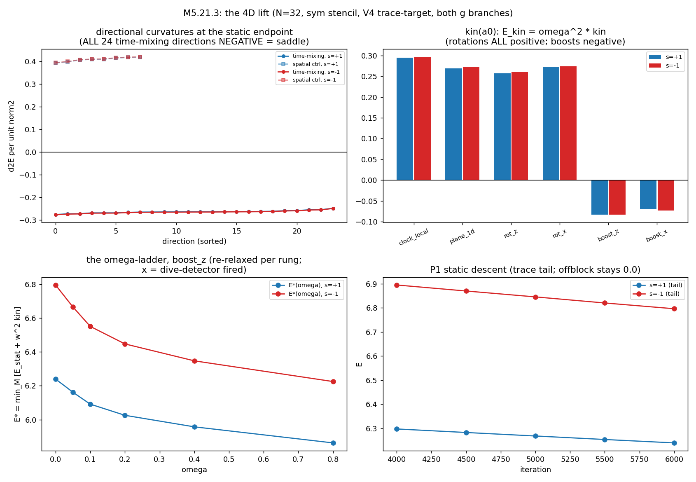
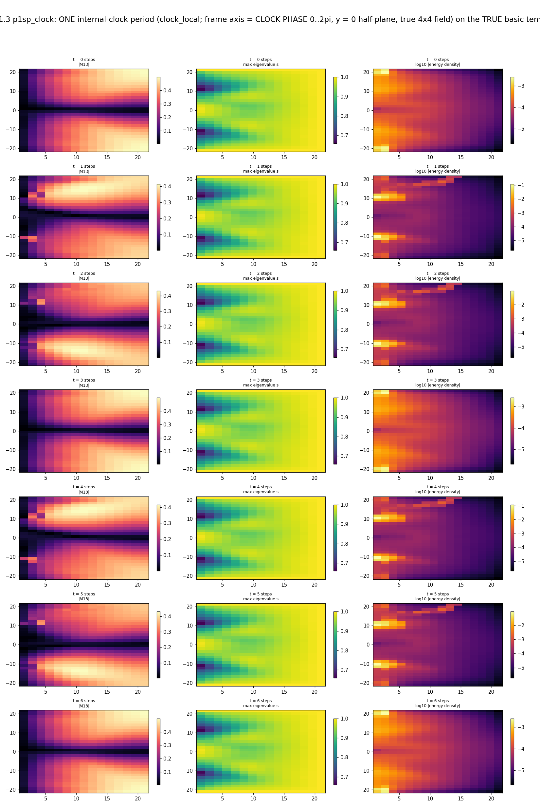

# M5.21.3: the 4D sequel: the stable dynamical electron from the 3D minima (J + tiny boosts)

**Status**: 🚧 PLANNED STUB, **SELECTED by the author 2026-07-18 03:22** ([`m5_21_convo.md § 2026-07-18 03:22`](m5_21_convo.md)); un-gated (the [M5.21.2b](m5_21_2b_task_details.md) converged minima, the T2 term set, and the sym instrument are delivered). His 2026-07-18 prescription verbatim: "So please use 3x3 field electron as starting point of 4x4 energy minimization, including field time derivatives (should be nonzero from minimization), to try to get its stable dynamical configuration." (Supersedes-in-detail his 2026-07-17 phrasing: "preferably using such 3 local energy minima as starting points of gradient descent - hopefully getting field rotation for angular momentum, and tiny boosts.") Full PLAN at go.

## Scope (stub level)

| Piece | Content | Notes |
| --- | --- | --- |
| The stack | Re-add the time row: 4×4, η = diag(−1,1,1,1), vacuum diag(−sg, 1, δ, 0), BOTH sign branches (Q27 answered-as-open: theory does not select) | The audited M5.21.1 machinery is the base, but the STATICS instrument must be the M5.21.2b one (stencil-symmetrized functional, T2 eigenvalue-penalty term set): the 3D → 4D lift of that stack is the new piece |
| Seeds | The 3 CONVERGED local minima from the [M5.21.2b](m5_21_2b_task_details.md) census (A first = the electron; the T2 endpoints), lifted to 4D | His 2026-07-18 directive: "use 3x3 field electron as starting point of 4x4 energy minimization" |
| The read | Does FIELD rotation emerge from 4D minimization, with time derivatives NONZERO out of the minimization itself, carrying angular momentum + tiny boosts, as a STABLE dynamical configuration? | Rigid rotation is already killed both hunts (M5.20.5 loop + [M5.21.1 P2](m5_21_1_task_details.md) hedgehog); field rotation is the surviving route; his forecast: twist mainly along the long axis = Zitterbewegung / de Broglie clock (~1e21 Hz at physical parameters: toy rates will differ, the scaling is the bridge, [Q33](../m5_question_tracker.md#q33-detail)), magnetic dipole moment, possible core-scale shift vs the 3D statics |
| The contingency (pre-approved 2026-07-18) | If the 4D electron proves unstable: extend the potential parameters ("introduce more parameters (to delta, g) especially in potential ... with the goal to derive ~30 parameters of Standard Model"); he recognizes the W1 trace-target and the shifted-det penalty wdet·(det M − D0)², D0 = (1+s)(δ+s)s, as exactly that machinery | T1/T3 from the [M5.21.2b](m5_21_2b_task_details.md) discrimination stay in the toolkit as the extension arms; T2 is the base |
| The known hazard | The 4D signature: the M5.18/M5.21.1 indefiniteness (time-mixing saddle directions at second order) | HIS open item ("Difficulties come in 4D with signature - I will think about it"); fold his elaboration when it lands, the task is NOT gated on it |
| THE ACCEPTANCE OBSERVABLE | Larmor precession (his 2026-07-17 11:05 suggestion, ADOPTED in the checkpoint outbound): the rotating 4D electron in an external bias should precess at the Larmor rate | Fold the concrete read design at PLAN |
| 4D-stage observables-of-interest (his 14:16 reply) | The decay picture: μ/τ → e as "quick field rotation, transferring energy to topological vortices - should create 2 fast vortex loops as neutrinos" (consistent with the ½-line neutrino implication); mass anchoring on 1 : 206 : 3477 with a possible Koide-formula connection, HIS gating: "requires details of potential, tiny delta, and 4D case with dynamics, huge g" | Recorded ambitions, NOT near-term arms ([`m5_21_convo.md § 2026-07-17 14:16`](m5_21_convo.md)) |

Series rules: both film templates on any film output; independent adversarial audit before the review; method-note-grade record if the result goes back to the author.

## TASK PLANNING (2026-07-18, at go 13:54 EDT)

**Scope**: lift the M5.21.2b well-posed 3D instrument (sym stencil + T2 eigenvalue penalty) to the 4×4 field per his 2026-07-18 prescription and measure whether energy minimization selects NONZERO field time derivatives, landing a stable dynamical electron configuration or the honest characterization of why not.

**The central three-way question** (all outcomes are first-class results): descending from the static 4D lift, does the functional reach (a) a genuine finite-frequency rotating minimum (his stable dynamical electron), (b) an unbounded signature dive (the M5.20.3 pathology surviving the well-posedness fix), or (c) a static endpoint with zero time derivatives (his forecast failing at toy parameters)?

**Phases**:

| Phase | Content | Verdict artifact |
| --- | --- | --- |
| P0 gates | 4D functional (η = diag(−1,1,1,1) in commutator + norm per his Eq 40-42, the audited M5.21.1 convention) on the sym stencil: complex-step gradient check, SO(1,3) invariance, vacuum zero, and the 3D REGRESSION (time row frozen at vacuum must reproduce the 2b A-state energy to float tolerance) | gates JSON |
| P1 static 4D lift | Embed the 2b converged A minimum with time row at vacuum (−sg), BOTH g branches; relax statically; measure the time-sector second-order spectrum at the endpoint (is static a saddle, the M5.18/M5.21.1 −0.4 directions, now on the well-posed instrument?) | per-branch rows |
| P2 the clock-rotation ansatz | Internal (field) rotation in the clock eigenplane: M(x,t) = R(ωt) M(x) R(ωt)^T (+ optional axial twist kz), the period-averaged functional E(ω) under BOTH readings of "energy" (the η-signed Lagrangian-descent functional AND the fixed-J Routhian; the reading ambiguity is author-gated, so both are run and labeled, never silently picked); scan ω, then re-relax the profile self-consistently at the best ω | E(ω) curves + the three-way verdict |
| P3 the converged dynamical state | If a finite-ω minimum exists: converge it (profile + ω), consistency read (xstencil), virial, J, and the ω vs δ/g scaling hooks (Q33); if the dive: quarantine, cap, characterize the rate; if static: the negative with mechanism | the state npz + row |
| P4 Larmor (contingent) | On a rotating state: small external bias, precession rate vs bias slope = THE acceptance observable; if no rotating state, document as contingent-not-reached | Larmor read or its absence |
| Films + close | Both TRUE templates over one period (rotating state) or the descent (7-shot standard); panel; independent adversarial audit; method-note-grade findings | findings doc |

**DoD**: (1) P0 gates green; (2) per-branch static-lift verdict with the time-sector spectrum measured; (3) E(ω) measured with the three-way verdict stated under both functional readings; (4) the dynamical state converged + characterized, or the negative mechanism documented; (5) Larmor read or contingent-documented; (6) films both templates + audit + method-note findings; (7) doc checker green, >1MB cleanup documented, checkpoints on arrival.

**Parameters**: N = 32 primary / 48 confirm (L = 48 fixed), δ = 0.3 primary (0.1 spot-check if time), g = 8 toy, s = ±1 both, T2 with the 2b w2, sym stencil, ε = 0.

**Blindspot pass**: (i) η conventions: follow the audited M5.21.1 Eq 40-42 machinery exactly, gate-checked; (ii) the energy-vs-action reading is author-gated: run both, label both; (iii) the dive channel gets a detector + iteration cap, not open-ended descent; (iv) toy ω is NOT his 1e21 Hz: report model units + the scaling bridge only; (v) time discretization: analytic in the rotation ansatz (no time lattice needed for P2), spacetime lattice only if P3 requires it; (vi) film time axis = period phase for a rotating state, descent iteration otherwise, labeled.

**Research-body destinations**: `scripts/m5_21_3_*.py`, `data/m5_21_3_*`, `plots/m5_21_3_*`, `findings/m5_21_3_note.md`, checkpoint `checkpoints/m5_21_3_progress.md`.

## FINDINGS (2026-07-18; full record: [`findings/m5_21_3_note.md`](../findings/m5_21_3_note.md))

| # | Finding | Status |
| --- | --- | --- |
| 1 | P0 gates green FIRST TRY: complex-step 1.5e-15 (static) / 1.2e-15 (kinetic), SO(1,3) invariance 3.0e-13 + negative control, vacuum exactly 0 both branches, 3D regression exactly 0 (block-diag 4D u_η ≡ the 2b spatial u) | ✅ |
| 2 | **THE SADDLE, clean**: the static 4D electron has ALL 24 time-mixing directional curvatures NEGATIVE in BOTH g branches (min −0.276/−0.277; 8 spatial controls all positive; block-diagonality preserved exactly). The M5.18-era read reproduced on the well-posed instrument: the time sector is genuinely downhill from the static state | ✅ |
| 3 | **THE KIN SIGN TABLE**: every ROTATION velocity, including his ZBW clock direction, has kin > 0; the negative channel is the BOOST sector. Branch-robust, stencil-robust (sym/fwd/bwd to 5 digits, 2h keeps signs), h-robust (fresh n = 24 lift reproduces the pattern), and CONVENTION-robust (both the probe variant and the physical conjugation-orbit tangent: rotations +0.10 to +0.13, boosts −0.070 to −0.084 under the latter) | ✅ |
| 4 | **THE DECOUPLING**: the boost ω-ladder's whole advantage over the matched-depth static control is exactly the quadratic margin (E*(0.8) − E_ctrl = −0.0564 vs ω²·kin = −0.0559, ratio 1.008); static parts match to 4 decimals; kin creeps ~1%/rung; the dive detector never fires | ✅ |
| 5 | **THE VERDICT**: free 4×4 minimization lands NO stable dynamical electron at toy parameters: no FINITE stationary ω on either functional reading (η-signed: descent moves time-ward through the boost slope but never lands, no minimum, no dive; Hamiltonian: statics wins outright) | ✅ |
| 6 | Constructive residue: fixed-J isorotation states are well-defined with the MEASURED collective clock inertia (conjugation-tangent kin_clock ≈ 0.119; ω\* = J/2·kin, E* = E_stat + J²/4·kin); the Larmor acceptance observable attaches there if the constrained reading is adopted (author's call) | ✅ |
| 7 | Twist null: no spontaneous axial twist at the static point (the linear E(k) coefficient sits at numerical zero) | ✅ |
| 8 | Caveats: the P1 endpoints are contained-not-converged (trace-target grind, fmax ~6e-3 at 6000 it); the potential is the audited trace-target (the Eq-12 T2η Lorentz-invariant lift is designed, not run); the N = 48 full ladder is not run (the confirm block carries discretization robustness at this stage) | 🔶 |

**Artifacts**: `scripts/m5_21_3_a_4d.py` (instrument + phases) · `m5_21_3_c_films.py` · `m5_21_3_d_panel.py` · `m5_21_3_e_control.py` · data `m5_21_3_gates.json`, `m5_21_3_all.json` (9 rows), `m5_21_3_row_confirm.json`, 5 endpoint npz (each < 1 MB, kept: nothing exceeded the cleanup bar) · plots `m5_21_3_panel.png`, `m5_21_3_film_{basic,thermal}_p1sp_clock.png` · findings [`m5_21_3_note.md`](../findings/m5_21_3_note.md).

## TASK REVIEW (2026-07-18)

Task Duration: 1:46 (from 13:54 to 15:40)
Usage Cap Triggered: NO

Approved by the user 2026-07-18 (terminal review). Results: gates first-try green ✅ · THE SADDLE clean (24/24 negative time-mixing curvatures, both branches) ✅ · the kin sign table (rotations positive incl. the ZBW clock, boosts negative; branch/stencil/h/convention-robust) ✅ · the decoupling (ladder minus control = ω²·kin, ratio 1.008) ✅ · THE VERDICT: no finite stationary ω on either reading, the stable dynamical electron NOT LANDED by free descent ✅ · fixed-J isorotation residue with measured clock inertia 0.119 ✅ · films + panel ✅ · audit 6/6 CONFIRMED with 4 corrections adopted (incl. the a0-convention structural catch) ✅ · caveats (P1 grind, T2η lift not run, N=48 ladder not run, Larmor contingent) 🔶.

Issues: none blocking. Deviations: 2, logged below as they happened. Cleanup: nothing exceeded 1 MB (5 endpoint npz at ~884 KB each, kept).

Findings: the static 4D electron is genuinely unstable toward the time sector, exactly as the author expects, but free energy minimization cannot convert that into a stable dynamical state: rotations cost energy under every convention and the boost channel is a shallow, profile-decoupled slope with no stationary point; the rotating electron survives only as a fixed-J state whose collective inertia this run measured for the first time (kin_clock ≈ 0.119), which is where the Larmor acceptance test attaches.

Research docs created/updated: this file · [`findings/m5_21_3_note.md`](../findings/m5_21_3_note.md) · `scripts/m5_21_3_{a_4d,c_films,d_panel,e_control,f_confirm,audit_check}.py` · `data/m5_21_3_all.json` + gates/audit/confirm JSONs + 5 npz · `plots/m5_21_3_panel.png` + 2 films · [`m5_theory_canonical.md`](../m5_theory_canonical.md) · [`__M5_model_briefing.md`](../../__M5_model_briefing.md) · [`m5_particle_hunt.md`](../m5_particle_hunt.md) · [`m5_roadmap.md`](../m5_roadmap.md).

## DEVIATIONS LOG (as they happen)

| When | Deviation | Why / handling |
| --- | --- | --- |
| 15:1x | The P1 endpoints are contained-not-converged at 6000 iterations (fmax ~7e-3, the trace-target slow grind), so the ω-ladder E readings are grind-contaminated | Added `m5_21_3_e_control.py`: a static ω = 0 continuation of matching cumulative depth (15000 it) as the subtraction control; ladder verdicts read against it |
| 16:0x | AUDIT STRUCTURAL CATCH (adopted): the instrument's a0 = GM − MG^T is the antisymmetric probe variant, not the physical conjugation-orbit tangent GM + MG^T | Full conjugation-tangent table measured (`m5_21_3_f_confirm.py`, which also makes the earlier inline confirm block reproducible): signs survive everywhere, the quotable inertia becomes 0.119; convention stated in the note § 1 |

**Gated by**: user "go" only (the M5.21.2b converged-minima gate was satisfied 2026-07-17; author-selected 2026-07-18).
