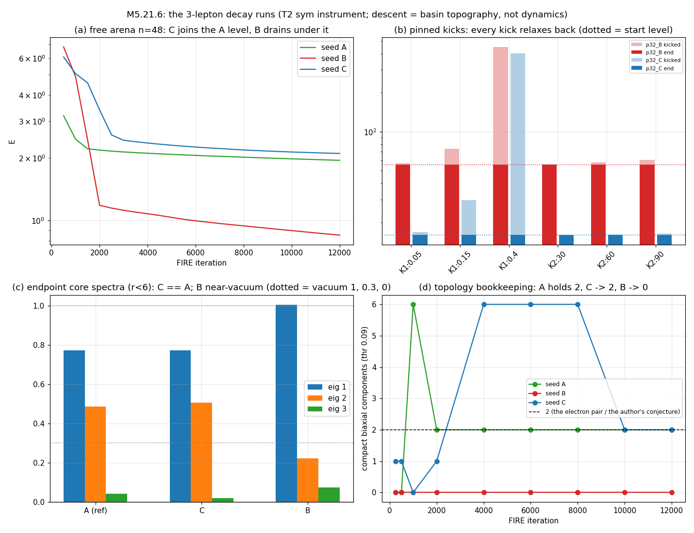

# M5.21.6: the 3D μ/τ decay film: perturbed heavy minima → rotation to the electron → vortex-loop release

**Status**: ✅ CLOSED 2026-07-18 (review approved 2026-07-19 morning; § TASK REVIEW below). From the author's autonomy goal list, goal (c) ([`m5_21_convo.md § 2026-07-18 morning`](m5_21_convo.md)). The author's picture: "maybe muon/taon decay is in reach, 3x3 might be sufficient: perturb initial minimum, what should lead to quick field rotation to global energy minimum of electron, which should give energy to attached vortices - releasing as fast vortex loops, interpreted as neutrinos." The author flags the 3 minima + such decay simulations as worth a separate LC-topology article.

## TASK PLANNING (2026-07-18)

Consumes the [M5.21.2b](m5_21_2b_task_details.md) certified 3D instrument (T2 eigenvalue-penalty term, sym stencil, gates green) via import; new code only where this task adds physics (kicks, damped wave evolution, sponge, topology bookkeeping).

**The arena fact that shapes the design**: the pinned shell holds each seed's OWN far field (A/B/C are axis permutations of the biaxial hedgehog), so a cross-sector B→A or C→A decay is BOUNDARY-FORBIDDEN in the pinned arena; the census (M5.21.2 P1) measured that free-boundary protection is intrinsic only at N ≥ 48. Hence two arenas, honest about what each can show.

| Phase | Content | Instrument grade |
| --- | --- | --- |
| P0 | New-code gates (cap 3 tries, pre-registered): (i) leapfrog at γ = 0 conserves E_tot = E + ½∫\|M_t\|² to < 1% over 200 steps; (ii) with sponge on, E_tot monotone down; (iii) kick operators keep M exactly symmetric + pinned shell untouched. Then regenerate the missing T2 endpoints: B, C at n = 32 pinned (A exists: `m5_21_2b_end_i2_A_T2.npz`) and B, C, A at n = 48 FREE (detached long runs, snapshots on) | gates |
| P1 | Arena 1 (n = 32, pinned): kick ladder on the B and C endpoints, two families: K1 random smooth core-localized (fixed RNG), amplitudes ε ∈ {0.05, 0.15, 0.4} RMS-relative; K2 core-rotation by θ ∈ {30°, 60°, 90°} (the author's "field rotation" mechanism, applied as the kick), blended by the seed envelope. FIRE descent 4000 it from each; classify: returned / new-lower-in-sector / other (by E + retention + core spectrum vs references) | basin topography, in-sector only (pre-registered limit) |
| P2 | Arena 2 (n = 48, free): do B/C survive plain descent as metastable states, or cascade? Discriminator pre-registered: endpoint compared to the free-A reference (E, retention, core spectrum): A-like = decay-to-electron; E → 0 with no core = DRAINED-to-vacuum through the boundary (a different verdict, not conflated) | basin topography (the author's "just gradient descent" prescription) |
| P3 | Damped wave evolution on the most informative transition: M_tt = −δE/δM − γ(r)·M_t, leapfrog, small interior γ + absorbing sponge ramp in the outer shell (radiation LEAVES). Reads: (i) rotation-vs-melt (core eigenframe rotation vs eigenvalue deviation from the vacuum spectrum over time; the author's mechanism predicts rotation-dominant); (ii) energy bookkeeping E(r < 10) / shell / sponge-absorbed, emitted pulse = outward-traveling energy density; (iii) THE TWO-LOOP READ: biaxial-core mask (min eigen-gap < thr) → 3D connected components; compact components disjoint from the boundary = closed-loop candidates; COUNT them in the wake (the author's 14:16 conjecture: four ½-lines pair into TWO loops); report the count whatever it is | dynamics-grade (the only arm allowed to use "quick rotation" / "emission" language) |
| P4 | Films (7-shot standard, both TRUE templates, sequence chosen from P2/P3) + panel; independent adversarial audit; collect; note if author-facing | deliverable |

**DoD**: (1) P0 gates green ≤ 3 tries; (2) the kick table (2 families × 2 templates) classified; (3) the free-arena verdict for B and C with E(t) + snapshots; (4) ≥ 1 damped-evolution run with the three P3 reads; (5) films + panel embedded in FINDINGS; (6) independent adversarial audit before anything author-facing; (7) checkpoints eager, doc checker clean, review presented in terminal.

**Blindspot pass (unknowns routed)**: machine-checkable = everything in P1-P3 + leapfrog dt stability + sponge reflectivity (measure, don't assume). Author-gated = what counts as "a neutrino" in-model (we report loop counts + speeds, no identification claim) and whether descent or damped evolution is the sanctioned reading of "decay" (both run, labeled). Nature-gated = physical rates/branching (toy parameters, out of scope). Known risk pre-registered: free-BC heavy seeds may drain to vacuum rather than decay to A; the P2 discriminator separates the two verdicts.

## Scope (stub level)

| Piece | Content | Notes |
| --- | --- | --- |
| The setup | Perturb the B and C converged minima ([M5.21.2b](m5_21_2b_task_details.md) T2 endpoints) on the well-posed 3D instrument; follow the descent (or a damped evolution) toward the A basin | The three protected minima + the certified instrument are the delivered prerequisites |
| The reads | (i) Does the transition run as a quick FIELD ROTATION (the author's mechanism) rather than a diffuse melt? (ii) Where does the energy difference go: is a compact traveling excitation (vortex-loop-like) emitted? (iii) The ½-line bookkeeping through the transition (contour-winding instrument) | The author's neutrino interpretation = the emitted loops; consistent with the Q31 ½-line release implication |
| Films | The full descent on both TRUE templates + the 7-shot standard | The article-facing deliverable is the decay sequence made visible |
| **Pre-registered topology read (the author's 2026-07-18 14:16 conjecture)** | "I suspect its four 1/2-vortices are usually connected forming two loops - hence usually emitting two neutrinos in muon/taon decay": count the CLOSED loops among the emitted structures (contour-winding instrument through the transition) and test four-half-lines-pair-into-two-loops | [`m5_21_convo.md § 2026-07-18 14:16`](m5_21_convo.md); sharpens the [Q31](../m5_question_tracker.md#q31-detail) closure residual |
| Render spec (the author's, same reply) | Any animation for the author: SPARSE single-ellipsoid-per-angle glyphs emphasizing central behavior + vortices, not dense volumes (the author's Wolfram Community post as the template); split-vortex animations for μ and τ "especially from simulation" | Serves the deferred viz promise from the simulation endpoint, not as a separate viz task |
| Honesty gates | Gradient-descent trajectories are NOT dynamics: any "quick rotation" claim is basin-topography evidence unless a genuine (damped) evolution is run; state which was used per read | Fold the formulation choice at PLAN |

Series rules: independent adversarial audit before anything author-facing; method-note-grade record if the result goes back to the author.

**Gated by**: user "go" (the M5.21.2b instrument + minima are delivered; can run 3×3, no 4D dependency).

## FINDINGS (2026-07-18)

Full method-note record: [`../findings/m5_21_6_note.md`](../findings/m5_21_6_note.md) (equations, code map, gates, all tables, films, audit). The headline rows:

| # | Finding | Where |
| --- | --- | --- |
| 1 | New-code gates green attempt 2/3: kicks exactly symmetric + shell-clean, leapfrog O(dt²) (production dt = 0.025), sponge physically dissipative | note § 3, `data/m5_21_6_gates.json` |
| 2 | T2 pinned n32 lepton ordering reproduced: A 5.318 < C 15.934 (f_tol certified) < B 55.600 (A = the 2b reference rescored at the common w2 per the audit catch; ordering holds under both weight conventions) | note § 4 |
| 3 | **Pinned heavy minima ROCK SOLID: 12/12 kicks (up to 8× the state energy) relax back**; in-sector decay channel: none; cross-sector: boundary-forbidden (arena limit, pre-registered) | note § 4 |
| 4 | **Free arena n48: C DECAYS TO THE ELECTRON under plain descent**: endpoint core spectrum (0.77, 0.51, 0.02) = A's (0.77, 0.49, 0.04); topology lands on A's exact signature (2 compact axial through-lines); axis-selective unwinding (retention 0.34/0.32/0.98) | note § 5 |
| 5 | **B DRAINS instead** (E 0.853 UNDER A, near-vacuum core, 0 compact components ever): the census free-drain warning realized; drain ≠ decay, kept separate per the pre-registered discriminator | note § 5 |
| 6 | **The released structure (descent grade): ONE thin equatorial ring** (ρ 15.2, z = 0, arc pair) visibly propagating out in the film, exited by the endpoint; the polar z ±12 features are A's own through-line run-outs, not emission. **The author's two-loop conjecture: count = 1 at descent grade, not 2** (descent quenches traveling structures; see #7) | note § 5, films |
| 7 | **Dynamics-grade (damped wave + sponge): the energy ledger CLOSES to 3 decimals** (E + KE + absorbed = 5.064 = start): **23% of the start energy radiated out through the sponge in t = 100**; **rotation-dominant transition** (rot 0.16° → 4.3°, spec_dev bounded, no melt spike) = the author's "quick field rotation" mechanism at dynamics grade; the biaxial object migrates out bodily (ρ 10 → 15) | note § 6 |
| 8 | Windows honesty: the dynamics arm covers the early transition; the full topological resolution to the electron pair is the descent arm; complementary, neither overclaimed | note § 6 |
| 9 | **Independent adversarial audit: 24 checks, 21 CONFIRMED (own energy implementation, < 2e-7 on energies, ledger leak −7.3e-5), 3 PARTIAL adopted as corrections**: the A-reference weight mismatch (levels restated on the common scale), connectivity-convention disclosure (C's 2 is the robust count), the arc size-filter disclosure | note § 8, `data/m5_21_6_audit.json` |

## DATA CLEANUP (the > 1 MB rule)

| Deleted file | Size | Regenerate with |
| --- | --- | --- |
| `data/m5_21_6_end_f48_A.npz` | 24.4 MB | `python3 scripts/m5_21_6_a_decay.py relax seed=A n=48 bc=free maxit=12000 snaps=1 tag=f48_A` (~64 min) |
| `data/m5_21_6_end_f48_B.npz` | 24.5 MB | same, `seed=B ... tag=f48_B` |
| `data/m5_21_6_end_f48_C.npz` | 24.5 MB | same, `seed=C ... tag=f48_C` |
| `data/m5_21_6_ev_C_free.npz` | 13.5 MB | needs f48_C regenerated first, then `python3 scripts/m5_21_6_a_decay.py evolve f48_C steps=4000 snap=M_it1000 out_tag=C_free` (~40 min) |

Kept: all rows/ladders/traces/gates/audit/loop JSONs, `m5_21_6_all.json`, the p32 endpoint npz (~0.72 MB each, under the bar), all plots. FIRE/leapfrog are deterministic from the fixed seeds and configs, so the regen commands reproduce the deleted arrays exactly (float32 storage).

## DEVIATIONS LOG

| # | Deviation | Why |
| --- | --- | --- |
| 1 | Gate criteria reworked on attempt 2 (symmetrize kick ops → exact zero; test the applied masked form; GL2 1e-10 monotonicity → physical dissipation criteria) | attempt-1 criteria tested the wrong object / sat under the integrator noise floor |
| 2 | K1 noise smoothed (Gaussian σ = 2) after the gate run exposed white-noise kicks as energetically violent (kicked E ≈ 1469 on E ≈ 6.6) | probe barrier-scale physics, not melt-and-reform |
| 3 | zsh launch failure (unquoted $args not word-split) cost ~12 min | relaunched explicit; lesson logged |
| 4 | Arena 2 endpoints are levels-at-equal-depth (max_iter 12000), not converged minima | stated on every read; the census drain caveat makes deeper free-arena runs a diminishing-returns grind |

## TASK REVIEW (2026-07-19)

Task Duration: 2:39 (from 17:51 to 20:30, 2026-07-18)
Usage Cap Triggered: NO (the session ran through the 18:50 reset uninterrupted; the pre-armed 18:55 resume ping fired on schedule anyway and was re-parked idle)

| Result | Status |
| --- | --- |
| New-code gates (kick symmetry exact, leapfrog O(dt²), sponge dissipative) | ✅ attempt 2/3 |
| Pinned arena: lepton ordering on one scale A 5.318 < C 15.934 (f_tol) < B 55.600; 12/12 kicks return | ✅ |
| Free arena: C decays to the electron (core spectrum + robust topology); B drains (kept separate) | ✅ / ⚠️ split verdict |
| Released structure: ONE equatorial ring at descent grade (the author's two-loop conjecture: 1, not 2) | 🔶 partial support |
| Dynamics arm: ledger closes to 3 decimals, 23% radiated, rotation-dominant (the author's mechanism) | ✅ |
| Films (3 sequences, TRUE templates) + panel, embedded | ✅ |
| Independent adversarial audit 24 checks: 21 CONFIRMED / 3 PARTIAL adopted / 0 refuted | ✅ |

Issues: the 2b A-reference weight mismatch matters for any future cross-task energy comparison (audit catch, documented in note § 4); B drain-vs-decay needs N = 64 free to resolve; the loop-closure winding integral around the departing ring is a listed follow-up. Data > 1 MB deleted with regen commands documented (§ DATA CLEANUP).

Action taken at close: roadmap row appended at the END of DONE; the results paragraph is staged for the next outbound (user chose to hold the 21.6 note pending the 2026-07-19 morning reply decode).

**Findings**: In the honest free arena the μ-candidate C decays to the electron under plain descent, by the author's predicted rotation mechanism (dynamics-grade, energy ledger closed, 23% radiated), while the τ-candidate B drains rather than decays at this box size; the released-structure count is one equatorial ring against the author's conjectured two loops, with the descent-quenching caveat leaving the final count to a longer dynamics window.

**Research docs created/updated**: [`m5_21_6_task_details.md`](m5_21_6_task_details.md) · [`../findings/m5_21_6_note.md`](../findings/m5_21_6_note.md) · [`../m5_roadmap.md`](../m5_roadmap.md) · scripts `m5_21_6_a_decay.py` / `m5_21_6_c_films.py` / `m5_21_6_d_panel.py` / `m5_21_6_audit_check.py` · data `m5_21_6_all.json` + gates/ladders/traces/loops/audit JSONs · plots panel + 5 films
