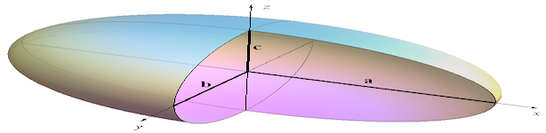
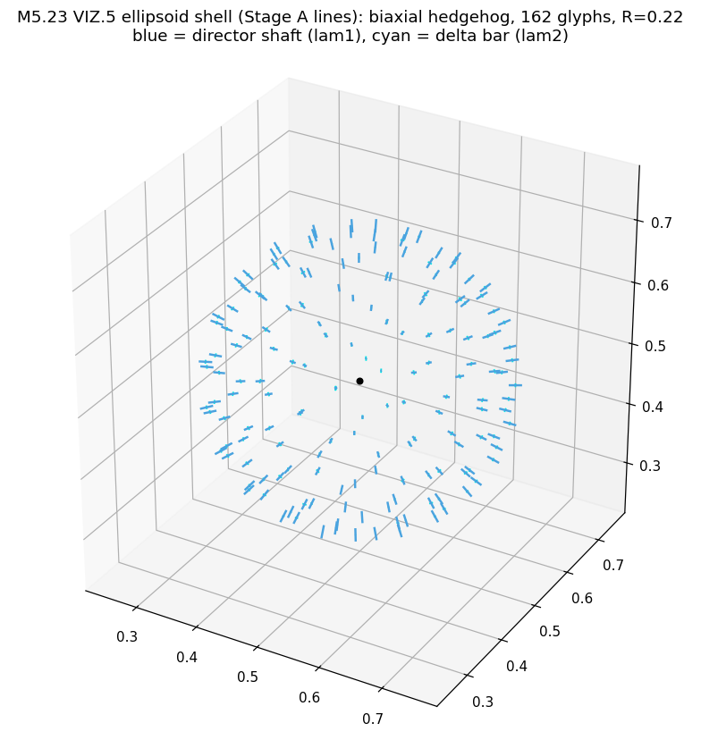
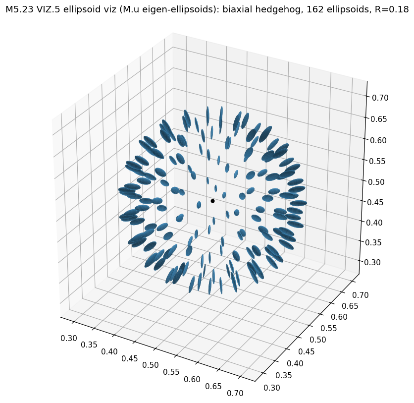
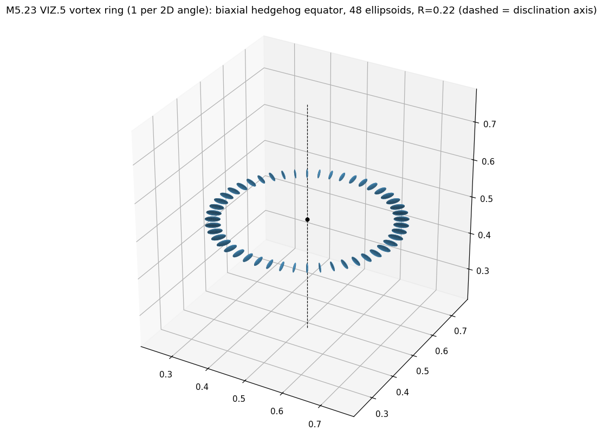
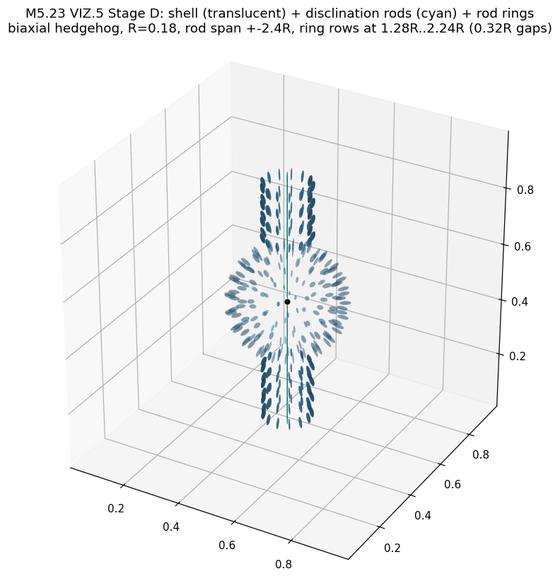

# M5.23, the angular-shell render: one glyph per 3D angle around the charge (VIZ.5)

> Task detail doc for **M5.23** (RENDERING). Roadmap row: [`m5_roadmap.md § RENDERING TASKS`](../m5_roadmap.md). Feature ID: **VIZ.5** (next after the VIZ.3 glyph select and the VIZ.4 dipole placeholder). Origin: the author's 2026-07-18 19:44 viz spec ([`m5_21_convo.md § 2026-07-18 19:44`](m5_21_convo.md)), sharpened by the author's 2026-07-19 feedback (single ellipsoid per angle, the density warning, the split-vortex arc: [`m5_23_convo.md`](m5_23_convo.md)). Standing viz conventions: [`m5_visualization.md`](../m5_visualization.md).

## TASK PLANNING

**The ask (the author's viz spec, verbatim)**: "for visualizations the most crucial is field situation around point-like charge, sufficient with one value per 3D angle. Also vortices, e.g. with one value per 2D angle."

**Decode**: around a point defect the far field is asymptotically radius-free (the hedgehog is scale-free outside the core), so ONE sample per direction û on the sphere S² captures the whole field situation; around a disclination (vortex) line the field depends only on the azimuth, so one sample per 2D angle on a ring captures it. The render therefore moves from the current cross-section planes (the 3 flux-mesh planes the glyphs live on today) to a **complete 3D angular shell**: one glyph per direction û, sampled at `center + R·û`.

Target look, the author's own electron-clock figure (ellipsoid glyphs fanned around the charge; the delta axis sweeping IS the de Broglie clock, which our `director_mid` clock-hand reproduces frame by frame):

The per-sample glyph end-state, the triaxial eigen-ellipsoid (semi-axes = the spatial eigenvalues λ₁ ≥ λ₂ ≥ λ₃ along their eigenvectors):

### Staged scope

| Stage | Deliverable | Mechanism |
| --- | --- | --- |
| **A: the S² shell with eigenframe line glyphs** | The `SHOW_ELLIPSOID` feature (taichi LINES first): one line glyph per direction û on a Fibonacci-sphere lattice, at `center + R·û`; main axis along `director_nhat` scaled by λ₁, delta cross-bar along `director_mid` scaled by λ₂ (the third eigenvector n̂×mid is available for a λ₃ bar; near-zero in the D = diag(g, 1, δ, 0) family, so optional) | Follows the existing line-glyph pattern (`engine4_render.py`) on new shell buffers; directions computed in-kernel (taichi-native, see the design decisions); nearest-voxel sampling of the derived eigenframe fields |
| **B: the ellipsoid mesh glyphs** | Each shell sample upgrades from a line frame to a shaded triaxial ellipsoid (the clock.gif look), rendered as one Taichi GGUI `scene.mesh` | The m5_6_5b KEY SIMPLIFICATION, already validated headless: a symmetric M maps the unit sphere to exactly the eigen-ellipsoid, `vertex = p + s·(M_spatial · u)` per template icosphere vertex u. NO per-glyph eigendecomposition. Includes the λ_min visibility floor (flat-disk protection) |
| **C: the vortex ring (the author's second case, REINFORCED 2026-07-19)** | One glyph per 2D angle: N_φ samples on a circle of radius R around the disclination-line axis (ring / dipole-axis configs). The author's 2026-07-19 feedback names the follow-up arc beyond this task: split-vortex ANIMATIONS for μ/τ from simulation (rides [M5.21.6](m5_21_6_task_details.md); the author's two-loop / two-neutrino conjecture logged in [`m5_23_convo.md`](m5_23_convo.md)) | Same sampler with a circle instead of a sphere; the line axis comes from the seed config |
| **D: the disclination-rod render (GO 2026-07-19 14:21 EDT), the corrected Stage C** | The two bipolar rods of the author's electron-clock figure = the DISCLINATION PAIR along the spin axis (the escaped-core structure every biaxial seed constructs; the hairy-ball constraint once the clock/spin rides the hedgehog; the axis IS the J/μ axis). Arms: **(a) rod-line ellipsoids** along the seed axis (one per height, both poles); **(b) rod rings**, per-2D-angle small circles AROUND the cord at several z-heights (the placement Stage C got wrong); (c, DEFERRED) the general disclination-line TRACER (eigenvalue-degeneracy detection + line assembly, needed for dynamic / split-vortex states) + the J/μ twist DEMO, both riding [M5.24](m5_24_task_details.md). This run = the STATIC arms (a)+(b). Feeds [M5.8.8](m5_8_8_task_details.md) (rod-localization energy), not gated by it. Was briefly staged as a separate M5.25; folded back here at the maintainer's call (the task was still open and Stage C was this feature's first attempt) | Reuses the whole VIZ.5 M·u mesh machinery with line + ring samplers in a dedicated rod pool; sub-toggles under `SHOW_ELLIPSOID` (`Rods` / `Rod Rings`), combinable with the shell (the author's figure shows shell + rods together); nearest-voxel sampling; the empirical hook: the Hamiltonian energy view already shows the energy lines exactly on the rod sectors |

### Design decisions (from the 2026-07-19 planning round)

| Decision | Resolution |
| --- | --- |
| What "one value per angle" indexes | The glyph set is indexed by **direction** (solid angle û on S² around the defect), not by director angle; the value DISPLAYED at each direction is the local eigenframe (n̂, mid, λ₁, λ₂, λ₃) |
| UI placement (AMENDED at go, 2026-07-19) | The shell is its OWN rendering feature with its OWN parameter namespace, the **"ellipsoid" visualization**: `SHOW_ELLIPSOID` checkbox placed above the glyph-select group, NOT a `GLYPH_VECTOR` state (that enum is tied to the flux-mesh planes). Options evolve under the same namespace: `ELLIPSOID_RADIUS` now, a glyph-vs-mesh toggle at Stage B, more as the feature grows. While active, ALL vector glyph viz (the plane glyphs, every `GLYPH_VECTOR` state) are suppressed so there is no visual pollution; the four existing states stay selectable when it is off, nothing is deleted |
| Collection radius R | REQUIRED, and physically meaningful: the far field is radius-free (which is exactly why one-per-angle suffices) but the core region is not, so R is a GUI slider (fraction of universe edge), default a few core radii OUTSIDE the core; sliding R inward exposes the core-to-far-field transition |
| The disclination line | NOT a competitor to the radius question: it is the author's SECOND case (vortices, one value per 2D angle) and becomes the Stage C ring sampler around the line axis |
| Shell center | The seed's `centers_voxel` (defect centers are known per config); one shell per defect (the dipole configs get two) |
| Direction set + density (AMENDED 2026-07-19) | Directions are a **Fibonacci-sphere lattice computed IN-KERNEL** (z uniform in (−1,1), azimuth stepping the golden angle): taichi-native per the production-code rule (below), uniform on S² at ANY count, no pole oversampling, no host-side table. Density is therefore a free GUI slider (`ELLIPSOID_GLYPHS`, 32 to 642), DEFAULT 162 per the author's density warning "for visibility it cannot be too dense" ([`m5_23_convo.md`](m5_23_convo.md)). The m5_6_5b icosphere remains the Stage B MESH template (verts + faces for the ellipsoid surface) |
| Production-code rule (maintainer, 2026-07-19) | Prioritize **taichi over numpy** in production code (engine / launcher per-frame paths); numpy stays fine in research scripts and one-time host-side setup where taichi buys nothing |
| Sampling safety | Stage A samples the DERIVED fields (`director_nhat`, `director_mid`, `eigenvalues`) at the NEAREST voxel: interpolating n̂ across voxels is apolar-unsafe (n̂ and −n̂ are the same state, sign flips break averaging). Stage B may interpolate M itself trilinearly (M is smooth and sign-free) before applying M·u |
| Eigenvalue display | The existing plane glyph draws n̂ at unit length with the delta bar scaled by the RATIO λ₂/λ₁; the shell glyph scales by the eigenvalues DIRECTLY (main ∝ λ₁, bar ∝ λ₂) so the spectrum itself is visible, matching the "display the matrix eigenvalues" intent and the ellipsoid semi-axes |
| `Glyphs` 0-3 slider interplay | RESOLVED at go (2026-07-19): the slider stays plane-only; the ellipsoid feature does NOT reuse it (own namespace). Concentric shells, if ever wanted, become their own `SHOW_ELLIPSOID` option later |
| Delivery order | Stage A (taichi LINES: director + delta glyphs on the shell) ships FIRST and alone, so the maintainer can see it live and course-correct before the mesh migration (Stage B) |
| Color | Stage A keeps the per-type glyph colors (director light-blue + delta cyan); a later option is coloring by the time-axis eigenvalue g or the clock phase |

### Implementation sketch

| File | Change |
| --- | --- |
| `medium.py` | Shell glyph vertex/color buffers (2 segment pairs × 642 max directions × 4 max centers) + the shell-center pool (`ellipsoid_centers`, filled at seed time); Stage B adds template-sphere verts/faces + mesh buffers |
| `engine4_render.py` | New `update_shell_glyphs` kernel (Stage A lines; Stage B `update_shell_ellipsoids` mesh kernel via M·u) |
| `_launcher.py` | `SHOW_ELLIPSOID` checkbox + `ELLIPSOID_RADIUS` slider (the feature's own namespace, above the glyph-select group); ellipsoid branch in the per-frame dispatch that SUPPRESSES the plane glyphs while active; scene.mesh call (Stage B) |

### Definition of done

- Stage A: the shell view renders live on the hedgehog configs (one eigenframe glyph per direction at radius R), checkbox first in the glyph group, radius slider working, plane glyphs correctly suppressed while active, interactive frame rate held.
- Stage B: the ellipsoid mesh replaces the line frames in shell mode (or as a sub-toggle), λ_min floor applied, validated visually against the m5_6_5b headless geometry.
- Stage C: the ring sampler renders one glyph per azimuth around a disclination-line config (may be split to a follow-up at review if A+B consume the run).
- No regression in the four existing glyph states; `check_docs.py` exits 0 over every touched `.md`.

**Gating**: user "go". Demo-tier, non-gating under headless-first (rendering gates nothing, NG-6 policy; same tier as M5.13).

**Blindspot pass**: the open items are the flagged decisions above (slider reuse, direction count, per-defect shells vs primary defect only, Stage C split). One physics caveat to carry: a single-radius shell HIDES radial structure by construction; that is the point of the view (the author's "sufficient with one value per 3D angle"), but core-region studies must keep using the plane glyphs or slide R inward, and the task should note this in the launcher tooltip or the viz doc.

## STAGE A FINDINGS (2026-07-19): SUPERSEDED same day (course-correction 2: the line-glyph variant retired, mesh-only; kept as the historical record)

Stage A landed as planned (plus the two go-time amendments: own feature namespace; taichi-first directions). What is in the working tree:

| Piece | Where | What landed |
| --- | --- | --- |
| Shell buffers | `medium.py` (VIZ.5 block after the moment glyph) | `ellipsoid_glyph_*` (shaft) + `ellipsoid_delta_*` (cross-bar) pairs sized 2 × 642 dirs × 4 centers; `ellipsoid_centers` pool + `ellipsoid_n_centers`; ceilings `ELLIPSOID_MAX_DIRS = 642`, `ELLIPSOID_MAX_CENTERS = 4` |
| The kernel | `engine4_render.update_ellipsoid_glyphs` | In-kernel **Fibonacci-sphere** directions (taichi-native, no host table, uniform at any count); nearest-voxel sampling of the derived eigenframe (apolar-safe); shaft = n̂ scaled by λ₁, delta bar = `director_mid` scaled by λ₂ (eigenvalues directly, 0.12 visibility floor / 2.0 ceiling); unused slots zeroed |
| GUI + dispatch | `_launcher.py` | `Ellipsoid (1 glyph/angle)` checkbox with `> Shell Radius` (0.02-0.5, default 0.15) + `> Shell Glyphs` (32-642, default 162 per the author's density warning); while ON the plane-glyph branch is suppressed (elif, no visual pollution); seed-time center fill (DEFECTS list → one shell per defect, else the config CENTER, stale-seed safe) |
| Machine gate | [`m5_23_ellipsoid_selftest.py`](../scripts/m5_23_ellipsoid_selftest.py) | **13/13 ALL GREEN** on the biaxial hedgehog: shell geometry exact, Fibonacci set matches the closed form, shaft/bar lengths + orientations exact vs the eigenframe, shaft ⊥ bar, **hedgehog shell director 100% radial** (the physics read), tail slots zeroed, no NaNs, density re-run clean, two-center (dipole) shells correct |

The headless preview (the selftest's render of the 162-glyph shell around the biaxial hedgehog; blue = director shaft, cyan = delta bar):

The hedgehog signature is exactly the expected one: every shaft radial (the topological "hedgehog" made visible in one glance), the delta bars tangent on the shell. Live look: run the launcher (`python -m openwave.xperiments.m5_liquid_crystal._launcher` in the `openwave312` env) and check `Ellipsoids (1 /angle)`.

## STAGE B FINDINGS (2026-07-19)

The M·u eigen-ellipsoid MESH landed behind the `Mesh Surfaces` toggle (with a `Wireframe` sub-toggle for the readability A/B the maintainer asked to test):

| Piece | Where | What landed |
| --- | --- | --- |
| UV-sphere template + static indices | `medium.py`: `populate_ellipsoid_template` + `populate_ellipsoid_mesh_indices` (both in-kernel, closed form per index, taichi-first) | 8 rings × 12 meridians + 2 poles = 98 verts / 192 triangles per glyph; one flat vertex/color/index pool spans all (center, direction) slots so ONE `scene.mesh` call renders the whole shell set; indices filled once |
| The mesh kernel | `engine4_render.update_ellipsoid_mesh` | Same Fibonacci shell points + nearest-voxel sampling as Stage A; `vertex = p + (size/2)·((M_sp + 0.08·I) @ u)`, the m5_6_5b key simplification: NO eigendecomposition (semi-axes = eigenvalues along eigenvectors automatically); the 0.08 isotropic floor keeps the λ₃ = 0 flat disk 3D-visible; unused slots collapse to the origin |
| GUI + dispatch | `_launcher.py` | `Mesh Surfaces` + `Wireframe` checkboxes inside the ellipsoid block; dispatch renders `scene.mesh(two_sided=True, show_wireframe=...)` in mesh mode, the Stage A lines otherwise; same Radius / Count / Size sliders drive both modes |
| Machine gate | [`m5_23_ellipsoid_selftest.py`](../scripts/m5_23_ellipsoid_selftest.py) | **17/17 ALL GREEN** (the 13 Stage A checks + 4 mesh checks: template unit-sphere + poles, indices in-slot + distinct, vertex = p + s/2·(M_sp + floor·I)@u vs the numpy reference, collapse + finite) |

The headless mesh preview (Lambert-shaded, the Stage B look on the biaxial hedgehog):

The arrangement reproduces the reference figure directly: individual eigen-ellipsoids fanned radially around the charge, one per angle, elongated along the local director; the thin profiles are the honest biaxial spectrum. What the static preview cannot show is the live payoff: under the 4D clock the delta axis sweep will rotate each ellipsoid's minor frame in place, the de Broglie clock animated.

## STAGE C FINDINGS (2026-07-19): the vortex ring, REMOVED at review the same day

The author's second case ("Also vortices, e.g. with one value per 2D angle") landed as a sub-mode of the same mesh machinery:

| Piece | What landed |
| --- | --- |
| Sampler | `update_ellipsoid_mesh` gained a `ring_mode` arg: 0 = the S² Fibonacci shell (per 3D angle), 1 = the VORTEX RING, a circle of radius R around the disclination axis (ẑ in every M5 seed) in each center's equatorial plane; everything downstream (M·u map, buffers, one `scene.mesh` call, per-defect centers) identical |
| GUI | `Vortex Ring (1 /2D angle)` checkbox inside the ellipsoid block; `Radius` / `Count` / `Size` drive the ring exactly as they drive the shell (Count = azimuth count) |
| Machine gate | Selftest now **13/13 ALL GREEN**: + ring centroids on the circle (max err 1.3e-07), coplanar at the equator, ring physics (hedgehog-equator director 100% radial in-plane), ring tail collapsed |

The headless ring preview (48 azimuths around the biaxial hedgehog's disclination axis, dashed):

The winding is directly visible: each ellipsoid's long axis follows the in-plane radial director, sweeping a full turn around the ring.

**REMOVED at review (2026-07-19, maintainer call)**: on the configs we actually have, the equatorial ring adds no information beyond what the S² shell already shows (on the static hedgehog it reads as "radial directors on a circle"), so the feature was cut the same day it landed (`ring_mode` arg, GUI checkbox, selftest ring section all removed; this section + the preview above stay as the record). The reasoning, sharpened by the review discussion of the author's electron-clock figure:

| Insight | Consequence |
| --- | --- |
| The author's "one value per 2D angle" vortex case is about REAL vortex structures: the two bipolar RODS visible in the author's electron-clock animation are the **disclination rods** along the spin axis (the escaped-core structure every biaxial seed carries; the maintainer's observation that Hamiltonian energy-density lines sit exactly on those rod sectors is the rod-core localization, the open [M5.8.8](m5_8_8_task_details.md) question is its energy test) | An informative per-2D-angle view must encircle an actual vortex CORD: small rings around the polar rods (with a z-scan), around the charged-ring cord (`_topo_charged_ring`), or around the future μ/τ split-vortex loops |
| A generic equator ring around ẑ does not do that placement job; the sampler needs per-config cord geometry | The per-2D-angle sampler RETURNS as **Stage D (the disclination-rod render)** in the staged scope above: rod-line ellipsoids + rod rings + the deferred line tracer; the split-vortex animation arc ([`m5_23_convo.md`](m5_23_convo.md), rides [M5.21.6](m5_21_6_task_details.md)) and the rod study ([M5.8.8](m5_8_8_task_details.md)) build on it |

## STAGE D FINDINGS (2026-07-19): the disclination-rod render, static arms

Both static arms landed on the first pass (GO 14:21 EDT; briefly staged as a separate M5.25, folded back here at the maintainer's call):

| Piece | What landed |
| --- | --- |
| The rod kernel | `engine4_render.update_rod_ellipsoids`: rod-LINE samples along the seed axis + rod RINGS (one ellipsoid per 2D angle, 24 azimuths × 4 rings, radius ~rhoc around the cord), in a dedicated rod pool rendered as one extra `scene.mesh` call; the M·u map + UV-face layout refactored into shared helpers (`_ellipsoid_vertex`, `_uv_face_locals`) used by both pools. **Outer-sector amendment (same day, maintainer observation vs the reference gif)**: the rods PROTRUDE beyond the shell (`ELLIPSOID_ROD_SPAN` = 1.6× the shell radius) and the rings sit at ±0.7 / ±0.9 of that span, on the protruding OUTER sections (≈ 1.12R / 1.44R, outside the shell), matching the reference composition and keeping the rings clear of shell occlusion |
| GUI | Three sub-toggles under `Ellipsoids (1 /angle)`: `Shell (1 /3D angle)` (default on), `Rods (disclination)`, `Rod Rings (1 /2D angle)`, freely combinable (the electron-clock figure shows shell + rods together); same Radius / Size knobs drive them |
| Machine gate | Selftest **14/14 ALL GREEN**: rod centroids exact on the axis, the M·u map reproduced at rod slots, ring circles exact at the fixed heights, toggle isolation + collapse clean, and the PHYSICS check below |
| ⚠️ The physics finding (one refuted hypothesis en route) | The first physics check assumed the rod core is an amplitude MELT (λ₁−λ₂ collapsing) and FAILED (rod 0.767 vs shell 0.646: the axis is *more* ordered in that measure). The correct signature: the rod core **ESCAPES TO UNIAXIAL**: the minor-eigenvalue split λ₂−λ₃ (≈ δ in the bulk) collapses to **0.000 exactly** on the axis vs 0.265 on the shell. This is (a) why the rods render as thin NEEDLES (uniaxial prolate ellipsoids), i.e. the author's rod iconography derived from the field, and (b) the natural detection criterion for the deferred disclination-line TRACER (arm c) |

The combined view (translucent shell + cyan rod needles through the poles + the cord rings), the electron-clock composition from the simulation field:

Deferred and now TRACKED as their own roadmap task, **[M5.25](m5_25_task_details.md)** (gated by [M5.24](m5_24_task_details.md)): the general line tracer (detect the λ₂−λ₃ uniaxial-escape degeneracy per voxel + assemble lines, needed for dynamic / split-vortex states) and the J/μ twist demo on the certified 4D clock.

**Ring-row amendments (same day, vs the reference gif)**: the reference shows FOUR ring rows per pole; `ELLIPSOID_RING_COUNT` raised 4 → 8. Then three maintainer refinements: (1) row SPACING doubled to 0.32R gaps; (2) the whole stack OFFSET one row gap off the shell (the first row was touching it): rows now at **1.28R / 1.60R / 1.92R / 2.24R** per pole, expressed in shell-radius units (`_ROD_RING_H0` = 1.28, `_ROD_RING_STEP` = 0.32), `ELLIPSOID_ROD_SPAN` = 2.4 so the rod tip clears the outermost row; (3) the ring azimuth density FOLLOWS the `Count` slider (~Count/12: the default Count 299 reproduces the original 24-azimuth look; buffer ceiling 64), one density knob for shell and rings together. Selftest re-verified 14/14 after each change.

### Course-correction round 1 (2026-07-19, after the maintainer's live look)

| Feedback | Change |
| --- | --- |
| Glyphs too small | New `ELLIPSOID_SIZE` GUI slider (`Size`, 0.01 to 0.15, default 0.05; the base length λ scales), replacing the hardcoded 0.02 |
| Checkbox exclusivity both ways | The four `GLYPH_VECTOR` checkboxes display UNCHECKED while the ellipsoid shell is on (those states are not rendering), and clicking any of them turns the ellipsoid off: the UI now mirrors the rule the render dispatch already enforced |
| Maintainer's own edits (kept) | `ELLIPSOID_COUNT` naming; labels `Ellipsoids (1 /angle)` / `Radius` / `Count` / `Glyph Planes` / `Flux Mesh Planes`; boot defaults R = 0.1, count = 299, size = 0.025; docstring reorder in `engine4_render.py` |

### Course-correction round 2 (2026-07-19, after the mesh vs lines + wireframe A/B)

| Verdict | Change |
| --- | --- |
| "no need for the wireframe view" | `ELLIPSOID_WIREFRAME` removed (state, GUI, dispatch); `scene.mesh` renders shaded-only |
| "the mesh is a way better viz feature, keep only the taichi mesh" | The line-glyph path FULLY RETIRED: `update_ellipsoid_glyphs` kernel, the 4 shaft/delta line buffers, and the `Mesh Surfaces` toggle all removed; `SHOW_ELLIPSOID` now renders `update_ellipsoid_mesh` directly (mesh-only, no mode switch). The Stage A findings above stay as the historical record (its preview png kept; the selftest no longer regenerates it) |
| Machine gate after the cut | Selftest rewritten mesh-only: **9/9 ALL GREEN** (template unit-sphere + centroid-at-origin, in-slot indices, shell centroids on R, Fibonacci set, the M·u map vs the numpy reference, hedgehog-radial physics, collapse + finite + density re-run, multi-center); launcher import OK |
