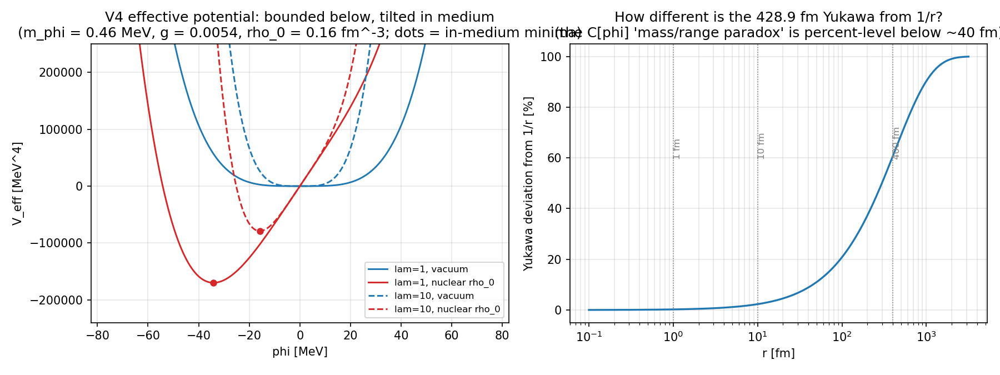

# M6.1 method note: the spec certification gate

> Task [M6.1](../tasks/m6_1_task_details.md), 2026-07-20. Standard: [`dev_docs/METHOD_NOTE.md`](../../../../../dev_docs/METHOD_NOTE.md) (equations first, equation-to-code map, results after methods, not-computed list, adversarial audit). Subject records: **LoE v11** (Zenodo [20357670](https://zenodo.org/records/20357670), the frozen validation spec) and **Ouroboros+Eli+Fable v4** (Zenodo [21447590](https://zenodo.org/records/21447590), the current published spec). Everything here characterizes the specs AS PRINTED; no BVP is solved and no benchmark number is reproduced or contested numerically in this task (that is M6.2).

## 1. The equations under examination

**v11 as printed (§ 2, § 4, § 5.1):**

```text
ℒ_JA = −F^{μν}F_{μν} − G^{μν}G_{μν} + J^μ A_μ − g (J^μ J_μ)²
(2.1) □A_μ = J_μ          (2.2) □J_μ = A_μ − 4g (J^ν J_ν) J_μ        □ = ∂t² − ∇²
Q_CS = (1/4π²) ∫ ε^{μνρσ} F_μν G_ρσ d⁴x
ansatz § 5.1:  A₀ = 0,  A = r̂ × ∇φ(r) cos(ωt);   J₀ = 0,  J = r̂ × ∇ψ(r) sin(ωt)
```

**The general-coefficient family used to test ℒ-vs-EL consistency** (a = kinetic normalization, c = coupling, q = quartic; printed values a = 1, c = +1, q = g):

```text
ℒ(a,c,q) = −a F^{μν}F_{μν} − a G^{μν}G_{μν} + c J^μ A_μ − q (J^μ J_μ)²
```

**v4 as printed (§ 3, § 5):**

```text
L = ½ ∂_μφ ∂^μφ − V(φ) − g φ ρ_n(x) + λ C[φ]        V(φ) = ½ m_φ² φ² + (λ/4!) φ⁴
H = ½ π² + ½ (∇φ)² + ½ m_φ² φ² + (λ/4!) φ⁴ + g φ ρ_n(x)
E_int = ∫_{V_A} g φ ρ_n d³x ≈ g φ A
```

Physical constants: `e_nat = √(4πα)`, `α⁻¹ = 137.035999`, `m_e = 0.511 MeV`, `ℏc = 197.327 MeV·fm`.

## 2. Equation-to-code map

| Check | Equation / object | Code | Permalink |
| --- | --- | --- | --- |
| C1 | `e_nat = √(4πα)`, target `m_e/e_nat` | `m6_1_v11_conventions_check.py:39` | [C1](https://github.com/openwave-labs/openwave/blob/main/openwave/xperiments/m6_ouroboros/research/scripts/m6_1_v11_conventions_check.py#L39-L52) |
| C2 | pairwise gap matrix of {1.6875, 1.6890, 1.6918, 1.6969} | `:53` | [C2](https://github.com/openwave-labs/openwave/blob/main/openwave/xperiments/m6_ouroboros/research/scripts/m6_1_v11_conventions_check.py#L53-L70) |
| C3 | `Q_pred = m_e/(H/Q)` identity | `:71` | [C3](https://github.com/openwave-labs/openwave/blob/main/openwave/xperiments/m6_ouroboros/research/scripts/m6_1_v11_conventions_check.py#L71-L84) |
| C4 | `H_code = m_e R_phys/ℏc`; `ℏc/191 fm` | `:85` | [C4](https://github.com/openwave-labs/openwave/blob/main/openwave/xperiments/m6_ouroboros/research/scripts/m6_1_v11_conventions_check.py#L85-L99) |
| C5 | `r̂ × ∇φ(r) = 0` (symbolic) | `:100` | [C5](https://github.com/openwave-labs/openwave/blob/main/openwave/xperiments/m6_ouroboros/research/scripts/m6_1_v11_conventions_check.py#L100-L114) |
| C6 | EL of `ℒ(a,c,q)`, both signatures, residual-verified; Lorenz-gauge solve for (a,c,q) | `:115` (EL at `:148`, identities at `:155`) | [C6](https://github.com/openwave-labs/openwave/blob/main/openwave/xperiments/m6_ouroboros/research/scripts/m6_1_v11_conventions_check.py#L115-L197) |
| V1 | v4 EL: `□φ + m²φ + (λ/6)φ³ + gρ = λ δC/δφ` | `m6_1_v4_characterization.py:67` (EL at `:76`) | [V1](https://github.com/openwave-labs/openwave/blob/main/openwave/xperiments/m6_ouroboros/research/scripts/m6_1_v4_characterization.py#L67-L84) |
| V2 | `H = π φ̇ − L` Legendre residual | `:87` | [V2](https://github.com/openwave-labs/openwave/blob/main/openwave/xperiments/m6_ouroboros/research/scripts/m6_1_v4_characterization.py#L85-L95) |
| V3 | `V_eff → +∞` limits + tilted-quartic minima `φ_min = −(6gρ/λ)^{1/3}` | `:96` (limits at `:100`) | [V3](https://github.com/openwave-labs/openwave/blob/main/openwave/xperiments/m6_ouroboros/research/scripts/m6_1_v4_characterization.py#L96-L115) |
| V4 | mass-dimension count | `:116` | [V4](https://github.com/openwave-labs/openwave/blob/main/openwave/xperiments/m6_ouroboros/research/scripts/m6_1_v4_characterization.py#L116-L127) |
| V5 | `1 − e^{−r/(ℏc/m_φ)}` deviation | `:128` (at `:130`) | [V5](https://github.com/openwave-labs/openwave/blob/main/openwave/xperiments/m6_ouroboros/research/scripts/m6_1_v4_characterization.py#L128-L143) |
| V6 | `∫gφρ_n d³x` vs `gφ(0)A`, Woods-Saxon | `:144` (integral at `:145`) | [V6](https://github.com/openwave-labs/openwave/blob/main/openwave/xperiments/m6_ouroboros/research/scripts/m6_1_v4_characterization.py#L144-L172) |
| V7 | in-medium tadpole minimum | `:173` | [V7](https://github.com/openwave-labs/openwave/blob/main/openwave/xperiments/m6_ouroboros/research/scripts/m6_1_v4_characterization.py#L173-L182) |
| V8 | `ℏc/m` range table | `:183` | [V8](https://github.com/openwave-labs/openwave/blob/main/openwave/xperiments/m6_ouroboros/research/scripts/m6_1_v4_characterization.py#L183-L188) |

Outputs: [`data/m6_1_v11_conventions.json`](../data/m6_1_v11_conventions.json) · [`data/m6_1_v4_characterization.json`](../data/m6_1_v4_characterization.json) · [`plots/m6_1_v4_veff_range.png`](../plots/m6_1_v4_veff_range.png).

## 3. Results, arm (a): the v11 certification (C1-C6)

| # | Result | Status |
| --- | --- | --- |
| C1 | `√(4π/137.036) = 0.302822` matches the paper's 0.30282; `0.511/0.30282 = 1.6875` matches the paper's physical target | ✅ measured |
| C2 | v11 Table 2 prints "1.6969 vs 1.6875: 0.30%"; the arithmetic is **0.557%**. The 0.30% label is consistent only with the § 5.1 model-internal pairing 1.6918-vs-1.6969 | ✅ measured |
| C3 | `0.511/1.6969 = 0.30114` = the printed "Q_predicted = 0.3011": the § 8 Step-3 charge "prediction (not fitted)" is `m_e/(H/Q)` restated; its 0.56% gap IS the H/Q gap | ✅ measured |
| C4 | `R_phys = 191 fm` requires `H_code = 0.4946`, printed nowhere in v11; `ℏc/191 fm = 1.0331 MeV` numerically equals the `m_J = 1.033 MeV` of the corpus read's July 5/8 papers, and (audit) the value appears as early as the 2026-05-15 record ("chaoiton carrier frequency (1.033 MeV)") (identity ✅; attribution to July 5/8 per corpus read, not independently re-verified by the audit; interpretation 🔶 open) | ✅ measured |
| C5 | `r̂ × ∇φ(r) ≡ 0` symbolically: the printed § 5.1 production ansatz is vacuous as written | ✅ measured |
| C6 | The printed EL pair is the EL system of `−¼F² − ¼G² + J·A − g(J·J)²` under **mostly-plus signature (−,+,+,+)**, not of the printed `ℒ` under either signature; rescaling cannot repair it (the −4g in (2.2) pins the scale); v11 states no signature | ✅ measured |

Consequences are encoded in the convention sheet ([`m6_1_v11_convention_sheet.md`](../m6_1_v11_convention_sheet.md)): dynamics-of-record = the EL pair; `ℒ_ref` carries the ¼'s; signature, H functional, Q definition, and ansatz are pre-registration GAPs for M6.2.

## 4. Results, arm (b): the v4 characterization (V1-V8)

| # | Result | Status |
| --- | --- | --- |
| V1 | v4's EL system **cannot be closed**: `□φ + m²φ + (λ/6)φ³ + gρ_n = λ δC/δφ` with `C[φ]` never written (only prose + `I = ∫φ δ_Σ − Σ_n` with `δ_Σ` undefined) | ✅ measured (the gap is the finding) |
| V2 | The printed `H` matches the Legendre transform of the printed `L`, both with the `λC[φ]` term omitted | ✅ measured |
| V3 | Boundedness below **VERIFIED** under v4's stated assumptions (λ > 0, bounded compact ρ_n): `V_eff → +∞` both directions; tilted minima match the cubic root analytically | ✅ measured |
| V4 | Dimensional analysis consistent ([g] = 0 given [ρ_n] = 3); but a dimensionless quartic is strictly renormalizable, **not superrenormalizable**; v4 § 1 carries the legacy superrenormalizability claim with no v4 derivation | ✅ measured |
| V5 | `ℏc/0.460 MeV = 428.9 fm` (paper: "~400 fm"); a 429 fm Yukawa deviates from 1/r by 0.23% at 1 fm and 2.3% at 10 fm: the "mass/range paradox" `C[φ]` is invoked to resolve is percent-level across the whole quoted 1-10 fm window, order-one only at r ≳ 400 fm | ✅ measured |
| V6 | With `∫ρ_n = A` (v4's own normalization) and any field with range ≫ R_nucleus, `E_int = gφ(0)A` holds to ≤ 1.3% for A = 1-208: **A-linear energy is a bookkeeping consequence of normalization + long-rangedness**, equally true of a standard per-nucleon scalar Yukawa; the distinguishing physics (cross-sections) is deferred by v4 itself ("ongoing work") | ✅ measured |
| V7 | The `φ` in `E_int ≈ gφA` is fixed by nothing in the paper; the self-consistent in-medium minimum is `φ_min = −(6gρ/λ)^{1/3}` (≈ −34 MeV at λ = 1 with the July g_J), λ unpinned | ✅ measured |
| V8 | Mass migration: 0.460 MeV ↔ 429.0 fm (v4) · 0.618 MeV ↔ 319.3 fm (v11 mediator) · 1.033 MeV ↔ 191.0 fm (July 5/8) | ✅ measured |



## 5. Not computed (explicitly out of this task's scope)

| Not computed | Where it belongs |
| --- | --- |
| Any BVP solve, any H/Q value, any reproduction or contestation of 1.6890/1.6918/1.6969 | M6.2 (the decision gate) |
| Q_CS on a converged state | M6.3 |
| Anything involving an explicit C[φ] (impossible: unspecified) | author-gated (canonical OQ2) |
| Scattering cross-sections, DAMA/NIF/Sawada fits, any empirical-domain rerun | M6.5 (parked) |
| The stability census / GF rerun | M6.4 |
| Whether v4 supersedes or coarse-grains the two-vector theory | author-gated (canonical OQ1) |

## 6. Adversarial audit

Independent refutation agent, own derivations and scripts (no reuse of the task's code; hand covariant computation cross-checked by its own full-4D sympy Euler operator with NO gauge fixing; own integration profiles; own CODATA arithmetic), per the AI_HYGIENE cardinal rule. Audit scripts preserved: [`scripts/m6_1_audit_a1_el.py`](../scripts/m6_1_audit_a1_el.py), [`scripts/m6_1_audit_a2_ansatz.py`](../scripts/m6_1_audit_a2_ansatz.py), [`scripts/m6_1_audit_a6_a7.py`](../scripts/m6_1_audit_a6_a7.py), [`scripts/m6_1_audit_numeric.py`](../scripts/m6_1_audit_numeric.py).

| Claim | Verdict | Auditor's independent evidence (condensed) |
| --- | --- | --- |
| A1 EL pair not from printed ℒ | ✅ CONFIRMED | gauge-free 4D Euler-operator run: printed ℒ gives □A = ±J/4; coefficient solver returns unique {a: 1/4, c: 1, q: g} under (−,+,+,+), EMPTY under (+,−,−,−) (needs c = −1, q = −g); rescaling leaves c/4a and q/a invariant, so the mismatch is unfixable |
| A2 § 5.1 ansatz vacuous | ✅ CONFIRMED | all three components of r̂ × ∇φ(r) simplify to 0; same for the J ansatz |
| A3 Table 2 gap label | ✅ CONFIRMED | 0.557% vs printed 0.30%; the 0.30% belongs to the 1.6918-vs-1.6969 pairing; bonus: § 5.1 calls 1.6969 "the target value from the electron mass" while § 8 defines the target as 1.6875 |
| A4 Q_predicted identity | ✅ CONFIRMED | 0.511/1.6969 = 0.301138 (all printed digits); algebraically Q_pred/e_nat = (m_e/e_nat)/(H/Q), the calibration gap inverted |
| A5 R_phys bookkeeping | 🔶 PARTIAL | arithmetic fully confirmed (H_code = 0.4946 printed nowhere; every H value v11 prints gives 652-818 fm, not 191); the 1.033 MeV value appears in the author's 2026-05-15 record description ("chaoiton carrier frequency (1.033 MeV)"); the July 5/8 full texts were outside the auditor's sources, so that attribution rests on the task's corpus read |
| A6 v4 boundedness | ✅ CONFIRMED | own closed-form pointwise bound; counterexample found for v4's looser phrase "any finite nucleon distribution": a delta-function ρ_n drives E → −∞, so bounded + compact support (the nuclear case) is load-bearing |
| A7 not superrenormalizable | ✅ CONFIRMED | own power counting: [λ] = [g] = 0, superficial degree D = 4 − E, textbook strictly-renormalizable; v4's only mention is the bare § 1 bullet |
| A8 Yukawa ≈ 1/r in window | ✅ CONFIRMED | own arithmetic: 0.23% (1 fm), 2.30% (10 fm), order-one only at r ~ 429 fm |
| A9 A-linearity generic | ✅ CONFIRMED | own profiles (Woods-Saxon AND uniform ball): ratio 0.996-0.987 for A = 1-208; a standard per-nucleon Yukawa is literally the same integral |
| A10 v4 EL unclosable; H sans λC | ✅ CONFIRMED | own EL + Legendre; δ_Σ undefined and the constraint line dimensionally incoherent; H matches only with λC dropped (and only if C has no φ̇ dependence, unstated); v4 never prints any EL equation |

Overturn scan: negative (no metric signature statement anywhere in v11; no printed H functional; no non-degenerate ansatz; no concrete C[φ] in v4). The auditor additionally reported two findings beyond the task's claims, both against the papers:

| # | Auditor finding | Our verification |
| --- | --- | --- |
| AF1 | v4 carries two mutually inconsistent derivations of its headline scaling: § 3 derives A-linearity from the volume integral ∫ρ_n = A, while § 4.1 claims the interaction "scales with the surface area, which in turn scales linearly with A"; surface area scales as A^(2/3) | confirmed by inspection of the v4 text (both passages present); recorded as canonical § 1 caution 8 |
| AF2 | v11 § 7.1's "[g] = −4" follows from no consistent dimension assignment of the printed ℒ: the G² kinetic term forces [J] = 1, making g dimensionless, and the J·A term (dim 2) then needs an unprinted mass² coefficient, as does (2.1) □A = J | confirmed by direct count ([∂J]² = 4 → [J] = 1; [(J·J)²] = 4 → [g] = 0; [J·A] = 2 ≠ 4); the implicit μ² = 1 code-units convention is added to the sheet § 4 checklist, and the superrenormalizability power-counting chain (v11 § 7.1 → v4 § 1) is unsupported as printed |

## 7. Cross-links

Task details: [`tasks/m6_1_task_details.md`](../tasks/m6_1_task_details.md) · convention sheet: [`m6_1_v11_convention_sheet.md`](../m6_1_v11_convention_sheet.md) · scripts: [`scripts/m6_1_v11_conventions_check.py`](../scripts/m6_1_v11_conventions_check.py), [`scripts/m6_1_v4_characterization.py`](../scripts/m6_1_v4_characterization.py) · data: [`data/m6_1_v11_conventions.json`](../data/m6_1_v11_conventions.json), [`data/m6_1_v4_characterization.json`](../data/m6_1_v4_characterization.json) · plot: [`plots/m6_1_v4_veff_range.png`](../plots/m6_1_v4_veff_range.png) · canonical: [`m6_theory_canonical.md`](../m6_theory_canonical.md) · roadmap: [`m6_roadmap.md`](../m6_roadmap.md).
