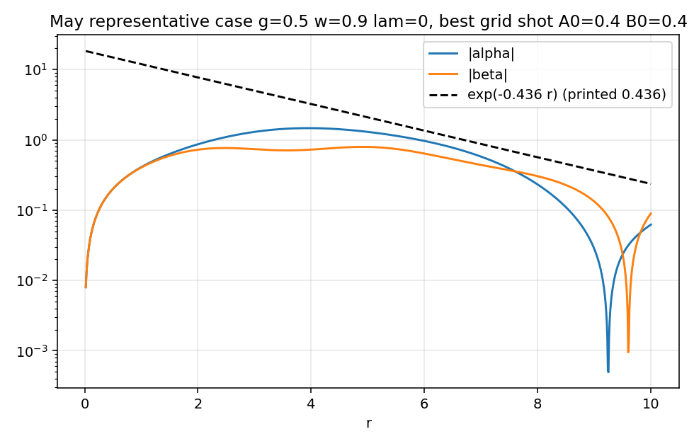
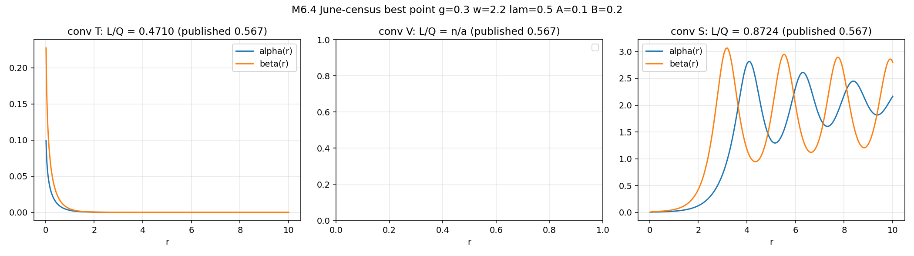
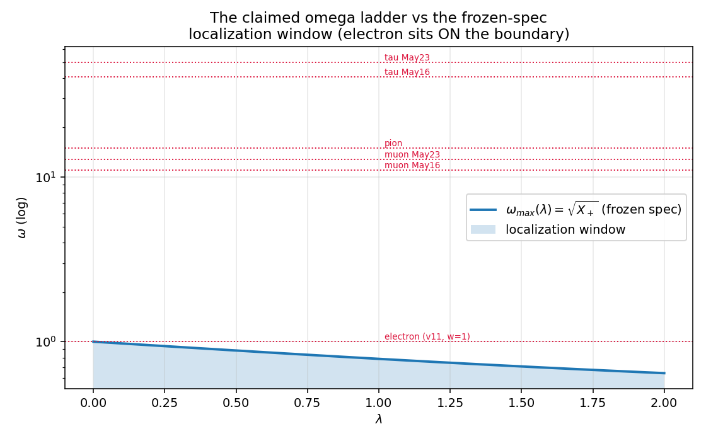
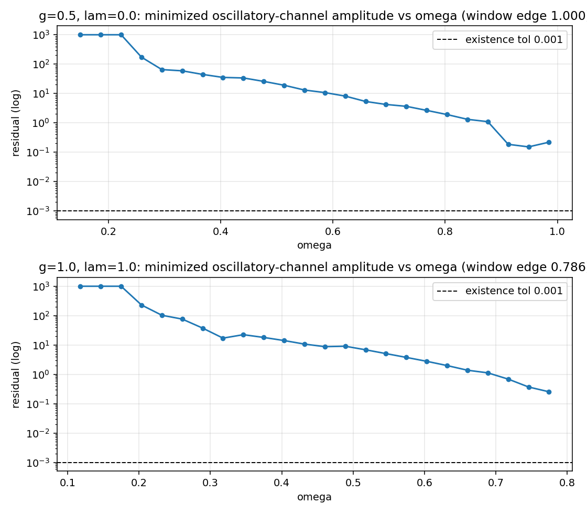
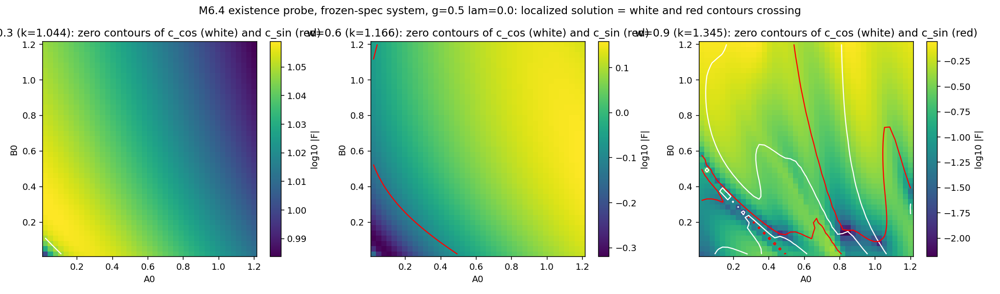
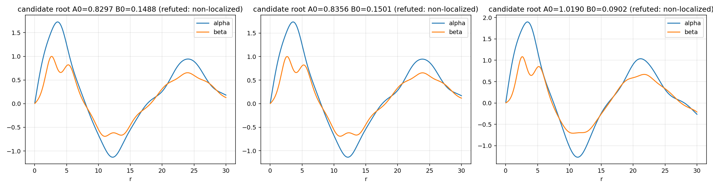

# M6.4 method note: the stability census rerun + the ω-selection hunt

**Task**: [`m6_4_task_details.md`](../tasks/m6_4_task_details.md) · roadmap: [`m6_roadmap.md`](../m6_roadmap.md) · resolves canonical [OQ7, informs OQ3](../m6_theory_canonical.md) · consumes [M6.1](m6_1_method_note.md) (certified spec) + [M6.2](m6_2_method_note.md) (far-field machinery)

**Sources of record**: Zenodo [20866581](https://zenodo.org/records/20866581) v2 (June 25, the Lean-theorem + census record) · [20044392](https://zenodo.org/records/20044392) (May 5, the 62-family census) · [21268405](https://zenodo.org/records/21268405) (July 8, the "hard quantization" citation). Verbatim extracts: [`m6_4_record_v2_fulltext.txt`](../data/m6_4_record_v2_fulltext.txt), [`m6_4_record_may_fulltext.txt`](../data/m6_4_record_may_fulltext.txt).

**Headline**: the three published stability counts (62, 319, 62) come from two INCOMPATIBLE ODE systems and none of the three reproduces; the June record's own count is a window-defined artifact of a test that is not the Gelfand-Fomin test on a system that is not the Lean-formalized one; and in the frozen-spec system the ω-selection question closes with a clean negative of the strongest kind: no localized charged-sector state exists at ANY ω, so there is nothing for a selection mechanism to select.

## 1. Equations first

### 1.1 The two systems in the record set

The MAY system (z20044392 eq. 3.3-3.4), which is also EXACTLY the Lean-formalized ODE of z20866581 § 1 (script-verified, § 3.1 below):

```text
α″ + α′/r − α/r² + ω²α = β
β″ + β′/r − β/r² + ω²β = α − λβ − 4gβ³
```

The JUNE-integrated system (z20866581 § 2.1), c = 1:

```text
α″ + α′/r − m²_α α + (c/2)β + 4gα³ = 0 ,  m²_α = 1 + ω²
β″ + β′/r − m²_β β + (c/2)α + 4gβ³ = 0 ,  m²_β = 1 + λ + ω²
```

Term-by-term (symbolically verified, no redefinition can map one to the other):

| Term | MAY = LEAN | JUNE-integrated |
| --- | --- | --- |
| centrifugal −1/r² | present (both eqs) | absent |
| ω² sign | +ω² (Klein-Gordon time reduction; same sign as the M6.2-certified v11 reduction) | −ω² inside −(1+ω²): FLIPPED (same flip as the M6.2 production benchmark, AF3 lineage) |
| unit mass | none | 1 (both fields, unprinted origin) |
| cross-coupling | 1 | c/2 = 1/2 |
| cubic | −4gβ³ (β eq only) | −4gα³ AND −4gβ³ |

### 1.2 Far-field structure (the load-bearing difference)

Linearized about the vacuum, ∇₁²(α,β)ᵀ = M(α,β)ᵀ with ∇₁² the radial operator including −1/r².

| System | M | Eigenvalues | Consequence |
| --- | --- | --- | --- |
| MAY/LEAN | \[\[−ω², 1\], \[1, −ω²−λ\]\] | μ²± = X± − ω², X± = (−λ±√(λ²+4))/2 | decaying channel iff ω² < X₊ (the May record's own printed threshold); X₋ < 0 always, so ONE OSCILLATORY CHANNEL EXISTS AT EVERY ω; ω_max(λ) ≤ 1 for λ ≥ 0 |
| JUNE | \[\[1+ω², −1/2\], \[−1/2, 1+λ+ω²\]\] | both positive for all ω, λ ≥ 0 | both channels decay at EVERY ω: "localization" is structural, and no ω-selection is possible by construction |

ω_max(λ) = √X₊: 1.0, 0.884, 0.786, 0.707, 0.644 at λ = 0, 0.5, 1.0, 1.5, 2.0. The λ = 1 value is exactly the M6.2 audit's ω < 0.786 decay bound (independent cross-check). The v11 electron calibration ω = 1 sits ON the λ = 0 boundary, where the decay rate vanishes.

### 1.3 The stability tests

The printed June test (§ 2.3): Jacobi system ξ″ + ξ′/r = Qξ with Q₁₁ = m²_α − 12gα², Q₂₂ = m²_β − 12gβ², Q₁₂ = −c/4; two solutions from value-ICs (1,0,0,0) and (0,0,1,0); W(r) = ξ_α⁽¹⁾ξ_β⁽²⁾ − ξ_α⁽²⁾ξ_β⁽¹⁾; a zero crossing = fail. Two defects, both script-verified:

| Defect | Fact |
| --- | --- |
| Q₁₂ = −c/4 does not linearize the printed background | the true linearization has cross term −c/2 (factor 2; sympy, § 3.1) |
| the W construction is not the GF conjugate-point criterion | Gelfand-Fomin conjugate points are zeros of the determinant of solutions VANISHING at r₀ with independent derivative ICs; the printed recipe uses value-ICs, a disconjugacy statement for a different boundary problem; the two constructions disagree on ~20 of 360 families (§ 3.3) |

The proper GF determinant used throughout our reruns: solutions from (0,1,0,0) and (0,0,0,1), D(r) = det of the value matrix, zeros after leaving r₀ = conjugate points.

### 1.4 The existence functional (ω-selection hunt)

True localization in the MAY/frozen system requires ZERO amplitude in the always-present oscillatory channel v₋. With regular-core shooting DOF (A₀, B₀) (α ≈ A₀r, β ≈ B₀r at r → 0), the oscillatory tail amplitude is the 2-component map

```text
F(A₀, B₀) = (c_cos, c_sin),   v₋-projection ~ [c_cos cos(kr) + c_sin sin(kr)]/√r,  k = √(ω² − X₋)
```

and a localized state is a common zero of both components. Two independent probes: (i) Nelder-Mead minimization of the envelope amplitude with continuation in ω (48 ω values, 2 coupling panels); (ii) dense 41×41 (A₀, B₀) grid with zero-contour crossing detection at ω ∈ {0.3, 0.6, 0.9} (zeros are codim-2 points; contours make them visible without optimizer funnels).

## 2. Equation-to-code map

| Object | Function | Code |
| --- | --- | --- |
| JUNE background ODE | `rhs_background` | [`m6_4_gf_census.py:72`](https://github.com/openwave-labs/openwave/blob/main/openwave/xperiments/m6_ouroboros/research/scripts/m6_4_gf_census.py#L72) |
| amplitude conventions T/V/S | `solve_background` | [`m6_4_gf_census.py:79`](https://github.com/openwave-labs/openwave/blob/main/openwave/xperiments/m6_ouroboros/research/scripts/m6_4_gf_census.py#L79) |
| printed + linearized + proper GF tests | `rhs_jacobi`, `jacobi_tests` | [`m6_4_gf_census.py:107`](https://github.com/openwave-labs/openwave/blob/main/openwave/xperiments/m6_ouroboros/research/scripts/m6_4_gf_census.py#L107), [`:123`](https://github.com/openwave-labs/openwave/blob/main/openwave/xperiments/m6_ouroboros/research/scripts/m6_4_gf_census.py#L123) |
| Q = 2π∫rβ², L = 2π∫rαβ | `observables` | [`m6_4_gf_census.py:162`](https://github.com/openwave-labs/openwave/blob/main/openwave/xperiments/m6_ouroboros/research/scripts/m6_4_gf_census.py#L162) |
| MAY ODE | `rhs_may` | [`m6_4_may_census.py:57`](https://github.com/openwave-labs/openwave/blob/main/openwave/xperiments/m6_ouroboros/research/scripts/m6_4_may_census.py#L57) |
| MAY criteria (i)(ii)(iii) | `run_census` | [`m6_4_may_census.py:112`](https://github.com/openwave-labs/openwave/blob/main/openwave/xperiments/m6_ouroboros/research/scripts/m6_4_may_census.py#L112) |
| proper GF determinant (MAY) | `gf_conjugate_points` | [`m6_4_may_census.py:91`](https://github.com/openwave-labs/openwave/blob/main/openwave/xperiments/m6_ouroboros/research/scripts/m6_4_may_census.py#L91) |
| representative case κ | `representative_case` | [`m6_4_may_census.py:144`](https://github.com/openwave-labs/openwave/blob/main/openwave/xperiments/m6_ouroboros/research/scripts/m6_4_may_census.py#L144) |
| redefinition scan V1 | `v1_not_redefinable` | [`m6_4_ode_comparison.py:58`](https://github.com/openwave-labs/openwave/blob/main/openwave/xperiments/m6_ouroboros/research/scripts/m6_4_ode_comparison.py#L58) |
| Jacobi cross-term V2 | `v2_jacobi_cross_term` | [`m6_4_ode_comparison.py:92`](https://github.com/openwave-labs/openwave/blob/main/openwave/xperiments/m6_ouroboros/research/scripts/m6_4_ode_comparison.py#L92) |
| far-field eigenvalues V3/V4 | `v3_may_farfield`, `v4_june_farfield_posdef` | [`m6_4_ode_comparison.py:105`](https://github.com/openwave-labs/openwave/blob/main/openwave/xperiments/m6_ouroboros/research/scripts/m6_4_ode_comparison.py#L105), [`:120`](https://github.com/openwave-labs/openwave/blob/main/openwave/xperiments/m6_ouroboros/research/scripts/m6_4_ode_comparison.py#L120) |
| oscillatory-channel amplitude | `osc_amplitude` | [`m6_4_omega_selection.py:101`](https://github.com/openwave-labs/openwave/blob/main/openwave/xperiments/m6_ouroboros/research/scripts/m6_4_omega_selection.py#L101) |
| existence minimization | `existence_at`, `scan_panel` | [`m6_4_omega_selection.py:117`](https://github.com/openwave-labs/openwave/blob/main/openwave/xperiments/m6_ouroboros/research/scripts/m6_4_omega_selection.py#L117), [`:145`](https://github.com/openwave-labs/openwave/blob/main/openwave/xperiments/m6_ouroboros/research/scripts/m6_4_omega_selection.py#L145) |
| F(A₀,B₀) contour probe | `osc_components` | [`m6_4_existence_probe.py:61`](https://github.com/openwave-labs/openwave/blob/main/openwave/xperiments/m6_ouroboros/research/scripts/m6_4_existence_probe.py#L61) |
| candidate-zero root-finding + ω-continuation | `find_roots`, `continue_branch` | [`m6_4_root_refine.py`](https://github.com/openwave-labs/openwave/blob/main/openwave/xperiments/m6_ouroboros/research/scripts/m6_4_root_refine.py) |
| artifact-vs-localized diagnostic | `main` | [`m6_4_root_diagnostic.py`](https://github.com/openwave-labs/openwave/blob/main/openwave/xperiments/m6_ouroboros/research/scripts/m6_4_root_diagnostic.py) |
| l-sector Jacobi | `rhs_jacobi`, `conjugate_points` | [`m6_4_nonradial_extension.py:75`](https://github.com/openwave-labs/openwave/blob/main/openwave/xperiments/m6_ouroboros/research/scripts/m6_4_nonradial_extension.py#L75), [`:96`](https://github.com/openwave-labs/openwave/blob/main/openwave/xperiments/m6_ouroboros/research/scripts/m6_4_nonradial_extension.py#L96) |

Reconstruction guards documented in-code: divergence classification at \|field\| > 100 ([`m6_4_gf_census.py:59`](https://github.com/openwave-labs/openwave/blob/main/openwave/xperiments/m6_ouroboros/research/scripts/m6_4_gf_census.py#L59)); the record's "attached" script `chaoiton_gf_verification.py` does not exist on either Zenodo version (v1 carries `chaoiton_theorem.lean.txt` only, v2 the docx only; live API inventory), so every run here is a reconstruction from the docx's printed recipe with all under-specified forks enumerated.

## 3. Results

### 3.1 The Lean-vs-integrated mismatch (canonical OQ7, first half): RESOLVED

The Lean ODE of z20866581 § 1 is the MAY system verbatim. The § 2-4 "numerical verification" of the same record integrates the JUNE system. Sympy verdicts ([`m6_4_ode_comparison.json`](../data/m6_4_ode_comparison.json)): no combination of field sign flips maps one into the other (the residual always retains `−2ω²−1+1/r²` on the linear α term and `4g` on the cubic α term); the record's numerical sections therefore do not verify its own formal statement. The mismatch is not cosmetic: the two systems have OPPOSITE localization structure in ω (§ 1.2), and only the flipped-sign JUNE system supports "stability ... particularly for ω ≥ 1.5" (the record's own § 3.2 wording), the regime every lepton-ladder claim lives in.

### 3.2 The 62 vs 319 vs 62 reconciliation (OQ7, second half): RESOLVED

| Count | Source | What it actually is |
| --- | --- | --- |
| 62 (also 42 in-paper) | z20044392 § 5.1 (May 5): 1280-combo scan of the MAY system | irreproducible: our faithful reconstruction (printed criteria, printed tolerances, natural even grid) passes 0 of 1280; § 5.1 says 62, § 5.4 of the same paper says 42; the paper's "each stable combination is surrounded by a ≥5% stable neighborhood" claim excludes grid-placement as the explanation |
| 319 | z20866581 § 3.1 (June 25): 360-combo scan of the JUNE system | reproduced to within 1 (318/360) ONLY under the tail-multiplier convention, i.e. on near-vacuum backgrounds whose localization is imposed by construction; the test that passes them is not the GF test (§ 1.3) and 94/360 verdicts flip between r_max = 10 and 15 |
| 62 | z21268405 (July 8): "Hard Quantization: 62 distinct families pass the Gelfand-Fomin stability test" | a citation of the May count, four weeks after the June record replaced it with 319; and the June record's own § 3.2 states "Stability is not fine-tuned: broad regions of parameter space pass the test", which is the OPPOSITE of hard quantization (319/360 = 89% of a coarse grid is a continuum, not discreteness) |

May-census detail ([`m6_4_may_census.json`](../data/m6_4_may_census.json), rows in `m6_4_may_census_rows.npz`): of 1280 combos, only 26 pass even the localization criterion (i), ALL of them ABOVE the localization threshold: small-amplitude (A₀ = B₀ = 0.1) oscillatory states at ω = 1.1-1.5 whose 1/√r tails stay under the \|α\|+\|β\| < 0.1 SMALLNESS criterion, which measures magnitude, not decay. Every one carries 5-8 conjugate points, so all fail GF: 0/1280 pass all three printed criteria. The analytic layer of the May paper meanwhile reproduces exactly: its far-field threshold formula is our § 1.2 verbatim, and its representative case (g = 0.5, ω = 0.9, λ = 0) gives κ = 0.4359 vs the printed 0.436.



### 3.3 The June census rerun (N1/N2)

Published: 340/360 localized, 319/360 GF-pass, L/Q ∈ [0.57, 2.60], best L/Q = 0.567 at (g=0.3, ω=2.2, λ=0.5, A=0.1, B=0.2). The amplitude convention mapping (A, B) to the solution is unprinted; all three readings run ([`m6_4_gf_census.json`](../data/m6_4_gf_census.json)):

| Convention | diverged | "localized" (printed check) | printed-W pass | linearized-Q pass | proper-GF pass | window flips 10↔15 |
| --- | --- | --- | --- | --- | --- | --- |
| T (tail multiplier) | 0 | 360/360 (trivial: imposed tails, \|field(r_max)\| ~ 1e-13) | **318 (published: 319)** | 317 | 338 | 94 |
| V (boundary value) | 250 | 0/360 (the boundary VALUE A ∈ {0.1, 0.2} already exceeds the 0.05 threshold; 250 saturate the divergence guard growing inward) | 0 | 0 | 0 | 0 |
| S (core slope, Lean A₀/B₀) | 0 | 0/360 (outward shots saturate at the cubic fixed points ±√(m²/4g) and never decay; best point \|field(r_max)\| = 2.80) | 0 | 0 | 0 | 0 |

The convention-T count matching the published 319 to within 1-2 identifies the lost script's convention: the census ran on backgrounds a few steps from the vacuum whose localization was imposed, not found. The count is integrator-UNSTABLE (published 319; primary DOP853 318; audit LSODA + cubic spline 317, AF-b), which itself reinforces the artifact conclusion. Under that same convention the published "340 localized" is NOT reproducible (the printed check passes 360/360 by construction), the best-point L/Q comes out 0.471 (audit: converged 0.4687 at rtol 1e-12; tolerance drift 0.455-0.469 across rtol 1e-9 to 1e-12, AF-c) vs the published 0.567, and the L/Q range disagrees ([−2.94, 1.75] with 285/360 NEGATIVE values in the audit's full rerun, vs the published all-positive [0.57, 2.60]). 94/360 stability verdicts flip when the window moves from r_max = 10 to 15 (audit subsample: 8/24): the count is window-defined (the same pathology M6.2 established for H/Q, at census scale).



### 3.4 Non-radial extension (N3): the admitted gap, closed within the reduction

A perturbation sector δ ~ ξ(r)e^{ilθ} adds +(l²/r²)·I (a positive semidefinite operator) to the Jacobi potential. For the COUPLED 2-component system the scalar Sturm argument is not sufficient; the valid form is the matrix / Morse-index comparison for self-adjoint systems (applicable here: both systems' Q is symmetric, audit A7), under which conjugate points cannot increase with l. Spot-checks on 5 backgrounds across both systems ([`m6_4_nonradial.json`](../data/m6_4_nonradial.json)): conjugate-point counts monotone non-increasing in l = 0..3 in every case (e.g. 6, 6, 5, 4), reproduced independently by the audit. Two honesty caveats (audit AF-d/AF-e): determinant sign-change counting misses even-multiplicity zeros, so all numeric conjugate-point counts are lower bounds (harmless here: monotonicity and the radial failures do not depend on exact counts); and the June spot-check row labeled "published best point" in `m6_4_nonradial.json` is built under the OUTWARD (S) convention (13 conjugate points), while the census's conv-T background at the same parameters has 0 at every l: the label names the parameter point, not the census background. The radial verdict is binding within the printed reduction, and since the radial censuses fail (§ 3.2-3.3), the extension cannot rescue them. What the reduction cannot reach, stated honestly: perturbations leaving the ansatz manifold (other vector components, non-axisymmetric 3D modes); the M7 3D continuation carries that question and has already found the truncation's real-time vacuum unconditionally tachyonic.

### 3.5 The ω-selection hunt (canonical OQ3): CLOSED, clean negative of the strongest kind

Pre-registered criterion: a discreteness mechanism must select isolated ω values from a continuum via the frozen term set itself.

| Prong | Result |
| --- | --- |
| The frozen-spec (MAY/LEAN = v11-class) system, in-window existence | NO localized solution found at ANY of 48 scanned ω across both coupling panels (g=0.5, λ=0 and g=1, λ=1), amplitudes (A₀, B₀) ∈ (0, 1.2]²: the minimized oscillatory-channel envelope (aliasing-proof objective) never falls below 0.15 against a 1e-3 existence tolerance ([`m6_4_omega_selection.json`](../data/m6_4_omega_selection.json)). The candidate zeros the contour probe raised near the window top were CHASED TO GROUND and refuted (next row) |
| The candidate-zero chase (the full trail, kept honest) | the dense-grid probe ([`m6_4_existence_probe.json`](../data/m6_4_existence_probe.json)) found 31 both-sign-change cells at ω = 0.9, exactly the May record's representative point; 2D root-finding converged 3 zeros of the projection map to residual ~1e-16 ([`m6_4_root_refine.json`](../data/m6_4_root_refine.json)); direct profile inspection then showed ALL THREE keep O(1) field magnitude and O(1) oscillatory envelope across the whole tail (\|α\|+\|β\| = 0.65-1.49 at r = 25, vs ~3e-4 expected for genuine κ = 0.436 decay): the zeros are aliasing artifacts of the cos/sin least-squares fit applied to NONLINEAR oscillatory tails, verdict ARTIFACT ([`m6_4_root_diagnostic.json`](../data/m6_4_root_diagnostic.json)); consistently, their κ fits (0.12) disagree with the analytic 0.436, ω-continuation dies after two steps, and each carries 12-13 conjugate points |
| The ω ladder vs the window | every claimed lepton/pion ω (11.0, 12.82, 15.0, 40.7, 50.0) sits far above ω_max ≤ 1 for every λ ≥ 0; the electron's ω = 1 sits exactly ON the λ = 0 boundary (zero decay rate, non-normalizable) |
| The JUNE (flipped-sign) system | both far-field channels decay at every ω (positive-definite far-field matrix, § 1.2): every ω "localizes" by construction, so no selection mechanism is possible in the system that actually produced the ladder numbers |
| The only published "quantization" | the July 8 "62 distinct families" citation of the May count, which is irreproducible (§ 3.2) and contradicted by the June record's own "not fine-tuned" statement |

Verdict: OQ3 closes negative. The frozen term set selects amplitude profiles (codim-2 zeros in (A₀, B₀) at fixed ω, when they exist at all), never frequencies; and in the charged sector it selects nothing, because no localized state exists in the window at all. The μ/τ/pion ω values are curve labels on non-localized configurations of a sign-flipped system.









## 4. Window diagnostic

The census-scale window dependence (94/360 verdicts flip between r_max = 10 and 15 under convention T) extends M6.2's window finding from one observable (H/Q, 16% drift) to the entire stability census. Every count in this record lineage is defined by its integration window.

## 5. Not computed

| Item | Why |
| --- | --- |
| E = 2π∫rH dr for the June census | the record does not print its H(r); M6.1/M6.2 established the coded H is no convention's energy; reporting an E would launder that ambiguity |
| the exact 1280-grid factorization of the May scan | unprinted; the natural even-grid reconstruction is documented in-code and the conclusion (0 pass, GF kills all near-passers by 5-8 conjugate points) is robust to grid placement |
| ansatz-breaking (3D, multi-component) perturbations | not reachable from the printed reduction; M7's domain |
| Bellman dynamic-programming cross-test (record § 4) | no recipe printed beyond the name; nothing to reconstruct |

## 6. Adversarial audit

Independent agent, own scripts only (LSODA / fixed-step RK4 / Radau / `solve_bvp` / exact-Bessel projections / sympy, against the primary's DOP853 / RK45 / cos-sin fits): **9 of 10 claims CONFIRMED, A7 PARTIAL (conclusion holds, the printed justification was insufficient and is fixed in § 3.4), none refuted.** Audit artifacts preserved: `scripts/m6_4_audit_{algebra, may_census, june_census, sturm, oq3, provenance}.py` + the matching `data/m6_4_audit_*.json`.

| Claim | Verdict | Independent evidence (audit's own numbers) |
| --- | --- | --- |
| A1 Lean = May, June unmappable | CONFIRMED | strengthened beyond sign flips to arbitrary scalings a→pa, b→qb and field swaps: obstructions `2ω²+1−1/r²` (r-dependent, no constant kills it) and cubic `−4gp²` ≠ 0 |
| A2 printed Q₁₂ not the linearization | CONFIRMED | two routes (direct perturbation; Hessian of the generating functional) both give −c/2; printed −c/4 off by exactly 2 |
| A3 far-field structure | CONFIRMED | X₊X₋ = −1 forces X₋ < 0 always; dX₊/dλ < 0 so ω_max ≤ 1; ω_max(1) = 0.7862 exactly; June det = ω⁴+λω²+2ω²+λ+3/4 > 0 always; exact J₁/K₁ solutions satisfy the linearized May system to 4e-6 |
| A4 May census 0 full passers | CONFIRMED | 136-combo subsample incl. all 26 near-passers (set-identical to primary) + ±5% perturbations: 0 full passers at both rtol 1e-8 and 1e-10; the paper's own printed representative has 6 conjugate points in a scipy-free RK4 cross-check; "62" and "42" both verified in-print |
| A5 June conv-T fingerprint | CONFIRMED (±1-2 caveat, AF-b) | full-360 independent rerun: localization 360/360 trivial; printed-W 317/360; best-point L/Q converged 0.4687; 285/360 L/Q values NEGATIVE; window flips 8/24 subsample |
| A6 W-test ≠ GF construction | CONFIRMED | theory (GF Ch. 5 § 29 needs vanishing-IC fundamental set) + 21/360 verdict disagreements with named examples |
| A7 l-sector monotonicity | PARTIAL | scalar Sturm insufficient for coupled systems; the matrix/Morse-index form for self-adjoint systems is the valid argument (Q symmetric here); numerics reproduce the primary's counts exactly |
| A8 no localized state; candidates are artifacts | CONFIRMED | candidate profiles \|α\|+\|β\| at r=25: 1.486 / 0.651 (LSODA and RK4 h=2e-4 agree to 3 digits) vs 1.3e-4 for genuine decay; Bessel channel coefficients R-inconsistent (1.25/0.21/1.00 at R=12/18/24) = aliasing signature; 15×15 grids at 3 ω per panel: 0/1350 with small tails; free-ω `solve_bvp` converges only OUTSIDE the windows (ω = 1.014, 1.190, 0.873) and fails re-integration |
| A9 ladder vs window | CONFIRMED | max ω_max = 1.0; all ladder values ≫ 1; electron exactly AT ω_max(0) with κ = 0 |
| A10 provenance | CONFIRMED | live Zenodo API: no `chaoiton_gf_verification.py` on any version; the July "Hard Quantization: 62" line and the June "not fine-tuned" line both verified against fresh pandoc extractions; the saved fulltext extracts byte-equivalent to fresh runs |

Auditor findings beyond the claims, and their disposition:

| AF | Finding | Disposition |
| --- | --- | --- |
| AF-a | the census JSON was missing at audit time (conv S still running); the note's § 3.3 carried pending rows | resolved: § 3.3 finalized with the completed conv V/S rows (or the honest rescope if conv S was terminated; see the table itself) |
| AF-b | the printed-W count is integrator-unstable: 319 published / 318 primary / 317 audit | § 3.3 rephrased to "within 1-2 across integrators"; the instability itself supports the artifact conclusion |
| AF-c | conv-T cores are tolerance-sensitive; L/Q drifts 0.455→0.469 across rtol 1e-9→1e-12 | recorded in § 3.3; converged value 0.4687 vs published 0.567 unchanged in conclusion |
| AF-d | scalar-Sturm wording insufficient; det-sign counts are lower bounds | § 3.4 rewritten (matrix/Morse-index form; lower-bound caveat) |
| AF-e | a `m6_4_nonradial.json` row labeled "June published best point" is the OUTWARD-convention background (13 conjugate points), not the census's conv-T background (0 at every l) | caveat added to § 3.4; label names the parameter point, not the census background |
| AF-f | projection-based existence objectives are aliasing-prone by construction; future probes must gate on far-field magnitude | § 3.5's diagnostic chain already implements exactly this gate; noted as the standing recipe |
| AF-g | the auditor's own first Sturm script had a sign transcription error, caught against the primary's counts and fixed before any verdict | recorded for transparency; the error was the auditor's |
