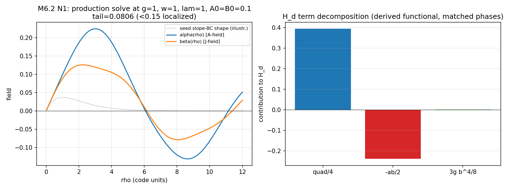
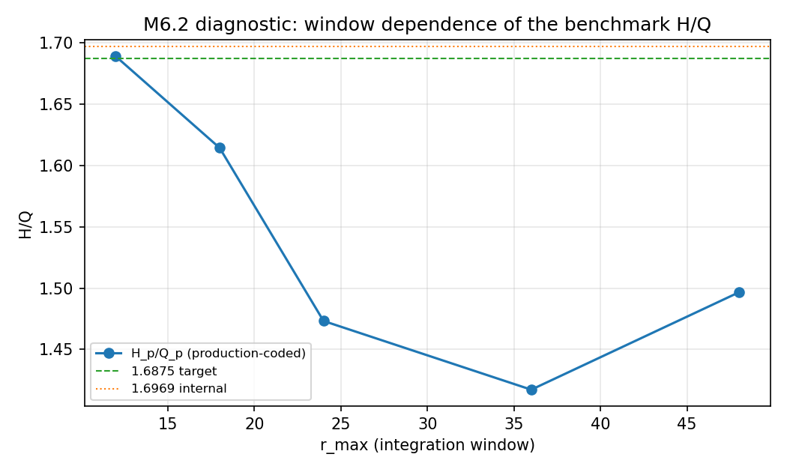

# M6.2 method note: THE DECISION GATE, H/Q under pre-registered conventions

> Task [M6.2](tasks/m6_2_task_details.md), 2026-07-20. Standard: [`dev_docs/METHOD_NOTE.md`](../../../../dev_docs/METHOD_NOTE.md). The gate's contract is the LOCK: [`m6_2_preregistration.md`](m6_2_preregistration.md) fixed every functional, convention, and the decision rule BEFORE the number was computed (file mtimes witness the order; audited, § 6 B7). Spec of record: LoE v11 via the M6.1 certification ([`m6_1_v11_convention_sheet.md`](m6_1_v11_convention_sheet.md)).

## 1. The equations

**The certified spec** (M6.1): `ℒ_ref = −¼F^{μν}F_{μν} − ¼G^{μν}G_{μν} + J^μA_μ − g(J^μJ_μ)²`, mostly-plus, code units; dynamics-of-record `□A_μ = J_μ`, `□J_μ = A_μ − 4g(J·J)J_μ`.

**The pinned reduction** (production benchmark of record): `A = φ̂ α(ρ)cos(ωt)`, `J = φ̂ β(ρ)cos(ωt)` (matched phases; printed cos/sin = labeled secondary), temporal gauge, z-independent, measure `ρdρ`.

**The derived observables** (locked § 3 of the pre-registration):

```text
⟨H⟩ = ¼∫[ω²α² + α′² + α²/ρ² + ω²β² + β′² + β²/ρ²] ρdρ − ½∫αβ ρdρ + (3/8)g∫β⁴ ρdρ
Q_d = ω∫(α² + β²) ρdρ          (joint U(1) of the complexified fields; the only derivable charge)
```

**The production-coded observables** (reference / config certificate):

```text
H_p = ∫[α′² + α²/ρ² + β′² + β²/ρ² + 4gβ⁴] ρdρ          Q_p = ∫β² ρdρ
```

**The production ODE solved for the profile (N1)**: `α″ + α′/ρ − α/ρ² + ω²α = β`, `β″ + β′/ρ − β/ρ² + ω²β = α − λβ − 4gβ³`, slope BCs, g = λ = ω = 1, A₀ = B₀ = 0.1, r ∈ [0.02, 12].

## 2. Equation-to-code map

| Object | Code | Permalink |
| --- | --- | --- |
| D0 curvilinear identities (div, curl² of φ̂f) | `m6_2_derive_functionals.py:40` | [D0](https://github.com/openwave-labs/openwave/blob/main/openwave/xperiments/m6_ouroboros/research/scripts/m6_2_derive_functionals.py#L40-L60) |
| D1 ⟨T⁰⁰⟩ both phase conventions | `:62` | [D1](https://github.com/openwave-labs/openwave/blob/main/openwave/xperiments/m6_ouroboros/research/scripts/m6_2_derive_functionals.py#L62-L95) |
| D2 no-internal-U(1) + Noether Q | `:96` | [D2](https://github.com/openwave-labs/openwave/blob/main/openwave/xperiments/m6_ouroboros/research/scripts/m6_2_derive_functionals.py#L96-L131) |
| D3 constrained EL vs production | `:132` | [D3](https://github.com/openwave-labs/openwave/blob/main/openwave/xperiments/m6_ouroboros/research/scripts/m6_2_derive_functionals.py#L132-L177) |
| D4 convention enumeration | `:178` | [D4](https://github.com/openwave-labs/openwave/blob/main/openwave/xperiments/m6_ouroboros/research/scripts/m6_2_derive_functionals.py#L178-L220) |
| N1 production solve | `m6_2_hq_decision.py:41` | [N1](https://github.com/openwave-labs/openwave/blob/main/openwave/xperiments/m6_ouroboros/research/scripts/m6_2_hq_decision.py#L41-L62) |
| N2 observables + decision rule | `:63` (rule at `:108`) | [N2](https://github.com/openwave-labs/openwave/blob/main/openwave/xperiments/m6_ouroboros/research/scripts/m6_2_hq_decision.py#L63-L114) |
| Window diagnostic | `m6_2_rmax_sensitivity.py:37` | [W](https://github.com/openwave-labs/openwave/blob/main/openwave/xperiments/m6_ouroboros/research/scripts/m6_2_rmax_sensitivity.py#L37-L64) |

Data: [`data/m6_2_derivation.json`](data/m6_2_derivation.json) · [`data/m6_2_hq_decision.json`](data/m6_2_hq_decision.json) · [`data/m6_2_rmax_sensitivity.json`](data/m6_2_rmax_sensitivity.json).

## 3. Results: the derivation (before any number)

| # | Result | Status |
| --- | --- | --- |
| DF1 | The real theory has **no exact internal U(1)**; `Q_p = ∫β²ρdρ` is not the Noether charge of any symmetry of ℒ_ref; the only derivable charge is the joint `ω∫(α²+β²)ρdρ` | ✅ measured (symbolic) |
| DF2 | The production-coded `H_p` is **not the energy of ℒ_ref under any examined convention**: it omits the ω² electric terms and the ⟨J·A⟩ cross term, and its 4g quartic matches no normalization (¼-norm gives ⅜g; the printed −F² norm gives (3/2)g) | ✅ measured (symbolic) |
| DF3 | The `⟨H⟩ − λQ` variation (fixed ω) yields the opposite ω² sign from the production ODE: the production system is not that variational problem | ✅ measured (symbolic) |
| DF4 | The production ODE = time-reduced dynamics ONLY under the mostly-MINUS reading of (J·J) (opposite to the M6.1-certified signature) plus a `−λβ` term that arises from **no reading** of (2.1)/(2.2) | ✅ measured (enumeration) |

## 4. Results: the gate

| Observable | Value | vs 1.6875 | vs 1.6969 |
| --- | --- | --- | --- |
| Reference H_p/Q_p (production-coded) | **1.688971** | 0.089% | 0.47% |
| **PRIMARY H_d/Q_d (derived)** | **0.142929** | **91.5%** | 91.6% |
| Branch H_d/Q_Jonly | 0.532557 | 68.4% | 68.6% |
| Secondary (printed phases) | 0.36194 / 1.3486 | 78.6% / 20.1% | |

The configuration certificate PASSED (1.688971 reproduces v11 § 8's 1.6890 to 0.002%: this is exactly the benchmark's electron point). The pre-registered decision rule (gap ≤ 1% survives; 1-5% partial; > 5% fails) applied to the PRIMARY: **gap = 91.5% → branch (b): the benchmark does not survive a no-search derivation.** No reported convention branch comes closer than 20% (and that branch combines the two non-derivable choices).




**Bonus closure (M6.1 C4 resolved)**: `H_p = 0.49555` at the production window gives `R_phys = ℏc·H_p/m_e = 197.327 × 0.49555/0.511 = 191.4 fm`: the unprinted `H_code` behind v11's "R_phys = 191 fm" is the production-coded H at exactly this configuration and window.

## 5. Post-gate diagnostic: the state is window-defined, not bound

The N1 profile has a zero crossing near ρ ≈ 6 and rises again at the domain edge. Widening the window:

| r_max | H_p | Q_p | H_p/Q_p | β sign changes |
| --- | --- | --- | --- | --- |
| 12 (production) | 0.496 | 0.293 | **1.6890** | 2 |
| 18 | 0.729 | 0.452 | 1.6143 | 3 |
| 24 | 0.934 | 0.634 | 1.4732 | 4 |
| 36 | 1.383 | 0.976 | 1.4172 | 6 |
| 48 | 1.895 | 1.266 | 1.4966 | 9 |

H and Q grow without bound; the profile keeps oscillating; H/Q drifts by 0.272 (16% of the claimed value) across windows, versus the claimed 0.09%-0.56% accuracy. **The "electron chaoiton" at the calibration point is not a localized bound state, and the benchmark H/Q is an integration-window artifact of r_max = 12.** This is the 1D-production-code analog of the author's own July 8 concession that the M7 3D quantity is "window-defined". The `tail < 0.15` criterion does not establish localization (the tail of a slowly damped oscillation dips below any threshold periodically).



## 6. Adversarial audit

**(pending: filled at FINISH from the independent audit agent's report, claims B1-B8 + overturn scan)**

## 7. Not computed

| Not computed | Why |
| --- | --- |
| Localized solutions of the DERIVED EL system | different task; the gate evaluates derived observables on the production profile of record |
| A search for truly bound (A₀, B₀) configurations | out of gate scope (the audit's overturn scan does a coarse check); would be new-physics exploration, not validation of the published claim |
| L, g-factor, μ/τ harmonics | the ω-ladder rides the same H/Q machinery; moot under branch (b) |
| 3D / toroidal structure | M7's territory |

## 8. Cross-links

Task: [`tasks/m6_2_task_details.md`](tasks/m6_2_task_details.md) · lock: [`m6_2_preregistration.md`](m6_2_preregistration.md) · scripts: [`scripts/m6_2_derive_functionals.py`](scripts/m6_2_derive_functionals.py), [`scripts/m6_2_hq_decision.py`](scripts/m6_2_hq_decision.py), [`scripts/m6_2_rmax_sensitivity.py`](scripts/m6_2_rmax_sensitivity.py) · sheet: [`m6_1_v11_convention_sheet.md`](m6_1_v11_convention_sheet.md) · canonical: [`m6_theory_canonical.md`](m6_theory_canonical.md) · roadmap: [`m6_roadmap.md`](m6_roadmap.md) · hunt: [`m6_particle_hunt.md`](m6_particle_hunt.md).
