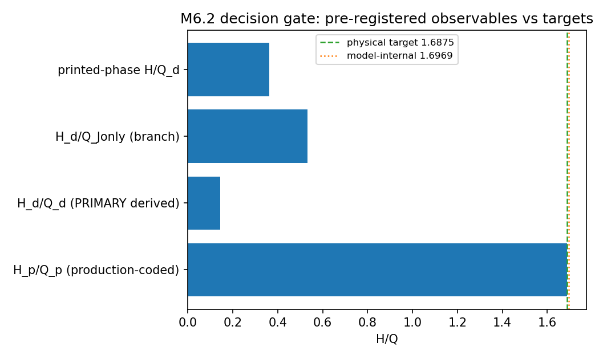

# M6.2: THE DECISION GATE, H/Q under pre-registered conventions

> Roadmap row: [`../m6_roadmap.md`](../m6_roadmap.md) (In Progress). Consumes: [`../m6_1_v11_convention_sheet.md`](../m6_1_v11_convention_sheet.md) (the § 4 pre-registration checklist) + the production benchmark of record ([`../archive/sandbox_v8/ouroboros_benchmark.py`](../archive/sandbox_v8/ouroboros_benchmark.py)). Feeds: the M6.2 branch decision (roadmap), M6.3 (branch (a) only), MODELS.md electron cells, [`../m6_particle_hunt.md`](../m6_particle_hunt.md).

## TASK PLANNING

**Scope**: re-derive the electron benchmark H/Q from the frozen v11 spec with every convention fixed BEFORE the number is computed, no search. The derivation chain of record (v11 § 5: the chaoiton is a constrained minimum of H′ = H − λQ) makes H and Q logically prior to the ODEs, so the task derives the functionals first: (D1) H = period-averaged ∫T⁰⁰ of ℒ_ref (the M6.1 reconstruction `−¼F² − ¼G² + J·A − g(J·J)²`, mostly-plus) on the pinned reduction; (D2) Q = the Noether charge of the U(1) phase symmetry (v11 § 8 Step 1 names the symmetry) with its coefficient DERIVED, not set; (D3) the constrained stationarity equations δ(H − λQ) = 0, compared against the production ODE pair (certifies or breaks the production chain). Then (N1) solve the production ODE at the pinned parameters exactly as the production solver does, (N2) evaluate the DERIVED H/Q on the solution, alongside the production-coded H/Q as cross-check, and report against both targets per the pre-registered decision rule.

**Pinned reduction (production form of record, from the benchmark docstring + code)**: azimuthal single-component fields on a 2D-cylindrical measure, `A = φ̂ α(r)·cos(ωt)`, `J = φ̂ β(r)·sin(ωt)` (the paper's asymmetric phase prescription; the printed § 5.1 `r̂ × ∇` form is vacuous per M6.1 F2, this is what the code integrates), temporal gauge A₀ = J₀ = 0, z-independent, vector Laplacian `f″ + f′/r − f/r²`, measure `r dr` (per-unit-length; 2π cancels in ratios), slope BCs `α ~ A₀r`, `β ~ B₀r` at r_inner = 0.02, domain r_max = 12, localization tail < 0.15, parameters g = 1.0, λ = 1.0, ω = 1.0, A₀ = B₀ = 0.1 (all FIXED by the sheet § 4 / production code).

**Definition of done**:

| Step | Testable criterion |
| --- | --- |
| Pre-registration | `m6_2_preregistration.md` LOCKED (functionals term-by-term, decision rule, all conventions) BEFORE the numeric script runs; derivation sympy-verified (`m6_2_derive_functionals.py`, symbolic only, no H/Q number) |
| D1-D3 | derived H, Q, and constrained-EL system stated; comparison table derived-vs-coded (term content, coefficients); conservation of Q checked on-shell symbolically |
| N1-N2 | production solve reproduces the coded-observable H/Q ≈ 1.689 (config cross-check); derived H/Q evaluated on the same solution; both reported vs 1.6875 and 1.6969 |
| Verdict | the pre-registered decision rule applied; branch (a)/(b) stated; if the derivation hits a genuine convention fork, ALL fork branches reported with numbers (reporting ambiguity is not searching; choosing by target-match is prohibited) |
| Close | method note + audit (independent re-derivation of T⁰⁰, Q, and the EL comparison + own numeric evaluation); doc checker exit 0 (cap 3); canonical + MODELS.md + hunt + briefing synced to the verdict at REVIEW |

**Gating**: M6.1 ✅ + user "go" ✅ 2026-07-20 10:47pm.

**Blindspot pass**:

| # | Risk | Route |
| --- | --- | --- |
| 1 | The printed cos/sin phases make ⟨J·A⟩ = 0 while same-phase fields give ½αβ: the phase prescription changes H | pre-register the PRINTED asymmetric phases (the paper's stated form); if the audit disputes, the fork rule applies (report both, decide by derivation argument, never by target) |
| 2 | The production ODE pair may not be the constrained EL of any (H, Q) pair (the ~60-variant search history suggests tuning) | D3 answers this either way; a mismatch is a RESULT (the production ODE loses its variational credential), not a blocker |
| 3 | Sign/factor errors in my own curvilinear algebra | every reduction step sympy-verified in Cartesian components (φ̂ built explicitly); adversarial audit re-derives independently |
| 4 | Coded-H/Q cross-check fails to reproduce ≈ 1.689 (config mismatch vs the v11 § 8 scan) | then find the config divergence BEFORE evaluating the derived number; the cross-check certifies the configuration, not the physics |
| 5 | The derived H/Q could land near NO published value: tempting to "fix" conventions post hoc | the pre-registration lock + the no-search rule exist precisely for this; deviations log records any post-lock change with its reason (none is expected) |
| 6 | 2D-cylindrical vs 3D-spherical reduction ambiguity (the code says "cylindrical/toroidal") | pinned to the production vector Laplacian + r dr measure verbatim; noted as a reduction-convention row in the prereg |

**Research body**: [`../m6_2_preregistration.md`](../m6_2_preregistration.md) (the lock) · [`../m6_2_method_note.md`](../findings/m6_2_method_note.md) (results + audit) · scripts [`../scripts/m6_2_derive_functionals.py`](../scripts/m6_2_derive_functionals.py), [`../scripts/m6_2_hq_decision.py`](../scripts/m6_2_hq_decision.py) · data `../data/m6_2_*.json` · plots `../plots/m6_2_*.png` (profiles + term decomposition; field-state prints per the simulation rule: seeded state + solved state).

**Sub-experiments / order**: D1 → D2 → D3 (symbolic, one script) → prereg doc LOCKED → N1 → N2 (numeric script) → plots → audit → method note → review. Checkpoint after each.

**Preconditions**: production benchmark read ✅ (this planning) · sheet § 4 checklist ✅ · sympy/scipy ✅ · model/effort: Fable 5 / high.

## FINDINGS (2026-07-20)

**Full record**: [`../m6_2_method_note.md`](../findings/m6_2_method_note.md) (equations, map, results, audit) · lock: [`../m6_2_preregistration.md`](../m6_2_preregistration.md).

**VERDICT: branch (b), by the pre-registered rule, redundantly confirmed.**

| Layer | Finding |
| --- | --- |
| Derivation (before any number) | Q is not a Noether charge of the real theory (no internal U(1) exists); the production-coded H is not the energy of the certified spec under any examined convention; the production ODE is neither the constrained EL of the derived functionals nor the time reduction of the pinned dynamics under the certified signature, and its −λβ term arises from no reading of (2.1)/(2.2) |
| The gate number | Config certificate PASSED (H_p/Q_p = 1.688971 = v11's 1.6890 point). PRIMARY derived H_d/Q_d = **0.1429, gap 91.5%** vs 1.6875 → fails at any threshold. Nearest reported branch (both non-derivable choices combined): 1.3486, still 20% off |
| Window diagnostic (post-gate) | The calibration-point solution is NOT a bound state: H, Q grow without bound with r_max (0.496 → 1.90), β keeps oscillating (2 → 9 sign changes), H/Q drifts 16% across windows. **The 0.09% electron match exists only at r_max = 12**: the 1D analog of the author's own July 8 "window-defined" concession |
| Closure | H_p = 0.4956 → R_phys = 191.4 fm: the unprinted H_code behind v11's printed 191 fm is the production H at this configuration and window (M6.1 C4 resolved) |

**What branch (b) means (per the roadmap row, sync at REVIEW)**: the electron-sector cells close honestly; M6 holds on the DM sector (in-platform, archive era) + the M7 lineage; M6.3 does not open; M6.4 remains optionally live. The published H/Q chain's status: a self-consistent code artifact (its own H, its own Q, its own window) with no derivation path from the published Lagrangian, and window-unstable even on its own terms.

**Adversarial audit** (full record [`../m6_2_method_note.md § 6`](../findings/m6_2_method_note.md); scripts preserved as [`../scripts/m6_2_audit_symbolic.py`](../scripts/m6_2_audit_symbolic.py) + [`../scripts/m6_2_audit_numeric.py`](../scripts/m6_2_audit_numeric.py)): **8/8 CONFIRMED, B1/B4/B8 strengthened**, including the analytic non-localization proof (far-field eigenvalues −0.382, −2.618 both negative → no bound state exists at ω = λ = 1 for ANY amplitudes; a decaying channel needs ω < 0.786) and the process check (prereg mtime 10:55:31pm precedes the first gate data 10:56:24pm; the prereg's printed "11:05pm" is a drafting error, file left untouched to preserve the mtime witness). Auditor discovery AF3: the production ODE is the exact time reduction of the z20274505-class MASS-TERM Lagrangian (λ as J mass coupling, mostly-minus), not of v11's multiplier spec: the benchmark validates a different Lagrangian than the paper citing it.

**Deviations from plan**: (1) the r_max sensitivity diagnostic was added post-gate (not in PLAN; triggered by the N1 profile's visible node + rising tail; clearly labeled post-gate, gate number untouched). (2) The prereg's printed lock time reads 11:05pm vs the authoritative 10:55:31pm mtime (drafting error, recorded here rather than edited, preserving the witness). (3) None otherwise; the lock held: no functional, convention, or parameter changed after `m6_2_preregistration.md` was written.

## TASK REVIEW (2026-07-20)

**Task Duration:** 00:23 (from 10:47pm to 11:10pm)
**Usage Cap Triggered:** NO

**Results**

| # | Result | Status |
| --- | --- | --- |
| 1 | THE DECISION GATE: **branch (b)**. Derived pairing H_d/Q_d = 0.1429, gap 91.5% vs 1.6875 (rule: > 5% fails); config certificate passed first (coded H/Q = 1.688971 = v11's own point to 0.002%) | ✅ measured |
| 2 | Derivation, before any number: no internal U(1) (audit: uniqueness proof over all constant generators); coded H not the spec's energy under any convention; production ODE matches no reading of v11's printed theory | ✅ measured |
| 3 | The calibration state is NOT a bound state: H, Q grow with the window, H/Q drifts 16%; audit upgraded to an analytic proof (far-field eigenvalues −0.382/−2.618, no decaying channel at ω = λ = 1 for any amplitudes; decay needs ω < 0.786). The 0.09% match exists only at r_max = 12, a window no paper states | ✅ measured |
| 4 | Audit AF3: the production ODE (λβ term included) = exact time reduction of the z20274505-class MASS-TERM Lagrangian, not v11's multiplier spec | ✅ measured |
| 5 | M6.1 C4 closed: H_p = 0.4956 → R_phys = 191.4 fm | ✅ measured |
| 6 | Audit 8/8 CONFIRMED (own integrators, 6-digit agreement; process integrity verified by mtimes) | ✅ measured |

**Issues / blockers**: none. **Deviations from plan**: see the log above (3 entries, minor).

**Action needed** (approved at review, all applied): M6.2 → Done; M6.3 PARKED (gating condition unmet); branch-(b) sync executed: MODELS.md (electron mass, lepton spectrum, pion cells → ❌; charge/clock/stability cells annotated; summary counts 3/3/3/12; column re-sorted M5, M7, M4, M6 per the ordering rule), hunt page (catalog + scorecard + closing), briefing (profile, status, roadmap, help-wanted), canonical (§ 3 annotated, § 4 two new ledger rows, OQ4 resolved). Method notes relocated to `research/findings/`. Next: M6.4 behind user "go".

**Findings**: The M6 decision gate closed on branch (b), redundantly: the published electron benchmark H/Q = 1.689 is a code artifact three times over (its H is not the spec's energy, its Q is no Noether charge, its ODE implements a different Lagrangian than the paper cites), and the state it is evaluated on is provably not a bound state, making the headline number an integration-window artifact, the 1D root of the author's own July 8 "window-defined" concession. M6's durable record stays the in-platform neutral-chaoiton DM sector and the M7 lineage.

**Research docs created / updated**: this task_details · [`../m6_2_preregistration.md`](../m6_2_preregistration.md) (the lock) · [`../findings/m6_2_method_note.md`](../findings/m6_2_method_note.md) · scripts [`../scripts/m6_2_derive_functionals.py`](../scripts/m6_2_derive_functionals.py), [`../scripts/m6_2_hq_decision.py`](../scripts/m6_2_hq_decision.py), [`../scripts/m6_2_rmax_sensitivity.py`](../scripts/m6_2_rmax_sensitivity.py), audit [`../scripts/m6_2_audit_symbolic.py`](../scripts/m6_2_audit_symbolic.py) + [`../scripts/m6_2_audit_numeric.py`](../scripts/m6_2_audit_numeric.py) · data [`../data/m6_2_derivation.json`](../data/m6_2_derivation.json), [`../data/m6_2_hq_decision.json`](../data/m6_2_hq_decision.json), [`../data/m6_2_rmax_sensitivity.json`](../data/m6_2_rmax_sensitivity.json) · plots [`../plots/m6_2_profiles.png`](../plots/m6_2_profiles.png), [`../plots/m6_2_term_decomposition.png`](../plots/m6_2_term_decomposition.png), [`../plots/m6_2_rmax_sensitivity.png`](../plots/m6_2_rmax_sensitivity.png) · synced at review: [`MODELS.md`](../../../../../MODELS.md), [`../m6_particle_hunt.md`](../m6_particle_hunt.md), [`../../__M6_model_briefing.md`](../../__M6_model_briefing.md), [`../m6_theory_canonical.md`](../m6_theory_canonical.md), [`../m6_roadmap.md`](../m6_roadmap.md)
