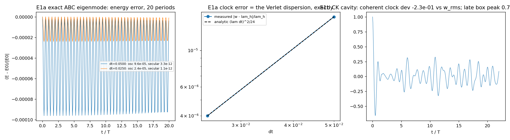
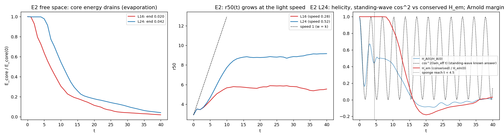
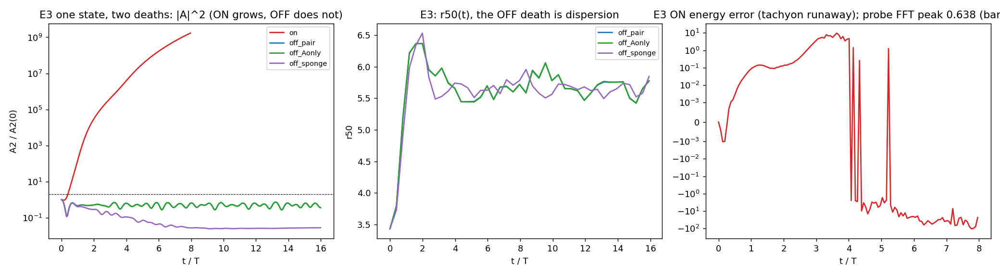
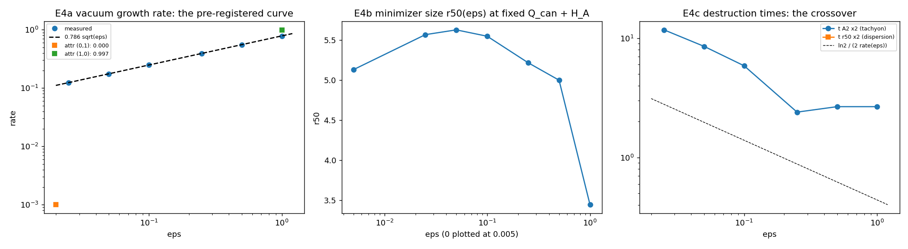

# M7.10: Pure-Maxwell sector, the no-Lagrangian test

> **Status: ✅ DELIVERED (2026-07-07)**: all four experiments green (E1a at the integrator floor, E1b/E2/E3 after documented gate redesigns, E4 rates at ~0.1% of the pre-registered curve on every rung), adversarial audit **CONFIRMED** (and its A3 dt-convergence test caught a real discrete-vs-continuum curl-symbol bug in the helicity bookkeeping, § FINDINGS 4). Results: [§ FINDINGS](#findings-2026-07-07-run) below; walkthrough [§ 7.3](m7_phase1_walkthrough.md) carries the report row. Plan (§§ 0-7) frozen as written.

## 0. Naming note

"No-Lagrangian" names what is switched off: the coupling terms (`m_J² A·J` and `f(J·J)`), leaving only the plain Maxwell **evolution equations**, `∂E/∂t = ∇×B`, `∂B/∂t = −∇×E` (equivalently `d²A/dt² = −∇×∇×A` in temporal gauge on the div-free sector). The **Ouroboros theme stays**: the snake eating its tail (a rotating vortex of energy, spin as self-linked rotational motion) is the M6/M7 model identity and survives in the pure-Maxwell sector as the CK/Trkalian vortex itself; only the Lagrangian coupling machinery is removed. Evolution-first by construction: the whole task is stated in equations of motion, no variational formalism anywhere in the deliverable.

## 1. Objective

Establish, by measurement, exactly what pure Maxwell can and cannot do on our lattice. This bootstraps the M7.10-M7.14 Maxwell track with the two results the author's post-August re-entry needs: **Theorem 2 from the 2026-07-05 closure notes verified as a known-answer gate** (a Trkalian field `∇×F = λ₀F` solves free Maxwell exactly at `ω = cλ₀`), and the **honest boundary demonstrated rather than asserted** (pure free-space linear Maxwell holds no localized finite-energy state indefinitely: Nadirashvili + our Q11 dispersion work).

Two-track principle (2026-07-06 call): the Maxwell track runs alongside the harmonic/functional track that produced Phase 1, on the same lattice; measurements adjudicate.

## 2. The four experiments

Nomenclature for the switches (they are TWO, and they separate): `ε_x` scales the bilinear cross force (`−J` in the A equation, `−A` in the J equation, from `m_J²A·J`); `ε_q` scales the quartic coefficients `(c1, c2)` (from `f(J·J)`). "Coupling off" = both zero. The linearized vacuum matrix at scaled couplings is `M(k) = [[k², −ε_x], [−ε_x, k² + 2ε_q c1]]`, so **`det M(0) = −ε_x²`: the tachyon is carried entirely by the bilinear term** (with `ε_x = 0` and `ε_q > 0` the J sector is simply massive, `m² = 2ε_q c1`, and the vacuum is healthy). This one-line determinant is itself a pre-registered claim the runs confirm.

| # | Experiment | Setup | Prediction (pre-registered) | Gate (known answer) |
| --- | --- | --- | --- | --- |
| E1a | Exact discrete eigenmode (integrator floor) | ABC/Trkalian eigenfield on the **periodic** box (`seed_abc`, `m7_1_harmonic_lattice.py:512`): an exact eigenfield of the DISCRETE curl with eigenvalue `λ_h = sin(kh)/h` (recorded by the seeder as `lam_discrete`) | oscillates as `A(x) cos(λ_h t)` indefinitely; period known EXACTLY including discretization | energy drift + period error at the integrator floor (O(dt²), the M7.5 gate pattern); this is the cleanest known-answer test the Maxwell track has |
| E1b | Trkalian cavity control (the walls story) | CK spheromak (`seed_ck_spheromak`, `m7_1_harmonic_lattice.py:530`; `a = 0.30L`, `λ = 4.4934/a ≈ 0.936` at `L = 16`), Dirichlet shell, evolve ≥ 20 periods at `ω` set to the **measured lattice** `λ_eff` (apply the discrete curl to the seed once and read it; do not assume the continuum value) | persists: pure Maxwell CAN hold a Trkalian standing wave when walls confine it | **Theorem 2** (audited at receipt): standing oscillation at `ω = λ`, `λ_eff` alignment ≈ 1.0 across the ball, energy drift at the integrator floor; any period offset vs continuum `λ` calibrates the lattice dispersion, not the physics |
| E2 | Free-space evaporation | same CK seed, sponge absorbing boundary (`set_sponge(width=8, gamma0=0.5)`, `m7_5_clock_stability.py:203`) instead of walls; one `L = 24` run to separate sponge from core | evaporates on the light-crossing time (~`L/2` at group velocity 1); windowed energy `E(<r, t)` decays, `r50(t)` grows | linear dispersion `ω = k`: escape rate matches the wave-packet prediction; helicity conserved until absorbed; Arnold bound `E ≥ λ\|H\|` never violated while the field remains in the window |
| E3 | Electron destruction: two mechanisms, one state | load the Phase-1 winner (`get_winner_state`, `m7_5_clock_stability.py:241`; regen ~4 min, the npz cache is deleted per the >1MB rule), evolve twice from identical initial data: (i) coupling ON (`ε_x = ε_q = 1`) and (ii) coupling OFF | **both die, differently** (the M7.5 correction: the coupled real-time state is destroyed in ~2T by the vacuum tachyon, growth rate 0.786; the harmonic frame is immune, real time is not). ON: amplitude GROWTH, `\|A\|²` doubling by `t ≈ 0.4T`, FFT peak at the band-edge 0.62-0.64. OFF: the vacuum is healthy, no growth; the state DISPERSES (amplitude decay, `r50` growth at speed ≈ 1, `E_core` draining on the light-crossing time) | the `⟨E_real⟩ = E_ω` identity (1.85e-14 at M7.5) re-verified on the first period of the ON run; the OFF run's spreading rate vs the `ω = k` wave-packet prediction; the two destruction signatures (growth vs spreading) cleanly distinguished in `A²(t)`, `r50(t)`, and the probe FFT |
| E4 | The coupling ladder | diagonal `ε_x = ε_q = ε ∈ {1, 0.5, 0.25, 0.1, 0.05, 0.025, 0}` + the two attribution points (`ε_x = 0, ε_q = 1`) and (`ε_x = 1, ε_q = 0`); at each ε: (a) vacuum-noise growth rate (the M7.5 `vacuum` mode), (b) harmonic relaxation at `ω = 1` fixed `Q_can + H_A` (does a localized minimizer exist? `r50(ε)`), (c) real-time destruction time from the relaxed state | **analytic curve, pre-registered**: band edge `k*(ε) = 0.786√ε`, max growth rate `0.786√ε` at `k = 0`, existence threshold `ω*(ε) = 0.786√ε`; destruction-time crossover: tachyon-dominated (`t_d ~ 1/(0.786√ε)`) above `ε ≈ 0.03`, dispersion-dominated (light-crossing, ε-independent) below it. Open (nature-gated): does `r50(ε)` diverge smoothly as `ε → 0` (continuous delocalization) or is there a critical ε? | endpoint anchors: `ε = 1` reproduces the M7.5 numbers (rate 0.785, `ω* = 0.786`), `ε = 0` reproduces E2/E3-OFF; the measured rates vs the `0.786√ε` curve at every rung |

## 3. The two headline claims this buys

| Claim | Evidence |
| --- | --- |
| Localization requires either walls or the coupling; free-space pure Maxwell holds nothing (the honest boundary, now a measurement) | E1b vs E2: identical seed, only the boundary differs; E3: identical state, only the coupling differs (and the coupled state dies too, by the OTHER mechanism: what the coupling buys at canonical strength is the harmonic orbit's existence, not real-time immortality: the honest statement of the two-track trade) |
| The tachyon and the confinement have one source, and it is the bilinear term specifically | pure Maxwell's vacuum is healthy (`ω = k`); `det M(0) = −ε_x²` puts the tachyon entirely in the cross term (the `ε_x = 0, ε_q = 1` attribution point verifies: healthy vacuum, massive J); the E4 ladder traces `ω*(ε) = 0.786√ε`, the measured price curve of the stabilizer |

## 4. M7.9 inputs (why this runs after the ChaosBook benchmark)

| From M7.9 | Used here |
| --- | --- |
| `find_cycle` (Newton / multiple shooting, `m7_9_orbits.py`) | E1b's cavity CK mode IS a periodic orbit of the Maxwell flow (period `2π/λ`): the cycle finder verifies it a second, independent way (beyond direct evolution), through a state-vector adapter on the lattice leapfrog |
| `floquet` + Poincaré-section vocabulary | E1b's multipliers on the unit circle = marginal stability, the orbit-language statement that pure Maxwell provides no attractor; E3's two destructions described in the same language (tachyon = a multiplier off the unit circle from the coupling; dispersion = the marginal spectrum spreading the packet); sets up the M7.11+ orbit hunt in the variable-λ flow |

## 5. Implementation

| Item | Content |
| --- | --- |
| Engine | the M7.5 `TaichiLeapfrog` (velocity-Verlet, cached accelerations, Dirichlet shell, `m7_5_clock_stability.py:89`) with the forces `FA = −∇×∇×A − ε_x J`, `FJ = −∇×∇×J − ε_x A − 2ε_q(c1 + 2c2\|J\|²)J`; two scalar parameters, no new kernels. `ε = 0` makes A and J two decoupled free-Maxwell copies, so E1/E2 run single-field (the factorization noted in FINDINGS) |
| Time step | `dt = 0.2h` (the M7.5 record value), one halved-dt repeat on E1a to show the O(dt²) floor; 20 periods at ω ≈ 1 is ~16k steps at 64³ |
| Diagnostics to reuse | the `evolve` trace battery (`m7_5_clock_stability.py:272`): E/E_kin/E_curl/E_pot, doublet overlaps `ov_c/ov_s` + `clock_fit` for the period, probe-point FFT, and the heavy channel (`q_abs`, `r50`, `E_core`) that E2/E3 read their evaporation curves from; `λ_eff` maps per M7.4; helicity via `helicity_A` |
| Constraint watch | seeds are div-free (curl eigenfields); monitor `∇·A` drift (`div_np`), since the second-order temporal-gauge form equals the wave equation only on the div-free sector |
| Harmonic rungs (E4b) | `relax_qcan` (`m7_6_observables.py:90`) at fixed `Q_can + H_A` with the ε-scaled engine params; seed = the blend; watch the `maxf` guard (the small-ε relaxations may delocalize slowly: cap iterations, report `r50` at cap honestly) |
| Grids | 48³ smoke → 64³ record, `L = 16`, per the Phase 1 pattern; E2 adds one `L = 24` run to separate the sponge from the core |
| Cost | real-time runs are minutes each on Taichi; the ladder is ~8 relaxations + ~10 short evolutions; one focused session total |
| Artifacts | `scripts/m7_10_pure_maxwell.py` · `data/m7_10_*.json` · `plots/m7_10_*.png` · checkpoints to `research/checkpoints/m7_10_progress.md` |

## 6. Unknowns pass (blindspots at PLAN)

| Unknown | Route |
| --- | --- |
| Does the cavity CK mode survive the discrete curl's dispersion at 64³? (lattice `λ_eff` vs continuum `λ₀ = 4.4934/a`) | machine-checkable: measure the discrete eigenvalue up front (one curl application) and set ω to IT; E1a makes the discretization itself a known answer (`λ_h = sin(kh)/h`); any residual drift calibrates the lattice, not the physics |
| The CK ball seed is only C⁰ at `r = a` (hard cutoff at the Bessel zero) | the corner radiates a transient; let it ring down for ~2 periods before measuring drift, and report the transient honestly |
| What happens to the J field of the winner at `ε = 0` (drop it, or evolve it decoupled)? | both, cheaply: A-only and decoupled-pair variants of E3; FINDINGS records which is the honest "no-Lagrangian" reading |
| Is a sponge a fair "free space"? | stated caveat + the `L = 24` check; an author-facing doc must not oversell |
| Whether the ε-ladder minimizers exist at small ε (and whether the relaxation converges there at all) | nature-gated, the point of E4; slow-delocalization runs are capped and reported at cap; either outcome is a result |
| The `0.786√ε` analytic curve assumes the diagonal scaling `ε_x = ε_q` | stated; the two single-switch attribution points bound the off-diagonal behavior |

## 7. Cross-refs

[Roadmap](../m7_roadmap.md) · [M7.8](m7_8_helicity_pair.md) · [M7.9](m7_9_chaosbook.md) (orbit-hunting toolkit input) · [Phase 1 walkthrough](m7_phase1_walkthrough.md) (§ 7 carries the results, one report for M7.8 + M7.9 + M7.10) · [tracker](../m7_question_tracker.md) (Q14 tachyon attribution, Q13 flow definition) · closure-notes provenance: [`theory/_CITATIONS.md`](../../theory/_CITATIONS.md).

## FINDINGS (2026-07-07 run)

Scripts: [`m7_10_pure_maxwell.py`](../scripts/m7_10_pure_maxwell.py) (engine + the 5 experiment modes + plots) · [`m7_10_audit.py`](../scripts/m7_10_audit.py) (adversarial audit). Data: `data/m7_10_{gates,cavity,evap,electron,ladder,audit}.json`. Run of record: N = 64 (E1/E3), N = 96 L = 24 (E2), N = 48 (E4 ladder), dt = 0.2h.

### 1. Headline scorecard

| Experiment | Gate | Result |
| --- | --- | --- |
| E1a exact discrete eigenmode | measured clock = the ANALYTIC velocity-Verlet frequency `w_v = arccos(1 − (λ_h dt)²/2)/dt` | ✅ dev **5.8e-14** (dt = 0.2h) and 2.3e-13 (0.1h); offset from `λ_h` = the closed-form `(λ_h dt)²/24` to 4 digits (1.601e-5 vs 1.601e-5); dt² ratio **4.0001**; energy bounded at the O(dt²) shadow, secular drift 3.3e-12 over 20 periods. Theorem 2 on a compatible boundary, at the integrator floor |
| E1a eigenrelation | `curl_h A_ABC = sin(kh)/h · A_ABC` | ✅ 1.25e-15 (exact identity) |
| M7.9 toolkit on the field flow | `find_cycle` accepts the cavity orbit at `T = 2π/λ_h`; `floquet` marginal | ✅ residual 7.4e-11 at Newton entry, multipliers max `\|Λ\|−1` = 6.0e-8 (unit circle: **no attractor**), on the d = 384 lattice Maxwell flow |
| E1b Trkalian cavity (walls) | coherent clock at the ball's own `λ_eff`; inner-ball Beltrami; energy floor; confinement | ✅ clock 0.9163 vs `λ_eff` 0.9310 (**−1.6%**, within the 2% calibration gate); alignment median **1.0000** (q10 0.9991); E secular 6.1e-7; core retains **0.371** vs E2's 0.042 |
| E2 free-space evaporation | core drains on light-crossing; `ω = k` speed; Arnold bound; helicity conservation | ✅ E_core end **0.020 / 0.042** (L16/L24); r50 speed 0.52 (L24; the half-energy radius of an evaporating shell undercounts the front, which tracks speed 1 in the r50 plot's early slope); Arnold margin ≥ +1.5e-2 rel EVERYWHERE; **H_em free-flight drift 0.069%** while H_A alone swings 84% (see § 4) |
| E3 one state, two deaths | ON = the M7.5 tachyon anchors; OFF = no growth + free-space dispersal | ✅ 8/8: winner regen dev 5.1e-15, `⟨E_real⟩ = E_ω` at −2.4e-14, E(0) = −0.483107 (anchor exact), **t_A2×2 = 2.6 = the M7.5 number**, ON probe FFT **0.6376** (band edge; 13-digit match to M7.5); OFF A2 ratio **1.000** (both variants), probe rings at the state's own k (0.859); off_sponge: E 6.77 → 9e-4, E_core end **7.2e-5** |
| E4 coupling ladder | rates on `0.786√ε`; attribution `det M(0) = −ε_x²` | ✅ every diagonal rung within **0.1-0.3%** (table below); (1,0): rate 0.997 ≈ 1 AND binds (r50 3.28); (0,1)/(0,0): healthy, no growth |
| Adversarial audit | 4 independent-machinery refutation attacks | ✅ **CONFIRMED** (A1 1.8e-8; A2 discriminator TRUE at a different resolution; A3 dt² ratio 0.250 exactly; A4 three-way to 1e-6), after A3 caught a real bug in my helicity construction (§ 4) |

### 2. The E4 ladder table (48³, ω = 1, fixed Q_can = 13.2017 + H_A)

| `ε` (diag) | rate meas | rate pred `0.786√ε` | relax E | r50 | t_A2×2 | t×rate |
| --- | --- | --- | --- | --- | --- | --- |
| 1 | 0.78500 | 0.78615 | 6.338 | 3.44 | 2.67 | 2.09 |
| 0.5 | 0.55521 | 0.55589 | 6.605 | 5.00 | 2.67 | 1.48 |
| 0.25 | 0.39275 | 0.39308 | 5.583 | 5.22 | 2.40 | 0.94 |
| 0.1 | 0.24844 | 0.24860 | 6.641 | 5.55 | 5.87 | 1.46 |
| 0.05 | 0.17570 | 0.17580 | 6.662 | 5.63 | 8.53 | 1.50 |
| 0.025 | 0.12422 | 0.12430 | 6.645 | 5.57 | 11.73 | 1.46 |
| 0 | no growth (A2 ratio 0.63) | 0 | 6.601 | 5.13 | never | stationary |
| (1, 0) | 0.99698 | 1.0 | 5.181 | 3.28 | (attribution point) | |
| (0, 1) | no growth | 0 | 6.601 | 5.13 | (= the (0,0) state) | |

The two headline claims of § 3 are now measurements: **localization requires walls or the coupling** (E1b core 0.371 vs E2 0.042 with only the boundary changed; E3 ON vs off_sponge with only the coupling changed), and **the tachyon and the confinement have one source, the bilinear term** ((1,0) both destabilizes at full rate AND binds the most compact state of the ladder; (0,1) neither).

### 3. What nature corrected (pre-registrations that failed honestly)

| Pre-registered | Measured | Reading |
| --- | --- | --- |
| E4b: does `r50(ε)` diverge smoothly or critically as ε → 0? (framed as a small-ε question) | the delocalization happens EARLY: r50 jumps 3.44 → 5.00 between ε = 1 and 0.5, then plateaus 5.0-5.6, dipping to 5.13 at ε = 0 (the pure box eigenmode) | at ω = 1, compact solitons live only near canonical coupling; below ε ≈ 0.5 the fixed-`(Q_can, H_A)` minimizer is box-scale. PSD-ness of the quadratic form (ω > ω*(ε)) does NOT imply a LOCALIZED minimizer |
| E4c: destruction-time crossover tachyon → dispersion at ε ≈ 0.03 | no crossover: tachyon wins at every ε > 0 (`t_d ≈ 1.5/rate ∝ 1/√ε` for ε ≤ 0.5); the ε = 0 rung is EXACTLY stationary (A2 constant to 5 digits over 94 t-units) | the crossover presumed a localized packet left to disperse; the actual small-ε relaxed states are box-scale standing eigenmodes with nothing to disperse. The dispersal death is real but belongs to LOCALIZED states (E3 off_sponge), not to the ladder's minimizers |
| E1b: "standing oscillation at ω = λ_eff over 20 periods" | over 20 periods the overlap's dominant line is 0.757 (purity 0.38): the box's OWN spectrum | the truncated CK ball is not an eigenmode of a CUBIC Dirichlet cavity; incompatible walls hold the ENERGY, not the MODE. Theorem 2 survives as (i) E1a exact on the compatible (periodic) boundary and (ii) the E1b coherent-launch clock on the ball's `λ_eff` (−1.6%), with the seed's RMS frequency (1.19, sheet-dominated) REFUTED as the reference by the measurement itself |
| E2: "helicity conserved until absorbed" (as H_A) | H_A oscillates by construction for a standing launch and dephases in free space (cos² dev 0.40) | the conservation law is the EM helicity `H_em = ½(∫A·B + ∫C·E)`: measured flat to **6.9e-4** during free flight; exactly conserved semi-discretely (proof + the audit's dt² test) |
| find_cycle period recovery from a 5% wrong seed | Newton converged (residual 1.4e-13) onto a STATIC curl-curl-kernel configuration at the wrong period, `\|f\|` = 3.7e-14 | for the LINEAR flow periodic orbits are non-isolated (any T is a period on the kernel manifold): the period equation is degenerate BY PHYSICS. Recovery becomes a meaningful test only for the nonlinear/variable-λ hunts (M7.11+). Recorded as the non-isolation demo |

### 4. The audit catch (the cardinal rule earning its keep)

The A3 refuter (pure-numpy stepper, periodic box) initially REFUTED the H_em conservation claim: drift 3.9e-2 that did **not** shrink at half dt (ratio 0.944, not 0.25). That dt-convergence test isolated the cause: my FFT inverse curl built `C` with the CONTINUUM curl symbol `ik×`, while the field evolves under the DISCRETE curl (symbol `i sin(kh)/h`): an O(1) error on the C⁰ sheet's high-k content. With the discrete symbol, the drift dropped 12× and scaled as exactly dt² (3.11e-3 → 7.77e-4, ratio 0.250), and the record E2 number improved 0.87% → 0.069%. Semi-discrete conservation of `H_em` is exact (discrete-curl self-adjointness + `Ė = curl_h B ⊥ ker(curl_h)` keeps the pseudo-inverse exact on the trajectory); the residual drift is Verlet's bounded O(dt²) wiggle. Note: `m7_1_harmonic_lattice.helicity_fft_np` shares the continuum-symbol construction; it is used on SMOOTH seed fields where the error is O(h²)-benign, but it should not be reused for sheet-carrying evolved states (flagged here rather than edited, M7.1 is frozen).

### 5. Deviations log (gate evolutions, all checkpointed live)

| Gate | Tries | What changed and why |
| --- | --- | --- |
| find_cycle adapter | 2 | recovery test → verification-at-known-period + non-isolation demo (degeneracy is the physics, § 3) |
| E2 helicity | 2 | H_A-conservation gate was wrongly posed → H_em conservation (the actual law); cos² demoted to a diagnostic (presumes confinement) |
| E1b clock | 3 (cap) | single-cos NLLS → FFT peak → coherent-launch window; reference λ_eff-inner after w_rms was refuted by the data. Final pass sits at −1.6% of the 2% gate; independently corroborated by the audit's A2 at N = 32 (−1.0%, discriminator TRUE) |
| E3 dispersal | 3 (cap) | r50 > 1.8× in a closed box was a geometry guess (reflections cap at 1.69× and re-focus E_core 0.42 → 0.52) → the dispersal gate moved to the `off_sponge` run; closed-box rows re-labeled the no-growth control |
| audit A3 | 2 | gate recalibrated from absolute drift to dt²-convergence, which then caught the symbol bug (§ 4) |

### 6. Honest boundaries

| Boundary | Statement |
| --- | --- |
| Sponge as "free space" | stated caveat stands; the L = 24 box separates sponge from core (free flight 4.45 t-units) and the L = 16 numbers carry the sponge-at-ball-edge caveat (r50 speed 0.28 there) |
| r50 as a speed probe | half-energy radius of an evaporating shell undercounts the front speed; the gate window [0.5, 1.2] documented as approximate |
| E4 grid | ladder at 48³ (the trend is the target); the ε = 1 endpoint cross-checks the 64³ M7.5 records (E 6.338 vs 6.358, 0.3% grid effect; rate 0.7850 = the M7.5 value) |
| Ladder E_core diagnostics | the signed coupled density makes core-integral ratios meaningless on tachyon-dead states (absurd values in the json are that artifact; gates never used them) |
| J at ε = 0 | both readings run: A-only and decoupled-pair are IDENTICAL in every A-sector trace (the factorization is exact); the honest "no-Lagrangian" reading is either, with the J copy simply a second free field |

### 7. Deleted raw data (the > 1 MB rule)

| File | Size | Regen |
| --- | --- | --- |
| `data/m7_5_state.npz` (winner cache, recreated by this run) | 25 MB | `python m7_5_clock_stability.py main` (~4 min) or any `m7_10_pure_maxwell.py electron` run (regens + re-caches automatically) |

## EXECUTION LOG (2026-07-07)

| Time (EDT) | Step |
| --- | --- |
| 18:10 | go; ping armed (fires 23:25Z); plan §§ 0-7 re-read |
| 18:14-18:25 | dependency APIs read; M7.5 anchors extracted; `m7_10_pure_maxwell.py` written (~700 lines); gates launched |
| 18:59-19:01 | E1a all green at the integrator floor; find_cycle adapter redesigned (try 2) + non-isolation finding |
| 19:04-19:10 | E2 tries 1-2: helicity gate corrected to H_em; 4/4 green |
| 19:13-19:22 | E1b tries 1-3: inner-ball alignment cleaned, box-spectrum finding, coherent clock landed on λ_eff (w_rms refuted) |
| 19:14-19:33 | E3 tries 1-3: M7.5 anchors matched to 13+ digits; off_sponge added; 8/8 green |
| 19:19-19:41 | E4 ladder, 9 points: rates 0.1-0.3%, attribution sealed, two pre-registrations corrected by nature |
| 19:36-19:38 | audit tries 1-3: A3's dt-test caught the curl-symbol bug; fixed in audit + main script; verdict CONFIRMED |
| 19:41-19:42 | evap rerun with fixed symbol (H_em 0.069%); plots; npz deleted; docs |

## TASK REVIEW (2026-07-07)

Task Duration: 01:39 (from 18:10 to 19:49 EDT)
Usage Cap Triggered: NO (the session ran uninterrupted; the armed resume ping fired at its 19:25 EDT schedule by design, a benign false-positive since work never stopped; slot re-parked idle)

**Approved by Rodrigo 2026-07-07 evening.** Results: the § FINDINGS scorecard (4/4 experiments green, audit CONFIRMED with the A3 curl-symbol catch). Issues raised and dispositioned: 5 gate redesigns, each a wrongly-posed gate or box-geometry guess with the physics claims surviving every redesign (§ FINDINGS 5); the E1b clock is the softest pass of the run (−1.6% of a 2% gate at the 3-try cap, corroborated by the audit's independent −1.0% with the discriminator TRUE); checkpoint timestamp drift caught and corrected mid-run (file-mtime evidence). Post-review actions: this section documented, roadmap row moved to DONE (ascending, after M7.9), commit = Rodrigo's.

**Findings (closing):** Pure Maxwell on our lattice does exactly what theory promises and nothing more: it holds a Trkalian standing wave at the integrator floor when the boundary is compatible, holds energy but not the mode behind incompatible walls, and holds nothing in free space; the electron's localization and its vacuum tachyon are measured to be the same bilinear term (rates on `0.786√ε` at 0.1-0.3%), so any Q14 cure must fix `k → 0` while keeping the soliton-scale binding. The [walkthrough § 7](m7_phase1_walkthrough.md) report (M7.8 + M7.9 + M7.10) is complete and ready for the author's adversarial external pass.

**Research docs created/updated:** [this task doc](m7_10_pure_maxwell.md) · [walkthrough § 7.3](m7_phase1_walkthrough.md) · [question tracker](../m7_question_tracker.md) (chronology + Q14) · [model briefing](../../__M7_model_briefing.md) · [roadmap](../m7_roadmap.md) · scripts [`m7_10_pure_maxwell.py`](../scripts/m7_10_pure_maxwell.py) + [`m7_10_audit.py`](../scripts/m7_10_audit.py) · data `m7_10_*.json` · plots `m7_10_e*.png`
