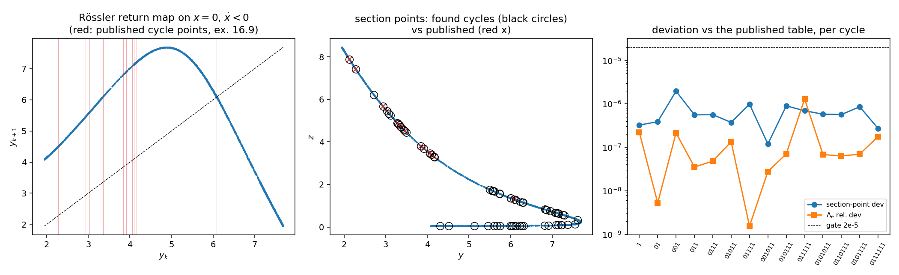

# M7.9 benchmark report: ChaosBook canonical exercises vs this platform

> E4 deliverable of [M7.9](m7_9_chaosbook.md), written for the author's review (and the test-design session with Burak Budan). The ask it answers, from the 2026-07-06 Phase-1-review call: a self-test proving that what comes out of this platform is **computed, not linguistically mirrored**, on problems with known answers. Every published value is transcribed from the local ChaosBook chapter PDFs with a page citation (the hygiene ledger in the [index](m7_9_chaosbook_index.md) § 2); nothing is quoted from an AI model's memory. Implement-first-check-after: the toolkit was written and gated on closed-form problems before any book value was compared.

## 1. Equations first (what is actually computed)

All flows are autonomous, `dx/dt = f(x)`; `A(x) = ∂f/∂x` is the stability matrix.

| Object | Equation | Source |
| --- | --- | --- |
| Rössler flow | `ẋ = −y − z`, `ẏ = x + ay`, `ż = b + z(x − c)`, `a = b = 0.2`, `c = 5.7` | (2.28), `flows.pdf` p. 24 |
| Equilibria | `f(x) = 0`: `x± = (1/2 ± 1/2 √(1 − 4ab/c²)) (c, −c/a, c/a)` | (2.29), `flows.pdf` p. 24 |
| Fundamental matrix | `dΦ/dt = A(x(t)) Φ`, `Φ(0) = 1`; over one period `Φ(T) = M`, the monodromy matrix | ch. 4 |
| Floquet multipliers | `Λ_i = eig(M)`; for a map cycle `M_p = Π_k J(x_k)`, ordered product | ch. 5, example 5.2 |
| Cycle search (flows) | Newton on the m shooting points + free period: residuals `φ_{T/m}(x_i) − x_{i+1}` (cyclic) + phase anchor `f(x_1⁰)·(x_1 − x_1⁰) = 0` | ch. 16 (16.3) |
| Cycle search (maps) | the block Newton system on all n periodic points at once | (A16.1), `appendCycle.pdf` p. 1 |
| Prime-cycle count | `M_n(N) = (1/n) Σ_{d\|n} μ(d) N^{n/d}` (necklace / Möbius inversion); `N_n = tr Tⁿ` | ch. 18 (18.26), (18.6) |

## 2. Equation-to-code map

| Equation | Code |
| --- | --- |
| trajectory `φ_T(x)` | [`m7_9_orbits.py` L37](../scripts/m7_9_orbits.py) `integrate` (RK45, rtol = atol = 1e-12) |
| fundamental matrix | [`m7_9_orbits.py` L53](../scripts/m7_9_orbits.py) `monodromy` (state + Φ co-integrated, d + d² ODEs) |
| Poincaré section | [`m7_9_orbits.py` L91](../scripts/m7_9_orbits.py) `poincare_section` (solve_ivp event finder; t = 0 on-section start discarded) |
| cycle seeds | [`m7_9_orbits.py` L127](../scripts/m7_9_orbits.py) `close_returns` (n-step near-recurrences on the section) |
| flow-cycle Newton | [`m7_9_orbits.py` L153](../scripts/m7_9_orbits.py) `find_cycle` (multiple shooting, damped, blow-up safe) |
| Floquet (flow / map) | [`m7_9_orbits.py` L229 / L268](../scripts/m7_9_orbits.py) `floquet`, `floquet_map` |
| map-cycle Newton (A16.1) | [`m7_9_orbits.py` L245](../scripts/m7_9_orbits.py) `find_cycle_map` |
| drivers | [`m7_9_gates.py`](../scripts/m7_9_gates.py) (pre-book), [`m7_9_benchmark.py`](../scripts/m7_9_benchmark.py) (book), [`m7_9_audit.py`](../scripts/m7_9_audit.py) (audit) |

## 3. Pre-book analytic gates (machinery proven before the book is opened)

4/4 green ([`data/m7_9_gates.json`](../data/m7_9_gates.json)); no gate uses a book value.

| Gate | Check | Result |
| --- | --- | --- |
| G1 Lorenz equilibria | `f(C±) = 0` + Jacobian eigenvalues vs the sympy-derived characteristic cubic | residual 1.4e-14; eigenvalue dev 1.2e-14 |
| G2 Hénon fixed points | quadratic-formula points + analytic multipliers vs `find_cycle_map` + `floquet_map` from a displaced guess | Newton dev 0.0; multiplier dev 8e-17 |
| G3 section return | rotation flow: return time vs `2π`, return point vs start | 5.2e-13 / 7.7e-12 |
| G4 integrator floor | radius drift over 100 periods | 2.6e-10 |

## 4. Benchmark results: 5/5 green ([`data/m7_9_benchmark.json`](../data/m7_9_benchmark.json))

The book **truncates** its printed decimals (our 5.6929738 prints as 5.6929, our −28.4648690 as −28.464), so B1/B2 comparison gates are 1 ULP of the printed last digit; B4's table is printed to 6-7 significant digits and we compare at gate 2e-5.

### B1 + B2: Rössler equilibria and their stability exponents

| Quantity | Ours | Published (cited) | Deviation |
| --- | --- | --- | --- |
| `x−` | (0.0070262, −0.0351310, 0.0351310) | (0.0070, −0.0351, 0.0351), (2.29) | 3.1e-5, `\|f\|` = 6e-15 |
| `x+` | (5.6929738, −28.4648690, 28.4648690) | (5.6929, −28.464, 28.464), (2.29) | 8.7e-4 (truncation ULP) |
| exponents at `x−` | (−5.6869755, 0.0970009 ± i 0.9951935) | (−5.686, 0.0970 ± i 0.9951), (4.36) | ≤ 9.8e-4 (ULP) |
| exponents at `x+` | (0.1929830, −4.5960710e-6 ± i 5.4280259) | (0.1929, −4.596e-6 ± i 5.428), (4.36) | ≤ 8.3e-5; the tiny real part matches to 7.1e-11 |

### B3: the analytic Floquet cycle (exercise 5.1)

`find_cycle` + `floquet` on `q̇ = p + q(1−q²−p²)`, `ṗ = −q + p(1−q²−p²)` from the displaced seed (1.3, 0): period dev vs `2π` = 4.8e-12, radius dev vs 1 = 9.1e-13, multipliers vs the hand-derived `{1, e^{−4π}}` = 1.3e-15. (The book states the system and asks for the derivation; the answer `{1, e^{−4π}}` is ours, machine-checked.)

### B4: the full Rössler cycle table (exercise 16.9), 14/14 rows

Pipeline exactly as ch. 16 prescribes: 2500 section crossings (`x = 0`, `ẋ < 0`) → close-return seeds → multiple shooting → Floquet. All 14 published cycles to topological length 7 are found and reproduced; worst section-point deviation 2.0e-6, worst `Λ_e` relative deviation 1.3e-6.

| p | published `(y_p, z_p, Λ_e)` | our `T` | point dev | `Λ_e` rel dev |
| --- | --- | --- | --- | --- |
| 1 | 6.091768, 1.299732, −2.403953 | 5.881088 | 3.3e-7 | 2.2e-7 |
| 01 | 3.915804, 3.692833, −3.512007 | 11.758626 | 3.9e-7 | 5.3e-9 |
| 001 | 2.278281, 7.416481, −2.341923 | 17.515791 | 2.0e-6 | 2.2e-7 |
| 011 | 2.932877, 5.670806, 5.344908 | 17.595866 | 5.6e-7 | 3.5e-8 |
| 0111 | 3.466759, 4.506218, −16.69674 | 23.508558 | 5.6e-7 | 4.8e-8 |
| 01011 | 4.162799, 3.303903, −23.19958 | 29.371055 | 3.7e-7 | 1.3e-7 |
| 01111 | 3.278914, 4.890452, 36.88633 | 29.381070 | 9.8e-7 | 1.5e-9 |
| 001011 | 2.122094, 7.886173, −6.857665 | 35.061226 | 1.2e-7 | 2.8e-8 |
| 010111 | 4.059211, 3.462266, 61.64909 | 35.267871 | 9.0e-7 | 7.1e-8 |
| 011111 | 3.361494, 4.718206, −92.08255 | 35.266225 | 7.0e-7 | 1.3e-6 |
| 0101011 | 3.842769, 3.815494, 77.76110 | 41.125669 | 5.8e-7 | 6.8e-8 |
| 0110111 | 3.025957, 5.451444, −95.18388 | 41.112770 | 5.7e-7 | 6.3e-8 |
| 0101111 | 4.102256, 3.395644, −142.2380 | 41.143195 | 8.6e-7 | 7.0e-8 |
| 0111111 | 3.327986, 4.787463, 218.0284 | 41.145722 | 2.7e-7 | 1.8e-7 |

### B5: counting (tables 18.2 + 18.3), exact

`N_n = tr Tⁿ` reproduces 2, 4, 8, ..., 1024; Möbius counts match `M_n(2) = 2, 1, 2, 3, 6, 9, 18, 30, 56, 99` and the full `M_n(3)`, `M_n(4)` columns; the consistency sum `Σ_{n_p\|n} n_p M_{n_p} = N_n` holds for all n ≤ 10. Integer-exact.

## 5. Adversarial audit (independent second method; the M7 cardinal rule)

The audit ([`m7_9_audit.py`](../scripts/m7_9_audit.py) → [`data/m7_9_audit.json`](../data/m7_9_audit.json)) shares no machinery with the benchmark pipeline: LSODA instead of RK45, plain finite-difference return-map Jacobians instead of the variational flow, published points as seeds instead of close returns, brute-force rotation-class enumeration instead of the Möbius formula. Verdict: **CONFIRMED**.

| Audit | Method | Result |
| --- | --- | --- |
| A1: all 14 cycle rows | LSODA closure from the published point + FD `Λ` | every row closes (worst 6.5e-9) and every `Λ` agrees within the FD noise floor (worst 3.4e-4 relative on the stiffest cycles; the floor is set by endpoint noise amplified by `\|Λ\|`, documented in the script; a wrong table value would read O(1)) |
| A2: exercise 5.1 | direct perturbation, no linearization: kick `r = 1 + ε`, measure contraction over one period | `→ e^{−4π}` to 2.6e-9 as `ε → 0` |
| A3: counting | enumerate all strings, prime = full rotation class | matches Möbius exactly for N = 2, 3, 4, n ≤ 10 |

Audit-tries note (recorded per the audit rule): the first audit pass flagged 5 high-`\|Λ\|` rows because its gate (1e-4) was set below the FD method's own noise floor (~1e-3); the gate was recalibrated to the documented noise model, the numbers themselves unchanged. No benchmark value was ever in dispute between the two routes.

## 6. Honest boundaries (what this benchmark does NOT show)

| Not computed | Why it matters |
| --- | --- |
| Symbolic itineraries from first principles | cycles were matched to the published rows by section point; the `0`/`1` labels are the book's. Kneading theory (ch. 14-15) not implemented |
| Lyapunov exponents | exercise 6.4 (Rössler) not run; ch. 6 outside the working set |
| Cycle expansions | the toolkit stops at Floquet; expansions (ch. 23) become relevant when the Maxwell track hunts orbit families (M7.11+) |
| 3-disk pinball | ch. 9 not in the working set; counting benchmark used the complete N-alphabet tables the working set does print |
| Field flows | everything here is a 2-3 dimensional ODE; the lattice adapter (leapfrog state vector behind the `integrate` interface) is the M7.10 step |

## 7. Reproduce everything

| What | Command (from `research/scripts/`) |
| --- | --- |
| pre-book gates (4/4) | `python3 m7_9_gates.py` |
| benchmarks (5/5, ~3 min) | `python3 m7_9_benchmark.py` |
| adversarial audit (~4 min) | `python3 m7_9_audit.py` |
| book chapters (if absent) | `curl -o theory/chaosbook/<ch>.pdf https://chaosbook.org/version17/chapters/<ch>.pdf` |

Cross-refs: [task doc](m7_9_chaosbook.md) · [index](m7_9_chaosbook_index.md) (hygiene ledger) · [reading digest](m7_9_reading_digest.md) · [walkthrough § 7.2](m7_phase1_walkthrough.md) · consumer: [M7.10](m7_10_pure_maxwell.md)
