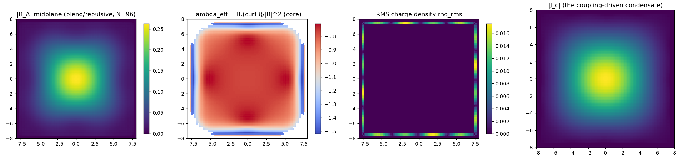
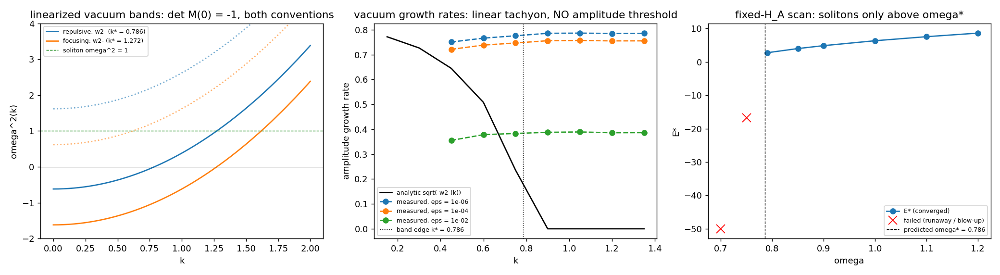
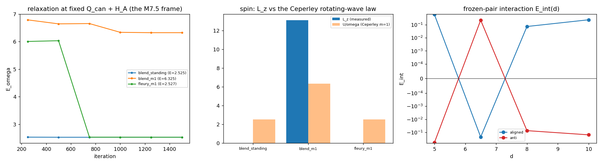

# M7 / HydroBoros: the Phase 1 walkthrough (under the hood)

> A reader-first companion to the [Phase 1 report](m7_phase1_report.md), written for a physicist who wants to see **what was actually done** before trusting it: how the stable electron candidate was found, which equations are integrated, how the numerics are kept honest, and how a one-engineer-plus-AI team runs this at all. Everything links to runnable code and raw data; nothing here rests on prose. Produced as deliverable (b) of [M7.8](m7_8_helicity_pair.md) and completed across the Phase 1 extension: **§ 7 bundles the results of all three extension tasks (M7.8 helicity pair, M7.9 ChaosBook benchmark, M7.10 pure-Maxwell no-Lagrangian test) into the one report that goes to the author**; sections marked 🚧 fill as those tasks land.

## 1. How the stable dynamical orbit was found (the discovery chain)

Both parent models are time-periodic, so the electron is sought as a **periodic orbit of the field equations**: `A, J ~ (cos ωt, sin ωt)`. The search frame, forced by the M7.3 pre-gate rather than chosen: **extremize the period-averaged energy `E_ω` at fixed canonical charge `Q_can`** (the wave action), with the rotation rate ω emerging as the Lagrange multiplier. That is textbook orbit-hunting translated to fields: find the orbit by minimizing energy at fixed action. The Legendre relation `dE*/dω = Q_can` was later verified on the lattice to 1-2%, confirming ω and `Q_can` are true conjugates.

| Step | What happened | Where |
| --- | --- | --- |
| 1. The parents' electron is NOT stable in 3D | Embedding M6's validated 1D electron into full 3D reproduced its ledger (`H/Q` to 4.7e-5) but revealed a **constrained saddle**: fixed-`Q_can` descent departs immediately and ends in focusing collapse. The M6 ansatz carries zero helicity, so nothing guards it against concentration | [`m7_3_ouroboros_3d.md`](m7_3_ouroboros_3d.md) |
| 2. Helicity makes it stable | A 6-seed × 2-convention relaxation matrix at fixed `Q_can` **+ fixed helicity `H_A = ∫A·B`**: all three helicity-carrying seeds relax to stable, finite-size, approximately-Beltrami solitons (§ 5 defines "approximately" as a number); **both zero-helicity seeds evaporate**, the control experiment inside the matrix. The balance: helicity blocks collapse (Arnold's bound `E ≥ λ₁\|H\|`), the confinement coupling blocks expansion, and the dilation probe measures a genuine interior energy minimum on every survivor | [`m7_4_charged_soliton.md`](m7_4_charged_soliton.md) ·  |
| 3. It is a real orbit in real time, and the clock is why it lives | The relaxed state handed to a real-time leapfrog: `⟨E_real⟩ = E_ω` to 1.85e-14, so the harmonic solution IS a periodic orbit of the actual evolution equations. Sharp discovery: the truncation's vacuum is tachyonic at long wavelength, and the orbit survives **only because it rotates above the unstable band**: solitons exist iff `ω ≥ ω* = 0.786` (measured: 0.70/0.75 run away, 0.79+ are clean). The de Broglie clock is the stabilizer. Also caught: the step-2 winner was a **standing** wave, not yet a rotation | [`m7_5_clock_stability.md`](m7_5_clock_stability.md) ·  |
| 4. The rotating electron | Same constrained frame, rotating `m = 1` seeds (`a_c ∝ cos φ, a_s ∝ sin φ`): relaxes to the candidate of record: `E = 6.3246`, gradient 1.6e-7, energy budget closing exactly, and a clean **`j_z = 1` per-quantum rotating wave** (0.994 in both field sectors): one unit of angular momentum per quantum of wave action, measured, never imposed | [`m7_6_observables.md`](m7_6_observables.md) ·  |
| 5. One-script reproduction | The whole chain re-earns itself from one command at two grid resolutions, engine cross-validated against an independent reference implementation to 1.4e-14 | [`m7_7_canonical.py`](../scripts/m7_7_canonical.py) · [`m7_7_consolidation.md`](m7_7_consolidation.md) |

In one sentence: **fix the action and the knottedness, let the field fall to its energy minimum, and what survives is a knotted wave rotating above the vacuum's instability band; the unknotted version dies, the knotted one cannot collapse (helicity), cannot expand (confinement), and cannot dissolve (it out-rotates the instability).**

How "stable" is evidenced, since that word carries the weight:

| Stability test | Result |
| --- | --- |
| Critical point | constrained gradient driven to `\|g\| = 1.6e-7` (an extremum, not a stalled descent) |
| Against scaling (Derrick) | measured interior minimum of `E(scale)` at fixed constraints on every survivor; the zero-helicity controls have none and evaporate |
| Against real-time perturbation | 12 full periods of leapfrog evolution, `O(dt²)` conservation, `⟨E_real⟩ = E_ω` to 1.85e-14; drift falls ×4 when dt halves |
| Against the vacuum | the orbit sits above the measured existence threshold `ω* = 0.786`; forced below it, the same construction runs away, as the dispersion predicts |

Honest boundary: what exists is a stable rotating knotted soliton with unit angular momentum per quantum **in model units**. The absolute readings (mass in `m_ec²`, spin in ℏ) hang on the units contract, now resolved as a directive (target `S_z = ℏ/2`, [tracker Q15](../m7_question_tracker.md#q15-detail)), which the M7.8 helicity-pair measurement addresses.

## 2. What is actually integrated 🚧

(M7.8 fills: the evolution equations at each stage, written as equations of motion, no variational formalism up front; the energy and charge quadratures as direct field integrals; the line-by-line equation-to-code map at `file:line` granularity, superseding section-level permalinks.)

## 3. The numerics, and why they do not explode 🚧

(M7.8 fills: velocity-Verlet / leapfrog structure; the numerical-drift history and its fix; `O(dt²)` convergence evidence and conservation traces; grid ladder 48³ → 64³ → 96³ with box `L = 16` and the 3-cell vacuum shell; what was measured when dt was halved; the honest limits at Zitter-like scales.)

## 4. The automated test suite, reported 🚧

(M7.8 fills: inventory of every gate across M7.1-M7.8 with its current pass value, auto-generated from the gate JSONs in [`data/`](../data/); known-answer tests first: Woltjer-Taylor, closed-form quadratures, engine-vs-reference cross-validation.)

## 5. "Approximately Beltrami", precisely 🚧

(M7.8 fills: `λ_eff(x) = F·(∇×F)/\|F\|²` defined, the measured 0.96 alignment and its spatial map, what deviates and why the deviation carries the charge.)

## 6. The system under the hood: one engineer, one laptop, and why that works 🚧

(M7.8 fills: the human + AI + governance loop ([`AI_HYGIENE.md`](../../../../../AI_HYGIENE.md), method notes, script-backed claims, adversarial audits); the leverage stack: GPU lattice + automatic differentiation + agent throughput + known-answer gates at every step; what this system is NOT trusted to do alone.)

## 7. The extension results: M7.8 + M7.9 + M7.10, one report 🚧

Three subsections, one per task, filled as each lands (run order M7.8 → M7.9 → M7.10):

| § | Task | What lands here |
| --- | --- | --- |
| 7.1 | [M7.8](m7_8_helicity_pair.md) helicity pair 🚧 | the run of record: `U₊/U₋` vs the closure prediction `3 + α/2 + 4f_bb`; the pair-asymmetry spin `(U₊ − U₋)/ω` vs the ℏ/2 target; both seed protocols, √3-seeded and unbiased |
| 7.2 | [M7.9](m7_9_chaosbook.md) ChaosBook benchmark 🚧 | the canonical-exercise scorecard (each implemented exercise vs its published solution: Poincaré sections, periodic-orbit finding, cycle stability); the orbit-hunting toolkit the Maxwell track uses |
| 7.3 | [M7.10](m7_10_pure_maxwell.md) pure-Maxwell no-Lagrangian test 🚧 | Theorem 2 verified as a known-answer gate (Trkalian cavity mode persists); the honest boundary as a measurement (free-space evaporation, electron destruction time with the coupling off); the coupling ladder and the tachyon-attribution result |

## 8. Reproduce everything 🚧

(M7.8 fills: the quick-mode one-liner, expected runtimes on laptop hardware, the grid ladder, raw-data locations, and the local-install path.)

---

Cross-refs: [Phase 1 report](m7_phase1_report.md) · [M7.8 task](m7_8_helicity_pair.md) · [M7.9 task](m7_9_chaosbook.md) · [M7.10 task](m7_10_pure_maxwell.md) · [canonical spec](../m7_theory_canonical.md) · [roadmap](../m7_roadmap.md) · [question tracker](../m7_question_tracker.md).
