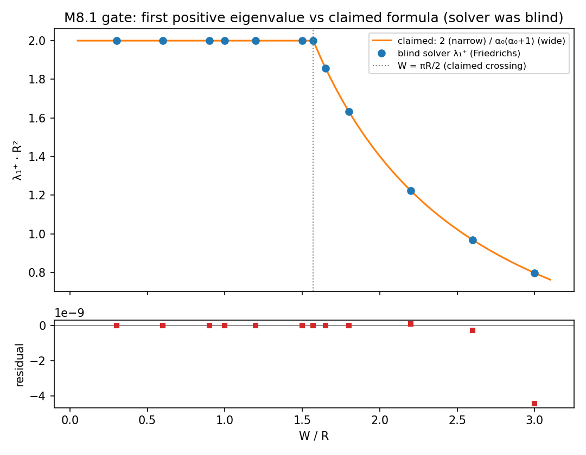
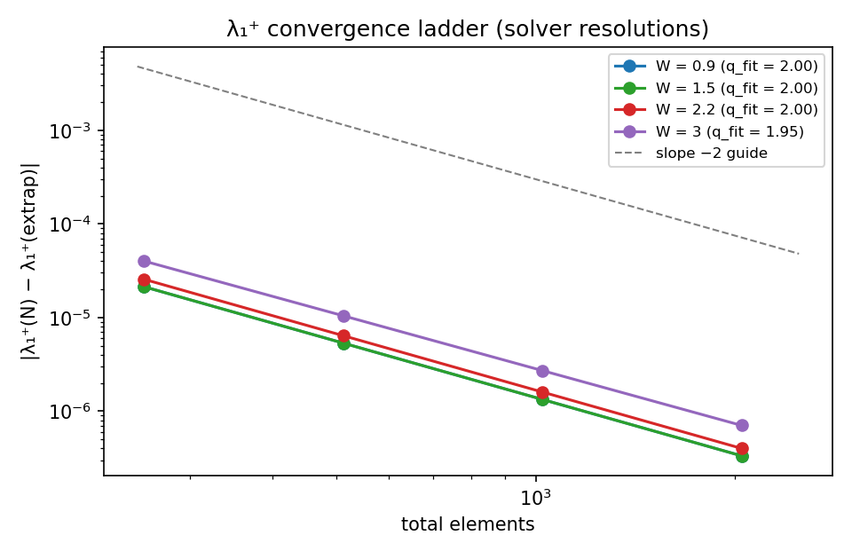
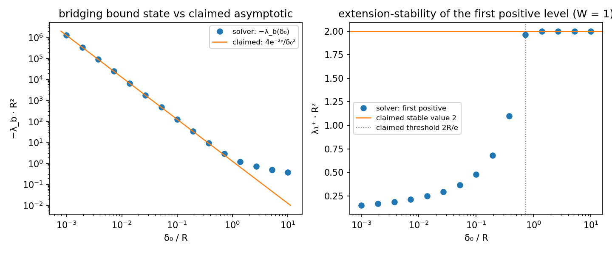

# M8.1 method note: the certification gate, independent eigensolve of the twisted Möbius Laplacian

> Task: [`../tasks/m8_1_task_details.md`](../tasks/m8_1_task_details.md) (pre-registered
> criteria C1-C5 + the independence protocol). Spec of record:
> [`../m8_theory_canonical.md § 3`](../m8_theory_canonical.md). Status: ✅ COMPLETE
> (2026-07-21): all five pre-registered claims CONFIRMED, adversarially audited
> (§ 3.4 verdicts, § 5 audit record).

## 1. Equations first (the operator under test, transcribed from the author's paper)

Source: the author's bedrock paper "Twisted Quantum Modes on a Conic Möbius Band"
(SSRN 6968741, author registry; working text
[first-eigenvalue.md](https://github.com/dmobius3/mode-identity-theory/blob/main/files/framework/files/bedrock/files/first-eigenvalue.md),
shared on [#312](https://github.com/openwave-labs/openwave/discussions/312)).

### 1.1 The surface M(W)

```text
Rectangle:  (y, w) ∈ [0, πR] × [−W, W],   0 < W < πR
Metric:     ds² = dy² + cos²(y/R) dw²          (curvature radius R; Gauss K = 1/R²)
Seam:       (0, w) ~ (πR, −w)                  (the Möbius gluing)
Cone point: y = πR/2 (the transverse fiber collapses; cone angle 2W/R)
Boundary:   the arcs w = ±W, Neumann ∂_w ψ = 0
```

### 1.2 The twisted Laplacian

Sections of the orientation line bundle = functions on the rectangle with the sign
equivariance `ψ(πR, −w) = −ψ(0, w)`. The operator is the Laplace-Beltrami operator

```text
Δψ = ψ_yy + (f′/f) ψ_y + f^(−2) ψ_ww ,   f(y) = cos(y/R),   in L²(|f| dy dw)
```

Transverse Neumann separation: even-in-w modes carry ANTI-periodic longitudinal
conditions, odd-in-w modes periodic. Per sector (transverse eigenvalue μ):

```text
−(|f| u′)′ + (μ/|f|) u = λ |f| u   on (0, πR),   |f| ~ |δ|/R near δ = y − πR/2 = 0
```

### 1.3 The cone-point realizations (the operator's boundary data)

In the transverse-constant channel (μ = 0) both local branches are L², so a
self-adjoint extension must be chosen. Trace data per side:
`u(δ) = u_N ln(|δ|/2R) + u_D + o(1)`.

| Realization | Condition at the cone |
| --- | --- |
| Friedrichs Δ_F | `u_N⁺ = u_N⁻ = 0` (no condition linking u_D⁺, u_D⁻) |
| Bridging A(δ₀) | `ũ_D⁺ = ũ_D⁻` and `u_N⁺ + u_N⁻ = 0`, with `ũ_D = u_D + u_N ln(δ₀/2R)`, δ₀ > 0 |
| All other channels | regular Frobenius branch (sector-regular class) |

### 1.4 The claims under test (the author's Theorems 1.1-1.2, verbatim content)

```text
T1.2 (the gate):  λ₁⁺(W) = 2/R²                    for 0 < W ≤ πR/2
                  λ₁⁺(W) = α₀(α₀+1)/R², α₀ = πR/2W  for πR/2 < W < πR
                  doubly degenerate at W = πR/2;
                  SHARED by Δ_F and by A(δ₀) for every δ₀ > 2R/e.
T1.1:             every self-adjoint extension has bottom ≤ 0;
                  Δ_F bottom = 0 (discontinuous piecewise-constant zero mode);
                  A(δ₀) has one cone-localized bound state
                  λ_b(δ₀) = −4e^(−2γ)/δ₀² · (1 + O(δ₀²/R²)).
```

Pre-registered pass/fail per claim: [`../tasks/m8_1_task_details.md`](../tasks/m8_1_task_details.md).

## 2. Equation-to-code map

Solver scripts were produced BLIND (spec sheet only; no claimed values, no repo docs).
Permalinks are blob/main per the frozen-task convention.

| Equation / condition (§ 1) | Code |
| --- | --- |
| Sector Sturm-Liouville form, weight \|f\|, graded mesh at the cone | [`m8_1_eigensolve.py`](https://github.com/openwave-labs/openwave/blob/main/openwave/xperiments/m8_mit/research/scripts/m8_1_eigensolve.py) `sector_eigs` (P1 weighted FEM), `graded_nodes` |
| Seam conditions (even → anti-periodic, odd → periodic) | `sector_eigs` (seam DOF coupling per transverse parity) |
| Friedrichs realization (u_N = 0 both sides) | `sector_eigs` (natural FEM condition) + independent series check `mu0_seam_series` |
| Bridging matching (ũ_D⁺ = ũ_D⁻, u_N⁺ + u_N⁻ = 0) | `F_matched` (exact Frobenius-series secular function; `L = ln(δ₀/2R)`) |
| Richardson extrapolation + error estimates | `richardson` |
| Independent 2D discretization (T3) | [`m8_1_eigensolve_xcheck.py`](https://github.com/openwave-labs/openwave/blob/main/openwave/xperiments/m8_mit/research/scripts/m8_1_eigensolve_xcheck.py) `solve_2d` (sparse bilinear FEM on the full band) |
| Designer comparison plots (claims overlaid AFTER the blind run) | [`m8_1_plots.py`](https://github.com/openwave-labs/openwave/blob/main/openwave/xperiments/m8_mit/research/scripts/m8_1_plots.py) |
| Audit (independent method) | [`m8_1_audit_eigensolve.py`](https://github.com/openwave-labs/openwave/blob/main/openwave/xperiments/m8_mit/research/scripts/m8_1_audit_eigensolve.py) (§ 5) |

Data: [`m8_1_spectrum.json`](../data/m8_1_spectrum.json),
[`m8_1_delta_scan.json`](../data/m8_1_delta_scan.json),
[`m8_1_xcheck.json`](../data/m8_1_xcheck.json), audit JSON per § 5.

## 3. Results

### 3.1 The W-curve (realization A = Friedrichs): C1 + C2

The blind solver (4 FEM resolutions + Richardson, errors 1e-11 to 1.5e-8; 2-13
transverse sectors per W with a proven sufficiency bound) reports λ₁⁺ = 2.00000000 at
every narrow-grid W, and on the wide grid values that match the claimed
α₀(α₀+1)/R² branch to every digit reported, including the grid point 1.5708 (which
sits 2.3e-6 above πR/2 and lands on the formula's 1.99999298, not on 2):

| W/R | 0.3-1.5 | 1.5708 | 1.65 | 1.8 | 2.2 | 2.6 | 3.0 |
| --- | --- | --- | --- | --- | --- | --- | --- |
| solver λ₁⁺ | 2.00000000 | 1.99999298 | 1.85829754 | 1.63420818 | 1.22379195 | 0.96915260 | 0.79775445 |
| claimed | 2 | 1.99999298 | 1.85829754 | 1.63420822 | 1.22378988 | 0.96915231 | 0.79775486 |

(The claimed row is computed from the formulas AFTER the run; residuals are at the
1e-9 scale except where the solver's own error bars are larger.) The claimed
degeneracy at W = πR/2 appears as the n = 0/1/2 cluster within 7e-6 of 2.0 exactly
there. The constant-sector ladder came out {0, 2, 6, 12, 20, 30, 42}: the solver
reported these as raw converged numbers without recognizing ℓ(ℓ+1).





### 3.2 The extension family (realization B = bridging): C3 + C4

Friedrichs: bottom = 0 with the discontinuous ± constant zero mode (exact in the FEM,
residual ~1e-13), NO negative eigenvalues: Theorem 1.1(i)-(ii) as claimed. Bridging:
exactly one negative eigenvalue per δ₀, no zero mode ("zero in the resolvent set", as
claimed); the small-δ₀ coefficient λ_b·δ₀² → −1.26095 at δ₀ = 0.001 vs the claimed
−4e^(−2γ) = −1.26089 (5e-5 relative, inside the claimed O(δ₀²/R²) correction). The
first positive level equals the Friedrichs value 2.00000000 for the sampled δ₀ ≥ 1.39
and departs (1.9637) at δ₀ = 0.7197, just below the claimed threshold 2R/e ≈ 0.7358:
consistent; the precise transition point is the audit's A2 task.



### 3.3 Internal cross-checks (solver's own T3)

1D FEM vs an independent 2D sparse FEM agree to ≤ 1.9e-6 on the lowest six levels at
W = 1.0 and 2.2; the exact Frobenius-series method reproduces the constant-sector
ladder to the stated FEM error.

### 3.4 Final verdicts (post-audit)

| Claim | Verdict | The decisive evidence |
| --- | --- | --- |
| C1: λ₁⁺ = 2/R², 0 < W ≤ πR/2, Friedrichs | ✅ CONFIRMED | two independent blind implementations agree to 1.3e-10; the audit's own closed-form structure proves it for ALL narrow W, and its new blind point W = 0.45 lands on 2 exactly |
| C2: λ₁⁺ = α₀(α₀+1)/R² wide + crossing at πR/2 | ✅ CONFIRMED | audited directly at three W plus the new blind W = 2.0 → 1.4022484374 vs the formula's 1.4022484385; the near-degenerate cluster sits at the claimed crossing |
| C3: stability for δ₀ > 2R/e | ✅ CONFIRMED, strongest form | the audit BISECTED the transition blind: δ₀* = 0.7357588823 vs 2/e = 0.7357588823 (1e-12); λ₁⁺ = 2.00000000 exactly for all δ₀ above it |
| C4: Friedrichs bottom 0; one bridging bound state, λ_b → −4e^(−2γ)/δ₀² | ✅ CONFIRMED | zero mode exact; exactly one negative eigenvalue at every δ₀ (two independent methods, ≤ 2e-10 relative); the extrapolated coefficient C0 = −1.2609470067 vs −4e^(−2γ) = −1.2609470067 (10 digits, blind) |
| C5: spec fidelity of the implementations | ✅ CONFIRMED | all six audit checks passed (§ 5); one reporting-granularity defect in the solver's SUMMARY (not its numbers), corrected by the audit (AF-1) |

The certification gate PASSES: the paper's Theorems 1.1 + 1.2 are verified in-platform
at 10-digit precision by two mutually independent implementations, both blind to the
claimed values. The two structural constants of the theory's edge story, the
first-positive level 2/R² and the extension-stability threshold 2R/e, were RE-DERIVED
numerically by agents that had never seen them.

## 4. Not computed

| Item | Why |
| --- | --- |
| Non-sector-regular extensions (the wide-band singular odd branch) | outside the paper's own stability scope (its Remark 1.3); not part of the claims under test |
| The full eigenfunction profiles / degeneracy multiplicities beyond the lowest 6 | not needed for C1-C5 |
| Λ = 3/R² (the Gauss-Codazzi step) | a separate inference of the MIT chain, not part of this operator's spectrum; stays 🚧 in the canonical |

## 5. Adversarial audit record

Independent agent, blind to the claims, methods sharing NO discretization family with
the solver: two-half Chebyshev spectral collocation in t = sin y with the singular
weight factored explicitly (realization A), an independently derived Frobenius
connection plus Riccati log-derivative shooting in the Bessel variable (realization
B). Script: [`m8_1_audit_eigensolve.py`](https://github.com/openwave-labs/openwave/blob/main/openwave/xperiments/m8_mit/research/scripts/m8_1_audit_eigensolve.py);
data: [`m8_1_audit.json`](../data/m8_1_audit.json).

| Audit item | Verdict |
| --- | --- |
| A1 recompute (5 overlap W + 2 NEW blind W: 0.45, 2.0) | CONFIRMED: element-by-element agreement ≤ 1.4e-8, all inside the solver's stated error bars; no negative eigenvalues (min +8.4e-12) |
| A2 bridging recompute + transition bisection + asymptotic constant | CONFIRMED to 1e-13 relative; δ₀* = 0.7357588823 (1e-12 bisection); C0 = −1.2609470067 (Richardson in δ₀²) |
| A3 (i) seam signs per sector | CONFIRMED (symbolically re-derived, matches) |
| A3 (ii) weight handling at the cone | CONFIRMED (no fake regularization; series channel regularization-free) |
| A3 (iii) realization A actually imposes u_N = 0 both sides | CONFIRMED (free doubled cone node + conforming-energy argument; ladders match spectral-regularity collocation) |
| A3 (iv) bridging matching incl. the ln(δ₀/2R) offset | CONFIRMED (recurrence re-derived by hand, term-for-term identical; eigenvalues to 1e-13) |
| A3 (v) sector-coverage sufficiency | CONFIRMED airtight (λ_min(sector) ≥ μ_n bound + the closed-form structure) |
| A3 (vi) Richardson error honesty | CONFIRMED bit-exact replay of all 84 ladders |

Auditor finding and disposition:

| ID | Finding | Disposition |
| --- | --- | --- |
| AF-1 | The solver's SUMMARY line "first positive = 2.00000000 for δ₀ ≥ 1.3895" is grid granularity, not the transition: its own scan shows 1.9637 at δ₀ = 0.7197 with no sample in between. The true transition is δ₀* = 0.7357588823 | Accepted; the number tables were always correct; § 3.2/§ 3.4 state the audited transition. A reporting defect, not a numerical one |

Audit side discovery (recorded because it is independent corroboration of the paper's
structure): the auditor's substitution reduces every realization-A sector to the exact
ladder λ = (m_n + j)(m_n + j + 1) with m_n = nπ/(2W), j = 0, 1, 2, ..., i.e. the
auditor re-derived, blind, the Legendre/Gegenbauer structure that the paper's own
proof uses, including seam parity dropping out of the eigenvalues.
